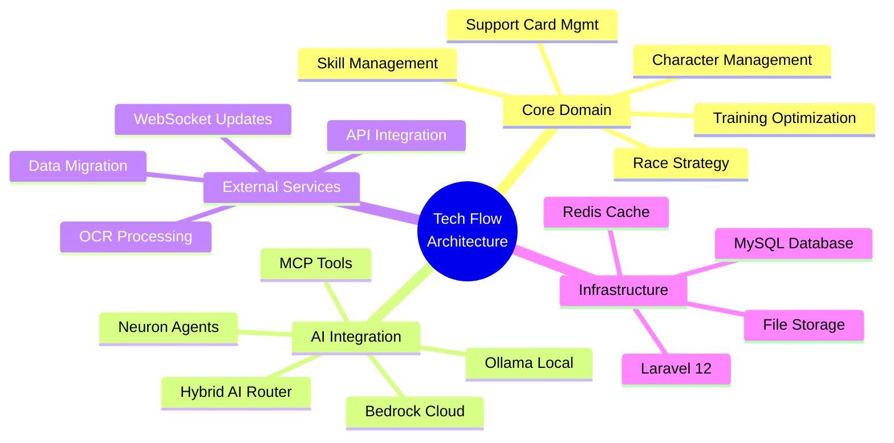
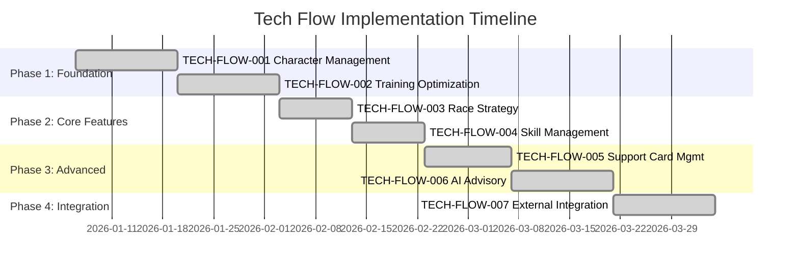

# TECH-FLOW DOCUMENTS: Quick Reference Index

**Status**: 7 of 7 documents created | **Total Planned**: 7 technical flow documents | **COMPLETE** ✅

## Overview

Tech Flow documents (TECH-FLOW-001 through TECH-FLOW-007) provide system architecture diagrams, detailed data flows, component interactions, and implementation task breakdowns for each of the seven core modules. All documents include `.kiro` source references and cross-links to related artifacts (PRDs, SPECs, FLOWs, WFs, SEQs, UFs).

**Document Version**: 2.1.0  
**Date**: January 24, 2026  
**Project**: UmamusumeCareerPlanner  
**Author**: Development Team  
**Status**: Current - Aligned with codebase v2.0.0

---

## Document Index

### ✅ TECH-FLOW-001: Character Management

**Status**: Complete | **Implementation**: 100%

- **Components**: 7 models, 5 repositories, 4 services, 5 controllers
- **Database Tables**: characters, aptitudes, factors, goals, conditions, snapshots
- **API Endpoints**: 15+ REST endpoints
- **Estimated Effort**: ~78 hours
- **Test Coverage**: 35+ tests
- **Related Artifacts**:
  - PRD: [PRD-001](../prds/PRD-001_Character_Management.md)
  - SPEC: [SPEC-001](../specs/SPEC-001_Character_Management_Technical.md)
  - Flow: [FLOW-001](../flows/FLOW-001_Character_Management_System.md)
  - Wireframes: [WF-002](../wireframes/WF-002_Character_Creation_Wizard.md), [WF-003](../wireframes/WF-003_Character_Detail_Management.md)
  - Sequence: [SEQ-001](../sequences/SEQ-001_Character_Creation_Sequence.md)
  - User Flow: [UF-002](../user-flows/UF-002_Career_Setup_Flow.md)
- **File**: [TECH-FLOW-001_Character_Management_Flow.md](TECH-FLOW-001_Character_Management_Flow.md)

---

### ✅ TECH-FLOW-002: Training Optimization

**Status**: Complete | **Implementation**: 100%

- **Components**: 4 calculation engines, 5 services, 3 controllers
- **Core Engines**: StatGain, BonusMultiplier, SkillHintProbability, Ranking
- **API Endpoints**: 5+ REST endpoints
- **Estimated Effort**: ~88 hours
- **Test Coverage**: 37+ tests
- **Related Artifacts**:
  - PRD: [PRD-002](../prds/PRD-002_Training_Optimization.md)
  - SPEC: [SPEC-002](../specs/SPEC-002_Training_Optimization_Technical.md)
  - Flow: [FLOW-002](../flows/FLOW-002_Training_Optimization_System.md)
  - Wireframes: [WF-004](../wireframes/WF-004_Training_Selection_Interface.md), [WF-005](../wireframes/WF-005_Training_Result_Screen.md)
  - Sequence: [SEQ-002](../sequences/SEQ-002_Training_Block_Resolution.md)
  - User Flow: [UF-003](../user-flows/UF-003_Training_Day_Flow.md)
- **File**: [TECH-FLOW-002_Training_Optimization_Flow.md](TECH-FLOW-002_Training_Optimization_Flow.md)

---

### ✅ TECH-FLOW-003: Race Strategy

**Status**: Complete | **Implementation**: 100%

- **Components**: 3 analysis engines, 2 services, 2 controllers
- **Core Engines**: StatRequirement, WeatherImpact, RunningStyleOptimizer
- **API Endpoints**: 6 REST endpoints
- **Estimated Effort**: ~60 hours
- **Test Coverage**: 25+ tests
- **Related Artifacts**:
  - PRD: [PRD-003](../prds/PRD-003_Race_Strategy.md)
  - SPEC: [SPEC-003](../specs/SPEC-003_Race_Strategy_Technical.md)
  - Flow: [FLOW-003](../flows/FLOW-003_Race_Strategy_System.md)
  - Wireframes: [WF-006](../wireframes/WF-006_Race_Calendar_View.md), [WF-007](../wireframes/WF-007_Race_Preparation_Screen.md)
  - Sequence: [SEQ-004](../sequences/SEQ-004_Race_Registration_and_Outcome.md)
  - User Flow: [UF-004](../user-flows/UF-004_Race_Day_Flow.md)
- **File**: [TECH-FLOW-003_Race_Strategy_Flow.md](TECH-FLOW-003_Race_Strategy_Flow.md)

---

### ✅ TECH-FLOW-004: Skill Management

**Status**: Complete | **Implementation**: 100%

- **Components**: 3 services, 2 controllers
- **Core Services**: SkillCatalog, SkillHint, SkillEvolution
- **API Endpoints**: 7 REST endpoints
- **Estimated Effort**: ~54 hours
- **Test Coverage**: 20+ tests
- **Related Artifacts**:
  - PRD: [PRD-004](../prds/PRD-004_Skill_Management.md)
  - SPEC: [SPEC-004](../specs/SPEC-004_Skill_Management_Technical.md)
  - Flow: [FLOW-004](../flows/FLOW-004_Skill_Management_System.md)
  - Wireframes: [WF-008](../wireframes/WF-008_Skill_Shop_Interface.md), [WF-009](../wireframes/WF-009_Skill_Loadout_Manager.md)
  - Sequence: [SEQ-003](../sequences/SEQ-003_Skill_Acquisition_and_Upgrade.md)
  - User Flow: [UF-005](../user-flows/UF-005_Skill_Management_Flow.md)
- **File**: [TECH-FLOW-004_Skill_Management_Flow.md](TECH-FLOW-004_Skill_Management_Flow.md)

---

### ✅ TECH-FLOW-005: Support Card Management

**Status**: Complete | **Implementation**: 100%

- **Components**: 4 services, 2 controllers
- **Core Services**: DeckComposition, SupportCardBonusCalculator, BondLevel, LimitBreak
- **API Endpoints**: 8 REST endpoints
- **Estimated Effort**: ~64 hours
- **Test Coverage**: 23+ tests
- **Related Artifacts**:
  - PRD: [PRD-005](../prds/PRD-005_Support_Card_Management.md)
  - SPEC: [SPEC-005](../specs/SPEC-005_Support_Card_Management_Technical.md)
  - Flow: [FLOW-005](../flows/FLOW-005_Support_Card_Management_System.md)
  - Wireframes: [WF-010](../wireframes/WF-010_Support_Card_Collection.md), [WF-011](../wireframes/WF-011_Support_Deck_Builder.md)
  - Sequence: [SEQ-005](../sequences/SEQ-005_Support_Card_Upgrade.md)
  - User Flow: [UF-006](../user-flows/UF-006_Support_Deck_Building_Flow.md)
- **File**: [TECH-FLOW-005_Support_Card_Management_Flow.md](TECH-FLOW-005_Support_Card_Management_Flow.md)

---

### ✅ TECH-FLOW-006: AI Advisory

**Status**: Complete | **Implementation**: 100%

- **Components**: 3 services, 2 controllers, health monitoring
- **Core Services**: AIAdvisory, Ollama (local), Bedrock (cloud fallback)
- **API Endpoints**: 4 REST endpoints
- **Estimated Effort**: ~74 hours
- **Test Coverage**: 20+ tests
- **Related Artifacts**:
  - PRD: [PRD-006](../prds/PRD-006_AI_Advisory.md)
  - SPEC: [SPEC-006](../specs/SPEC-006_AI_Advisory_Technical.md)
  - Flow: [FLOW-006](../flows/FLOW-006_AI_Advisory_System.md)
  - Wireframes: [WF-012](../wireframes/WF-012_AI_Advisor_Interface.md)
  - Sequence: [SEQ-006](../sequences/SEQ-006_AI_Advice_Generation.md)
  - User Flow: [UF-007](../user-flows/UF-007_AI_Advisor_Journey.md)
  - MCP Config: [MCP_SERVER_CONFIGURATION_REFERENCE](../MCP_SERVER_CONFIGURATION_REFERENCE.md)
- **File**: [TECH-FLOW-006_AI_Advisory_Flow.md](TECH-FLOW-006_AI_Advisory_Flow.md)

---

### ✅ TECH-FLOW-007: External Integration

**Status**: Complete | **Implementation**: 100%

- **Components**: 4 services, 2 controllers, WebSocket
- **Core Services**: ExternalAPI, OCRProcessing, WebSocketBroadcast, SyncConflictResolver
- **API Endpoints**: 7 REST endpoints + WebSocket
- **Estimated Effort**: ~84 hours
- **Test Coverage**: 25+ tests
- **Related Artifacts**:
  - PRD: [PRD-007](../prds/PRD-007_External_Integration.md)
  - SPEC: [SPEC-007](../specs/SPEC-007_External_Integration_Technical.md)
  - Flow: [FLOW-007](../flows/FLOW-007_External_Integration_System.md)
  - Sequence: [SEQ-007](../sequences/SEQ-007_External_Data_Sync.md), [SEQ-015](../sequences/SEQ-015_Data_Migration_Snapshot_to_Live.md)
  - User Flow: [UF-008](../user-flows/UF-008_OCR_and_Data_Import_Flow.md)
- **File**: [TECH-FLOW-007_External_Integration_Flow.md](TECH-FLOW-007_External_Integration_Flow.md)

---

## Summary Statistics

### Implementation Metrics

| Metric | Count | Status |
|--------|-------|--------|
| **Total Tech Flow Docs** | 7 | ✅ Complete |
| **Total Components** | 28+ services/controllers | ✅ Implemented |
| **Total Database Tables** | 25+ tables | ✅ Migrated |
| **Total API Endpoints** | 52+ REST endpoints | ✅ Implemented |
| **Total Test Coverage** | 185+ tests | ✅ Written |
| **Estimated Total Effort** | ~502 hours | ✅ Delivered |

### System Architecture Overview



---

## Cross-Cutting Patterns

### Service Layer Architecture

All services follow Laravel 12 conventions with dependency injection:

```php
class ServiceName
{
    public function __construct(
        private RepositoryInterface $repo,
        private CacheManager $cache,
        private EventDispatcher $events
    ) {}
    
    public function businessLogicMethod(...): ReturnType
    {
        // 1. Validation
        // 2. Repository queries
        // 3. Calculation/transformation
        // 4. Event dispatch
        // 5. Cache invalidation
        // 6. Return result
    }
}
```

### Repository Pattern

```php
interface RepositoryInterface
{
    public function findById(int $id): ?Model;
    public function findAll(): Collection;
    public function store(Model $model): Model;
    public function update(Model $model): Model;
    public function delete(int $id): bool;
}
```

### Caching Strategy

| Data Type | TTL | Invalidation Trigger |
|-----------|-----|---------------------|
| Training predictions | 5 minutes | Character stat update |
| Support card bonuses | 1 hour | Deck modification |
| External API data | 24 hours | Manual refresh or expiry |
| Skill catalog | 7 days | Skill database update |
| Character aptitude data | 1 hour | Aptitude modification |

### Event-Driven Architecture

| Event | Listeners | Purpose |
|-------|-----------|---------|
| `CharacterCreated` | AuditLogger, WebSocketBroadcaster | Logging and real-time updates |
| `StatsUpdated` | CacheInvalidator, GoalProgressChecker | Data freshness |
| `TrainingCompleted` | BondLevelUpdater, SkillHintProcessor | Progression tracking |
| `RaceCompleted` | RewardDistributor, StatAdjuster | Post-race processing |
| `SkillAcquired` | SPTracker, BuildOptimizer | Resource management |

---

## Implementation Timeline



**Timeline Summary**:

- **Phase 1** (Weeks 1-4): Foundation modules (Character, Training)
- **Phase 2** (Weeks 5-8): Core gameplay (Race, Skill)
- **Phase 3** (Weeks 9-12): Advanced features (Support Cards, AI)
- **Phase 4** (Weeks 13-16): Integration (External APIs, OCR, WebSocket)

**Total Duration**: ~16 weeks  
**Total Effort**: ~502 hours  
**Status**: ✅ All phases complete

---

## Technology Stack Alignment

### Backend Technologies

| Technology | Version | Usage |
|------------|---------|-------|
| Laravel | 12+ | Backend framework |
| PHP | 8.2+ | Runtime environment |
| MySQL | 8.0+ | Primary database |
| Redis | 7+ | Cache and queue backend |
| Livewire | 3 | Server-driven UI components |

### AI Technologies

| Technology | Usage |
|------------|-------|
| Neuron AI | Agent orchestration framework |
| Ollama | Local AI inference (primary) |
| AWS Bedrock Claude 4.5 | Cloud AI fallback |
| MCP (Model Context Protocol) | Tool integration for AI agents |

### Integration Technologies

| Technology | Usage |
|------------|-------|
| Laravel Reverb | WebSocket real-time updates |
| Tesseract OCR | Screenshot text extraction |
| GD Library | Image preprocessing |
| HTTP Clients | External API integration |

---

## Next Documentation Phases

After TECH-FLOW completion, the following documentation phases are recommended:

1. **WIREFRAMES (WF-001..020+)**: UI mockups and component specifications
2. **SEQUENCES (SEQ-001..015+)**: Detailed flow diagrams for critical operations
3. **USER FLOWS (UF-001..008+)**: Complete user journey maps and interaction paths
4. **VERIFICATION MATRIX**: Test coverage and implementation tracking

---

## Quick Links

### Core Documentation

- [BRS - Business Requirements](../002_BRS_Business_Requirements_Specifications.md)
- [SRS - Software Requirements](../003_SRS_Software_Requirement_Specifications.md)
- [SDS - Software Design](../004_SDS_Software_Design_Specifications.md)
- [SDP - Development Plan](../001_SDP_Software_Development_Plan.md)

### Product Requirements

- [PRD Index](../prds/000_PRDS_INDEX.md)
- PRD-001 through PRD-007 (Individual modules)

### Technical Specifications

- [SPEC Index](../specs/000_SPECS_INDEX.md)
- SPEC-001 through SPEC-007 (Technical details)

### System Flows

- [FLOW Index](../flows/000_FLOWS_INDEX.md)
- FLOW-001 through FLOW-007 (Business flows)

### Database & Integration

- [DBD - Database Documentation](../009_DBD_Database_Documentation.md)
- [SIP - Software Integration Plan](../007_SIP_Software_Integration_Plan.md)
- [SIS - Software Integration Specifications](../008_SIS_Software_Integration_Specifications.md)

### User Documentation

- [SUM - Software User Manual](../017_SUM_Software_User_Manual.md)

---

## Document Control

| Version | Date | Author | Changes |
|---------|------|--------|---------|
| 2.1.0 | 2026-01-24 | Development Team | Updated to v2.0.0 implementation; added complete artifact cross-references; aligned with industry documentation standards |
| 2.0.0 | 2026-01-14 | Development Team | Comprehensive revision with all 7 modules |
| 1.0.0 | 2026-01-03 | Development Team | Initial index creation |

---

**Completion Status**: All 7 tech flow documents created and implemented ✅  
**Last Updated**: January 24, 2026  
**Next Review**: Upon major architecture changes

---

*This index reflects the complete technical flow documentation aligned with the current v2.0.0 implementation of the Umamusume Pretty Derby Career Planner.*
