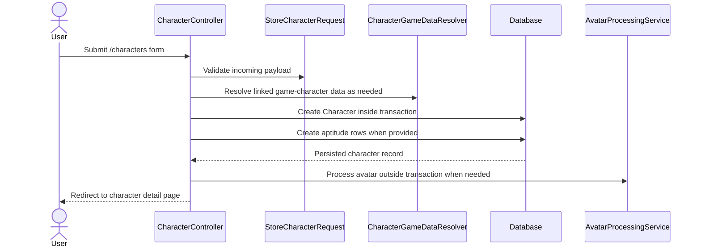

# TECH-FLOW-001: Character Management and Career State

**Document Version**: 2.4.2
**Date**: April 7, 2026
**Status**: Current controller and storage boundaries reviewed; character and career
responsibilities separated explicitly

---

## 1. Overview

This technical flow documents the current character-management architecture used by the application.
It focuses on the distinction between persistent character records, active career-run state,
browser-backed local payloads, and snapshot handling.

### Storage Mode Support

- `StorageMode::ACCOUNT`: implemented for authenticated character creation, editing, viewing, factor
management, and session selection.
- `StorageMode::LOCAL`: documented architecture path for browser-backed UUID-oriented creation and
editing flows; where server-side persistence is not implemented, the flow must be described as
client-managed and conversion-aware through [TECH-FLOW-008](TECH-FLOW-008_Storage_Mode_and_Local_Account_Conversion.md).

### Current Route Surface

- `/characters`
- `/characters/create`
- `/characters/{character}`
- `/characters/{character}/edit`
- `/characters/{character}/factors`

---

## 2. Character vs Career Responsibilities

### Character

`Character` is the persistent container for identity and selected current-state fields used by many
current web flows. `Career` remains the canonical run-level context for progression history,
reporting, snapshots, races, and training or session timelines. It commonly carries:

- identity and avatar fields
- currently exposed stats and current turn used by present-day UI flows
- current mood and energy
- aptitudes and factors
- relationships to careers, skills, and support decks

### Career

`Career` is the run-level progression record and should be treated as the canonical historical
timeline for reporting and longitudinal state. It owns:

- run phase and progression context
- training sessions, races, and skill acquisitions
- snapshot history via `RunSnapshot`
- reporting-oriented run metadata

When both models expose overlapping current-state fields, technical documentation should identify
whether the flow is using the current UI-facing character state or the canonical run-history
context.

---

## 3. Architecture Summary

| Component | Layer | Current Responsibility |
| --- | --- | --- |
| `CharacterController` | Application | Serves list, create, show, edit, update, factor-management, and session-selection routes |
| `StoreCharacterRequest` and `UpdateCharacterRequest` | Application | Validate incoming account-backed form payloads |
| `CharacterStateService` | Domain Service | Handles state updates such as energy use, turn progression, and related character mutations |
| `FactorService` | Domain Service | Handles factor-related calculations and factor-management behaviors |
| `CharacterGameDataResolver` | Domain Service | Resolves linked game-character metadata such as avatar sources |
| `AvatarProcessingService` | Domain Service | Processes uploaded or linked avatar images after character creation |
| `SnapshotService` | Domain Service | Creates, restores, compares, and cleans up career snapshots via `RunSnapshot` |
| `LocalStorageService` | Domain Service | Handles local UUID payload validation, browser-storage conventions, and local-to-account conversion |

---

## 4. Account-Backed Character Creation Flow

### Flow Notes

- Current authenticated creation is DB-backed and transactional.
- Avatar processing happens after the core transaction and is treated as non-critical post-processing.
- Factor, inheritance, and snapshot initialization should not be documented as speculative
repository calls when the controller currently writes directly through Eloquent models and dedicated
services.
- Account-backed creation assumes the authenticated account-mode path and should not be conflated
with browser-local creation.
- Local mode must not imply a server-side `POST /characters` write for guest payloads.
- Account-backed character creation assumes an authenticated session before `CharacterController::store()` is reached.
- Request validation occurs before the transaction, and any policy or ownership checks for follow-up
character mutations remain outside this create flow.

---

## 5. Storage-Aware Character Handling

### Account Mode

- Character list and detail screens use authenticated DB queries.
- `CharacterController::index()` eager-loads `aptitudes`, `gameCharacter.goalRaces`, and `currentCareer`.
- `CharacterController::show()` loads `aptitudes`, `factors`, `supportCards.supportCard`, and `gameCharacter.goalRaces`.

### Local Mode

- Local character creation and editing should be treated as browser-backed payload operations using
UUIDs and `LocalStorageService` conventions.
- Request resolution should occur through `DetectStorageMode`.
- Local payload conversion into account-backed records should follow [TECH-FLOW-008](TECH-FLOW-008_Storage_Mode_and_Local_Account_Conversion.md) and
[SEQ-017](../01-sequences/SEQ-017_Storage_Mode_Transition.md).

---

## 6. Snapshot Responsibilities

`SnapshotService` is career-oriented and currently uses:

- `Career`
- `RunSnapshot`
- eager-loaded `trainingSessions`, `races`, `skillAcquisitions`, and `character`

Technical documentation should defer snapshot creation, restoration, comparison, and cleanup to
`SnapshotService` rather than presenting snapshots as a simple per-character model with direct
restore behavior.

---

## 7. Eager Loading Requirements

Where character collections or detail views are rendered, the minimum eager-loaded relationships
should be documented explicitly. The current baseline is:

- `character.aptitudes`
- `character.factors`
- `character.gameCharacter.goalRaces`
- `character.currentCareer`
- `character.supportCards.supportCard`
- `career.trainingSessions`
- `career.races`
- `career.skillAcquisitions`

Lazy loading in loops should be treated as prohibited for list, dashboard, and report-style rendering.

---

## 8. Validation and Stat Semantics

- Character-management technical flows should not restate outdated inheritance or factor formulas as
hard truth unless they are clearly sourced from active services.
- Character creation and update docs should not describe a universal hard cap at 1200 as a game-rule statement.
- Where current services still clamp or normalize values for persistence or UI purposes, document
that as implementation behavior and keep it separate from broader gameplay soft-cap discussion.
- Stats above 1200 are valid game values. For planning purposes, the soft cap applies: points earned
above 1200 contribute at approximately 50% effectiveness in race performance calculations. Character
creation and editing flows must not reject stat inputs above 1200.

---

## 9. Related Documents

- [SEQ-001](../01-sequences/SEQ-001_Character_Creation_Sequence.md)
- [SEQ-012](../01-sequences/SEQ-012_Run_Snapshot_and_Restore.md)
- [SEQ-017](../01-sequences/SEQ-017_Storage_Mode_Transition.md)
- [TECH-FLOW-008_Storage_Mode_and_Local_Account_Conversion.md](TECH-FLOW-008_Storage_Mode_and_Local_Account_Conversion.md)
