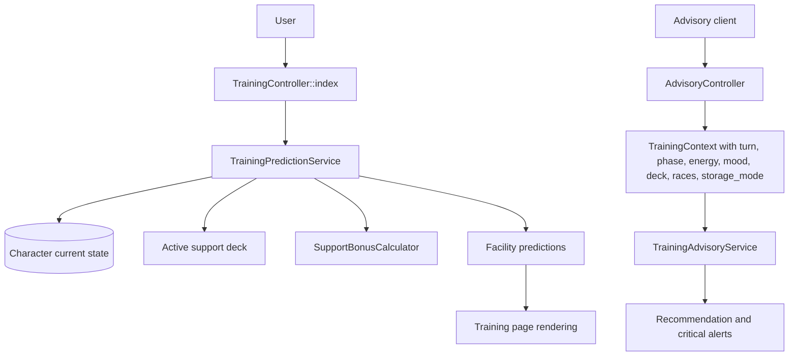
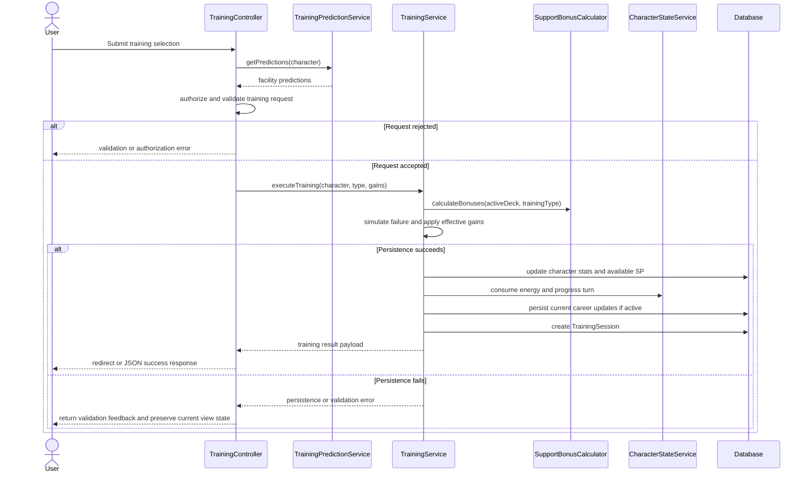

# TECH-FLOW-002: Training Optimization and Execution

**Document Version**: 2.4.2
**Date**: April 7, 2026
**Status**: Current controller and service boundaries reviewed; prediction endpoints remain
character-centric in signature while the documented decision surface stays run-context aware

---

## 1. Overview

This technical flow documents the current training prediction, recommendation, and execution
architecture. It distinguishes between the current account-backed training pages, advisory APIs that
already accept normalized context, and the broader requirement that training decisions be
interpreted through active career state rather than character identity alone.

### Storage Mode Support

- `StorageMode::ACCOUNT`: implemented for authenticated training pages and training execution routes.
- `StorageMode::LOCAL`: documented architecture path for browser-backed advisory and prediction-
style context through normalized client payloads; where server-side persistence is not implemented,
the flow must be described as advisory-only or client-managed.

### Current Route Surface

- `/characters/{character}/training`
- `/api/training/characters/{character}/predictions`
- `/api/training/characters/{character}/predictions/{facility}`
- `/api/training/characters/{character}/execute`
- `/api/advisory/training/recommendations`

---

## 2. Architecture Summary

| Component | Layer | Current Responsibility |
| --- | --- | --- |
| `TrainingController` | Application | Serves training page, account-backed prediction endpoints, and training execution |
| `TrainingPredictionService` | Domain Service | Produces current facility predictions from a `Character` and optional active support deck |
| `TrainingService` | Domain Service | Executes training, updates stats and energy, records `TrainingSession`, updates bond and hints, and progresses turns |
| `SupportBonusCalculator` | Domain Service | Applies support-deck bonus and friendship calculations |
| `BondProgressionService` | Domain Service | Updates support-card bond progression for participating cards |
| `SkillHintService` | Domain Service | Handles skill-hint side effects during training |
| `CharacterStateService` | Domain Service | Consumes energy, progresses turns, and updates stage state |
| `AdvisoryController` | API | Accepts normalized `TrainingContext` payloads including `storage_mode` |
| `TrainingAdvisoryService` | Domain Service | Produces training recommendations and critical alerts from richer run context |

### Current Limitation to Document Explicitly

Prediction endpoints currently accept account-backed `Character` context, but the decision surface
depends on active run state such as turn, phase, energy, mood, deck, and upcoming races.
Documentation should therefore distinguish current controller signatures from the broader run
context the feature logically requires.

### Advisory Context Payload Requirements

When advisory callers provide a normalized training context, the minimum field set should include:

- `storage_mode`
- `turn`
- `phase`
- `energy`
- `mood`
- active support-deck context
- upcoming race context

Payload extensions are allowed, but these core fields are the minimum for consistent recommendation output.

---

## 3. Prediction and Recommendation Flow

### Flow Notes

- Current prediction methods read from `Character` and its active support deck.
- Advisory methods already accept richer normalized context, which is the correct architectural
direction for storage-aware prediction and recommendation.
- Documentation should distinguish between the current controller signature and the broader context
actually required for good training decisions.

---

## 4. Training Execution Flow

### Current Constraints

- Training execution is currently account-backed and depends on a persisted `Character` and optional
active DB support deck.
- `TrainingService` currently updates `Character.current_stats` directly and records
`TrainingSession` rows linked to the current career.
- Current implementation details such as stat clamping or simplified gain formulas should be
documented as code behavior, not as universal game-mechanics truth.

---

## 5. Storage-Aware Training Guidance

### Account Mode

- Training pages, prediction endpoints, and execution routes operate on DB-backed `Character` records.
- Active support deck lookup currently comes from `Character.activeSupportDeck`.
- Training-session recording uses `TrainingSession` linked to the current career when available.

### Local Mode

- Local-mode training advice should be based on normalized browser-backed state rather than assumed DB identifiers.
- Storage-aware recommendation flows should pass turn, phase, energy, mood, support deck, and
upcoming race data through advisory payloads.
- Until a local execution boundary exists, docs should avoid implying that browser-local training is
persisted through the same server-side execution path.

---

## 6. Eager Loading Requirements

For training pages, dashboards, and recommendation rendering, the minimum eager-loaded relationships
should be documented explicitly:

- `character.currentCareer`
- `character.activeSupportDeck.supportCards`
- `character.skills`
- `career.trainingSessions`
- `career.races`

Lazy loading in loops should be treated as prohibited when rendering history, comparisons, or recommendation summaries.

### Cache and Invalidation Expectations

- Prediction and recommendation caches should be treated as short-lived and tied to the current
character or run context.
- Cache invalidation should occur whenever a change can affect recommendation quality, including at
least: training execution, turn progression, mood/energy updates, support-deck mutation, and
snapshot restore.
- Cache behavior belongs in services; controllers should remain orchestration-focused.

---

## 7. Validation and Stat Semantics

- Technical flows should distinguish between current stat values, per-training gain calculations,
and broader soft-cap behavior.
- Do not describe a single `0-1200` rule as the universal truth for training docs.
- Use gameplay-aware wording: stats may exceed the soft cap in broader mechanics, while concrete
persistence or execution services may still apply current implementation clamps or validation rules.
- Bond, friendship, and support-bonus wording should defer to active support and bond services
rather than restating obsolete fixed values as canonical rules.
- Per-training gains are capped at +100 per stat for stats below the soft cap (1200) and +50 per
stat for stats already at or above the soft cap; this is a game mechanic rather than a planner-only
constraint. See [SEQ-002](../01-sequences/SEQ-002_Training_Block_Resolution.md) for the full
training resolution sequence.
- Hint acquisition is a 5-level system (10%/20%/30%/35%/40% cumulative discount). Hints are gained
during training via support card Hint Lv Up events and the temporary Fast Learner condition. The
hint discount for a skill is consumed when the skill is purchased and cannot be reused.
- Wit should be documented as affecting both skill activation and race stability behavior
(including kakari avoidance), not as a skill-activation-only stat.

---

## 8. Related Documents

- [SEQ-002](../01-sequences/SEQ-002_Training_Block_Resolution.md)
- [SEQ-017](../01-sequences/SEQ-017_Storage_Mode_Transition.md)
- [TECH-FLOW-006_AI_Advisory_Flow.md](TECH-FLOW-006_AI_Advisory_Flow.md)
- [TECH-FLOW-008_Storage_Mode_and_Local_Account_Conversion.md](TECH-FLOW-008_Storage_Mode_and_Local_Account_Conversion.md)
