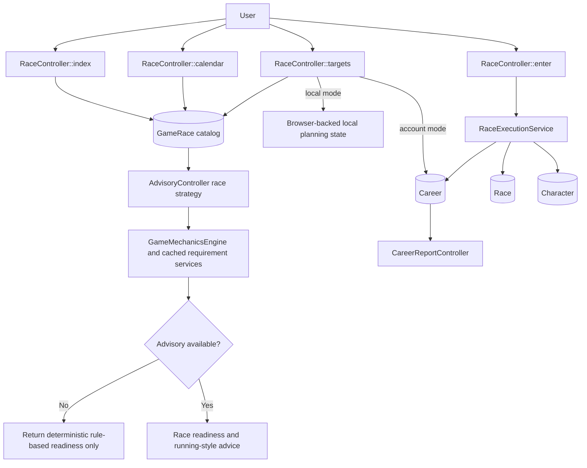
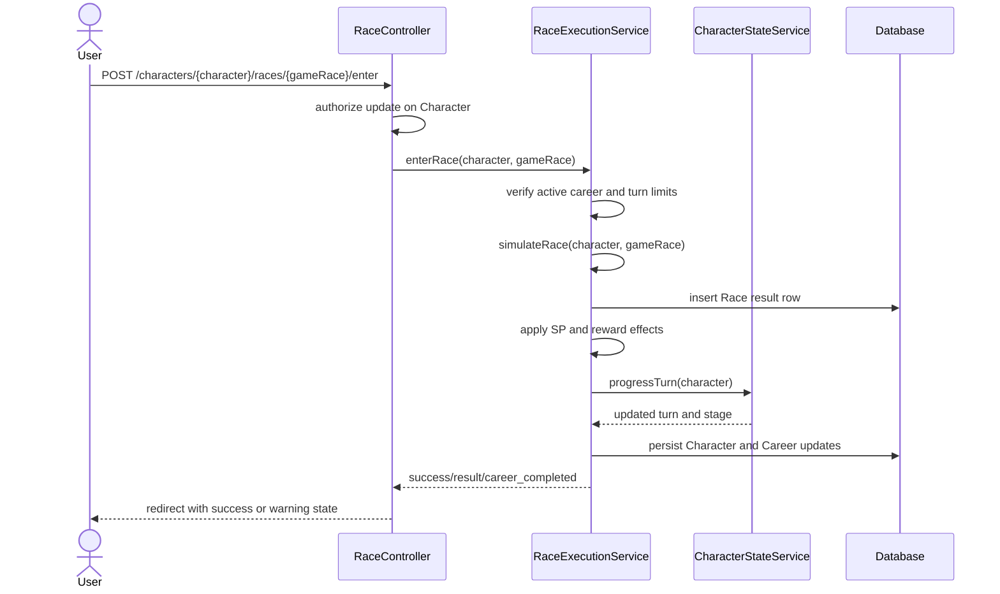

# TECH-FLOW-003: Race Strategy and Planning

**Document Version**: 2.4.2
**Date**: April 7, 2026
**Status**: Current route surface and service boundaries reviewed; local-mode planning support
remains a documented architecture requirement

---

## 1. Overview

This technical flow documents the current race catalog, planning, entry, and reporting architecture.
It is intentionally centered on the route surface and service boundaries that exist in the
repository today.

### Storage Mode Support

- `StorageMode::ACCOUNT`: implemented for authenticated race browsing, race entry, race history, and career reporting.
- `StorageMode::LOCAL`: documented architecture path for browser-backed planning and calendar
context through UUID-oriented flows; where server-side persistence is not implemented, the flow must
be described as advisory-only or client-managed.

### Current Route Surface

- `/races`
- `/races/calendar`
- `/races/targets`
- `/characters/{character}/races/{gameRace}/enter`
- `/reports/career/{career}`

API-style race strategy generation currently exists through the advisory surface instead of separate
race REST endpoints:

- `/api/advisory/race/strategy`
- `/api/advisory/race/outcome`

---

## 2. Architecture Summary

### Primary Controllers and Services

| Component | Layer | Current Responsibility |
| --- | --- | --- |
| `RaceController` | Application | Serves race catalog, calendar, targets, race details, and account-mode race entry |
| `RaceExecutionService` | Domain Service | Validates active career state, simulates race outcome, records `Race`, applies rewards, and progresses turn state |
| `CharacterStateService` | Domain Service | Advances turn and stage during race completion |
| `CareerReportController` | Application | Serves career-level reporting views and exports |
| `AdvisoryController` | API | Produces race strategy advice through the advisory pipeline |
| `RaceRequirementsCacheService` | Domain Service | Provides cached requirement and running-style calculations used by rule-based race readiness logic |
| `GameMechanicsEngine` | Domain Service | Applies canonical mechanical calculations such as stamina requirements and running-style effects |

### Canonical Domain Concepts

- `GameRace`: reference catalog row for a race in the scenario calendar
- `Race`: recorded result for an entered race during a career run
- `Character`: owns the active state and links to the current career
- `Career`: current run context used for phase, progress, and reporting
- `RunningStyle`: canonical enum for running-style decisions

Use the canonical `RunningStyle` enum in technical documentation. If localized or presentation
labels are needed, document them as UI labels over the same enum values rather than separate
strategy systems.

---

## 3. Race Planning Flow

### Flow Notes

- Controllers remain thin: route handling, authorization, and response shaping belong there.
- Readiness analysis, requirement lookup, reward calculation, and turn progression belong in services.
- Planning interfaces may exist before a persisted race entry exists. Do not collapse target
selection, readiness scoring, and race execution into a single controller action.
- Account-backed race entry must pass authenticated ownership checks before `RaceExecutionService`
mutates persisted `Character`, `Career`, or `Race` state.
- Local-mode planning should stop at browser-local planning or advisory boundaries and must not
imply server-side write access.

---

## 4. Race Entry and Result Recording

### Current Constraints

- The current server-side race execution path is account-backed and depends on an active DB `Character` and `Career`.
- Local mode planning should remain browser-backed until a verified local persistence and entry
boundary exists. In that mode, readiness review, target planning, and advisory guidance may still be
available, but server-side race entry and persisted reporting should not be implied.
- Do not document speculative register or complete race endpoints that are not registered in the current route files.

---

## 5. Storage and Persistence Rules

### Storage Mode Expectations

- Account mode uses authenticated `Character`, `Career`, and `Race` relationships.
- Local mode planning should resolve through browser-backed UUID-oriented flows and be normalized
before any advisory or conversion step.
- Local mode planning remains browser-backed and UUID-oriented until the user explicitly converts
that run through the storage transition flow.
- Any transition from local planned races to account-backed persistence should be documented through
[TECH-FLOW-008_Storage_Mode_and_Local_Account_Conversion.md](TECH-FLOW-008_Storage_Mode_and_Local_Account_Conversion.md) and
[SEQ-017](../01-sequences/SEQ-017_Storage_Mode_Transition.md).
- Technical flows must state explicitly whether a race-planning step is advisory-only, browser-
local, or account-persistent.

### Eager Loading Requirements

Where collections of related objects are rendered or analyzed, document the required eager-loaded
relationships explicitly. The minimum race and reporting set is:

- `character.currentCareer`
- `character.careers`
- `race.character`
- `career.races`
- `career.trainingSessions`
- `career.skillAcquisitions`

Lazy loading in reporting or recommendation loops should be treated as prohibited.

---

## 6. Domain Rules and Terminology

- Running-style logic should use the canonical `RunningStyle` enum rather than mixed terms like
FrontRunner or PaceChaser as separate domain types.
- Track and surface terminology should follow the currently implemented catalog values on `GameRace`
and related enums or configuration.
- Readiness logic should be deterministic first. AI advice can enrich explanation and
prioritization, but should not replace the baseline eligibility and requirement checks.
- Track condition (Firm, Good, Soft, Heavy) and weather affect race performance and are applied via
`RaceConditionService`. Readiness evaluation should account for condition and weather modifiers
where the service provides them.
- Certain race grades (including G1 races) require a minimum fan count for entry eligibility. Race
readiness checks must include fan count thresholds as part of the prerequisite evaluation, not only
stat and aptitude requirements.

### Readiness Determinants

Deterministic readiness should evaluate at least these inputs before optional AI explanation is applied:

- race prerequisites from `GameRace` and requirement services
- fan count eligibility thresholds
- current stat readiness against race demands
- aptitude grade impact
- track and weather conditions when available

### Aptitude Modifier Reference

Use the game-accurate baseline below for readiness weighting:

| Aptitude Grade | Typical Readiness Modifier |
| --- | --- |
| S | Positive modifier |
| A | Baseline |
| B | Mild penalty |
| C | Moderate penalty |
| D | Strong penalty |
| E | Large penalty |
| F | Severe penalty |
| G | Extreme penalty |

For exact values and category-specific differences, follow the authoritative flow and glossary references.

---

## 7. Related Documents

- [FLOW-003](../01-flows/FLOW-003_Race_Strategy_System.md)
- [SEQ-004](../01-sequences/SEQ-004_Race_Registration_and_Outcome.md)
- [SEQ-017](../01-sequences/SEQ-017_Storage_Mode_Transition.md)
- [TECH-FLOW-008_Storage_Mode_and_Local_Account_Conversion.md](TECH-FLOW-008_Storage_Mode_and_Local_Account_Conversion.md)
- [TECH-FLOW-009_Target_Race_Planning_Flow.md](TECH-FLOW-009_Target_Race_Planning_Flow.md)
- [TECH-FLOW-010_Career_Reporting_Flow.md](TECH-FLOW-010_Career_Reporting_Flow.md)
