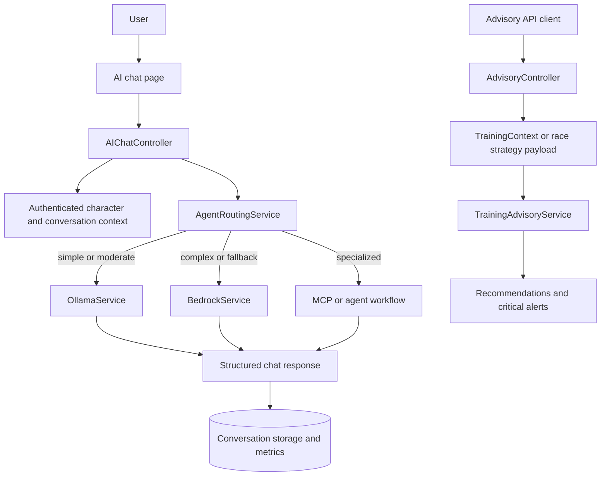

# TECH-FLOW-006: AI Advisory and Chat Orchestration

**Document Version**: 2.4.2
**Date**: April 7, 2026
**Status**: Current provider and config boundaries reviewed; provider examples are illustrative and
not authoritative runtime values

---

## 1. Overview

This technical flow documents the current AI interaction surface in two parts:

- authenticated AI chat via `AIChatController`
- advisory APIs via `AdvisoryController` and `TrainingAdvisoryService`

It also clarifies how provider routing, MCP usage, and configuration-backed model selection work in
the current repository.

### Storage Mode Support

- Account mode: implemented through authenticated controllers and DB-backed character or career context.
- Local mode: supported where advisory payloads provide normalized state directly, including
`storage_mode` and run identifiers.

### Configuration Source of Truth

Provider names, model identifiers, timeouts, and base URLs must be treated as configuration-driven
values from the active config files:

- `config/ai.php`
- `config/neuron.php`
- AWS configuration consumed by `BedrockService`

Any endpoint or model values shown in this document are examples of the current code path, not long-
term contractual constants.

---

## 2. Current Route Surface

### Web Routes

- `/ai/chat`
- `/ai/dashboard`

### Chat API Surface

- `/api/ai/message`
- `/api/ai/message/stream`
- `/api/ai/server-status`
- `/api/ai/models`

### Advisory API Surface

- `/api/advisory/training/recommendations`
- `/api/advisory/skills/advice`
- `/api/advisory/race/strategy`
- `/api/advisory/critical/detect`
- `/api/advisory/training/outcome`
- `/api/advisory/race/outcome`

---

## 3. Architecture Summary

| Component | Layer | Current Responsibility |
| --- | --- | --- |
| `AIChatController` | Application | Serves chat UI, validates chat requests, builds authenticated context, and delegates routing |
| `App\Services\MCP\AgentRoutingService` | Domain Service | Chooses between Ollama, Bedrock, or specialized agent paths based on request complexity, availability, and cost |
| `HybridAIService` | Domain Service | Provides hybrid provider execution and fallback logic for AI processing and RAG enhancement |
| `OllamaService` | Provider Service | Handles local Ollama generation and streaming with config-backed model selection |
| `BedrockService` | Provider Service | Handles Bedrock invocation using AWS-backed configuration and availability checks |
| `AdvisoryController` | API | Accepts structured training, skill, and race context payloads and returns advisory outputs |
| `TrainingAdvisoryService` | Domain Service | Produces recommendations and critical alerts from normalized `TrainingContext` and related value objects |

### MCP Optionality

- MCP is a capability layer, not a guaranteed requirement for every AI request.
- `config/ai.php` and `config/neuron.php` allow MCP-related features to be enabled or disabled per environment.
- Documentation should not imply that MCP is mandatory for core chat or advisory routes.

---

## 4. Chat and Advisory Flow

### Flow Notes

- AI chat is authenticated and can hydrate DB-backed character context before routing.
- Advisory APIs are storage-mode aware because callers provide normalized payloads, including
`storage_mode` and run identifiers.
- Rule-based and service-backed recommendation logic remains valid even when no heavy provider call is required.

---

## 5. Storage-Aware Context Rules

### Account Mode

- Controllers may load DB-backed `Character`, `Career`, `aptitudes`, `skills`, and conversation
history for the authenticated owner.
- Any saved conversation, metrics, or provider usage records must remain owner-scoped.

### Local Mode

- Advisory requests should derive context from browser-backed or client-normalized state where supported.
- Local-mode AI context should not assume DB identifiers exist.
- When local state is later converted to account mode, follow the storage transition rules
documented in [SEQ-017](../01-sequences/SEQ-017_Storage_Mode_Transition.md).

---

## 6. Provider and Security Notes

- `OllamaService` uses configuration-backed host, timeout, token, and model settings.
- `BedrockService` depends on AWS credentials and Bedrock region or configuration; unavailable
credentials should be treated as an availability condition, not silently ignored in documentation.
- Model IDs and cost assumptions change over time. Keep docs illustrative and refer readers to
configuration for operational truth.
- AI conversations, OCR-derived context, and advisory payloads should document retention,
authorization, and redaction requirements when expanded further.

### Fallback and Rate-Limit Expectations

- Provider selection and fallback order should remain service-driven through routing and hybrid
service layers, not hardcoded in controllers.
- If a provider is unavailable, throttled, or times out, fallback behavior should degrade
predictably and still return a structured advisory error payload.
- Chat and advisory endpoints should document and enforce rate-limiting policy at the route or
middleware layer, especially for streaming and high-frequency advisory calls.

---

## 7. Performance and Eager Loading

- Avoid lazy-loading per-message or per-recommendation character context in loops.
- For chat requests with a character context, the minimum eager-loaded set currently includes:
  - `currentCareer`
  - `aptitudes`
  - `skills`
- Cache, route, and provider-selection behavior should remain in services rather than controllers.

---

## 8. Related Documents

- [FLOW-006](../01-flows/FLOW-006_AI_Advisory_System.md)
- [SEQ-006](../01-sequences/SEQ-006_AI_Advice_Generation.md)
- [SEQ-017](../01-sequences/SEQ-017_Storage_Mode_Transition.md)
- [TECH-FLOW-008_Storage_Mode_and_Local_Account_Conversion.md](TECH-FLOW-008_Storage_Mode_and_Local_Account_Conversion.md)
