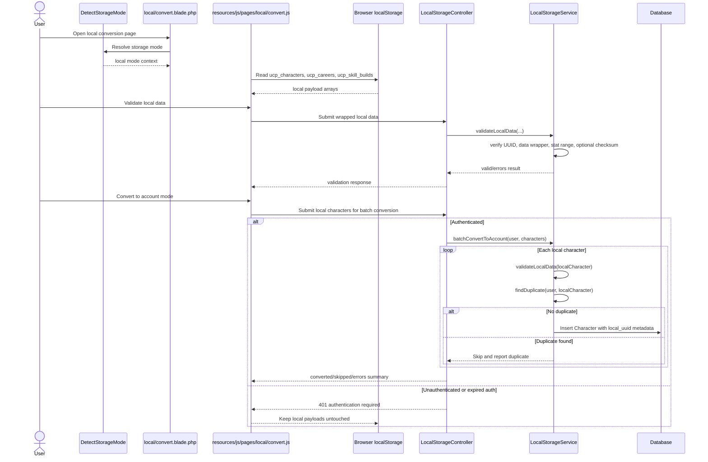

# TECH-FLOW-008: Storage Mode and Local-Account Conversion

**Document Version**: 2.4.2
**Date**: April 7, 2026
**Status**: Added to document the dual-storage architecture and the current local-to-account conversion path

---

## 1. Overview

This technical flow documents the dual-storage architecture used by the application. It covers
storage-mode detection, browser-backed local payload handling, session-mode switching, authenticated
conversion into account-backed records, duplicate handling, and local cleanup policy.

### Current Storage Modes

- `StorageMode::LOCAL`: browser-backed storage with UUID-oriented payloads and guest or offline-friendly behavior
- `StorageMode::ACCOUNT`: authenticated DB-backed storage with numeric IDs and relational queries

### Current Conversion Scope

- Current server-side conversion persists local character payload wrappers into `Character` rows.
- The current conversion page also reads local careers and skill builds for user awareness, but
`LocalStorageService::batchConvertToAccount()` currently converts character payloads only.

### Current Non-Converted Scope

The following local artifacts are currently out of scope for server-side conversion and should be
documented as non-converted until implementation exists:

- local career progression history
- skill-build planning payloads
- support-deck planning payloads
- race-target planning payloads

---

## 2. Key Components

| Component | Layer | Current Responsibility |
| --- | --- | --- |
| `StorageMode` | Domain Enum | Defines local vs account behavior and default request resolution |
| `DetectStorageMode` | Middleware | Resolves route, session, and auth-driven mode selection and shares it with views |
| `LocalStorageService` | Domain Service | Generates UUIDs, validates wrapped local payloads, stores session mode, and converts local character data into account-backed records |
| `LocalStorageController` | API | Exposes status, mode switching, validation, conversion, and UUID endpoints |
| `local/convert.blade.php` | Presentation | Displays local counts, validation status, and conversion options |
| `resources/js/pages/local/convert.js` | Client Module | Reads browser keys and submits validation or conversion requests |

### Browser Keys Read by the Current Conversion UI

- `ucp_characters`
- `ucp_careers`
- `ucp_skill_builds`

---

## 3. Mode Resolution Rules

`DetectStorageMode` and `StorageMode::fromRequest()` resolve mode in this order:

1. `/local` route prefix forces local mode
2. valid `storage_mode` session value
3. authenticated request defaults to account mode
4. guest request defaults to local mode

Technical flows that omit this resolution order will drift quickly when mixing authenticated and guest-facing screens.

---

## 4. Conversion Flow

---

## 5. Validation and Duplicate Rules

### Validation Rules

- UUID must be present and valid.
- Wrapped `data` payload must exist and be an array.
- Known stat fields are validated against the storage-layer `0` to `2000` safety range implemented
by `LocalStorageService`.
- This validation protects persistence boundaries and should not be confused with gameplay balancing
or soft-cap explanations elsewhere in the docs.
- Checksum validation is optional. `LocalStorageService` compares checksum values only when the
incoming payload includes one.

### Duplicate Handling

- Current duplicate detection is conservative and name-based for the authenticated user.
- The current implementation does not match on scenario, timestamps, careers, or semantic build identity.
- Duplicate matches are skipped and reported per item instead of aborting the whole batch.

---

## 6. Persistence Notes

- Converted account rows currently retain the local source UUID in `Character.local_uuid`.
- `local_uuid` currently acts as migration metadata on the inserted record.
- Broader reuse semantics such as sync, indexing, or cross-entity dedupe are not yet defined by the
current conversion service.
- Careers, skill builds, support decks, snapshots, and race-planning state need separate storage-
aware flows when they gain server-side conversion support.
- Careers, skill builds, support decks, snapshots, and race-planning state need separate
storage-aware flows when they gain server-side conversion support.

---

## 7. Implementation Risks to Watch

- Documentation and frontend payload shape can drift if route registration or request contracts change.
- Any new feature that reads or writes user state must say explicitly whether it operates in local
mode, account mode, or both.
- Controllers should remain thin; storage-mode selection and conversion rules belong in middleware and services.

---

## 8. Related Documents

- [SEQ-017](../01-sequences/SEQ-017_Storage_Mode_Transition.md)
- [SEQ-001](../01-sequences/SEQ-001_Character_Creation_Sequence.md)
- [TECH-FLOW-001_Character_Management_Flow.md](TECH-FLOW-001_Character_Management_Flow.md)
- [TECH-FLOW-006_AI_Advisory_Flow.md](TECH-FLOW-006_AI_Advisory_Flow.md)
- [TECH-FLOW-003_Race_Strategy_Flow.md](TECH-FLOW-003_Race_Strategy_Flow.md)
- [TECH-FLOW-009_Target_Race_Planning_Flow.md](TECH-FLOW-009_Target_Race_Planning_Flow.md)
- [TECH-FLOW-010_Career_Reporting_Flow.md](TECH-FLOW-010_Career_Reporting_Flow.md)
