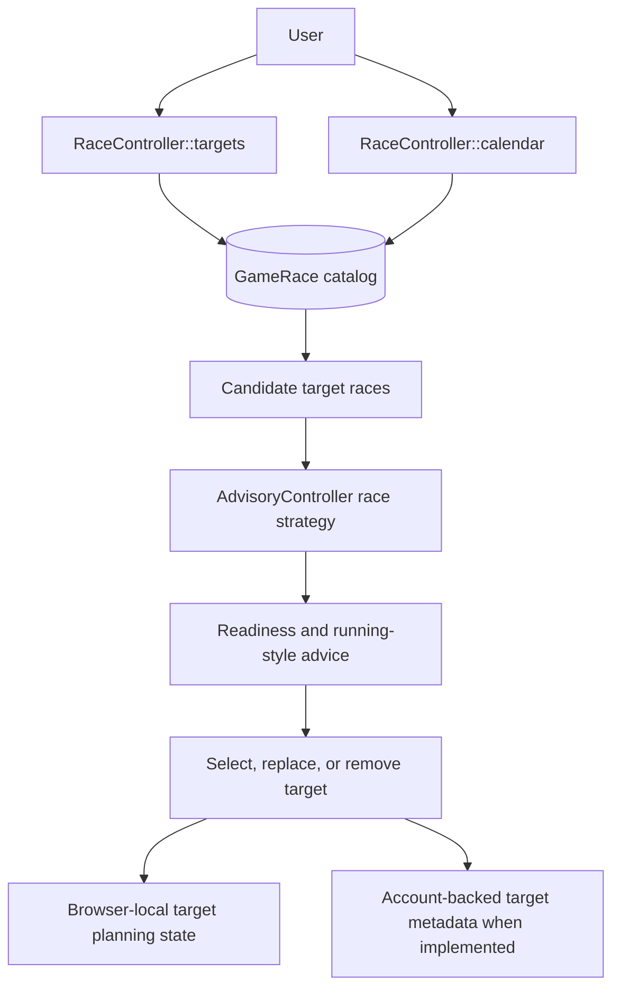

# TECH-FLOW-009: Target Race Planning

**Document Version**: 2.4.2
**Date**: April 7, 2026
**Status**: Added to decompose target-race planning from general race strategy and execution

---

## 1. Overview

This technical flow documents target-race planning as a separate concern from race execution and
reporting. It covers target selection, target replacement and removal, readiness refresh, schedule
lookup, and storage-mode-aware persistence expectations for `/races/targets`.

### Storage Mode Support

- `StorageMode::ACCOUNT`: implemented for authenticated race-target browsing and character-linked planning views.
- `StorageMode::LOCAL`: target planning should be treated as browser-local or advisory until a
verified local persistence path is introduced.

Target selection, replacement, and removal should be documented as advisory or browser-state
mutation unless and until an account-backed target persistence contract is explicitly implemented.

---

## 2. Current Route Surface

- `/races/targets`
- `/races/calendar`
- `/api/advisory/race/strategy`

---

## 3. Architecture Summary

| Component | Layer | Current Responsibility |
| --- | --- | --- |
| `RaceController::targets()` | Application | Serves the target-planning interface using `GameRace` catalog data |
| `RaceController::calendar()` | Application | Serves race schedule and calendar context |
| `AdvisoryController` | API | Produces readiness or strategy advice for candidate races |
| `GameRace` | Domain Model | Provides the catalog and schedule source for target-race options |
| `GameMechanicsEngine` and cached requirement services | Domain Services | Provide deterministic requirement and running-style support for readiness evaluation |

---

## 4. Planning Flow

### Flow Notes

- Target-race planning should remain separate from immediate race-entry mutation.
- Readiness refresh is advisory and deterministic first; AI explanation can enrich it, but should
not replace baseline requirement checks.
- Schedule lookup caching should be documented at the catalog or requirement-service layer rather
than inside controllers.
- Race eligibility may include fan count thresholds in addition to stat and aptitude requirements.
For example, certain G1 races require a minimum fan count before the character may enter. Readiness
displays should surface fan count eligibility as part of the prerequisite summary.

---

## 5. Eager Loading Requirements

For target planning and readiness displays, the minimum eager-loaded relationships should be documented explicitly:

- `character.currentCareer`
- `character.aptitudes`
- `character.skills`
- `character.supportCards.supportCard`

Lazy loading in loops should be treated as prohibited for target lists, comparison panels, and readiness summaries.

---

## 6. Storage-Aware Guidance

- Local target planning should use browser-backed UUID-oriented state until a verified local
persistence contract exists.
- Account-backed target persistence should remain character or career scoped when introduced.
- Replacement and removal flows should document whether they mutate browser-local state, DB-backed targets, or both.

---

## 7. Related Documents

- [TECH-FLOW-003_Race_Strategy_Flow.md](TECH-FLOW-003_Race_Strategy_Flow.md)
- [TECH-FLOW-008_Storage_Mode_and_Local_Account_Conversion.md](TECH-FLOW-008_Storage_Mode_and_Local_Account_Conversion.md)
- [TECH-FLOW-010_Career_Reporting_Flow.md](TECH-FLOW-010_Career_Reporting_Flow.md)
- [SEQ-004](../01-sequences/SEQ-004_Race_Registration_and_Outcome.md)
- [SEQ-017](../01-sequences/SEQ-017_Storage_Mode_Transition.md)
