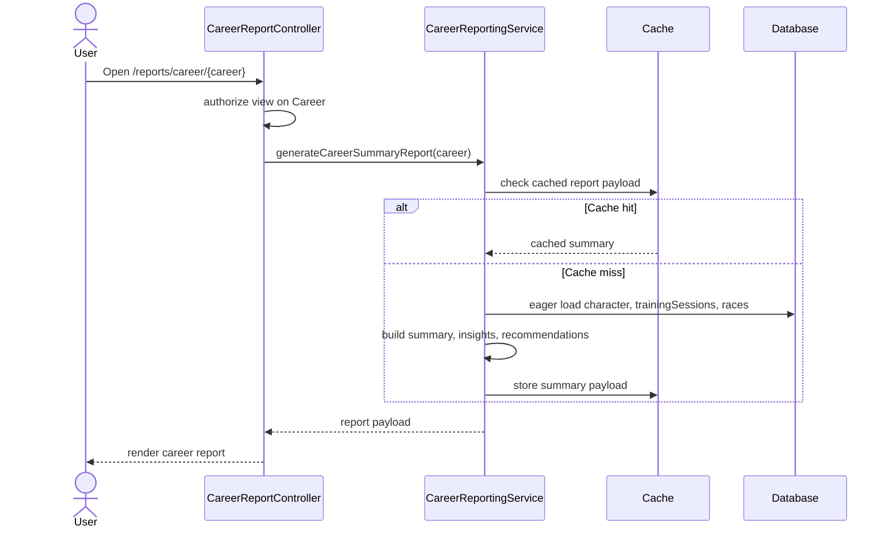

# TECH-FLOW-010: Career Reporting and Export

**Document Version**: 1.1.0
**Date**: March 8, 2026
**Status**: Added to decompose reporting, aggregation, caching, and export behavior from general
race and character flows

---

## 1. Overview

This technical flow documents career reporting as a separate concern from race execution. It covers
report generation, eager-loaded aggregation, report caching, comparison views, and export behavior
centered on `/reports/career/{career}` and related reporting routes.

### Storage Mode Support

- `StorageMode::ACCOUNT`: implemented for authenticated career and character reports, comparisons,
cache clearing, and exports.
- `StorageMode::LOCAL`: reporting for browser-local state is currently architectural guidance only
and should not be documented as account-equivalent until a verified local reporting path exists.

---

## 2. Current Route Surface

- `/reports`
- `/reports/career/{career}`
- `/reports/character/{character}`
- `/reports/compare`
- `/reports/career/{career}/export/json`
- `/reports/career/{career}/export/csv`
- `/reports/career/{career}/export/pdf` *(PDF export triggers browser print-to-PDF; no server-side
PDF generation — the route renders a print-optimized view that the user saves via their browser's
print dialog)*

---

## 3. Architecture Summary

| Component | Layer | Current Responsibility |
| --- | --- | --- |
| `CareerReportController` | Application | Serves report index, career reports, character reports, comparisons, exports, and cache clear operations |
| `CareerReportingService` | Domain Service | Generates summary reports, character reports, exports, recommendations, and cached report payloads |
| `CareerAnalyticsService` | Domain Service | Supports statistical and analytical reporting calculations |
| `Career` | Domain Model | Primary report subject for run-level reports |
| `Character` | Domain Model | Parent container for cross-career character reporting |

---

## 4. Reporting Flow

---

## 5. Eager Loading Requirements

The minimum eager-loaded relationships for reporting should be documented explicitly:

- `career.character`
- `career.trainingSessions`
- `career.races`
- `career.skillAcquisitions`
- `character.careers`

Lazy loading in loops should be treated as prohibited for report rendering, comparison views, and export preparation.

---

## 6. Cache and Export Notes

- `CareerReportingService` caches career summary payloads and exposes cache clearing through the controller.
- Export flows should use the same owner-scoped authorization as on-screen reporting.
- Exported artifacts should be treated as owner-scoped outputs and should not bypass reporting authorization checks.

---

## 7. Storage-Aware Guidance

- Current reporting is account-backed and DB-driven.
- If local-mode reporting is later introduced, it should be documented as a separate normalization
and aggregation path rather than assumed to reuse account report queries directly.
- Any local-to-account reporting continuity should follow the storage transition guidance in [TECH-
FLOW-008_Storage_Mode_and_Local_Account_Conversion.md](TECH-
FLOW-008_Storage_Mode_and_Local_Account_Conversion.md).

---

## 8. Related Documents

- [TECH-FLOW-003_Race_Strategy_Flow.md](TECH-FLOW-003_Race_Strategy_Flow.md)
- [TECH-FLOW-008_Storage_Mode_and_Local_Account_Conversion.md](TECH-
FLOW-008_Storage_Mode_and_Local_Account_Conversion.md)
- [TECH-FLOW-009_Target_Race_Planning_Flow.md](TECH-FLOW-009_Target_Race_Planning_Flow.md)
- [TECH-FLOW-001_Character_Management_Flow.md](TECH-FLOW-001_Character_Management_Flow.md)
- [SEQ-004](../01-sequences/SEQ-004_Race_Registration_and_Outcome.md)
