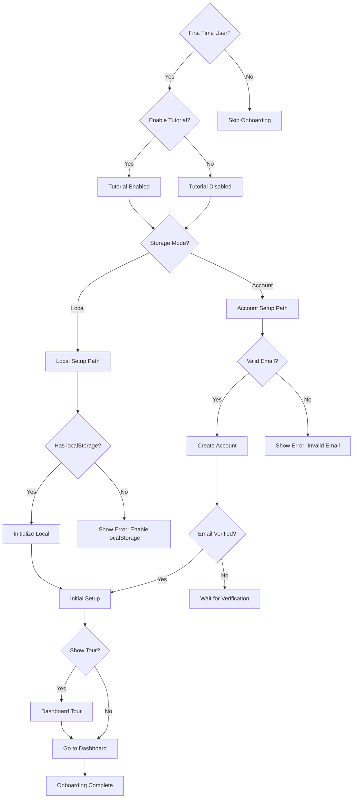

# UF-001: Onboarding Flow

## Umamusume Pretty Derby Career Planner

**Document Version**: 2.3.0  
**Date**: February 22, 2026  
**Related Documents**: [PRD-001], [SPEC-001], [SRS], [BRS]

**Source Specifications**:

- `.kiro/specs/umamusume-career-planner-main/requirements.md` (Onboarding Requirements)
- `.kiro/specs/umamusume-career-planner-main/design.md` (Onboarding Flow)

**Related Artifacts**:

- PRD: [PRD-001](../prds/PRD-001_Character_Management.md)
- SPEC: [SPEC-001](../specs/SPEC-001_Character_Management_Technical.md)
- Flow: [FLOW-001](../flows/FLOW-001_Character_Management_System.md)
- Tech Flow: [TECH-FLOW-001](../tech-flow/TECH-FLOW-001_Character_Management_Flow.md)
- Wireframes: [WF-001](../wireframes/WF-001_Dashboard_Overview.md), [WF-002](../wireframes/WF-002_Character_Creation_Wizard.md)
- User Manual: [D17](../D17_SUM_Software_User_Manual.md#2-getting-started)

---

## Table of Contents

1. [Overview](#1-overview)
2. [Flow Diagram](#2-flow-diagram)
3. [User Journey Steps](#3-user-journey-steps)
4. [Decision Points](#4-decision-points)
5. [Success Criteria](#5-success-criteria)
6. [Error Handling](#6-error-handling)
7. [Related Flows](#7-related-flows)

---

## 1. Overview

### 1.1 Purpose

The onboarding flow introduces new users to the Umamusume Career Planner application, guiding them through initial setup, storage mode selection, and their first career configuration. This flow prioritizes quick time-to-value while providing optional educational content for users who want deeper understanding.

### 1.2 Scope

| Aspect | Description |
| --- | --- |
| **Entry Point** | First-time application launch or post-registration landing |
| **Exit Point** | Dashboard with active career run or tutorial completion |
| **Duration** | 5-15 minutes (depending on tutorial engagement) |
| **User Type** | New users, both authenticated and guest |

### 1.3 Business Context

**Business Goal**: Minimize friction to first meaningful action (creating a career run) while educating users on key features.

**Success Metrics**:

- Time to first career creation: < 5 minutes
- Tutorial completion rate: > 60%
- Conversion from Local to Account mode: > 40%

---

## 2. Flow Diagram

### 2.1 High-Level Flow

```mermaid
flowchart TD
    Start([Launch App]) --> FirstTime{First Time User?}
    
    FirstTime -->|No| CheckAuth{Authenticated?}
    FirstTime -->|Yes| Welcome[Welcome Screen]
    
    CheckAuth -->|Yes| Dashboard[Dashboard]
    CheckAuth -->|No| LocalData[Local Data Check]
    
    LocalData --> HasLocal{Has Local Runs?}
    HasLocal -->|Yes| LocalDash[Local Dashboard]
    HasLocal -->|No| Welcome
    
    Welcome --> TutorialToggle[Tutorial Toggle]
    TutorialToggle --> StorageMode[Storage Mode Selection]
    
    StorageMode --> ModeChoice{Choose Mode}
    
    ModeChoice -->|Local Mode| LocalSetup[Initialize Local Storage]
    ModeChoice -->|Account Mode| AuthFlow[Account Creation Flow]
    
    LocalSetup --> InitialSetup[Initial Setup]
    AuthFlow --> InitialSetup
    
    InitialSetup --> SetUsername[Set User Name]
    SetUsername --> SelectAvatar[Select Avatar]
    SelectAvatar --> Preferences[Set Preferences]
    
    Preferences --> OnboardComplete[Onboarding Complete]
    OnboardComplete --> DashTutorial{Enable Tutorial?}
    
    DashTutorial -->|Yes| InteractiveTour[Interactive Dashboard Tour]
    DashTutorial -->|No| Dashboard
    
    InteractiveTour --> Dashboard
    
    Dashboard --> End([User Ready])
    LocalDash --> End
    
    style Start fill:#e3f2fd
    style End fill:#c8e6c9
    style Welcome fill:#fff3e0
    style Dashboard fill:#f3e5f5
```text

### 2.2 Detailed Flow with States

```mermaid
stateDiagram-v2
    [*] --> AppLaunch
    
    AppLaunch --> CheckUserState: Load App
    
    CheckUserState --> WelcomeScreen: First Time
    CheckUserState --> CheckSession: Returning User
    
    CheckSession --> Dashboard: Has Session
    CheckSession --> LocalCheck: No Session
    
    LocalCheck --> LocalDashboard: Has Local Data
    LocalCheck --> WelcomeScreen: No Local Data
    
    WelcomeScreen --> TutorialPrompt
    TutorialPrompt --> StorageSelection: User Choice
    
    StorageSelection --> LocalMode: Select Local
    StorageSelection --> AccountMode: Select Account
    
    LocalMode --> InitializeLocal: Setup Storage
    AccountMode --> Registration: Show Auth
    
    Registration --> CreateAccount
    CreateAccount --> VerifyEmail
    VerifyEmail --> InitializeAccount
    
    InitializeLocal --> UserSetup
    InitializeAccount --> UserSetup
    
    UserSetup --> SetProfile
    SetProfile --> SetPreferences
    SetPreferences --> OnboardingComplete
    
    OnboardingComplete --> DashboardTour: Tutorial Enabled
    OnboardingComplete --> Dashboard: Tutorial Skipped
    
    DashboardTour --> Dashboard: Tour Complete
    
    Dashboard --> [*]: Ready
    LocalDashboard --> [*]: Ready
```

---

## 3. User Journey Steps

### 3.1 Step 1: Welcome Screen

**Trigger**: First-time user detection (no session, no localStorage data)

**UI Components**:

- Application logo and branding
- Welcome message with value proposition
- Tutorial toggle checkbox
- "Get Started" primary action button

**User Actions**:

| Action | Description | Next Step |
| --- | --- | --- |
| Enable Tutorial | Check tutorial toggle | Storage Mode Selection |
| Disable Tutorial | Uncheck tutorial toggle | Storage Mode Selection |
| Click "Get Started" | Proceed to next step | Storage Mode Selection |

**Implementation Reference**:

- Route: `/welcome`
- Livewire Component: `App\Livewire\Onboarding\WelcomeScreen`
- Blade View: `resources/views/livewire/onboarding/welcome-screen.blade.php`

---

### 3.2 Step 2: Storage Mode Selection

**Purpose**: Allow users to choose between Local (browser-only) and Account (cloud-synced) storage.

**UI Components**:

```text
┌─────────────────────────────────────────────────────────────┐
│ Choose Your Storage Mode                                    │
├─────────────────────────────────────────────────────────────┤
│                                                             │
│  ┌────────────────────────┐  ┌────────────────────────┐   │
│  │ 🟠 LOCAL MODE          │  │ 🟣 ACCOUNT MODE        │   │
│  │                        │  │                        │   │
│  │ ✓ No login required    │  │ ✓ Cloud sync           │   │
│  │ ✓ Works offline        │  │ ✓ Access anywhere      │   │
│  │ ✓ Instant start        │  │ ✓ Secure backup        │   │
│  │                        │  │                        │   │
│  │ ⚠️ Single device only   │  │ ⚠️ Requires internet   │   │
│  │                        │  │                        │   │
│  │ [SELECT LOCAL]         │  │ [SELECT ACCOUNT]       │   │
│  └────────────────────────┘  └────────────────────────┘   │
│                                                             │
│  💡 Tip: You can convert Local runs to Account later!      │
│                                                             │
└─────────────────────────────────────────────────────────────┘
```

**Decision Matrix**:

| User Scenario | Recommended Mode | Reason |
| --- | --- | --- |
| Quick testing | Local | No setup required |
| Long-term tracking | Account | Data persistence |
| Multi-device access | Account | Cloud sync |
| Privacy-focused | Local | Data stays local |
| Offline-only | Local | No network dependency |

**Business Rule**:

- Default selection: Local Mode (lowest friction)
- Conversion path available: Local → Account (one-way migration)

**Implementation Reference**:

- Service: `App\Services\StorageModeService`
- Enum: `App\Enums\StorageMode`
- Configuration: `config/storage.php`

---

### 3.3 Step 3A: Local Mode Initialization

**Process**:

1. Initialize localStorage namespace: `ucp_local_data`
2. Create default user profile object
3. Set storage mode flag: `storage_mode=local`
4. Generate UUID for anonymous identification

**Technical Implementation**:

```javascript
// resources/js/storage/LocalStorageManager.js
class LocalStorageManager {
    initialize() {
        const namespace = 'ucp_local_data';
        const userData = {
            uuid: this.generateUUID(),
            storage_mode: 'local',
            created_at: new Date().toISOString(),
            preferences: this.getDefaultPreferences(),
        };
        
        localStorage.setItem(namespace, JSON.stringify(userData));
        return userData;
    }
    
    getDefaultPreferences() {
        return {
            theme: 'system',
            language: 'en',
            tutorial_enabled: true,
        };
    }
}
```text

**Validation**:

- Check localStorage quota availability (minimum 5MB)
- Verify write permissions
- Test read/write operations

**Error Handling**:

- Quota exceeded → Prompt user to clear browser data or use Account mode
- Permissions denied → Display error message, suggest Account mode

---

### 3.3 Step 3B: Account Mode Registration

**Process**:

1. Show registration form
2. Collect user credentials
3. Validate email format
4. Send verification email
5. Create user account
6. Initialize session

**Form Fields**:

| Field | Type | Validation | Required |
| --- | --- | --- | --- |
| Name | Text | Max 255 chars | Yes |
| Email | Email | Valid format, unique | Yes |
| Password | Password | Min 8 chars, 1 uppercase, 1 number | Yes |
| Confirm Password | Password | Must match password | Yes |

**Laravel Implementation**:

```php
// app/Livewire/Onboarding/AccountRegistration.php
use App\Services\Auth\RegistrationService;

class AccountRegistration extends Component
{
    public string $name = '';
    public string $email = '';
    public string $password = '';
    public string $password_confirmation = '';
    
    protected array $rules = [
        'name' => 'required|string|max:255',
        'email' => 'required|email|unique:users,email',
        'password' => 'required|min:8|regex:/[A-Z]/|regex:/[0-9]/',
        'password_confirmation' => 'required|same:password',
    ];
    
    public function register(RegistrationService $service)
    {
        $this->validate();
        
        $user = $service->register([
            'name' => $this->name,
            'email' => $this->email,
            'password' => $this->password,
        ]);
        
        $service->sendVerificationEmail($user);
        
        session()->flash('success', 'Registration successful! Please check your email.');
        
        return redirect()->route('onboarding.setup');
    }
}
```

**Email Verification Flow**:

```mermaid
sequenceDiagram
    participant User
    participant App
    participant Email
    participant Database
    
    User->>App: Submit Registration
    App->>Database: Create User (unverified)
    App->>Email: Send Verification Link
    Email-->>User: Deliver Email
    User->>App: Click Verification Link
    App->>Database: Mark Email Verified
    App-->>User: Redirect to Setup
```text

---

### 3.4 Step 4: Initial Setup

**Purpose**: Collect basic user information and preferences.

**Setup Wizard Steps**:

#### Step 4.1: Set User Name

```
┌─────────────────────────────────────────────────────────────┐
│ Initial Setup - Step 1 of 3                                 │
├─────────────────────────────────────────────────────────────┤
│                                                             │
│  What should we call you?                                   │
│  ┌────────────────────────────────────────────────────────┐ │
│  │ Enter your name...                                     │ │
│  └────────────────────────────────────────────────────────┘ │
│                                                             │
│  This name will be used for personalization.                │
│                                                             │
│                                    [← Back]  [Next →]       │
└──────────────���──────────────────────────────────────────────┘
```text

**Validation**:

- Required field
- Max 255 characters
- UTF-8 support for international names

---

#### Step 4.2: Select Avatar

```
┌─────────────────────────────────────────────────────────────┐
│ Initial Setup - Step 2 of 3                                 │
├─────────────────────────────────────────────────────────────┤
│                                                             │
│  Choose your avatar                                         │
│                                                             │
│  ┌────┐  ┌────┐  ┌────┐  ┌────┐  ┌────┐  ┌────┐          │
│  │ 🐴 │  │ 🏇 │  │ 🏆 │  │ 🎯 │  │ 🌟 │  │ 📊 │          │
│  └────┘  └────┘  └────┘  └────┘  └────┘  └────┘          │
│                                                             │
│  Or upload custom image:                                    │
│  [📤 Upload Image] (Max 2MB, PNG/JPG)                      │
│                                                             │
│                                    [← Back]  [Next →]       │
└─────────────────────────────────────────────────────────────┘
```text

**Avatar Options**:

- 20+ preset icons
- Custom image upload (optional)
- Image validation: Max 2MB, PNG/JPG/JPEG, 500x500px recommended

---

#### Step 4.3: Set Preferences

```
┌─────────────────────────────────────────────────────────────┐
│ Initial Setup - Step 3 of 3                                 │
├─────────────────────────────────────────────────────────────┤
│                                                             │
│  Preferences                                                │
│                                                             │
│  Theme:         ○ Light  ● Dark  ○ System                   │
│                                                             │
│  Language:      [English ▼]                                 │
│                                                             │
│  Stat Display:  ○ Numeric  ● Circular  ○ Bars               │
│                                                             │
│  Notifications: ☑ Race Reminders                            │
│                 ☑ Training Suggestions                      │
│                 ☑ Goal Alerts                               │
│                                                             │
│                                    [← Back]  [Complete →]   │
└─────────────────────────────────────────────────────────────┘
```text

**Preferences Configuration**:

| Preference | Options | Default |
| --- | --- | --- |
| Theme | Light, Dark, System | System |
| Language | English, Japanese | English |
| Stat Display | Numeric, Circular, Bars | Circular |
| Race Reminders | On, Off | On |
| Training Suggestions | On, Off | On |
| Goal Alerts | On, Off | On |

**Data Model**:

```php
// app/Models/User.php (Account Mode)
protected $casts = [
    'preferences' => 'array',
    'accessibility_settings' => 'array',
];

protected $fillable = [
    'name',
    'email',
    'password',
    'avatar_path',
    'preferences',
];

// LocalStorage (Local Mode)
{
    "preferences": {
        "theme": "dark",
        "language": "en",
        "stat_display": "circular",
        "notifications": {
            "race_reminders": true,
            "training_suggestions": true,
            "goal_alerts": true
        }
    }
}
```

---

### 3.5 Step 5: Onboarding Complete

**Completion Screen**:

```text
┌─────────────────────────────────────────────────────────────┐
│ You're All Set! 🎉                                          │
├────────────���────────────────────────────────────────────────┤
│                                                             │
│  Welcome to Umamusume Career Planner, [User Name]!          │
│                                                             │
│  Storage Mode: 🟣 Account Mode                              │
│  Ready to start planning your first career!                 │
│                                                             │
│  Next Steps:                                                │
│  1. Take the dashboard tour (recommended)                   │
│  2. Create your first character                            │
│  3. Start your career run                                   │
│                                                             │
│  [📖 Start Dashboard Tour]  [⏭️ Skip to Dashboard]          │
│                                                             │
└─────────────────────────────────────────────────────────────┘
```

**System Actions**:

1. Mark onboarding as complete
2. Set `onboarded_at` timestamp
3. Trigger welcome email (Account mode only)
4. Initialize dashboard state
5. Log onboarding completion event

---

### 3.6 Step 6: Interactive Dashboard Tour (Optional)

**Purpose**: Highlight key dashboard features through interactive walkthrough.

**Tour Stops**:

| Stop | Component | Description | Duration |
| --- | --- | --- | --- |
| 1 | Stats Panel | "Here you'll see your character's current stats" | 10s |
| 2 | Goals Progress | "Track your training goals and milestones" | 10s |
| 3 | Upcoming Races | "View and prepare for scheduled races" | 10s |
| 4 | Training Suggestions | "Get AI-powered training recommendations" | 10s |
| 5 | AI Advisor Card | "Ask the AI advisor for strategy tips" | 10s |
| 6 | Navigation Menu | "Access all features from the sidebar" | 10s |

**Tour Implementation**:

```javascript
// resources/js/components/DashboardTour.js
import Shepherd from 'shepherd.js';

const tour = new Shepherd.Tour({
    useModalOverlay: true,
    defaultStepOptions: {
        cancelIcon: {
            enabled: true
        },
        classes: 'shepherd-theme-custom',
        scrollTo: { behavior: 'smooth', block: 'center' }
    }
});

tour.addStep({
    id: 'stats-panel',
    text: "Here you'll see your character's current stats across all five categories.",
    attachTo: {
        element: '[data-tour="stats-panel"]',
        on: 'bottom'
    },
    buttons: [
        {
            text: 'Next',
            action: tour.next
        }
    ]
});

// ... additional steps

tour.start();
```text

**Tour Controls**:

- Skip Tour button (always visible)
- Progress indicator (Step X of 6)
- Previous/Next navigation
- Auto-advance option (10s timeout per step)

---

## 4. Decision Points

### 4.1 Decision Tree



### 4.2 Decision Point Details

| Decision Point | Criteria | Outcomes | Default |
| --- | --- | --- | --- |
| **Enable Tutorial** | User preference | Tutorial On/Off | On |
| **Storage Mode** | User selection | Local/Account | Local |
| **Email Verification** | Email confirmation | Verified/Pending | Pending |
| **Dashboard Tour** | User preference | Show/Skip | Show |

---

## 5. Success Criteria

### 5.1 Completion Metrics

| Metric | Target | Measurement |
| --- | --- | --- |
| Onboarding Completion Rate | > 85% | Users reaching dashboard / total new users |
| Time to First Career | < 5 minutes | From welcome screen to first career creation |
| Tutorial Engagement | > 60% | Users completing dashboard tour |
| Account Mode Adoption | > 40% | Account mode selection / total users |

### 5.2 User Experience Metrics

| Metric | Target | Measurement |
| --- | --- | --- |
| Setup Abandonment Rate | < 15% | Users exiting during setup |
| Email Verification Rate | > 70% | Verified emails / total registrations |
| Preference Customization | > 50% | Users changing default preferences |

### 5.3 Technical Success Criteria

- ✅ localStorage initialization successful (Local mode)
- ✅ User account created and verified (Account mode)
- ✅ Preferences persisted correctly
- ✅ Dashboard tour loads without errors
- ✅ No console errors during onboarding
- ✅ Page load time < 2 seconds per step

---

## 6. Error Handling

### 6.1 Error Scenarios

```mermaid
flowchart TD
    Error[Error Encountered] --> Type{Error Type}
    
    Type -->|localStorage Quota| E1[localStorage Full]
    Type -->|Network| E2[Connection Lost]
    Type -->|Validation| E3[Invalid Input]
    Type -->|Email| E4[Email Issues]
    
    E1 --> R1[Suggest Account Mode<br/>or Clear Data]
    E2 --> R2[Enable Offline Mode<br/>Retry Later]
    E3 --> R3[Show Validation Errors<br/>Highlight Fields]
    E4 --> R4[Resend Verification<br/>Check Spam]
    
    R1 --> Resolve[User Action]
    R2 --> Resolve
    R3 --> Resolve
    R4 --> Resolve
```text

### 6.2 Error Messages

| Error Code | Message | User Action | System Action |
| --- | --- | --- | --- |
| `ON-001` | "Browser storage is full. Please clear data or use Account mode." | Clear data or switch mode | Redirect to storage mode selection |
| `ON-002` | "Connection lost. Changes saved as draft." | Wait for reconnection | Auto-save to localStorage |
| `ON-003` | "Email already registered. Please login or use a different email." | Login or change email | Show login link |
| `ON-004` | "Email verification pending. Check your inbox." | Check email | Provide resend option |
| `ON-005` | "Invalid password. Must be 8+ characters with 1 uppercase and 1 number." | Fix password | Highlight validation errors |

### 6.3 Fallback Strategies

| Scenario | Primary Path | Fallback Path | Ultimate Fallback |
| --- | --- | --- | --- |
| localStorage unavailable | Use localStorage | Use sessionStorage | Account mode only |
| Email sending fails | Send via SMTP | Queue for retry | Show manual verification code |
| Avatar upload fails | Upload to server | Use preset avatar | Default avatar |
| Tour script fails | Load Shepherd.js | Skip tour | Redirect to dashboard |

---

## 7. Related Flows

### 7.1 Downstream Flows

After onboarding completion, users proceed to:

| Flow | Document Reference | Entry Condition |
| --- | --- | --- |
| Career Setup | [UF-002](UF-002_Career_Setup_Flow.md) | User clicks "Create Career" from dashboard |
| Dashboard Tour | [UF-001](UF-001_Onboarding_Flow.md#36-step-6-interactive-dashboard-tour-optional) | User chooses to view tour |
| Settings Configuration | [D17](../D17_SUM_Software_User_Manual.md#13-settings--preferences) | User accesses settings |

### 7.2 Alternative Entry Points

| Entry Point | Scenario | Flow Adjustment |
| --- | --- | --- |
| Direct Dashboard Access | Returning user with session | Skip onboarding entirely |
| Local Data Exists | User has localStorage data | Skip welcome, show local dashboard |
| OAuth Registration | User registers via Google/GitHub | Skip email verification step |

### 7.3 Integration Points

```mermaid
flowchart LR
    Onboarding[Onboarding Flow] --> Auth[Authentication System]
    Onboarding --> Storage[Storage Service]
    Onboarding --> Preferences[Preferences Manager]
    
    Auth --> Session[Session Management]
    Storage --> Local[localStorage API]
    Storage --> DB[(Database)]
    Preferences --> UserProfile[User Profile Service]
    
    Session --> Dashboard[Dashboard]
    Local --> Dashboard
    DB --> Dashboard
    UserProfile --> Dashboard
```

---

## Document Control

| Version | Date | Author | Changes |
| --- | --- | --- | --- |
| 2.3.0 | 2026-02-22 | Development Team | Updated Livewire namespace to Livewire 4 conventions (`App\Livewire` not `App\Http\Livewire`); updated version and dates |
| 2.2.0 | 2026-01-28 | Development Team | Updated with verified game mechanics from Global English Server (Jan 2026); corrected aptitude grade system (S is maximum, no SS); updated skill hint discount system (5 levels: 10%/20%/30%/35%/40%); added stat soft cap mechanics (1200 with diminishing returns above) |
| 2.1.0 | 2026-01-24 | Development Team | Complete rewrite aligned with v2.0.0 architecture; added storage mode selection; updated technical implementation details; added comprehensive error handling |
| 2.0.0 | 2026-01-14 | Development Team | Prior revision with basic flow |
| 1.0.0 | 2026-01-03 | Development Team | Initial draft |

---

## References

- [Software Development Plan (SDP)](../D01_SDP_Software_Development_Plan.md)
- [Business Requirements Specifications (BRS)](../D02_BRS_Business_Requirements_Specifications.md)
- [Software Requirements Specifications (SRS)](../D03_SRS_Software_Requirement_Specifications.md)
- [Software User Manual (SUM)](../D17_SUM_Software_User_Manual.md)
- [SPEC-001: Character Management Technical](../specs/SPEC-001_Character_Management_Technical.md)
- [FLOW-001: Character Management System](../flows/FLOW-001_Character_Management_System.md)
- [WF-001: Dashboard Overview](../wireframes/WF-001_Dashboard_Overview.md)

---

*This user flow reflects the current onboarding implementation as of version 2.3.0. For the latest updates, refer to the online documentation.*
