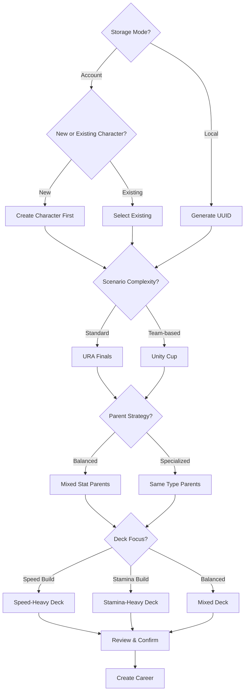
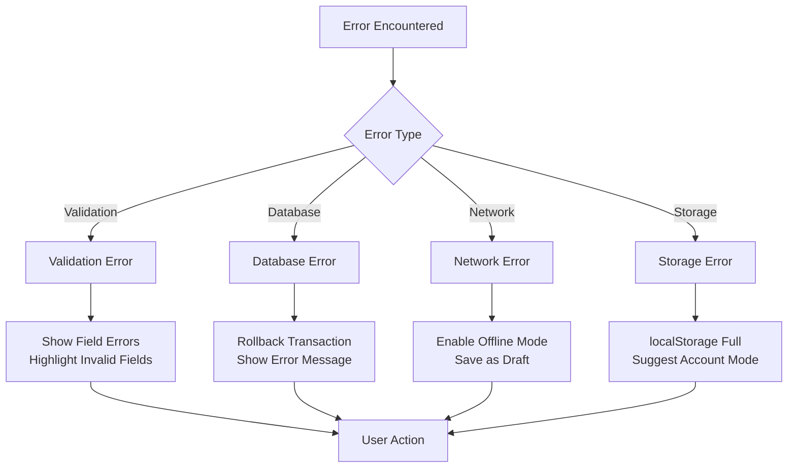

# UF-002: Career Setup Flow

## Umamusume Pretty Derby Career Planner

**Document Version**: 2.4.0
**Date**: March 10, 2026
**Related Documents**: [PRD-001], [SPEC-001], [SRS], [BRS]

**Source Specifications**:

- `.kiro/specs/umamusume-career-planner-main/requirements.md` (Requirement 1: Character State Management)
- `.kiro/specs/umamusume-career-planner-main/design.md` (Character Creation Flow)

**Related Artifacts**:

- PRD: [PRD-001](../02-prds/PRD-001_Character_Management.md)
- SPEC: [SPEC-001](../02-specs/SPEC-001_Character_Management_Technical.md)
- Flow: [FLOW-001](../01-flows/FLOW-001_Character_Management_System.md)
- Tech Flow: [TECH-FLOW-001](../01-tech-flow/TECH-FLOW-001_Character_Management_Flow.md)
- Wireframes: [WF-002](../01-wireframes/WF-002_Character_Creation_Wizard.md),
[WF-003](../01-wireframes/WF-003_Character_Detail_Management.md)
- Sequences: [SEQ-001](../01-sequences/SEQ-001_Character_Creation_Sequence.md)
- User Manual: [017_SUM](../00-core-docs/017_SUM_Software_User_Manual.md#5-career-run-management)

---

## Table of Contents

1. [Overview](#1-overview)
2. [Flow Diagram](#2-flow-diagram)
3. [User Journey Steps](#3-user-journey-steps)
4. [Decision Points](#4-decision-points)
5. [Validation Rules](#5-validation-rules)
6. [Success Criteria](#6-success-criteria)
7. [Error Handling](#7-error-handling)
8. [Related Flows](#8-related-flows)

---

## 1. Overview

### 1.1 Purpose

The Career Setup Flow guides users through the complete process of creating a new career run, from
selecting a trainee character through configuring their support deck and inheritance factors. This
flow is critical as it establishes the foundation for all subsequent training, racing, and skill
management activities. In current account-backed implementation, this journey begins through the
authenticated character-creation surface and initializes the state later used by downstream career
and run flows rather than proving a distinct `/careers/create` persistence contract.

### 1.2 Scope

| Aspect | Description |
| --- | --- |
| **Entry Point** | Dashboard "Create Career" button or character list "New Career" action |
| **Exit Point** | Character dashboard with initialized career run (Day 1, Junior Year) |
| **Duration** | 5-10 minutes for experienced users, 15+ minutes for first-time users |
| **User Type** | All authenticated users (Account mode) or guest users (Local mode) |

### 1.3 Storage Mode Support

- `StorageMode::ACCOUNT`: implemented for authenticated character creation, persisted setup, and
downstream account-backed character flows.
- `StorageMode::LOCAL`: supported for browser-local creation and setup state, but downstream modules
should not be assumed to have full account-feature parity.

### 1.4 Navigation Surface

This document uses conceptual labels such as Create Career, Review Summary, and Character Dashboard
for the user journey. Any route names or component names in lower sections should be treated as
illustrative unless they are verified against the current character creation surface.

### 1.5 Persistence Boundary Note

Local and Account setup share similar user-facing steps, but they do not imply identical persistence
behavior. Local setup creates browser-managed run state; Account setup creates authenticated
persisted character and aptitude records.

### 1.6 Business Context

**Business Goal**: Minimize friction in career creation while ensuring users make informed decisions
about character configuration that will impact their entire playthrough.

**Success Metrics**:

- Career creation completion rate: > 85%
- Time to first career creation: < 10 minutes
- Deck validation error rate: < 15%
- User returns to complete abandoned setups: > 40%

---

## 2. Flow Diagram

### 2.1 High-Level Flow

```mermaid
flowchart TD
    Start([Start New Career]) --> CheckAuth{Storage Mode?}

    CheckAuth -->|Account| AccountFlow[Account Mode Setup]
    CheckAuth -->|Local| LocalFlow[Local Mode Setup]

    AccountFlow --> SelectTrainee[Step 1: Select Trainee]
    LocalFlow --> SelectTrainee

    SelectTrainee --> SelectScenario[Step 2: Select Scenario]
    SelectScenario --> PickParents[Step 3: Pick Parents]
    PickParents --> PreviewFactors[Preview Factor Bonuses]
    PreviewFactors --> BuildDeck[Step 4: Build Support Deck]

    BuildDeck --> ValidateDeck{Deck Valid?}
    ValidateDeck -->|No| ShowErrors[Show Validation Errors]
    ShowErrors --> FixDeck[User Adjusts Deck]
    FixDeck --> ValidateDeck

    ValidateDeck -->|Yes| ReviewSummary[Step 5: Review Summary]
    ReviewSummary --> UserConfirm{User Confirms?}

    UserConfirm -->|No| BackToStep{Which Step?}
    BackToStep --> SelectTrainee
    BackToStep --> SelectScenario
    BackToStep --> PickParents
    BackToStep --> BuildDeck

    UserConfirm -->|Yes| CreateCareer[Create Career Record]
    CreateCareer --> InitializeStats[Initialize Stats/Mood/Energy]
    InitializeStats --> SaveRun[Persist Career Run]

    SaveRun --> StorageCheck{Storage Mode?}
    StorageCheck -->|Account| SaveDB[Save to Database]
    StorageCheck -->|Local| SaveLocalStorage[Save to localStorage]

    SaveDB --> CareerReady[Career Ready: Day 1]
    SaveLocalStorage --> CareerReady

    CareerReady --> ShowDashboard[Display Career Dashboard]
    ShowDashboard --> NextSteps[Show Next Steps Tutorial]
    NextSteps --> End([Setup Complete])

    style Start fill:#e3f2fd
    style End fill:#c8e6c9
    style ValidateDeck fill:#fff3e0
    style CreateCareer fill:#f3e5f5
```text

### 2.2 Detailed State Diagram

```mermaid
stateDiagram-v2
    [*] --> InitialState

    InitialState --> TraineeSelection: User clicks "Create Career"

    TraineeSelection --> ScenarioSelection: Trainee selected
    TraineeSelection --> TraineeSelection: Change filters/search

    ScenarioSelection --> ParentSelection: Scenario selected
    ScenarioSelection --> TraineeSelection: Back button

    ParentSelection --> FactorPreview: Both parents selected
    ParentSelection --> ParentSelection: Change parent A/B
    ParentSelection --> ScenarioSelection: Back button

    FactorPreview --> DeckBuilding: Preview reviewed
    FactorPreview --> ParentSelection: Change parents

    DeckBuilding --> DeckValidation: User completes deck
    DeckBuilding --> DeckBuilding: Add/remove cards
    DeckBuilding --> FactorPreview: Back button

    DeckValidation --> DeckBuilding: Validation failed
    DeckValidation --> ReviewSummary: Validation passed

    ReviewSummary --> Confirmation: User reviews all settings
    ReviewSummary --> TraineeSelection: Edit trainee
    ReviewSummary --> ScenarioSelection: Edit scenario
    ReviewSummary --> ParentSelection: Edit parents
    ReviewSummary --> DeckBuilding: Edit deck

    Confirmation --> CareerCreation: User confirms
    Confirmation --> ReviewSummary: User cancels

    CareerCreation --> Initialization: Create database record
    Initialization --> Persistence: Initialize stats/mood/energy
    Persistence --> Dashboard: Save to storage

    Dashboard --> [*]: Setup complete
```

---

## 3. User Journey Steps

### 3.1 Step 1: Select Trainee & Scenario

**Purpose**: Choose the Uma Musume character and scenario type for the career run.

#### 3.1.1 Trainee Selection Interface

```text
┌────────────────────────────────────────────────────────────┐
│  Create New Career - Step 1 of 5                           │
├────────────────────────────────────────────────────────────┤
│  Select Your Trainee                                       │
│  ┌──────────────────────────────────────────────────────┐  │
│  │ 🔍 Search trainees by name...                        │  │
│  └──────────────────────────────────────────────────────┘  │
│                                                            │
│  Filter:  [All Rarities ▼]  [All Distances ▼]  [Sort: Name ▼] │
│                                                            │
│  ┌─────────────────┬─────────────────┬─────────────────┐  │
│  │ Special Week    │ Silence Suzuka  │ Tokai Teio      │  │
│  │ ★★★ SSR         │ ★★★ SSR         │ ★★★ SSR         │  │
│  │ All-Rounder     │ Speed Focus     │ Stamina Focus   │  │
│  │ [SELECT]        │ [SELECT]        │ [SELECT]        │  │
│  └─────────────────┴─────────────────┴─────────────────┘  │
│                                                            │
│  ┌─────────────────┬─────────────────┬─────────────────┐  │
│  │ Mejiro McQueen  │ Gold Ship       │ Vodka           │  │
│  │ ★★★ SSR         │ ★★★ SSR         │ ★★ SR           │  │
│  │ Long Distance   │ Unique Style    │ Dirt Specialist │  │
│  │ [SELECT]        │ [SELECT]        │ [SELECT]        │  ��
│  └─────────────────┴─────────────────┴─────────────────┘  │
│                                                            │
│  Showing 6 of 52 trainees                [Load More]      │
│                                                            │
│                                    [← BACK]  [NEXT →]     │
└────────────────────────────────────────────────────────────┘
```text

**User Actions**:

| Action | Description | Next State |
| --- | --- | --- |
| Select Trainee | Click on character card | Show star level selector; enable "Next" button |
| Set Star Level | Click 1–5 stars (shown after trainee selected) | Update unique skill status badge |
| Search | Type in search box | Filter trainee list |
| Filter | Apply rarity/distance/aptitude filters | Update trainee list |
| Load More | Pagination | Display additional trainees |

**Star Level Configuration** (appears after trainee is selected):

```text
┌────────────────────────────────────────────────────────────┐
│  ✔ Selected: Special Week                                  │
├────────────────────────────────────────────────────────────┤
│  Star Level (才能開花)                                     │
│  Set the character's current star level. At ★★★ and above, │
│  the unique skill is upgraded to its full-power version.   │
│                                                            │
│  ★  ★  ★  ☆  ☆       3★                                 │
│  [1] [2] [3] [4] [5]                                       │
│                                                            │
│  ✔ Unique skill upgraded  (shown at 3★+)                  │
│  ⚠ Base unique skill (weaker)  (shown at 1–2★)            │
└────────────────────────────────────────────────────────────┘
```

**Star Level Rules**:

| Star Level | Unique Skill | Notes |
| --- | --- | --- |
| 1★ | Base version (weaker) | Characters scouted at this tier by default |
| 2★ | Base version (weaker) | |
| 3★ | **Full-power version** | Default; Green Spark eligibility unlocked |
| 4★ | Full-power version | Higher base stat bonuses |
| 5★ | Full-power version | Maximum base stats |

**Implementation Note**:

- The current authenticated creation flow is centered on the character creation surface documented
in the current character-management sequence and tech-flow docs.
- Lower-level route or component examples from older plan-oriented flows should not override the
current storage-aware character creation boundary.
- Validation should continue to treat trainee selection and star level as required user inputs
without implying a single persistence model.
- Star level selection in this planner is a planning input and may not perfectly mirror a player's
owned character unlock state in-game. Account-mode implementations may additionally constrain
selectable star levels based on owned character data.

#### 3.1.2 Scenario Selection Interface

```text
┌────────────────────────────────────────────────────────────┐
│  Create New Career - Step 1 of 5 (continued)               │
├────────────────────────────────────────────────────────────┤
│  Selected: Special Week ★★★                                │
│                                                            │
│  Choose Scenario                                           │
│                                                            │
│  ┌────────────────────────────────────────────────────────┐│
│  │ ○ URA Finals                                          ││
│  │   Standard career mode with championship races         ││
│  │   Turns: 78 | Difficulty: ★★★☆☆                       ││
│  │                                                        ││
│  │ ○ Unity Cup                                           ││
│  │   Team-based scenario with Unity Cup events            ││
│  │   Turns: 78 | Difficulty: ★★★★☆                       ││
│  └────────────────────────────────────────────────────────┘│
│                                                            │
│                          [← CHANGE TRAINEE]  [NEXT →]     │
└────────────────────────────────────────────────────────────┘
```text

**Scenario Types**:

| Scenario | Turns | Difficulty | Special Features |
| --- | --- | --- | --- |
| URA Finals | 70-78 | ★★★☆☆ | Standard championship path |
| Unity Cup | 70-78 | ★★★★☆ | Team-based progression, Unity Cup events, scenario-specific mechanics |

**Career Structure (Verified Jan 2026)**:

- Total turns: ~70-78 across 3 years (Junior, Classic, Senior)
- Summer Training Camp: 4 turns in Early July, all facilities at Level 5
- Important breakpoints: Turn 1 (Junior start), Turn 24 (Classic start), Turn 48 (Senior start)

**Business Rules**:

- Scenario selection is required
- Some scenarios may be locked until user reaches certain milestones (future enhancement)
- Selected scenario determines available races and events

---

### 3.2 Step 2: Parent Selection & Factor Inheritance

**Purpose**: Select parent characters to inherit stat bonuses and aptitude improvements.

#### 3.2.1 Parent Selection Interface

```text
┌────────────────────────────────────────────────────────────┐
│  Create New Career - Step 2 of 5                           │
├────────────────────────────────────────────────────────────┤
│  Inheritance Configuration                                 │
│  Select parent characters to inherit stat and aptitude bonuses │
│                                                            │
│  ┌───────────────────────────┬───────────────────────────┐ │
│  │ Parent A                  │ Parent B                  │ │
│  ├───────────────────────────┼───────────────────────────┤ │
│  │ [SELECT PARENT A]         │ [SELECT PARENT B]         │ │
│  │                           │                           │ │
│  │ Special Week              │ Silence Suzuka            │ │
│  │ ★★★ SSR                   │ ★★★ SSR                   │ │
│  │                           │                           │ │
│  │ Stat Bonuses:             │ Stat Bonuses:             │ │
│  │ • Speed: +12 ★★☆         │ • Speed: +21 ★★★         │ │
│  │ • Stamina: +5 ★☆☆        │ • Stamina: +12 ★★☆       │ │
│  │ • Power: +12 ★★☆         │ • Power: +5 ★☆☆          │ │
│  │                           │                           │ │
│  │ Aptitude Bonuses:         │ Aptitude Bonuses:         │ │
│  │ • Mile: +1 grade          │ • Mile: +1 grade          │ │
│  │ • Turf: +1 grade          │ • Turf: +2 grades         │ │
│  │                           │                           │ │
│  │ [CHANGE]                  │ [CHANGE]                  │ │
│  └───────────────────────────┴───────────────────────────┘ │
│                                                            │
│  Combined Inheritance Preview:                             │
│  ┌────────────────────────────────────────────────────────┐│
│  │ Speed:   +33  (A: +12, B: +21)                        ││
│  │ Stamina: +17  (A: +5, B: +12)                         ││
│  │ Power:   +17  (A: +12, B: +5)                         ││
│  │ Guts:    +0   (No bonuses)                            ││
│  │ Wit:     +0   (No bonuses)                            ││
│  │                                                        ││
│  │ Aptitudes:                                             ││
│  │ • Mile: B → A (Combined +2 grades)                    ││
│  │ • Turf: C → A (Combined +3 grades)                    ││
│  └────────────────────────────────────────────────────────┘│
│                                                            │
│                                    [← BACK]  [NEXT →]     │
└────────────────────────────────────────────────────────────┘
```

**Factor Star Levels**:

| Stars | Stat Bonus | Description |
| --- | --- | --- |
| ★☆☆ | +5 | Single star factor |
| ★★☆ | +12 | Double star factor |
| ★★★ | +21 | Triple star factor (maximum) |

**Aptitude Grade Inheritance**:

- Each parent can provide up to +2 grades per aptitude
- Combined bonuses from both parents applied
- Maximum aptitude grade: S (cannot exceed)
- Grade scale: G→F→E→D→C→B→A→S (S is maximum)
- Inheritance can also include skill-related factors (white/skill factors) in addition to stat and aptitude impacts.

**Implementation Details**:

```php
// app/Services/FactorService.php
class FactorService
{
    public function calculateInheritedStats(
        Character $parentA,
        Character $parentB
    ): array {
        $bonuses = [
            'speed' => 0,
            'stamina' => 0,
            'power' => 0,
            'guts' => 0,
            'wit' => 0,
        ];

        foreach ($parentA->factors as $factor) {
            $bonuses[$factor->stat_type] += $this->getStarBonus($factor->star_level);
        }

        foreach ($parentB->factors as $factor) {
            $bonuses[$factor->stat_type] += $this->getStarBonus($factor->star_level);
        }

        return $bonuses;
    }

    private function getStarBonus(int $stars): int
    {
        return match($stars) {
            1 => 5,
            2 => 12,
            3 => 21,
            default => 0,
        };
    }
}
```text

**Validation Rules**:

- Both Parent A and Parent B must be selected
- Parents cannot be the same character
- Factor inheritance calculated automatically upon parent selection

---

### 3.3 Step 3: Support Deck Configuration

**Purpose**: Build a 6-card support deck that will provide training bonuses throughout the career.

#### 3.3.1 Deck Building Interface

```text
┌────────────────────────────────────────────────────────────┐
│  Create New Career - Step 3 of 5                           │
├────────────────────────────────────────────────────────────┤
│  Configure Support Deck (6 Cards Required)                 │
│                                                            │
│  Current Deck (4 of 6 cards)                               │
│  ┌─────────────────┬─────────────────┬─────────────────┐  │
│  │ 1. Mejiro Dober │ 2. Tokai Teio   │ 3. Kitasan Black│  │
│  │ ★★★ SSR Power   │ ★★★ SSR Speed   │ ★★★ SSR Stamina │  │
│  │ LB: 4/4 ★★★★   │ LB: 2/4 ★★☆☆   │ LB: 4/4 ★★★★   │  │
│  │ Bond: 90%       │ Bond: 75%       │ Bond: 85%       │  │
│  │ [REMOVE]        │ [REMOVE]        │ [REMOVE]        │  │
│  └─────────────────┴─────────────────┴─────────────────┘  │
│  ┌─────────────────┬─────────────────┬─────────────────┐  │
│  │ 4. Narita Brian │ 5. [EMPTY SLOT] │ 6. [EMPTY SLOT] │  │
│  │ ★★★ SSR Wit     │                 │ Friend Card     │  │
│  │ LB: 3/4 ★★★☆   │ [ADD CARD]      │ [BORROW]        │  │
│  │ Bond: 80%       │                 │                 │  │
│  │ [REMOVE]        │                 │                 │  │
│  └─────────────────┴─────────────────┴─────────────────┘  │
│                                                            │
│  ⚠️ Warning: Deck incomplete (2 slots remaining)           │
│                                                            │
│  Card Library                                              │
│  Filter: [All Types ▼] [All Rarities ▼] [Sort: Meta Tier ▼] │
│  ┌──────────────────────────────────────────────────────┐  │
│  │ Available Cards (45 total)                           │  │
│  │                                                       │  │
│  │ Symboli Rudolf (SSR Guts) - Meta: S Tier  [ADD]     │  │
│  │ Wonderful Luna (SR Stamina) - Meta: A Tier [ADD]     │  │
│  │ Mejiro McQueen (SSR Wisdom) - Meta: SS Tier [ADD]    │  │
│  └──────────────────────────────────────────────────────┘  │
│                                                            │
│  Deck Analysis:                                            │
│  • Speed: 1 card ✓                                         │
│  • Stamina: 1 card ✓                                       │
│  • Power: 1 card ✓                                         │
│  • Guts: 0 cards ⚠️ (Consider adding)                       │
│  • Wit: 1 card ✓                                           │
│  • Type diversity: Good                                    │
│  • Synergy score: 82/100                                   │
│                                                            │
│                                    [← BACK]  [NEXT →]     │
└────────────────────────────────────────────────────────────┘
```

**Deck Composition Rules**:

| Rule | Description | Validation |
| --- | --- | --- |
| Total Cards | Exactly 6 cards | Required |
| Owned Cards | Up to 5 owned cards | Optional |
| Borrowed Card | 1 friend/rental card (slot 6) | Optional |
| Type Balance | Recommended mix of stat types | Advisory only |
| Rarity | No restrictions | - |

**Card Properties**:

| Property | Description | Impact |
| --- | --- | --- |
| Rarity | SSR, SR, R | Affects base bonus strength |
| Type | Speed, Stamina, Power, Guts, Wit, Friend | Training facility alignment |
| Limit Break (LB) | 0-4 stars | Increases bonus effectiveness |
| Bond Level | 0-100% | Unlocks hints and friendship training (threshold: 80%) |
| Meta Tier | SS, S, A, B, C | Community-sourced effectiveness rating |

**Support Card Bond Mechanics (Verified Jan 2026)**:

- Base bond gain per training: +7
- With Charming condition: +9
- Friendship Training threshold: 80% bond level
- Friendship bonus by rarity: SSR 35%, SR 25%, R 10%

**Synergy Calculation**:

```php
// app/Services/DeckSynergyCalculator.php
class DeckSynergyCalculator
{
    public function calculateSynergy(array $cards): int
    {
        $score = 0;

        // Type diversity (0-30 points)
        $uniqueTypes = collect($cards)->pluck('card_type')->unique()->count();
        $score += min(30, $uniqueTypes * 6);

        // Rarity distribution (0-25 points)
        $ssrCount = collect($cards)->where('rarity', 'SSR')->count();
        $score += min(25, $ssrCount * 5);

        // Limit break levels (0-25 points)
        $avgLB = collect($cards)->avg('limit_break_level');
        $score += min(25, $avgLB * 6.25);

        // Bond levels (0-20 points)
        $avgBond = collect($cards)->avg('bond_level');
        $score += min(20, $avgBond * 0.2);

        return (int) $score;
    }
}
```text

**Validation Errors**:

```text
┌────────────────────────────────────────────────────────────┐
│  ⚠️ Deck Validation Errors                                  │
├────────────────────────────────────────────────────────────┤
│  • Deck must contain exactly 6 cards (currently 4)         │
│  • Recommendation: Add 1-2 Guts cards for race endurance   │
│                                                            │
│  [FIX ERRORS]                                              │
└────────────────────────────────────────────────────────────┘
```

---

### 3.4 Step 4: Review & Confirmation

**Purpose**: Final review of all configuration before creating the career run.

#### 3.4.1 Review Summary Interface

```text
┌────────────────────────────────────────────────────────────┐
│  Create New Career - Step 4 of 5                           │
├────────────────────────────────────────────────────────────┤
│  Review Your Configuration                                 │
│                                                            │
│  ┌────────────────────────────────────────────────────────┐│
│  │ TRAINEE                                                ││
│  │ Special Week (★★★ SSR)                                 ││
│  │ All-Rounder · Base Stats: S/A/B/B/A                    ││
│  │                                          [EDIT TRAINEE] ││
│  └────────────────────────────────────────────────────────┘│
│                                                            │
│  ┌────────────────────────────────────────────────────────┐│
│  │ SCENARIO                                               ││
│  │ URA Finals (78 turns, ★★★☆☆ difficulty)                ││
│  │                                        [EDIT SCENARIO] ││
│  └────────────────────────────────────────────────────────┘│
│                                                            │
│  ┌────────────────────────────────────────────────────────┐│
│  │ INHERITANCE                                            ││
│  │ Parent A: Special Week (+12 Speed, +5 Stamina, +12 Power) ││
│  │ Parent B: Silence Suzuka (+21 Speed, +12 Stamina)     ││
│  │ Combined: +33 Speed, +17 Stamina, +17 Power           ││
│  │ Aptitudes: Mile C→A, Turf C→A                         ││
│  │                                         [EDIT PARENTS] ││
│  └────────────────────────────────────────────────────────┘│
│                                                            │
│  ┌────────────────────────────────────────────────────────┐│
│  │ SUPPORT DECK                                           ││
│  │ 1. Mejiro Dober (SSR Power, LB 4, Bond 90%)           ││
│  │ 2. Tokai Teio (SSR Speed, LB 2, Bond 75%)             ││
│  │ 3. Kitasan Black (SSR Stamina, LB 4, Bond 85%)        ││
│  │ 4. Narita Brian (SSR Wit, LB 3, Bond 80%)             ││
│  │ 5. Symboli Rudolf (SSR Guts, LB 2, Bond 70%)          ││
│  │ 6. [Friend] Mejiro McQueen (SSR Wisdom, LB 4)         ││
│  │ Synergy Score: 87/100 (Excellent)                     ││
│  │                                           [EDIT DECK]  ││
│  └────────────────────────────────────────────────────────┘│
│                                                            │
│  Starting Stats (Base + Inheritance):                      │
│  • Speed:   412 (379 + 33)                                 │
│  • Stamina: 367 (350 + 17)                                 │
│  • Power:   397 (380 + 17)                                 │
│  • Guts:    350 (350 + 0)                                  │
│  • Wit:     400 (400 + 0)                                  │
│                                                            │
│  Initial State:                                            │
│  • Energy: 100/100 ⚡                                       │
│  • Mood: Normal 😐                                         │
│  • Turn: 1 (Junior Year)                                   │
│  • SP Available: 0                                         │
│                                                            │
│                          [← BACK]  [CREATE CAREER →]      │
└───────────────────────────────────────���────────────────────┘
```text

**User Actions**:

| Action | Behavior | Next State |
| --- | --- | --- |
| Edit Trainee | Navigate to Step 1 | Trainee selection |
| Edit Scenario | Navigate to Step 1 | Scenario selection |
| Edit Parents | Navigate to Step 2 | Parent selection |
| Edit Deck | Navigate to Step 3 | Deck builder |
| Create Career | Submit configuration | Career creation |
| Back | Return to previous step | Step 3 (deck) |

---

### 3.5 Step 5: Career Initialization

**Purpose**: Create the career record and initialize all starting values.

#### 3.5.1 Creation Process Flow

The current setup confirmation should be described in storage-aware terms:

- In `StorageMode::ACCOUNT`, the confirmed setup passes through the authenticated character-creation
surface documented in [SEQ-001](../01-sequences/SEQ-001_Character_Creation_Sequence.md), where
`CharacterController::store()` creates the account-backed character record and related aptitude and
state fields.
- In `StorageMode::LOCAL`, the confirmed setup creates a browser-managed UUID-oriented payload and
does not imply an immediate database write.
- Support deck persistence and later run-history or reporting behavior should be described
separately from the initial setup confirmation step.

**Persistence Note**:

The exact SQL shape for setup confirmation should not be treated as authoritative in this user-flow
document. For current account-backed create behavior, refer to
[SEQ-001](../01-sequences/SEQ-001_Character_Creation_Sequence.md) and [TECH-FLOW-001](../01-tech-
flow/TECH-FLOW-001_Character_Management_Flow.md). In Local mode, setup remains browser-managed and
UUID-oriented until conversion.
    367,
    397,
    350,
    400,
    100,
    'normal',
    NOW()
);
```text

**Initial State Configuration**:

| Property | Value | Source |
| --- | --- | --- |
| UUID | Generated | `Str::uuid()` |
| Status | `in_progress` | Default |
| Career Stage | `junior` | Default |
| Current Turn | 1 | Default |
| Speed | Base + Inheritance | Calculated |
| Stamina | Base + Inheritance | Calculated |
| Power | Base + Inheritance | Calculated |
| Guts | Base + Inheritance | Calculated |
| Wit | Base + Inheritance | Calculated |
| Energy | 100 | Default |
| Mood | `normal` | Default |
| SP Available | 0 | Default |

---

## 4. Decision Points

### 4.1 Decision Tree



### 4.2 Key Decision Points

| Decision | Options | Impact | Recommendation |
| --- | --- | --- | --- |
| **Storage Mode** | Local, Account | Data persistence and sync | Account for long-term use |
| **Trainee Selection** | 52+ characters | Base stats and aptitudes | Align with desired playstyle |
| **Scenario** | URA Finals, Unity Cup | Race schedule and scenario mechanics | URA Finals for beginners; Unity Cup for team-based runs |
| **Parent Strategy** | Balanced, Specialized | Initial stat distribution | Balanced for flexibility |
| **Deck Focus** | Speed, Stamina, Balanced | Training bonus distribution | Align with trainee strengths |

---

## 5. Validation Rules

### 5.1 Field Validation

| Field | Rule | Error Message |
| --- | --- | --- |
| `trainee_id` | Required, exists in `characters` table | "Trainee selection is required" |
| `star_level` | Required, integer, min 1, max 5 | "Star level must be between 1 and 5" |
| `scenario_type` | Required, valid enum value | "Invalid scenario type" |
| `parent_a_id` | Required, exists in `characters` table | "Parent A selection is required" |
| `parent_b_id` | Required, exists in `characters` table, ≠ parent_a_id | "Parent B must be different from Parent A" |
| `support_deck` | Required, array, exactly 6 cards | "Support deck must contain exactly 6 cards" |
| `support_deck.*.card_id` | Exists in `support_cards` table | "Invalid support card selected" |

### 5.2 Business Rule Validation

```php
// app/Http/Requests/CreateCareerRequest.php
class CreateCareerRequest extends FormRequest
{
    public function rules(): array
    {
        return [
            'trainee_id' => 'required|exists:characters,id',
            'star_level' => 'required|integer|min:1|max:5',
            'scenario_type' => 'required|in:ura_finale,unity_cup',
            'parent_a_id' => 'required|exists:characters,id',
            'parent_b_id' => 'required|exists:characters,id|different:parent_a_id',
            'support_deck' => 'required|array|size:6',
            'support_deck.*.card_id' => 'required|exists:support_cards,id',
        ];
    }

    public function messages(): array
    {
        return [
            'trainee_id.required' => 'Please select a trainee character.',
            'star_level.min' => 'Star level must be between 1 and 5.',
            'star_level.max' => 'Star level must be between 1 and 5.',
            'parent_a_id.required' => 'Parent A selection is required.',
            'parent_b_id.different' => 'Parent B must be different from Parent A.',
            'support_deck.size' => 'Support deck must contain exactly 6 cards.',
        ];
    }
}
```text

### 5.3 Deck Validation

```php
// app/Services/DeckValidationService.php
class DeckValidationService
{
    public function validate(array $cards): ValidationResult
    {
        $errors = [];

        // Rule 1: Exactly 6 cards
        if (count($cards) !== 6) {
            $errors[] = 'Deck must contain exactly 6 cards';
        }

        // Rule 2: Maximum 5 owned cards (slot 6 is friend/rental)
        $ownedCards = collect($cards)->filter(fn($c) => !$c['is_borrowed'])->count();
        if ($ownedCards > 5) {
            $errors[] = 'Maximum 5 owned cards allowed (slot 6 is friend card)';
        }

        // Rule 3: No duplicate cards
        $uniqueCards = collect($cards)->pluck('card_id')->unique()->count();
        if ($uniqueCards !== count($cards)) {
            $errors[] = 'Duplicate cards are not allowed';
        }

        return new ValidationResult(
            valid: empty($errors),
            errors: $errors,
            warnings: $this->generateWarnings($cards)
        );
    }

    private function generateWarnings(array $cards): array
    {
        $warnings = [];

        // Warning: Type diversity
        $types = collect($cards)->pluck('card_type')->unique();
        if ($types->count() < 4) {
            $warnings[] = 'Consider adding more type diversity for balanced training';
        }

        // Warning: Low synergy
        $synergy = app(DeckSynergyCalculator::class)->calculateSynergy($cards);
        if ($synergy < 60) {
            $warnings[] = 'Deck synergy is low. Consider better card alignment.';
        }

        return $warnings;
    }
}
```

---

## 6. Success Criteria

### 6.1 Functional Success

- ✅ Career record created in database or localStorage
- ✅ Starting stats correctly calculated with inheritance
- ✅ Support deck persisted with all 6 cards
- ✅ Initial turn (1) logged in `stat_progress` table
- ✅ User redirected to career dashboard
- ✅ No console errors or warnings

### 6.2 User Experience Success

| Metric | Target | Measurement |
| --- | --- | --- |
| Completion rate | > 85% | Analytics tracking |
| Time to complete | < 10 minutes | Session duration |
| Error encounter rate | < 15% | Validation error logs |
| Tutorial engagement | > 60% | User interaction tracking |

### 6.3 Data Integrity Success

```php
// tests/Feature/CareerSetupTest.php
test('career setup creates valid record', function () {
    $user = User::factory()->create();
    $trainee = Character::factory()->create();
    $parentA = Character::factory()->create();
    $parentB = Character::factory()->create();
    $cards = SupportCard::factory()->count(6)->create();

    actingAs($user)
        ->post('/careers/create', [
            'trainee_id' => $trainee->id,
            'scenario_type' => 'ura_finale',
            'parent_a_id' => $parentA->id,
            'parent_b_id' => $parentB->id,
            'support_deck' => $cards->pluck('id')->toArray(),
        ])
        ->assertRedirect();

    $career = Career::where('user_id', $user->id)->latest()->first();

    expect($career)->not->toBeNull()
        ->and($career->character_id)->toBe($trainee->id)
        ->and($career->current_turn)->toBe(1)
        ->and($career->status->value)->toBe('in_progress')
        ->and($career->energy)->toBe(100)
        ->and($career->mood->value)->toBe('normal');
});
```text

---

## 7. Error Handling

### 7.1 Error Scenarios



### 7.2 Error Messages

| Error Code | Trigger | Message | User Action |
| --- | --- | --- | --- |
| `CS-001` | Validation failed | "Please fix the highlighted errors before proceeding" | Correct invalid fields |
| `CS-002` | Database error | "Unable to create career. Please try again." | Retry or contact support |
| `CS-003` | Network timeout | "Connection lost. Your progress has been saved as a draft." | Wait for reconnection |
| `CS-004` | localStorage full | "Browser storage is full. Please use Account mode or clear data." | Switch to Account mode |
| `CS-005` | Deck validation failed | "Support deck configuration is invalid. Please review your selections." | Fix deck composition |
| `CS-006` | Account session expired | "Your session expired. Please sign in again to continue account-backed setup." | Re-authenticate and resume setup if possible |

### 7.3 Recovery Strategies

| Scenario | Primary Recovery | Fallback Recovery | Ultimate Fallback |
| --- | --- | --- | --- |
| Validation error | Show errors inline | Provide help tooltips | Link to documentation |
| Database error | Retry transaction | Roll back changes | Save as draft |
| Network error | Queue for sync | Save to localStorage | Offline mode |
| Storage quota | Compress data | Suggest Account mode | Export and reset |

### 7.4 Storage-Aware Recovery

- If no active authenticated session exists, Account-mode setup should not imply background persistence.
- If the user is offline, Local-mode setup can continue where browser-local state is sufficient, but
account-backed setup and later account-only features require connectivity.
- If a user abandons setup in Local mode, the preserved state is browser-local rather than an
authenticated draft unless the current implementation explicitly persists it.

---

## 8. Related Flows

### 8.1 Downstream Flows

After career setup completion, users proceed to:

| Flow | Document Reference | Entry Condition |
| --- | --- | --- |
| Training Day Flow | [UF-003](UF-003_Training_Day_Flow.md) | User starts first training session |
| Career Dashboard | [WF-001](../01-wireframes/WF-001_Dashboard_Overview.md) | Career successfully created |
| Support Deck Management | [UF-006](UF-006_Support_Deck_Building_Flow.md) | User wants to modify deck |

### 8.2 Alternative Entry Points

| Entry Point | Scenario | Flow Adjustment |
| --- | --- | --- |
| Character List | User clicks "New Career" on character | Pre-select trainee, skip to scenario |
| Import Wizard | User imports career data | Auto-populate all fields, skip to review |
| Copy Existing Career | User duplicates previous career | Pre-populate with previous configuration |

### 8.3 Integration Points

- [UF-001_Onboarding_Flow.md](UF-001_Onboarding_Flow.md)
- [UF-006_Support_Deck_Building_Flow.md](UF-006_Support_Deck_Building_Flow.md)
- [UF-009_Storage_Mode_Transition_Flow.md](UF-009_Storage_Mode_Transition_Flow.md)
- [TECH-FLOW-001](../01-tech-flow/TECH-FLOW-001_Character_Management_Flow.md)
- [SEQ-001](../01-sequences/SEQ-001_Character_Creation_Sequence.md)

```mermaid
flowchart LR
    subgraph CareerSetup[Career Setup Flow]
        Select[Trainee Selection]
        Parents[Parent Selection]
        Deck[Deck Building]
        Create[Career Creation]
    end

    subgraph ExternalServices[External Services]
        CharacterStateService[Character State Service]
        FactorService[Factor Inheritance Service]
        DeckService[Deck Validation Service]
        AIService[AI Recommendation Service]
    end

    subgraph DataLayer[Data Layer]
        CharacterRepo[Character Repository]
        CareerRepo[Career Repository]
        Cache[Cache Manager]
    end

    Select --> CharacterStateService
    Parents --> FactorService
    Deck --> DeckService
    Create --> CareerRepo

    CharacterStateService --> CharacterRepo
    FactorService --> CharacterRepo
    DeckService --> AIService
    CareerRepo --> Cache
```text

---

## Document Control

| Version | Date | Author | Changes |
| --- | --- | --- | --- |
| 2.4.0 | 2026-03-10 | Development Team | Clarified star level as a planner-configurable input versus strict owned-state parity; added note that inheritance can include skill-related factors alongside stat and aptitude effects |
| 2.3.0 | 2026-03-01 | Development Team | Added star level (才能開花, 1★–5★) to Step 1 of career setup; updated trainee selection interface wireframe, user actions, implementation details, and validation rules; aligned wording to the current storage-aware character creation surface without treating older wizard labels as authoritative routes |
| 2.2.0 | 2026-01-28 | Development Team | Updated with verified game mechanics from Global English Server (Jan 2026); corrected aptitude grade system (G→F→E→D→C→B→A→S, S is maximum); updated support card bond system (80% threshold for friendship training, 10-35% bonus by rarity); added career structure details (~70-78 turns, Summer Training Camp mechanics) |
| 2.1.0 | 2026-01-24 | Development Team | Complete rewrite aligned with v2.0.0 architecture; added factor inheritance, deck synergy, validation details; integrated with current implementation |
| 2.0.0 | 2026-01-14 | Development Team | Prior revision with basic flow |
| 1.0.0 | 2026-01-03 | Development Team | Initial draft |

---

## References

- [001_SDP](../00-core-docs/001_SDP_Software_Development_Plan.md)
- [002_BRS](../00-core-docs/002_BRS_Business_Requirements_Specifications.md)
- [003_SRS](../00-core-docs/003_SRS_Software_Requirement_Specifications.md)
- [017_SUM](../00-core-docs/017_SUM_Software_User_Manual.md)
- [SPEC-001: Character Management Technical](../02-specs/SPEC-001_Character_Management_Technical.md)
- [FLOW-001: Character Management System](../01-flows/FLOW-001_Character_Management_System.md)
- [WF-002: Character Creation Wizard](../01-wireframes/WF-002_Character_Creation_Wizard.md)
- [SEQ-001: Character Creation Sequence](../01-sequences/SEQ-001_Character_Creation_Sequence.md)

---

*This user flow reflects the current storage-aware career setup guidance as of version 2.4.0. For
the latest updates, refer to the online documentation.*
