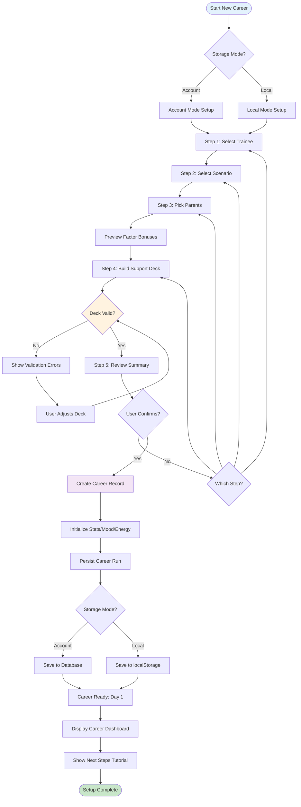
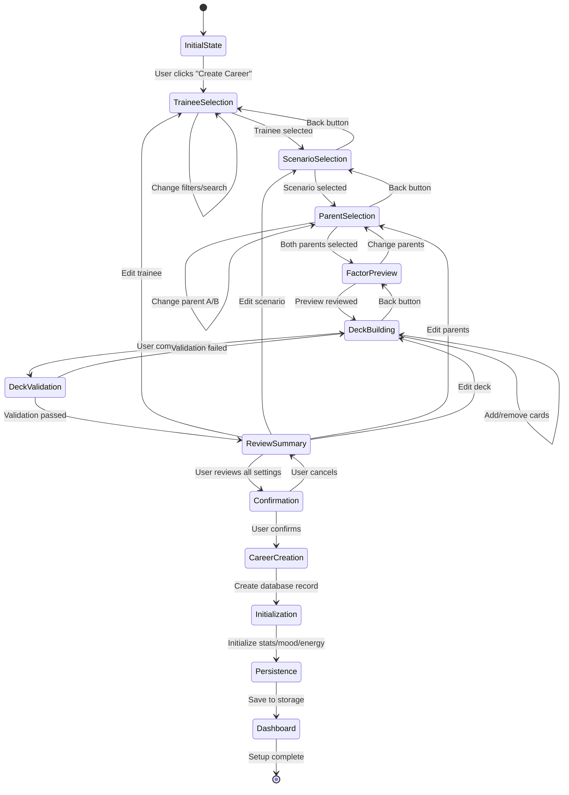
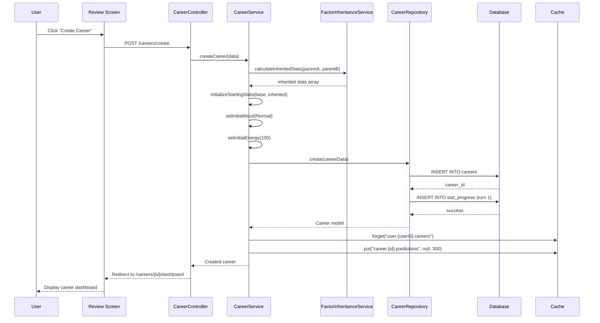
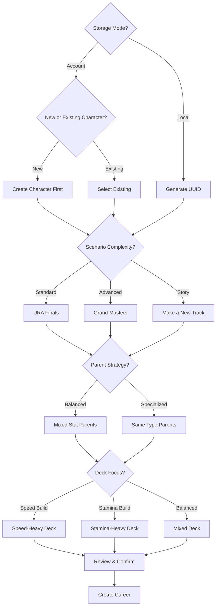
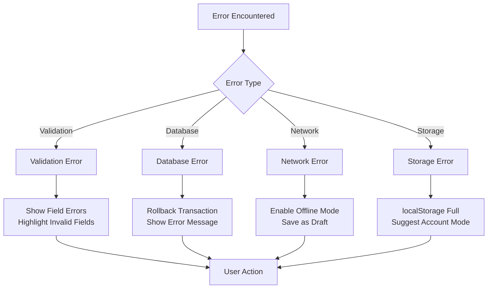
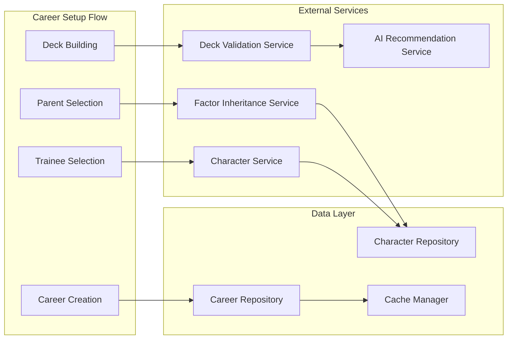

# UF-002: Career Setup Flow

## Umamusume Pretty Derby Career Planner

**Document Version**: 2.3.0
**Date**: February 22, 2026
**Related Documents**: [PRD-001], [SPEC-001], [SRS], [BRS]

**Source Specifications**:

- `.kiro/specs/umamusume-career-planner-main/requirements.md` (Requirement 1: Character State Management)
- `.kiro/specs/umamusume-career-planner-main/design.md` (Character Creation Flow)

**Related Artifacts**:

- PRD: [PRD-001](../prds/PRD-001_Character_Management.md)
- SPEC: [SPEC-001](../specs/SPEC-001_Character_Management_Technical.md)
- Flow: [FLOW-001](../flows/FLOW-001_Character_Management_System.md)
- Tech Flow: [TECH-FLOW-001](../tech-flow/TECH-FLOW-001_Character_Management_Flow.md)
- Wireframes: [WF-002](../wireframes/WF-002_Character_Creation_Wizard.md), [WF-003](../wireframes/WF-003_Character_Detail_Management.md)
- Sequences: [SEQ-001](../sequences/SEQ-001_Character_Creation_Sequence.md)
- User Manual: [D17](../D17_SUM_Software_User_Manual.md#5-career-run-management)

---

## Table of Contents

1. [Overview](#1-overview)
2. [Flow Diagram](#2-flow-diagram)
3. [User Journey Steps](#3-user-journey-steps)
4. [Decision Points](#4-decision-points)
5. [Validation Rules](#5-validation-rules)
6. [Success Criteria](#6-success-criteria)
7. [Error Handling](#7-error-handling)
8. [Related Flows](#8-related-flows)

---

## 1. Overview

### 1.1 Purpose

The Career Setup Flow guides users through the complete process of creating a new career run, from selecting a trainee character through configuring their support deck and inheritance factors. This flow is critical as it establishes the foundation for all subsequent training, racing, and skill management activities.

### 1.2 Scope

- **Aspect**: **Entry Point**; **Description**: Dashboard "Create Career" button or character list "New Career" action
- **Aspect**: **Exit Point**; **Description**: Character dashboard with initialized career run (Day 1, Junior Year)
- **Aspect**: **Duration**; **Description**: 5-10 minutes for experienced users, 15+ minutes for first-time users
- **Aspect**: **User Type**; **Description**: All authenticated users (Account mode) or guest users (Local mode)

### 1.3 Business Context

**Business Goal**: Minimize friction in career creation while ensuring users make informed decisions about character configuration that will impact their entire playthrough.

**Success Metrics**:

- Career creation completion rate: > 85%
- Time to first career creation: < 10 minutes
- Deck validation error rate: < 15%
- User returns to complete abandoned setups: > 40%

---

## 2. Flow Diagram

### 2.1 High-Level Flow



### 2.2 Detailed State Diagram



---

## 3. User Journey Steps

### 3.1 Step 1: Select Trainee & Scenario

**Purpose**: Choose the Uma Musume character and scenario type for the career run.

#### 3.1.1 Trainee Selection Interface

```
┌────────────────────────────────────────────────────────────┐
│  Create New Career - Step 1 of 5                           │
├────────────────────────────────────────────────────────────┤
│  Select Your Trainee                                       │
│  ┌──────────────────────────────────────────────────────┐  │
│  │ 🔍 Search trainees by name...                        │  │
│  └──────────────────────────────────────────────────────┘  │
│                                                            │
│  Filter:  [All Rarities ▼]  [All Distances ▼]  [Sort: Name ▼] │
│                                                            │
│  ┌─────────────────┬─────────────────┬─────────────────┐  │
│  │ Special Week    │ Silence Suzuka  │ Tokai Teio      │  │
│  │ ★★★ SSR         │ ★★★ SSR         │ ★★★ SSR         │  │
│  │ All-Rounder     │ Speed Focus     │ Stamina Focus   │  │
│  │ [SELECT]        │ [SELECT]        │ [SELECT]        │  │
│  └─────────────────┴─────────────────┴─────────────────┘  │
│                                                            │
│  ┌─────────────────┬─────────────────┬─────────────────┐  │
│  │ Mejiro McQueen  │ Gold Ship       │ Vodka           │  │
│  │ ★★★ SSR         │ ★★★ SSR         │ ★★ SR           │  │
│  │ Long Distance   │ Unique Style    │ Dirt Specialist │  │
│  │ [SELECT]        │ [SELECT]        │ [SELECT]        │  ��
│  └─────────────────┴─────────────────┴─────────────────┘  │
│                                                            │
│  Showing 6 of 52 trainees                [Load More]      │
│                                                            │
│                                    [← BACK]  [NEXT →]     │
└────────────────────────────────────────────────────────────┘
```

**User Actions**:

- **Action**: Select Trainee; **Description**: Click on character card; **Next State**: Enable "Next" button
- **Action**: Search; **Description**: Type in search box; **Next State**: Filter trainee list
- **Action**: Filter; **Description**: Apply rarity/distance/aptitude filters; **Next State**: Update trainee list
- **Action**: Load More; **Description**: Pagination; **Next State**: Display additional trainees

**Implementation Details**:

- **Route**: `/careers/create/step/1`
- **Livewire Component**: `App\Livewire\Career\TraineeSelector`
- **Data Source**: `characters` table via `CharacterRepository`
- **Validation**: Trainee selection is required before proceeding

#### 3.1.2 Scenario Selection Interface

```
┌────────────────────────────────────────────────────────────┐
│  Create New Career - Step 1 of 5 (continued)               │
├────────────────────────────────────────────────────────────┤
│  Selected: Special Week ★★★                                │
│                                                            │
│  Choose Scenario                                           │
│                                                            │
│  ┌────────────────────────────────────────────────────────┐│
│  │ ○ URA Finals                                          ││
│  │   Standard career mode with championship races         ││
│  │   Turns: 78 | Difficulty: ★★★☆☆                       ││
│  │                                                        ││
│  │ ○ Grand Masters                                       ││
│  │   Advanced scenario with special events                ││
│  │   Turns: 78 | Difficulty: ★★★★☆                       ││
│  │                                                        ││
│  │ ○ Make a New Track!! (Chapter 1)                      ││
│  │   Story-focused scenario                               ││
│  │   Turns: 78 | Difficulty: ★★☆☆☆                       ││
│  └────────────────────────────────────────────────────────┘│
│                                                            │
│                          [← CHANGE TRAINEE]  [NEXT →]     │
└────────────────────────────────────────────────────────────┘
```

**Scenario Types**:

- **Scenario**: URA Finals; **Turns**: 70-78; **Difficulty**: ★★★☆☆; **Special Features**: Standard championship path
- **Scenario**: Grand Masters; **Turns**: 70-78; **Difficulty**: ★★★★☆; **Special Features**: Enhanced training bonuses, harder races
- **Scenario**: Make a New Track!!; **Turns**: 70-78; **Difficulty**: ★★☆☆☆; **Special Features**: Story events, unique rewards
- **Scenario**: Aoharu Cup; **Turns**: 70-78; **Difficulty**: ★★★★★; **Special Features**: Team battles, special training

**Career Structure (Verified Jan 2026)**:

- Total turns: ~70-78 across 3 years (Junior, Classic, Senior)
- Summer Training Camp: 4 turns in Early July, all facilities at Level 5
- Important breakpoints: Turn 1 (Junior start), Turn 24 (Classic start), Turn 48 (Senior start)

**Business Rules**:

- Scenario selection is required
- Some scenarios may be locked until user reaches certain milestones (future enhancement)
- Selected scenario determines available races and events

---

### 3.2 Step 2: Parent Selection & Factor Inheritance

**Purpose**: Select parent characters to inherit stat bonuses and aptitude improvements.

#### 3.2.1 Parent Selection Interface

```
┌────────────────────────────────────────────────────────────┐
│  Create New Career - Step 2 of 5                           │
├────────────────────────────────────────────────────────────┤
│  Inheritance Configuration                                 │
│  Select parent characters to inherit stat and aptitude bonuses │
│                                                            │
│  ┌───────────────────────────┬───────────────────────────┐ │
│  │ Parent A                  │ Parent B                  │ │
│  ├───────────────────────────┼───────────────────────────┤ │
│  │ [SELECT PARENT A]         │ [SELECT PARENT B]         │ │
│  │                           │                           │ │
│  │ Special Week              │ Silence Suzuka            │ │
│  │ ★★★ SSR                   │ ★★★ SSR                   │ │
│  │                           │                           │ │
│  │ Stat Bonuses:             │ Stat Bonuses:             │ │
│  │ • Speed: +12 ★★☆         │ • Speed: +21 ★★★         │ │
│  │ • Stamina: +5 ★☆☆        │ • Stamina: +12 ★★☆       │ │
│  │ • Power: +12 ★★☆         │ • Power: +5 ★☆☆          │ │
│  │                           │                           │ │
│  │ Aptitude Bonuses:         │ Aptitude Bonuses:         │ │
│  │ • Mile: +1 grade          │ • Mile: +1 grade          │ │
│  │ • Turf: +1 grade          │ • Turf: +2 grades         │ │
│  │                           │                           │ │
│  │ [CHANGE]                  │ [CHANGE]                  │ │
│  └───────────────────────────┴───────────────────────────┘ │
│                                                            │
│  Combined Inheritance Preview:                             │
│  ┌────────────────────────────────────────────────────────┐│
│  │ Speed:   +33  (A: +12, B: +21)                        ││
│  │ Stamina: +17  (A: +5, B: +12)                         ││
│  │ Power:   +17  (A: +12, B: +5)                         ││
│  │ Guts:    +0   (No bonuses)                            ││
│  │ Wit:     +0   (No bonuses)                            ││
│  │                                                        ││
│  │ Aptitudes:                                             ││
│  │ • Mile: B → A (Combined +2 grades)                    ││
│  │ • Turf: C → A (Combined +3 grades)                    ││
│  └────────────────────────────────────────────────────────┘│
│                                                            │
│                                    [← BACK]  [NEXT →]     │
└────────────────────────────────────────────────────────────┘
```

**Factor Star Levels**:

- **Stars**: ★☆☆; **Stat Bonus**: +5; **Description**: Single star factor
- **Stars**: ★★☆; **Stat Bonus**: +12; **Description**: Double star factor
- **Stars**: ★★★; **Stat Bonus**: +21; **Description**: Triple star factor (maximum)

**Aptitude Grade Inheritance**:

- Each parent can provide up to +2 grades per aptitude
- Combined bonuses from both parents applied
- Maximum aptitude grade: S (cannot exceed)
- Grade scale: G→F→E→D→C→B→A→S (S is maximum)

**Implementation Details**:

```php
// app/Services/FactorInheritanceService.php
class FactorInheritanceService
{
    public function calculateInheritedStats(
        Character $parentA,
        Character $parentB
    ): array {
        $bonuses = [
            'speed' => 0,
            'stamina' => 0,
            'power' => 0,
            'guts' => 0,
            'wit' => 0,
        ];

        foreach ($parentA->factors as $factor) {
            $bonuses[$factor->stat_type] += $this->getStarBonus($factor->star_level);
        }

        foreach ($parentB->factors as $factor) {
            $bonuses[$factor->stat_type] += $this->getStarBonus($factor->star_level);
        }

        return $bonuses;
    }

    private function getStarBonus(int $stars): int
    {
        return match($stars) {
            1 => 5,
            2 => 12,
            3 => 21,
            default => 0,
        };
    }
}
```

**Validation Rules**:

- Both Parent A and Parent B must be selected
- Parents cannot be the same character
- Factor inheritance calculated automatically upon parent selection

---

### 3.3 Step 3: Support Deck Configuration

**Purpose**: Build a 6-card support deck that will provide training bonuses throughout the career.

#### 3.3.1 Deck Building Interface

```
┌────────────────────────────────────────────────────────────┐
│  Create New Career - Step 3 of 5                           │
├────────────────────────────────────────────────────────────┤
│  Configure Support Deck (6 Cards Required)                 │
│                                                            │
│  Current Deck (4 of 6 cards)                               │
│  ┌─────────────────┬─────────────────┬─────────────────┐  │
│  │ 1. Mejiro Dober │ 2. Tokai Teio   │ 3. Kitasan Black│  │
│  │ ★★★ SSR Power   │ ★★★ SSR Speed   │ ★★★ SSR Stamina │  │
│  │ LB: 4/4 ★★★★   │ LB: 2/4 ★★☆☆   │ LB: 4/4 ★★★★   │  │
│  │ Bond: 90%       │ Bond: 75%       │ Bond: 85%       │  │
│  │ [REMOVE]        │ [REMOVE]        │ [REMOVE]        │  │
│  └─────────────────┴─────────────────┴─────────────────┘  │
│  ┌─────────────────┬─────────────────┬─────────────────┐  │
│  │ 4. Narita Brian │ 5. [EMPTY SLOT] │ 6. [EMPTY SLOT] │  │
│  │ ★★★ SSR Wit     │                 │ Friend Card     │  │
│  │ LB: 3/4 ★★★☆   │ [ADD CARD]      │ [BORROW]        │  │
│  │ Bond: 80%       │                 │                 │  │
│  │ [REMOVE]        │                 │                 │  │
│  └─────────────────┴─────────────────┴─────────────────┘  │
│                                                            │
│  ⚠️ Warning: Deck incomplete (2 slots remaining)           │
│                                                            │
│  Card Library                                              │
│  Filter: [All Types ▼] [All Rarities ▼] [Sort: Meta Tier ▼] │
│  ┌──────────────────────────────────────────────────────┐  │
│  │ Available Cards (45 total)                           │  │
│  │                                                       │  │
│  │ Symboli Rudolf (SSR Guts) - Meta: S Tier  [ADD]     │  │
│  │ Wonderful Luna (SR Stamina) - Meta: A Tier [ADD]     │  │
│  │ Mejiro McQueen (SSR Wisdom) - Meta: SS Tier [ADD]    │  │
│  └──────────────────────────────────────────────────────┘  │
│                                                            │
│  Deck Analysis:                                            │
│  • Speed: 1 card ✓                                         │
│  • Stamina: 1 card ✓                                       │
│  • Power: 1 card ✓                                         │
│  • Guts: 0 cards ⚠️ (Consider adding)                       │
│  • Wit: 1 card ✓                                           │
│  • Type diversity: Good                                    │
│  • Synergy score: 82/100                                   │
│                                                            │
│                                    [← BACK]  [NEXT →]     │
└────────────────────────────────────────────────────────────┘
```

**Deck Composition Rules**:

- **Rule**: Total Cards; **Description**: Exactly 6 cards; **Validation**: Required
- **Rule**: Owned Cards; **Description**: Up to 5 owned cards; **Validation**: Optional
- **Rule**: Borrowed Card; **Description**: 1 friend/rental card (slot 6); **Validation**: Optional
- **Rule**: Type Balance; **Description**: Recommended mix of stat types; **Validation**: Advisory only
- **Rule**: Rarity; **Description**: No restrictions; **Validation**: -

**Card Properties**:

- **Property**: Rarity; **Description**: SSR, SR, R; **Impact**: Affects base bonus strength
- **Property**: Type; **Description**: Speed, Stamina, Power, Guts, Wit, Friend; **Impact**: Training facility alignment
- **Property**: Limit Break (LB); **Description**: 0-4 stars; **Impact**: Increases bonus effectiveness
- **Property**: Bond Level; **Description**: 0-100%; **Impact**: Unlocks hints and friendship training (threshold: 80%)
- **Property**: Meta Tier; **Description**: SS, S, A, B, C; **Impact**: Community-sourced effectiveness rating

**Support Card Bond Mechanics (Verified Jan 2026)**:

- Base bond gain per training: +7
- With Charming condition: +9
- Friendship Training threshold: 80% bond level
- Friendship bonus by rarity: SSR 35%, SR 25%, R 10%

**Synergy Calculation**:

```php
// app/Services/DeckSynergyCalculator.php
class DeckSynergyCalculator
{
    public function calculateSynergy(array $cards): int
    {
        $score = 0;

        // Type diversity (0-30 points)
        $uniqueTypes = collect($cards)->pluck('card_type')->unique()->count();
        $score += min(30, $uniqueTypes * 6);

        // Rarity distribution (0-25 points)
        $ssrCount = collect($cards)->where('rarity', 'SSR')->count();
        $score += min(25, $ssrCount * 5);

        // Limit break levels (0-25 points)
        $avgLB = collect($cards)->avg('limit_break_level');
        $score += min(25, $avgLB * 6.25);

        // Bond levels (0-20 points)
        $avgBond = collect($cards)->avg('bond_level');
        $score += min(20, $avgBond * 0.2);

        return (int) $score;
    }
}
```

**Validation Errors**:

```
┌────────────────────────────────────────────────────────────┐
│  ⚠️ Deck Validation Errors                                  │
├────────────────────────────────────────────────────────────┤
│  • Deck must contain exactly 6 cards (currently 4)         │
│  • Recommendation: Add 1-2 Guts cards for race endurance   │
│                                                            │
│  [FIX ERRORS]                                              │
└────────────────────────────────────────────────────────────┘
```

---

### 3.4 Step 4: Review & Confirmation

**Purpose**: Final review of all configuration before creating the career run.

#### 3.4.1 Review Summary Interface

```
┌────────────────────────────────────────────────────────────┐
│  Create New Career - Step 4 of 5                           │
├────────────────────────────────────────────────────────────┤
│  Review Your Configuration                                 │
│                                                            │
│  ┌────────────────────────────────────────────────────────┐│
│  │ TRAINEE                                                ││
│  │ Special Week (★★★ SSR)                                 ││
│  │ All-Rounder · Base Stats: S/A/B/B/A                    ││
│  │                                          [EDIT TRAINEE] ││
│  └────────────────────────────────────────────────────────┘│
│                                                            │
│  ┌────────────────────────────────────────────────────────┐│
│  │ SCENARIO                                               ││
│  │ URA Finals (78 turns, ★★★☆☆ difficulty)                ││
│  │                                        [EDIT SCENARIO] ││
│  └────────────────────────────────────────────────────────┘│
│                                                            │
│  ┌────────────────────────────────────────────────────────┐│
│  │ INHERITANCE                                            ││
│  │ Parent A: Special Week (+12 Speed, +5 Stamina, +12 Power) ││
│  │ Parent B: Silence Suzuka (+21 Speed, +12 Stamina)     ││
│  │ Combined: +33 Speed, +17 Stamina, +17 Power           ││
│  │ Aptitudes: Mile C→A, Turf C→A                         ││
│  │                                         [EDIT PARENTS] ││
│  └────────────────────────────────────────────────────────┘│
│                                                            │
│  ┌────────────────────────────────────────────────────────┐│
│  │ SUPPORT DECK                                           ││
│  │ 1. Mejiro Dober (SSR Power, LB 4, Bond 90%)           ││
│  │ 2. Tokai Teio (SSR Speed, LB 2, Bond 75%)             ││
│  │ 3. Kitasan Black (SSR Stamina, LB 4, Bond 85%)        ││
│  │ 4. Narita Brian (SSR Wit, LB 3, Bond 80%)             ││
│  │ 5. Symboli Rudolf (SSR Guts, LB 2, Bond 70%)          ││
│  │ 6. [Friend] Mejiro McQueen (SSR Wisdom, LB 4)         ││
│  │ Synergy Score: 87/100 (Excellent)                     ││
│  │                                           [EDIT DECK]  ││
│  └────────────────────────────────────────────────────────┘│
│                                                            │
│  Starting Stats (Base + Inheritance):                      │
│  • Speed:   412 (379 + 33)                                 │
│  • Stamina: 367 (350 + 17)                                 │
│  • Power:   397 (380 + 17)                                 │
│  • Guts:    350 (350 + 0)                                  │
│  • Wit:     400 (400 + 0)                                  │
│                                                            │
│  Initial State:                                            │
│  • Energy: 100/100 ⚡                                       │
│  • Mood: Normal 😐                                         │
│  • Turn: 1 (Junior Year)                                   │
│  • SP Available: 0                                         │
│                                                            │
│                          [← BACK]  [CREATE CAREER →]      │
└───────────────────────────────────────���────────────────────┘
```

**User Actions**:

- **Action**: Edit Trainee; **Behavior**: Navigate to Step 1; **Next State**: Trainee selection
- **Action**: Edit Scenario; **Behavior**: Navigate to Step 1; **Next State**: Scenario selection
- **Action**: Edit Parents; **Behavior**: Navigate to Step 2; **Next State**: Parent selection
- **Action**: Edit Deck; **Behavior**: Navigate to Step 3; **Next State**: Deck builder
- **Action**: Create Career; **Behavior**: Submit configuration; **Next State**: Career creation
- **Action**: Back; **Behavior**: Return to previous step; **Next State**: Step 3 (deck)

---

### 3.5 Step 5: Career Initialization

**Purpose**: Create the career record and initialize all starting values.

#### 3.5.1 Creation Process Flow



**Database Operations**:

```sql
-- Create career record
INSERT INTO ucp_careers (
    uuid,
    user_id,
    character_id,
    scenario_type,
    status,
    career_stage,
    current_turn,
    speed,
    stamina,
    power,
    guts,
    wit,
    energy,
    mood,
    support_deck_id,
    created_at
) VALUES (
    'generated-uuid',
    1,
    5,
    'ura_finale',
    'in_progress',
    'junior',
    1,
    412,
    367,
    397,
    350,
    400,
    100,
    'normal',
    3,
    NOW()
);

-- Initialize turn 1 stats
INSERT INTO ucp_stat_progress (
    career_run_id,
    turn_number,
    speed,
    stamina,
    power,
    guts,
    wit,
    energy,
    mood,
    created_at
) VALUES (
    LAST_INSERT_ID(),
    1,
    412,
    367,
    397,
    350,
    400,
    100,
    'normal',
    NOW()
);
```

**Initial State Configuration**:

- **Property**: UUID; **Value**: Generated; **Source**: `Str::uuid()`
- **Property**: Status; **Value**: `in_progress`; **Source**: Default
- **Property**: Career Stage; **Value**: `junior`; **Source**: Default
- **Property**: Current Turn; **Value**: 1; **Source**: Default
- **Property**: Speed; **Value**: Base + Inheritance; **Source**: Calculated
- **Property**: Stamina; **Value**: Base + Inheritance; **Source**: Calculated
- **Property**: Power; **Value**: Base + Inheritance; **Source**: Calculated
- **Property**: Guts; **Value**: Base + Inheritance; **Source**: Calculated
- **Property**: Wit; **Value**: Base + Inheritance; **Source**: Calculated
- **Property**: Energy; **Value**: 100; **Source**: Default
- **Property**: Mood; **Value**: `normal`; **Source**: Default
- **Property**: SP Available; **Value**: 0; **Source**: Default

---

## 4. Decision Points

### 4.1 Decision Tree



### 4.2 Key Decision Points

- **Decision**: **Storage Mode**; **Options**: Local, Account; **Impact**: Data persistence and sync; **Recommendation**: Account for long-term use
- **Decision**: **Trainee Selection**; **Options**: 52+ characters; **Impact**: Base stats and aptitudes; **Recommendation**: Align with desired playstyle
- **Decision**: **Scenario**; **Options**: URA Finals, Grand Masters, etc.; **Impact**: Race schedule and difficulty; **Recommendation**: URA Finals for beginners
- **Decision**: **Parent Strategy**; **Options**: Balanced, Specialized; **Impact**: Initial stat distribution; **Recommendation**: Balanced for flexibility
- **Decision**: **Deck Focus**; **Options**: Speed, Stamina, Balanced; **Impact**: Training bonus distribution; **Recommendation**: Align with trainee strengths

---

## 5. Validation Rules

### 5.1 Field Validation

- **Field**: `trainee_id`; **Rule**: Required, exists in `characters` table; **Error Message**: "Trainee selection is required"
- **Field**: `scenario_type`; **Rule**: Required, valid enum value; **Error Message**: "Invalid scenario type"
- **Field**: `parent_a_id`; **Rule**: Required, exists in `characters` table; **Error Message**: "Parent A selection is required"
- **Field**: `parent_b_id`; **Rule**: Required, exists in `characters` table, ≠ parent_a_id; **Error Message**: "Parent B must be different from Parent A"
- **Field**: `support_deck`; **Rule**: Required, array, exactly 6 cards; **Error Message**: "Support deck must contain exactly 6 cards"
- **Field**: `support_deck.*.card_id`; **Rule**: Exists in `support_cards` table; **Error Message**: "Invalid support card selected"

### 5.2 Business Rule Validation

```php
// app/Http/Requests/CreateCareerRequest.php
class CreateCareerRequest extends FormRequest
{
    public function rules(): array
    {
        return [
            'trainee_id' => 'required|exists:characters,id',
            'scenario_type' => 'required|in:ura_finale,grand_masters,make_a_new_track,aoharu_cup',
            'parent_a_id' => 'required|exists:characters,id',
            'parent_b_id' => 'required|exists:characters,id|different:parent_a_id',
            'support_deck' => 'required|array|size:6',
            'support_deck.*.card_id' => 'required|exists:support_cards,id',
        ];
    }

    public function messages(): array
    {
        return [
            'trainee_id.required' => 'Please select a trainee character.',
            'parent_a_id.required' => 'Parent A selection is required.',
            'parent_b_id.different' => 'Parent B must be different from Parent A.',
            'support_deck.size' => 'Support deck must contain exactly 6 cards.',
        ];
    }
}
```

### 5.3 Deck Validation

```php
// app/Services/DeckValidationService.php
class DeckValidationService
{
    public function validate(array $cards): ValidationResult
    {
        $errors = [];

        // Rule 1: Exactly 6 cards
        if (count($cards) !== 6) {
            $errors[] = 'Deck must contain exactly 6 cards';
        }

        // Rule 2: Maximum 5 owned cards (slot 6 is friend/rental)
        $ownedCards = collect($cards)->filter(fn($c) => !$c['is_borrowed'])->count();
        if ($ownedCards > 5) {
            $errors[] = 'Maximum 5 owned cards allowed (slot 6 is friend card)';
        }

        // Rule 3: No duplicate cards
        $uniqueCards = collect($cards)->pluck('card_id')->unique()->count();
        if ($uniqueCards !== count($cards)) {
            $errors[] = 'Duplicate cards are not allowed';
        }

        return new ValidationResult(
            valid: empty($errors),
            errors: $errors,
            warnings: $this->generateWarnings($cards)
        );
    }

    private function generateWarnings(array $cards): array
    {
        $warnings = [];

        // Warning: Type diversity
        $types = collect($cards)->pluck('card_type')->unique();
        if ($types->count() < 4) {
            $warnings[] = 'Consider adding more type diversity for balanced training';
        }

        // Warning: Low synergy
        $synergy = app(DeckSynergyCalculator::class)->calculateSynergy($cards);
        if ($synergy < 60) {
            $warnings[] = 'Deck synergy is low. Consider better card alignment.';
        }

        return $warnings;
    }
}
```

---

## 6. Success Criteria

### 6.1 Functional Success

- ✅ Career record created in database or localStorage
- ✅ Starting stats correctly calculated with inheritance
- ✅ Support deck persisted with all 6 cards
- ✅ Initial turn (1) logged in `stat_progress` table
- ✅ User redirected to career dashboard
- ✅ No console errors or warnings

### 6.2 User Experience Success

- **Metric**: Completion rate; **Target**: > 85%; **Measurement**: Analytics tracking
- **Metric**: Time to complete; **Target**: < 10 minutes; **Measurement**: Session duration
- **Metric**: Error encounter rate; **Target**: < 15%; **Measurement**: Validation error logs
- **Metric**: Tutorial engagement; **Target**: > 60%; **Measurement**: User interaction tracking

### 6.3 Data Integrity Success

```php
// tests/Feature/CareerSetupTest.php
test('career setup creates valid record', function () {
    $user = User::factory()->create();
    $trainee = Character::factory()->create();
    $parentA = Character::factory()->create();
    $parentB = Character::factory()->create();
    $cards = SupportCard::factory()->count(6)->create();

    actingAs($user)
        ->post('/careers/create', [
            'trainee_id' => $trainee->id,
            'scenario_type' => 'ura_finale',
            'parent_a_id' => $parentA->id,
            'parent_b_id' => $parentB->id,
            'support_deck' => $cards->pluck('id')->toArray(),
        ])
        ->assertRedirect();

    $career = Career::where('user_id', $user->id)->latest()->first();

    expect($career)->not->toBeNull()
        ->and($career->character_id)->toBe($trainee->id)
        ->and($career->current_turn)->toBe(1)
        ->and($career->status->value)->toBe('in_progress')
        ->and($career->energy)->toBe(100)
        ->and($career->mood->value)->toBe('normal');
});
```

---

## 7. Error Handling

### 7.1 Error Scenarios



### 7.2 Error Messages

- **Error Code**: `CS-001`; **Trigger**: Validation failed; **Message**: "Please fix the highlighted errors before proceeding"; **User Action**: Correct invalid fields
- **Error Code**: `CS-002`; **Trigger**: Database error; **Message**: "Unable to create career. Please try again."; **User Action**: Retry or contact support
- **Error Code**: `CS-003`; **Trigger**: Network timeout; **Message**: "Connection lost. Your progress has been saved as a draft."; **User Action**: Wait for reconnection
- **Error Code**: `CS-004`; **Trigger**: localStorage full; **Message**: "Browser storage is full. Please use Account mode or clear data."; **User Action**: Switch to Account mode
- **Error Code**: `CS-005`; **Trigger**: Deck validation failed; **Message**: "Support deck configuration is invalid. Please review your selections."; **User Action**: Fix deck composition

### 7.3 Recovery Strategies

- **Scenario**: Validation error; **Primary Recovery**: Show errors inline; **Fallback Recovery**: Provide help tooltips; **Ultimate Fallback**: Link to documentation
- **Scenario**: Database error; **Primary Recovery**: Retry transaction; **Fallback Recovery**: Roll back changes; **Ultimate Fallback**: Save as draft
- **Scenario**: Network error; **Primary Recovery**: Queue for sync; **Fallback Recovery**: Save to localStorage; **Ultimate Fallback**: Offline mode
- **Scenario**: Storage quota; **Primary Recovery**: Compress data; **Fallback Recovery**: Suggest Account mode; **Ultimate Fallback**: Export and reset

---

## 8. Related Flows

### 8.1 Downstream Flows

After career setup completion, users proceed to:

- **Flow**: Training Day Flow; **Document Reference**: [UF-003](UF-003_Training_Day_Flow.md); **Entry Condition**: User starts first training session
- **Flow**: Career Dashboard; **Document Reference**: [WF-001](../wireframes/WF-001_Dashboard_Overview.md); **Entry Condition**: Career successfully created
- **Flow**: Support Deck Management; **Document Reference**: [UF-006](UF-006_Support_Deck_Building_Flow.md); **Entry Condition**: User wants to modify deck

### 8.2 Alternative Entry Points

- **Entry Point**: Character List; **Scenario**: User clicks "New Career" on character; **Flow Adjustment**: Pre-select trainee, skip to scenario
- **Entry Point**: Import Wizard; **Scenario**: User imports career data; **Flow Adjustment**: Auto-populate all fields, skip to review
- **Entry Point**: Copy Existing Career; **Scenario**: User duplicates previous career; **Flow Adjustment**: Pre-populate with previous configuration

### 8.3 Integration Points



---

## Document Control

- **Version**: 2.3.0; **Date**: 2026-02-22; **Author**: Development Team; **Changes**: Updated version and dates; no functional changes
- **Version**: 2.2.0; **Date**: 2026-01-28; **Author**: Development Team; **Changes**: Updated with verified game mechanics from Global English Server (Jan 2026); corrected aptitude grade system (G→F→E→D→C→B→A→S, S is maximum); updated support card bond system (80% threshold for friendship training, 10-35% bonus by rarity); added career structure details (~70-78 turns, Summer Training Camp mechanics)
- **Version**: 2.1.0; **Date**: 2026-01-24; **Author**: Development Team; **Changes**: Complete rewrite aligned with v2.0.0 architecture; added factor inheritance, deck synergy, validation details; integrated with current implementation
- **Version**: 2.0.0; **Date**: 2026-01-14; **Author**: Development Team; **Changes**: Prior revision with basic flow
- **Version**: 1.0.0; **Date**: 2026-01-03; **Author**: Development Team; **Changes**: Initial draft

---

## References

- [Software Development Plan (SDP)](../D01_SDP_Software_Development_Plan.md)
- [Business Requirements Specifications (BRS)](../D02_BRS_Business_Requirements_Specifications.md)
- [Software Requirements Specifications (SRS)](../D03_SRS_Software_Requirement_Specifications.md)
- [Software User Manual (SUM)](../D17_SUM_Software_User_Manual.md)
- [SPEC-001: Character Management Technical](../specs/SPEC-001_Character_Management_Technical.md)
- [FLOW-001: Character Management System](../flows/FLOW-001_Character_Management_System.md)
- [WF-002: Character Creation Wizard](../wireframes/WF-002_Character_Creation_Wizard.md)
- [SEQ-001: Character Creation Sequence](../sequences/SEQ-001_Character_Creation_Sequence.md)

---

### This user flow reflects the current career setup implementation as of version 2.3.0. For the latest updates, refer to the online documentation