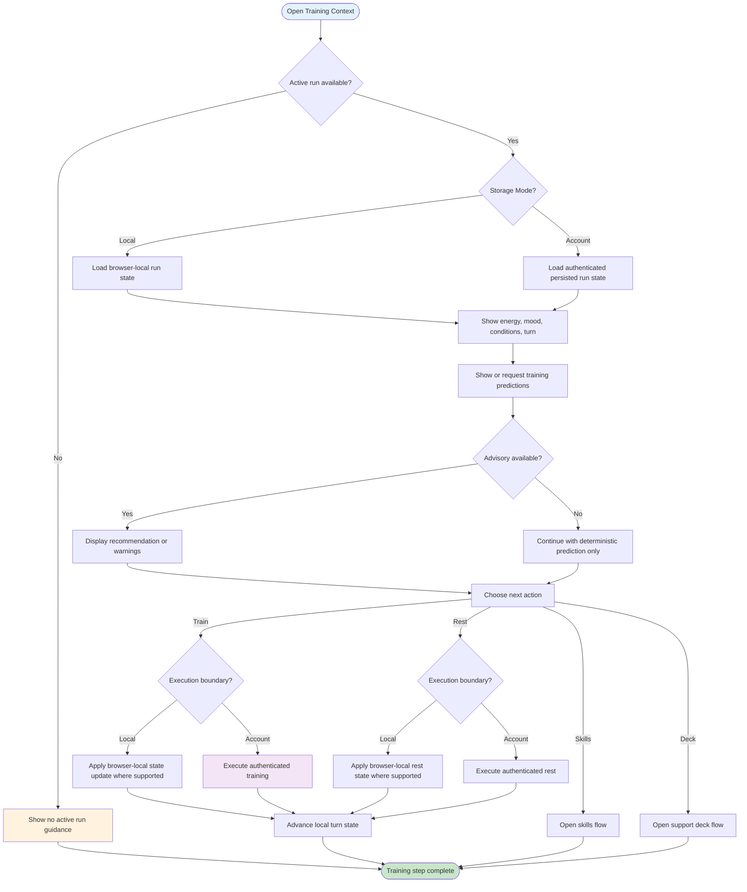
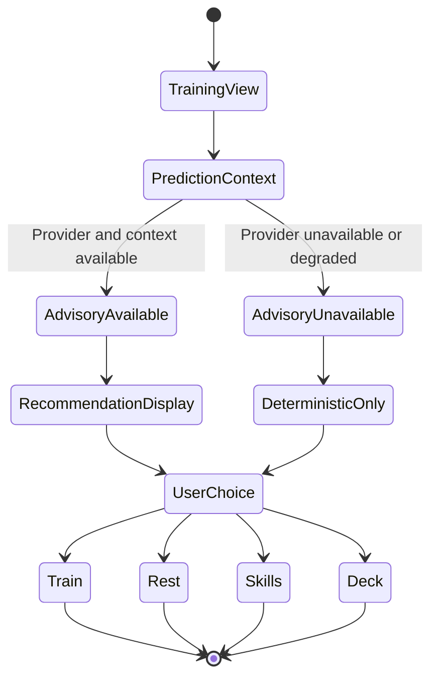

# UF-003: Training Day Flow

## Umamusume Pretty Derby Career Planner

**Document Version**: 2.3.0
**Date**: March 8, 2026
**Related Documents**: [PRD-002], [SPEC-002], [SRS], [BRS]

**Source Specifications**:

- `.kiro/specs/umamusume-career-planner-main/requirements.md` (Requirement 2: Training Prediction Engine)
- `.kiro/specs/umamusume-career-planner-main/design.md` (Training Flow)

**Related Artifacts**:

- PRD: [PRD-002](../02-prds/PRD-002_Training_Optimization.md)
- SPEC: [SPEC-002](../02-specs/SPEC-002_Training_Optimization_Technical.md)
- Flow: [FLOW-002](../01-flows/FLOW-002_Training_Optimization_System.md)
- Tech Flow: [TECH-FLOW-002](../01-tech-flow/TECH-FLOW-002_Training_Optimization_Flow.md)
- Wireframes: [WF-004](../01-wireframes/WF-004_Training_Selection_Interface.md),
[WF-005](../01-wireframes/WF-005_Training_Result_Screen.md)
- Sequences: [SEQ-002](../01-sequences/SEQ-002_Training_Block_Resolution.md),
[SEQ-003](../01-sequences/SEQ-003_Skill_Acquisition_and_Upgrade.md),
[SEQ-017](../01-sequences/SEQ-017_Storage_Mode_Transition.md)
- User Manual: [017_SUM](../00-core-docs/017_SUM_Software_User_Manual.md#6-training-system)

---

## Table of Contents

1. [Overview](#1-overview)
2. [Flow Diagram](#2-flow-diagram)
3. [User Journey Steps](#3-user-journey-steps)
4. [Decision Points](#4-decision-points)
5. [Success Criteria](#5-success-criteria)
6. [Error Handling](#6-error-handling)
7. [Related Flows](#7-related-flows)

---

## 1. Overview

### 1.1 Purpose

The Training Day Flow guides users through reviewing their current run state, comparing available
training options, optionally requesting advisory help, and executing a training or rest action when
the active storage mode supports it. It treats prediction, advice, and execution as related but
distinct steps.

### 1.2 Scope

| Aspect | Description |
| --- | --- |
| **Entry Point** | Training screen, dashboard training panel, or turn-start training state |
| **Exit Point** | Training or rest action resolved, or user leaves with updated planning context |
| **Duration** | 1-3 minutes for a normal decision; longer if the user detours into skills, deck, or advice |
| **User Type** | Users with an active run in the current storage mode context: browser-local run in Local mode, authenticated persisted run in Account mode |

### 1.3 Storage Mode Support

- `StorageMode::ACCOUNT`: implemented for authenticated training execution, persisted history, and
DB-backed career state.
- `StorageMode::LOCAL`: supported for browser-local planning and state handling where available;
account-backed reporting and server-side history should not be implied.

### 1.4 Navigation Surface

This flow may appear through dashboard or training UI components. Route and persistence behavior
should be documented separately from conceptual training steps.

Where implementation-backed navigation is relevant, the current route surface and related APIs include:

- `/characters/{character}/training`
- `/api/training/characters/{character}/predictions`
- `/api/training/characters/{character}/execute`
- `/api/advisory/training/recommendations`

### 1.5 Business Context

**Business Goal**: Help users make informed turn-by-turn training choices while keeping the
persistence boundary clear between browser-local planning and authenticated execution.

**Success Metrics**:

- Users can compare training options without confusion about what is advisory versus persisted.
- Not-ready states, no-run states, and degraded-advisory states are recoverable.
- Account-mode users can execute training and continue the run without hidden persistence assumptions.

---

## 2. Flow Diagram

### 2.1 High-Level Flow

### 2.2 Degraded Advisory Branch

---

## 3. User Journey Steps

### 3.1 Step 1: Open Training Context

**Purpose**: Confirm that the user has an active run and show the state needed for the next decision.

**What the user reviews**:

- current turn or phase
- energy, mood, and conditions
- current stats and support-deck context
- whether an upcoming race or goal should affect the next action

**Empty-state branch**:

If no active run exists in the current storage mode context, the flow should redirect the user to
career setup instead of implying that training can proceed.

### 3.2 Step 2: Compare Training Options

**Purpose**: Show available training, rest, and detour options before execution.

**Possible user actions**:

| Action | Outcome |
| --- | --- |
| Review training predictions | Compare gains, risks, and tradeoffs |
| Request advice | Get advisory guidance when available |
| Open skill flow | Consider spending SP before training |
| Open support deck flow | Adjust deck assumptions before final choice |
| Choose rest | Prioritize recovery over gains |

**Stat semantics note**:

Training docs should not present a universal hard `0-1200` cap. Gameplay soft-cap behavior and
persistence-layer validation are different concerns.

### 3.3 Step 3: Handle Advisory Availability

**Purpose**: Keep the user flow usable when AI or advisory services are degraded.

**User-visible outcomes**:

- advisory available: show recommendation, warnings, or rationale
- advisory unavailable: continue with deterministic predictions or currently visible baseline guidance

Local advisory can use normalized client payloads without requiring DB-backed character context.

### 3.3.1 Loading-State Guidance

When predictions or advisory responses are being requested, the UI should present an explicit
loading state rather than leaving the previous turn state visually unchanged. Recommended messaging:

- "Loading training predictions..."
- "Preparing advisory guidance..."
- "Applying training choice..."

### 3.4 Step 4: Execute or Preserve State

**Purpose**: Apply the chosen training or rest action using the correct persistence boundary.

**Account-mode path**:

1. User confirms training or rest.
2. The application uses authenticated persisted run context.
3. Training execution updates stats, energy, and turn state.
4. Persisted history and follow-up state become available.

**Local-mode path**:

1. User confirms a planning or local-state action.
2. Browser-local run state is updated where supported.
3. The flow should not imply account-backed history or report generation.

---

## 4. Decision Points

### 4.1 Is There an Active Run?

Training requires an active run in the current storage mode context. If none exists, redirect to setup.

### 4.2 Is Advisory Available?

If advisory is unavailable, the user should still be able to continue with deterministic predictions
or baseline UI guidance.

### 4.3 What Persistence Boundary Applies?

- Local mode: browser-local planning or local state progression where supported.
- Account mode: authenticated persisted training execution and history.

### 4.4 Should the User Detour First?

The flow should support detours into race prep, skill planning, or support deck adjustment without
implying that the user must execute training immediately.

---

## 5. Success Criteria

- The user can distinguish advisory from execution.
- No-run and degraded-advisory states are recoverable.
- Local-mode wording does not imply DB-backed history or reporting.
- Account-mode wording clearly represents authenticated execution and persisted follow-up state.

---

## 6. Error Handling

| Scenario | User-facing behavior |
| --- | --- |
| No active run | Show empty-state guidance and return to setup |
| Advisory unavailable | Continue with deterministic prediction or baseline UI guidance |
| Network unavailable in Account mode | Allow only non-persisted or already-loaded guidance where possible; block account-backed execution if required |
| Local session preserved without DB sync | Keep browser-local state intact and avoid implying server persistence |
| Invalid training choice | Return user to option review with validation feedback |

---

## 7. Related Flows

- [UF-004_Race_Day_Flow.md](UF-004_Race_Day_Flow.md)
- [UF-005_Skill_Management_Flow.md](UF-005_Skill_Management_Flow.md)
- [UF-006_Support_Deck_Building_Flow.md](UF-006_Support_Deck_Building_Flow.md)
- [UF-009_Storage_Mode_Transition_Flow.md](UF-009_Storage_Mode_Transition_Flow.md)
- [TECH-FLOW-002](../01-tech-flow/TECH-FLOW-002_Training_Optimization_Flow.md)
- [TECH-FLOW-006](../01-tech-flow/TECH-FLOW-006_AI_Advisory_Flow.md)
- [SEQ-002](../01-sequences/SEQ-002_Training_Block_Resolution.md)
- [SEQ-017](../01-sequences/SEQ-017_Storage_Mode_Transition.md)
