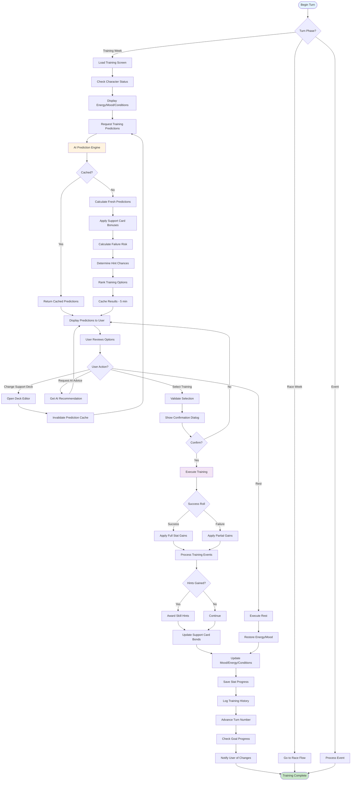
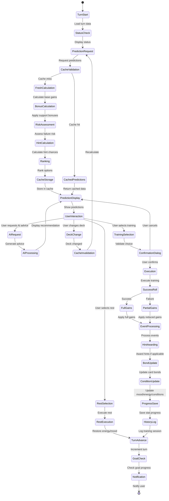
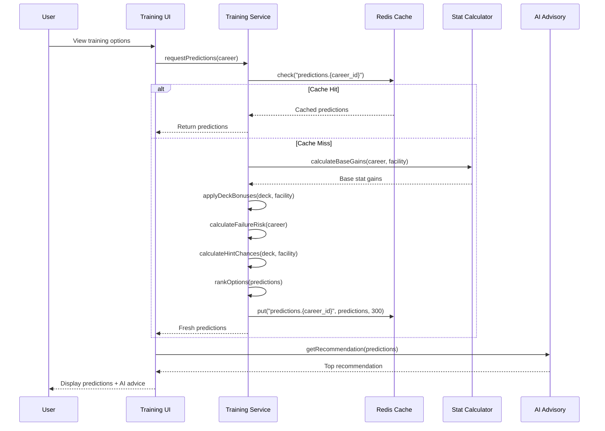
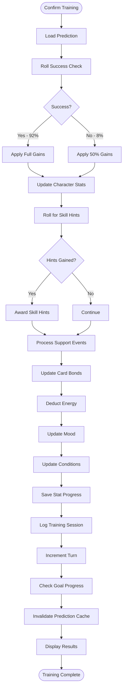
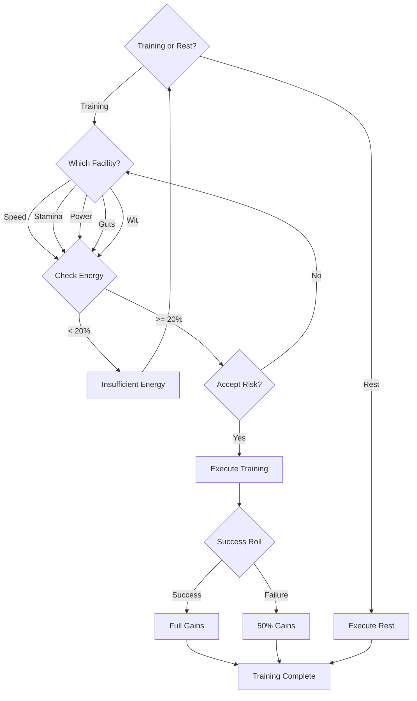
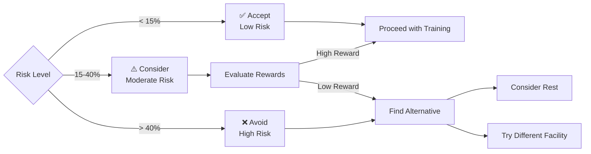
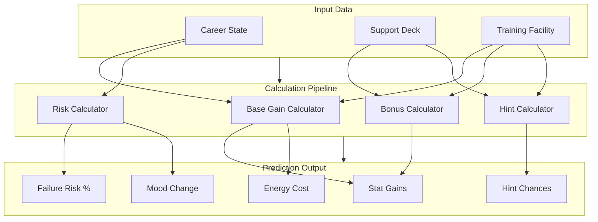
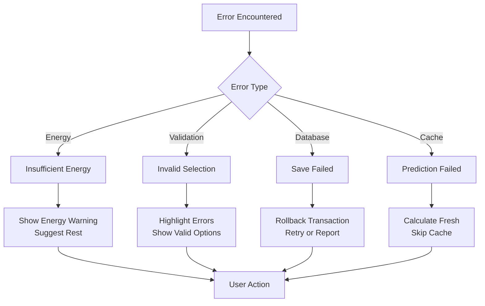
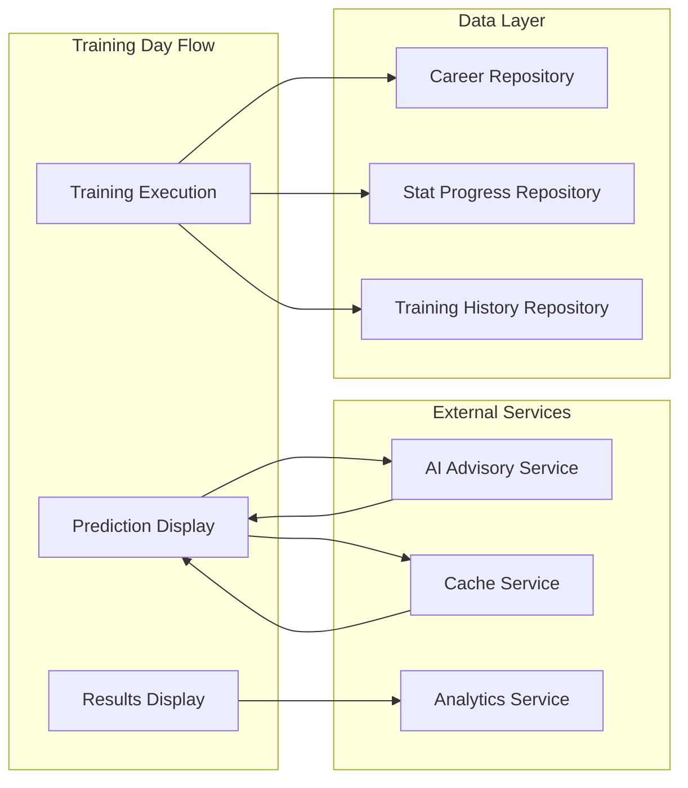

# UF-003: Training Day Flow

## Umamusume Pretty Derby Career Planner

**Document Version**: 2.2.0  
**Date**: January 28, 2026  
**Related Documents**: [PRD-002], [SPEC-002], [SRS], [BRS]

**Source Specifications**:

- `.kiro/specs/umamusume-career-planner-main/requirements.md` (Requirement 2: Training Prediction Engine)
- `.kiro/specs/umamusume-career-planner-main/design.md` (Training Flow)

**Related Artifacts**:

- PRD: [PRD-002](../prds/PRD-002_Training_Optimization.md)
- SPEC: [SPEC-002](../specs/SPEC-002_Training_Optimization_Technical.md)
- Flow: [FLOW-002](../flows/FLOW-002_Training_Optimization_System.md)
- Tech Flow: [TECH-FLOW-002](../tech-flow/TECH-FLOW-002_Training_Optimization_Flow.md)
- Wireframes: [WF-004](../wireframes/WF-004_Training_Selection_Interface.md), [WF-005](../wireframes/WF-005_Training_Result_Screen.md)
- Sequences: [SEQ-002](../sequences/SEQ-002_Training_Block_Resolution.md), [SEQ-003](../sequences/SEQ-003_Skill_Acquisition_and_Upgrade.md)
- User Manual: [D17](../D17_SUM_Software_User_Manual.md#6-training-system)

---

## Table of Contents

1. [Overview](#1-overview)
2. [Flow Diagram](#2-flow-diagram)
3. [User Journey Steps](#3-user-journey-steps)
4. [Decision Points](#4-decision-points)
5. [Training Prediction Engine](#5-training-prediction-engine)
6. [Success Criteria](#6-success-criteria)
7. [Error Handling](#7-error-handling)
8. [Related Flows](#8-related-flows)

---

## 1. Overview

### 1.1 Purpose

The Training Day Flow guides users through the process of selecting and executing training sessions during their career run. This flow is central to character progression, incorporating AI-powered predictions, support card bonuses, and risk assessment to help users make optimal training decisions.

### 1.2 Scope

| Aspect | Description |
| --- | --- |
| **Entry Point** | Beginning of turn (Junior/Classic/Senior years) |
| **Exit Point** | Training executed, stats updated, turn advanced |
| **Duration** | 1-3 minutes per training decision |
| **User Type** | All users with active career runs |

### 1.3 Business Context

**Business Goal**: Provide intelligent, data-driven training recommendations to optimize character progression while maintaining game engagement and strategic depth.

**Success Metrics**:

- Training prediction accuracy: > 85%
- AI recommendation acceptance rate: > 70%
- User satisfaction with training guidance: > 4/5
- Average time per training decision: < 2 minutes

---

## 2. Flow Diagram

### 2.1 High-Level Flow



### 2.2 Detailed State Diagram



---

## 3. User Journey Steps

### 3.1 Step 1: Turn Start and Status Check

**Purpose**: Display current character state and readiness for training.

#### 3.1.1 Status Display Interface

```
┌────────────────────────────────────────────────────────────┐
│  Training Session - Turn 45 (Classic Year)            [≡]   │
├────────────────────────────────────────────────────────────┤
│  ┌────────────────────────────────────────────────────────┐│
│  │ Character Status                                       ││
│  │ ───────────────                                        ││
│  │ Energy:  ████████░░ 78%                                ││
│  │ Mood:    😊 Good (+2% bonus)                           ││
│  │ Condition: 🏃 Well Rested (+5% efficiency)             ││
│  │                                                        ││
│  │ Days Until Next Race: 15                               ││
│  └────────────────────────────────────────────────────────┘│
│                                                            │
│  Current Stats:                                            │
│  Speed: 520 (C+)  Stamina: 480 (C)  Power: 440 (D+)       │
│  Guts: 460 (C)    Wit: 450 (D+)                            │
│                                                            │
│  Active Support Deck: "Speed Focus Build"                 │
│  Synergy Score: 87/100                                     │
│                                                            │
│                          [Change Deck] [View Full Stats]   │
└────────────────────────────────────────────────────────────┘
```

**User Actions**:

| Action | Description | Next State |
| --- | --- | --- |
| View status | Automatic on page load | Display predictions |
| Change deck | Navigate to deck editor | Invalidate cache, recalculate |
| View full stats | Open detailed stats modal | Return to training |

**Implementation Details**:

```php
// app/Livewire/Training/TrainingSelector.php
class TrainingSelector extends Component
{
    public CareerRun $career;
    public Collection $predictions;
    
    public function mount(CareerRun $career)
    {
        $this->career = $career->load('character', 'supportDeck');
        $this->loadPredictions();
    }
    
    protected function loadPredictions(): void
    {
        $this->predictions = app(TrainingPredictionService::class)
            ->getPredictions($this->career);
    }
}
```

---

### 3.2 Step 2: Training Prediction Request

**Purpose**: Generate AI-powered predictions for all available training options.

#### 3.2.1 Prediction Engine Flow



#### 3.2.2 Prediction Calculation Components

| Component | Service | Purpose |
| --- | --- | --- |
| Base Gains | `StatGainCalculator` | Calculate raw stat increases |
| Support Bonuses | `SupportCardBonusCalculator` | Apply deck multipliers |
| Failure Risk | `RiskCalculator` | Assess training success probability |
| Hint Chances | `HintProbabilityCalculator` | Determine skill hint likelihood |
| Ranking | `TrainingRanker` | Score and order options |

**Base Gain Formula**:

```php
// app/Services/Calculators/StatGainCalculator.php
public function calculate(CareerRun $career, TrainingType $type): StatGains
{
    $baseValue = $this->getBaseValue($type, $career->career_stage);
    $growthRate = $career->character->{"growth_" . $type->primaryStat()};
    $moodModifier = $career->mood->modifier();
    $conditionModifier = $this->getConditionModifier($career->conditions);
    
    $gain = $baseValue * ($growthRate / 100) 
        * (1 + ($moodModifier / 100))
        * (1 + ($conditionModifier / 100));
    
    return new StatGains([
        $type->primaryStat() => round($gain),
        // Secondary stats calculated similarly
    ]);
}
```

---

### 3.3 Step 3: Training Option Display

**Purpose**: Present all training options with detailed predictions and AI recommendations.

#### 3.3.1 Training Selection Interface

```
┌────────────────────────────────────────────────────────────┐
│  Select Training Action                               [≡]   │
├────────────────────────────────────────────────────────────┤
│  🤖 AI RECOMMENDED: Speed Training           Rank: 1/6     │
│  ┌────────────────────────────────────────────────────────┐│
│  │ Speed Training                         Score: 94.2/100 ││
│  │                                                        ││
│  │ Predicted Stat Gains:                                  ││
│  │ • Speed:   +48  (520 → 568)  ⭐⭐⭐⭐⭐              ││
│  │ • Stamina: +5   (480 → 485)  ⭐                       ││
│  │ • Power:   +3   (440 → 443)  ⭐                       ││
│  │                                                        ││
│  │ ⚠️ Stat Cap Note: Stats above 1200 gain at 50% rate    ││
│  │                                                        ││
│  │ Energy Cost: -25% (78% → 53%)                          ││
│  │ Mood Impact: Good → Normal (-1 level)                  ││
│  │                                                        ││
│  │ Support Cards Active (Bond +7 base):                   ││
│  │ • Tokai Teio (Speed Spec, LB 4, Bond 85%) → +12 bonus 🔥││
│  │   Friendship Training Active (≥80% bond)              ││
│  │ • Kitasan Black (Stamina Spec, LB 4) → +3 bonus       ││
│  │                                                        ││
│  │ Skill Hint Chances (5-Level System):                   ││
│  │ • Lane Guidance: 100% ✓ (Guaranteed - Red !)          ││
│  │   Hint Level: 3 → 30% SP discount                     ││
│  │ • Blazing Speed: 35%                                   ││
│  │   Hint Level: 1 → 10% SP discount                     ││
│  │                                                        ││
│  │ Efficiency Rating: ★★★★★ Excellent                   ││
│  │ Failure Risk: 🟢 Low (8%)                              ││
│  │                                                        ││
│  │ AI Reasoning:                                          ││
│  │ "Speed is your primary stat gap for the upcoming G1.  ││
│  │  Strong support bonus available. Guaranteed hint."     ││
│  │                                                        ││
│  │              [SELECT SPEED TRAINING] [VIEW DETAILS]    ││
│  └────────────────────────────────────────────────────────┘│
│                                                            │
│  Other Training Options:                                   │
│  ┌──────────────────┬──────────────────┬──────────────────┐│
│  │ 2. Stamina       │ 3. Power         │ 4. Wit           ││
│  │ Rank: 2 (88.7)   │ Rank: 3 (82.4)   │ Rank: 4 (76.3)   ││
│  │ +42 Stamina      │ +38 Power        │ +35 Wit          ││
│  │ Risk: 🟡 Med(15%)│ Risk: 🟢 Low(9%) │ Risk: 🟢 Low(6%) ││
│  │ [SELECT]         │ [SELECT]         │ [SELECT]         ││
│  └──────────────────┴──────────────────┴──────────────────┘│
│                                                            │
│  ┌──────────────────┬──────────────────┐                  │
│  │ 5. Guts          │ 6. Rest          │                  │
│  │ Rank: 5 (68.2)   │ Rank: 6          │                  │
│  │ +32 Guts         │ Restore Energy   │                  │
│  │ Risk: 🟡 Med(18%)│ +50% Energy      │                  │
│  │ [SELECT]         │ [SELECT]         │                  │
│  └──────────────────┴──────────────────┘                  │
│                                                            │
│                      [Request Detailed AI Analysis]        │
└────────────────────────────────────────────────────────────┘
```

**Prediction Components Explained**:

| Component | Description | User Value |
| --- | --- | --- |
| **Score** | Composite ranking (0-100) | Quick comparison |
| **Stat Gains** | Expected stat increases (capped at +100 per training, +50 if stat > 1200) | Decision foundation |
| **Energy Cost** | Energy deduction | Resource management |
| **Mood Impact** | Mood level change | Long-term planning |
| **Support Cards** | Active bonus providers (Bond +7 base, +9 with Charming) | Bonus transparency |
| **Hint Chances** | Skill hint probabilities with 5-level discount system | Skill acquisition planning |
| **Efficiency** | Gain-to-cost ratio | Optimization metric |
| **Risk** | Failure probability | Risk assessment |
| **AI Reasoning** | Contextual explanation | Decision confidence |

**Skill Hint Discount System (Verified Jan 2026)**:

| Hint Level | SP Discount | Cumulative Effect |
| --- | --- | --- |
| Level 1 | 10% | Base discount |
| Level 2 | 20% | +10% from Level 1 |
| Level 3 | 30% | +10% from Level 2 |
| Level 4 | 35% | +5% from Level 3 |
| Level 5 | 40% | +5% from Level 4 (Maximum) |

**Additional Hint Sources**:

- Fast Learner condition: +10% additional discount
- Skill Sparks: Instant hint acquisition
- Hint Books: Consumable items for hints

---

### 3.4 Step 4: User Decision and Confirmation

**Purpose**: Allow user to select training option and confirm their choice.

#### 3.4.1 Confirmation Dialog

```
┌────────────────────────────────────────────────────────────┐
│  Confirm Training Selection                                │
├────────────────────────────────────────────────────────────┤
│  You are about to execute: Speed Training                  │
│                                                            │
│  Expected Results:                                         │
│  • Speed: +48 (520 → 568)                                  │
│  • Energy: -25% (78% → 53%)                                │
│  • Mood: Good → Normal                                     │
│  • Hint: Lane Guidance (100% chance)                       │
│                                                            │
│  ⚠️ Note: Actual results may vary based on success roll   │
│  Failure Risk: 🟢 8% (Success chance: 92%)                 │
│                                                            │
│             [CONFIRM AND EXECUTE] [CANCEL]                 │
└────────────────────────────────────────────────────────────┘
```

**User Actions**:

| Action | Behavior | Next State |
| --- | --- | --- |
| Confirm | Proceed with training | Execute training |
| Cancel | Return to selection | Training options |
| Request AI advice | Show detailed analysis | AI advisor modal |

**Implementation**:

```php
// app/Livewire/Training/TrainingSelector.php
public function selectTraining(string $facility): void
{
    $this->validate([
        'career.energy' => 'min:20',
    ], [
        'career.energy.min' => 'Insufficient energy for training',
    ]);
    
    $this->selectedFacility = $facility;
    $this->dispatch('show-confirmation-dialog');
}

public function confirmTraining(): void
{
    DB::transaction(function () {
        $result = app(TrainingService::class)->executeTraining(
            $this->career,
            $this->selectedFacility
        );
        
        $this->dispatch('training-completed', [
            'result' => $result,
        ]);
    });
}
```

---

### 3.5 Step 5: Training Execution

**Purpose**: Execute the training session and apply results.

#### 3.5.1 Execution Flow



#### 3.5.2 Success Roll Logic

```php
// app/Services/TrainingService.php
protected function rollSuccess(CareerRun $career, float $riskPercentage): bool
{
    $successChance = 100 - $riskPercentage;
    $roll = mt_rand(1, 100);
    
    // Apply luck modifiers
    if ($career->hasCondition('lucky_day')) {
        $successChance += 10;
    }
    
    if ($career->mood->value === 'great') {
        $successChance += 5;
    }
    
    Log::info("Training success roll", [
        'career_id' => $career->id,
        'success_chance' => $successChance,
        'roll' => $roll,
        'result' => $roll <= $successChance,
    ]);
    
    return $roll <= $successChance;
}
```

#### 3.5.3 Stat Application

```php
public function executeTraining(CareerRun $career, string $facility): TrainingResult
{
    $prediction = $this->getPrediction($career, $facility);
    $success = $this->rollSuccess($career, $prediction->riskPercentage);
    
    $multiplier = $success ? 1.0 : 0.5;
    
    DB::transaction(function () use ($career, $prediction, $multiplier) {
        // Apply stat gains with soft cap consideration
        // Stats can exceed 1200 but count for half value above cap
        $career->update([
            'speed' => $this->applyStatGain($career->speed, $prediction->gains->speed * $multiplier),
            'stamina' => $this->applyStatGain($career->stamina, $prediction->gains->stamina * $multiplier),
            'power' => $this->applyStatGain($career->power, $prediction->gains->power * $multiplier),
            'guts' => $this->applyStatGain($career->guts, $prediction->gains->guts * $multiplier),
            'wit' => $this->applyStatGain($career->wit, $prediction->gains->wit * $multiplier),
            'energy' => max(0, $career->energy - $prediction->energyCost),
            'mood' => $this->calculateNewMood($career, $success),
            'current_turn' => $career->current_turn + 1,
        ]);
        
        // Record stat progress
        StatProgress::create([
            'career_run_id' => $career->id,
            'turn_number' => $career->current_turn,
            'speed' => $career->speed,
            'stamina' => $career->stamina,
            'power' => $career->power,
            'guts' => $career->guts,
            'wit' => $career->wit,
        ]);
    });
    
    event(new TrainingCompleted($career, $prediction, $success));
    
    return new TrainingResult($career->fresh(), $prediction, $success);
}

/**
 * Apply stat gain with soft cap mechanics (verified Jan 2026)
 * - Stats can exceed 1200 but gains are halved above cap
 * - Per-training cap: +100 (reduced to +50 if stat > 1200)
 */
private function applyStatGain(int $currentStat, float $gain): int
{
    if ($currentStat > 1200) {
        // Above soft cap: gains are halved, max +50
        $effectiveGain = min(50, $gain * 0.5);
    } else {
        // Below soft cap: max +100 per training
        $effectiveGain = min(100, $gain);
    }
    
    return $currentStat + (int) round($effectiveGain);
}
```

---

### 3.6 Step 6: Results Display

**Purpose**: Show training outcome and updated character state.

#### 3.6.1 Results Interface

```
┌────────────────────────────────────────────────────────────┐
│  Training Results - Turn 45 Complete                  [✓]   │
├────────────────────────────────────────────────────────────┤
│  ✅ Training Successful!                                    │
│                                                            │
│  Stat Changes:                                             │
│  ┌────────────────────────────────────────────────────────┐│
│  │ Speed:   520 → 568  (+48)  ⬆️ ★★★★★                  ││
│  │ Stamina: 480 → 485  (+5)   ⬆️ ★                       ││
│  │ Power:   440 → 443  (+3)   ⬆️ ★                       ││
│  │                                                        ││
│  │ ℹ️ Per-training cap: +100 (reduced to +50 if > 1200)   ││
│  └────────────────────────────────────────────────────────┘│
│                                                            │
│  Character Status:                                         │
│  • Energy: 78% → 53% (-25%)                                │
│  • Mood: Good → Normal (-1 level)                          │
│                                                            │
│  Rewards Earned:                                           │
│  ✅ Skill Hint: Lane Guidance                               │
│     Hint Level: 2 → 3 (30% SP discount now available)      │
│  ✅ Support Bond: Tokai Teio (+7 bond, now 85%)             │
│     Friendship Training unlocked at 80%! 🎉               │
│                                                            │
│  Goal Progress:                                            │
│  • Speed Goal (800): 568/800 (71%) ▓▓▓▓▓▓▓░░░             │
│    Status: On Track ✓                                      │
│                                                            │
│  Next Turn: 46 (Classic Year)                              │
│                                                            │
│               [CONTINUE TO NEXT TURN] [VIEW FULL STATS]    │
└────────────────────────────────────────────────────────────┘
```

**Failure Result Example**:

```
┌────────────────────────────────────────────────────────────┐
│  Training Results - Turn 45 Complete                  [!]   │
├────────────────────────────────────────────────────────────┤
│  ⚠️ Training Failed (8% risk occurred)                      │
│                                                            │
│  Stat Changes (50% efficiency):                            │
│  ┌────────────────────────────────────────────────────────┐│
│  │ Speed:   520 → 544  (+24)  ⬆️ ★★                      ││
│  │ Stamina: 480 → 483  (+3)   ⬆️ ★                       ││
│  │ Power:   440 → 442  (+2)   ⬆️ ★                       ││
│  └────────────────────────────────────────────────────────┘│
│                                                            │
│  Character Status:                                         │
│  • Energy: 78% → 53% (-25%)                                │
│  • Mood: Good → Bad (-2 levels) ⬇️                         │
│                                                            │
│  💡 Tip: Rest next turn to recover mood and energy         │
│                                                            │
│               [CONTINUE TO NEXT TURN] [REQUEST AI ADVICE]  │
└────────────────────────────────────────────────────────────┘
```

---

## 4. Decision Points

### 4.1 Decision Tree



### 4.2 Key Decision Factors

| Factor | Impact on Decision | Weight |
| --- | --- | --- |
| **Goal Alignment** | Training matches active goals | High |
| **Support Bonus** | Active cards provide bonuses | High |
| **Energy Level** | Sufficient energy available | Critical |
| **Failure Risk** | Low risk preferred | Medium |
| **Hint Availability** | Guaranteed or high-chance hints | Medium |
| **Mood Status** | Current mood affects gains | Low |
| **Race Proximity** | Distance to next race | Medium |

### 4.3 Risk Tolerance Guidance



---

## 5. Training Prediction Engine

### 5.1 Prediction Components



### 5.2 Calculation Formulas

#### 5.2.1 Base Gain Calculation (Verified Game Formula - Jan 2026)

The accurate training formula from the Global English Server:

```
Stat Gain = (Base + StatBonus) × (1 + GrowthRate) × (1 + MoodMultiplier × (1 + MoodEffect)) 
            × (1 + TrainingEffect) × (1 + 0.05 × NumSupportCards) × FriendshipMultiplier
```

**Important Stat Cap Mechanics**:

- Stats can exceed 1200 but count for half value above cap
- Per-training cap: +100 (reduced to +50 if stat > 1200)
- Important breakpoints: 901, 1200, 1600

```php
// app/Services/Calculators/StatGainCalculator.php
public function calculateBaseGain(
    CareerRun $career,
    TrainingType $facility
): int {
    // Base value by facility and career stage
    $baseTable = [
        'junior' => ['speed' => 35, 'stamina' => 32, /* ... */],
        'classic' => ['speed' => 42, 'stamina' => 38, /* ... */],
        'senior' => ['speed' => 48, 'stamina' => 45, /* ... */],
    ];
    
    $base = $baseTable[$career->career_stage->value][$facility->primaryStat()];
    
    // Apply growth rate (character-specific)
    $growthRate = $career->character->{"growth_" . $facility->primaryStat()};
    $withGrowth = $base * (1 + ($growthRate / 100));
    
    // Apply mood modifier (verified values)
    $moodMultiplier = match($career->mood->value) {
        'great' => 1.04,   // +4%
        'good' => 1.02,    // +2%
        'normal' => 1.00,  // 0%
        'bad' => 0.98,     // -2%
        'awful' => 0.96,   // -4%
    };
    
    $withMood = $withGrowth * $moodMultiplier;
    
    // Apply support card bonus (5% per card present)
    $numSupportCards = $this->countSupportCardsAtFacility($career, $facility);
    $supportMultiplier = 1 + (0.05 * $numSupportCards);
    
    $withSupport = $withMood * $supportMultiplier;
    
    // Apply friendship training bonus (if bond >= 80%)
    $friendshipMultiplier = $this->calculateFriendshipMultiplier($career, $facility);
    
    $finalGain = $withSupport * $friendshipMultiplier;
    
    // Apply stat cap (soft cap at 1200)
    $currentStat = $career->{$facility->primaryStat()};
    if ($currentStat > 1200) {
        // Above soft cap: gains are halved, max +50
        $finalGain = min(50, $finalGain * 0.5);
    } else {
        // Below soft cap: max +100 per training
        $finalGain = min(100, $finalGain);
    }
    
    return round($finalGain);
}

private function calculateFriendshipMultiplier(CareerRun $career, TrainingType $facility): float
{
    $friendshipBonus = 1.0;
    
    foreach ($career->supportDeck->cards as $card) {
        if ($card->specialization === $facility->value && $card->bond_level >= 80) {
            // Friendship bonus by rarity (10-35%)
            $rarityBonus = match($card->rarity->value) {
                'SSR' => 0.35,
                'SR' => 0.25,
                'R' => 0.10,
            };
            $friendshipBonus += $rarityBonus;
        }
    }
    
    return $friendshipBonus;
}
```

```

#### 5.2.2 Support Card Bonus Calculation (Verified Jan 2026)

**Bond Gain Mechanics**:
- Base bond gain per training: +7
- With Charming condition: +9
- Friendship Training threshold: 80% bond level

```php
// app/Services/Calculators/SupportCardBonusCalculator.php
public function calculateBonus(
    SupportDeck $deck,
    TrainingType $facility
): float {
    $totalBonus = 0.0;
    
    foreach ($deck->cards as $card) {
        // Check if card specializes in this training type
        if ($card->specialization !== $facility->value) {
            continue;
        }
        
        // Base bonus by rarity
        $baseBonus = match($card->rarity->value) {
            'SSR' => 0.15,
            'SR' => 0.10,
            'R' => 0.05,
        };
        
        // Limit break multiplier (0-4 stars)
        $lbMultiplier = 1.0 + ($card->limit_break_level * 0.05);
        
        // Bond multiplier (scales with bond level)
        $bondMultiplier = 1.0 + ($card->bond_level / 100 * 0.20);
        
        // Friendship training bonus (threshold: 80%)
        // Bonus varies by rarity: SSR 35%, SR 25%, R 10%
        if ($card->bond_level >= 80) {
            $friendshipBonus = match($card->rarity->value) {
                'SSR' => 0.35,
                'SR' => 0.25,
                'R' => 0.10,
            };
            $bondMultiplier += $friendshipBonus;
        }
        
        $cardBonus = $baseBonus * $lbMultiplier * $bondMultiplier;
        $totalBonus += $cardBonus;
    }
    
    return $totalBonus;
}

/**
 * Calculate bond gain for a training session
 */
public function calculateBondGain(CareerRun $career): int
{
    $baseBondGain = 7;
    
    // Charming condition bonus
    if ($career->hasCondition('charming')) {
        $baseBondGain = 9;
    }
    
    return $baseBondGain;
}
```

#### 5.2.3 Risk Calculation

```php
// app/Services/Calculators/RiskCalculator.php
public function calculateFailureRisk(CareerRun $career): float
{
    $baseRisk = 5.0; // 5% base failure chance
    
    // Energy penalty
    if ($career->energy < 30) {
        $baseRisk += 20.0;
    } elseif ($career->energy < 50) {
        $baseRisk += 10.0;
    }
    
    // Mood penalty
    $moodPenalty = match($career->mood->value) {
        'great' => -2.0,
        'good' => 0.0,
        'normal' => 3.0,
        'bad' => 10.0,
        'awful' => 20.0,
    };
    
    $baseRisk += $moodPenalty;
    
    // Condition modifiers
    if ($career->hasCondition('injured')) {
        $baseRisk += 15.0;
    }
    if ($career->hasCondition('focused')) {
        $baseRisk -= 5.0;
    }
    
    // Cap at 0-90%
    return max(0, min(90, $baseRisk));
}
```

### 5.3 Prediction Caching Strategy

```php
// app/Services/TrainingPredictionService.php
public function getPredictions(CareerRun $career): Collection
{
    $cacheKey = "predictions.career.{$career->id}";
    
    return Cache::remember($cacheKey, 300, function () use ($career) {
        $facilities = TrainingType::cases();
        
        $predictions = collect($facilities)->map(function ($facility) use ($career) {
            return $this->calculatePrediction($career, $facility);
        });
        
        return $this->rankPredictions($predictions, $career);
    });
}

public function invalidatePredictions(CareerRun $career): void
{
    Cache::forget("predictions.career.{$career->id}");
}
```

---

## 6. Success Criteria

### 6.1 Functional Success

- ✅ Training predictions displayed within 1 second
- ✅ All 6 training facilities show predictions
- ✅ Support card bonuses correctly applied
- ✅ Failure risk accurately calculated
- ✅ Stats updated within valid range (0-1200)
- ✅ Turn advanced after training execution
- ✅ Stat progress logged to history
- ✅ Goal progress updated automatically

### 6.2 User Experience Success

| Metric | Target | Measurement |
| --- | --- | --- |
| Decision time | < 2 minutes | User analytics |
| Prediction accuracy | > 85% | Predicted vs actual comparison |
| AI recommendation acceptance | > 70% | User action tracking |
| Failure rate alignment | Within 5% of predicted | Statistical analysis |

### 6.3 Technical Success

```php
// tests/Feature/TrainingFlowTest.php
test('training flow completes successfully', function () {
    $career = CareerRun::factory()->create([
        'energy' => 80,
        'mood' => Mood::Good,
        'speed' => 500,
    ]);
    
    $predictions = app(TrainingPredictionService::class)
        ->getPredictions($career);
    
    expect($predictions)->toHaveCount(6)
        ->and($predictions->first())->toHaveKeys([
            'facility',
            'stat_gains',
            'energy_cost',
            'risk_percentage',
            'hint_chances',
        ]);
    
    $result = app(TrainingService::class)
        ->executeTraining($career, 'speed');
    
    $career->refresh();
    
    expect($career->speed)->toBeGreaterThan(500)
        ->and($career->current_turn)->toBe(2)
        ->and($career->statProgress)->toHaveCount(2);
});
```

---

## 7. Error Handling

### 7.1 Error Scenarios



### 7.2 Error Messages

| Error Code | Trigger | Message | User Action |
| --- | --- | --- | --- |
| `TR-001` | Energy < 20% | "Insufficient energy for training. Rest recommended." | Select rest or proceed at risk |
| `TR-002` | Invalid facility | "Invalid training selection. Please choose a valid option." | Reselect training |
| `TR-003` | Database error | "Unable to save training result. Please try again." | Retry operation |
| `TR-004` | Prediction timeout | "Prediction service unavailable. Using cached data." | Proceed with caution |
| `TR-005` | Stat overflow | "Stat would exceed maximum (1200). Capped at limit." | Informational only |

### 7.3 Recovery Strategies

| Scenario | Primary Recovery | Fallback Recovery | Ultimate Fallback |
| --- | --- | --- | --- |
| Prediction failure | Use cached predictions | Calculate on-demand | Show basic estimates |
| Database timeout | Retry transaction (3x) | Queue for later processing | Save as draft |
| Validation error | Show inline errors | Provide default values | Reset to safe state |
| Energy depleted | Force rest action | Allow risky training | Skip turn |

---

## 8. Related Flows

### 8.1 Downstream Flows

After training execution, users may proceed to:

| Flow | Document Reference | Entry Condition |
| --- | --- | --- |
| Skill Acquisition | [UF-005](UF-005_Skill_Management_Flow.md) | Skill hints gained during training |
| Race Preparation | [UF-004](UF-004_Race_Day_Flow.md) | Race week begins |
| Rest and Recovery | Rest action selected | Energy/mood restoration needed |
| Support Deck Editing | [UF-006](UF-006_Support_Deck_Building_Flow.md) | User wants to optimize bonuses |

### 8.2 Alternative Entry Points

| Entry Point | Scenario | Flow Adjustment |
| --- | --- | --- |
| AI Auto-Pilot | User enables AI auto-training | Skip user selection, use AI recommendation |
| Scheduled Training | Batch training execution | Execute multiple turns sequentially |
| Training History | User reviews past training | Read-only view, no execution |

### 8.3 Integration Points



---

## Document Control

| Version | Date | Author | Changes |
| --- | --- | --- | --- |
| 2.2.0 | 2026-01-28 | Development Team | Updated with verified game mechanics from Global English Server (Jan 2026); corrected training formula with accurate multipliers; added stat soft cap (1200 with +50 max above cap); updated skill hint system (5 levels: 10%/20%/30%/35%/40% + Fast Learner +10%); added support card bond mechanics (+7 base, +9 with Charming, 80% friendship threshold) |
| 2.1.0 | 2026-01-24 | Development Team | Complete rewrite aligned with v2.0.0 architecture; added training prediction engine details, AI integration, support card bonus calculations; comprehensive error handling and testing criteria |
| 2.0.0 | 2026-01-14 | Development Team | Prior revision with basic flow |
| 1.0.0 | 2026-01-03 | Development Team | Initial draft |

---

## References

- [Software Development Plan (SDP)](../D01_SDP_Software_Development_Plan.md)
- [Business Requirements Specifications (BRS)](../D02_BRS_Business_Requirements_Specifications.md)
- [Software Requirements Specifications (SRS)](../D03_SRS_Software_Requirement_Specifications.md)
- [Software User Manual (SUM)](../D17_SUM_Software_User_Manual.md)
- [SPEC-002: Training Optimization Technical](../specs/SPEC-002_Training_Optimization_Technical.md)
- [FLOW-002: Training Optimization System](../flows/FLOW-002_Training_Optimization_System.md)
- [TECH-FLOW-002: Training Optimization Flow](../tech-flow/TECH-FLOW-002_Training_Optimization_Flow.md)
- [WF-004: Training Selection Interface](../wireframes/WF-004_Training_Selection_Interface.md)
- [SEQ-002: Training Block Resolution](../sequences/SEQ-002_Training_Block_Resolution.md)

---

*This user flow reflects the current training system implementation as of version 2.2.0. For the latest updates, refer to the online documentation.*
