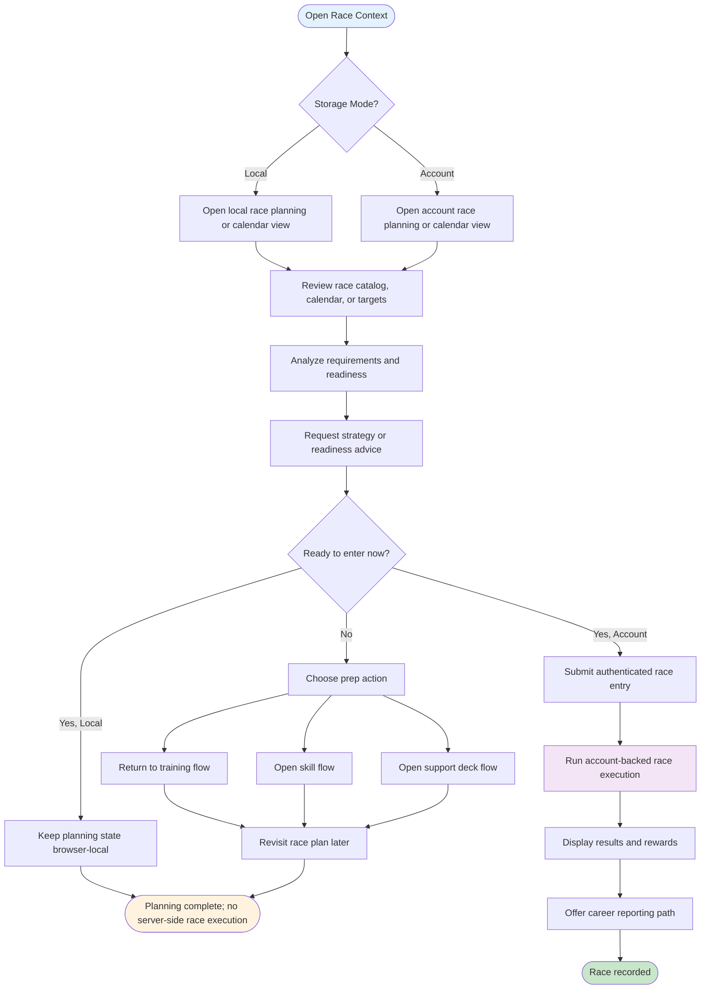
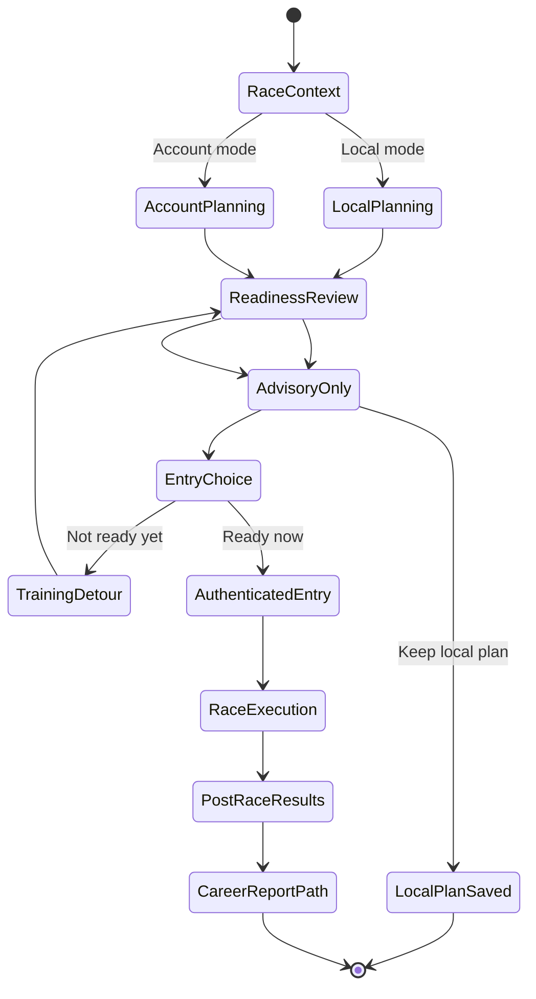

# UF-004: Race Day Flow

## Umamusume Pretty Derby Career Planner

**Document Version**: 2.4.0
**Date**: March 10, 2026
**Related Documents**: [PRD-003], [SPEC-003], [SRS], [BRS]

**Source Specifications**:

- `.kiro/specs/umamusume-career-planner-main/requirements.md` (Requirement 3: Race Preparation and Strategy)
- `.kiro/specs/umamusume-career-planner-main/design.md` (Race Flow)

**Related Artifacts**:

- PRD: [PRD-003](../02-prds/PRD-003_Race_Strategy.md)
- SPEC: [SPEC-003](../02-specs/SPEC-003_Race_Strategy_Technical.md)
- Flow: [FLOW-003](../01-flows/FLOW-003_Race_Strategy_System.md)
- Tech Flows: [TECH-FLOW-003](../01-tech-flow/TECH-FLOW-003_Race_Strategy_Flow.md), [TECH-
FLOW-009](../01-tech-flow/TECH-FLOW-009_Target_Race_Planning_Flow.md), [TECH-FLOW-010](../01-tech-
flow/TECH-FLOW-010_Career_Reporting_Flow.md)
- Wireframes: [WF-006](../01-wireframes/WF-006_Race_Calendar_View.md),
[WF-007](../01-wireframes/WF-007_Race_Preparation_Screen.md)
- Sequences: [SEQ-004](../01-sequences/SEQ-004_Race_Registration_and_Outcome.md),
[SEQ-017](../01-sequences/SEQ-017_Storage_Mode_Transition.md)
- User Manual: [017_SUM](../00-core-docs/017_SUM_Software_User_Manual.md#7-race-strategy)

---

## Table of Contents

1. [Overview](#1-overview)
2. [Flow Diagram](#2-flow-diagram)
3. [User Journey Steps](#3-user-journey-steps)
4. [Decision Points](#4-decision-points)
5. [Success Criteria](#5-success-criteria)
6. [Error Handling](#6-error-handling)
7. [Related Flows](#7-related-flows)

---

## 1. Overview

### 1.1 Purpose

The Race Day Flow guides users through race discovery, readiness review, planning, and, when
supported by the current storage mode, race entry and post-race follow-up. It separates planning
from execution so the user journey does not imply that every race-related action is persisted or
executable in every mode.

### 1.2 Scope

| Aspect | Description |
| --- | --- |
| **Entry Point** | Race week reminder, race calendar browsing, or target-race review |
| **Exit Point** | Local planning updated, or authenticated race results recorded and reporting path available |
| **Duration** | 2-5 minutes for planning review; longer if user changes skills, deck, or training first |
| **User Type** | Users with an active run in the current storage mode context: browser-local run in Local mode, authenticated persisted run in Account mode |

### 1.3 Storage Mode Support

- `StorageMode::LOCAL`: race planning, readiness checks, and advisory guidance should be treated as
browser-local or advisory-only unless a verified local persistence path exists.
- `StorageMode::ACCOUNT`: authenticated race browsing, entry, result recording, and follow-up
reporting are account-backed.

### 1.4 Navigation Surface

This document uses conceptual labels such as Race Calendar, Race Preparation, and Results Screen for
the user journey. Where implementation-backed navigation is relevant, the current route surface is:

- `/races`
- `/races/calendar`
- `/races/targets`
- `/characters/{character}/races/{gameRace}/enter`
- `/reports/career/{career}`

### 1.5 Business Context

**Business Goal**: Help users evaluate whether a race is worth entering, surface readiness gaps
early, and make the current planning versus execution boundary clear.

**Success Metrics**:

- Users can distinguish race planning from race entry without confusion.
- Readiness guidance highlights missing stats, skills, or deck adjustments before entry.
- Account-mode users can move from planning to recorded results without hidden state changes.

---

## 2. Flow Diagram

### 2.1 High-Level Flow

### 2.2 Key Journey Split

---

## 3. User Journey Steps

### 3.1 Step 1: Open Race Planning Surface

**Purpose**: Let the user browse upcoming races, targets, and schedule context.

**User Actions**:

| Action | Description | Outcome |
| --- | --- | --- |
| Open race calendar | Browse upcoming races by timing and category | Planning context loaded |
| Open target-race view | Review planned or candidate target races | Planning context loaded |
| Open race details | Inspect a specific race before deciding | Race detail context loaded |

**Storage-Aware Behavior**:

- In Local mode, browsing and planning should be treated as browser-local or advisory-only.
- In Account mode, the same planning surfaces can lead to authenticated entry and reporting actions.

### 3.2 Step 2: Review Readiness and Strategy

**Purpose**: Show the user whether the current run is prepared for the selected race.

**What the user reviews**:

- distance, surface, and grade requirements
- fan count eligibility requirements for race entry (including races that require minimum fans before entry)
- current readiness or risk indicators
- track condition and weather context when available from readiness services
- recommended running style using the canonical running-style set
- whether more training, skills, or deck adjustments are advisable first
- readiness score or risk labels are planner-generated guidance metrics, not official in-game score values

**User Outcomes**:

| Outcome | Meaning |
| --- | --- |
| Ready now | User can proceed to entry in Account mode |
| Needs prep | User should detour into training, skill, or deck changes |
| Planning only | User stores or remembers the target without entering now |

### 3.2.1 Loading-State Guidance

When readiness analysis or advisory responses are being requested, the UI should present an explicit
loading state rather than leaving the previous race context visually unchanged. Recommended
messaging:

- "Analyzing race readiness..."
- "Preparing advisory guidance..."
- "Loading race recommendations..."

### 3.3 Step 3: Choose Next Action

**Purpose**: Keep planning, execution, and preparation as separate user choices.

**Next actions**:

| Action | Behavior |
| --- | --- |
| Return to training | Re-enter the training-day loop to improve readiness |
| Open skill flow | Review and optionally acquire recommended skills |
| Open support deck flow | Review deck synergy or friend-card choice |
| Keep target race | Preserve planning intent without entering yet |
| Enter race now | Available only in Account mode with authenticated persisted context |

### 3.4 Step 4: Race Entry and Result Recording

**Purpose**: Record an actual race result only when the current storage mode supports it.

**Account-mode path**:

1. User confirms race entry.
2. The application uses the authenticated persisted `Character` and `Career` context.
3. Race execution runs on the server-side entry path.
4. Results, rewards, and career history are updated.
5. The user can continue into reporting or back to the training loop.

**Local-mode path**:

1. User can review readiness and strategy.
2. User can keep or revise race planning in browser-local state.
3. The flow should not imply server-side race execution or persisted race result recording.

---

## 4. Decision Points

### 4.1 Planning vs Entry

**Question**: Is the user planning a future race or entering one now?

- Planning remains valid in both storage modes.
- Authenticated entry and recorded results are account-backed.

### 4.2 Ready vs Not Ready

**Question**: Does the user need more preparation?

- If not ready, redirect to training, skill, or deck improvement flows.
- If ready, allow race entry only when authenticated persisted context exists.

### 4.3 Local vs Account Persistence

**Question**: What persistence boundary applies to this action?

- Local mode: browser-local planning or advisory-only behavior.
- Account mode: persisted race entry, rewards, history, and reporting.

---

## 5. Success Criteria

- Users can tell whether they are planning a race or recording one.
- Local-mode users are not misled into expecting account-backed race execution.
- Account-mode users can move from readiness review to result recording and reporting without hidden
persistence assumptions.
- Race prep detours into training, skills, and deck updates remain discoverable.

---

## 6. Error Handling

| Scenario | User-facing behavior |
| --- | --- |
| No active run in current mode | Show empty-state guidance and return to career setup |
| User is in Local mode and tries to perform account-backed entry | Explain that planning remains available, but authenticated persisted entry is required for result recording |
| Auth expired before entry | Prompt sign-in again and keep planning state unchanged |
| Race is no longer eligible | Show readiness or eligibility warning and return to planning |
| Network unavailable in Account mode | Allow browsing or advisory only where available, but block account-backed entry and reporting |

---

## 7. Related Flows

- [UF-003_Training_Day_Flow.md](UF-003_Training_Day_Flow.md)
- [UF-005_Skill_Management_Flow.md](UF-005_Skill_Management_Flow.md)
- [UF-006_Support_Deck_Building_Flow.md](UF-006_Support_Deck_Building_Flow.md)
- [UF-009_Storage_Mode_Transition_Flow.md](UF-009_Storage_Mode_Transition_Flow.md)
- [TECH-FLOW-003](../01-tech-flow/TECH-FLOW-003_Race_Strategy_Flow.md)
- [TECH-FLOW-009](../01-tech-flow/TECH-FLOW-009_Target_Race_Planning_Flow.md)
- [TECH-FLOW-010](../01-tech-flow/TECH-FLOW-010_Career_Reporting_Flow.md)
- [SEQ-004](../01-sequences/SEQ-004_Race_Registration_and_Outcome.md)
- [SEQ-017](../01-sequences/SEQ-017_Storage_Mode_Transition.md)
