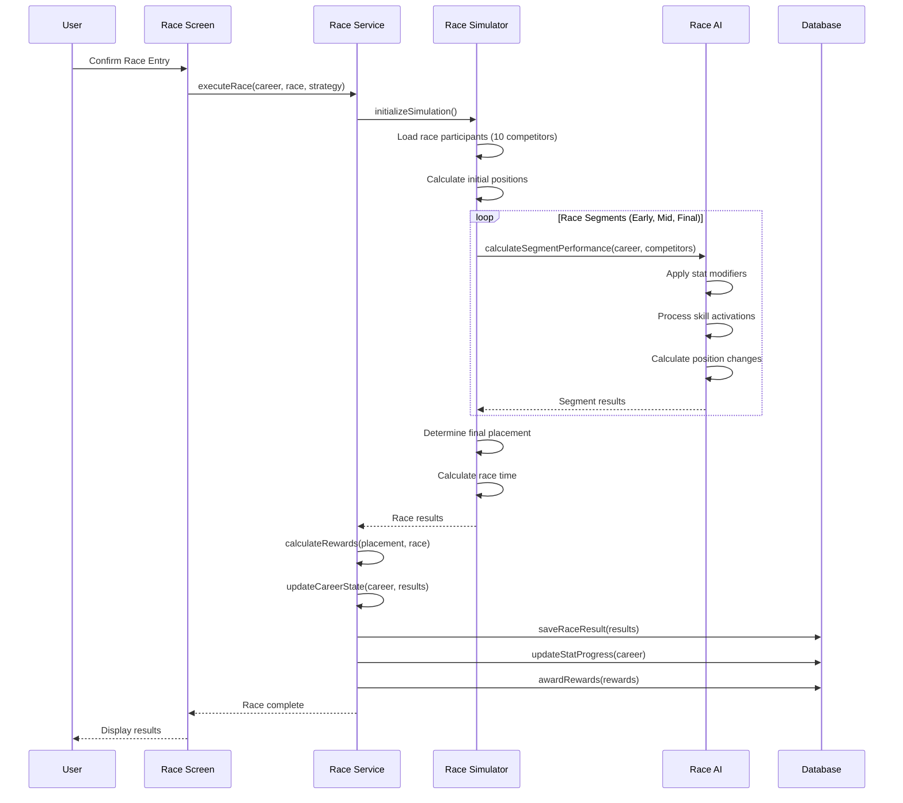
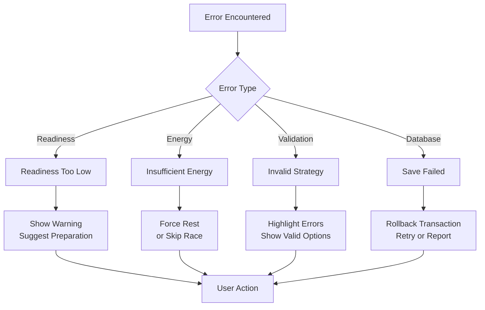

# UF-004: Race Day Flow

## Umamusume Pretty Derby Career Planner

**Document Version**: 2.2.0  
**Date**: January 28, 2026  
**Related Documents**: [PRD-003], [SPEC-003], [SRS], [BRS]

**Source Specifications**:

- `.kiro/specs/umamusume-career-planner-main/requirements.md` (Requirement 3: Race Preparation and Strategy)
- `.kiro/specs/umamusume-career-planner-main/design.md` (Race Flow)

**Related Artifacts**:

- PRD: [PRD-003](../prds/PRD-003_Race_Strategy.md)
- SPEC: [SPEC-003](../specs/SPEC-003_Race_Strategy_Technical.md)
- Flow: [FLOW-003](../flows/FLOW-003_Race_Strategy_System.md)
- Tech Flow: [TECH-FLOW-003](../tech-flow/TECH-FLOW-003_Race_Strategy_Flow.md)
- Wireframes: [WF-006](../wireframes/WF-006_Race_Calendar_View.md), [WF-007](../wireframes/WF-007_Race_Preparation_Screen.md)
- Sequences: [SEQ-004](../sequences/SEQ-004_Race_Registration_and_Outcome.md)
- User Manual: [D17](../D17_SUM_Software_User_Manual.md#7-race-strategy)

---

## Table of Contents

1. [Overview](#1-overview)
2. [Flow Diagram](#2-flow-diagram)
3. [User Journey Steps](#3-user-journey-steps)
4. [Decision Points](#4-decision-points)
5. [Race Analysis Engine](#5-race-analysis-engine)
6. [Success Criteria](#6-success-criteria)
7. [Error Handling](#7-error-handling)
8. [Related Flows](#8-related-flows)

---

## 1. Overview

### 1.1 Purpose

The Race Day Flow guides users through the complete race preparation, strategy optimization, and execution process. This flow incorporates AI-powered race analysis, readiness assessment, running style optimization, and win probability calculations to help users maximize their competitive performance.

### 1.2 Scope

| Aspect | Description |
| --- | --- |
| **Entry Point** | Race week notification or race calendar selection |
| **Exit Point** | Race results recorded, stats/rewards updated, next steps displayed |
| **Duration** | 5-10 minutes for preparation; 2-3 minutes for race execution |
| **User Type** | All users with active career runs |

### 1.3 Business Context

**Business Goal**: Provide comprehensive race preparation guidance to optimize competitive performance while educating users on strategic decision-making.

**Success Metrics**:

- Race preparation completion rate: > 90%
- AI strategy recommendation acceptance rate: > 75%
- Win rate improvement with preparation: > 15% vs. unprepared
- User satisfaction with race guidance: > 4.2/5

---

## 2. Flow Diagram

### 2.1 High-Level Flow

```mermaid
flowchart TD
    Start([Race Week Begins]) --> CheckEntry{Race Entry Status?}
    
    CheckEntry -->|Not Entered| PromptEntry[Prompt Race Entry]
    CheckEntry -->|Entered| PreRaceCheck[Pre-Race Status Check]
    
    PromptEntry --> RaceCalendar[Open Race Calendar]
    RaceCalendar --> SelectRace[Select Race]
    SelectRace --> ViewDetails[View Race Details]
    
    ViewDetails --> LoadRaceData[Load Race Data]
    LoadRaceData --> AnalyzeRequirements[Analyze Race Requirements]
    AnalyzeRequirements --> CalculateReadiness[Calculate Readiness Score]
    
    CalculateReadiness --> DisplayAnalysis[Display Analysis Dashboard]
    DisplayAnalysis --> UserReview[User Reviews Analysis]
    
    UserReview --> NeedPrep{Needs Preparation?}
    NeedPrep -->|Yes| ShowRecommendations[Show AI Recommendations]
    NeedPrep -->|No| ConfirmEntry[Confirm Race Entry]
    
    ShowRecommendations --> PrepOptions{Preparation Type?}
    PrepOptions -->|Training| SuggestTraining[Suggest Training Sessions]
    PrepOptions -->|Skills| SuggestSkills[Suggest Skill Acquisitions]
    PrepOptions -->|Deck| SuggestDeckChanges[Suggest Deck Modifications]
    
    SuggestTraining --> UserImplements[User Implements Changes]
    SuggestSkills --> UserImplements
    SuggestDeckChanges --> UserImplements
    
    UserImplements --> RecalculateReadiness[Recalculate Readiness]
    RecalculateReadiness --> DisplayAnalysis
    
    PreRaceCheck --> ConfirmEntry
    ConfirmEntry --> SelectStrategy[Select Running Style]
    
    SelectStrategy --> AIStrategyAdvice[Get AI Strategy Recommendation]
    AIStrategyAdvice --> StrategyOptions[Display Strategy Options]
    
    StrategyOptions --> UserSelectsStrategy{User Chooses Strategy?}
    UserSelectsStrategy -->|AI Recommended| ApplyAIStrategy[Apply AI Strategy]
    UserSelectsStrategy -->|Custom| ApplyCustomStrategy[Apply Custom Strategy]
    
    ApplyAIStrategy --> FinalReview[Final Race Review]
    ApplyCustomStrategy --> FinalReview
    
    FinalReview --> LockEntry[Lock Race Entry]
    LockEntry --> ExecuteRace[Execute Race Simulation]
    
    ExecuteRace --> ProcessResults[Process Race Results]
    ProcessResults --> CalculateRewards[Calculate Rewards & Stats]
    CalculateRewards --> UpdateCareer[Update Career State]
    
    UpdateCareer --> LogHistory[Log Race History]
    LogHistory --> DisplayResults[Display Results Screen]
    
    DisplayResults --> ShowComparison[Show Predicted vs Actual]
    ShowComparison --> AwardRewards[Award Fans/SP/Items]
    AwardRewards --> UpdateMood[Update Mood/Conditions]
    
    UpdateMood --> PostRaceAnalysis[Post-Race AI Analysis]
    PostRaceAnalysis --> NextSteps[Show Next Steps]
    NextSteps --> End([Race Complete])
    
    style Start fill:#e3f2fd
    style End fill:#c8e6c9
    style AIStrategyAdvice fill:#fff3e0
    style ExecuteRace fill:#f3e5f5
```text

### 2.2 Detailed State Diagram

```mermaid
stateDiagram-v2
    [*] --> RaceWeekStart
    
    RaceWeekStart --> CalendarView: User opens race calendar
    RaceWeekStart --> AutoNotification: Race week auto-notification
    
    AutoNotification --> RaceDetail: Click notification
    CalendarView --> RaceDetail: Select race
    
    RaceDetail --> RequirementsAnalysis: Load race data
    
    RequirementsAnalysis --> ReadinessCalculation: Analyze requirements
    ReadinessCalculation --> StrategyGeneration: Calculate readiness
    StrategyGeneration --> PreparationAdvice: Generate AI strategies
    
    PreparationAdvice --> UserDecision: Display recommendations
    
    UserDecision --> Training: Need training
    UserDecision --> SkillAcquisition: Need skills
    UserDecision --> DeckModification: Need deck changes
    UserDecision --> ProceedToEntry: Ready to enter
    
    Training --> RecalculateReadiness: Complete training
    SkillAcquisition --> RecalculateReadiness: Acquire skills
    DeckModification --> RecalculateReadiness: Modify deck
    RecalculateReadiness --> PreparationAdvice: Re-analyze
    
    ProceedToEntry --> StrategySelection: Confirm entry
    
    StrategySelection --> AIRecommendation: Request AI advice
    AIRecommendation --> StrategyConfirmation: Review strategies
    StrategyConfirmation --> EntryLocked: Confirm strategy
    
    EntryLocked --> RaceSimulation: Execute race
    
    RaceSimulation --> ResultProcessing: Calculate outcome
    ResultProcessing --> RewardDistribution: Process results
    RewardDistribution --> StateUpdate: Award rewards
    StateUpdate --> HistoryLog: Update stats/mood
    HistoryLog --> ResultsDisplay: Log race data
    
    ResultsDisplay --> PostRaceAnalysis: Display results
    PostRaceAnalysis --> NextStepsSuggestion: AI analysis
    NextStepsSuggestion --> [*]: Complete
```

---

## 3. User Journey Steps

### 3.1 Step 1: Race Calendar and Selection

**Purpose**: View upcoming races and select a race to analyze or enter.

#### 3.1.1 Race Calendar Interface

```text
┌────────────────────────────────────────────────────────────┐
│  Race Calendar                                        [≡]   │
├────────────────────────────────────────────────────────────┤
│  Filters: [All Grades ▼] [All Distances ▼] [All Surfaces ▼]│
│                                                            │
│  ┌────────────────────────────────────────────────────────┐│
│  │ January 2026                        Turn: 45           ││
│  │ ┌─────┬─────┬─────┬─────┬─────┬─────┬─────┐          ││
│  │ │ Sun │ Mon │ Tue │ Wed │ Thu │ Fri │ Sat │          ││
│  │ ├─────┼─────┼─────┼─────┼─────┼─────┼─────┤          ││
│  │ │  5  │  6  │  7  │  8  │  9  │ 10  │ 11  │          ││
│  │ │     │     │     │     │     │ G1  │     │          ││
│  │ │     │     │     │     │     │🟢85%│     │          ││
│  │ ├─────┼─────┼─────┼─────┼─────┼─────┼─────┤          ││
│  │ │ 12  │ 13  │ 14  │ 15  │ 16  │ 17  │ 18  │          ││
│  │ │     │     │     │ G2  │     │     │     │          ││
│  │ │     │     │     │🟡70%│     │     │     │          ││
│  │ └─────┴─────┴─────┴─────┴─────┴─────┴─────┘          ││
│  └────────────────────────────────────────────────────────┘│
│                                                            │
│  Upcoming Races:                                           │
│  ┌────────────────────────────────────────────────────────┐│
│  │ 🏆 Kanto Okami Cup (G1)                 Jan 10         ││
│  │ Distance: Medium (2400m) | Surface: Turf              ││
│  │ Readiness: 🟢 85% | Win Probability: 35%              ││
│  │                                    [VIEW] [ENTER]      ││
│  ├────────────────────────────────────────────────────────┤│
│  │ 🏇 Tokyo Sports Hai (G2)            Jan 14             ││
│  │ Distance: Mile (1800m) | Surface: Turf                ││
│  │ Readiness: 🟡 70% | Win Probability: 25%              ││
│  │                                    [VIEW] [ENTER]      ││
│  └────────────────────────────────────────────────────────┘│
│                                                            │
│                              [Create Custom Race Schedule] │
└────────────────────────────────────────────────────────────┘
```

**User Actions**:

| Action | Description | Next State |
| --- | --- | --- |
| View race | Click race on calendar | Race detail screen |
| Filter races | Apply grade/distance/surface filters | Update calendar view |
| Enter race | Click "Enter" on race card | Race preparation screen |
| Create schedule | Open custom race scheduler | Race planning tool |

**Readiness Color Coding**:

| Color | Range | Meaning |
| --- | --- | --- |
| 🟢 Green | 80-100% | Excellent readiness |
| 🟡 Yellow | 60-79% | Moderate readiness |
| 🔴 Red | < 60% | Poor readiness - preparation needed |

---

### 3.2 Step 2: Race Requirements Analysis

**Purpose**: Analyze race requirements and compare against current character state.

#### 3.2.1 Race Analysis Dashboard

```text
┌────────────────────────────────────────────────────────────┐
│  Race Analysis: Kanto Okami Cup                       [≡]   │
├────────────────────────────────────────────────────────────┤
│  📊 Race Information                                       │
│  Grade: G1 | Track: Tokyo Racecourse                      │
│  Distance: Medium (2400m) | Surface: Turf                 │
│  Weather: Sunny | Track Condition: Good                   │
│  Days Until Race: 8 days (Turn 85)                        │
│                                                            │
│  ⚠️ Track Condition Effects (Good):                        │
│  • Power: -50 (Turf penalty)                              │
│  • Speed: No penalty                                       │
│  • Stamina drain: Normal                                   │
│                                                            │
│  ┌────────────────────────────────────────────────────────┐│
│  │ STAT REQUIREMENTS vs CURRENT                           ││
│  ├────────────────────────────────────────────────────────┤│
│  │ Speed      Required: 550+    Current: 520  ⚠️ GAP: -30 ││
│  │            Rating: 🟡 Borderline                       ││
│  │                                                        ││
│  │ Stamina    Required: 450+    Current: 480  ✅ +30      ││
│  │            Rating: 🟢 Adequate                         ││
│  │                                                        ││
│  │ Power      Required: 400+    Current: 440  ✅ +40      ││
│  │            Rating: 🟢 Good (Note: -50 from track)      ││
│  │                                                        ││
│  │ Guts       Required: 420+    Current: 460  ✅ +40      ││
│  │            Rating: 🟢 Good                             ││
│  │                                                        ││
│  │ Wit        Required: 400+    Current: 450  ✅ +50      ││
│  │            Rating: 🟢 Excellent                        ││
│  └────────────────────────────────────────────────────────┘│
│                                                            │
│  ┌────────────────────────────────────────────────────────┐│
│  │ APTITUDE REQUIREMENTS (S is Maximum Grade)             ││
│  ├────────────────────────────────────────────────────────┤│
│  │ Distance (Medium): B  Current: A  ✅ Strong Match      ││
│  │   → Speed bonus: 0% (A = baseline)                     ││
│  │ Surface (Turf):    B  Current: S  ✅ Excellent Match   ││
│  │   → Power bonus: +5% (S grade bonus)                   ││
│  │ Style Preference:     Sashi (Late Surger) Recommended  ││
│  │   → Wit bonus: 0% (A grade = baseline)                 ││
│  └────────────────────────────────────────────────────────┘│
│                                                            │
│  Overall Readiness: 🟡 75% (Borderline)                    │
│  Risk Assessment: ⚠️ Speed deficit may impact placement    │
│                                                            │
│                          [PREPARE] [VIEW RECOMMENDATIONS]  │
└────────────────────────────────────────────────────────────┘
```

**Track Condition Effects (Verified Jan 2026)**:

| Condition | Surface | Power Penalty | Speed Penalty | Stamina Drain |
| --- | --- | --- | --- | --- |
| Firm | Turf/Dirt | None | None | Normal |
| Good | Turf | -50 | None | Normal |
| Good | Dirt | -50 | None | Normal |
| Soft | Turf | -50 | None | +2%/sec |
| Soft | Dirt | -100 | None | +2%/sec |
| Heavy | Turf | -50 | -50 | +2%/sec |
| Heavy | Dirt | -100 | -50 | +2%/sec |

**Aptitude Grade Bonuses (S is Maximum - No SS Exists)**:

| Grade | Distance (Speed) | Surface (Power) | Style (Wit) |
| --- | --- | --- | --- |
| S | +5% | +5% | +10% |
| A | 0% (baseline) | 0% (baseline) | 0% (baseline) |
| B | -10% | -10% | -15% |
| C | -20% | -20% | -25% |
| D | -40% | -30% | -40% |
| E | -60% | -50% | -60% |
| F | -80% | -70% | -80% |
| G | -90% | -90% | -90% |

**Implementation Details**:

**Stat Rating Criteria**:

| Rating | Criteria | Icon |
| --- | --- | --- |
| Excellent | Current > Required + 50 | 🟢 |
| Good | Current > Required + 20 | 🟢 |
| Adequate | Current > Required | 🟢 |
| Borderline | Current within 30 of Required | 🟡 |
| Inadequate | Current < Required - 30 | 🔴 |

```php
// app/Services/RaceAnalysisService.php
class RaceAnalysisService
{
    public function analyzeReadiness(CareerRun $career, Race $race): RaceReadiness
    {
        $statGaps = $this->calculateStatGaps($career, $race);
        $aptitudeMatch = $this->calculateAptitudeMatch($career, $race);
        $skillMatch = $this->calculateSkillMatch($career, $race);
        $trackConditionPenalties = $this->calculateTrackConditionPenalties($race);
        
        $overallScore = $this->calculateOverallReadiness([
            'stats' => $statGaps,
            'aptitudes' => $aptitudeMatch,
            'skills' => $skillMatch,
            'trackConditions' => $trackConditionPenalties,
        ]);
        
        return new RaceReadiness(
            score: $overallScore,
            statGaps: $statGaps,
            aptitudeMatch: $aptitudeMatch,
            skillMatch: $skillMatch,
            trackConditionPenalties: $trackConditionPenalties,
            recommendations: $this->generateRecommendations($statGaps, $race),
        );
    }
    
    /**
     * Calculate track condition penalties (Verified Jan 2026)
     */
    private function calculateTrackConditionPenalties(Race $race): array
    {
        $condition = $race->track_condition;
        $surface = $race->surface;
        
        return match([$condition, $surface]) {
            ['firm', 'turf'], ['firm', 'dirt'] => ['power' => 0, 'speed' => 0, 'stamina_drain' => 1.0],
            ['good', 'turf'], ['good', 'dirt'] => ['power' => -50, 'speed' => 0, 'stamina_drain' => 1.0],
            ['soft', 'turf'] => ['power' => -50, 'speed' => 0, 'stamina_drain' => 1.02],
            ['soft', 'dirt'] => ['power' => -100, 'speed' => 0, 'stamina_drain' => 1.02],
            ['heavy', 'turf'] => ['power' => -50, 'speed' => -50, 'stamina_drain' => 1.02],
            ['heavy', 'dirt'] => ['power' => -100, 'speed' => -50, 'stamina_drain' => 1.02],
            default => ['power' => 0, 'speed' => 0, 'stamina_drain' => 1.0],
        };
    }
    
    /**
     * Calculate aptitude bonuses (S is maximum grade - No SS exists)
     */
    private function calculateAptitudeBonus(string $grade, string $type): float
    {
        $bonusTable = [
            'distance' => [ // Affects Speed
                'S' => 0.05, 'A' => 0.00, 'B' => -0.10, 'C' => -0.20,
                'D' => -0.40, 'E' => -0.60, 'F' => -0.80, 'G' => -0.90,
            ],
            'surface' => [ // Affects Power
                'S' => 0.05, 'A' => 0.00, 'B' => -0.10, 'C' => -0.20,
                'D' => -0.30, 'E' => -0.50, 'F' => -0.70, 'G' => -0.90,
            ],
            'style' => [ // Affects Wit
                'S' => 0.10, 'A' => 0.00, 'B' => -0.15, 'C' => -0.25,
                'D' => -0.40, 'E' => -0.60, 'F' => -0.80, 'G' => -0.90,
            ],
        ];
        
        return $bonusTable[$type][$grade] ?? 0.0;
    }
    
    private function calculateStatGaps(CareerRun $career, Race $race): array
    {
        $requirements = $race->stat_requirements;
        
        return [
            'speed' => [
                'required' => $requirements['speed'],
                'current' => $career->speed,
                'gap' => $career->speed - $requirements['speed'],
                'rating' => $this->rateStatMatch($career->speed, $requirements['speed']),
            ],
            // ... other stats
        ];
    }
    
    private function rateStatMatch(int $current, int $required): string
    {
        $gap = $current - $required;
        
        return match(true) {
            $gap >= 50 => 'excellent',
            $gap >= 20 => 'good',
            $gap >= 0 => 'adequate',
            $gap >= -30 => 'borderline',
            default => 'inadequate',
        };
    }
}
```text

---

### 3.3 Step 3: Preparation Recommendations

**Purpose**: Provide AI-powered recommendations to improve race readiness.

#### 3.3.1 Preparation Advice Interface

```
┌────────────────────────────────────────────────────────────┐
│  Race Preparation Recommendations                     [≡]   │
├────────────────────────────────────────────────────────────┤
│  🤖 AI Analysis: Your speed is 30 points below the         │
│  recommended threshold. With 8 days remaining, you can     │
│  close this gap through targeted training.                 │
│                                                            │
│  Confidence: 87% | Risk Assessment: Low                    │
│                                                            │
│  ┌────────────────────────────────────────────────────────┐│
│  │ 📋 RECOMMENDED ACTION PLAN                             ││
│  ├────────────────────────────────────────────────────────┤│
│  │ Priority 1: Speed Training (Next 2 Turns)              ││
│  │ • Turn 78: Speed Training (+45 expected)               ││
│  │ • Turn 79: Speed Training (+42 expected)               ││
│  │ Expected Speed After: 520 → 607                        ││
│  │ Status: 🟢 Will exceed requirement (550)               ││
│  │                                                        ││
│  │ [APPLY PLAN] [CUSTOMIZE]                               ││
│  ├────────────────────────────────────────────────────────┤│
│  │ Priority 2: Skill Acquisition (Optional)               ││
│  │ • Consider: "Blazing Speed" (120 SP, 2 hints)          ││
│  │ • Benefit: +5% speed effectiveness in race             ││
│  │ • Cost after discount: 72 SP                           ││
│  │                                                        ││
│  │ [VIEW SKILL] [SKIP]                                    ││
│  ├────────────────────────────────────────────────────────┤│
│  │ Priority 3: Deck Optimization (Optional)               ││
│  │ • Swap: Narita Brian → Tokai Teio (Speed specialist)  ││
│  │ • Benefit: +8% speed training gains                    ││
│  │ • Trade-off: -5% wit training gains                    ││
│  │                                                        ││
│  │ [PREVIEW CHANGE] [SKIP]                                ││
│  └────────────────────────────────────────────────────────┘│
│                                                            │
│  Alternative Strategies:                                   │
│  • Conservative: 1 Speed + 1 Rest (safer, lower gains)    │
│  • Aggressive: 3 Speed sessions (higher risk, max gains)  │
│                                                            │
│                                    [BACK] [IMPLEMENT PLAN] │
└────────────────────────────────────────────────────────────┘
```text

**Recommendation Components**:

| Component | Description | User Benefit |
| --- | --- | --- |
| Action Plan | Step-by-step improvement strategy | Clear roadmap to readiness |
| Expected Gains | Predicted stat increases | Confidence in outcome |
| Skill Suggestions | Beneficial skills to acquire | Performance edge |
| Deck Optimization | Support card adjustments | Training efficiency |
| Alternative Strategies | Risk/reward trade-offs | Strategic choice |

**AI Recommendation Engine**:

```php
// app/Services/AI/RacePreparationAgent.php
class RacePreparationAgent extends Agent
{
    protected string $name = 'Race Preparation Advisor';
    
    public function generatePreparationPlan(
        CareerRun $career,
        Race $race,
        int $daysRemaining
    ): PreparationPlan {
        $statGaps = $this->analyzeStatGaps($career, $race);
        $availableTurns = floor($daysRemaining / 7);
        
        $trainingPlan = $this->optimizeTrainingSequence(
            gaps: $statGaps,
            turns: $availableTurns,
            deck: $career->supportDeck,
        );
        
        $skillSuggestions = $this->recommendSkills(
            race: $race,
            currentSkills: $career->skills,
            spAvailable: $career->total_sp_available,
        );
        
        $deckOptimization = $this->analyzeDeckChanges(
            currentDeck: $career->supportDeck,
            targetStats: $statGaps->priorities(),
        );
        
        return new PreparationPlan(
            trainingSequence: $trainingPlan,
            skillRecommendations: $skillSuggestions,
            deckChanges: $deckOptimization,
            confidence: $this->calculateConfidence($trainingPlan, $statGaps),
            riskLevel: $this->assessRisk($trainingPlan, $career),
        );
    }
}
```

---

### 3.4 Step 4: Running Style Selection

**Purpose**: Select and optimize the running style strategy for the race.

#### 3.4.1 Strategy Selection Interface

```text
┌────────────────────────────────────────────────────────────┐
│  Select Running Style Strategy                        [≡]   │
├────────────────────────────────────────────────────────────┤
│  🤖 AI RECOMMENDED: Late Surger (Sashi)    Score: 89.5/100 │
│                                                            │
│  ┌────────────────────────────────────────────────────────┐│
│  │ ✨ Late Surger (Sashi) - RECOMMENDED                   ││
│  │                                                        ││
│  │ Win Probability: 38% (+8% vs base)                     ││
│  │                                                        ││
│  │ ✅ Strengths:                                          ││
│  │ • Power aptitude: A (strong match)                     ││
│  │ • High guts stat enables strong finish                 ││
│  │ • Active skill: "Final Spurt" synergy                  ││
│  │                                                        ││
│  │ ⚠️ Considerations:                                      ││
│  │ • Requires precise positioning mid-race                ││
│  │ • Stamina consumption in final stretch                 ││
│  │                                                        ││
│  │ AI Reasoning:                                          ││
│  │ "Your power and guts stats are well-suited for a late ││
│  │  surge strategy. Medium distance allows positioning    ││
│  │  flexibility while maintaining stamina reserves."      ││
│  │                                                        ││
│  │                          [SELECT THIS] [VIEW DETAILS]  ││
│  └────────────────────────────────────────────────────────┘│
│                                                            │
│  Other Strategies:                                         │
│  ┌──────────────────┬──────────────────┬──────────────────┐│
│  │ Front Runner     │ Pace Chaser      │ End Closer       ││
│  │ (Nige)           │ (Senkou)         │ (Oikomi)         ││
│  │ Win: 25%         │ Win: 32%         │ Win: 28%         ││
│  │ Score: 72.3      │ Score: 81.5      │ Score: 75.8      ││
│  │ [SELECT]         │ [SELECT]         │ [SELECT]         ││
│  └──────────────────┴──────────────────┴──────────────────┘│
│                                                            │
│                                    [BACK] [CONFIRM ENTRY]  │
└────────────────────────────────────────────────────────────┘
```

**Running Style Analysis**:

| Style | Best For | Stat Priority | Skill Synergy |
| --- | --- | --- | --- |
| Front Runner (Nige) | Short/Mile races | Speed, Stamina | Early acceleration |
| Pace Chaser (Senkou) | Versatile | Speed, Power | Positioning |
| Late Surger (Sashi) | Medium/Long races | Power, Guts | Final stretch |
| End Closer (Oikomi) | Long races | Guts, Wit | Last spurt |

**Strategy Scoring Algorithm**:

```php
// app/Services/Calculators/StrategyScoreCalculator.php
class StrategyScoreCalculator
{
    public function scoreStrategy(
        CareerRun $career,
        Race $race,
        RunningStyle $style
    ): float {
        $aptitudeScore = $this->scoreAptitudeMatch(
            $career->aptitudes->style($style),
            $race->distance,
        );
        
        $statScore = $this->scoreStatAlignment($career, $style);
        $skillScore = $this->scoreSkillSynergy($career->skills, $style);
        $conditionScore = $this->scoreConditions($career, $style);
        
        return ($aptitudeScore * 0.35)
            + ($statScore * 0.30)
            + ($skillScore * 0.25)
            + ($conditionScore * 0.10);
    }
    
    private function scoreStatAlignment(CareerRun $career, RunningStyle $style): float
    {
        $requirements = $style->statPriorities();
        $score = 0;
        
        foreach ($requirements as $stat => $weight) {
            $normalized = $career->$stat / 1200;
            $score += $normalized * $weight;
        }
        
        return $score * 100;
    }
}
```text

---

### 3.5 Step 5: Race Execution

**Purpose**: Execute the race simulation and process results.

#### 3.5.1 Race Simulation Flow



#### 3.5.2 Race Results Screen

```text
┌────────────────────────────────────────────────────────────┐
│  Race Results: Kanto Okami Cup                        [✓]   │
├────────────────────────────────────────────────────────────┤
│  🏆 2nd Place                                              │
│  Time: 2:24.5                                              │
│                                                            │
│  ┌────────────────────────────────────────────────────────┐│
│  │ FINAL STANDINGS                                        ││
│  ├────────────────────────────────────────────────────────┤│
│  │ 1st  Gold Ship              2:24.2  🥇                 ││
│  │ 2nd  Special Week (You)     2:24.5  🥈                 ││
│  │ 3rd  Kitasan Black          2:24.8  🥉                 ││
│  │ 4th  Tokai Teio             2:25.1                     ││
│  │ 5th  Mejiro McQueen         2:25.4                     ││
│  └────────────────────────────────────────────────────────┘│
│                                                            │
│  📊 Performance Analysis                                   │
│  Strategy: Late Surger ✓ Executed as planned              │
│  Predicted: 2nd-3rd | Actual: 2nd ✅ On target            │
│                                                            │
│  Segment Performance:                                      │
│  • Early Game:   5th → Conserved energy ✓                 ││
│  • Mid Race:     4th → Good positioning ✓                 ││
│  • Final Stretch: 2nd → Strong finish ✓                   ││
│                                                            │
│  Skill Activations:                                        │
│  • "Final Spurt" activated at 80% ✅                       ││
│  • "Lane Guidance" activated twice ✅                      ││
│                                                            │
│  ┌────────────────────────────────────────────────────────┐│
│  │ REWARDS EARNED                                         ││
│  ├────────────────────────────────────────────────────────┤│
│  │ Fans:          +250                                    ││
│  │ Skill Points:  +80 SP                                  ││
│  │ Grade Points:  +150 (A → A+ progress: 75%)             ││
│  │ Items:         Rare Skill Book x1                      ││
│  └────────────────────────────────────────────────────────┘│
│                                                            │
│  Character Status Update:                                  │
│  • Mood: Good → Great (+1 level) 🎉                        │
│  • Energy: 78% → 45% (-33%)                                │
│  • Condition: "Race Veteran" gained (+5% race performance) │
│                                                            │
│  🤖 AI Post-Race Analysis:                                 │
│  "Excellent execution of the Late Surger strategy! Your    │
│   final stretch performance was optimal. Focus on recovery │
│   training next turn to restore energy."                   │
│                                                            │
│              [VIEW DETAILED STATS] [CONTINUE TO NEXT TURN] │
└────────────────────────────────────────────────────────────┘
```

**Reward Calculation**:

| Placement | Fans | SP | Grade Points | Special Items |
| --- | --- | --- | --- | --- |
| 1st | +300 | +100 | +200 | Rare item |
| 2nd | +250 | +80 | +150 | Common item |
| 3rd | +200 | +60 | +100 | - |
| 4th-5th | +150 | +40 | +50 | - |
| 6th+ | +100 | +20 | +25 | - |

---

## 4. Decision Points

### 4.1 Decision Tree

```mermaid
flowchart TD
    D1{Enter Race?}
    D1 -->|Yes| D2{Readiness Check}
    D1 -->|No| Skip[Skip Race]
    
    D2 -->|Ready 80%+| D3[Proceed to Strategy]
    D2 -->|Ready 60-79%| D4{Prepare?}
    D2 -->|Ready < 60%| D5[Strong Preparation Needed]
    
    D4 -->|Yes| PrepPlan[Implement Preparation]
    D4 -->|No| RiskyEntry[Enter with Risk]
    
    D5 --> PrepPlan
    PrepPlan --> Recheck[Recalculate Readiness]
    Recheck --> D2
    
    D3 --> D6{Strategy Selection}
    D6 -->|AI Recommended| AIStrategy[Apply AI Strategy]
    D6 -->|Custom| CustomStrategy[Apply Custom Strategy]
    
    AIStrategy --> Execute[Execute Race]
    CustomStrategy --> Execute
    RiskyEntry --> Execute
    
    Execute --> D7{Result}
    D7 -->|Win| Celebrate[Award Max Rewards]
    D7 -->|Top 3| Good[Award Good Rewards]
    D7 -->|4th+| Low[Award Base Rewards]
    
    Celebrate --> NextTurn
    Good --> NextTurn
    Low --> NextTurn
    Skip --> NextTurn[Next Turn]
```text

### 4.2 Key Decision Factors

| Factor | Impact on Decision | Weight |
| --- | --- | --- |
| **Readiness Score** | Determines preparation needs | Critical |
| **Days Remaining** | Time available for preparation | High |
| **Stat Gaps** | Specific improvements needed | High |
| **Win Probability** | Expected outcome | Medium |
| **Risk Tolerance** | User's strategy preference | Medium |
| **Reward Value** | Potential gains vs. effort | Low |

---

## 5. Race Analysis Engine

### 5.1 Readiness Calculation

```mermaid
flowchart TD
    A[Compute Readiness] --> B[Gather Inputs]
    B --> C[Score Stat Requirements]
    C --> D[Score Aptitude Match]
    D --> E[Score Skill Synergy]
    E --> F[Score Mood/Conditions]
    F --> G[Aggregate Weighted Score]
    G --> H{Classify Tier}
    H -->|>= 80| I[Excellent 🟢]
    H -->|60-79| J[Good 🟡]
    H -->|40-59| K[Fair 🟡]
    H -->|< 40| L[Poor 🔴]
```

**Readiness Formula**:

```php
// app/Services/Calculators/ReadinessCalculator.php
class ReadinessCalculator
{
    public function calculate(CareerRun $career, Race $race): float
    {
        $statScore = $this->calculateStatScore($career, $race);
        $aptitudeScore = $this->calculateAptitudeScore($career, $race);
        $skillScore = $this->calculateSkillScore($career, $race);
        $conditionScore = $this->calculateConditionScore($career);
        
        return ($statScore * 0.40)
            + ($aptitudeScore * 0.30)
            + ($skillScore * 0.20)
            + ($conditionScore * 0.10);
    }
    
    private function calculateStatScore(CareerRun $career, Race $race): float
    {
        $requirements = $race->stat_requirements;
        $scores = [];
        
        foreach (['speed', 'stamina', 'power', 'guts', 'wit'] as $stat) {
            $current = $career->$stat;
            $required = $requirements[$stat];
            
            $scores[] = match(true) {
                $current >= $required + 50 => 100,
                $current >= $required + 20 => 90,
                $current >= $required => 75,
                $current >= $required - 30 => 50,
                default => 25,
            };
        }
        
        return array_sum($scores) / count($scores);
    }
}
```text

### 5.2 Win Probability Calculation

```php
// app/Services/Calculators/WinProbabilityCalculator.php
class WinProbabilityCalculator
{
    public function calculate(
        CareerRun $career,
        Race $race,
        RunningStyle $style
    ): float {
        $baseProb = $this->calculateBaseProbability($career, $race);
        $styleBonus = $this->calculateStyleBonus($career, $style, $race);
        $skillBonus = $this->calculateSkillBonus($career, $race);
        $aptitudeMultiplier = $this->calculateAptitudeMultiplier($career, $race);
        $competitorPenalty = $this->calculateCompetitorPenalty($race);
        
        $probability = ($baseProb + $styleBonus + $skillBonus) 
            * $aptitudeMultiplier 
            * $competitorPenalty;
        
        return max(0, min(100, $probability));
    }
    
    private function calculateBaseProbability(CareerRun $career, Race $race): float
    {
        $statAdvantage = $this->calculateStatAdvantage($career, $race);
        $gradeModifier = $this->getGradeModifier($race->grade);
        
        return $statAdvantage * $gradeModifier;
    }
    
    private function getGradeModifier(string $grade): float
    {
        return match($grade) {
            'G1' => 0.3,
            'G2' => 0.4,
            'G3' => 0.5,
            'OP' => 0.6,
            default => 0.7,
        };
    }
}
```

---

## 6. Success Criteria

### 6.1 Functional Success

- ✅ Race analysis displayed within 1 second
- ✅ Readiness score accurately reflects character state
- ✅ AI strategy recommendations provided
- ✅ Win probability calculated within 5% accuracy
- ✅ Race results recorded to database
- ✅ Rewards correctly distributed
- ✅ Post-race stats updated
- ✅ Race history logged

### 6.2 User Experience Success

| Metric | Target | Measurement |
| --- | --- | --- |
| Preparation completion rate | > 90% | Analytics tracking |
| AI strategy acceptance rate | > 75% | User action tracking |
| Win rate with preparation | +15% vs unprepared | Statistical analysis |
| Decision time per race | < 5 minutes | User analytics |

### 6.3 Technical Success

```php
// tests/Feature/RaceDayFlowTest.php
test('race day flow completes successfully', function () {
    $career = CareerRun::factory()->create([
        'speed' => 520,
        'stamina' => 480,
        'power' => 440,
        'guts' => 460,
        'wit' => 450,
        'energy' => 78,
        'mood' => Mood::Good,
    ]);
    
    $race = Race::factory()->create([
        'grade' => 'G1',
        'distance' => 2400,
        'surface' => 'turf',
    ]);
    
    // Analyze readiness
    $readiness = app(RaceAnalysisService::class)
        ->analyzeReadiness($career, $race);
    
    expect($readiness)->toHaveKeys([
        'score',
        'statGaps',
        'aptitudeMatch',
        'skillMatch',
        'recommendations',
    ]);
    
    // Execute race
    $result = app(RaceService::class)
        ->executeRace($career, $race, RunningStyle::Sashi);
    
    $career->refresh();
    
    expect($result->placement)->toBeGreaterThan(0)
        ->and($result->placement)->toBeLessThanOrEqual(10)
        ->and($career->energy)->toBeLessThan(78)
        ->and($career->raceResults)->toHaveCount(1);
});
```text

---

## 7. Error Handling

### 7.1 Error Scenarios



### 7.2 Error Messages

| Error Code | Trigger | Message | User Action |
| --- | --- | --- | --- |
| `RC-001` | Readiness < 40% | "Your readiness is very low. Preparation strongly recommended." | Prepare or skip race |
| `RC-002` | Energy < 20% | "Insufficient energy for race. Rest recommended." | Rest or proceed at risk |
| `RC-003` | Invalid strategy | "Selected strategy incompatible with character aptitudes." | Select valid strategy |
| `RC-004` | Database error | "Unable to save race result. Please try again." | Retry operation |
| `RC-005` | Simulation error | "Race simulation failed. Please contact support." | Report error |

### 7.3 Recovery Strategies

| Scenario | Primary Recovery | Fallback Recovery | Ultimate Fallback |
| --- | --- | --- | --- |
| Low readiness | Show preparation plan | Allow risky entry | Skip race |
| Low energy | Force rest action | Reduce race performance | Allow with warning |
| Invalid strategy | Show valid options | Apply default strategy | Use AI recommendation |
| Database timeout | Retry transaction (3x) | Queue for later processing | Save as draft |

---

## 8. Related Flows

### 8.1 Downstream Flows

After race execution, users may proceed to:

| Flow | Document Reference | Entry Condition |
| --- | --- | --- |
| Training Day Flow | [UF-003](UF-003_Training_Day_Flow.md) | Resume training schedule |
| Skill Acquisition | [UF-005](UF-005_Skill_Management_Flow.md) | SP earned from race rewards |
| Rest and Recovery | Rest action | Energy depleted from race |
| Career Analysis | Analytics dashboard | Review performance trends |

### 8.2 Alternative Entry Points

| Entry Point | Scenario | Flow Adjustment |
| --- | --- | --- |
| Race Notification | Automatic race week alert | Skip calendar, go to race detail |
| Training Interruption | Race week during training | Save training progress, enter race flow |
| AI Suggestion | AI proactively suggests race | Pre-analyzed readiness displayed |

### 8.3 Integration Points

```mermaid
flowchart LR
    subgraph RaceDayFlow[Race Day Flow]
        Analysis[Race Analysis]
        Preparation[Preparation]
        Strategy[Strategy Selection]
        Execution[Race Execution]
    end
    
    subgraph ExternalServices[External Services]
        AIService[AI Advisory Service]
        StatService[Stat Calculation Service]
        RewardService[Reward Distribution Service]
        AnalyticsService[Analytics Service]
    end
    
    subgraph DataLayer[Data Layer]
        RaceRepo[Race Repository]
        CareerRepo[Career Repository]
        HistoryRepo[Race History Repository]
    end
    
    Analysis --> AIService
    Analysis --> StatService
    
    Preparation --> AIService
    
    Strategy --> AIService
    
    Execution --> RewardService
    Execution --> CareerRepo
    Execution --> HistoryRepo
    
    Execution --> AnalyticsService
```text

---

## Document Control

| Version | Date | Author | Changes |
| --- | --- | --- | --- |
| 2.2.0 | 2026-01-28 | Development Team | Updated with verified game mechanics from Global English Server (Jan 2026); added track condition modifiers (Firm/Good/Soft/Heavy with Power/Speed/Stamina penalties); corrected aptitude bonuses (S=max grade with +5%/+10% bonuses, A=0% baseline); updated running style aptitude effects on Wit stat |
| 2.1.0 | 2026-01-24 | Development Team | Complete rewrite aligned with v2.0.0 architecture; added race analysis engine details, AI integration, readiness calculation, win probability formulas; comprehensive error handling and testing criteria |
| 2.0.0 | 2026-01-14 | Development Team | Prior revision with basic flow |
| 1.0.0 | 2026-01-03 | Development Team | Initial draft |

---

## References

- [Software Development Plan (SDP)](../D01_SDP_Software_Development_Plan.md)
- [Business Requirements Specifications (BRS)](../D02_BRS_Business_Requirements_Specifications.md)
- [Software Requirements Specifications (SRS)](../D03_SRS_Software_Requirement_Specifications.md)
- [Software User Manual (SUM)](../D17_SUM_Software_User_Manual.md)
- [SPEC-003: Race Strategy Technical](../specs/SPEC-003_Race_Strategy_Technical.md)
- [FLOW-003: Race Strategy System](../flows/FLOW-003_Race_Strategy_System.md)
- [TECH-FLOW-003: Race Strategy Flow](../tech-flow/TECH-FLOW-003_Race_Strategy_Flow.md)
- [WF-006: Race Calendar View](../wireframes/WF-006_Race_Calendar_View.md)
- [WF-007: Race Preparation Screen](../wireframes/WF-007_Race_Preparation_Screen.md)
- [SEQ-004: Race Registration and Outcome](../sequences/SEQ-004_Race_Registration_and_Outcome.md)

---

*This user flow reflects the current race strategy system implementation as of version 2.2.0. For the latest updates, refer to the online documentation.*
