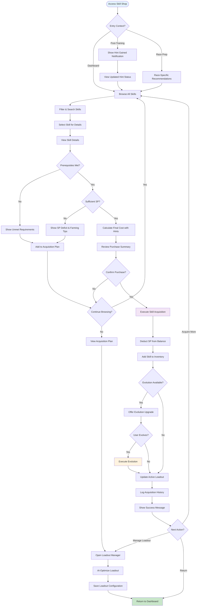
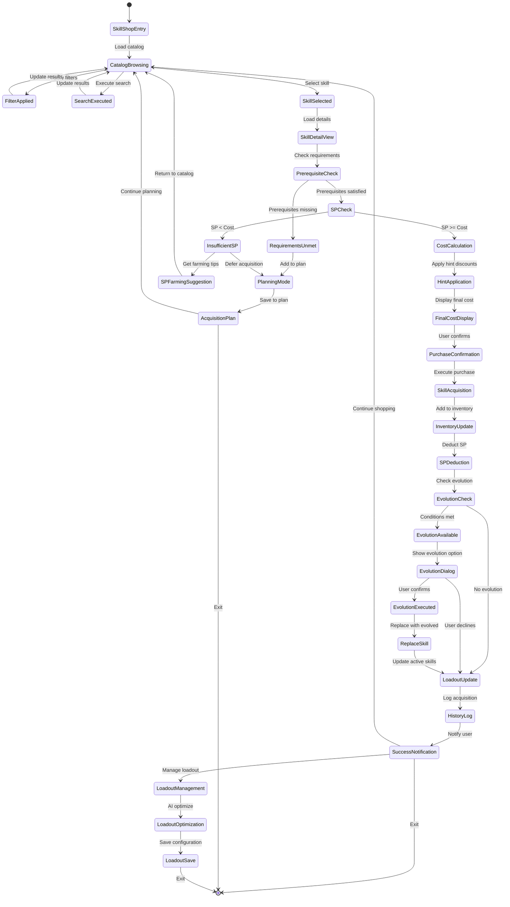
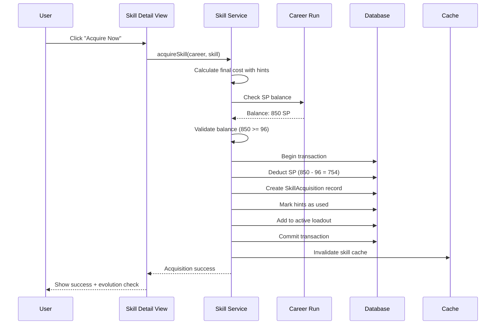
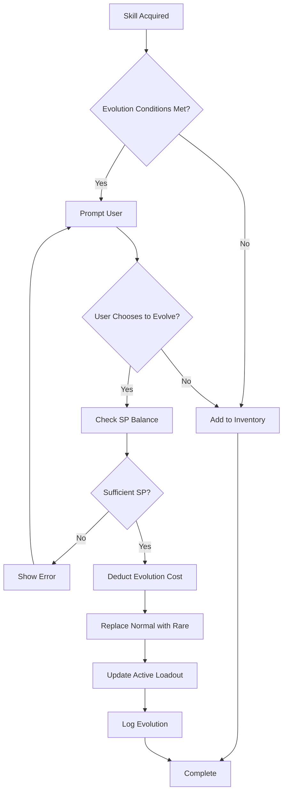
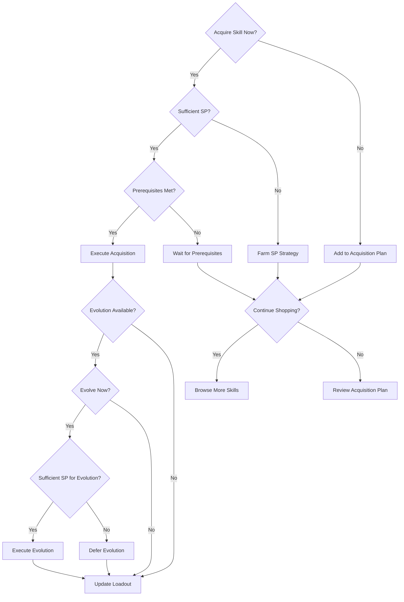
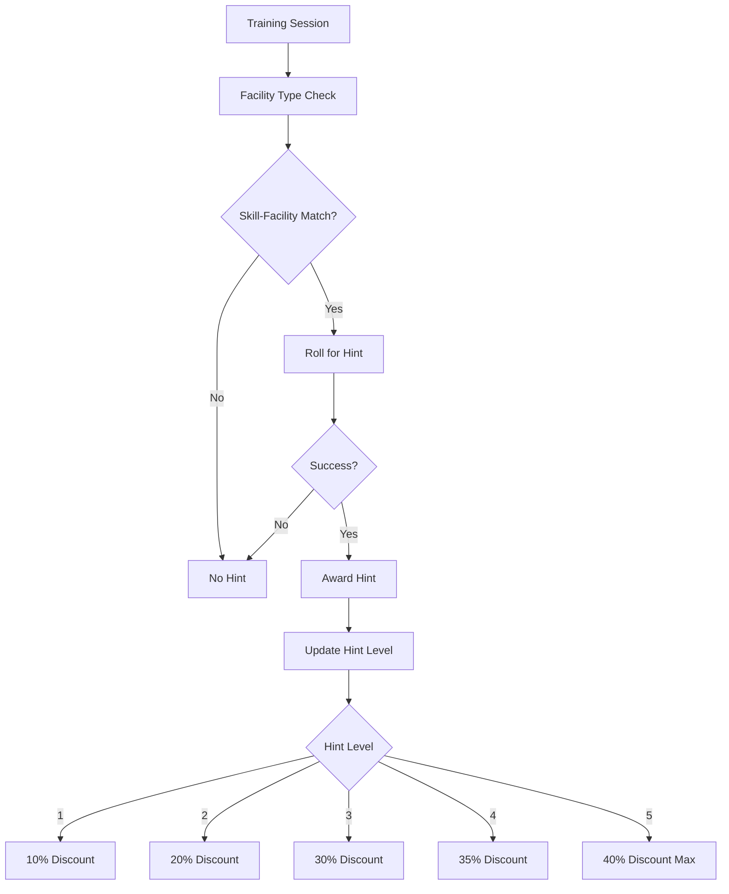
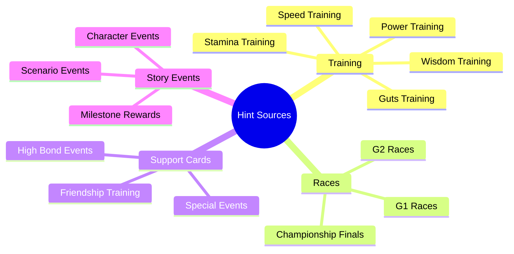
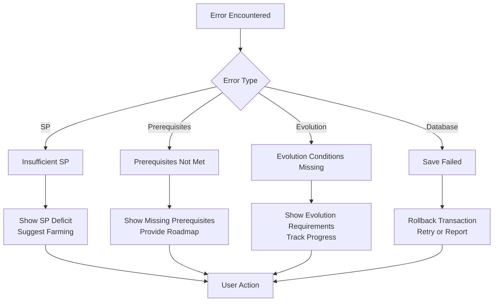
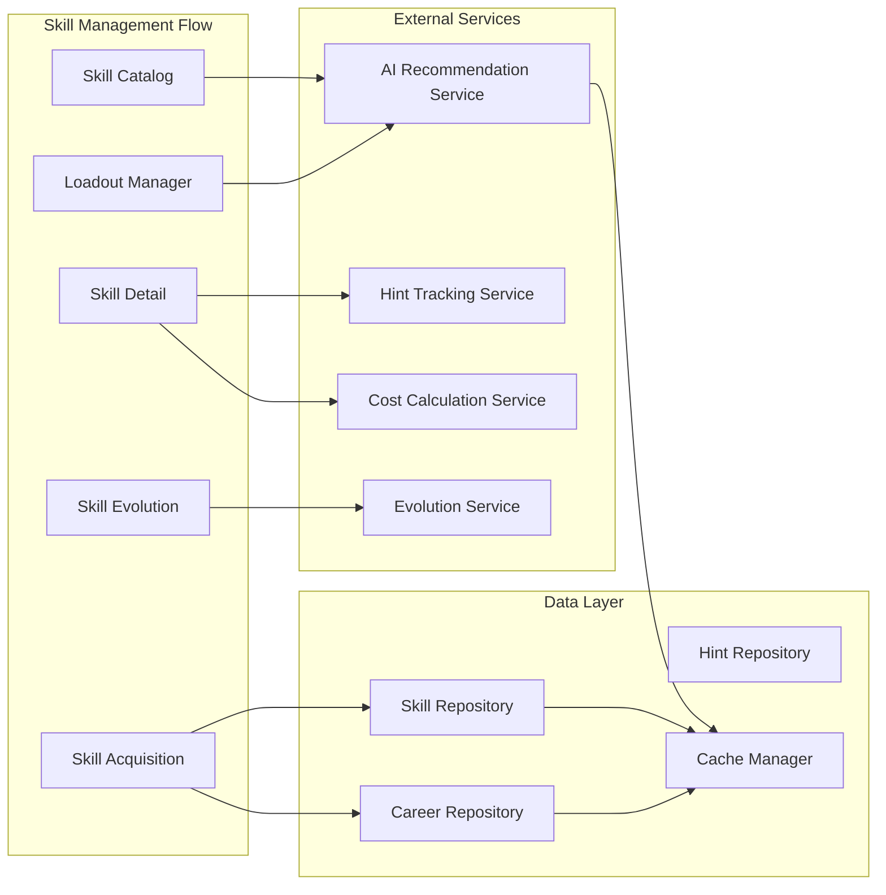

# UF-005: Skill Management Flow

## Umamusume Pretty Derby Career Planner

**Document Version**: 2.2.0  
**Date**: January 28, 2026  
**Related Documents**: [PRD-004], [SPEC-004], [SRS], [BRS]

**Source Specifications**:

- `.kiro/specs/umamusume-career-planner-main/requirements.md` (Requirement 4: Comprehensive Skill Management)
- `.kiro/specs/umamusume-career-planner-main/design.md` (Skill Management Flow)

**Related Artifacts**:

- PRD: [PRD-004](../prds/PRD-004_Skill_Management.md)
- SPEC: [SPEC-004](../specs/SPEC-004_Skill_Management_Technical.md)
- Flow: [FLOW-004](../flows/FLOW-004_Skill_Management_System.md)
- Tech Flow: [TECH-FLOW-004](../tech-flow/TECH-FLOW-004_Skill_Management_Flow.md)
- Wireframes: [WF-008](../wireframes/WF-008_Skill_Shop_Interface.md), [WF-009](../wireframes/WF-009_Skill_Loadout_Manager.md)
- Sequences: [SEQ-003](../sequences/SEQ-003_Skill_Acquisition_and_Upgrade.md)
- User Manual: [D17](../D17_SUM_Software_User_Manual.md#8-skill-management)

---

## Table of Contents

1. [Overview](#1-overview)
2. [Flow Diagram](#2-flow-diagram)
3. [User Journey Steps](#3-user-journey-steps)
4. [Decision Points](#4-decision-points)
5. [Skill Hint System](#5-skill-hint-system)
6. [Success Criteria](#6-success-criteria)
7. [Error Handling](#7-error-handling)
8. [Related Flows](#8-related-flows)

---

## 1. Overview

### 1.1 Purpose

The Skill Management Flow guides users through the complete process of browsing, acquiring, and managing skills for their character. This flow incorporates the skill hint system for SP cost reduction, skill evolution tracking, and AI-powered recommendations to optimize skill builds for specific goals.

### 1.2 Scope

| Aspect | Description |
|--------|-------------|
| **Entry Point** | Skill shop access from dashboard, training results, or race preparation |
| **Exit Point** | Skill acquired and added to active loadout, or skill build plan saved |
| **Duration** | 2-5 minutes per skill acquisition; 10-15 minutes for full build planning |
| **User Type** | All users with active career runs |

### 1.3 Business Context

**Business Goal**: Enable efficient skill acquisition planning and execution through intelligent recommendations, hint tracking, and SP budget optimization.

**Success Metrics**:

- Skill acquisition completion rate: > 90%
- Hint utilization rate: > 75%
- AI recommendation acceptance rate: > 65%
- SP budget optimization accuracy: Within 10% of target

---

## 2. Flow Diagram

### 2.1 High-Level Flow



### 2.2 Detailed State Diagram



---

## 3. User Journey Steps

### 3.1 Step 1: Skill Catalog Access and Browsing

**Purpose**: Navigate the skill catalog with filtering and search capabilities.

#### 3.1.1 Skill Catalog Interface

```
┌────────────────────────────────────────────────────────────┐
│  Skill Catalog                                        [≡]   │
├────────────────────────────────────────────────────────────┤
│  SP Balance: 850 | Total Earned: 2,400 | Used: 1,550      │
│                                                            │
│  ┌──────────────────────────────────────────────────────┐  │
│  │ 🔍 Search skills (English or Japanese)...           │  │
│  └──────────────────────────────────────────────────────┘  │
│                                                            │
│  Filters:                                                  │
│  Type:    [ ]Speed  [ ]Stamina  [ ]Power  [ ]Guts  [ ]Wit │
│  Rarity:  [ ]Normal  [ ]Rare  [ ]Unique                    │
│  Status:  [✓]Available  [ ]Owned  [ ]Planned               │
│  Sort:    [Cost (Low→High) ▼]                              │
│                                                            │
│  🤖 AI Recommendations (3 for your build):                 │
│  ┌────────────────────────────────────────────────────────┐│
│  │ 1. Going Strong [Normal] • 120 SP (96 SP w/ hints)    ││
│  │    Speed boost • High priority for Mile races          ││
│  │    Hints: Lv.2 (-20%) [VIEW] [ACQUIRE]                ││
│  ├────────────────────────────────────────────────────────┤│
│  │ 2. Lane Guidance [Normal] • 100 SP (60 SP w/ hints)   ││
│  │    Positioning • Recommended for Late Surger style     ││
│  │    Hints: Lv.5 (-40%) [VIEW] [ACQUIRE]                ││
│  └────────────────────────────────────────────────────────┘│
│                                                            │
│  All Skills (156 available):                               │
│  ┌────────────────────────────────────────────────────────┐│
│  │ Blazing Speed [Normal]                       120 SP    ││
│  │ Speed boost in final stretch                           ││
│  │ Hints: Lv.0 • Can evolve to: Flame Surge [Rare]       ││
│  │                                   [VIEW] [ACQUIRE]     ││
│  ├────────────────────────────────────────────────────────┤│
│  │ Stamina Master [Rare]                        180 SP    ││
│  │ Enhanced stamina efficiency                            ││
│  │ Hints: Lv.1 (-10%) • Prerequisites: ✓ Met             ││
│  │                                   [VIEW] [ACQUIRE]     ││
│  └────────────────────────────────────────────────────────┘│
│                                                            │
│                                    [View Acquisition Plan] │
└────────────────────────────────────────────────────────────┘
```

**User Actions**:

| Action | Description | Next State |
|--------|-------------|------------|
| Search | Type skill name (English/Japanese) | Filter catalog |
| Filter by type | Check stat category checkboxes | Update results |
| Filter by rarity | Select Normal/Rare/Unique | Update results |
| Filter by status | Show Available/Owned/Planned | Update results |
| Sort | Change sort order | Reorder results |
| View skill | Click on skill card | Skill detail view |
| Quick acquire | Click "Acquire" on card | Purchase confirmation |

**Catalog Features**:

| Feature | Description |
|---------|-------------|
| Real-time search | Instant filtering as user types |
| Bilingual support | Search in English or Japanese (kanji/kana) |
| Hint indicators | Visual badges showing available hint discounts |
| Evolution paths | Shows which Normal skills can evolve to Rare |
| AI badges | Highlights recommended skills for current build |

**Implementation Details**:

```php
// app/Livewire/Skills/SkillCatalog.php
class SkillCatalog extends Component
{
    public string $search = '';
    public array $typeFilters = [];
    public array $rarityFilters = [];
    public array $statusFilters = ['available'];
    public string $sortBy = 'cost_asc';
    
    public function render()
    {
        $skills = Skill::query()
            ->when($this->search, function ($query) {
                $query->where(function ($q) {
                    $q->where('name', 'like', "%{$this->search}%")
                      ->orWhere('name_jp', 'like', "%{$this->search}%");
                });
            })
            ->when($this->typeFilters, function ($query) {
                $query->whereIn('skill_type', $this->typeFilters);
            })
            ->when($this->rarityFilters, function ($query) {
                $query->whereIn('rarity', $this->rarityFilters);
            })
            ->when(in_array('available', $this->statusFilters), function ($query) {
                // Skills not yet acquired by current career
            })
            ->orderBy(...$this->getSortColumns())
            ->paginate(20);
        
        $recommendations = app(AISkillRecommendationService::class)
            ->getRecommendations(auth()->user()->currentCareer);
        
        return view('livewire.skills.skill-catalog', [
            'skills' => $skills,
            'recommendations' => $recommendations,
        ]);
    }
}
```

---

### 3.2 Step 2: Skill Detail View

**Purpose**: Display comprehensive skill information including prerequisites, costs, and evolution paths.

#### 3.2.1 Skill Detail Interface

```
┌────────────────────────────────────────────────────────────┐
│  Skill Details: Going Strong                          [×]   │
├────────────────────────────────────────────────────────────┤
│  ┌────────────────────────────────────────────────────────┐│
│  │ Going Strong (ゴーイングストロング)          [Normal] ││
│  │                                                        ││
│  │ Type: Speed                                            ││
│  │ Category: Acceleration                                 ││
│  │                                                        ││
│  │ Description:                                           ││
│  │ Increases speed during the mid-race phase, allowing    ││
│  │ better positioning for the final stretch.              ││
│  │                                                        ││
│  │ Effects:                                               ││
│  │ • Speed +5% during turns 40-60                         ││
│  │ • Activation rate: 80%                                 ││
│  │ • Duration: 20 turns                                   ││
│  │                                                        ││
│  │ Best For:                                              ││
│  │ • Mile races (1400-1800m)                              ││
│  │ • Late Surger running style                            ││
│  │ • Speed-focused builds                                 ││
│  └────────────────────────────────────────────────────────┘│
│                                                            │
│  ┌────────────────────────────────────────────────────────┐│
│  │ ACQUISITION DETAILS                                    │���
│  ├────────────────────────────────────────────────────────┤│
│  │ Base SP Cost:        120 SP                            ││
│  │ Hints Collected:     Lv.2 (-20%)                        ││
│  │ Final Cost:          96 SP ✓ Affordable                ││
│  │                                                        ││
│  │ Current SP Balance:  850 SP                            ││
│  │ After Purchase:      754 SP                            ││
│  │                                                        ││
│  │ Prerequisites:       None ✓                            ││
│  │                                                        ││
│  │ Hint Sources:                                          ││
│  │ • Speed Training (Medium chance)                       ││
│  │ • Mile races (Low chance)                              ││
│  │ • Support card: Tokai Teio (High chance)               ││
│  └────────────────────────────────────────────────────────┘│
│                                                            │
│  ┌────────────────────────────────────────────────────────┐│
│  │ EVOLUTION PATH                                         ││
│  ├────────────────────────────────────────────────────────┤│
│  │ Going Strong [Normal] → Blazing Surge [Rare]          ││
│  │                                                        ││
│  │ Evolution Requirements:                                ││
│  │ ✓ Own Going Strong                                     ││
│  │ ✓ Complete 5 Mile races                                ││
│  │ ✗ Win 1 G1 race (0/1 completed)                        ││
│  │                                                        ││
│  │ Evolution Cost: +60 SP (Total: 180 SP)                 ││
│  │ Upgraded Effects: Speed +7% (vs +5%)                   ││
│  └────────────────────────────────────────────────────────┘│
│                                                            │
│  🤖 AI Insight:                                            │
│  "Highly recommended for your current build. Strong        │
│   synergy with your Late Surger style and upcoming        │
│   Mile races. Acquire now to maximize training gains."    │
│                                                            │
│                  [ACQUIRE NOW] [ADD TO PLAN] [CANCEL]      │
└────────────────────────────────────────────────────────────┘
```

**Detail Components**:

| Component | Description |
|-----------|-------------|
| Skill Information | Name (EN/JP), type, category, description |
| Effects | Numeric bonuses, activation conditions, duration |
| Best Use Cases | Recommended race types and running styles |
| SP Cost Breakdown | Base cost, hint discounts, final cost |
| Prerequisites | Required skills or achievements (if any) |
| Hint Sources | Where to obtain hints for this skill |
| Evolution Path | Normal → Rare evolution details |
| AI Insight | Contextual recommendation for current build |

**Prerequisites Validation**:

```php
// app/Services/Skills/SkillPrerequisiteService.php
class SkillPrerequisiteService
{
    public function checkPrerequisites(CareerRun $career, Skill $skill): PrerequisiteCheck
    {
        $requirements = $skill->prerequisites ?? [];
        $unmet = [];
        
        foreach ($requirements as $requirement) {
            if (!$this->isRequirementMet($career, $requirement)) {
                $unmet[] = $requirement;
            }
        }
        
        return new PrerequisiteCheck(
            met: empty($unmet),
            unmetRequirements: $unmet,
            progress: $this->calculateProgress($career, $requirements),
        );
    }
    
    private function isRequirementMet(CareerRun $career, array $requirement): bool
    {
        return match($requirement['type']) {
            'skill_owned' => $career->skills()->where('skill_id', $requirement['skill_id'])->exists(),
            'race_completed' => $career->raceResults()->where('grade', $requirement['grade'])->count() >= $requirement['count'],
            'stat_threshold' => $career->{$requirement['stat']} >= $requirement['value'],
            'turn_minimum' => $career->current_turn >= $requirement['turn'],
            default => false,
        };
    }
}
```

---

### 3.3 Step 3: Skill Acquisition Execution

**Purpose**: Execute the skill purchase transaction with hint discount application.

#### 3.3.1 Purchase Confirmation Dialog

```
┌────────────────────────────────────────────────────────────┐
│  Confirm Skill Acquisition                                 │
├────────────────────────────────────────────────────────────┤
│  You are about to acquire:                                 │
│                                                            │
│  Going Strong [Normal]                                     │
│                                                            │
│  ┌────────────────────────────────────────────────────────┐│
│  │ Cost Breakdown:                                        ││
│  │                                                        ││
│  │ Base SP Cost:        120 SP                            ││
│  │ Hint Discount (Lv.2): -24 SP (-20%)                     ││
│  │ ─────────────────────────────                          ││
│  │ Final Cost:          96 SP                             ││
│  │                                                        ││
│  │ Current Balance:     850 SP                            ││
│  │ After Purchase:      754 SP                            ││
│  │ ─────────────────────────────                          ││
│  │ Remaining Budget:    ✓ Sufficient                      ││
│  └────────────────────────────────────────────────────────┘│
│                                                            │
│  This skill will be added to your active loadout.          │
│                                                            │
│  ⚠️ SP deduction is immediate and cannot be undone.        │
│                                                            │
│                          [CONFIRM] [CANCEL]                │
└────────────────────────────────────────────────────────────┘
```

**Acquisition Process**:



**Transaction Logic**:

```php
// app/Services/Skills/SkillAcquisitionService.php
class SkillAcquisitionService
{
    public function acquireSkill(CareerRun $career, Skill $skill): AcquisitionResult
    {
        $costCalculation = app(SkillCostCalculator::class)
            ->calculateFinalCost($career, $skill);
        
        if ($career->total_sp_available < $costCalculation->finalCost) {
            throw new InsufficientSPException(
                "Insufficient SP. Need {$costCalculation->finalCost}, have {$career->total_sp_available}"
            );
        }
        
        DB::transaction(function () use ($career, $skill, $costCalculation) {
            // Deduct SP
            $career->decrement('total_sp_available', $costCalculation->finalCost);
            
            // Create acquisition record
            $acquisition = SkillAcquisition::create([
                'career_run_id' => $career->id,
                'skill_id' => $skill->id,
                'turn_acquired' => $career->current_turn,
                'base_sp_cost' => $skill->base_sp_cost,
                'hint_discount' => $costCalculation->hintDiscount,
                'final_sp_cost' => $costCalculation->finalCost,
                'status' => SkillStatus::Acquired,
                'is_active' => true,
            ]);
            
            // Mark hints as used
            SkillHint::where('career_run_id', $career->id)
                ->where('skill_id', $skill->id)
                ->update(['is_used' => true]);
            
            // Log activity
            activity()
                ->performedOn($career)
                ->causedBy(auth()->user())
                ->withProperties([
                    'skill_name' => $skill->name,
                    'final_cost' => $costCalculation->finalCost,
                ])
                ->log('skill_acquired');
        });
        
        Cache::forget("career.{$career->id}.skills");
        
        event(new SkillAcquired($career, $skill, $costCalculation));
        
        return new AcquisitionResult(
            success: true,
            skill: $skill,
            costPaid: $costCalculation->finalCost,
            canEvolve: $this->checkEvolutionEligibility($career, $skill),
        );
    }
}
```

---

### 3.4 Step 4: Skill Evolution (Optional)

**Purpose**: Upgrade Normal skills to Rare versions when conditions are met.

#### 3.4.1 Evolution Prompt Interface

```
┌────────────────────────────────────────────────────────────┐
│  Skill Evolution Available!                                │
├────────────────────────────────────────────────────────────┤
│  Going Strong can be evolved!                              │
│                                                            │
│  ┌────────────────────────────────────────────────────────┐│
│  │ CURRENT SKILL                                          ││
│  │ Going Strong [Normal]                                  ││
│  │ • Speed +5% (turns 40-60)                              ││
│  │ • Activation: 80%                                      ││
│  └────────────────────────────────────────────────────────┘│
│                         ↓ EVOLVE                           │
│  ┌────────────────────────────────────────────────────────┐│
│  │ EVOLVED SKILL                                          ││
│  │ Blazing Surge [Rare]                                   ││
│  │ • Speed +7% (turns 40-60) ⬆️ +2% improvement           ││
│  │ • Activation: 85% ⬆️ +5% improvement                   ││
│  │ • Duration: 25 turns ⬆️ +5 turns                       ││
│  └────────────────────────────────────────────────────────┘│
│                                                            │
│  Evolution Cost: 60 SP                                     │
│  Current Balance: 754 SP → 694 SP after evolution         │
│                                                            │
│  Requirements:                                             │
│  ✓ Own Going Strong                                        │
│  ✓ Complete 5 Mile races (5/5)                             │
│  ✓ Win 1 G1 race (1/1)                                     │
│                                                            │
│  ⚠️ Evolution replaces the original skill.                 │
│                                                            │
│                          [EVOLVE NOW] [SKIP]               │
└────────────────────────────────────────────────────────────┘
```

**Evolution Mechanics**:



**Evolution Service**:

```php
// app/Services/Skills/SkillEvolutionService.php
class SkillEvolutionService
{
    public function checkEvolutionEligibility(CareerRun $career, Skill $skill): ?EvolutionOption
    {
        if (!$skill->evolution_from_id) {
            return null;
        }
        
        $evolvedSkill = Skill::find($skill->evolution_from_id);
        $requirements = $evolvedSkill->evolution_requirements ?? [];
        
        $allMet = collect($requirements)->every(function ($requirement) use ($career) {
            return $this->isRequirementMet($career, $requirement);
        });
        
        if (!$allMet) {
            return null;
        }
        
        return new EvolutionOption(
            normalSkill: $skill,
            rareSkill: $evolvedSkill,
            cost: $evolvedSkill->evolution_cost,
            improvements: $this->calculateImprovements($skill, $evolvedSkill),
        );
    }
    
    public function executeEvolution(CareerRun $career, Skill $normalSkill, Skill $rareSkill): void
    {
        DB::transaction(function () use ($career, $normalSkill, $rareSkill) {
            // Deduct evolution cost
            $career->decrement('total_sp_available', $rareSkill->evolution_cost);
            
            // Update acquisition record
            SkillAcquisition::where('career_run_id', $career->id)
                ->where('skill_id', $normalSkill->id)
                ->update([
                    'skill_id' => $rareSkill->id,
                    'is_evolution' => true,
                    'evolution_cost' => $rareSkill->evolution_cost,
                ]);
            
            // Log evolution
            activity()
                ->performedOn($career)
                ->withProperties([
                    'from_skill' => $normalSkill->name,
                    'to_skill' => $rareSkill->name,
                    'cost' => $rareSkill->evolution_cost,
                ])
                ->log('skill_evolved');
        });
        
        event(new SkillEvolved($career, $normalSkill, $rareSkill));
    }
}
```

---

### 3.5 Step 5: Loadout Management

**Purpose**: Organize and optimize active skill configuration.

#### 3.5.1 Loadout Manager Interface

```
┌────────────────────────────────────────────────────────────┐
│  Skill Loadout Manager                                [≡]   │
├────────────────────────────────────────────────────────────┤
│  Current Loadout: "Speed Focus Build"                      │
│  Active Skills: 8 | SP Invested: 1,950 | Synergy: 87/100  │
│                                                            │
│  ┌────────────────────────────────────────────────────────┐│
│  │ ACTIVE SKILLS (8)                                      ││
│  ├────────────────────────────────────────────────────────┤│
│  │ ✓ Blazing Surge [Rare] • Speed • 180 SP (Evolved)     ││
│  │   Effect: Speed +7% (turns 40-60)                      ││
│  │   [DEACTIVATE] [VIEW]                                  ││
│  ├────────────────────────────────────────────────────────┤│
│  │ ✓ Lane Guidance [Normal] • Positioning • 60 SP        ││
│  │   Effect: Better lane positioning                      ││
│  │   [DEACTIVATE] [VIEW]                                  ││
│  ├───────────��────────────────────────────────────────────┤│
│  │ ✓ Stamina Master [Rare] • Stamina • 180 SP            ││
│  │   Effect: Stamina efficiency +10%                      ││
│  │   [DEACTIVATE] [VIEW]                                  ││
│  └────────────────────────────────────────────────────────┘│
│                                                            │
│  ┌────────────────────────────────────────────────────────┐│
│  │ INACTIVE SKILLS (14)                                   ││
│  ├────────────────────────────────────────────────────────┤│
│  │ ○ Power Boost [Normal] • Power • 100 SP               ││
│  │   [ACTIVATE] [VIEW]                                    ││
│  │ ○ Recovery Plus [Normal] • Stamina • 80 SP            ││
│  │   [ACTIVATE] [VIEW]                                    ││
│  └────────────────────────────────────────────────────────┘│
│                                                            │
│  🤖 AI Loadout Optimization:                               │
│  "Consider activating 'Final Spurt' for upcoming Long      │
│   distance race. Deactivate 'Power Boost' to free SP."    │
│                                                            │
│                  [AUTO-OPTIMIZE] [SAVE LOADOUT] [PRESETS]  │
└────────────────────────────────────────────────────────────┘
```

**Loadout Features**:

| Feature | Description |
|---------|-------------|
| Active/Inactive Toggle | Enable/disable skills without losing acquisition |
| Synergy Scoring | Calculate loadout effectiveness for current build |
| AI Optimization | Suggest optimal skill combinations |
| Preset Management | Save and load predefined loadouts |
| SP Allocation Tracking | Monitor total SP invested across all skills |

---

## 4. Decision Points

### 4.1 Decision Tree



### 4.2 Key Decision Factors

| Factor | Impact on Decision | Weight |
|--------|-------------------|--------|
| **SP Balance** | Determines affordability | Critical |
| **Hint Availability** | Reduces cost significantly (up to 40%) | High |
| **Goal Alignment** | Matches active training goals | High |
| **Evolution Potential** | Future upgrade path available | Medium |
| **AI Recommendation** | Intelligent optimization suggestion | Medium |
| **Race Proximity** | Immediate vs. future benefit | Medium |
| **Synergy** | Compatibility with current loadout | Low |

---

## 5. Skill Hint System

### 5.1 Hint Acquisition Flow



### 5.2 Hint Discount Table

| Hint Level | Discount | Example (120 SP Skill) | Notes |
|------------|----------|------------------------|-------|
| 0 Hints | 0% | 120 SP (Base cost) | No discount |
| 1 Hint | 10% | 108 SP (-12 SP) | First hint |
| 2 Hints | 20% | 96 SP (-24 SP) | Second hint |
| 3 Hints | 30% | 84 SP (-36 SP) | Third hint |
| 4 Hints | 35% | 78 SP (-42 SP) | Fourth hint |
| 5 Hints | 40% | 72 SP (-48 SP) | Maximum discount |

### 5.2.1 Additional Discount Sources

| Source | Bonus | Stacks With Hints | Notes |
|--------|-------|-------------------|-------|
| Fast Learner Condition | +10% | Yes | Character condition effect |
| Skill Sparks | Variable | Yes | Event-based bonus |
| Hint Books | +1 Hint Level | Yes | Consumable item |

### 5.2.2 Skill Rarities

| Rarity | Display | Description | SP Cost Range |
|--------|---------|-------------|---------------|
| Normal | White text | Common skills | 60-150 SP |
| Rare | Gold text | Powerful skills | 150-300 SP |
| Unique | Character-specific | Character-exclusive skills | 200-400 SP |

### 5.3 Hint Sources



### 5.4 Hint Tracking Service

```php
// app/Services/Skills/SkillHintService.php
class SkillHintService
{
    /**
     * Hint level discount percentages (verified Global English Server Jan 2026)
     * Level 1: 10%, Level 2: 20%, Level 3: 30%, Level 4: 35%, Level 5: 40% (max)
     */
    private const HINT_DISCOUNTS = [
        1 => 10,
        2 => 20,
        3 => 30,
        4 => 35,
        5 => 40,
    ];
    
    public function awardHint(CareerRun $career, Skill $skill, string $source): ?SkillHint
    {
        $currentLevel = SkillHint::where('career_run_id', $career->id)
            ->where('skill_id', $skill->id)
            ->where('is_used', false)
            ->count();
        
        // Cap at 5 hints (40% max discount)
        if ($currentLevel >= 5) {
            return null;
        }
        
        $newLevel = $currentLevel + 1;
        $discount = self::HINT_DISCOUNTS[$newLevel] ?? 40;
        
        $hint = SkillHint::create([
            'career_run_id' => $career->id,
            'skill_id' => $skill->id,
            'source_type' => $source,
            'source_turn' => $career->current_turn,
            'hint_level' => $newLevel,
            'discount_percentage' => $discount,
            'is_used' => false,
        ]);
        
        event(new SkillHintAwarded($career, $skill, $hint));
        
        return $hint;
    }
    
    public function calculateTotalDiscount(CareerRun $career, Skill $skill): int
    {
        $hintLevel = SkillHint::where('career_run_id', $career->id)
            ->where('skill_id', $skill->id)
            ->where('is_used', false)
            ->count();
        
        // Get base discount from hint level
        $baseDiscount = self::HINT_DISCOUNTS[min($hintLevel, 5)] ?? 0;
        
        // Add Fast Learner condition bonus (+10%)
        $fastLearnerBonus = $career->hasCondition('fast_learner') ? 10 : 0;
        
        // Cap total discount at 50% (40% hints + 10% Fast Learner)
        return min(50, $baseDiscount + $fastLearnerBonus);
    }
}
```

---

## 6. Success Criteria

### 6.1 Functional Success

- ✅ Skill catalog loads within 1 second
- ✅ Search and filters update in real-time
- ✅ Hint discounts correctly applied
- ✅ SP deduction accurate and atomic
- ✅ Evolution conditions validated properly
- ✅ Loadout synergy calculated correctly
- ✅ AI recommendations contextually relevant

### 6.2 User Experience Success

| Metric | Target | Measurement |
|--------|--------|-------------|
| Skill acquisition completion rate | > 90% | Analytics tracking |
| Hint utilization rate | > 75% | Hint usage vs. available |
| AI recommendation acceptance | > 65% | User action tracking |
| Time to find desired skill | < 30 seconds | User analytics |

### 6.3 Technical Success

```php
// tests/Feature/SkillManagementFlowTest.php
test('skill acquisition flow completes successfully', function () {
    $career = CareerRun::factory()->create([
        'total_sp_available' => 500,
    ]);
    
    $skill = Skill::factory()->create([
        'base_sp_cost' => 120,
    ]);
    
    // Award hint for discount
    SkillHint::factory()->create([
        'career_run_id' => $career->id,
        'skill_id' => $skill->id,
        'discount_percentage' => 20,
    ]);
    
    $service = app(SkillAcquisitionService::class);
    $result = $service->acquireSkill($career, $skill);
    
    $career->refresh();
    
    expect($result->success)->toBeTrue()
        ->and($result->costPaid)->toBe(96) // 120 - 20%
        ->and($career->total_sp_available)->toBe(404) // 500 - 96
        ->and($career->skills()->where('skill_id', $skill->id)->exists())->toBeTrue();
});
```

---

## 7. Error Handling

### 7.1 Error Scenarios



### 7.2 Error Messages

| Error Code | Trigger | Message | User Action |
|------------|---------|---------|-------------|
| `SK-001` | SP < Skill Cost | "Insufficient SP. Need {X} SP, have {Y} SP." | Farm SP or defer acquisition |
| `SK-002` | Prerequisites not met | "Prerequisites not met: {list}. Complete these first." | Work on prerequisites |
| `SK-003` | Evolution conditions | "Evolution unavailable. Missing: {conditions}." | Continue career progression |
| `SK-004` | Database error | "Unable to save skill acquisition. Please try again." | Retry operation |
| `SK-005` | Duplicate acquisition | "Skill already owned." | Informational only |

### 7.3 Recovery Strategies

| Scenario | Primary Recovery | Fallback Recovery | Ultimate Fallback |
|----------|------------------|-------------------|-------------------|
| Insufficient SP | Show SP farming tips | Add to acquisition plan | Defer indefinitely |
| Prerequisites missing | Show prerequisite roadmap | Track progress automatically | Notify when conditions met |
| Evolution failure | Check conditions display | Allow later evolution | Skip evolution |
| Database timeout | Retry transaction (3x) | Queue for later processing | Contact support |

---

## 8. Related Flows

### 8.1 Downstream Flows

After skill acquisition, users may proceed to:

| Flow | Document Reference | Entry Condition |
|------|-------------------|-----------------|
| Training Day Flow | [UF-003](UF-003_Training_Day_Flow.md) | Resume training with new skill |
| Race Preparation | [UF-004](UF-004_Race_Day_Flow.md) | Optimize loadout for upcoming race |
| Loadout Optimization | Internal | Fine-tune active skill configuration |
| Skill Evolution | Internal | Upgrade Normal skills to Rare |

### 8.2 Alternative Entry Points

| Entry Point | Scenario | Flow Adjustment |
|-------------|----------|-----------------|
| Training Results | Hint gained from training | Skip catalog, go to updated skill |
| Race Prep | Race-specific skill needs | Pre-filter by race requirements |
| AI Recommendation | Proactive skill suggestion | Direct to recommended skill detail |
| Goal Setting | Skill required for goal | Show skills aligned with goal |

### 8.3 Integration Points



---

## Document Control

| Version | Date | Author | Changes |
|---------|------|--------|---------|
| 2.2.0 | 2026-01-28 | Development Team | Updated with verified game mechanics from Global English Server: 5-level hint system (10%/20%/30%/35%/40%), Fast Learner condition bonus, Skill Sparks, Hint Books, skill rarities (Normal/Rare/Unique) |
| 2.1.0 | 2026-01-24 | Development Team | Complete rewrite aligned with v2.0.0 architecture; added skill hint system details, evolution mechanics, loadout management; comprehensive error handling and testing criteria |
| 2.0.0 | 2026-01-14 | Development Team | Prior revision with basic flow |
| 1.0.0 | 2026-01-03 | Development Team | Initial draft |

---

## References

- [Software Development Plan (SDP)](../D01_SDP_Software_Development_Plan.md)
- [Business Requirements Specifications (BRS)](../D02_BRS_Business_Requirements_Specifications.md)
- [Software Requirements Specifications (SRS)](../D03_SRS_Software_Requirement_Specifications.md)
- [Software User Manual (SUM)](../D17_SUM_Software_User_Manual.md)
- [SPEC-004: Skill Management Technical](../specs/SPEC-004_Skill_Management_Technical.md)
- [FLOW-004: Skill Management System](../flows/FLOW-004_Skill_Management_System.md)
- [TECH-FLOW-004: Skill Management Flow](../tech-flow/TECH-FLOW-004_Skill_Management_Flow.md)
- [WF-008: Skill Shop Interface](../wireframes/WF-008_Skill_Shop_Interface.md)
- [WF-009: Skill Loadout Manager](../wireframes/WF-009_Skill_Loadout_Manager.md)
- [SEQ-003: Skill Acquisition and Upgrade](../sequences/SEQ-003_Skill_Acquisition_and_Upgrade.md)

---

*This user flow reflects the current skill management system implementation as of version 2.2.0. For the latest updates, refer to the online documentation.*
