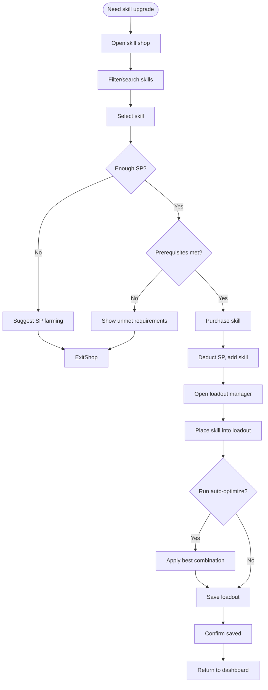

# UF-005: Skill Management Flow

## Umamusume Pretty Derby Career Planner

**Document Version**: 1.0  
**Date**: January 14, 2026  
**Related Documents**: [PRD-004], [SPEC-004], [FLOW-004], [SEQ-006], [SEQ-007]
**Source Specs**:

- `.kiro/specs/umamusume-career-planner-main/requirements.md` (Requirement 4: Comprehensive Skill Management)
- `.kiro/specs/umamusume-career-planner-main/design.md` (Skill Management Flow)

**Related Artifacts**:

- PRD: [PRD-004](../prds/PRD-004_Skill_Management.md)
- SPEC: [SPEC-004](../specs/SPEC-004_Skill_Management_Technical.md)
- Flow: [FLOW-004](../flows/FLOW-004_Skill_Management_System.md)
- Tech Flow: [TECH-FLOW-004](../tech-flow/TECH-FLOW-004_Skill_Management_Flow.md)
- Wireframes: [WF-008](../wireframes/WF-008_Skill_Shop_Interface.md), [WF-009](../wireframes/WF-009_Skill_Loadout_Manager.md)
- Sequences: [SEQ-003](../sequences/SEQ-003_Skill_Acquisition_and_Upgrade.md)

---

## Flow Diagram

## Notes

- Evolution-capable skills mark prerequisites; unmet shows checklist.  
- Auto-optimize respects SP budget and distance/style coverage.  
- SP suggestions include training choices or race rewards.
