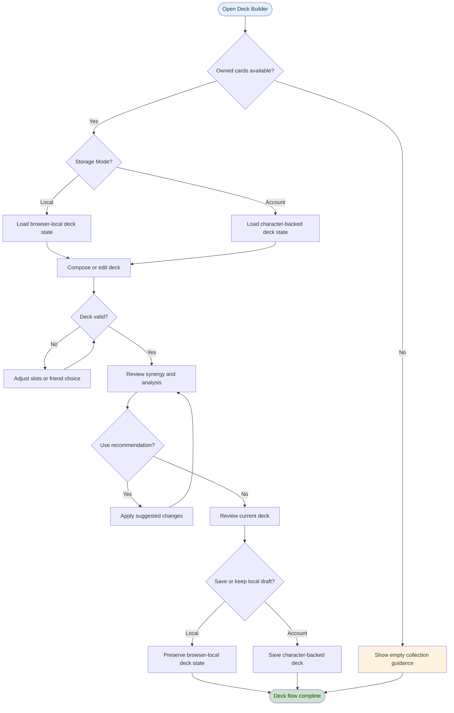
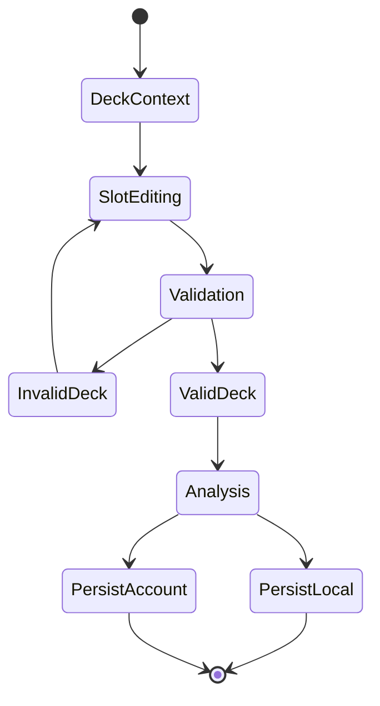

# UF-006: Support Deck Building Flow

## Umamusume Pretty Derby Career Planner

**Document Version**: 2.4.0
**Date**: March 10, 2026
**Related Documents**: [PRD-005], [SPEC-005], [SRS], [BRS]

**Source Specifications**:

- `.kiro/specs/umamusume-career-planner-main/requirements.md` (Requirement 6: Support Card Configuration)
- `.kiro/specs/umamusume-career-planner-main/design.md` (Support Deck Building Flow)

**Related Artifacts**:

- PRD: [PRD-005](../02-prds/PRD-005_Support_Card_Management.md)
- SPEC: [SPEC-005](../02-specs/SPEC-005_Support_Card_Management_Technical.md)
- Flow: [FLOW-005](../01-flows/FLOW-005_Support_Card_Management_System.md)
- Tech Flow: [TECH-FLOW-005](../01-tech-flow/TECH-FLOW-005_Support_Card_Management_Flow.md)
- Wireframes: [WF-010](../01-wireframes/WF-010_Support_Card_Collection.md),
[WF-011](../01-wireframes/WF-011_Support_Deck_Builder.md)
- Sequences: [SEQ-005](../01-sequences/SEQ-005_Support_Card_Upgrade.md),
[SEQ-016](../01-sequences/SEQ-016_Support_Deck_Configuration.md),
[SEQ-017](../01-sequences/SEQ-017_Storage_Mode_Transition.md)
- User Manual: [D17](../D17_SUM_Software_User_Manual.md#9-support-card--deck-management)

---

## Table of Contents

1. [Overview](#1-overview)
2. [Flow Diagram](#2-flow-diagram)
3. [User Journey Steps](#3-user-journey-steps)
4. [Decision Points](#4-decision-points)
5. [Success Criteria](#5-success-criteria)
6. [Error Handling](#6-error-handling)
7. [Related Flows](#7-related-flows)

---

## 1. Overview

### 1.1 Purpose

The Support Deck Building Flow guides users through browsing available support cards, composing a
six-card deck, validating slot choices, reviewing synergy, and saving or preserving the resulting
deck state using the correct persistence boundary for the current storage mode.

### 1.2 Scope

| Aspect | Description |
| --- | --- |
| **Entry Point** | Character setup, training-side deck change action, or deck-builder access from a character context |
| **Exit Point** | Deck configuration preserved in local state or saved to authenticated character-backed persistence |
| **Duration** | 3-10 minutes depending on deck complexity and optimization passes |
| **User Type** | Users with an active run in the current storage mode context |

### 1.3 Storage Mode Support

- `StorageMode::ACCOUNT`: implemented for authenticated deck persistence and character-linked deck usage.
- `StorageMode::LOCAL`: should be treated as browser-local planning or temporary configuration until
a verified local persistence path is documented.

### 1.4 Navigation Surface

This flow uses conceptual labels such as Deck Builder, Card Browser, and Synergy Review for the user
journey. Where implementation-backed navigation is relevant, the active deck-builder entry is:

- `/characters/{character}/deck-builder`

Deck save, validation, and slot-level mutations should be understood as character-scoped builder
actions rather than a generic global deck editor contract.

### 1.5 Business Context

**Business Goal**: Help users build valid, high-synergy decks without implying that every deck edit
persists identically across Local and Account modes.

**Success Metrics**:

- Users can tell the difference between deck planning and persisted deck save.
- Validation errors are recoverable without losing deck progress.
- Empty-collection and incomplete-slot states are understandable.

---

## 2. Flow Diagram

### 2.1 High-Level Flow

### 2.2 Validation Branch

---

## 3. User Journey Steps

### 3.1 Step 1: Open the Deck Context

**Purpose**: Load the current deck context without hiding the persistence boundary.

**User-visible context**:

- currently selected or active deck where available
- available support cards for the current user or local run context
- whether the user is editing a browser-local draft or an authenticated character-backed deck

### 3.2 Step 2: Compose the Deck

**Purpose**: Let the user assign six cards and review slot balance.

**Possible user actions**:

| Action | Outcome |
| --- | --- |
| Add card | Fill an empty slot |
| Remove card | Free a slot for replacement |
| Replace card | Swap one slot for another card |
| Review friend slot choice | Confirm whether the deck remains valid |

### 3.3 Step 3: Validate and Analyze

**Purpose**: Prevent invalid deck saves and give the user useful feedback.

**Validation themes**:

- six-card completeness
- duplicate restrictions
- friend-card restrictions where applicable
- obvious slot or compatibility issues

**Analysis outcomes**:

- synergy summary
- card mix review
- recommendation or optimization suggestion
- projected synergy and training impact should account for bond progression and limit break levels
of selected support cards

### 3.4 Step 4: Preserve or Persist the Deck

**Purpose**: Make local draft handling and authenticated persistence explicit.

**Local-mode path**:

1. User reviews or edits the deck.
2. Browser-local deck state is preserved where supported.
3. The flow should not imply account-backed character deck persistence.

**Account-mode path**:

1. User validates the final deck.
2. The deck is saved as character-backed deck state.
3. Downstream training or analysis can use the updated persisted deck.

---

## 4. Decision Points

### 4.1 Are There Enough Cards to Build a Deck?

If the user has no usable cards, the flow should stop in an empty or learning state rather than
implying a full deck can be saved.

### 4.2 Is This a Local Draft or an Authenticated Save?

The deck flow must distinguish between browser-local preservation and authenticated persisted deck mutation.

### 4.3 Does the User Want Optimization?

Optimization and recommendation are optional review steps. They should not be described as automatic persisted changes.

---

## 5. Success Criteria

- Users understand whether they are editing a local draft or a persisted character deck.
- Invalid decks can be fixed without losing the current composition.
- Empty-state and incomplete-slot cases are recoverable.

---

## 6. Error Handling

| Scenario | User-facing behavior |
| --- | --- |
| No owned cards | Show empty-state guidance instead of the normal deck builder |
| Incomplete deck | Explain what is missing and keep current selections intact |
| Invalid friend-slot or duplicate configuration | Return to slot editing with clear validation feedback |
| Local mode with no verified persistence path | Preserve deck planning locally and avoid implying server save |
| Network issue in Account mode | Keep current deck edits visible and allow retry before losing progress |

---

## 7. Related Flows

- [UF-002_Career_Setup_Flow.md](UF-002_Career_Setup_Flow.md)
- [UF-003_Training_Day_Flow.md](UF-003_Training_Day_Flow.md)
- [TECH-FLOW-005](../01-tech-flow/TECH-FLOW-005_Support_Card_Management_Flow.md)
- [SEQ-005](../01-sequences/SEQ-005_Support_Card_Upgrade.md)
- [SEQ-016](../01-sequences/SEQ-016_Support_Deck_Configuration.md)
- [SEQ-017](../01-sequences/SEQ-017_Storage_Mode_Transition.md)
