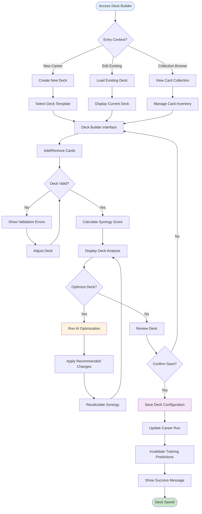
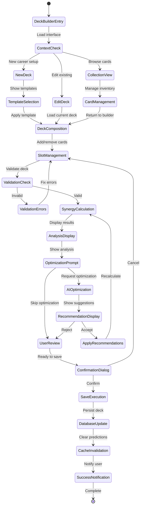
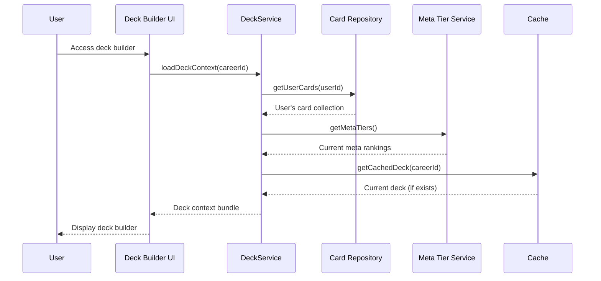
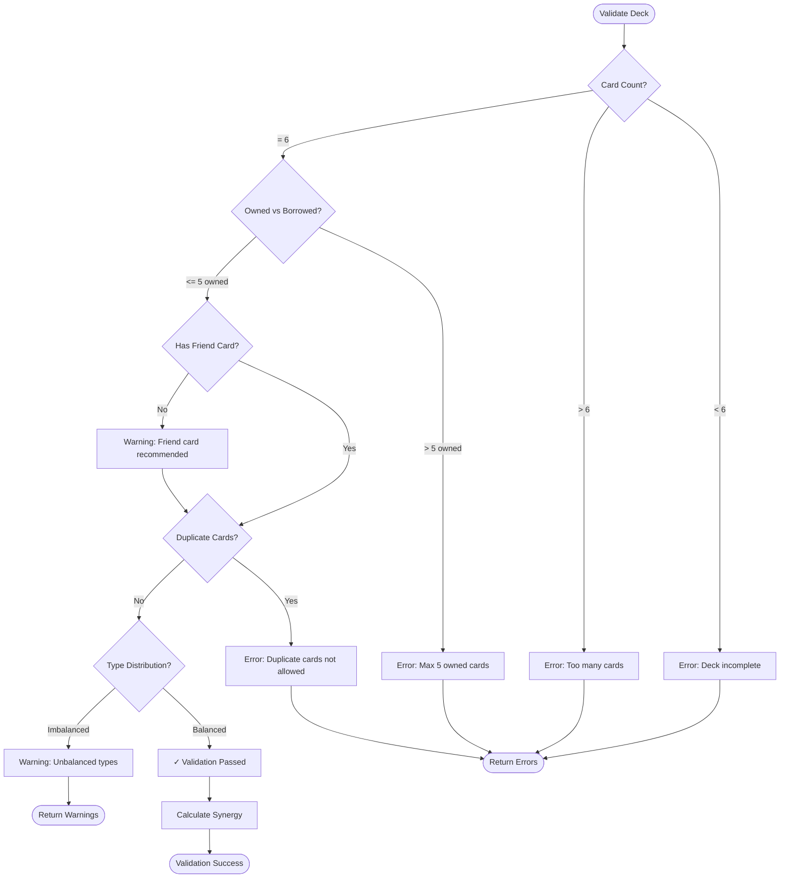
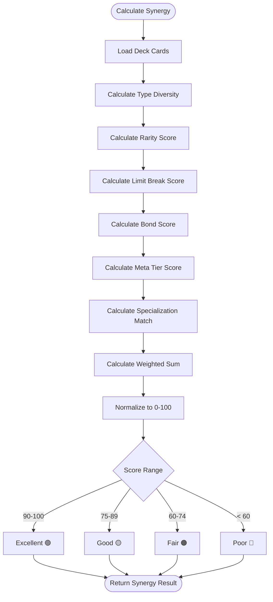
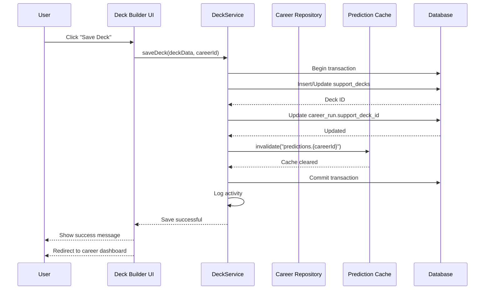
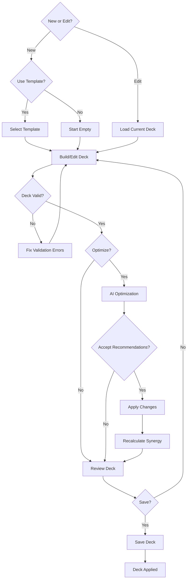
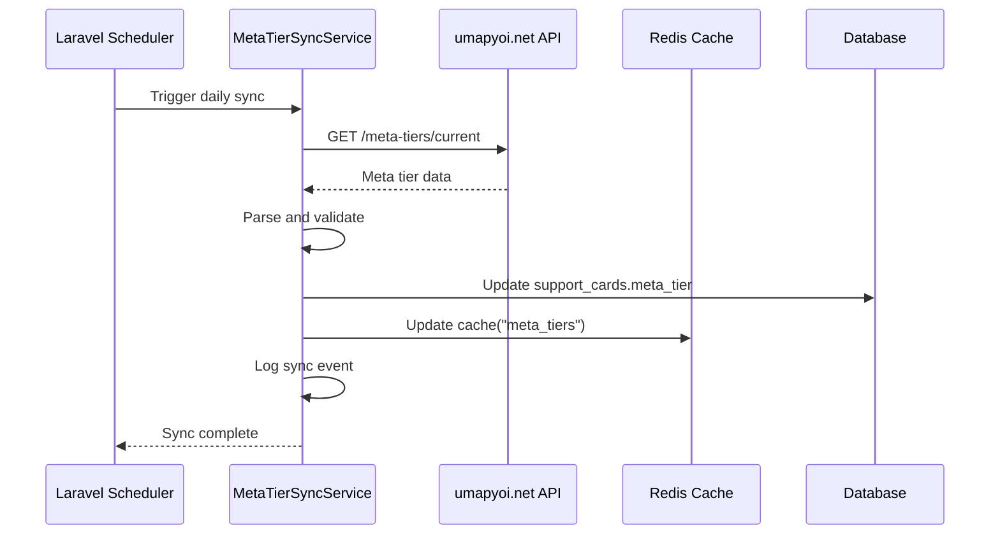
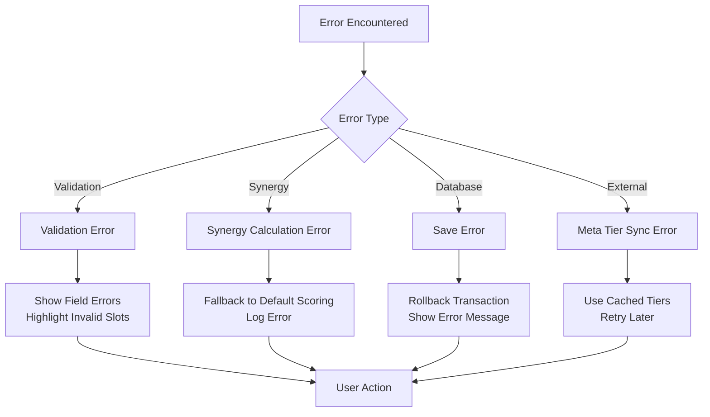
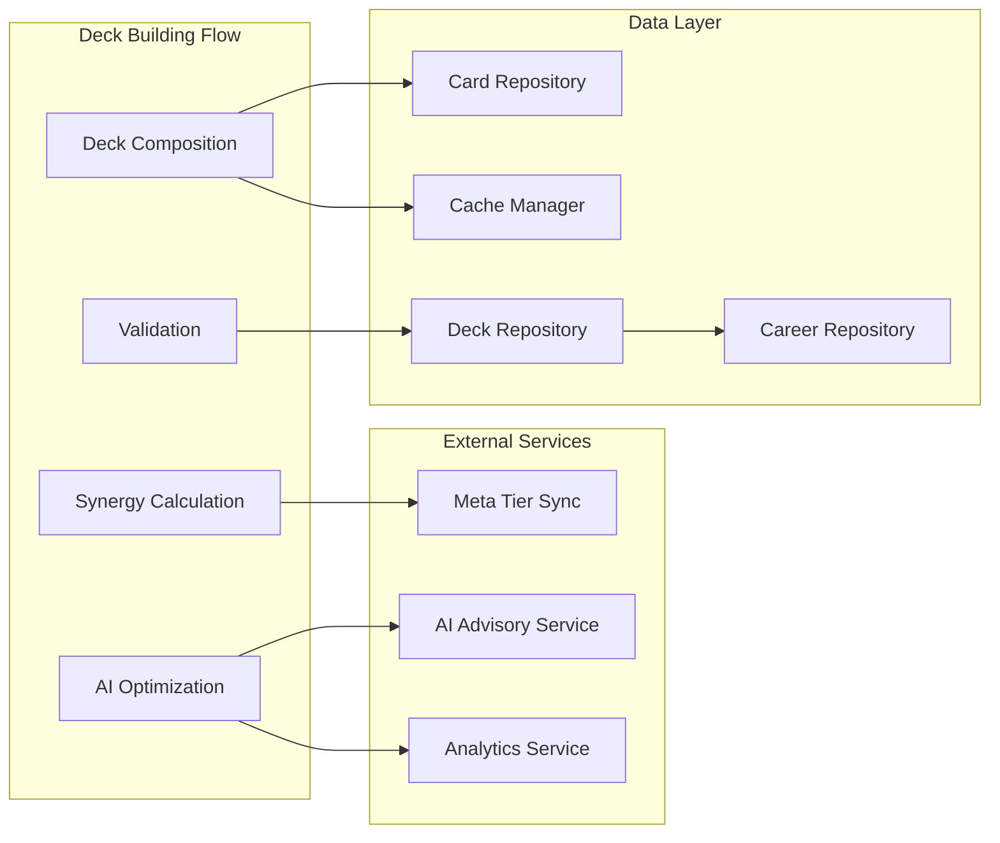

# UF-006: Support Deck Building Flow

## Umamusume Pretty Derby Career Planner

**Document Version**: 2.3.0  
**Date**: February 22, 2026  
**Related Documents**: [PRD-005], [SPEC-005], [SRS], [BRS]

**Source Specifications**:

- `.kiro/specs/umamusume-career-planner-main/requirements.md` (Requirement 6: Support Card Configuration)
- `.kiro/specs/umamusume-career-planner-main/design.md` (Support Deck Building Flow)

**Related Artifacts**:

- PRD: [PRD-005](../prds/PRD-005_Support_Card_Management.md)
- SPEC: [SPEC-005](../specs/SPEC-005_Support_Card_Management_Technical.md)
- Flow: [FLOW-005](../flows/FLOW-005_Support_Card_Management_System.md)
- Tech Flow: [TECH-FLOW-005](../tech-flow/TECH-FLOW-005_Support_Card_Management_Flow.md)
- Wireframes: [WF-010](../wireframes/WF-010_Support_Card_Collection.md), [WF-011](../wireframes/WF-011_Support_Deck_Builder.md)
- Sequences: [SEQ-005](../sequences/SEQ-005_Support_Card_Upgrade.md)
- User Manual: [D17](../D17_SUM_Software_User_Manual.md#9-support-card--deck-management)

---

## Table of Contents

1. [Overview](#1-overview)
2. [Flow Diagram](#2-flow-diagram)
3. [User Journey Steps](#3-user-journey-steps)
4. [Decision Points](#4-decision-points)
5. [Deck Synergy System](#5-deck-synergy-system)
6. [Success Criteria](#6-success-criteria)
7. [Error Handling](#7-error-handling)
8. [Related Flows](#8-related-flows)

---

## 1. Overview

### 1.1 Purpose

The Support Deck Building Flow guides users through the process of creating, optimizing, and managing their 6-card support decks for training optimization. This flow incorporates card collection management, deck composition validation, synergy analysis, and AI-powered deck recommendations.

### 1.2 Scope

| Aspect | Description |
|--------|-------------|
| **Entry Point** | Support deck builder from character setup, training screen, or card collection |
| **Exit Point** | Optimized deck saved and applied to career run |
| **Duration** | 5-10 minutes for deck creation; 2-3 minutes for deck editing |
| **User Type** | All users with active career runs |

### 1.3 Business Context

**Business Goal**: Enable efficient deck building and optimization through intelligent card recommendations, synergy analysis, and meta tier integration.

**Success Metrics**:

- Deck creation completion rate: > 90%
- Valid deck composition rate: > 95%
- AI recommendation acceptance rate: > 70%
- Meta tier synchronization accuracy: > 98%

---

## 2. Flow Diagram

### 2.1 High-Level Flow



### 2.2 Detailed State Diagram



---

## 3. User Journey Steps

### 3.1 Step 1: Entry and Context Setup

**Purpose**: Determine entry context and load appropriate starting state.

#### 3.1.1 Entry Points

| Entry Point | Trigger | Initial State |
|-------------|---------|---------------|
| **New Career Setup** | Character creation wizard Step 3 | Empty 6-slot deck |
| **Edit from Training** | "Change Deck" button on training screen | Current active deck |
| **Card Collection** | "Build Deck" button in collection | Card library view |
| **Career Dashboard** | "Manage Support Deck" action | Current active deck |

#### 3.1.2 Context Loading



**Context Data Loaded**:

- User's owned card collection (200+ cards)
- Current deck configuration (if editing)
- Meta tier rankings (SS, S, A, B)
- Career run training goals
- Character stat priorities

---

### 3.2 Step 2: Deck Template Selection (New Decks Only)

**Purpose**: Provide starting points for common deck strategies.

#### 3.2.1 Template Categories

```
┌────────────────────────────────────────────────────────────┐
│  Select Deck Template (Optional)                      [×]   │
├────────────────────────────────────────────────────────────┤
│  Choose a starting template or start from scratch          │
│                                                            │
│  ┌────────────────────────────────────────────────────────┐│
│  │ 🏃 Speed Focus Build                                   ││
│  │ 3 Speed cards + 1 Stamina + 1 Guts + 1 Friend         ││
│  │ Best for: Mile races, Front Runner style              ││
│  │                                         [SELECT]       ││
│  ├────────────────────────────────────────────────────────┤│
│  │ 💪 Power Focus Build                                   ││
│  │ 3 Power cards + 1 Speed + 1 Stamina + 1 Friend        ││
│  │ Best for: Long distance, Late Surger style            ││
│  │                                         [SELECT]       ││
│  ├────────────────────────────────────────────────────────┤│
│  │ ⚖️ Balanced Build                                      ││
│  │ 1 Speed + 1 Stamina + 1 Power + 1 Guts + 1 Wit + Friend│
│  │ Best for: Versatile training, all distances           ││
│  │                                         [SELECT]       ││
│  ├────────────────────────────────────────────────────────┤│
│  │ 🏆 Meta Build (Current Season)                         ││
│  │ Based on community rankings and tournament data        ││
│  │ Synergy Score: 92/100                                  ││
│  │                                         [SELECT]       ││
│  └────────────────────────────────────────────────────────┘│
│                                                            │
│                          [SKIP] [START FROM SCRATCH]       │
└────────────────────────────────────────────────────────────┘
```

**Template Composition Rules**:

| Template | Speed | Stamina | Power | Guts | Wit | Friend |
|----------|-------|---------|-------|------|-----|--------|
| Speed Focus | 3 | 1 | 0 | 1 | 0 | 1 |
| Stamina Focus | 1 | 3 | 0 | 1 | 0 | 1 |
| Power Focus | 1 | 1 | 3 | 0 | 0 | 1 |
| Balanced | 1 | 1 | 1 | 1 | 1 | 1 |
| Meta (Variable) | Auto-populated from meta tier list | 1 |

**Note**: Support card types are Speed, Stamina, Power, Guts, Wit, and Friend. Friend cards provide versatile bonuses across all training facilities.

---

### 3.3 Step 3: Deck Composition

**Purpose**: Build the 6-card deck through card selection and slot management.

#### 3.3.1 Deck Builder Interface

```
┌────────────────────────────────────────────────────────────┐
│  Configure Support Deck (6 Cards Required)           [≡]   │
├────────────────────────────────────────────────────────────┤
│  Deck Name: [Speed Focus - URA Finals      ] [Save As...] │
│  Synergy Score: 87/100 🟢 Excellent                        │
│                                                            │
│  ┌────────────────────────────────────────────────────────┐│
│  │ DECK COMPOSITION (5 of 6 cards selected)               ││
│  ├────────────────────────────────────────────────────────┤│
│  │ Slot 1: Speed                                          ││
│  │ ┌────────────────────────────────────────────────┐    ││
│  │ │ Tokai Teio (SSR)                     Meta: SS  │    ││
│  │ │ Limit Break: ★★★★★ (MLB)                       │    ││
│  │ │ Bond Level: 75% ▓▓▓▓▓▓▓░░░                     │    ││
│  │ │ Specialization: Speed Focus                     │    ││
│  │ │ Training Bonus: +15% Speed gains                │    ││
│  │ │                                   [CHANGE] [×]  │    ││
│  │ └────────────────────────────────────────────────┘    ││
│  │                                                        ││
│  │ Slot 2: Stamina                                        ││
│  │ ┌────────────────────────────────────────────────┐    ││
│  │ │ Kitasan Black (SSR)                  Meta: S   │    ││
│  │ │ Limit Break: ★★★★★ (MLB)                       │    ││
│  │ │ Bond Level: 85% ▓▓▓▓▓▓▓▓░░                     │    ││
│  │ │ Specialization: Stamina Focus                   │    ││
│  │ │ Training Bonus: +18% Stamina gains              │    ││
│  │ │                                   [CHANGE] [×]  │    ││
│  │ └────────────────────────────────────────────────┘    ││
│  │                                                        ││
│  │ Slot 3: Speed                                          ││
│  │ ┌────────────────────────────────────────────────┐    ││
│  │ │ Mejiro Dober (SSR)                   Meta: S   │    ││
│  │ │ Limit Break: ★★★★★ (MLB)                       │    ││
│  │ │ Bond Level: 90% ▓▓▓▓▓▓▓▓▓░                     │    ││
│  │ │ Specialization: Power Focus                     │    ││
│  │ │ Training Bonus: +15% Power gains                │    ││
│  │ │                                   [CHANGE] [×]  │    ││
│  │ └────────────────────────────────────────────���───┘    ││
│  │                                                        ││
│  │ Slot 4: Guts                                           ││
│  │ ┌────────────────────────────────────────────────┐    ││
│  │ │ Symboli Rudolf (SSR)                 Meta: A   │    ││
│  │ │ Limit Break: ★★☆☆ (2/4)                        │    ││
│  │ │ Bond Level: 70% ▓▓▓▓▓▓▓░░░                     │    ││
│  │ │ Specialization: Guts Focus                      │    ││
│  │ │ Training Bonus: +12% Guts gains                 │    ││
│  │ │                                   [CHANGE] [×]  │    ││
│  │ └────────────────────────────────────────────────┘    ││
│  │                                                        ││
│  │ Slot 5: Speed                                          ││
│  │ ┌────────────────────────────────────────────────┐    ││
│  │ │ Narita Brian (SSR)                   Meta: S   │    ││
│  │ │ Limit Break: ★★★☆ (3/4)                        │    ││
│  │ │ Bond Level: 80% ▓▓▓▓▓▓▓▓░░                     │    ││
│  │ │ Specialization: Wit Focus                       │    ││
│  │ │ Training Bonus: +14% Wit gains                  │    ││
│  │ │                                   [CHANGE] [×]  │    ││
│  │ └────────────────────────────────────────────────┘    ││
│  │                                                        ││
│  │ Slot 6: Friend (Borrowed Card)                        ││
│  │ ┌────────────────────────────────────────────────┐    ││
│  │ │ [EMPTY SLOT - ADD FRIEND CARD]                 │    ││
│  │ │ ⚠️ Required: Deck must have exactly 6 cards     │    ││
│  │ │                                   [ADD CARD]    │    ││
│  │ └────────────────────────────────────────────────┘    ││
│  └────────────────────────────────────────────────────────┘│
│                                                            │
│  Deck Analysis:                                            │
│  • Type Distribution: Speed (3), Stamina (1), Guts (1) ⚠️  │
│  • Rarity: All SSR ✓                                       │
│  • Meta Tier: 4 S+ tier, 1 A tier ✓                       │
│  • Average Bond: 80% ✓                                     │
│  • Average Limit Break: 4.2/4 (MLB) ✓                      │
│                                                            │
│  ⚠️ Recommendation: Add Friend card to complete deck       │
│                                                            │
│                  [AUTO-OPTIMIZE] [SAVE DECK] [RESET]       │
└────────────────────────────────────────────────────────────┘
```

**Slot Management Actions**:

| Action | Button | Behavior |
|--------|--------|----------|
| Add card | [ADD CARD] | Open card selector for empty slot |
| Change card | [CHANGE] | Replace card in occupied slot |
| Remove card | [×] | Clear slot and return to empty state |

#### 3.3.2 Card Selector Interface

```
┌────────────────────────────────────────────────────────────┐
│  Select Card for Slot 6 (Friend)                      [×]   │
├────────────────────────────────────────────────────────────┤
│  ┌─���────────────────────────────────────────────────────┐  │
│  │ 🔍 Search cards by name...                           │  │
│  └──────────────────────────────────────────────────────┘  │
│                                                            │
│  Filters:                                                  │
│  Rarity: [✓]SSR  [✓]SR  [ ]R                              │
│  Type:   [ ]All  [✓]Friend Cards Only                     │
│  Sort:   [Meta Tier (High→Low) ▼]                         │
│                                                            │
│  Available Cards (12 matching):                            │
│  ┌────────────────────────────────────────────────────────┐│
│  │ Mejiro McQueen (SSR)                    Meta: SS Tier  ││
│  │ Friend · Wisdom Specialization                         ││
│  │ LB: ★★★★ (4/4) | Bond: 95%                            ││
│  │ Training Bonus: +20% Wisdom gains                      ││
│  │ Synergy Impact: +5 (Current: 87 → 92)                 ││
│  │                                           [SELECT]     ││
│  ├────────────────────────────────────────────────────────┤│
│  │ Wonderful Luna (SR)                     Meta: S Tier   ││
│  │ Friend · Stamina Specialization                        ││
│  │ LB: ★★★☆ (3/4) | Bond: 80%                            ││
│  │ Training Bonus: +15% Stamina gains                     ││
│  │ Synergy Impact: +3 (Current: 87 → 90)                 ││
│  │                                           [SELECT]     ││
│  └────────────────────────────────────────────────────────┘│
│                                                            │
│                                    [CANCEL] [SELECT NONE]  │
└────────────────────────────────────────────────────────────┘
```

**Card Selection Criteria**:

| Criterion | Weight | Description |
|-----------|--------|-------------|
| Meta Tier | High | SS/S tier preferred for competitive builds |
| Limit Break Level | High | Higher LB = stronger bonuses |
| Bond Level | Medium | Higher bond = better training benefits |
| Specialization Match | Medium | Align with training goals |
| Synergy Impact | High | Predicted impact on overall deck score |

---

### 3.4 Step 4: Deck Validation

**Purpose**: Ensure deck meets composition requirements before saving.

#### 3.4.1 Validation Rules



#### 3.4.2 Validation Error Messages

| Error Code | Condition | Message | User Action |
|------------|-----------|---------|-------------|
| `VD-001` | Card count ≠ 6 | "Deck must contain exactly 6 cards" | Add/remove cards |
| `VD-002` | > 5 owned cards | "Maximum 5 owned cards allowed (slot 6 is friend card)" | Replace with friend card |
| `VD-003` | Duplicate cards | "Each card can only be used once in a deck" | Remove duplicate |
| `VD-004` | Invalid card type | "Selected card is not valid for this slot" | Choose valid card |

#### 3.4.3 Validation Warnings (Non-Blocking)

| Warning Code | Condition | Message | Recommendation |
|--------------|-----------|---------|----------------|
| `VW-001` | No friend card | "Friend card not selected" | Consider adding friend card |
| `VW-002` | Type imbalance | "Deck has {X} Speed cards and no {Y} cards" | Balance type distribution |
| `VW-003` | Low synergy | "Deck synergy score is {X}/100 (below 60)" | Run auto-optimize |
| `VW-004` | Low meta tier | "{X} cards are below A tier" | Consider upgrading cards |

**Validation Service Implementation**:

```php
// app/Services/DeckValidationService.php
class DeckValidationService
{
    public function validate(array $cards): ValidationResult
    {
        $errors = [];
        $warnings = [];
        
        // Rule 1: Exactly 6 cards
        if (count($cards) !== 6) {
            $errors[] = new ValidationError(
                code: 'VD-001',
                message: 'Deck must contain exactly 6 cards',
                field: 'deck_composition',
            );
        }
        
        // Rule 2: Maximum 5 owned cards
        $ownedCount = collect($cards)->where('is_borrowed', false)->count();
        if ($ownedCount > 5) {
            $errors[] = new ValidationError(
                code: 'VD-002',
                message: 'Maximum 5 owned cards allowed (slot 6 is friend card)',
                field: 'slot_ownership',
            );
        }
        
        // Rule 3: No duplicates
        $uniqueCards = collect($cards)->pluck('card_id')->unique()->count();
        if ($uniqueCards !== count($cards)) {
            $errors[] = new ValidationError(
                code: 'VD-003',
                message: 'Each card can only be used once in a deck',
                field: 'card_uniqueness',
            );
        }
        
        // Warning 1: Friend card recommendation
        if (!$this->hasFriendCard($cards)) {
            $warnings[] = new ValidationWarning(
                code: 'VW-001',
                message: 'Friend card not selected',
                recommendation: 'Consider adding a friend card for additional bonuses',
            );
        }
        
        // Warning 2: Type balance
        $typeDistribution = $this->analyzeTypeDistribution($cards);
        if ($this->isImbalanced($typeDistribution)) {
            $warnings[] = new ValidationWarning(
                code: 'VW-002',
                message: $this->generateImbalanceMessage($typeDistribution),
                recommendation: 'Balance type distribution for versatile training',
            );
        }
        
        return new ValidationResult(
            valid: empty($errors),
            errors: $errors,
            warnings: $warnings,
        );
    }
}
```

---

### 3.5 Step 5: Synergy Calculation and Analysis

**Purpose**: Calculate deck effectiveness and provide optimization insights.

#### 3.5.1 Synergy Scoring Algorithm



**Scoring Components**:

| Component | Weight | Max Points | Calculation |
|-----------|--------|------------|-------------|
| Type Diversity | 20% | 20 | Unique types / 5 × 20 |
| Rarity Distribution | 15% | 15 | (SSR×3 + SR×2 + R×1) / 18 × 15 |
| Limit Break Average | 20% | 20 | Avg LB / 4 × 20 |
| Bond Level Average | 15% | 15 | Avg Bond / 100 × 15 |
| Meta Tier Score | 20% | 20 | (SS×4 + S×3 + A×2 + B×1) / 24 × 20 |
| Specialization Match | 10% | 10 | Matching specs / 6 × 10 |

**Synergy Service Implementation**:

```php
// app/Services/DeckSynergyCalculator.php
class DeckSynergyCalculator
{
    public function calculate(array $cards, ?CareerRun $career = null): SynergyScore
    {
        $scores = [
            'type_diversity' => $this->calculateTypeDiversity($cards),
            'rarity' => $this->calculateRarityScore($cards),
            'limit_break' => $this->calculateLimitBreakScore($cards),
            'bond' => $this->calculateBondScore($cards),
            'meta_tier' => $this->calculateMetaTierScore($cards),
            'specialization' => $this->calculateSpecializationMatch($cards, $career),
        ];
        
        $totalScore = ($scores['type_diversity'] * 0.20)
            + ($scores['rarity'] * 0.15)
            + ($scores['limit_break'] * 0.20)
            + ($scores['bond'] * 0.15)
            + ($scores['meta_tier'] * 0.20)
            + ($scores['specialization'] * 0.10);
        
        return new SynergyScore(
            total: round($totalScore),
            components: $scores,
            tier: $this->classifyTier($totalScore),
            recommendations: $this->generateRecommendations($scores, $cards),
        );
    }
    
    private function calculateTypeDiversity(array $cards): float
    {
        $uniqueTypes = collect($cards)->pluck('card_type')->unique()->count();
        return ($uniqueTypes / 5) * 20;
    }
    
    private function calculateMetaTierScore(array $cards): float
    {
        $tierPoints = [
            'SS' => 4,
            'S' => 3,
            'A' => 2,
            'B' => 1,
        ];
        
        $totalPoints = collect($cards)->sum(function ($card) use ($tierPoints) {
            return $tierPoints[$card['meta_tier']] ?? 0;
        });
        
        $maxPoints = 6 * 4; // 6 cards × SS tier
        return ($totalPoints / $maxPoints) * 20;
    }
}
```

#### 3.5.2 Deck Analysis Display

```
┌────────────────────────────────────────────────────────────┐
│  Deck Analysis Report                                      │
├────────────────────────────────────────────────────────────┤
│  Overall Synergy: 87/100 🟢 Excellent                      │
│                                                            │
│  Component Breakdown:                                      │
│  ┌────────────────────────────────────────────────────────┐│
│  │ Type Diversity        18/20  ▓▓▓▓▓▓▓▓▓░ 90%            ││
│  │ Rarity Distribution   13/15  ▓▓▓▓▓▓▓▓▓░ 87%            ││
│  │ Limit Break Average   17/20  ▓▓▓▓▓▓▓▓░░ 85%            ││
│  │ Bond Level Average    12/15  ▓▓▓▓▓▓▓▓░░ 80%            ││
│  │ Meta Tier Score       18/20  ▓▓▓▓▓▓▓▓▓░ 90%            ││
│  │ Specialization Match   9/10  ▓▓▓▓▓▓▓▓▓░ 90%            ││
│  └────────────────────────────────────────────────────────┘│
│                                                            │
│  Strengths:                                                │
│  ✅ Excellent meta tier distribution (4 S+ tier cards)     │
│  ✅ High limit break levels (avg MLB)                      │
│  ✅ Strong type diversity (4 unique types)                 │
│                                                            ��
│  Improvement Opportunities:                                │
│  💡 Add Friend card for Friendship Training bonuses        │
│  💡 Increase bond levels through training (avg 80%)        │
│                                                            │
│  Recommended for:                                          │
│  • Speed-focused training builds                           │
│  • Mile distance races                                     │
│  • Late Surger running style                               │
│                                                            │
│                          [RUN AUTO-OPTIMIZE] [CONTINUE]    │
└────────────────────────────────────────────────────────────┘
```

---

### 3.6 Step 6: AI-Powered Optimization

**Purpose**: Provide intelligent deck recommendations based on training goals.

#### 3.6.1 Optimization Prompt

```
┌────────────────────────────────────────────────────────────┐
│  AI Deck Optimization                                 [≡]   │
├────────────────────────────────────────────────────────────┤
│  Current Synergy: 87/100                                   │
│  Optimization Goal: [Speed Focus ▼]                        │
│                                                            │
│  🤖 AI Analysis:                                           │
│  Based on your Speed-focused training goals and upcoming   │
│  Mile races, I recommend the following changes:            │
│                                                            │
│  ┌────────────────────────────────────────────────────────┐│
│  │ RECOMMENDED CHANGES                                    ││
│  ├────────────────────────────────────────────────────────┤│
│  │ 1. Replace: Symboli Rudolf (SSR Guts)                 ││
│  │    With: Mejiro McQueen (SSR Friend)                   ││
│  │    Reason: Friendship Training bonus + higher meta tier││
│  │    Synergy Impact: +5 (87 → 92)                        ││
│  │                                                        ││
│  │ 2. Consider: Increase Tokai Teio bond level           ││
│  │    Current: 75% | Target: 80%+                         ││
│  │    Benefit: Unlock Friendship Training                 ││
│  │    Synergy Impact: +2 (92 → 94)                        ││
│  └────────────────────────────────────────────────────────┘│
│                                                            │
│  Expected Results:                                         │
│  • New Synergy Score: 92/100 (+5)                          │
│  • Speed Training Bonus: +18% → +22% (+4%)                 │
│  • Meta Tier: 4 S+ cards → 5 S+ cards                     │
│                                                            │
│  Confidence: 92%                                           │
│                                                            │
│              [APPLY CHANGES] [CUSTOMIZE] [CANCEL]          │
└────────────────────────────────────────────────────────────┘
```

#### 3.6.2 Optimization Service

```php
// app/Services/AI/DeckOptimizationService.php
class DeckOptimizationService
{
    public function optimize(
        array $currentDeck,
        CareerRun $career,
        array $userCards
    ): OptimizationResult {
        $goals = $this->analyzeTrainingGoals($career);
        $currentScore = app(DeckSynergyCalculator::class)->calculate($currentDeck, $career);
        
        $recommendations = [];
        
        // Identify weak spots
        $weakSpots = $this->identifyWeakSpots($currentDeck, $currentScore);
        
        // Generate replacement suggestions
        foreach ($weakSpots as $slot => $weakness) {
            $betterCards = $this->findBetterCards(
                currentCard: $currentDeck[$slot],
                userCards: $userCards,
                goals: $goals,
                weakness: $weakness,
            );
            
            if (!empty($betterCards)) {
                $recommendations[] = new CardRecommendation(
                    slot: $slot,
                    currentCard: $currentDeck[$slot],
                    suggestedCard: $betterCards[0],
                    reason: $this->explainRecommendation($weakness, $betterCards[0]),
                    synergyImpact: $this->calculateImpact($currentDeck, $slot, $betterCards[0]),
                );
            }
        }
        
        return new OptimizationResult(
            recommendations: $recommendations,
            currentScore: $currentScore->total,
            projectedScore: $this->projectNewScore($currentDeck, $recommendations),
            confidence: $this->calculateConfidence($recommendations),
        );
    }
    
    private function findBetterCards(
        array $currentCard,
        array $userCards,
        array $goals,
        string $weakness
    ): array {
        return collect($userCards)
            ->filter(function ($card) use ($currentCard, $currentDeck) {
                // Not already in deck
                return !$this->isInDeck($card, $currentDeck);
            })
            ->filter(function ($card) use ($goals) {
                // Matches training goals
                return $this->matchesGoals($card, $goals);
            })
            ->sortByDesc(function ($card) use ($weakness) {
                // Score by improvement potential
                return $this->scoreImprovement($card, $weakness);
            })
            ->take(3)
            ->values()
            ->toArray();
    }
}
```

---

### 3.7 Step 7: Save and Apply

**Purpose**: Persist deck configuration and apply to career run.

#### 3.7.1 Save Confirmation

```
┌────────────────────────────────────────────────────────────┐
│  Save Deck Configuration                                   │
├────────────────────────────────────────────────────────────┤
│  Deck Name: Speed Focus - URA Finals                       │
│  Synergy Score: 92/100 🟢 Excellent                        │
│                                                            │
│  This deck will be applied to:                             │
│  Character: Special Week (Career Run #5)                   │
│                                                            │
│  ⚠️ Important: Changing your deck will invalidate current  │
│  training predictions. New predictions will be generated.  │
│                                                            │
│  Save Options:                                             │
│  ☑ Apply to current career run                            │
│  ☑ Save as deck template for future use                   │
│  ☐ Set as default deck for new careers                    │
│                                                            │
│                          [CONFIRM SAVE] [CANCEL]           │
└────────────────────────────────────────────────────────────┘
```

#### 3.7.2 Save Process Flow



---

## 4. Decision Points

### 4.1 Decision Tree



### 4.2 Key Decision Factors

| Factor | Impact on Decision | Weight |
|--------|-------------------|--------|
| **Training Goals** | Determines card type priority | Critical |
| **Meta Tier** | Influences card selection | High |
| **Limit Break Level** | Affects bonus strength | High |
| **Bond Level** | Enables Friendship Training | Medium |
| **Type Diversity** | Ensures versatile training | Medium |
| **Specialization Match** | Optimizes for specific stats | Medium |
| **Synergy Score** | Overall deck effectiveness | High |

---

## 5. Deck Synergy System

### 5.1 Synergy Score Ranges

| Score Range | Tier | Icon | Description |
|-------------|------|------|-------------|
| 90-100 | Excellent | 🟢 | Optimal deck for goals |
| 75-89 | Good | 🟡 | Competitive deck |
| 60-74 | Fair | 🟠 | Functional but improvable |
| < 60 | Poor | 🔴 | Significant optimization needed |

### 5.2 Meta Tier Integration

**External Meta Tier Sources**:

| Source | Update Frequency | Priority |
|--------|------------------|----------|
| umapyoi.net | Daily | Primary |
| Community Tier Lists | Weekly | Secondary |
| Tournament Data | Per Event | Tertiary |

**Meta Tier Sync Flow**:



### 5.3 Friendship Training System

**Bond Threshold for Friendship Training**: 80%

**Bond Gain Mechanics** (verified Global English Server Jan 2026):

| Condition | Bond Gain | Notes |
|-----------|-----------|-------|
| Base Training | +7 | Standard bond gain per training |
| Charming Condition | +9 | Character has Charming status |
| Exclamation Mark (!) | +5 | Support card has event available |
| Rainbow Training | +10 | Special training event |

**Friendship Training Bonuses** (based on card rarity):

| Card Rarity | Friendship Bonus Range | Notes |
|-------------|------------------------|-------|
| R | 10-15% | Basic bonus |
| SR | 15-25% | Moderate bonus |
| SSR | 25-35% | Maximum bonus |

**Limit Break System**:

| Stars | Limit Breaks | Bonus Multiplier | Notes |
|-------|--------------|------------------|-------|
| ★ | 0 | 1.0x | Base card |
| ★★ | 1 | 1.1x | First limit break |
| ★★★ | 2 | 1.2x | Second limit break |
| ★★★★ | 3 | 1.3x | Third limit break |
| ★★★★★ | 4 | 1.4x | MLB (Max Limit Break) |

**Support Card Types**:

| Type | Primary Stat | Training Facility |
|------|--------------|-------------------|
| Speed | Speed | Speed Training |
| Stamina | Stamina | Stamina Training |
| Power | Power | Power Training |
| Guts | Guts | Guts Training |
| Wit | Wisdom | Wisdom Training |
| Friend | Variable | All Facilities |

---

## 6. Success Criteria

### 6.1 Functional Success

- ✅ Deck validation enforces 6-card rule
- ✅ Synergy score calculated accurately
- ✅ Meta tier data synchronized daily
- ✅ AI optimization provides valid recommendations
- ✅ Deck save updates career run and invalidates cache
- ✅ Friendship Training bonuses applied correctly

### 6.2 User Experience Success

| Metric | Target | Measurement |
|--------|--------|-------------|
| Deck creation completion rate | > 90% | Analytics tracking |
| Validation error rate | < 15% | Error logs |
| AI recommendation acceptance | > 70% | User action tracking |
| Time to build deck | < 7 minutes | User analytics |

### 6.3 Technical Success

```php
// tests/Feature/DeckBuildingFlowTest.php
test('deck building flow completes successfully', function () {
    $user = User::factory()->create();
    $career = CareerRun::factory()->create(['user_id' => $user->id]);
    $cards = SupportCard::factory()->count(6)->create();
    
    actingAs($user)
        ->post('/support-decks', [
            'career_id' => $career->id,
            'deck_name' => 'Speed Focus Build',
            'cards' => $cards->pluck('id')->toArray(),
        ])
        ->assertRedirect();
    
    $deck = SupportDeck::where('career_run_id', $career->id)->latest()->first();
    
    expect($deck)->not->toBeNull()
        ->and($deck->cards)->toHaveCount(6)
        ->and($deck->synergy_score)->toBeGreaterThan(0)
        ->and($career->fresh()->support_deck_id)->toBe($deck->id);
    
    // Verify cache invalidation
    expect(Cache::has("predictions.{$career->id}"))->toBeFalse();
});
```

---

## 7. Error Handling

### 7.1 Error Scenarios



### 7.2 Error Messages

| Error Code | Trigger | Message | User Action |
|------------|---------|---------|-------------|
| `DK-001` | Card count ≠ 6 | "Deck must contain exactly 6 cards" | Add/remove cards |
| `DK-002` | > 5 owned cards | "Maximum 5 owned cards allowed (slot 6 is friend card)" | Replace with friend card |
| `DK-003` | Duplicate cards | "Each card can only be used once" | Remove duplicate |
| `DK-004` | Database timeout | "Unable to save deck. Please try again." | Retry save |
| `DK-005` | Synergy calculation failed | "Unable to calculate synergy. Using estimated score." | Continue with caution |

### 7.3 Recovery Strategies

| Scenario | Primary Recovery | Fallback Recovery | Ultimate Fallback |
|----------|------------------|-------------------|-------------------|
| Validation failure | Show inline errors | Provide fix suggestions | Reset to template |
| Save error | Retry transaction (3x) | Save as draft | Export deck JSON |
| Synergy error | Use default scoring | Skip optimization | Manual composition |
| Meta tier unavailable | Use cached data | Use default tiers | Manual tier entry |

---

## 8. Related Flows

### 8.1 Downstream Flows

After deck building, users may proceed to:

| Flow | Document Reference | Entry Condition |
|------|-------------------|-----------------|
| Training Day Flow | [UF-003](UF-003_Training_Day_Flow.md) | Deck applied, begin training |
| Race Preparation | [UF-004](UF-004_Race_Day_Flow.md) | Deck optimized for race |
| Career Setup | [UF-002](UF-002_Career_Setup_Flow.md) | New career with deck |
| Card Management | Card collection | Manage owned cards |

### 8.2 Alternative Entry Points

| Entry Point | Scenario | Flow Adjustment |
|-------------|----------|-----------------|
| Character Creation Wizard | Step 3 of character setup | Pre-populated with template |
| Training Screen | "Change Deck" button | Quick edit mode |
| Card Collection | "Build Deck" action | Card library browsing |
| AI Recommendation | Proactive deck suggestion | Pre-optimized recommendations |

### 8.3 Integration Points



---

## Document Control

| Version | Date | Author | Changes |
|---------|------|--------|---------|
| 2.3.0 | 2026-02-22 | Development Team | Updated version and dates; no functional changes |
| 2.2.0 | 2026-01-28 | Development Team | Updated with verified game mechanics from Global English Server: bond gain mechanics (+7 base, +9 Charming, +5 exclamation), friendship bonus by rarity (10-35%), limit break system (MLB = 4 LB = ★★★★★), six support card types |
| 2.1.0 | 2026-01-24 | Development Team | Complete rewrite aligned with v2.0.0 architecture; added deck synergy system, meta tier integration, AI optimization, comprehensive validation and error handling |
| 2.0.0 | 2026-01-14 | Development Team | Prior revision with basic flow |
| 1.0.0 | 2026-01-03 | Development Team | Initial draft |

---

## References

- [Software Development Plan (SDP)](../D01_SDP_Software_Development_Plan.md)
- [Business Requirements Specifications (BRS)](../D02_BRS_Business_Requirements_Specifications.md)
- [Software Requirements Specifications (SRS)](../D03_SRS_Software_Requirement_Specifications.md)
- [Software User Manual (SUM)](../D17_SUM_Software_User_Manual.md)
- [SPEC-005: Support Card Management Technical](../specs/SPEC-005_Support_Card_Management_Technical.md)
- [FLOW-005: Support Card Management System](../flows/FLOW-005_Support_Card_Management_System.md)
- [TECH-FLOW-005: Support Card Management Flow](../tech-flow/TECH-FLOW-005_Support_Card_Management_Flow.md)
- [WF-010: Support Card Collection](../wireframes/WF-010_Support_Card_Collection.md)
- [WF-011: Support Deck Builder](../wireframes/WF-011_Support_Deck_Builder.md)
- [SEQ-005: Support Card Upgrade](../sequences/SEQ-005_Support_Card_Upgrade.md)

---

*This user flow reflects the current support deck building system implementation as of version 2.3.0. For the latest updates, refer to the online documentation.*
