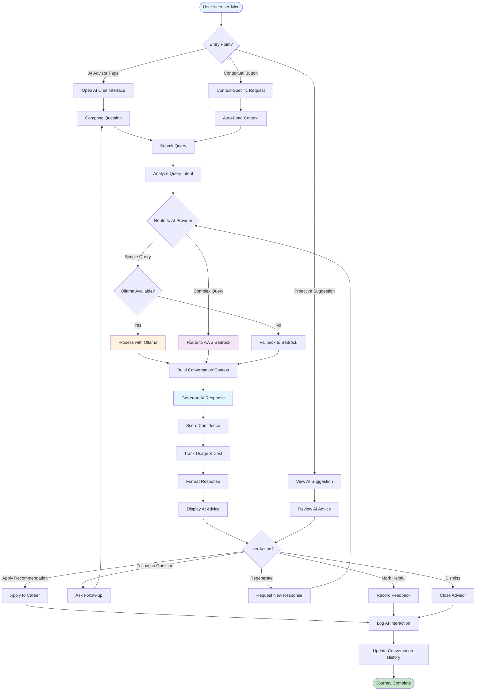
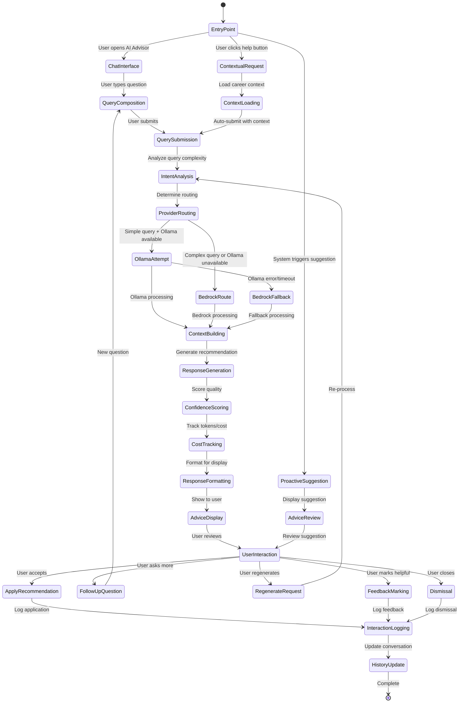
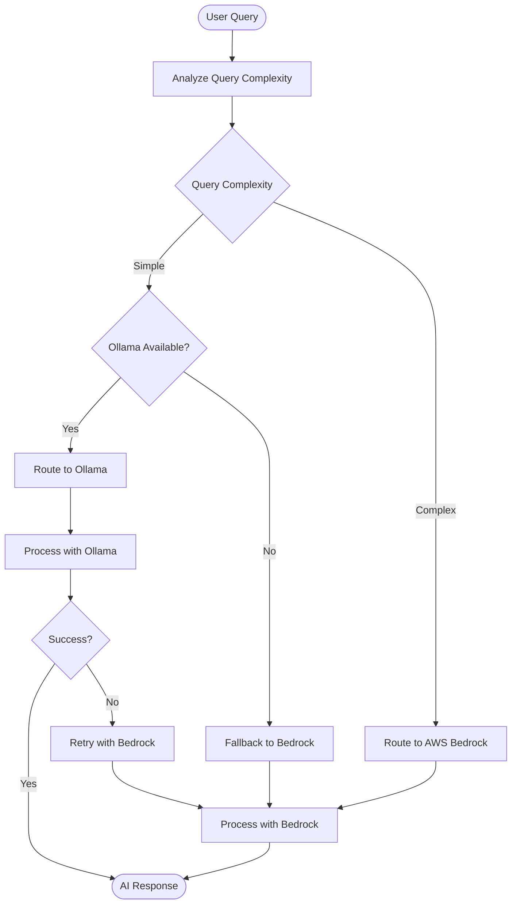
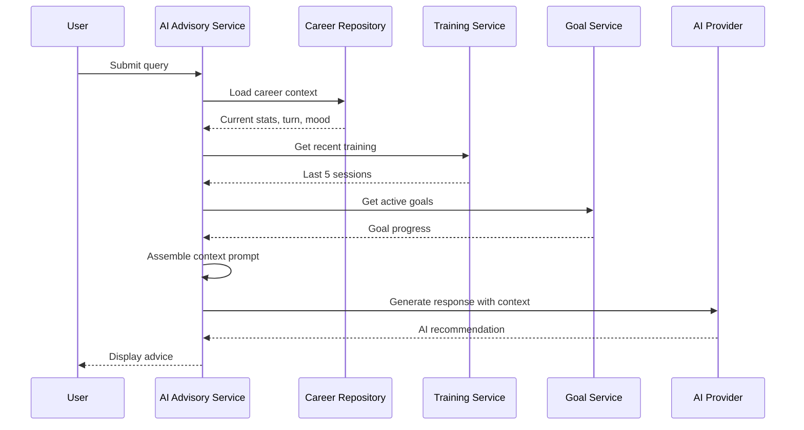
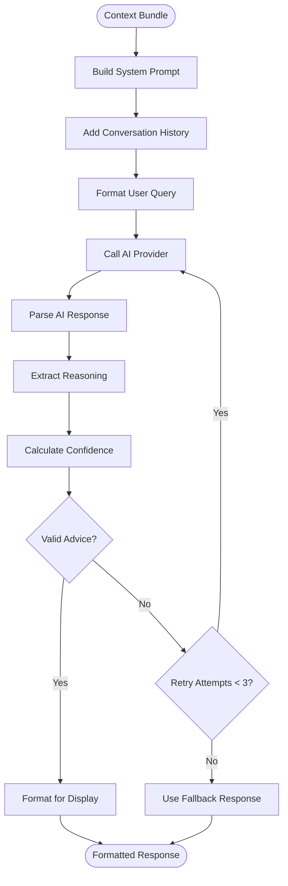
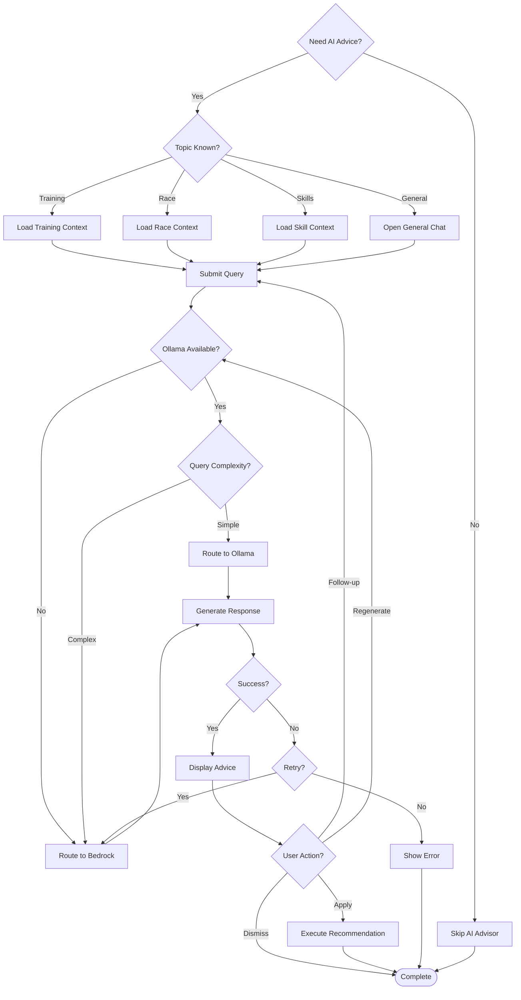
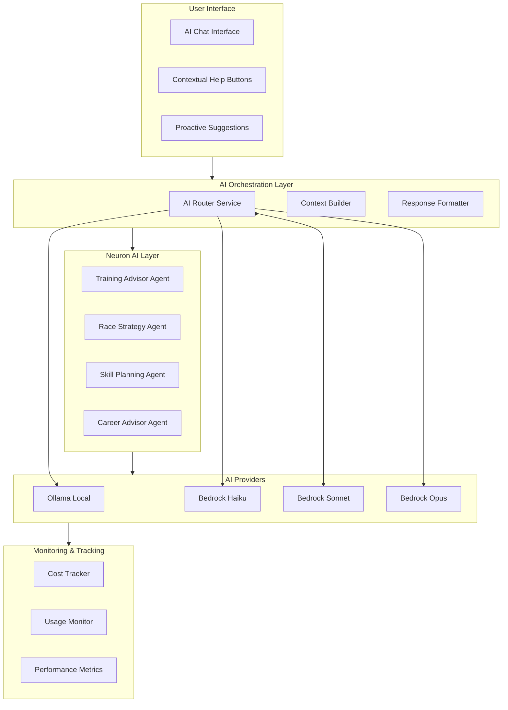
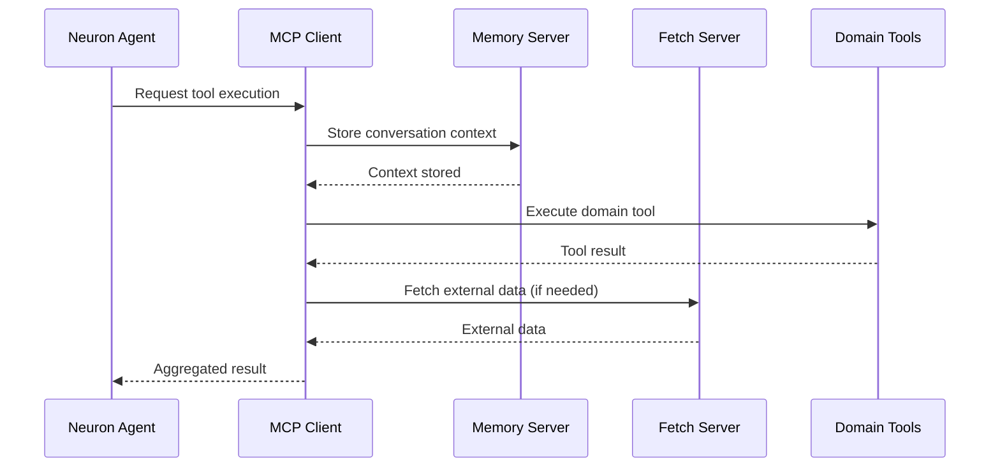
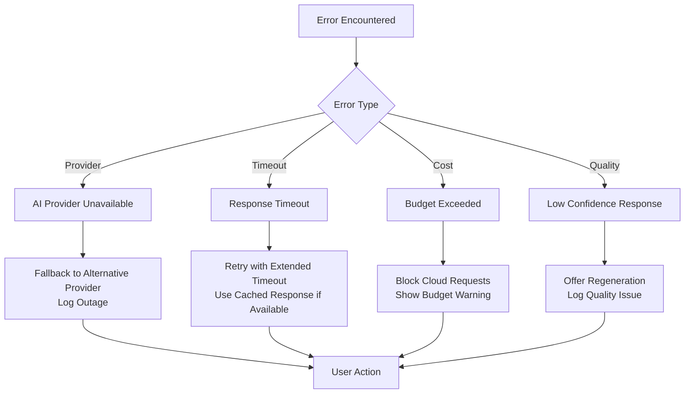
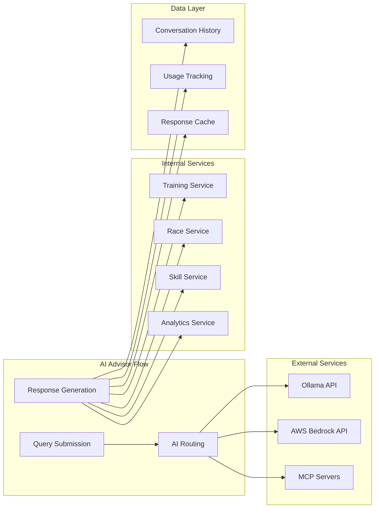

# UF-007: AI Advisor Journey

## Umamusume Pretty Derby Career Planner

**Document Version**: 2.3.0  
**Date**: February 22, 2026  
**Related Documents**: [PRD-006], [SPEC-006], [SRS], [BRS]

**Source Specifications**:

- `.kiro/specs/umamusume-career-planner-main/requirements.md` (AI Advisory Requirements)
- `.kiro/specs/umamusume-career-planner-main/design.md` (AI Advisor Journey)

**Related Artifacts**:

- PRD: [PRD-006](../prds/PRD-006_AI_Advisory.md)
- SPEC: [SPEC-006](../specs/SPEC-006_AI_Advisory_Technical.md)
- Flow: [FLOW-006](../flows/FLOW-006_AI_Advisory_System.md)
- Tech Flow: [TECH-FLOW-006](../tech-flow/TECH-FLOW-006_AI_Advisory_Flow.md)
- Wireframes: [WF-012](../wireframes/WF-012_AI_Advisor_Interface.md)
- Sequences: [SEQ-006](../sequences/SEQ-006_AI_Advice_Generation.md), [SEQ-009](../sequences/SEQ-009_User_Profile_Update.md)
- User Manual: [D17](../D17_SUM_Software_User_Manual.md#10-ai-advisory-system)

---

## Table of Contents

1. [Overview](#1-overview)
2. [Flow Diagram](#2-flow-diagram)
3. [User Journey Steps](#3-user-journey-steps)
4. [Decision Points](#4-decision-points)
5. [AI Architecture](#5-ai-architecture)
6. [Success Criteria](#6-success-criteria)
7. [Error Handling](#7-error-handling)
8. [Related Flows](#8-related-flows)

---

## 1. Overview

### 1.1 Purpose

The AI Advisor Journey guides users through intelligent, context-aware recommendations using a hybrid AI architecture combining local Ollama models and cloud-based AWS Bedrock Claude models. This flow enables users to receive strategic advice for training optimization, race preparation, skill acquisition, and overall career planning.

### 1.2 Scope

| Aspect | Description |
|--------|-------------|
| **Entry Point** | AI Advisor interface, contextual help buttons, proactive suggestions |
| **Exit Point** | Recommendation applied or dismissed, conversation saved |
| **Duration** | 30 seconds to 5 minutes per interaction |
| **User Type** | All users with active career runs |

### 1.3 Business Context

**Business Goal**: Provide intelligent, cost-effective AI-powered recommendations that enhance user decision-making while maintaining low operational costs through hybrid local/cloud architecture.

**Success Metrics**:

- AI recommendation acceptance rate: > 70%
- User satisfaction with AI advice: > 4.2/5
- Average response time: < 3 seconds
- Local AI usage rate: > 60% (cost optimization)
- Cloud fallback success rate: > 95%

---

## 2. Flow Diagram

### 2.1 High-Level Flow



### 2.2 Detailed State Diagram



---

## 3. User Journey Steps

### 3.1 Step 1: Entry Points

**Purpose**: Provide multiple access points for AI assistance based on user context.

#### 3.1.1 Entry Point Options

```
┌────────────────────────────────────────────────────────────┐
│  AI ADVISOR ACCESS POINTS                                  │
├────────────────────────────────────────────────────────────┤
│                                                            │
│  1. AI Advisor Page (Main Interface)                       │
│     Route: /ai/chat                                       │
│     Access: Navigation menu, quick actions                 │
│                                                            │
│  2. Contextual Help Buttons                                │
│     Training Screen: "Get AI Training Advice"              │
│     Race Prep: "Optimize Race Strategy"                    │
│     Skill Shop: "Recommend Skills for Goal"                │
│                                                            │
│  3. Proactive Suggestions                                  │
│     Dashboard Widget: Latest AI recommendation             │
│     Goal At Risk: Intervention advice                      │
│     New Race Week: Preparation checklist                   │
│                                                            │
│  4. Quick Actions                                          │
│     Floating Action Button: "Ask AI"                       │
│     Keyboard Shortcut: Alt + A                             │
│                                                            │
└────────────────────────────────────────────────────────────┘
```

**User Actions**:

| Entry Point | Trigger | Context Auto-Loaded |
|-------------|---------|---------------------|
| AI Advisor Page | User navigates to page | Active career run |
| Training Screen Button | Click "Get AI Advice" | Current training options |
| Race Prep Button | Click "Optimize Strategy" | Race requirements, readiness |
| Skill Shop Button | Click "Recommend Skills" | Current SP, goals |
| Dashboard Suggestion | View recommendation card | Latest career state |
| Goal At Risk Alert | Click intervention notice | Goal progress, gaps |

---

### 3.2 Step 2: AI Chat Interface

**Purpose**: Provide conversational interface for user queries with intelligent context awareness.

#### 3.2.1 Chat Interface Layout

```
┌────────────────────────────────────────────────────────────┐
│  AI Advisor                                           [×]   │
├────────────────────────────────────────────────────────────┤
│  Provider: 🤖 Ollama (Local) | Tokens: 0 | Cost: $0.00    │
│                                                            │
│  ┌────────────────────────────────────────────────────────┐│
│  │ CONVERSATION HISTORY                                   ││
│  ├────────────────────────────────────────────────────────┤│
│  │ 🤖 AI Advisor (2 minutes ago)                          ││
│  │ Based on your current stats and upcoming G1 race,      ││
│  │ I recommend focusing on Speed training for 3 turns.    ││
│  │ Your stamina is adequate, but speed needs +150.        ││
│  │                                                        ││
│  │ Confidence: 85% | Reasoning: Goal alignment           ││
│  │                                                        ││
│  │ [✓ Helpful] [Regenerate] [Apply Suggestion]           ││
│  ├────────────────────────────────────────────────────────┤│
│  │ 👤 You (Just now)                                      ││
│  │ What skills should I prioritize for this race?        ││
│  │                                                        ││
│  │ 🤖 AI Advisor (Thinking...)                            ││
│  │ ⏳ Generating recommendation...                        ││
│  └────────────────────────────────────────────────────────┘│
│                                                            │
│  Quick Topics:                                             │
│  [Training] [Race Strategy] [Skill Build] [Career Plan]   │
│                                                            │
│  ┌────────────────────────────────────────────────────────┐│
│  │ Ask AI Advisor...                                      ││
│  │ ┌──────────────────────────────────────────��───────┐  ││
│  │ │ Type your question here...                       │  ││
│  │ └──────────────────────────────────────────────────┘  ││
│  │                                         [Send] 📤     ││
│  └────────────────────────────────────────────────────────┘│
│                                                            │
│  Context Loaded: Special Week (Turn 45) | URA Championship│
└────────────────────────────────────────────────────────────┘
```

**Interface Components**:

| Component | Description |
|-----------|-------------|
| Provider Badge | Shows current AI provider (Ollama/Bedrock) |
| Usage Metrics | Token count and estimated cost |
| Conversation History | Previous messages with timestamps |
| Confidence Score | AI's certainty level (0-100%) |
| Action Buttons | Helpful, Regenerate, Apply Suggestion |
| Quick Topics | Pre-defined conversation starters |
| Input Field | Text area for user queries |
| Context Display | Current career run context |

---

### 3.3 Step 3: Query Routing and Processing

**Purpose**: Intelligently route queries to optimal AI provider based on complexity and availability.

#### 3.3.1 Routing Logic



**Complexity Scoring**:

| Factor | Weight | Criteria |
|--------|--------|----------|
| Query Length | 20% | > 100 words = complex |
| Keywords | 30% | Contains "optimize", "compare", "analyze" |
| Context Depth | 25% | Requires multi-turn history |
| Calculation Needs | 25% | Requires stat predictions |

**Routing Decision Table**:

| Complexity Score | Ollama Available | Route Decision |
|------------------|------------------|----------------|
| < 40 (Simple) | Yes | Ollama Local |
| < 40 (Simple) | No | Bedrock Haiku |
| 40-70 (Medium) | Yes | Ollama Local |
| 40-70 (Medium) | No | Bedrock Sonnet |
| > 70 (Complex) | Any | Bedrock Sonnet/Opus |

#### 3.3.2 Context Building

**Context Assembly Flow**:



**Context Components**:

| Component | Description | Example |
|-----------|-------------|---------|
| Character State | Current stats, energy, mood | "Speed 850, Energy 78%, Mood Good" |
| Recent History | Last 5 training sessions | "Turn 41-45: 3x Speed, 1x Stamina, 1x Rest" |
| Active Goals | Goal targets and progress | "Speed Goal: 1000 (85% complete)" |
| Upcoming Events | Next race, scenario milestones | "G1 Race in 8 turns" |
| Support Deck | Active support cards | "Tokai Teio (Speed), Kitasan (Stamina)" |
| Conversation History | Last 3 messages | Previous Q&A context |

---

### 3.4 Step 4: Response Generation

**Purpose**: Generate high-quality, contextual AI recommendations with confidence scoring.

#### 3.4.1 Response Generation Process



**System Prompt Structure**:

```
You are an expert advisor for Umamusume Pretty Derby career planning.

Character Context:
- Name: {character_name}
- Current Turn: {current_turn}/78 (Career spans ~70-78 turns across 3 years)
- Stats: Speed {speed}, Stamina {stamina}, Power {power}, Guts {guts}, Wit {wit}
- Stat Cap: 1200 (soft cap - stats above 1200 count for half value)
- Important Breakpoints: 901, 1200, 1600
- Energy: {energy}%, Mood: {mood}
- Aptitude Grades: G→F→E→D→C→B→A→S (S is maximum, no SS grade exists)
- Active Goals: {goals}

Recent History:
{last_5_training_sessions}

Upcoming Events:
{next_race_details}

User Query: {user_question}

Provide a clear, actionable recommendation with:
1. Main Recommendation (concise)
2. Reasoning (why this approach)
3. Expected Outcome (quantifiable when possible)
4. Risks/Considerations (if any)

Format your response in markdown.
```

#### 3.4.2 Confidence Scoring Algorithm

```php
// app/Services/AI/ConfidenceScorer.php
class ConfidenceScorer
{
    public function score(AIResponse $response, array $context): float
    {
        $scores = [
            'context_alignment' => $this->scoreContextAlignment($response, $context),
            'reasoning_quality' => $this->scoreReasoningQuality($response),
            'specificity' => $this->scoreSpecificity($response),
            'consistency' => $this->scoreConsistency($response, $context),
        ];
        
        return ($scores['context_alignment'] * 0.35)
            + ($scores['reasoning_quality'] * 0.30)
            + ($scores['specificity'] * 0.20)
            + ($scores['consistency'] * 0.15);
    }
    
    private function scoreContextAlignment(AIResponse $response, array $context): float
    {
        // Check if recommendation references context data
        $mentions = 0;
        
        if (str_contains($response->content, $context['character_name'])) $mentions++;
        if (preg_match('/turn\s*\d+/', $response->content)) $mentions++;
        if (preg_match('/speed|stamina|power|guts|wit/i', $response->content)) $mentions++;
        
        return min(100, ($mentions / 3) * 100);
    }
    
    private function scoreReasoningQuality(AIResponse $response): float
    {
        $hasReasoning = str_contains(strtolower($response->content), 'because') 
            || str_contains(strtolower($response->content), 'reasoning:');
        
        $hasOutcome = str_contains(strtolower($response->content), 'expected') 
            || preg_match('/\+\d+/', $response->content);
        
        return ($hasReasoning ? 50 : 0) + ($hasOutcome ? 50 : 0);
    }
}
```

**Confidence Ranges**:

| Range | Label | Indicator | Meaning |
|-------|-------|-----------|---------|
| 90-100% | Excellent | 🟢 | High certainty, strong evidence |
| 75-89% | Good | 🟡 | Solid recommendation |
| 60-74% | Fair | 🟠 | Moderate certainty |
| < 60% | Low | 🔴 | Consider regenerating |

---

### 3.5 Step 5: Response Display and User Actions

**Purpose**: Present AI recommendations with actionable options and feedback mechanisms.

#### 3.5.1 Recommendation Display

```
┌────────────────────────────────────────────────────────────┐
│  AI Recommendation                                         │
├────────────────────────────────────────────────────────────┤
│  Provider: 🤖 Ollama (Local) | Response Time: 1.2s         │
│  Confidence: 87% 🟡 Good                                   │
│                                                            │
│  ┌───────────────���────────────────────────────────────────┐│
│  │ 📋 RECOMMENDATION                                      ││
│  │                                                        ││
│  │ Focus on Speed training for the next 3 turns to close  ││
│  │ the gap for your upcoming G1 race.                     ││
│  │                                                        ││
│  │ 🧠 REASONING                                           ││
│  │ • Your current Speed (850) is 150 points below the     ││
│  │   recommended threshold (1000) for G1 competition.     ││
│  │ • With 8 turns remaining, averaging +50 Speed per      ││
│  │   turn will reach target by race day.                  ││
│  │ • Your stamina (780) is already adequate for Medium    ││
│  │   distance races.                                      ││
│  │                                                        ││
│  │ 📊 EXPECTED OUTCOME                                    ││
│  │ • Speed: 850 → 1000 (+150)                             ││
│  │ • Readiness Score: 72% → 88%                           ││
│  │ • Win Probability: 28% → 42%                           ││
│  │                                                        ││
│  │ ⚠️ CONSIDERATIONS                                      ││
│  │ • Monitor energy levels (currently 78%)                ││
│  │ • Consider 1 Rest turn if energy drops below 50%       ││
│  │ • Activate Speed-focused support cards for bonuses     ││
│  └────────────────────────────────────────────────────────┘│
│                                                            │
│  User Actions:                                             │
│  [✓ Mark Helpful] [🔄 Regenerate] [📋 Apply to Training]  │
│  [💬 Ask Follow-up] [❌ Dismiss]                           │
│                                                            │
│  Cost Tracking:                                            │
│  Tokens Used: 0 (Local processing) | Estimated Cost: $0.00│
└────────────────────────────────────────────────────────────┘
```

**Action Handlers**:

| Action | Behavior | Next State |
|--------|----------|------------|
| Mark Helpful | Record positive feedback, update AI learning | Log interaction |
| Regenerate | Re-process query with same context | Generate new response |
| Apply to Training | Auto-select recommended training option | Training screen |
| Ask Follow-up | Open input for new question with context | Query composition |
| Dismiss | Close recommendation, log dismissal | End interaction |

---

### 3.6 Step 6: Cost Tracking and Usage Monitoring

**Purpose**: Track AI usage, costs, and performance metrics for optimization.

#### 3.6.1 Cost Tracking Dashboard

```
┌────────────────────────────────────────────────────────────┐
│  AI Usage & Cost Tracking                             [≡]   │
├────────────────────────────────────────────────────────────┤
│  Period: Last 30 Days                                      │
│                                                            │
│  ┌────────────────────────────────────────────────────────┐│
│  │ PROVIDER BREAKDOWN                                     ││
│  ├────────────────────────────────────────────────────────┤│
│  │ Ollama (Local)                                         ││
│  │ Requests: 1,247 (68%)                                  ││
│  │ Tokens: 0                                              ││
│  │ Cost: $0.00                                            ││
│  │ Avg Response Time: 0.8s                                ││
│  │                                                        ││
│  │ AWS Bedrock (Cloud)                                    ││
│  │ Requests: 583 (32%)                                    ││
│  │ Tokens: 2.4M input, 1.8M output                        ││
│  │ Cost: $9.20                                            ││
│  │ Avg Response Time: 2.1s                                ││
│  └────────────────────────────────────────────────────────┘│
│                                                            │
│  Total Cost: $9.20 | Monthly Budget: $50.00 (18% used)    │
│                                                            │
│  ┌────────��───────────────────────────────────────────────┐│
│  │ PERFORMANCE METRICS                                    ││
│  ├────────────────────────────────────────────────────────┤│
│  │ Success Rate: 97.3%                                    ││
│  │ Acceptance Rate: 72.5%                                 ││
│  │ Regeneration Rate: 8.2%                                ││
│  │ Avg Confidence: 84%                                    ││
│  └────────────────────────────────────────────────────────┘│
└────────────────────────────────────────────────────────────┘
```

**Cost Calculation Service**:

```php
// app/Services/AI/CostTracker.php
class CostTracker
{
    private const BEDROCK_PRICING = [
        'claude-3.5-haiku' => ['input' => 0.00025, 'output' => 0.00125],
        'claude-3.5-sonnet' => ['input' => 0.003, 'output' => 0.015],
        'claude-opus' => ['input' => 0.005, 'output' => 0.025],
    ];
    
    public function trackUsage(
        string $provider,
        string $model,
        int $inputTokens,
        int $outputTokens
    ): void {
        $cost = 0;
        
        if ($provider === 'bedrock') {
            $pricing = self::BEDROCK_PRICING[$model] ?? self::BEDROCK_PRICING['claude-3.5-sonnet'];
            $cost = ($inputTokens / 1_000_000 * $pricing['input'])
                + ($outputTokens / 1_000_000 * $pricing['output']);
        }
        
        AIUsage::create([
            'user_id' => auth()->id(),
            'provider' => $provider,
            'model' => $model,
            'input_tokens' => $inputTokens,
            'output_tokens' => $outputTokens,
            'cost_usd' => $cost,
            'created_at' => now(),
        ]);
        
        event(new AIUsageRecorded($provider, $cost));
    }
}
```

---

## 4. Decision Points

### 4.1 Decision Tree



### 4.2 Key Decision Factors

| Factor | Impact on Decision | Weight |
|--------|-------------------|--------|
| **Query Complexity** | Determines local vs. cloud routing | Critical |
| **Ollama Availability** | Forces cloud fallback if unavailable | Critical |
| **User Budget** | Prefers local to minimize costs | High |
| **Response Quality** | May trigger regeneration | Medium |
| **Context Depth** | Affects prompt size and model selection | Medium |
| **Historical Accuracy** | Influences confidence in recommendation | Low |

---

## 5. AI Architecture

### 5.1 Hybrid AI Architecture



### 5.2 Neuron AI Agents

**Agent Definitions**:

| Agent | Purpose | System Prompt Summary |
|-------|---------|----------------------|
| Training Advisor | Training optimization | Expert in stat gain prediction, support card synergy |
| Race Strategy | Race preparation | Expert in readiness scoring, strategy optimization |
| Skill Planning | Skill acquisition | Expert in SP budgeting, skill evolution paths |
| Career Advisor | Long-term planning | Expert in goal setting, milestone planning |

**Agent Tool Integration**:

```php
// app/Neuron/Agents/TrainingAdvisorAgent.php
class TrainingAdvisorAgent extends Agent
{
    protected string $name = 'Training Advisor';
    
    protected array $tools = [
        GetCharacterStatsTool::class,
        GetTrainingPredictionsTool::class,
        GetSupportDeckTool::class,
        GetGoalProgressTool::class,
    ];
    
    public function systemPrompt(): string
    {
        return <<<PROMPT
You are an expert advisor for Umamusume Pretty Derby training optimization.

Your responsibilities:
- Analyze current character stats and training options
- Recommend optimal training facility selection
- Consider support card bonuses and synergies
- Account for energy, mood, and condition effects
- Align recommendations with user-defined goals

Provide clear, actionable advice with reasoning.
PROMPT;
    }
}
```

### 5.3 MCP Integration

**MCP Server Usage in AI**:



**MCP Tools for AI**:

| Tool | MCP Server | Purpose |
|------|------------|---------|
| `get_character_stats` | Memory | Retrieve current character state |
| `get_training_predictions` | Memory | Access cached predictions |
| `fetch_skill_data` | Fetch | Query external skill database |
| `store_conversation` | Memory | Persist conversation history |

---

## 6. Success Criteria

### 6.1 Functional Success

- ✅ AI responses generated within 3 seconds (p95)
- ✅ Ollama local routing > 60% of requests
- ✅ Cloud fallback success rate > 95%
- ✅ Conversation history persisted correctly
- ✅ Cost tracking accurate within 1% of actual
- ✅ Confidence scoring correlates with user acceptance

### 6.2 User Experience Success

| Metric | Target | Measurement |
|--------|--------|-------------|
| Recommendation acceptance rate | > 70% | User action tracking |
| User satisfaction | > 4.2/5 | Post-interaction surveys |
| Regeneration rate | < 15% | Analytics tracking |
| Follow-up question rate | > 30% | Conversation depth |
| Average response time | < 3 seconds | APM monitoring |

### 6.3 Technical Success

```php
// tests/Feature/AIAdvisorFlowTest.php
test('ai advisor flow completes successfully', function () {
    $user = User::factory()->create();
    $career = CareerRun::factory()->create(['user_id' => $user->id]);
    
    actingAs($user)
        ->post('/ai/advice', [
            'query' => 'What training should I do next?',
            'career_id' => $career->id,
            'topic' => 'training',
        ])
        ->assertOk()
        ->assertJsonStructure([
            'recommendation',
            'reasoning',
            'confidence',
            'provider',
            'cost',
        ]);
    
    expect(AIConversation::where('user_id', $user->id)->count())->toBe(1)
        ->and(AIUsage::where('user_id', $user->id)->count())->toBe(1);
});

test('ai routing prefers local ollama for simple queries', function () {
    $service = app(AIAdvisoryService::class);
    
    $simpleQuery = 'Should I do speed training?';
    $routing = $service->determineRouting($simpleQuery);
    
    expect($routing->provider)->toBe('ollama')
        ->and($routing->complexity)->toBeLessThan(40);
});

test('ai fallback to bedrock when ollama unavailable', function () {
    Config::set('ai.providers.ollama.enabled', false);
    
    $service = app(AIAdvisoryService::class);
    $response = $service->getAdvice($career, 'training', 'What training next?');
    
    expect($response->provider)->toBe('bedrock');
});
```

---

## 7. Error Handling

### 7.1 Error Scenarios



### 7.2 Error Messages

| Error Code | Trigger | Message | User Action |
|------------|---------|---------|-------------|
| `AI-001` | Ollama unavailable | "Local AI unavailable. Using cloud AI." | Informational |
| `AI-002` | Bedrock timeout | "AI response delayed. Please wait or retry." | Retry or cancel |
| `AI-003` | Budget exceeded | "Monthly AI budget reached. Using cached recommendations." | Review budget |
| `AI-004` | Low confidence | "AI confidence is low (52%). Consider regenerating." | Regenerate or accept |
| `AI-005` | Invalid context | "Unable to load career context. Please refresh." | Refresh page |

### 7.3 Recovery Strategies

| Scenario | Primary Recovery | Fallback Recovery | Ultimate Fallback |
|----------|------------------|-------------------|-------------------|
| Ollama down | Fallback to Bedrock | Use cached responses | Show error message |
| Bedrock timeout | Retry with exponential backoff | Use simplified prompt | Return generic advice |
| Budget exceeded | Restrict to local only | Use cached advice | Show informational message |
| Low confidence | Regenerate with refined prompt | Offer manual input | Skip AI advice |

---

## 8. Related Flows

### 8.1 Downstream Flows

After AI interaction, users may proceed to:

| Flow | Document Reference | Entry Condition |
|------|-------------------|-----------------|
| Training Day Flow | [UF-003](UF-003_Training_Day_Flow.md) | Applied training recommendation |
| Race Preparation | [UF-004](UF-004_Race_Day_Flow.md) | Applied race strategy |
| Skill Acquisition | [UF-005](UF-005_Skill_Management_Flow.md) | Applied skill recommendation |
| Career Planning | Dashboard | Applied career advice |

### 8.2 Alternative Entry Points

| Entry Point | Scenario | Flow Adjustment |
|-------------|----------|-----------------|
| Dashboard Widget | Proactive suggestion displayed | Skip query composition |
| Contextual Help | User clicks help on specific screen | Pre-load screen context |
| Goal Alert | Intervention needed | Pre-load goal gap analysis |
| Keyboard Shortcut | Power user quick access | Open full chat interface |

### 8.3 Integration Points



---

## Document Control

| Version | Date | Author | Changes |
|---------|------|--------|---------|
| 2.3.0 | 2026-02-22 | Development Team | Updated AI Advisor route from `/ai-advisor` to `/ai/chat` to match actual codebase routes; updated version and dates |
| 2.2.0 | 2026-01-28 | Development Team | Updated with verified game mechanics from Global English Server: stat soft cap (1200 with diminishing returns above), important breakpoints (901, 1200, 1600), aptitude grade scale (G→S, no SS), career structure (~70-78 turns) |
| 2.1.0 | 2026-01-24 | Development Team | Complete rewrite aligned with v2.0.0 architecture; added hybrid AI routing, Neuron agents, MCP integration, cost tracking, comprehensive error handling and testing criteria |
| 2.0.0 | 2026-01-14 | Development Team | Prior revision with basic flow |
| 1.0.0 | 2026-01-03 | Development Team | Initial draft |

---

## References

- [Software Development Plan (SDP)](../D01_SDP_Software_Development_Plan.md)
- [Business Requirements Specifications (BRS)](../D02_BRS_Business_Requirements_Specifications.md)
- [Software Requirements Specifications (SRS)](../D03_SRS_Software_Requirement_Specifications.md)
- [Software User Manual (SUM)](../D17_SUM_Software_User_Manual.md)
- [SPEC-006: AI Advisory Technical](../specs/SPEC-006_AI_Advisory_Technical.md)
- [FLOW-006: AI Advisory System](../flows/FLOW-006_AI_Advisory_System.md)
- [TECH-FLOW-006: AI Advisory Flow](../tech-flow/TECH-FLOW-006_AI_Advisory_Flow.md)
- [WF-012: AI Advisor Interface](../wireframes/WF-012_AI_Advisor_Interface.md)
- [SEQ-006: AI Advice Generation](../sequences/SEQ-006_AI_Advice_Generation.md)

---

*This user flow reflects the current AI advisory system implementation as of version 2.3.0. For the latest updates, refer to the online documentation.*
