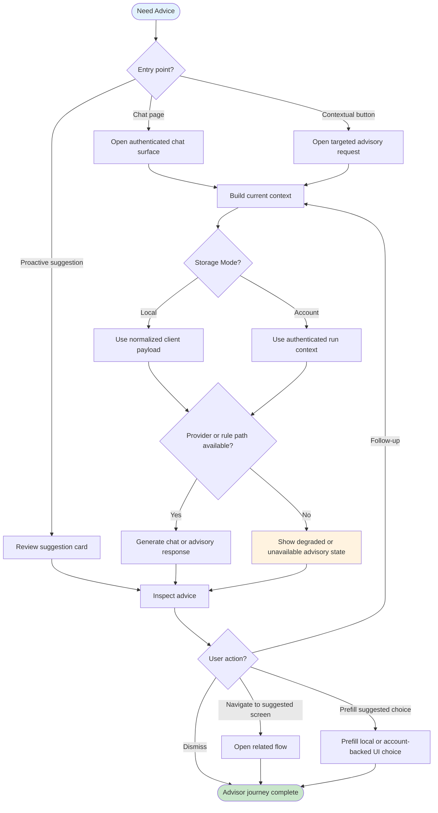
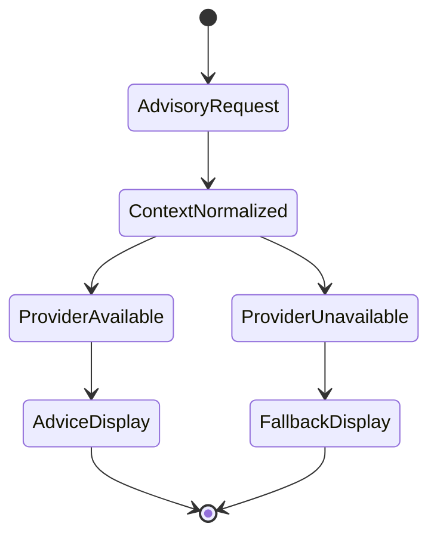

# UF-007: AI Advisor Journey

## Umamusume Pretty Derby Career Planner

**Document Version**: 2.3.0
**Date**: March 8, 2026
**Related Documents**: [PRD-006], [SPEC-006], [SRS], [BRS]

**Source Specifications**:

- `.kiro/specs/umamusume-career-planner-main/requirements.md` (AI Advisory Requirements)
- `.kiro/specs/umamusume-career-planner-main/design.md` (AI Advisor Journey)

**Related Artifacts**:

- PRD: [PRD-006](../02-prds/PRD-006_AI_Advisory.md)
- SPEC: [SPEC-006](../02-specs/SPEC-006_AI_Advisory_Technical.md)
- Flow: [FLOW-006](../01-flows/FLOW-006_AI_Advisory_System.md)
- Tech Flow: [TECH-FLOW-006](../01-tech-flow/TECH-FLOW-006_AI_Advisory_Flow.md)
- Wireframes: [WF-012](../01-wireframes/WF-012_AI_Advisor_Interface.md)
- Sequences: [SEQ-006](../01-sequences/SEQ-006_AI_Advice_Generation.md),
[SEQ-017](../01-sequences/SEQ-017_Storage_Mode_Transition.md)
- User Manual: [D17](../D17_SUM_Software_User_Manual.md#10-ai-advisory-system)

---

## Table of Contents

1. [Overview](#1-overview)
2. [Flow Diagram](#2-flow-diagram)
3. [User Journey Steps](#3-user-journey-steps)
4. [Decision Points](#4-decision-points)
5. [Success Criteria](#5-success-criteria)
6. [Error Handling](#6-error-handling)
7. [Related Flows](#7-related-flows)

---

## 1. Overview

### 1.1 Purpose

The AI Advisor Journey describes how users ask questions, review proactive suggestions, inspect
advice, and decide whether to act on it. It separates authenticated chat from advisory API-style
recommendations and avoids presenting provider routing as a fixed product contract.

### 1.2 Scope

| Aspect | Description |
| --- | --- |
| **Entry Point** | Chat page, contextual advisory button, or proactive suggestion surface |
| **Exit Point** | Advice reviewed, follow-up asked, recommendation dismissed, or user navigates to the suggested next step |
| **Duration** | 30 seconds to several minutes depending on follow-up depth |
| **User Type** | Users seeking guidance in either authenticated or local advisory contexts |

### 1.3 Storage Mode Support

- `StorageMode::ACCOUNT`: implemented through authenticated chat and DB-backed run context where available.
- `StorageMode::LOCAL`: advisory can operate on normalized client payloads without requiring DB-
backed character context.

### 1.4 Navigation Surface

This flow uses conceptual labels such as AI Chat, Suggestion Card, and Advisory Panel for the user
journey. Where implementation-backed navigation is relevant, the current surface includes:

- `/ai/chat`
- `/ai/dashboard`
- `/api/ai/message`
- `/api/advisory/training/recommendations`
- `/api/advisory/skills/advice`
- `/api/advisory/race/strategy`

### 1.5 Provider Note

AI provider routing is configuration-driven and environment-dependent. User-visible routing examples
are illustrative and must not be treated as fixed runtime behavior.

### 1.6 Business Context

**Business Goal**: Deliver useful guidance without obscuring the distinction between authenticated
chat, payload-driven advisory, and optional provider fallback behavior.

**Success Metrics**:

- Users can tell when advice is contextual chat versus targeted advisory.
- Local-mode users can still receive advisory guidance without DB assumptions.
- Unavailable providers degrade the experience gracefully rather than blocking the entire advisory journey.

---

## 2. Flow Diagram

### 2.1 High-Level Flow

### 2.2 Degraded Provider Branch

---

## 3. User Journey Steps

### 3.1 Step 1: Enter the Advisory Surface

**Purpose**: Let the user start from chat, a focused advisory action, or a proactive suggestion.

**Entry points**:

- authenticated chat page
- training, skill, or race advisory buttons
- proactive dashboard or warning suggestion surfaces

### 3.2 Step 2: Assemble Context

**Purpose**: Build only the context that matches the current storage boundary.

**Account-mode context** can include authenticated persisted run state.

**Local-mode context** can include normalized advisory payloads built from browser-local state
without requiring DB identifiers.

### 3.3 Step 3: Generate or Degrade Gracefully

**Purpose**: Keep the user journey usable even when a preferred provider or service path is unavailable.

**Possible outcomes**:

- full advisory or chat response
- lighter or rule-based response
- unavailable notice with recoverable next steps

### 3.4 Step 4: Act on Advice

**Purpose**: Clarify what “apply” means in a user-flow document.

**Allowed meanings in this flow**:

| Action | Meaning |
| --- | --- |
| Navigate to suggested screen | Open training, race, skill, or deck flow |
| Prefill suggested choice | Pre-populate a choice where the UI supports it |
| Ask follow-up | Continue the advisory conversation |
| Dismiss | End the interaction without mutating state |

This flow should not imply that every recommendation automatically commits a server-side mutation.

---

## 4. Decision Points

### 4.1 Is This Chat or Targeted Advisory?

Chat and advisory should be described as related but distinct surfaces.

### 4.2 What Context Exists?

Local advisory can rely on normalized payloads. Account chat or advisory can rely on authenticated persisted context.

### 4.3 Is a Provider Available?

If the preferred provider or route is unavailable, the user should see degraded guidance or a
recoverable unavailable state.

---

## 5. Success Criteria

- The user can distinguish chat from targeted advisory.
- Provider behavior is not documented as a hardcoded routing promise.
- Local-mode guidance does not imply DB-backed prerequisites.
- “Apply” behavior is described as navigation or prefill unless a real mutation boundary is explicitly known.

---

## 6. Error Handling

| Scenario | User-facing behavior |
| --- | --- |
| No provider available | Show degraded or unavailable advisory state with retry guidance |
| Local advisory without DB context | Continue with normalized client payload where supported |
| Authenticated chat context unavailable | Fall back to reduced context or prompt the user to choose context explicitly |
| Suggested action cannot be applied directly | Navigate to the relevant screen instead of implying automatic mutation |

---

## 7. Related Flows

- [UF-003_Training_Day_Flow.md](UF-003_Training_Day_Flow.md)
- [UF-004_Race_Day_Flow.md](UF-004_Race_Day_Flow.md)
- [UF-005_Skill_Management_Flow.md](UF-005_Skill_Management_Flow.md)
- [UF-006_Support_Deck_Building_Flow.md](UF-006_Support_Deck_Building_Flow.md)
- [TECH-FLOW-006](../01-tech-flow/TECH-FLOW-006_AI_Advisory_Flow.md)
- [SEQ-006](../01-sequences/SEQ-006_AI_Advice_Generation.md)
- [SEQ-017](../01-sequences/SEQ-017_Storage_Mode_Transition.md)
