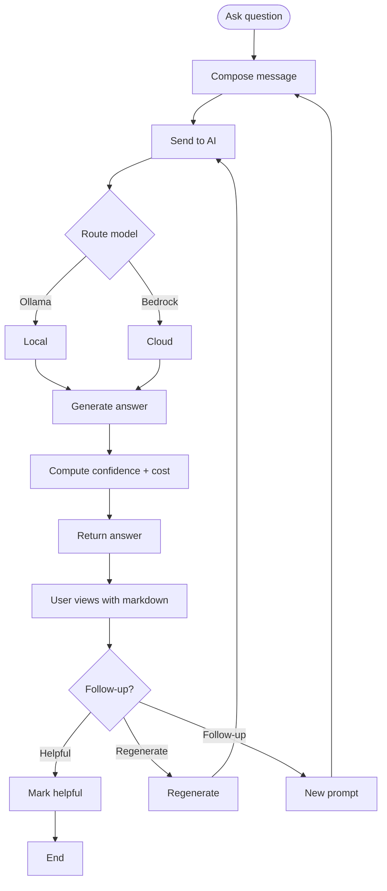

# UF-007: AI Advisor Journey

## Umamusume Pretty Derby Career Planner

**Document Version**: 1.0  
**Date**: January 14, 2026  
**Related Documents**: [PRD-006], [SPEC-006], [FLOW-006], [SEQ-009], [SEQ-015], [WF-012]

**Source Specs**:

- `.kiro/specs/umamusume-career-planner-main/requirements.md` (AI Advisory Requirements)
- `.kiro/specs/umamusume-career-planner-main/design.md` (AI Advisor Journey)

**Related Artifacts**:

- PRD: [PRD-006](../prds/PRD-006_AI_Advisory.md)
- SPEC: [SPEC-006](../specs/SPEC-006_AI_Advisory_Technical.md)
- Flow: [FLOW-006](../flows/FLOW-006_AI_Advisory_System.md)
- Tech Flow: [TECH-FLOW-006](../tech-flow/TECH-FLOW-006_AI_Advisory_Flow.md)
- Wireframes: [WF-012](../wireframes/WF-012_AI_Advisor_Interface.md)
- Sequences: [SEQ-006](../sequences/SEQ-006_AI_Advice_Generation.md), [SEQ-009](../sequences/SEQ-009_User_Profile_Update.md), [SEQ-015](../sequences/SEQ-015_Data_Migration_Snapshot_to_Live.md)

---

## Flow Diagram

## Notes

- Context assembled from run data before routing.  
- Budget meter and model badge shown with response.  
- Conversation stored; reconnect replays recent messages.
