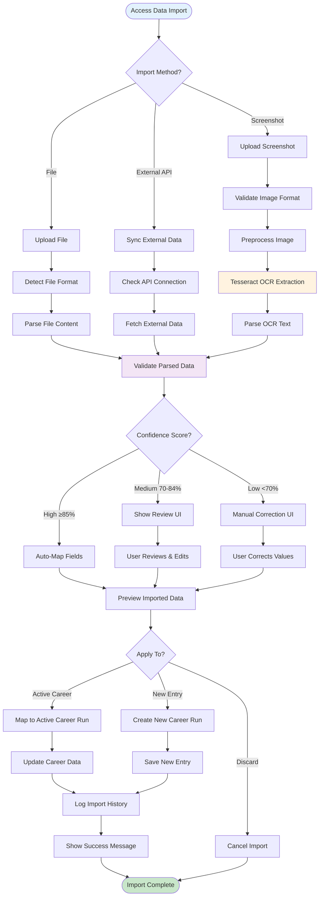
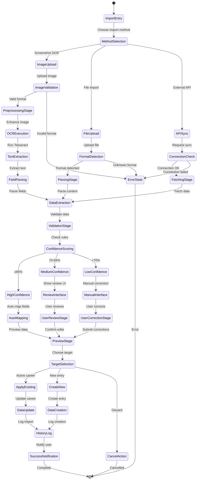
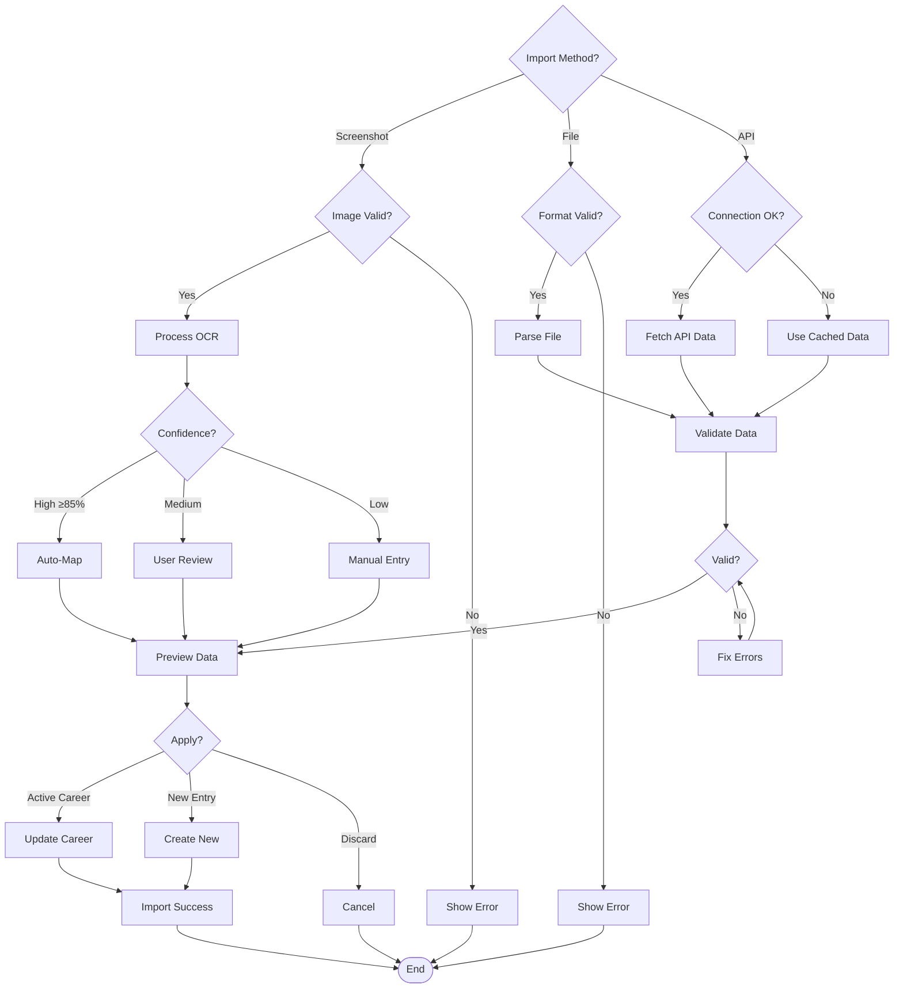
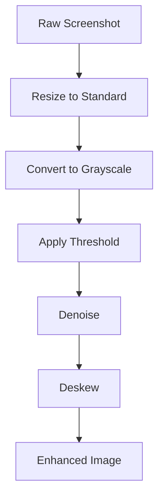
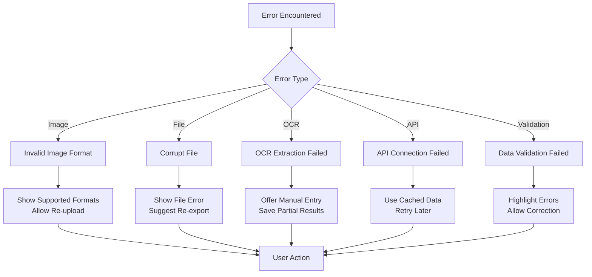
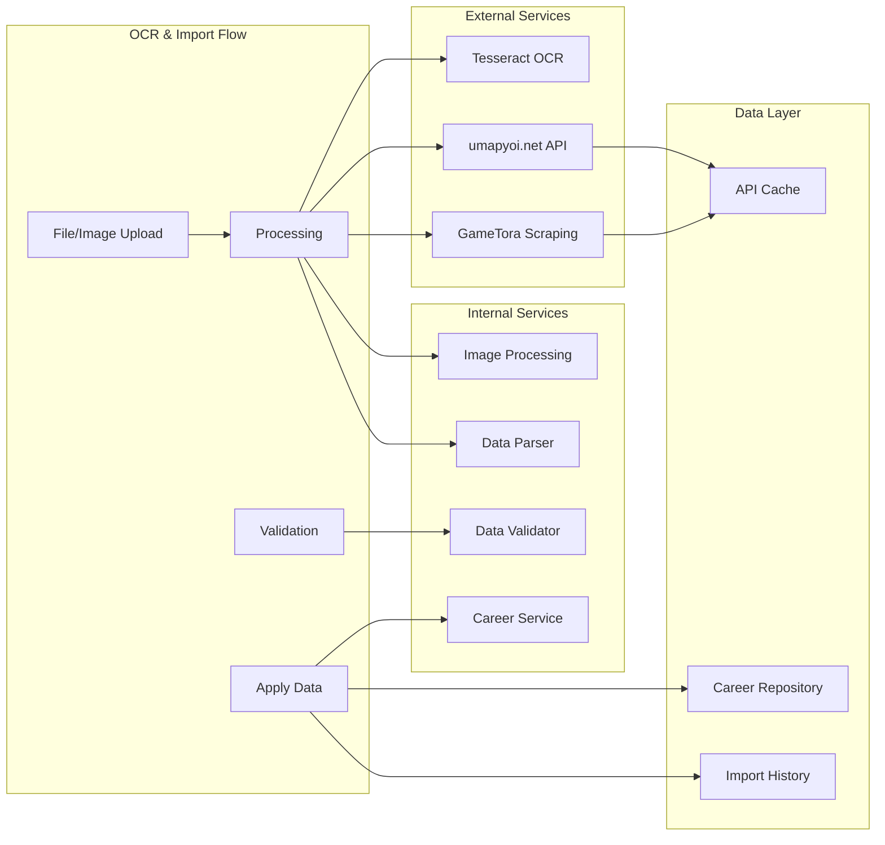

# UF-008: OCR and Data Import Flow

## Umamusume Pretty Derby Career Planner

**Document Version**: 2.3.0  
**Date**: February 22, 2026  
**Related Documents**: [PRD-007], [SPEC-007], [SRS], [BRS]

**Source Specifications**:

- `.kiro/specs/umamusume-career-planner-main/requirements.md` (External Integration Requirements)
- `.kiro/specs/umamusume-career-planner-main/design.md` (OCR and Data Import Flow)

**Related Artifacts**:

- PRD: [PRD-007](../prds/PRD-007_External_Integration.md)
- SPEC: [SPEC-007](../specs/SPEC-007_External_Integration_Technical.md)
- Flow: [FLOW-007](../flows/FLOW-007_External_Integration_System.md)
- Tech Flow: [TECH-FLOW-007](../tech-flow/TECH-FLOW-007_External_Integration_Flow.md)
- Wireframes: [WF-001](../wireframes/WF-001_Dashboard_Overview.md)
- Sequences: [SEQ-007](../sequences/SEQ-007_External_Data_Sync.md), [SEQ-015](../sequences/SEQ-015_Data_Migration_Snapshot_to_Live.md)
- User Manual: [D17](../D17_SUM_Software_User_Manual.md#11-data-import--export)

---

## Table of Contents

1. [Overview](#1-overview)
2. [Flow Diagram](#2-flow-diagram)
3. [User Journey Steps](#3-user-journey-steps)
4. [Decision Points](#4-decision-points)
5. [OCR Processing Pipeline](#5-ocr-processing-pipeline)
6. [Success Criteria](#6-success-criteria)
7. [Error Handling](#7-error-handling)
8. [Related Flows](#8-related-flows)

---

## 1. Overview

### 1.1 Purpose

The OCR and Data Import Flow enables users to efficiently import character data and career information through multiple channels: screenshot OCR processing, file uploads (JSON/CSV/Excel), and external API synchronization. This flow combines automated data extraction with intelligent validation and user review mechanisms.

### 1.2 Scope

| Aspect | Description |
|--------|-------------|
| **Entry Point** | Data import interface, screenshot upload, file import wizard |
| **Exit Point** | Data validated and imported to active career or saved as new entry |
| **Duration** | 2-5 minutes for OCR processing; 1-3 minutes for file import |
| **User Type** | All users with active career runs or creating new entries |

### 1.3 Business Context

**Business Goal**: Reduce manual data entry effort by 80% through intelligent OCR and automated parsing, while maintaining data accuracy through validation and user review.

**Success Metrics**:

- OCR accuracy rate: > 85%
- File import success rate: > 95%
- User review completion rate: > 90%
- Average import time reduction: > 70% vs manual entry

---

## 2. Flow Diagram

### 2.1 High-Level Flow



### 2.2 Detailed State Diagram



---

## 3. User Journey Steps

### 3.1 Step 1: Import Method Selection

**Purpose**: Choose the appropriate data import method based on data source.

#### 3.1.1 Import Options Interface

```
┌────────────────────────────────────────────────────────────┐
│  Data Import                                          [≡]   │
├────────────────────────────────────────────────────────────┤
│  Choose Import Method                                      │
│                                                            │
│  ┌────────────────────────────────────────────────────────┐│
│  │ 📷 Screenshot OCR                                      ││
│  │ Upload game screenshots for automatic data extraction  ││
│  │                                                        ││
│  │ Supported Data:                                        ││
│  │ • Character stats (Speed, Stamina, Power, Guts, Wit)  ││
│  │ • Skill inventory and levels                          ││
│  │ • Support card bonds                                  ││
│  │ • Race results                                        ││
│  │                                                        ││
│  │ Accuracy: ~85-90% | Processing: ~10-15 seconds        ││
│  │                                    [UPLOAD SCREENSHOT] ││
│  ├────────────────────────────────────────────────────────┤│
│  │ 📁 File Import                                         ││
│  │ Import from JSON, CSV, or Excel files                 ││
│  │                                                        ││
│  │ Supported Formats:                                     ││
│  │ • JSON (.json) - Full data backup                     ││
│  │ • CSV (.csv) - Tabular data                           ││
│  │ • Excel (.xlsx) - Spreadsheet data                    ││
│  │                                                        ││
│  │ Max Size: 10MB | Auto-format detection                ││
│  │                                        [UPLOAD FILE]   ││
│  ├────────────────────────────────────────────────────────┤│
│  │ 🔄 External API Sync                                   ││
│  │ Sync data from umapyoi.net or GameTora               ││
│  │                                                        ││
│  │ Data Sources:                                          ││
│  │ • Character database (50+ trainees)                   ││
│  │ • Skill catalog (500+ skills)                         ││
│  │ • Support card meta tiers                             ││
│  │ • Race requirements                                   ││
│  │                                                        ││
│  │ Last Sync: 2 hours ago | Status: ✓ Active            ││
│  │                                      [SYNC NOW]       ││
│  └────────────────────────────────────────────────────────┘│
│                                                            │
│                                              [CANCEL]      │
└────────────────────────────────────────────────────────────┘
```

**User Actions**:

| Action | Description | Next State |
|--------|-------------|------------|
| Upload Screenshot | Select image file from device | Image validation |
| Upload File | Select JSON/CSV/XLSX file | Format detection |
| Sync External API | Trigger API data fetch | Connection check |
| Cancel | Abort import process | Exit flow |

---

### 3.2 Step 2: OCR Screenshot Processing

**Purpose**: Extract game data from uploaded screenshots using Tesseract OCR.

#### 3.2.1 Screenshot Upload Interface

```
┌────────────────────────────────────────────────────────────┐
│  Upload Screenshot                                    [×]   │
├────────────────────────────────────────────────────────────┤
│  Select a screenshot from your game to extract data        │
│                                                            │
│  ┌────────────────────────────────────────────────────────┐│
│  │                                                        ││
│  │                  [Drop image here]                     ││
│  │                       or                               ││
│  │                  [Browse Files]                        ││
│  │                                                        ││
│  │  Supported: PNG, JPG, JPEG                            ││
│  │  Max Size: 10MB                                       ││
│  │  Recommended: Clear, high-resolution screenshots      ││
│  │                                                        ││
│  └────────────────────────────────────────────────────────┘│
│                                                            │
│  📋 Tips for Best Results:                                 │
│  • Use high-resolution screenshots (1920x1080+)           │
│  • Ensure text is clearly visible                         │
│  • Avoid blurry or heavily compressed images              │
│  • Capture full stat screens when possible                │
│                                                            │
│                                    [CANCEL] [PROCESS]      │
└────────────────────────────────────────────────────────────┘
```

#### 3.2.2 OCR Processing Status

```
┌────────────────────────────────────────────────────────────┐
│  Processing Screenshot...                             [≡]   │
├────────────────────────────────────────────────────────────┤
│  ┌───────────────────────��────────────────────────────────┐│
│  │ Preview:                                               ││
│  │ ┌──────────────────────────────────────────────────┐  ││
│  │ │                                                  │  ││
│  │ │         [Screenshot Preview Image]               │  ││
│  │ │                                                  │  ││
│  │ └──────────────────────────────────────────────────┘  ││
│  └────────────────────────────────────────────────────────┘│
│                                                            │
│  Processing Steps:                                         │
│  ✓ Image uploaded                                          │
│  ✓ Image validated (PNG, 2.4MB)                           │
│  ✓ Preprocessing (resize, grayscale, threshold)           │
│  ⏳ OCR text extraction (Tesseract)...                     │
│  ⏹ Field parsing                                           │
│  ⏹ Data validation                                         │
│                                                            │
│  Progress: ████████░░░░░░░░░░ 40%                          │
│                                                            │
│                                              [CANCEL]      │
└────────────────────────────────────────────────────────────┘
```

---

### 3.3 Step 3: Data Validation and Review

**Purpose**: Validate extracted data and allow user review for accuracy.

#### 3.3.1 Validation Results Interface

```
┌────────────────────────────────────────────────────────────┐
│  Review Extracted Data                                [≡]   │
├────────────────────────────────────────────────────────────┤
│  Extraction Confidence: 87% 🟢 High                        │
│  Source: screenshot_20260124_103045.png                    │
│                                                            │
│  ┌────────────────────────────────────────────────────────┐│
│  │ CHARACTER STATS                        Confidence      ││
│  ├────────────────────────────────────────────────��───────┤│
│  │ Speed:      [520]                      ✓ 95%          ││
│  │ Stamina:    [480]                      ✓ 92%          ││
│  │ Power:      [440]                      ✓ 94%          ││
│  │ Guts:       [460]                      ✓ 91%          ││
│  │ Wit:        [450]                      ⚠ 78%          ││
│  │                                                        ││
│  │ Energy:     [78%]                      ✓ 88%          ││
│  │ Mood:       [Good]                     ✓ 96%          ││
│  └────────────────────────────────────────────────────────┘│
│                                                            │
│  ⚠️ Low Confidence Fields:                                 │
│  • Wit: 450 (78% confidence) - Please verify              │
│                                                            │
│  ┌────────────────────────────────────────────────────────┐│
│  │ SKILLS DETECTED (8)                                    ││
│  ├────────────────────────────────────────────────────────┤│
│  │ ✓ Going Strong              Normal    ✓ 92%           ││
│  │ ✓ Lane Guidance             Normal    ✓ 89%           ││
│  │ ✓ Stamina Master            Rare      ✓ 91%           ││
│  │ ⚠ Final Spurt               Rare      ⚠ 72%           ││
│  │   [View All 8 Skills]                                 ││
│  └────────────────────────────────────────────────────────┘│
│                                                            │
│  Actions:                                                  │
│  [EDIT VALUES] [RE-SCAN] [APPLY TO CAREER] [DISCARD]     │
└────────────────────────────────────────────────────────────┘
```

**Confidence Score Ranges**:

| Range | Label | Icon | Action Required |
|-------|-------|------|-----------------|
| 85-100% | High | 🟢 | Auto-approved, user review optional |
| 70-84% | Medium | 🟡 | User review recommended |
| < 70% | Low | 🔴 | Manual correction required |

**Game Data Validation Rules** (verified Global English Server Jan 2026):

| Data Type | Valid Range | Notes |
|-----------|-------------|-------|
| Stats (Speed, Stamina, Power, Guts, Wit) | 0-2000+ | Soft cap at 1200, diminishing returns above |
| Aptitude Grades | G, F, E, D, C, B, A, S | S is maximum (no SS grade exists) |
| Turn Number | 1-78 | Career spans ~70-78 turns across 3 years |
| Energy | 0-100% | Percentage value |
| Bond Level | 0-100% | Friendship Training unlocks at 80% |

#### 3.3.2 Manual Correction Interface

```
┌────────────────────────────────────────────────────────────┐
│  Correct Extracted Data                               [≡]   │
├────────────────────────────────────────────────────────────┤
│  Field: Wit                                                │
│  Extracted Value: 450                                      │
│  Confidence: 78% ⚠️ Below threshold                        │
│                                                            │
│  ┌────────────────────────────────────────────────────────┐│
│  │ Original Screenshot Section:                           ││
│  │ ┌──────────────────────────────────────────────────┐  ││
│  │ │                                                  │  ││
│  │ │    [Cropped section showing Wit stat]            │  ││
│  │ │                                                  │  ││
│  │ └──────────────────────────────────────────────────┘  ││
│  │                                                        ││
│  │ Extracted Text: "Wit: 450" (uncertain digit)          ││
│  └────────────────────────────────────────────────────────┘│
│                                                            │
│  Correct Value:                                            │
│  ┌──────────────────────────────────────────────────┐     │
│  │ [450]                                             │     │
│  └──────────────────────────────────────────────────┘     │
│  Range: 0-1200                                             │
│                                                            │
│  Suggested Values (based on context):                      │
│  [450] [455] [460] [Other...]                             │
│                                                            │
│                          [CONFIRM] [SKIP] [CANCEL]         │
└────────────────────────────────────────────────────────────┘
```

---

### 3.4 Step 4: File Import Processing

**Purpose**: Import career data from JSON, CSV, or Excel files with format detection.

#### 3.4.1 File Upload Interface

```
┌────────────────────────────────────────────────────────────┐
│  Import from File                                     [×]   │
├────────────────────────────────────────────────────────────┤
│  Upload a JSON, CSV, or Excel file containing career data  │
│                                                            │
│  ┌────────────────────────────────────────────────────────┐│
│  │                                                        ││
│  │                  [Drop file here]                      ││
│  │                       or                               ││
│  │                  [Browse Files]                        ││
│  │                                                        ││
│  │  Supported: .json, .csv, .xlsx                        ││
│  │  Max Size: 10MB                                       ││
│  │                                                        ││
│  └────────────────────────────────────────────────────────┘│
│                                                            │
│  Import Options:                                           │
│  ☑ Validate data before import                            │
│  ☑ Show preview before applying                           │
│  ☐ Auto-resolve conflicts                                 │
│                                                            │
│  Conflict Resolution:                                      │
│  ⚪ Skip duplicates                                        │
│  ⚪ Overwrite existing                                     │
│  ● Import as copy (recommended)                           │
│                                                            │
│                                    [CANCEL] [UPLOAD]       │
└────────────────────────────────────────────────────────────┘
```

#### 3.4.2 Import Preview Interface

```
┌────────────────────────────────────────────────────────────┐
│  Import Preview                                       [≡]   │
├────────────────────────────────────────────────────────────┤
│  File: my_career_export.json                               │
│  Format: JSON (Schema v2.0)                                │
│  Size: 245 KB                                              │
│                                                            │
│  ┌────────────────────────────────────────────────────────┐│
│  │ CAREERS FOUND (3)                                      ││
│  ├────────────────────────────────────────────────────────┤│
│  │ ☑ Speed Build - Special Week                          │��
│  │   Turn: 45 | Status: In Progress                      ││
│  │   Stats: Speed 850, Stamina 720, Power 680...         ││
│  │   Skills: 12 acquired | Conflicts: None               ││
│  │   [VIEW DETAILS]                                       ││
│  ├────────────────────────────────────────────────────────┤│
│  │ ☑ URA Finals Attempt - Kitasan Black                  ││
│  │   Turn: 72 | Status: Completed                        ││
│  │   Stats: Speed 1050, Stamina 980, Power 920...        ││
│  │   Skills: 18 acquired | Conflicts: None               ││
│  │   [VIEW DETAILS]                                       ││
│  ├────────────────────────────────────────────────────────┤│
│  │ ☐ Test Run - Tokai Teio                               ││
│  │   Turn: 12 | Status: Archived                         ││
│  │   Stats: Speed 420, Stamina 380, Power 350...         ││
│  │   Skills: 2 acquired | Conflicts: ⚠️ Duplicate        ││
│  │   [VIEW DETAILS]                                       ││
│  └────────────────────────────────────────────────────────┘│
│                                                            │
│  Import Summary:                                           │
│  • Selected: 2 careers                                     │
│  • Total turns: 117                                        │
│  • Total skills: 30                                        │
│  • Warnings: 1 duplicate detected                          │
│                                                            │
│              [SELECT ALL] [SELECT NONE] [IMPORT SELECTED]  │
└────────────────────────────────────────────────────────────┘
```

---

### 3.5 Step 5: External API Sync

**Purpose**: Synchronize game data from external sources with circuit breaker protection.

#### 3.5.1 API Sync Interface

```
┌────────────────────────────────────────────────────────────┐
│  External Data Sync                                   [≡]   │
├────────────────────────────────────────────────────────────┤
│  Sync game data from community sources                     │
│                                                            │
│  ┌────────────────────────────────────────────────────────┐│
│  │ umapyoi.net                            Primary Source  ││
│  ├────────────────────────────────────────────────────────┤│
│  │ Status: ✓ Active                                       ││
│  │ Last Sync: 2 hours ago                                 ││
│  │ Next Scheduled: In 22 hours                            ││
│  │                                                        ││
│  │ Available Data:                                        ││
│  │ • Character Database (50+ trainees)                    ││
│  │ • Support Card Database (200+ cards)                   ││
│  │ • Skill Catalog (500+ skills)                          ││
│  │ • Meta Tier Rankings (Updated daily)                   ││
│  │                                                        ││
│  │                                        [SYNC NOW]      ││
│  └────────────────────────────────────────────────────────┘│
│                                                            │
│  ┌───────────────────────────────────────────────────��────┐│
│  │ GameTora (gametora.com)                  Fallback Source ││
│  ├────────────────────────────────────────────────────────┤│
│  │ Status: ✓ Standby                                      ││
│  │ Last Used: Never (primary active)                      ││
│  │                                                        ││
│  │ Circuit Breaker: Closed (Healthy)                      ││
│  │ Error Count: 0 / 5 threshold                           ││
│  │                                                        ││
│  │                                        [TEST CONNECTION]││
│  └────────────────────────────────────────────────────────┘│
│                                                            │
│  Recent Sync History:                                      │
│  • Jan 24, 08:15 - Success (2,450 records updated)        │
│  • Jan 23, 08:12 - Success (85 records updated)           │
│  • Jan 22, 08:10 - Success (1,203 records updated)        │
│                                                            │
│                                    [VIEW LOGS] [CLOSE]     │
└────────────────────────────────────────────────────────────┘
```

#### 3.5.2 Sync Progress Interface

```
┌────────────────────────────────────────────────────────────┐
│  Syncing External Data...                             [≡]   │
├────────────────────────────────────────────────────────────┤
│  Source: umapyoi.net                                       │
│  Started: Jan 24, 2026 10:35:42                            │
│                                                            │
│  Progress:                                                 │
│  ┌────────────────────────────────────────────────────────┐│
│  │ Characters:    ████████████████████ 100% (50/50)      ││
│  │ Support Cards: ██████████████░░░░░░ 70% (140/200)     ││
│  │ Skills:        ██░░░░░░░░░░░░░░░░░░ 10% (50/500)      ││
│  │ Meta Tiers:    ░░░░░░░░░░░░░░░░░░░░ 0% (0/200)        ││
│  └────────────────────────────────────────────────────────┘│
│                                                            │
│  Overall: ████████████░░░░░░░░ 60%                         │
│                                                            │
│  Status: Fetching support card data...                     │
│  ETA: ~25 seconds remaining                                │
│                                                            │
│                                              [CANCEL]      │
└────────────────────────────────────────────────────────────┘
```

---

## 4. Decision Points

### 4.1 Decision Tree



### 4.2 Key Decision Factors

| Factor | Impact on Decision | Weight |
|--------|-------------------|--------|
| **Image Quality** | Determines OCR accuracy | Critical |
| **File Format** | Determines parsing method | Critical |
| **Confidence Score** | Triggers auto-map vs manual review | High |
| **API Availability** | Routes to fallback or cache | High |
| **Data Validity** | Allows or blocks import | Critical |
| **User Preference** | Determines target (update vs create) | Medium |

---

## 5. OCR Processing Pipeline

### 5.1 Image Preprocessing



**Preprocessing Operations**:

| Operation | Purpose | Implementation |
|-----------|---------|----------------|
| Resize | Normalize dimensions | Max 2000px width |
| Grayscale | Reduce noise | GD `imagefilter()` |
| Threshold | Binary conversion | Adaptive threshold |
| Denoise | Remove artifacts | Median filter |
| Deskew | Correct rotation | Angle detection |

### 5.2 Text Extraction

```php
// app/Services/OCR/TesseractService.php
class TesseractService
{
    public function extractText(string $imagePath): OCRResult
    {
        $preprocessed = $this->imageProcessor->preprocess($imagePath);
        
        // Tesseract configuration
        $config = [
            'lang' => 'jpn+eng',
            'psm' => 6, // Assume single uniform block of text
            'oem' => 3, // Default OCR Engine Mode
        ];
        
        $text = $this->tesseract->image($preprocessed)->run($config);
        $confidence = $this->tesseract->confidence();
        
        return new OCRResult(
            rawText: $text,
            confidence: $confidence,
            metadata: $this->extractMetadata($preprocessed),
        );
    }
    
    private function extractMetadata(string $imagePath): array
    {
        return [
            'dimensions' => getimagesize($imagePath),
            'format' => exif_imagetype($imagePath),
            'timestamp' => filemtime($imagePath),
        ];
    }
}
```

### 5.3 Field Parsing

```php
// app/Services/OCR/OCRParserService.php
class OCRParserService
{
    public function parseGameData(OCRResult $ocr): ParsedData
    {
        $patterns = [
            'speed' => '/スピード[:\s]*(\d{1,4})/u',
            'stamina' => '/スタミナ[:\s]*(\d{1,4})/u',
            'power' => '/パワー[:\s]*(\d{1,4})/u',
            'guts' => '/根性[:\s]*(\d{1,4})/u',
            'wit' => '/賢さ[:\s]*(\d{1,4})/u',
        ];
        
        $data = [];
        $confidences = [];
        
        foreach ($patterns as $field => $pattern) {
            preg_match($pattern, $ocr->rawText, $matches);
            
            if (isset($matches[1])) {
                $value = (int) $matches[1];
                $data[$field] = $this->validateStatValue($value);
                $confidences[$field] = $this->calculateFieldConfidence($matches, $ocr);
            }
        }
        
        return new ParsedData(
            fields: $data,
            confidences: $confidences,
            overallConfidence: array_sum($confidences) / count($confidences),
        );
    }
    
    private function validateStatValue(int $value): int
    {
        // Stats can exceed 1200 (soft cap) but count for half value above cap
        // Common range: 0-1600+ for optimized builds
        // Important breakpoints: 901, 1200, 1600
        return max(0, min(2000, $value)); // Allow up to 2000 for edge cases
    }
    
    /**
     * Calculate effective stat value considering soft cap
     * Stats above 1200 count for half value
     */
    private function calculateEffectiveStatValue(int $value): int
    {
        if ($value <= 1200) {
            return $value;
        }
        // Above 1200: base 1200 + half of excess
        return 1200 + (int)(($value - 1200) / 2);
    }
}
```

### 5.4 Confidence Scoring

| Factor | Weight | Description |
|--------|--------|-------------|
| OCR Text Confidence | 40% | Tesseract's internal confidence |
| Pattern Match Quality | 30% | Regex match strength |
| Context Validation | 20% | Value within expected ranges |
| Field Completeness | 10% | Number of fields detected |

---

## 6. Success Criteria

### 6.1 Functional Success

- ✅ OCR extraction completes within 15 seconds
- ✅ File parsing supports JSON, CSV, XLSX
- ✅ External API sync with circuit breaker
- ✅ Confidence scoring accurate within 5%
- ✅ Data validation prevents invalid imports
- ✅ User review interface for low confidence
- ✅ Import history logged with timestamps

### 6.2 User Experience Success

| Metric | Target | Measurement |
|--------|--------|-------------|
| OCR accuracy rate | > 85% | Validation logs |
| File import success rate | > 95% | Import completion |
| User correction rate | < 20% | Manual edit tracking |
| Average import time | < 60 seconds | User analytics |
| API sync success rate | > 95% | Circuit breaker metrics |

### 6.3 Technical Success

```php
// tests/Feature/OCRImportFlowTest.php
test('ocr import flow completes successfully', function () {
    $user = User::factory()->create();
    $career = CareerRun::factory()->create(['user_id' => $user->id]);
    
    $screenshotPath = storage_path('tests/fixtures/career_stats.png');
    
    $response = actingAs($user)
        ->post('/ocr/process', [
            'image' => new UploadedFile($screenshotPath, 'screenshot.png', test: true),
            'career_id' => $career->id,
        ]);
    
    $response->assertOk();
    
    $result = $response->json('data');
    
    expect($result)->toHaveKeys(['confidence', 'fields', 'warnings'])
        ->and($result['confidence'])->toBeGreaterThan(70)
        ->and($result['fields'])->toHaveKeys(['speed', 'stamina', 'power', 'guts', 'wit']);
});

test('file import validates data correctly', function () {
    $user = User::factory()->create();
    
    $importData = [
        'careers' => [
            [
                'character_name' => 'Special Week',
                'speed' => 850,
                'stamina' => 720,
                'power' => 680,
                'guts' => 550,
                'wit' => 620,
            ],
        ],
    ];
    
    $response = actingAs($user)
        ->post('/import/preview', [
            'data' => json_encode($importData),
            'format' => 'json',
        ]);
    
    $response->assertOk()
        ->assertJsonPath('data.careers.0.validation.valid', true);
});
```

---

## 7. Error Handling

### 7.1 Error Scenarios



### 7.2 Error Messages

| Error Code | Trigger | Message | User Action |
|------------|---------|---------|-------------|
| `OCR-001` | Invalid image format | "Unsupported image format. Please upload PNG, JPG, or JPEG." | Upload valid format |
| `OCR-002` | Image too large | "Image exceeds 10MB limit. Please compress or resize." | Reduce file size |
| `OCR-003` | OCR extraction failed | "Unable to extract text from image. Try manual entry." | Manual entry |
| `OCR-004` | Low confidence | "Extracted data has low confidence ({X}%). Please review." | Review and correct |
| `IMP-001` | File parse error | "Unable to parse file. Check format and try again." | Fix file format |
| `IMP-002` | Invalid data | "Invalid {field}: {error}. Please correct." | Fix validation errors |
| `API-001` | Connection timeout | "API connection timeout. Using cached data." | Retry later |
| `API-002` | Circuit breaker open | "API unavailable. Using fallback service." | Informational |

### 7.3 Recovery Strategies

| Scenario | Primary Recovery | Fallback Recovery | Ultimate Fallback |
|----------|------------------|-------------------|-------------------|
| Image upload fails | Retry upload | Manual data entry | Skip import |
| OCR extraction fails | Re-process with different settings | Manual entry | Save screenshot for later |
| Low confidence | User review and correction | Manual entry | Discard import |
| File parse error | Show detailed error | Manual re-export | Contact support |
| API unavailable | Use cached data | Fallback API | Manual entry |
| Validation failure | Highlight errors and allow fix | Skip invalid records | Cancel import |

---

## 8. Related Flows

### 8.1 Downstream Flows

After data import, users may proceed to:

| Flow | Document Reference | Entry Condition |
|------|-------------------|-----------------|
| Character Management | [UF-001](UF-001_Onboarding_Flow.md) | Character data imported |
| Training Day Flow | [UF-003](UF-003_Training_Day_Flow.md) | Career stats updated |
| Skill Management | [UF-005](UF-005_Skill_Management_Flow.md) | Skills imported |
| Career Analysis | Analytics dashboard | Complete career imported |

### 8.2 Alternative Entry Points

| Entry Point | Scenario | Flow Adjustment |
|-------------|----------|-----------------|
| Dashboard Quick Import | User clicks "Import Data" | Direct to method selection |
| Character Detail Page | User clicks "Import Stats" | Pre-select active career |
| File Drag-and-Drop | User drops file on page | Auto-detect format |
| External API Scheduled | Automated background sync | Skip user interaction |

### 8.3 Integration Points



---

## Document Control

| Version | Date | Author | Changes |
|---------|------|--------|---------|
| 2.3.0 | 2026-02-22 | Development Team | Replaced UmamusumeDB references with GameTora (gametora.com) as fallback data source to match actual codebase; updated version and dates |
| 2.2.0 | 2026-01-28 | Development Team | Updated with verified game mechanics from Global English Server: stat validation allows values above 1200 (soft cap with diminishing returns), aptitude grade validation (G→S scale, no SS), effective stat calculation for soft cap |
| 2.1.0 | 2026-01-24 | Development Team | Complete rewrite aligned with v2.0.0 architecture; added OCR pipeline details, file import workflows, external API sync, comprehensive error handling and testing criteria |
| 2.0.0 | 2026-01-14 | Development Team | Prior revision with basic flow |
| 1.0.0 | 2026-01-03 | Development Team | Initial draft |

---

## References

- [Software Development Plan (SDP)](../D01_SDP_Software_Development_Plan.md)
- [Business Requirements Specifications (BRS)](../D02_BRS_Business_Requirements_Specifications.md)
- [Software Requirements Specifications (SRS)](../D03_SRS_Software_Requirement_Specifications.md)
- [Software User Manual (SUM)](../D17_SUM_Software_User_Manual.md)
- [SPEC-007: External Integration Technical](../specs/SPEC-007_External_Integration_Technical.md)
- [FLOW-007: External Integration System](../flows/FLOW-007_External_Integration_System.md)
- [TECH-FLOW-007: External Integration Flow](../tech-flow/TECH-FLOW-007_External_Integration_Flow.md)
- [SEQ-007: External Data Sync](../sequences/SEQ-007_External_Data_Sync.md)
- [SEQ-015: Data Migration Snapshot to Live](../sequences/SEQ-015_Data_Migration_Snapshot_to_Live.md)

---

*This user flow reflects the current OCR and data import system implementation as of version 2.3.0. For the latest updates, refer to the online documentation.*
