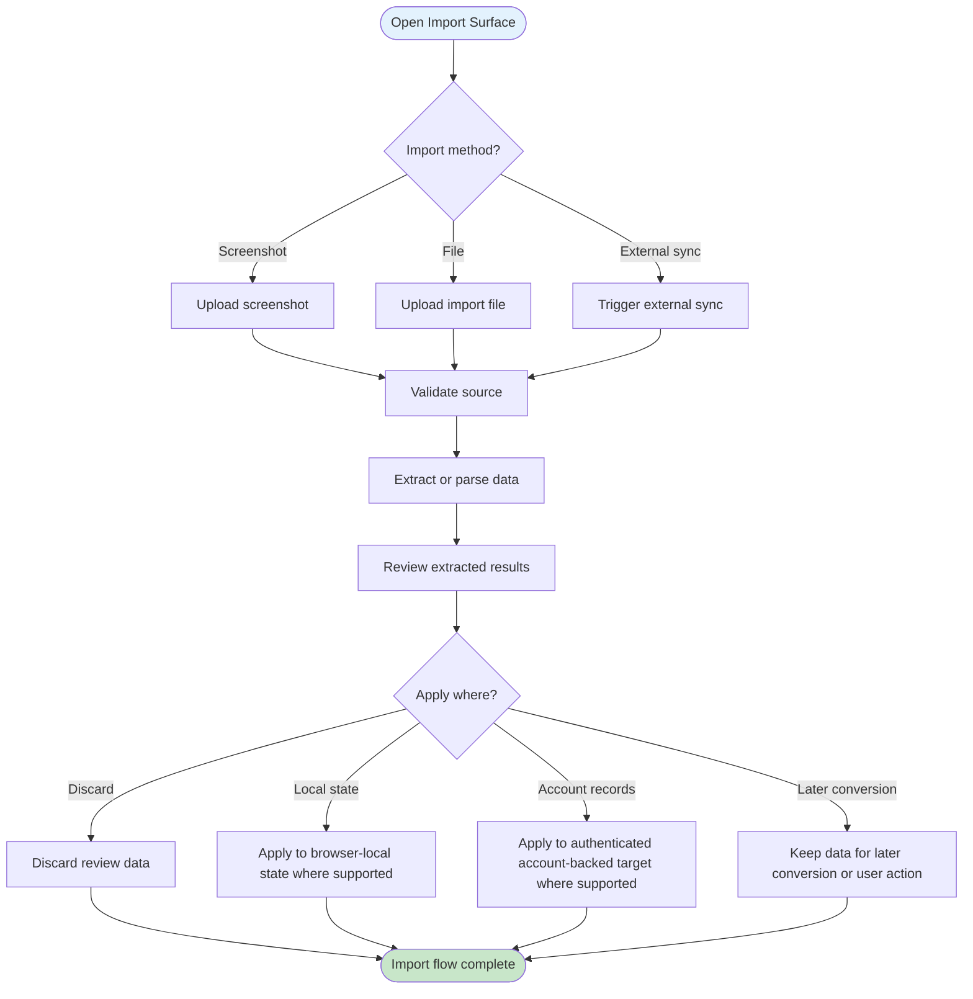
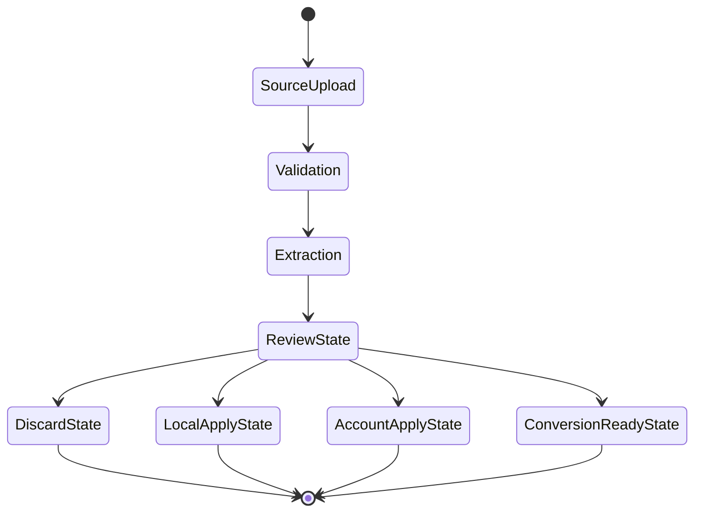

# UF-008: OCR and Data Import Flow

## Umamusume Pretty Derby Career Planner

**Document Version**: 2.3.0
**Date**: March 8, 2026
**Related Documents**: [PRD-007], [SPEC-007], [SRS], [BRS]

**Source Specifications**:

- `.kiro/specs/umamusume-career-planner-main/requirements.md` (External Integration Requirements)
- `.kiro/specs/umamusume-career-planner-main/design.md` (OCR and Data Import Flow)

**Related Artifacts**:

- PRD: [PRD-007](../02-prds/PRD-007_External_Integration.md)
- SPEC: [SPEC-007](../02-specs/SPEC-007_External_Integration_Technical.md)
- Flow: [FLOW-007](../01-flows/FLOW-007_External_Integration_System.md)
- Tech Flow: [TECH-FLOW-007](../01-tech-flow/TECH-FLOW-007_External_Integration_Flow.md)
- Sequences: [SEQ-007](../01-sequences/SEQ-007_External_Data_Sync.md),
[SEQ-015](../01-sequences/SEQ-015_Data_Migration_Snapshot_to_Live.md),
[SEQ-017](../01-sequences/SEQ-017_Storage_Mode_Transition.md)
- User Manual: [D17](../D17_SUM_Software_User_Manual.md#11-data-import--export)

---

## Table of Contents

1. [Overview](#1-overview)
2. [Flow Diagram](#2-flow-diagram)
3. [User Journey Steps](#3-user-journey-steps)
4. [Decision Points](#4-decision-points)
5. [Success Criteria](#5-success-criteria)
6. [Error Handling](#6-error-handling)
7. [Related Flows](#7-related-flows)

---

## 1. Overview

### 1.1 Purpose

The OCR and Data Import Flow describes how users ingest screenshots, files, or external data, review
extracted results, and then decide whether those results stay as intermediate review data, apply to
browser-local state, or persist to authenticated account-backed records.

### 1.2 Scope

| Aspect | Description |
| --- | --- |
| **Entry Point** | OCR upload page, import action, or external sync action |
| **Exit Point** | Data reviewed and either discarded, preserved locally, or applied to an account-backed target |
| **Duration** | 1-5 minutes depending on source quality and review complexity |
| **User Type** | Users importing new data or reviewing external extraction results |

### 1.3 Storage Mode Support

- `StorageMode::ACCOUNT`: implemented for OCR upload pages, extraction review, import flows, and
account-backed persistence where the current route surface supports it.
- `StorageMode::LOCAL`: local-mode ingestion can remain browser-local, review-only, or conversion-
ready; it should not be documented as account-equivalent unless the persistence path is verified.

### 1.4 Navigation Surface

This flow uses conceptual labels such as Import Wizard, OCR Review, and Sync Action for the user
journey. Where implementation-backed boundaries are relevant, current OCR and import flows are
exposed through OCR upload, import, migration, and related API handlers rather than a single
universal import route.

### 1.5 Persistence Note

Import and save behavior must state whether the result is browser-local only, account-backed, or
conversion-ready. Do not imply parity between Local and Account modes unless the persistence path is
verified.

### 1.6 Business Context

**Business Goal**: Reduce manual entry without confusing users about where imported or extracted
data actually lives after review.

**Success Metrics**:

- Users can distinguish extraction/review from actual persistence.
- Partial-save and review-only outcomes are understandable.
- Local-mode ingestion is not misrepresented as account-backed persistence.

---

## 2. Flow Diagram

### 2.1 High-Level Flow

### 2.2 Review and Partial-Save Branch

---

## 3. User Journey Steps

### 3.1 Step 1: Choose an Ingestion Method

**Purpose**: Let the user start from OCR, file import, or external sync without implying identical persistence rules.

**Possible actions**:

- upload screenshot
- upload file
- trigger sync

### 3.2 Step 2: Review Parsed or Extracted Data

**Purpose**: Treat import and OCR as review steps before persistence.

**What the user should be able to see**:

- extraction confidence or validation issues
- fields that are ready to apply
- fields that need correction or confirmation

### 3.3 Step 3: Choose the Persistence Target

**Purpose**: Make storage boundary choices explicit.

**Possible outcomes**:

| Target | Meaning |
| --- | --- |
| Discard | Exit without persistence |
| Local state | Apply to browser-local state where supported |
| Account records | Apply to authenticated persisted target where supported |
| Conversion-ready | Preserve data for later migration or manual use |

Transition and import should not be conflated. A reviewed import payload is not automatically the
same thing as the Local-to-Account transition flow.

### 3.4 Step 4: Handle Partial Success

**Purpose**: Prevent the user journey from implying that import is always all-or-nothing.

**User-visible outcomes**:

- accepted fields or records
- rejected or invalid fields
- review-only artifacts left for correction

---

## 4. Decision Points

### 4.1 Is the Source Valid?

Invalid source files, unsupported formats, or unusable screenshots should stop the flow before persistence.

### 4.2 Is the Current Mode Local or Account?

The flow must distinguish browser-local application from authenticated account-backed persistence.

### 4.3 Is the Data Ready to Apply?

Some data may remain in review state even if other fields are usable.

---

## 5. Success Criteria

- Users understand the difference between extraction, review, and persistence.
- Local-mode ingestion is not described as full account-backed save parity.
- Partial-save and review-only outcomes are supported conceptually.

---

## 6. Error Handling

| Scenario | User-facing behavior |
| --- | --- |
| No file or image selected | Stay on the import surface with clear selection guidance |
| OCR confidence too low | Keep the data in review state and prompt manual correction |
| Unsupported format or invalid payload | Block apply action and show validation feedback |
| Local persistence only in current mode | Explain that the current result can remain local or conversion-ready instead of implying account save |
| Account target unavailable | Keep the reviewed data visible and allow retry or alternative target selection |

---

## 7. Related Flows

- [UF-009_Storage_Mode_Transition_Flow.md](UF-009_Storage_Mode_Transition_Flow.md)
- [UF-010_Career_Reporting_and_Export_Flow.md](UF-010_Career_Reporting_and_Export_Flow.md)
- [TECH-FLOW-007](../01-tech-flow/TECH-FLOW-007_External_Integration_Flow.md)
- [SEQ-007](../01-sequences/SEQ-007_External_Data_Sync.md)
- [SEQ-015](../01-sequences/SEQ-015_Data_Migration_Snapshot_to_Live.md)
- [SEQ-017](../01-sequences/SEQ-017_Storage_Mode_Transition.md)
