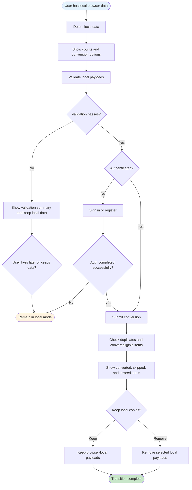
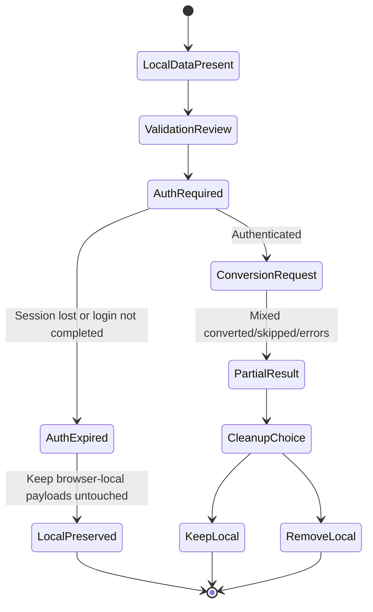

# UF-009: Storage Mode Transition Flow

## Umamusume Pretty Derby Career Planner

**Document Version**: 1.0.0
**Date**: March 8, 2026
**Related Documents**: [SRS], [BRS]

**Related Artifacts**:

- Sequence: [SEQ-017](../01-sequences/SEQ-017_Storage_Mode_Transition.md)
- Tech Flow: [TECH-FLOW-008](../01-tech-flow/TECH-FLOW-008_Storage_Mode_and_Local_Account_Conversion.md)
- User Flows: [UF-001](UF-001_Onboarding_Flow.md), [UF-002](UF-002_Career_Setup_Flow.md)

---

## Table of Contents

1. [Overview](#1-overview)
2. [Flow Diagram](#2-flow-diagram)
3. [User Journey Steps](#3-user-journey-steps)
4. [Decision Points](#4-decision-points)
5. [Success Criteria](#5-success-criteria)
6. [Error Handling](#6-error-handling)
7. [Related Flows](#7-related-flows)

---

## 1. Overview

### 1.1 Purpose

The Storage Mode Transition Flow describes the user-facing journey for moving from browser-local
usage into account-backed persistence. It covers local data detection, validation, sign-in or
registration, duplicate handling, partial conversion results, and the choice to keep or remove local
copies.

### 1.2 Scope

| Aspect | Description |
| --- | --- |
| **Entry Point** | User chooses to convert local data after signing in or from a local conversion screen |
| **Exit Point** | Conversion summary shown and local data either retained or removed by user choice |
| **Duration** | 1-5 minutes depending on local data volume and validation errors |
| **User Type** | Users with browser-local data who want account-backed persistence |

### 1.3 Current Implementation Boundary

- The current conversion path validates local payloads read from browser storage.
- The current server-side conversion persists local character payload wrappers into account-backed `Character` records.
- Local careers, skill builds, support decks, and race-planning state may be visible in the
conversion UI for awareness, but are not currently persisted by the server-side conversion path.

### 1.4 Navigation Surface

This flow refers to a local conversion screen conceptually. The current implementation-backed UI
boundary is the local conversion page backed by `local/convert.blade.php` and
`resources/js/pages/local/convert.js`.

---

## 2. Flow Diagram

### 2.1 High-Level Flow

### 2.2 Failure-Safe Branch

---

## 3. User Journey Steps

### 3.1 Step 1: Detect Local Data

**Purpose**: Tell the user that browser-local data exists and can be reviewed before conversion.

**What the user sees**:

- local character count
- local career and build counts for awareness
- note that not every local data type is currently server-converted

### 3.2 Step 2: Validate Before Conversion

**Purpose**: Treat local storage as untrusted input before persistence.

**Validation summary can include**:

- valid entries ready for conversion
- malformed or incomplete entries
- items with duplicate-like matches already owned by the authenticated user

**User choices**:

| Action | Outcome |
| --- | --- |
| Continue | Move to authenticated conversion |
| Stop here | Keep using local mode |
| Fix data later | Leave local payloads untouched |

### 3.3 Step 3: Authenticate if Needed

**Purpose**: Require account context before persisting account-backed records.

**User choices**:

- sign in with an existing account
- register a new account
- cancel and remain in local mode

If authentication fails or expires, the transition flow should preserve browser-local data and
return the user to a safe local state.

### 3.4 Step 4: Review Conversion Summary

**Purpose**: Make mixed outcomes understandable instead of treating conversion as all-or-nothing.

**Summary should distinguish**:

- converted items
- skipped duplicates
- items rejected by validation

**Current behavior note**:

- duplicate handling is conservative and name-based for the authenticated user
- the current implementation does not convert every local entity type shown in the UI

### 3.5 Step 5: Choose Local Cleanup Behavior

**Purpose**: Let the user decide whether browser-local copies remain after conversion.

**User choices**:

| Action | Outcome |
| --- | --- |
| Keep local copies | Browser-local data remains available |
| Remove local copies | Selected local keys are cleared after successful conversion |

---

## 4. Decision Points

### 4.1 Is There Local Data to Convert?

If no local data exists, the user should be redirected to normal onboarding, setup, or dashboard
flows rather than the transition flow.

### 4.2 Is the User Authenticated?

Conversion to account-backed records requires authenticated context. Validation can happen before
conversion, but persistence cannot.

### 4.3 Were All Items Converted?

The user should see partial success as a normal outcome. Conversion summaries should separate
converted, skipped, and errored items.

### 4.4 Should Local Copies Be Preserved?

Local cleanup is a user choice, not an automatic assumption.

---

## 5. Success Criteria

- Users understand that local data can be reviewed before conversion.
- Authentication failure does not destroy browser-local data.
- Duplicate handling and partial conversion outcomes are visible and understandable.
- The transition flow makes the current conversion boundary clear rather than implying full account
migration for every local entity type.

---

## 6. Error Handling

| Scenario | User-facing behavior |
| --- | --- |
| No local data found | Show empty-state guidance and return to onboarding or dashboard |
| Validation errors present | Show per-item issues and keep local payloads untouched |
| Auth expired or unauthorized | Prompt sign-in again and preserve local data |
| Duplicate detected | Skip duplicate item and report it in summary |
| Partial conversion | Report converted, skipped, and errored items separately |
| User cancels cleanup | Converted account records remain; local copies stay in browser storage |

---

## 7. Related Flows

- [UF-001_Onboarding_Flow.md](UF-001_Onboarding_Flow.md)
- [UF-002_Career_Setup_Flow.md](UF-002_Career_Setup_Flow.md)
- [UF-004_Race_Day_Flow.md](UF-004_Race_Day_Flow.md)
- [SEQ-017](../01-sequences/SEQ-017_Storage_Mode_Transition.md)
- [TECH-FLOW-008](../01-tech-flow/TECH-FLOW-008_Storage_Mode_and_Local_Account_Conversion.md)
