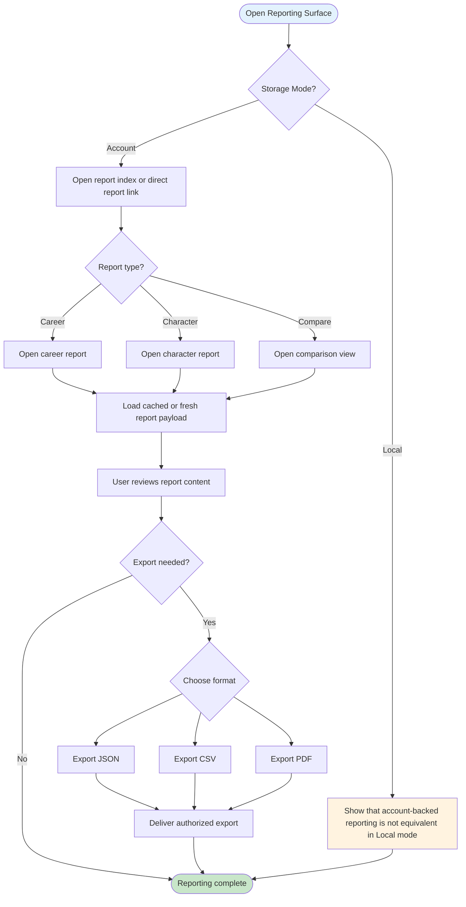
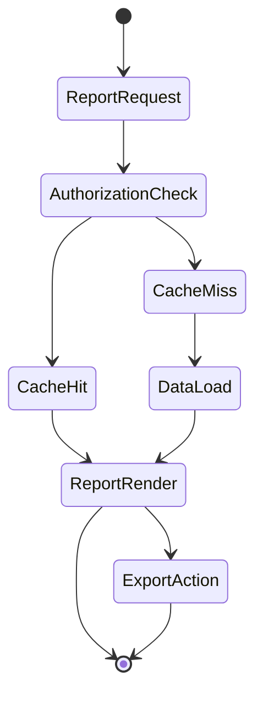

# UF-010: Career Reporting and Export Flow

## Umamusume Pretty Derby Career Planner

**Document Version**: 1.1.0
**Date**: March 10, 2026
**Related Documents**: [SRS], [BRS]

**Related Artifacts**:

- Tech Flow: [TECH-FLOW-010](../01-tech-flow/TECH-FLOW-010_Career_Reporting_Flow.md)
- Tech Flow: [TECH-FLOW-003](../01-tech-flow/TECH-FLOW-003_Race_Strategy_Flow.md)
- User Flow: [UF-004](UF-004_Race_Day_Flow.md)

---

## Table of Contents

1. [Overview](#1-overview)
2. [Flow Diagram](#2-flow-diagram)
3. [User Journey Steps](#3-user-journey-steps)
4. [Decision Points](#4-decision-points)
5. [Success Criteria](#5-success-criteria)
6. [Error Handling](#6-error-handling)
7. [Related Flows](#7-related-flows)

---

## 1. Overview

### 1.1 Purpose

The Career Reporting and Export Flow describes how users open career reports, compare runs, export
report data, and clear report caches where available. It makes the current account-backed reporting
boundary explicit so the user journey does not imply full local-mode parity.

### 1.2 Scope

| Aspect | Description |
| --- | --- |
| **Entry Point** | Career report links, character report links, compare view, or export actions |
| **Exit Point** | Report viewed, comparison completed, export delivered, or user returned to career context |
| **Duration** | 1-5 minutes depending on report complexity and export choice |
| **User Type** | Authenticated users with account-backed career data |

### 1.3 Storage Mode Support

- `StorageMode::ACCOUNT`: implemented for authenticated career reports, comparisons, cache clear
operations, and exports.
- `StorageMode::LOCAL`: should not be described as equivalent to account-backed reporting until a
verified local reporting path exists.

### 1.4 Navigation Surface

This flow uses conceptual labels such as Report View, Compare Screen, and Export Action for the user
journey. Where implementation-backed navigation is relevant, the current route surface includes:

- `/reports`
- `/reports/career/{career}`
- `/reports/character/{character}`
- `/reports/compare`
- `/reports/career/{career}/export/json`
- `/reports/career/{career}/export/csv`
- `/reports/career/{career}/export/pdf` *(print-optimized browser flow; user saves via browser
print-to-PDF, not server-side PDF generation)*

### 1.5 Business Context

**Business Goal**: Make run outcomes understandable and exportable without obscuring the current
account-backed authorization and persistence boundary.

**Success Metrics**:

- Users can access the correct report for a career or character without confusion.
- Export actions clearly inherit the same authorization as on-screen reporting.
- Local-mode users are not misled into expecting the same reporting surface without conversion or
future implementation support.

---

## 2. Flow Diagram

### 2.1 High-Level Flow

### 2.2 Report Cache Branch

---

## 3. User Journey Steps

### 3.1 Step 1: Open the Reporting Surface

**Purpose**: Let the user choose a report entry point that matches the current account-backed run context.

**Possible entry points**:

- report index
- career report link
- character report link
- compare screen

If the user is in Local mode, the flow should explain that the current reporting surface is not
equivalent to account-backed reporting.

### 3.2 Step 2: Review Report Content

**Purpose**: Surface run outcomes, comparisons, and recommendations.

**What the user reviews**:

- summary metrics for the selected career
- stat progression summary across the career timeline
- cross-career character context where available
- race, training, and skill outcomes
- comparisons or recommendations derived from the reporting layer

### 3.3 Step 3: Choose Export or Continue

**Purpose**: Allow export without treating it as a separate authorization model.

**User choices**:

| Action | Outcome |
| --- | --- |
| Continue reading | Stay on the report surface |
| Compare runs | Move to comparison view |
| Export JSON | Deliver JSON export if authorized |
| Export CSV | Deliver CSV export if authorized |
| Export PDF | Open print-optimized view and let user save to PDF via browser print flow |

### 3.4 Step 4: Handle Cache and Authorization

**Purpose**: Keep reporting and exporting consistent with owner-scoped access.

**User-visible behavior**:

- cached reports may load faster than fresh ones
- export uses the same owner-scoped access rules as on-screen reporting
- cache-clearing behavior should be described as an account-backed maintenance action, not a user-
facing parity feature in Local mode

---

## 4. Decision Points

### 4.1 Is the User in Account Mode?

Current reporting and export flows are account-backed. Local mode should not be described as
equivalent unless a verified local reporting path is implemented.

### 4.2 Is the Report Authorized?

The user must have access to the selected career or character. Exports inherit the same access boundary.

### 4.3 Is an Export Needed?

Export is optional. The user can review the report without leaving the reporting surface.

---

## 5. Success Criteria

- Users can tell that reporting and export are account-backed features.
- Export actions do not appear to bypass report authorization.
- Compare and export actions are discoverable without implying local-mode parity.

---

## 6. Error Handling

| Scenario | User-facing behavior |
| --- | --- |
| User in Local mode | Explain that current reporting and export are account-backed |
| Unauthorized report access | Show an authorization error and return to a safe report or character context |
| Report unavailable | Show a recoverable empty or not-found state |
| Export generation fails | Keep the report visible and show export failure feedback |
| Network or server issue | Preserve current page context and allow retry where possible |

---

## 7. Related Flows

- [UF-004_Race_Day_Flow.md](UF-004_Race_Day_Flow.md)
- [UF-009_Storage_Mode_Transition_Flow.md](UF-009_Storage_Mode_Transition_Flow.md)
- [TECH-FLOW-003](../01-tech-flow/TECH-FLOW-003_Race_Strategy_Flow.md)
- [TECH-FLOW-010](../01-tech-flow/TECH-FLOW-010_Career_Reporting_Flow.md)
- [SEQ-017](../01-sequences/SEQ-017_Storage_Mode_Transition.md)
