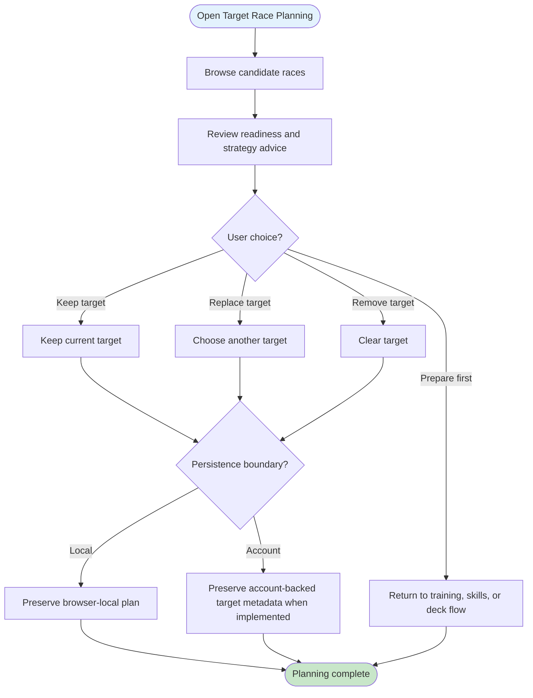

# UF-011: Target Race Planning Flow

## Umamusume Pretty Derby Career Planner

**Document Version**: 1.1.0
**Date**: March 10, 2026
**Related Documents**: [SRS], [BRS]

**Related Artifacts**:

- Tech Flow: [TECH-FLOW-009](../01-tech-flow/TECH-FLOW-009_Target_Race_Planning_Flow.md)
- Tech Flow: [TECH-FLOW-003](../01-tech-flow/TECH-FLOW-003_Race_Strategy_Flow.md)
- User Flow: [UF-004](UF-004_Race_Day_Flow.md)

---

## Table of Contents

1. [Overview](#1-overview)
2. [Flow Diagram](#2-flow-diagram)
3. [User Journey Steps](#3-user-journey-steps)
4. [Decision Points](#4-decision-points)
5. [Success Criteria](#5-success-criteria)
6. [Error Handling](#6-error-handling)
7. [Related Flows](#7-related-flows)

---

## 1. Overview

### 1.1 Purpose

The Target Race Planning Flow describes how users browse candidate races, compare readiness, keep or
revise planned targets, and defer actual race entry until the current storage mode and run state
support it.

### 1.2 Scope

| Aspect | Description |
| --- | --- |
| **Entry Point** | Target-race view, race calendar, or readiness suggestion |
| **Exit Point** | Target preserved, replaced, removed, or deferred for later preparation |
| **Duration** | 1-5 minutes depending on readiness review and follow-up planning |
| **User Type** | Users with an active run context who are planning future races |

### 1.3 Storage Mode Support

- `StorageMode::ACCOUNT`: implemented for authenticated race-target browsing and character-linked planning views.
- `StorageMode::LOCAL`: target planning should be treated as browser-local or advisory until a
verified local persistence path is introduced.

### 1.4 Navigation Surface

This flow uses conceptual labels such as Target Race View and Readiness Review for the user journey.
Where implementation-backed navigation is relevant, the current route surface includes:

- `/races/targets`
- `/races/calendar`
- `/api/advisory/race/strategy`

### 1.5 Business Context

**Business Goal**: Separate future race planning from immediate race entry so the user journey does
not collapse planning, execution, and reporting into one step.

---

## 2. Flow Diagram

### 2.1 High-Level Flow

---

## 3. User Journey Steps

### 3.1 Step 1: Browse Candidate Targets

**Purpose**: Let the user inspect future races without forcing entry.

### 3.2 Step 2: Review Readiness

**Purpose**: Surface readiness, strategy guidance, and missing preparation before a target is committed.

Readiness review should include fan count eligibility checks for races that require minimum fans
(for example, higher-grade races) in addition to stat, aptitude, and strategy guidance.

### 3.3 Step 3: Keep, Replace, Remove, or Defer

**Purpose**: Treat target planning as a reversible planning activity.

A saved target is a planning intention, not an irreversible race-entry commitment.

**Possible outcomes**:

- keep current target
- replace with a different target
- remove the target entirely
- defer and go back to training, skills, or deck updates

---

## 4. Decision Points

### 4.1 Is This Planning or Entry?

This flow is for planning. It should not imply immediate race execution.

### 4.2 What Persistence Boundary Applies?

Local mode uses browser-local planning or advisory behavior. Account mode can use authenticated
planning state where implemented.

---

## 5. Success Criteria

- Users can plan target races without assuming immediate race entry.
- Local target planning is described as local or advisory rather than account-equivalent.
- Planning remains easy to revise.

---

## 6. Error Handling

| Scenario | User-facing behavior |
| --- | --- |
| No targetable races available | Show empty-state guidance and return to calendar or planning context |
| No active run | Return to setup or current run selection |
| Readiness data unavailable | Show candidate races with reduced advisory detail |
| Local mode without verified persistence path | Preserve planning locally and avoid implying account-backed save |

---

## 7. Related Flows

- [UF-004_Race_Day_Flow.md](UF-004_Race_Day_Flow.md)
- [UF-003_Training_Day_Flow.md](UF-003_Training_Day_Flow.md)
- [UF-005_Skill_Management_Flow.md](UF-005_Skill_Management_Flow.md)
- [UF-006_Support_Deck_Building_Flow.md](UF-006_Support_Deck_Building_Flow.md)
- [TECH-FLOW-009](../01-tech-flow/TECH-FLOW-009_Target_Race_Planning_Flow.md)
- [TECH-FLOW-003](../01-tech-flow/TECH-FLOW-003_Race_Strategy_Flow.md)
- [SEQ-017](../01-sequences/SEQ-017_Storage_Mode_Transition.md)
