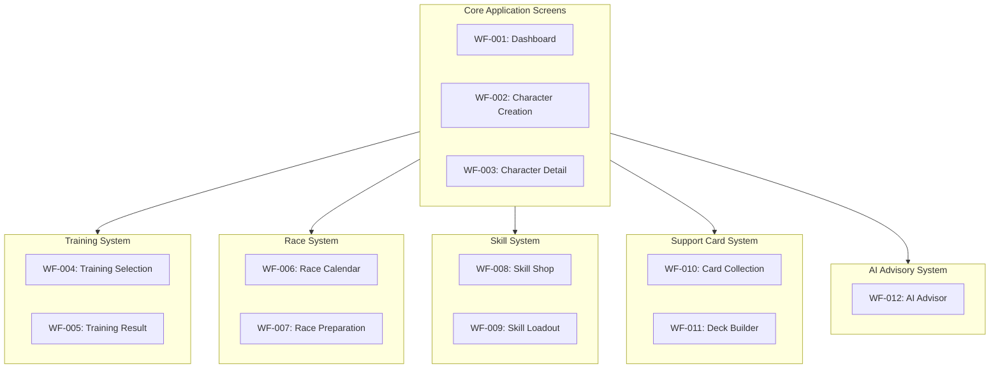
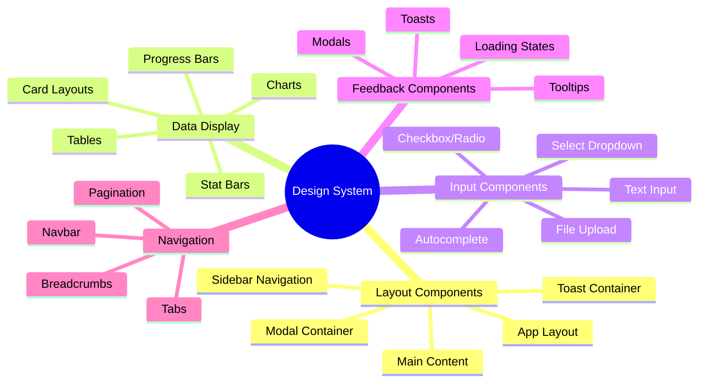
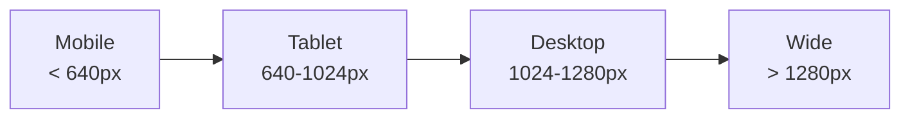
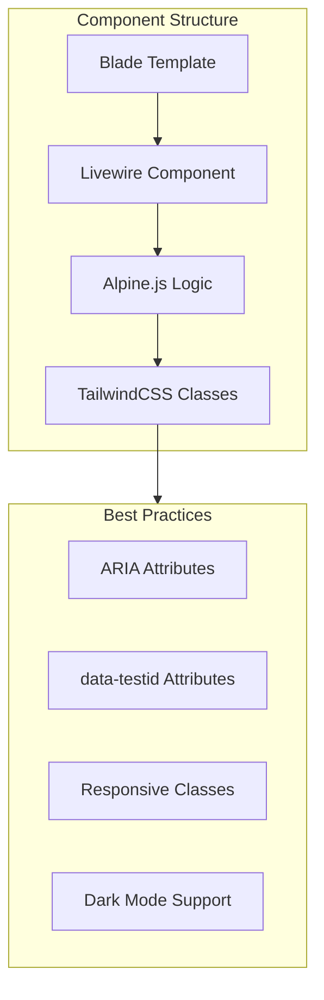
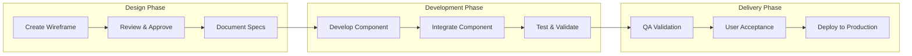

# WIREFRAMES & UI SPECIFICATIONS INDEX

**Document Version**: 2.3.0
**Date**: February 22, 2026
**Status**: Current - Aligned with v2.3.0 Implementation and game-accurate mechanics

---

## Overview

This index provides a comprehensive catalog of wireframe specifications for the Umamusume Pretty Derby Career Planner application. Wireframes define the user interface layout, component hierarchy, interaction patterns, and design specifications for all major screens and workflows.

**Design Philosophy**: Mobile-first responsive design with accessibility compliance (WCAG 2.2 AA), dark mode support, and progressive disclosure principles.

---

## Document Purpose

### Scope

Wireframe documentation covers:

- **Screen Layouts**: Detailed ASCII/structured representations of UI layouts
- **Component Specifications**: Reusable UI component definitions
- **Interaction Patterns**: User interaction flows and state transitions
- **Responsive Behavior**: Breakpoint-specific layout adaptations
- **Accessibility Guidelines**: WCAG 2.2 AA compliance requirements
- **Design Tokens**: Color schemes, typography, spacing systems

### Intended Audience

- **Audience**: **UI/UX Designers**; **Use Case**: Visual design creation, prototyping
- **Audience**: **Frontend Developers**; **Use Case**: Component implementation, responsive layouts
- **Audience**: **Product Managers**; **Use Case**: Feature validation, user flow review
- **Audience**: **QA Engineers**; **Use Case**: UI test case development, accessibility testing
- **Audience**: **Stakeholders**; **Use Case**: Feature preview, approval workflows

---

## Wireframe Catalog

### System Architecture



---

## Wireframe Categories

### 1. Character Management Screens (WF-001 to WF-003)

- **Document**: [WF-001](WF-001_Dashboard_Overview.md); **Title**: Dashboard Overview; **Status**: ✅ Complete; **Priority**: P0
- **Document**: [WF-002](WF-002_Character_Creation_Wizard.md); **Title**: Character Creation Wizard; **Status**: ✅ Complete; **Priority**: P0
- **Document**: [WF-003](WF-003_Character_Detail_Management.md); **Title**: Character Detail & Management; **Status**: ✅ Complete; **Priority**: P0

**Coverage**: Dashboard, character creation flow, character detail view

**Related Artifacts**:

- PRD: [PRD-001 Character Management](../prds/PRD-001_Character_Management.md)
- SPEC: [SPEC-001 Character Management Technical](../specs/SPEC-001_Character_Management_Technical.md)
- Flow: [FLOW-001 Character Management System](../flows/FLOW-001_Character_Management_System.md)
- User Flow: [UF-001 Dashboard Navigation](../user-flows/UF-001_Dashboard_Navigation_Flow.md)

---

### 2. Training Optimization Screens (WF-004 to WF-005)

- **Document**: [WF-004](WF-004_Training_Selection_Interface.md); **Title**: Training Selection Interface; **Status**: ✅ Complete; **Priority**: P0
- **Document**: [WF-005](WF-005_Training_Result_Screen.md); **Title**: Training Result Screen; **Status**: ✅ Complete; **Priority**: P0

**Coverage**: Training prediction display, AI recommendations, result processing

**Related Artifacts**:

- PRD: [PRD-002 Training Optimization](../prds/PRD-002_Training_Optimization.md)
- SPEC: [SPEC-002 Training Optimization Technical](../specs/SPEC-002_Training_Optimization_Technical.md)
- Flow: [FLOW-002 Training Optimization System](../flows/FLOW-002_Training_Optimization_System.md)
- Tech Flow: [TECH-FLOW-002 Training Optimization](../tech-flow/TECH-FLOW-002_Training_Optimization_Flow.md)
- Sequence: [SEQ-002 Training Block Resolution](../sequences/SEQ-002_Training_Block_Resolution.md)
- User Flow: [UF-003 Training Day Flow](../user-flows/UF-003_Training_Day_Flow.md)

---

### 3. Race Strategy Screens (WF-006 to WF-007)

- **Document**: [WF-006](WF-006_Race_Calendar_View.md); **Title**: Race Calendar View; **Status**: ✅ Complete; **Priority**: P0
- **Document**: [WF-007](WF-007_Race_Preparation_Screen.md); **Title**: Race Preparation Screen; **Status**: ✅ Complete; **Priority**: P0

**Coverage**: Race scheduling, readiness assessment, strategy recommendations

**Related Artifacts**:

- PRD: [PRD-003 Race Strategy](../prds/PRD-003_Race_Strategy.md)
- SPEC: [SPEC-003 Race Strategy Technical](../specs/SPEC-003_Race_Strategy_Technical.md)
- Flow: [FLOW-003 Race Strategy System](../flows/FLOW-003_Race_Strategy_System.md)
- Tech Flow: [TECH-FLOW-003 Race Strategy](../tech-flow/TECH-FLOW-003_Race_Strategy_Flow.md)
- Sequence: [SEQ-004 Race Registration and Outcome](../sequences/SEQ-004_Race_Registration_and_Outcome.md)
- User Flow: [UF-004 Race Day Flow](../user-flows/UF-004_Race_Day_Flow.md)

---

### 4. Skill Management Screens (WF-008 to WF-009)

- **Document**: [WF-008](WF-008_Skill_Shop_Interface.md); **Title**: Skill Shop Interface; **Status**: ✅ Complete; **Priority**: P0
- **Document**: [WF-009](WF-009_Skill_Loadout_Manager.md); **Title**: Skill Loadout Manager; **Status**: ✅ Complete; **Priority**: P0

**Coverage**: Skill catalog, SP management, hint tracking, loadout optimization

**Related Artifacts**:

- PRD: [PRD-004 Skill Management](../prds/PRD-004_Skill_Management.md)
- SPEC: [SPEC-004 Skill Management Technical](../specs/SPEC-004_Skill_Management_Technical.md)
- Flow: [FLOW-004 Skill Management System](../flows/FLOW-004_Skill_Management_System.md)
- Tech Flow: [TECH-FLOW-004 Skill Management](../tech-flow/TECH-FLOW-004_Skill_Management_Flow.md)
- Sequence: [SEQ-003 Skill Acquisition and Upgrade](../sequences/SEQ-003_Skill_Acquisition_and_Upgrade.md)
- User Flow: [UF-005 Skill Management Flow](../user-flows/UF-005_Skill_Management_Flow.md)

---

### 5. Support Card System Screens (WF-010 to WF-011)

- **Document**: [WF-010](WF-010_Support_Card_Collection.md); **Title**: Support Card Collection; **Status**: ✅ Complete; **Priority**: P0
- **Document**: [WF-011](WF-011_Support_Deck_Builder.md); **Title**: Support Deck Builder; **Status**: ✅ Complete; **Priority**: P0

**Coverage**: Card inventory, meta tier display, deck composition, synergy scoring

**Related Artifacts**:

- PRD: [PRD-005 Support Card Management](../prds/PRD-005_Support_Card_Management.md)
- SPEC: [SPEC-005 Support Card Management Technical](../specs/SPEC-005_Support_Card_Management_Technical.md)
- Flow: [FLOW-005 Support Card Management System](../flows/FLOW-005_Support_Card_Management_System.md)
- Tech Flow: [TECH-FLOW-005 Support Card Management](../tech-flow/TECH-FLOW-005_Support_Card_Management_Flow.md)
- Sequence: [SEQ-005 Support Card Upgrade](../sequences/SEQ-005_Support_Card_Upgrade.md)
- User Flow: [UF-006 Support Deck Building](../user-flows/UF-006_Support_Deck_Building_Flow.md)

---

### 6. AI Advisory System (WF-012)

- **Document**: [WF-012](WF-012_AI_Advisor_Interface.md); **Title**: AI Advisor Interface; **Status**: ✅ Complete; **Priority**: P1

**Coverage**: AI chat interface, recommendation display, provider routing, cost tracking

**Related Artifacts**:

- PRD: [PRD-006 AI Advisory](../prds/PRD-006_AI_Advisory.md)
- SPEC: [SPEC-006 AI Advisory Technical](../specs/SPEC-006_AI_Advisory_Technical.md)
- Flow: [FLOW-006 AI Advisory System](../flows/FLOW-006_AI_Advisory_System.md)
- Tech Flow: [TECH-FLOW-006 AI Advisory](../tech-flow/TECH-FLOW-006_AI_Advisory_Flow.md)
- Sequence: [SEQ-006 AI Advice Generation](../sequences/SEQ-006_AI_Advice_Generation.md)
- User Flow: [UF-007 AI Advisor Journey](../user-flows/UF-007_AI_Advisor_Journey.md)
- Config: [MCP Server Configuration](../MCP_SERVER_CONFIGURATION_REFERENCE.md)

---

## Design System Specifications

### Component Library



### Design Tokens

#### Color Palette

- **Token**: `--color-primary`; **Light Mode**: `#3b82f6`; **Dark Mode**: `#60a5fa`; **Usage**: Primary actions, links
- **Token**: `--color-stat-speed`; **Light Mode**: `#3399ff`; **Dark Mode**: `#66b3ff`; **Usage**: Speed stat indicators
- **Token**: `--color-stat-stamina`; **Light Mode**: `#33cc99`; **Dark Mode**: `#66d9b8`; **Usage**: Stamina stat indicators
- **Token**: `--color-stat-power`; **Light Mode**: `#ff4d4d`; **Dark Mode**: `#ff7373`; **Usage**: Power stat indicators
- **Token**: `--color-stat-guts`; **Light Mode**: `#ffa500`; **Dark Mode**: `#ffb733`; **Usage**: Guts stat indicators
- **Token**: `--color-stat-wit`; **Light Mode**: `#9933ff`; **Dark Mode**: `#b366ff`; **Usage**: Wit stat indicators
- **Token**: `--color-bg-primary`; **Light Mode**: `#ffffff`; **Dark Mode**: `#1a1a2e`; **Usage**: Primary background
- **Token**: `--color-bg-secondary`; **Light Mode**: `#f9fafb`; **Dark Mode**: `#16213e`; **Usage**: Secondary background
- **Token**: `--color-text-primary`; **Light Mode**: `#111827`; **Dark Mode**: `#eaeaea`; **Usage**: Primary text
- **Token**: `--color-text-secondary`; **Light Mode**: `#6b7280`; **Dark Mode**: `#a0a0a0`; **Usage**: Secondary text

#### Typography Scale

- **Token**: `--text-xs`; **Size**: 0.75rem; **Line Height**: 1rem; **Usage**: Captions, labels
- **Token**: `--text-sm`; **Size**: 0.875rem; **Line Height**: 1.25rem; **Usage**: Body small, secondary text
- **Token**: `--text-base`; **Size**: 1rem; **Line Height**: 1.5rem; **Usage**: Body text
- **Token**: `--text-lg`; **Size**: 1.125rem; **Line Height**: 1.75rem; **Usage**: Subheadings
- **Token**: `--text-xl`; **Size**: 1.25rem; **Line Height**: 1.75rem; **Usage**: Headings
- **Token**: `--text-2xl`; **Size**: 1.5rem; **Line Height**: 2rem; **Usage**: Page titles
- **Token**: `--text-3xl`; **Size**: 1.875rem; **Line Height**: 2.25rem; **Usage**: Hero headings

#### Spacing Scale

- **Token**: `--space-1`; **Value**: 0.25rem; **Usage**: Tight spacing
- **Token**: `--space-2`; **Value**: 0.5rem; **Usage**: Compact spacing
- **Token**: `--space-3`; **Value**: 0.75rem; **Usage**: Default spacing
- **Token**: `--space-4`; **Value**: 1rem; **Usage**: Standard spacing
- **Token**: `--space-6`; **Value**: 1.5rem; **Usage**: Comfortable spacing
- **Token**: `--space-8`; **Value**: 2rem; **Usage**: Generous spacing
- **Token**: `--space-12`; **Value**: 3rem; **Usage**: Section spacing

### Responsive Breakpoints



- **Breakpoint**: **Mobile**; **Width**: < 640px; **Layout Strategy**: Single column, bottom nav, collapsible sections
- **Breakpoint**: **Tablet**; **Width**: 640-1024px; **Layout Strategy**: Two columns where appropriate, sidebar toggle
- **Breakpoint**: **Desktop**; **Width**: 1024-1280px; **Layout Strategy**: Full layout with sidebar, multi-column grids
- **Breakpoint**: **Wide**; **Width**: > 1280px; **Layout Strategy**: Maximum content width applied, generous spacing

### Accessibility Guidelines

#### WCAG 2.2 AA Compliance

- **Guideline**: **1.1.1 Non-text Content**; **Requirement**: Alt text for images; **Implementation**: All `` tags have descriptive `alt` attributes
- **Guideline**: **1.4.3 Contrast Ratio**; **Requirement**: 4.5:1 for normal text; **Implementation**: Design tokens enforce minimum contrast
- **Guideline**: **2.1.1 Keyboard Navigation**; **Requirement**: All interactive elements focusable; **Implementation**: `tabindex` and focus management
- **Guideline**: **2.4.7 Focus Visible**; **Requirement**: Visible focus indicators; **Implementation**: CSS focus states with high contrast
- **Guideline**: **4.1.2 Name, Role, Value**; **Requirement**: ARIA labels on controls; **Implementation**: ARIA attributes on all interactive elements
- **Guideline**: **2.3.3 Animation Control**; **Requirement**: Respect `prefers-reduced-motion`; **Implementation**: CSS media queries for animations

#### Keyboard Shortcuts

- **Action**: Save; **Shortcut**: `Ctrl + S`; **Context**: All editor screens
- **Action**: Cancel; **Shortcut**: `Esc`; **Context**: Modals, dialogs
- **Action**: Search; **Shortcut**: `/`; **Context**: Global navigation
- **Action**: Help; **Shortcut**: `?`; **Context**: Show keyboard shortcuts
- **Action**: Navigate; **Shortcut**: `Tab` / `Shift + Tab`; **Context**: Focus traversal

---

## Implementation Guidelines

### Technology Stack

- **Layer**: **Framework**; **Technology**: Laravel; **Version**: 12+; **Purpose**: Backend framework
- **Layer**: **Frontend Reactivity**; **Technology**: Livewire; **Version**: 4; **Purpose**: Server-driven UI
- **Layer**: **Client Interactivity**; **Technology**: Alpine.js; **Version**: Latest; **Purpose**: Client-side interactions
- **Layer**: **Styling**; **Technology**: TailwindCSS; **Version**: v4; **Purpose**: Utility-first CSS
- **Layer**: **Build Tool**; **Technology**: Vite; **Version**: 7; **Purpose**: Asset compilation

### Component Implementation Standards



#### Blade Component Example

```blade
{{-- resources/views/components/stat-bar.blade.php --}}
<div
    class="stat-bar"
    data-testid="stat-bar-{{ $stat }}"
    role="progressbar"
    aria-label="{{ ucfirst($stat) }} stat: {{ $value }}"
    aria-valuenow="{{ $value }}"
    aria-valuemin="0"
    aria-valuemax="1200"
> 
    <div class="stat-bar__label">
        <span class="text-sm font-medium text-gray-700 dark:text-gray-300">
            {{ ucfirst($stat) }}
        </span>
        <span class="text-sm font-bold text-{{ $stat }} dark:text-{{ $stat }}-light">
            {{ $value }}
        </span>
    </div>
    <div class="stat-bar__track">
        <div
            class="stat-bar__fill bg-{{ $stat }}"
            style="width: {{ ($value / 1200) * 100 }}%"
        ></div>
    </div>
    <div class="stat-bar__grade">
        <x-grade-badge :value="$value" />
    </div>
</div>
```

#### Livewire Component Example

```php
<?php

namespace App\Livewire\Training;

use Livewire\Component;
use App\Services\TrainingPredictionService;

class TrainingSelector extends Component
{
    public $characterId;
    public $predictions = [];

    public function mount($characterId)
    {
        $this->characterId = $characterId;
        $this->loadPredictions();
    }

    public function loadPredictions()
    {
        $character = Character::findOrFail($this->characterId);
        $service = app(TrainingPredictionService::class);

        $this->predictions = $service->getPredictions($character);
    }

    public function selectTraining($facility)
    {
        $this->dispatch('training-selected', facility: $facility);
    }

    public function render()
    {
        return view('livewire.training.training-selector');
    }
}
```

### Testing Requirements

#### Visual Regression Testing

```javascript
// tests/e2e/wireframes/training-selector.spec.js
import { test, expect } from '@playwright/test';

test.describe('WF-004: Training Selection Interface', () => {
    test('renders training predictions correctly', async ({ page }) => {
        await page.goto('/characters/1/training');

        // Check header
        await expect(page.getByTestId('training-header')).toBeVisible();

        // Check prediction cards
        const predictions = page.getByTestId('prediction-card');
        await expect(predictions).toHaveCount(6);

        // Check AI recommendation badge
        await expect(page.getByTestId('ai-recommendation-badge')).toBeVisible();

        // Visual regression
        await expect(page).toHaveScreenshot('training-selector.png');
    });

    test('displays risk indicators correctly', async ({ page }) => {
        await page.goto('/characters/1/training');

        const riskBadge = page.getByTestId('risk-badge-high');
        await expect(riskBadge).toHaveClass(/bg-red/);
    });
});
```

#### Accessibility Testing

```javascript
// tests/e2e/accessibility/training-selector.spec.js
import { test, expect } from '@playwright/test';
import AxeBuilder from '@axe-core/playwright';

test.describe('WF-004: Accessibility', () => {
    test('should not have any automatically detectable accessibility issues', async ({ page }) => {
        await page.goto('/characters/1/training');

        const accessibilityScanResults = await new AxeBuilder({ page }).analyze();

        expect(accessibilityScanResults.violations).toEqual([]);
    });

    test('supports keyboard navigation', async ({ page }) => {
        await page.goto('/characters/1/training');

        await page.keyboard.press('Tab');
        await expect(page.getByTestId('prediction-card-speed')).toBeFocused();

        await page.keyboard.press('Enter');
        await expect(page).toHaveURL(/.*training-result/);
    });
});
```

---

## Wireframe Usage Workflow

### Design to Development Workflow



### Wireframe Import Process

1. **Designers**: Create wireframes using ASCII representations or design tools
2. **Documentation**: Convert designs to markdown format following template
3. **Review**: Submit for technical and product review
4. **Approval**: Obtain sign-off from stakeholders
5. **Development**: Developers implement based on specifications
6. **Validation**: QA validates against wireframe specifications
7. **Deployment**: Deploy to staging/production environments

---

## Related Documentation

### Core Documentation

- **Document**: [SDP - Software Development Plan](../001_SDP_Software_Development_Plan.md); **Description**: Project timeline and milestones
- **Document**: [BRS - Business Requirements](../002_BRS_Business_Requirements_Specifications.md); **Description**: Business objectives and scope
- **Document**: [SRS - Software Requirements](../003_SRS_Software_Requirement_Specifications.md); **Description**: Functional and non-functional requirements
- **Document**: [SDS - Software Design](../004_SDS_Software_Design_Specifications.md); **Description**: System architecture and design
- **Document**: [SUM - Software User Manual](../017_SUM_Software_User_Manual.md); **Description**: End-user documentation

### Supplementary Documentation

- **Document Set**: [PRDs (001-007)](../prds/000_PRDS_INDEX.md); **Description**: Product Requirement Documents
- **Document Set**: [SPECs (001-007)](../specs/000_SPECS_INDEX.md); **Description**: Technical Specifications
- **Document Set**: [Flows (001-007)](../flows/000_FLOWS_INDEX.md); **Description**: System Flow Diagrams
- **Document Set**: [Tech Flows (001-007)](../tech-flow/000_TECH_FLOW_INDEX.md); **Description**: Technical Flow Diagrams
- **Document Set**: [Sequences (001-015)](../sequences/000_SEQUENCE_DIAGRAMS_INDEX.md); **Description**: Sequence Diagrams
- **Document Set**: [User Flows (001-008)](../user-flows/000_USER_FLOW_DIAGRAMS_INDEX.md); **Description**: User Flow Diagrams

---

## Maintenance and Updates

### Update Procedures

1. **Wireframe Changes**: Document changes with version history
2. **Component Updates**: Reflect changes in implementation notes
3. **Design System Changes**: Update design tokens and guidelines
4. **Accessibility Updates**: Document new WCAG requirements

### Version Control

- **Version**: 2.3.0; **Date**: 2026-02-22; **Author**: Development Team; **Changes**: Updated version/dates, corrected Livewire version to v4, aligned technology references with current stack
- **Version**: 2.2.0; **Date**: 2026-01-28; **Author**: Development Team; **Changes**: Game-accurate mechanics update aligned with v2.2.0
- **Version**: 2.0.0; **Date**: 2026-01-24; **Author**: Development Team; **Changes**: Comprehensive update aligned with v2.0.0 implementation, added design system specifications, accessibility guidelines, and testing requirements
- **Version**: 1.0.0; **Date**: 2026-01-14; **Author**: Development Team; **Changes**: Initial wireframe specifications

---

## Support and Resources

### Design Resources

- **Figma Community**: [Umamusume Career Planner Components](https://figma.com)
- **TailwindCSS v4**: [Official Documentation](https://tailwindcss.com)
- **WCAG 2.2**: [Web Content Accessibility Guidelines](https://www.w3.org/WAI/WCAG22/quickref/)

### Contact

For wireframe-related questions or contributions:

- **Documentation Team**: <documentation@umacareerplanner.dev>
- **GitHub Issues**: [Report Issues](https://github.com/org/repo/issues)
- **Design Discussions**: [Community Forum](https://community.umacareerplanner.dev)

---

### This index reflects the current wireframe specifications for Umamusume Career Planner v2.3.0. All wireframes are aligned with implemented features and design system guidelines
