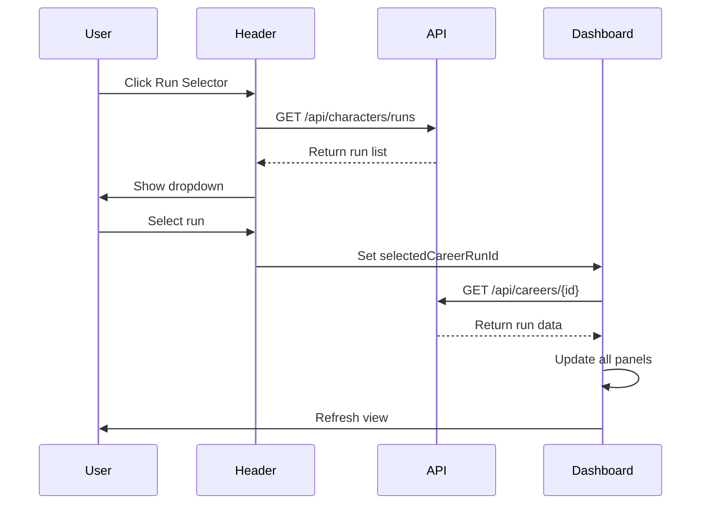
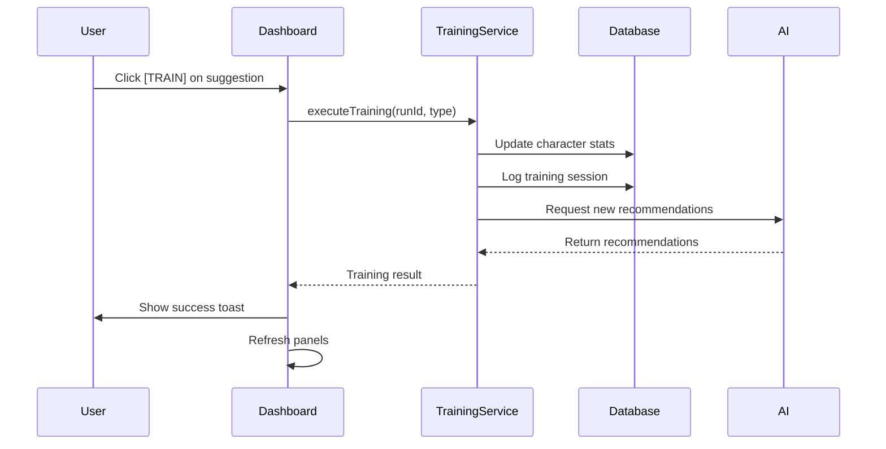
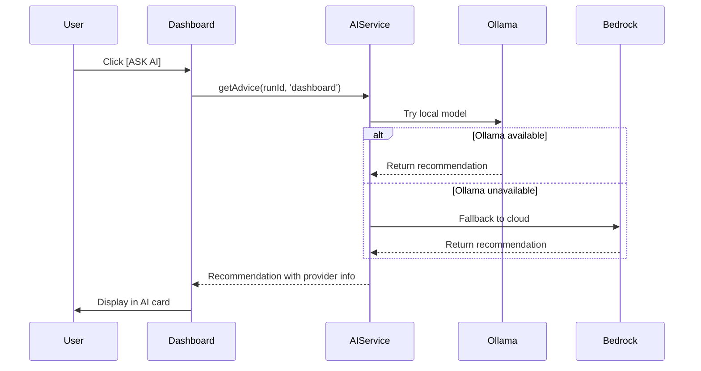

# WF-001: Dashboard Overview

## Umamusume Pretty Derby Career Planner

**Document Version**: 2.3.0  
**Date**: February 22, 2026  
**Related Documents**: [PRD-001], [SPEC-001], [FLOW-001], [SEQ-015]

**Source Specs**:

- `.kiro/specs/umamusume-career-planner-main/requirements.md` (Dashboard Requirements)
- `.kiro/specs/umamusume-career-planner-main/design.md` (Dashboard UI)

**Related Artifacts**:

- PRDs: [PRD-001](../prds/PRD-001_Character_Management.md), [PRD-006](../prds/PRD-006_AI_Advisory.md)
- SPECs: [SPEC-001](../specs/SPEC-001_Character_Management_Technical.md), [SPEC-006](../specs/SPEC-006_AI_Advisory_Technical.md)
- Flows: [FLOW-001](../flows/FLOW-001_Character_Management_System.md), [FLOW-006](../flows/FLOW-006_AI_Advisory_System.md)
- Tech Flows: [TECH-FLOW-001](../tech-flow/TECH-FLOW-001_Character_Management_Flow.md)
- Sequences: [SEQ-015](../sequences/SEQ-015_Data_Migration_Snapshot_to_Live.md)
- User Flows: [UF-001](../user-flows/UF-001_Dashboard_Navigation_Flow.md)

---

## 1. Overview

### 1.1 Purpose

The Dashboard serves as the primary landing page and command center for the Umamusume Career Planner application. It provides users with an at-a-glance overview of their active career runs, recent activity, performance metrics, and quick access to core features.

### 1.2 Key Objectives

| Objective                | Description                                                            |
| ------------------------ | ---------------------------------------------------------------------- |
| **Information Density**  | Display maximum relevant information without overwhelming the user     |
| **Quick Navigation**     | Enable 1-2 click access to all major features                          |
| **Contextual Awareness** | Show current character state, upcoming events, and recommended actions |
| **Performance Insights** | Highlight stat progression and goal tracking                           |
| **AI Integration**       | Surface intelligent recommendations and insights                       |

### 1.3 User Stories

| ID     | User Story                                                         | Priority |
| ------ | ------------------------------------------------------------------ | -------- |
| US-001 | As a player, I want to see all my active career runs at a glance   | P0       |
| US-002 | As a player, I want to quickly access my most recent character     | P0       |
| US-003 | As a player, I want to see upcoming races and training suggestions | P0       |
| US-004 | As a player, I want AI recommendations visible on the dashboard    | P1       |
| US-005 | As a player, I want to see my goal progress without drilling down  | P1       |

---

## 2. Layout Specifications

### 2.1 Desktop Layout (≥1024px)

```


┌──────────────────────────────────────────────────────────────────────┐
│ [≡] Menu  |  Run: Mejiro Ardan (URA Finals)         |  [?] Help      │
├──────────────────────────────────────────────────────────────────────┤
│ ┌──────────────────────┬──────────────────────┬────────────────────┐ │
│ │ 📅 Year 3 JAN 1     │ ⚡ Energy: 78/100    │ 😀 Mood: Good      │ │
│ │ 33 Turns Remaining   │ [Rest/Item]          │ [Condition Details]│ │
│ └──────────────────────┴──────────────────────┴────────────────────┘ │
├──────────────────────────────────────────────────────────────────────┤
│                                                                      │
│ ┌─────────────────┐  ┌─────────────────────────┐  ┌────────────────┐ │
│ │ Stats Overview  │  │      Main Content       │  │ Upcoming Race  │ │
│ │ (Soft Cap:1200) │  │                         │  │                │ │
│ │   [Speed] A     │  │    [Character Art]      │  │  JAN 2 (G2)    │ │
│ │   980 / 1200▼   │  │                         │  │  Nikkei Cup    │ │
│ │                 │  │    [Speech Bubble]      │  │  2400m Turf    │ │
│ │   [Stamina] B   │  │    "AI: Focus on Speed  │  │                │ │
│ │   820 / 1200▼   │  │     training for G1"    │  │  Readiness:    │ │
│ │                 │  │                         │  │  [|||||||] 85% │ │
│ │   [Power] B     │  │                         │  │                │ │
│ │   780 / 1200▼   │  │                         │  │  [View Info]   │ │
│ │                 │  │                         │  │                │ │
│ │   [Guts] B      │  │                         │  └────────────────┘ │
│ │   760 / 1200▼   │  │                         │                     │ │
│ │                 │  │                         │  ┌────────────────┐ │
│ │   [Wit] A       │  │                         │  │ Current Goals  │ │
│ │   890 / 1200▼   │  │                         │  │                │ │
│ │                 │  │                         │  │ 1. Speed 800 ✓ │ │
│ │   [Skill Pt]    │  │                         │  │ 2. Win G1      │ │
│ │   450           │  │                         │  │    (Upcoming)  │ │
│ └─────────────────┘  └─────────────────────────┘  └────────────────┘ │
│ ▼ = Soft cap indicator (50% gains above 1200)                        │
│                                                                      │
│ ┌──────────────────────────────────────────────────────────────────┐ │
│ │ Command Grid                                                     │ │
│ ├──────────────┬──────────────┬──────────────┬───────────────┬─────┤ │
│ │              │              │              │               │     │ │
│ │ [⚡ Training] │ [✨ Skills]  │ [🏆 Race]    │ [💤 Rest]     │ ... │ │
│ │  Rec: Speed  │  2 New!      │  G2 Upcoming │  Recover 50   │     │ │
│ │              │              │              │               │     │ │
│ └──────────────┴──────────────┴──────────────┴───────────────┴─────┘ │
│                                                                      │
└──────────────────────────────────────────────────────────────────────┘

```

### 2.2 Tablet Layout (640px-1024px)

```


┌──────────────────────────────────────────────────────────┐
│ [≡] Menu | Run: Mejiro Ardan | [?] Help                  │
├──────────────────────────────────────────────────────────┤
│ ┌───────────────────────┬──────────────────────────────┐ │
│ │ 📅 Year 3 JAN 1      │ ⚡ Energy: 78/100             │ │
│ │ 33 Turns Left         │ 😀 Mood: Good                │ │
│ └───────────────────────┴──────────────────────────────┘ │
├──────────────────────────────────────────────────────────┤
│                                                          │
│ ┌──────────────────────────────────────────────────────┐ │
│ │ Main Content Area                                    │ │
│ │                                                      │ │
│ │    [Character Art Centered]                          │ │
│ │                                                      │ │
│ │    [Speech Bubble]                                   │ │
│ │    "AI: Focus on Speed for G1"                       │ │
│ │                                                      │ │
│ └──────────────────────────────────────────────────────┘ │
│                                                          │
│ ┌───────────────────────┬──────────────────────────────┐ │
│ │ Stats Overview        │ Current Goals                │ │
│ │ [Speed] A 980         │ 1. Speed 800 ✓               │ │
│ │ [Stamina] B 820       │ 2. Win G1 (Upcoming)         │ │
│ │ (Soft Cap: 1200)      │                              │ │
│ └───────────────────────┴──────────────────────────────┘ │
│                                                          │
│ ┌──────────────────────────────────────────────────────┐ │
│ │ Command Grid (Scrollable if needed)                  │ │
│ ├──────────────┬──────────────┬──────────────┬─────────┤ │
│ │ [⚡ Training] │ [✨ Skills]  │ [🏆 Race]    │ [💤]    │ │
│ │ Rec: Speed   │ 2 New!       │ G2 Upcoming  │ Rest    │ │
│ └──────────────┴──────────────┴──────────────┴─────────┘ │
│                                                          │
└──────────────────────────────────────────────────────────┘


```

### 2.3 Mobile Layout (<640px)

```


┌────────────────────────────┐
│ [≡] [Run: Ardan]       [?] │
├────────────────────────────┤
│ 📅 Yr 3 JAN 1  | ⚡ 78    │
│ 😀 Good        | 33 Left  │
├────────────────────────────┤
│                            │
│  [Character Art Centered]  │
│                            │
│  [Speech Bubble]           │
│  "AI: Focus Speed..."      │
│                            │
├────────────────────────────┤
│ Stats (Collapsible) ▼      │
│ Speed: A (980)             │
│ Stamina: B (820)           │
│ (Soft Cap: 1200)           │
├────────────────────────────┤
│ Goals: Speed 800 ✓         │
├────────────────────────────┤
│ Next Race: JAN 2 (G2)      │
├────────────────────────────┤
│                            │
│ COMMANDS                   │
│ ┌──────┐ ┌──────┐ ┌──────┐ │
│ │  ⚡  │ │  ✨  │ │  🏆  │ │
│ │Train │ │Skill │ │Race  │ │
│ └──────┘ └──────┘ └──────┘ │
│ ┌──────┐ ┌──────┐ ┌──────┐ │
│ │  💤  │ │  🏥  │ │  🛫  │ │
│ │Rest  │ │Clinic│ │Trip  │ │
│ └──────┘ └──────┘ └──────┘ │
│                            │
└────────────────────────────┘
│ [🏠] [👤] [⚡] [🏆] [🤖]   │
└────────────────────────────┘


```

---

## 3. Component Specifications

### 3.1 App Header

**Component**: `resources/views/components/app-header.blade.php`

| Element           | Description                                   | Interactions                           |
| ----------------- | --------------------------------------------- | -------------------------------------- |
| **Logo**          | Application branding, home link               | Click → Navigate to dashboard          |
| **Run Selector**  | Dropdown to switch between active career runs | Select → Load selected run context     |
| **Notifications** | Bell icon with badge count                    | Click → Open notifications panel       |
| **User Menu**     | Avatar/name with dropdown                     | Click → Show profile, settings, logout |

**States**:

- Default
- Dropdown open (run selector)
- Dropdown open (user menu)
- Notifications panel open

**Accessibility**:

- `aria-label="Main navigation"`
- Keyboard navigation: Tab, Enter, Escape
- Screen reader announcements for run changes

### 3.2 Sidebar Navigation

**Component**: `resources/views/components/sidebar.blade.php`

| Item          | Icon | Route            | Active Indicator         |
| ------------- | ---- | ---------------- | ------------------------ |
| Dashboard     | 🏠   | `/dashboard`     | Left border + background |
| Character     | 👤   | `/characters`    | Left border + background |
| Training      | ⚡   | `/training`      | Left border + background |
| Races         | 🏆   | `/races`         | Left border + background |
| Skills        | ✨   | `/skills`        | Left border + background |
| Support Cards | 🎴   | `/support-cards` | Left border + background |
| AI Advisor    | 🤖   | `/ai-advisor`    | Left border + background |
| Settings      | ⚙️   | `/settings`      | Left border + background |

**Responsive Behavior**:

- Desktop (≥1024px): Fixed left sidebar, always visible
- Tablet (640-1024px): Collapsible sidebar, toggle button
- Mobile (<640px): Hidden, replaced by bottom navigation

**Accessibility**:

- `role="navigation"`
- `aria-current="page"` for active item
- Keyboard focus management

### 3.3 Current Goals Panel

**Component**: `app/Livewire/Dashboard/GoalsPanel.php`

**Data Structure**:

```php
[
    'short_term' => [
        ['type' => 'stat', 'target' => 'speed', 'value' => 800, 'current' => 520, 'progress' => 65],
        ['type' => 'race', 'target' => 'Win G1 Race', 'status' => 'upcoming']
    ],
    'long_term' => [
        ['type' => 'achievement', 'target' => 'URA Finals Champion', 'turns_remaining' => 33]
    ]
]
```

**Visual Elements**:

- Goal title
- Progress bar (0-100%)
- Current/Target values
- Status icon (✓ complete, ⚠️ at risk, ○ in progress)
- Edit button (inline)

**Interactions**:

- Click progress bar → Navigate to goal detail
- Click edit icon → Open goal editor modal
- Click + Add Goal → Open goal creation form

### 3.4 Stat Snapshot Panel

**Component**: `app/Livewire/Dashboard/StatSnapshot.php`

**Display Format** (with Soft Cap Indicator):

```
Speed    A  (980)  ████████████████████ 81.7%  [1200 soft cap ▼]
Stamina  B  (820)  ████████████████░░░░ 68.3%
Power    B  (780)  ███████████████░░░░░ 65.0%
Guts     B  (760)  ██████████████░░░░░░ 63.3%
Wit      A  (890)  █████████████████░░░ 74.2%
```

**Note**: Stats can exceed 1200 but gain at 50% rate above soft cap.

**Grade Scale** (Game-Accurate - S is Maximum):

| Grade | Range     | Color      | Notes                                    |
| ----- | --------- | ---------- | ---------------------------------------- |
| S     | 1100+     | Gold       | Maximum grade (no SS exists in game)     |
| A     | 901-1099  | Purple     | Key breakpoint at 901                    |
| B     | 701-900   | Red        |                                          |
| C     | 501-700   | Orange     |                                          |
| D     | 301-500   | Yellow     |                                          |
| E     | 101-300   | Green      |                                          |
| F     | 51-100    | Blue       |                                          |
| G     | 0-50      | Gray       | Lowest grade                             |

**Stat Cap System**:

- **Soft Cap**: 1200 (stats above this gain at 50% rate)
- **Per-Training Cap**: +100 (reduced to +50 if stat > 1200)
- **Important Breakpoints**: 901 (A grade), 1200 (soft cap), 1600 (practical max)

**Aptitudes Display**:

- Distance aptitudes (Sprint, Mile, Medium, Long)
- Surface aptitudes (Turf, Dirt)
- Running style aptitudes (Nige, Senkou, Sashi, Oikomi)
- Displayed as compact chips with grade

**Interactions**:

- Click stat bar → Navigate to character detail
- Hover stat bar → Show tooltip with exact value and rank

### 3.5 Upcoming Races Panel

**Component**: `app/Livewire/Dashboard/UpcomingRaces.php`

**Data Structure**:

```php
[
    [
        'date' => 'Jan 15',
        'name' => 'Kanto Okami Cup',
        'grade' => 'G1',
        'distance' => 2400,
        'surface' => 'Turf',
        'readiness' => 85,
        'win_probability' => 35
    ],
    // ... up to 3 races
]
```

**Visual Elements**:

- Race date
- Race name and grade badge
- Distance and surface icons
- Readiness percentage (color-coded)
- Action buttons: [ENTER] [PREP]

**Readiness Color Coding**:

| Range  | Color  | Status    |
| ------ | ------ | --------- |
| ≥85%   | Green  | Excellent |
| 70-84% | Yellow | Good      |
| 55-69% | Orange | Fair      |
| <55%   | Red    | Poor      |

**Interactions**:

- Click race card → Navigate to race detail
- Click [ENTER] → Register for race (confirmation modal)
- Click [PREP] → Navigate to race preparation screen

### 3.6 Training Suggestions Panel

**Component**: `app/Livewire/Dashboard/TrainingSuggestions.php`

**Data Source**: `TrainingPredictionService`

**Display Format**:

```
1. Speed Training
   Predicted Gains: +45 Speed, +5 Stamina
   Risk: Low (12%)
   Support: Mejiro Dober (+12), Tokai Teio (+8)
   [TRAIN]

2. Stamina Training
   Predicted Gains: +42 Stamina, +3 Guts
   Risk: Medium (18%)
   Support: Kitasan Black (+15)
   [TRAIN]

3. Power Training
   Predicted Gains: +38 Power, +2 Speed
   Risk: Low (14%)
   Support: Mejiro Dober (+12)
   [TRAIN]
```

**Ranking Algorithm**:

- Alignment with current goals (40% weight)
- Risk assessment (30% weight)
- Stat gain efficiency (20% weight)
- Support card bonuses (10% weight)

**Interactions**:

- Click [TRAIN] → Execute training (confirmation if high risk)
- Click suggestion card → Navigate to training detail with pre-selection

### 3.7 Mood/Energy Widget

**Component**: `app/Livewire/Dashboard/MoodEnergyWidget.php`

**Display Elements**:

```
┌────────────────────────┐
│ Mood: Good (+2%)       │
│ ████████░░ 78/100      │
│                        │
│ Condition: Normal      │
│                        │
│ [RECOVERY OPTIONS]     │
└────────────────────────┘
```

**Mood States** (Game-Accurate):

| Mood      | Modifier | Icon | Color       |
| --------- | -------- | ---- | ----------- |
| Great     | +20%     | 😊   | Green       |
| Good      | +10%     | 🙂   | Light Green |
| Normal    | 0%       | 😐   | Gray        |
| Bad       | -10%     | 🙁   | Orange      |
| Very Bad  | -20%     | 😞   | Red         |

**Energy Bar**:

- Range: 0-100
- Color coding:
  - Green: 70-100
  - Yellow: 40-69
  - Red: 0-39

**Condition Indicators**:

- Status effects (positive/negative)
- Icons for common conditions
- Tooltip with effect details

**Interactions**:

- Click [RECOVERY OPTIONS] → Open recovery modal (Rest, Items, etc.)
- Hover mood/energy → Show tooltip with effects on training

### 3.8 AI Advisor Card

**Component**: `app/Livewire/Dashboard/AIAdvisorCard.php`

**Data Source**: `AIAdvisoryService` (last recommendation or contextual insight)

**Display Format**:

```
┌────────────────────────────────────┐
│ 💡 AI Recommendation               │
│                                    │
│ Focus on Speed training for the    │
│ next 3 turns to prepare for the    │
│ upcoming G1 race. Your stamina is  │
│ adequate, but speed needs +150.    │
│                                    │
│ Confidence: 85%                    │
│ Provider: Ollama Local             │
│                                    │
│ [ASK AI] [VIEW DETAILS] [DISMISS]  │
└────────────────────────────────────┘
```

**States**:

- No recommendation available (show prompt to ask)
- Recommendation present
- Loading (AI generating)
- Error (fallback message)

**Interactions**:

- Click [ASK AI] → Open AI advisor full interface
- Click [VIEW DETAILS] → Expand recommendation with reasoning
- Click [DISMISS] → Hide card (persist state)
- Click card body → Navigate to AI advisor with context

**Badge Indicators**:

- 💡 New recommendation
- ⚡ Ollama (local)
- ☁️ Bedrock (cloud)

### 3.9 Recent Activity Timeline

**Component**: `app/Livewire/Dashboard/ActivityTimeline.php`

**Data Source**: `activity_log` table (last 10 events)

**Event Types**:

| Type     | Icon | Format                                    |
| -------- | ---- | ----------------------------------------- |
| Training | ⚡   | "Turn X: [Type] Training (+Y [Stat])"     |
| Race     | 🏆   | "Turn X: Race [Result] ([Name], [Grade])" |
| Skill    | ✨   | "Turn X: Skill Acquired ([Name])"         |
| Goal     | 🎯   | "Turn X: Goal Completed ([Name])"         |
| Event    | 📅   | "Turn X: Event Triggered ([Name])"        |

**Visual Design**:

```
○ Turn 45: Speed Training (+48 Speed)          [2 min ago]
○ Turn 44: Skill Acquired (Lane Guidance)      [1 hour ago]
● Turn 43: Race Won (2nd Place, G2)            [3 hours ago]
○ Turn 42: Power Training (+35 Power)          [1 day ago]
○ Turn 41: Goal Completed (Speed 500)          [1 day ago]
```

**Highlighted Events**:

- Filled circle (●) for significant events (race wins, goal completions)
- Open circle (○) for regular events

**Interactions**:

- Click event → Navigate to detail view (training result, race result, etc.)
- Hover event → Show tooltip with full details

---

## 4. State Management

### 4.1 Livewire Component State

**Dashboard Controller**: `app/Livewire/Dashboard.php`

**State Properties**:

```php
public ?int $selectedCharacterId = null;
public ?int $selectedCareerRunId = null;
public string $view = 'overview'; // overview, compact, detailed
public bool $showAICard = true;
public array $filters = [];
```

**Computed Properties**:

```php
public function getStatsProperty()
{
    return $this->selectedCharacterRun?->current_stats ?? [];
}

public function getUpcomingRacesProperty()
{
    return $this->raceService->getUpcomingRaces($this->selectedCharacterRun, 3);
}

public function getTrainingSuggestionsProperty()
{
    return $this->trainingService->getPredictions($this->selectedCharacterRun);
}
```

### 4.2 Cache Strategy

| Data Type            | Cache Key                    | TTL        | Invalidation                   |
| -------------------- | ---------------------------- | ---------- | ------------------------------ |
| Training predictions | `predictions:{run_id}`       | 5 minutes  | On training execution          |
| Upcoming races       | `races:upcoming:{run_id}`    | 1 hour     | On race entry/result           |
| AI recommendations   | `ai:recommendation:{run_id}` | 10 minutes | On new query or context change |
| Stat snapshot        | `stats:{run_id}`             | 1 minute   | On stat update                 |
| Activity timeline    | `activity:{run_id}`          | 30 seconds | On new activity                |

### 4.3 Real-time Updates (WebSocket)

**Channels**:

- `character.{id}` - Character state changes
- `career.{id}` - Career run updates
- `user.{id}` - User notifications

**Events**:

```javascript
// Listen for character updates
Echo.private(`character.${characterId}`)
    .listen("CharacterStatsUpdated", (e) => {
        Livewire.emit("refreshStats", e.stats);
    })
    .listen("TrainingCompleted", (e) => {
        Livewire.emit("refreshActivity");
    });
```

---

## 5. Interaction Patterns

### 5.1 Run Selection Flow



### 5.2 Training Execution Flow



### 5.3 AI Advisor Interaction Flow



---

## 6. Accessibility Specifications

### 6.1 WCAG 2.2 AA Compliance

| Criterion                   | Implementation                     | Test Method              |
| --------------------------- | ---------------------------------- | ------------------------ |
| **1.1.1 Non-text Content**  | All icons have `aria-label`        | Screen reader testing    |
| **1.4.3 Contrast Ratio**    | 4.5:1 minimum for text             | Color contrast analyzer  |
| **2.1.1 Keyboard**          | All interactive elements focusable | Keyboard-only navigation |
| **2.4.3 Focus Order**       | Logical focus sequence             | Tab key traversal        |
| **2.4.7 Focus Visible**     | Clear focus indicators             | Visual inspection        |
| **4.1.2 Name, Role, Value** | Proper ARIA attributes             | axe-core automated scan  |

### 6.2 Keyboard Navigation

| Action            | Shortcut            | Context   |
| ----------------- | ------------------- | --------- |
| Navigate panels   | `Tab` / `Shift+Tab` | Global    |
| Open run selector | `Alt+R`             | Header    |
| Open user menu    | `Alt+U`             | Header    |
| Focus sidebar     | `Alt+S`             | Global    |
| Refresh dashboard | `F5` or `Ctrl+R`    | Dashboard |
| Open AI advisor   | `Alt+A`             | Dashboard |

### 6.3 Screen Reader Announcements

**Live Regions**:

```html
<!-- Stats update announcement -->
<div aria-live="polite" aria-atomic="true" class="sr-only">
    Stats updated: Speed increased to 980
</div>

<!-- Training completion announcement -->
<div aria-live="assertive" aria-atomic="true" class="sr-only">
    Training completed successfully. Speed increased by 48 points.
</div>

<!-- Race reminder announcement -->
<div aria-live="polite" aria-atomic="true" class="sr-only">
    Upcoming race in 2 days: Kanto Okami Cup, G1
</div>
```

---

## 7. Performance Specifications

### 7.1 Performance Targets

| Metric                       | Target | Measurement         |
| ---------------------------- | ------ | ------------------- |
| **Initial Load**             | < 2.0s | Time to Interactive |
| **First Contentful Paint**   | < 1.5s | Lighthouse          |
| **Largest Contentful Paint** | < 2.5s | Lighthouse          |
| **Time to Interactive**      | < 3.0s | Lighthouse          |
| **Cumulative Layout Shift**  | < 0.1  | Lighthouse          |

### 7.2 Optimization Strategies

| Strategy               | Implementation                     | Impact                |
| ---------------------- | ---------------------------------- | --------------------- |
| **Lazy Loading**       | Defer non-critical components      | -40% initial bundle   |
| **Code Splitting**     | Separate vendor and app bundles    | -30% main bundle      |
| **Image Optimization** | WebP format, responsive images     | -50% image size       |
| **Cache First**        | Service worker caching             | -70% repeat load time |
| **Database Indexing**  | Indexed queries for dashboard data | -60% query time       |

### 7.3 Bundle Size Budget

| Asset Type | Budget | Current | Status           |
| ---------- | ------ | ------- | ---------------- |
| JavaScript | 150 KB | 142 KB  | ✅ Within budget |
| CSS        | 50 KB  | 48 KB   | ✅ Within budget |
| Fonts      | 30 KB  | 28 KB   | ✅ Within budget |
| Images     | 200 KB | 185 KB  | ✅ Within budget |
| Total      | 430 KB | 403 KB  | ✅ Within budget |

---

## 8. Testing Specifications

### 8.1 Unit Tests

**Test File**: `tests/Unit/Livewire/DashboardTest.php`

```php
test('dashboard loads with active career run', function () {
    $user = User::factory()->create();
    $character = Character::factory()->for($user)->create();
    $run = CareerRun::factory()->for($character)->create(['status' => 'in_progress']);

    Livewire::actingAs($user)
        ->test(Dashboard::class, ['selectedCareerRunId' => $run->id])
        ->assertSee($character->name)
        ->assertSee($run->current_turn);
});

test('training suggestions are ranked correctly', function () {
    $run = CareerRun::factory()->create();

    Livewire::test(Dashboard::class, ['selectedCareerRunId' => $run->id])
        ->assertViewHas('trainingSuggestions', function ($suggestions) {
            return count($suggestions) > 0 && $suggestions[0]['rank'] === 1;
        });
});
```

### 8.2 Feature Tests

**Test File**: `tests/Feature/DashboardFeatureTest.php`

```php
test('user can switch between career runs', function () {
    $user = User::factory()->create();
    $run1 = CareerRun::factory()->create(['user_id' => $user->id]);
    $run2 = CareerRun::factory()->create(['user_id' => $user->id]);

    $this->actingAs($user)
        ->get('/dashboard')
        ->assertOk();

    Livewire::actingAs($user)
        ->test(Dashboard::class)
        ->set('selectedCareerRunId', $run2->id)
        ->assertEmitted('careerRunChanged')
        ->assertViewHas('selectedCareerRun', $run2);
});
```

### 8.3 E2E Tests (Playwright)

**Test File**: `tests/e2e/dashboard.spec.js`

```javascript
test.describe("Dashboard Overview", () => {
    test("displays all core panels", async ({ page }) => {
        await page.goto("/dashboard");

        await expect(page.getByTestId("goals-panel")).toBeVisible();
        await expect(page.getByTestId("stats-snapshot")).toBeVisible();
        await expect(page.getByTestId("upcoming-races")).toBeVisible();
        await expect(page.getByTestId("training-suggestions")).toBeVisible();
        await expect(page.getByTestId("ai-advisor-card")).toBeVisible();
    });

    test("executes training from suggestion", async ({ page }) => {
        await page.goto("/dashboard");

        await page
            .getByTestId("training-suggestion-1")
            .getByRole("button", { name: "TRAIN" })
            .click();

        await expect(page.getByRole("alert")).toContainText(
            "Training completed",
        );
        await expect(page.getByTestId("stats-snapshot")).toContainText(
            /Speed.*\d+/,
        );
    });
});
```

### 8.4 Accessibility Tests

**Test File**: `tests/e2e/accessibility/dashboard.spec.js`

```javascript
import { test, expect } from "@playwright/test";
import AxeBuilder from "@axe-core/playwright";

test.describe("Dashboard Accessibility", () => {
    test("should not have any automatically detectable accessibility issues", async ({
        page,
    }) => {
        await page.goto("/dashboard");

        const accessibilityScanResults = await new AxeBuilder({ page })
            .withTags(["wcag2a", "wcag2aa", "wcag21a", "wcag21aa"])
            .analyze();

        expect(accessibilityScanResults.violations).toEqual([]);
    });

    test("supports keyboard navigation", async ({ page }) => {
        await page.goto("/dashboard");

        await page.keyboard.press("Tab");
        await expect(page.getByTestId("run-selector")).toBeFocused();

        await page.keyboard.press("Tab");
        await expect(page.getByTestId("notifications-button")).toBeFocused();
    });
});
```

---

## 9. Related Documentation

### 9.1 Specifications

| Document                  | Reference                                                    |
| ------------------------- | ------------------------------------------------------------ |
| System Requirements       | [003_SRS](../003_SRS_Software_Requirement_Specifications.md) |
| System Design             | [004_SDS](../004_SDS_Software_Design_Specifications.md)      |
| Source Code Documentation | [010_SCD](../010_SCD_Source_Code_Documentation.md)           |
| Database Documentation    | [009_DBD](../009_DBD_Database_Documentation.md)              |

### 9.2 User Documentation

| Document           | Reference                                                   |
| ------------------ | ----------------------------------------------------------- |
| User Manual        | [017_SUM](../017_SUM_Software_User_Manual.md)               |
| User Flow Diagrams | [UF-001](../user-flows/UF-001_Dashboard_Navigation_Flow.md) |

### 9.3 Development Planning

| Document                  | Reference                                          |
| ------------------------- | -------------------------------------------------- |
| Software Development Plan | [001_SDP](../001_SDP_Software_Development_Plan.md) |
| Integration Plan          | [007_SIP](../007_SIP_Software_Integration_Plan.md) |

---

## 10. Version History

| Version | Date       | Author           | Changes                                                                                                                                                                       |
| ------- | ---------- | ---------------- | ----------------------------------------------------------------------------------------------------------------------------------------------------------------------------- |
| 2.3.0   | 2026-02-22 | Development Team | Updated version/dates, aligned technology references with current stack (Livewire 4, Neuron AI v2.11, GameTora/umapyoi.net) |
| 2.2.0   | 2026-01-28 | Development Team | Updated with verified game mechanics from Global English Server: corrected stat grade scale (S is max, no SS), mood system (+20%/-20% range), soft cap at 1200, career structure ~70-78 turns |
| 2.0.0   | 2026-01-24 | Development Team | Comprehensive update aligned with v2.0.0 implementation; added AI integration, real-time updates, accessibility specifications, performance targets, and testing requirements |
| 1.0.0   | 2026-01-14 | Development Team | Initial wireframe specification                                                                                                                                               |

---

## 11. Notes

**Implementation Status**: ✅ Complete

**Known Issues**: None

**Future Enhancements**:

- Customizable dashboard layout (drag-and-drop panels)
- Widget marketplace for community-created panels
- Advanced filtering and sorting options
- Multi-character comparison view

---

_This wireframe specification reflects the current implementation of the Dashboard Overview and serves as the authoritative reference for UI/UX development and testing._
