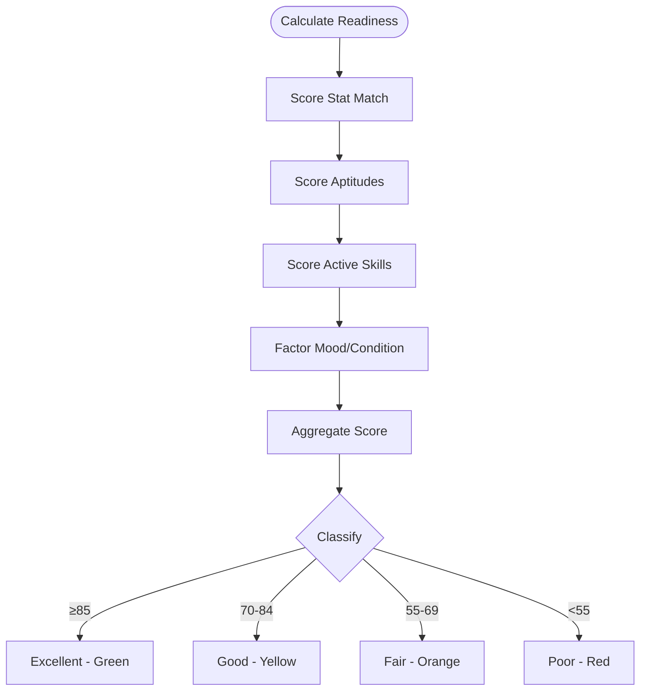
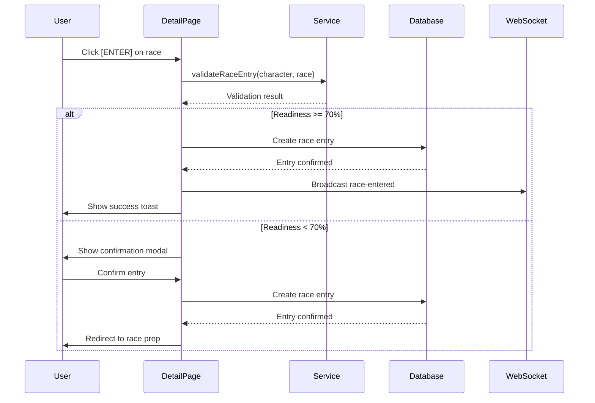
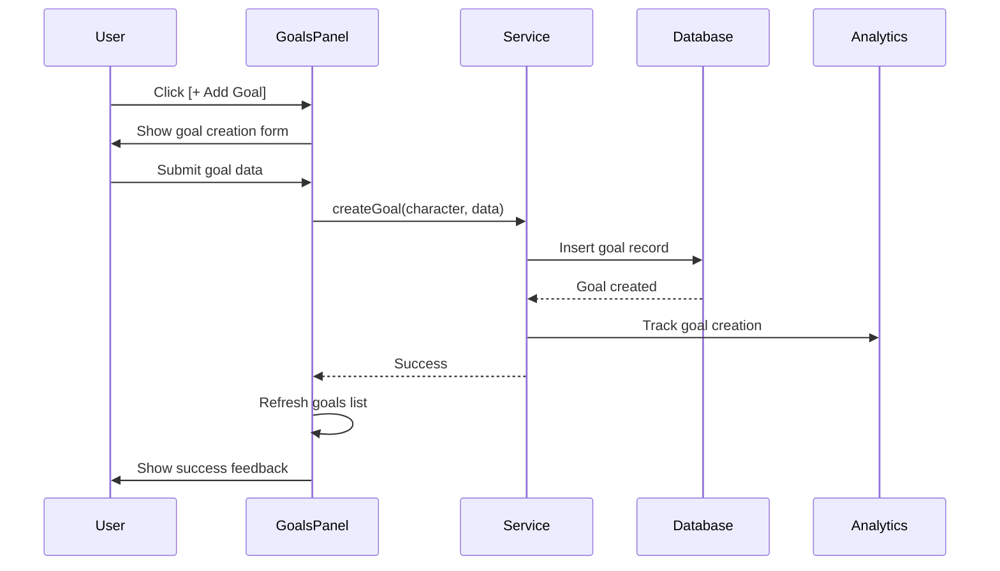
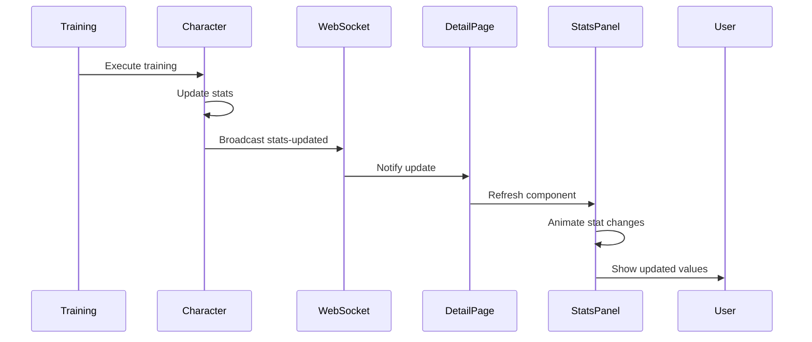

# WF-003: Character Detail & Management

## Umamusume Pretty Derby Career Planner

**Document Version**: 2.2.0  
**Date**: January 28, 2026  
**Related Documents**: [PRD-001], [SPEC-001], [FLOW-001], [SEQ-001]

**Source Specs**:

- `.kiro/specs/umamusume-career-planner-main/requirements.md` (Requirement 1: Character State Management)
- `.kiro/specs/umamusume-career-planner-main/design.md` (Character Detail UI)

**Related Artifacts**:

- PRD: [PRD-001](../prds/PRD-001_Character_Management.md)
- SPEC: [SPEC-001](../specs/SPEC-001_Character_Management_Technical.md)
- Flow: [FLOW-001](../flows/FLOW-001_Character_Management_System.md)
- Tech Flow: [TECH-FLOW-001](../tech-flow/TECH-FLOW-001_Character_Management_Flow.md)
- Sequences: [SEQ-001](../sequences/SEQ-001_Character_Creation_Sequence.md)
- User Flows: [UF-002](../user-flows/UF-002_Career_Setup_Flow.md)
- Related WF: [WF-002](WF-002_Character_Creation_Wizard.md), [WF-001](WF-001_Dashboard_Overview.md)

---

## 1. Overview

### 1.1 Purpose

The Character Detail & Management screen provides a comprehensive view and management interface for individual career runs. It serves as the central hub for monitoring character state, tracking progression, managing goals, and accessing training/race features.

### 1.2 Key Objectives

| Objective             | Description                                                 |
| --------------------- | ----------------------------------------------------------- |
| **State Overview**    | Complete view of current character state and progression    |
| **Goal Tracking**     | Visual progress toward short-term and long-term objectives  |
| **Quick Actions**     | One-click access to training, races, skills, and AI advisor |
| **Analytics Display** | Stat trends, race history, and performance metrics          |
| **Real-time Updates** | Live stat updates via WebSocket connections                 |

### 1.3 User Stories

| ID     | User Story                                                     | Priority |
| ------ | -------------------------------------------------------------- | -------- |
| US-001 | As a player, I want to see all my character stats at a glance  | P0       |
| US-002 | As a player, I want to track my progress toward goals visually | P0       |
| US-003 | As a player, I want quick access to training and race actions  | P0       |
| US-004 | As a player, I want to see my upcoming race schedule           | P0       |
| US-005 | As a player, I want to manage my support deck from this view   | P1       |

---

## 2. Layout Specifications

### 2.1 Desktop Layout (≥1024px)

```
┌──────────────────────────────────────────────────────────────────────┐
│ [≡] Menu  |  Character: Mejiro Ardan                |  [?] Help      │
├──────────────────────────────────────────────────────────────────────┤
│ ┌──────────────────────┬──────────────────────┬────────────────────┐ │
│ │ 📛 Rank: A (Top 15%)│ 👥 Fans: 320,000     │ 🏆 Wins: 14        │ │
│ │ 📅 Senior Year FEB 1│ ⚡ Energy: --        │ 😀 Mood: --        │ │
│ └──────────────────────┴──────────────────────┴────────────────────┘ │
├──────────────────────────────────────────────────────────────────────┤
│                                                                      │
│ ┌──────────────────────┐  ┌────────────────────────────────────────┐ │
│ │ Character Portrait   │  │ [Stats] [Skills] [History] [Factors]   │ │
│ │                      │  ├────────────────────────────────────────┤ │
│ │   Mejiro Ardan       │  │ Stats Overview (Soft Cap: 1200)        │ │
│ │   [★★★★★] Lvl 5      │  │                                        │ │
│ │   "Eternal Beauty"   │  │        [Speed]  980 (A)                │ │
│ │                      │  │    [Wit]           [Stamina]           │ │
│ │   [Edit] [Share]     │  │  890 (A)     ⬡     820 (B)             │ │
│ │                      │  │                                        │ │
│ └──────────────────────┘  │    [Guts]          [Power]             │ │
│                           │  760 (B)           780 (B)             │ │
│                           │                                        │ │
│                           │ Aptitudes (S is max, no SS):           │ │
│                           │ 🏟️ Turf: A   Dirt: B                  │ │
│                           │ 📏 Mile: S   Med: A   Lng: B           │ │
│                           │ 🏃 Nige: A   Senk: B  Sashi: G Oiko: G │ │
│                           │                                        │ │
│                           │ Unique Skill:                          │ │
│                           │ ✨ "Function of the Future" (Lvl 4)    │ │
│                           └────────────────────────────────────────┘ │
│                                                                      │
│ ┌──────────────────────────────────────────────────────────────────┐ │
│ │ Active Skills                                                    │ │
│ ├───────────────────────┬──────────────────────┬───────────────────┤ │
│ │ [Gold] Arc Maestro    │ [White] Corner Pro   │ [White] Slipstrm  │ │
│ │ [Gold] One Chance     │ [White] Focus        │ ...               │ │
│ └───────────────────────┴──────────────────────┴───────────────────┘ │
│                                                                      │
└──────────────────────────────────────────────────────────────────────┘
```

### 2.2 Tablet Layout (640px-1024px)

```
┌────────────────────────────────────────────────────┐
│ Character Detail: Mejiro Ardan              [≡]   │
├────────────────────────���───────────────────────────┤
│ ☰ Menu Toggle                                      │
├────────────────────────────────────────────────────┤
│                                                    │
│ ┌──────────────────────────────────────────────┐  │
│ │ Character Overview                            │  │
│ │ [Portrait] Mejiro Ardan                      │  │
│ │ Turn 45/78 | Senior Year                     │  │
│ │ Energy: 78% | Mood: Good                     │  │
│ │                                              │  │
│ │ [Edit] [Duplicate] [Delete]                  │  │
│ └──────────────────────────────────────────────┘  │
│                                                    │
│ ┌──────────────────────────────────────────────┐  │
│ │ Stats & Goals                                 │  │
│ │ ┌────────────────┬──────────────────────┐    │  │
│ │ │ Speed  A (980) │ Goal: 800 ███░░ 65%  │    │  │
│ │ │ Stamina B+(820)│ Goal: 600 ███░░ 45%  │    │  │
│ │ │ Power  B (780) │ Win G1: Upcoming     │    │  │
│ │ └────────────────┴──────────────────────┘    │  │
│ │                                              │  │
│ │ [View Details] [Add Goal]                    │  │
│ └──────────────────────────────────────────────┘  │
│                                                    │
│ ┌──────────────────────────────────────────────┐  │
│ │ Upcoming Races                                │  │
│ │ • Jan 15: G1 Kanto | Ready: 85% ✓            │  │
│ │ • Jan 29: G2 Kyoto | Ready: 72% ⚠️           │  │
│ │                                              │  │
│ │ [View Calendar]                              │  │
│ └──────────────────────────────────────────────┘  │
│                                                    │
│ ┌──────────────────────────────────────────────┐  │
│ │ Support Deck (6 cards)                        │  │
│ │ Horizontal scroll with card avatars          │  │
│ │ [Edit Deck]                                  │  │
│ └──────────────────────────────────────────────┘  │
│                                                    │
│ ┌──────────────────────────────────────────────┐  │
│ │ Skills: 22 | SP: 450/2400                     │  │
│ │ [Manage Skills]                              │  │
│ └──────────────────────────────────────────────┘  │
│                                                    │
│ ┌──────────────────────────────────────────────┐  │
│ │ AI Advisor                                    │  │
│ │ Latest recommendation + quick actions        │  │
│ └──────────────────────────────────────────────┘  │
│                                                    │
│ ┌──────────────────────────────────────────────┐  │
│ │ Recent Activity (Collapsible)                 │  │
│ │ Last 5 actions                               │  │
│ └──────────────────────────────────────────────┘  │
│                                                    │
└────────────────────────────────────────────────────┘
```

### 2.3 Mobile Layout (<640px)

```
┌──────────────────────────────┐
│ Mejiro Ardan           [≡]  │
├──────────────────────────────┤
│                              │
│ ┌──────────────────────────┐ │
│ │   [Portrait]             │ │
│ │   Turn 45/78             │ │
│ └──────────────────────────┘ │
│                              │
│ Energy: ████████░░ 78%       │
│ Mood: Good 🙂                │
│                              │
│ [Edit] [Duplicate] [Delete]  │
│                              │
│ ─────────────────────────────│
│                              │
│ Stats (Collapsible)          │
│ ┌──────────────────────────┐ │
│ │ Speed    A  (980)        │ │
│ │ Stamina  B+ (820)        │ │
│ │ Power    B  (780)        │ │
│ │ [Show All]               │ │
│ └──────────────────────────┘ │
│                              │
│ ─────────────────────────────│
│                              │
│ Goals Progress               │
│ ┌──────────────────────────┐ │
│ │ Speed 800: 65% ███░░     │ │
│ │ Win G1: Upcoming         │ │
│ │ [+ Add Goal]             │ │
│ └──────────────────────────┘ │
│                              │
│ ─────────────────────────────│
│                              │
│ Next Race                    │
│ ┌──────────────────────────┐ │
│ │ Jan 15: Kanto G1         │ │
│ │ Readiness: 85% ✓         │ │
│ │ [ENTER] [PREP]           │ │
│ └──────────────────────────┘ │
│                              │
│ ─────────────────────────────│
│                              │
│ Support Deck                 │
│ Horizontal scroll chips      │
│ [Edit Deck]                  │
│                              │
│ ─────────────────────────────│
│                              │
│ Skills: 22 | SP: 450         │
│ [Manage]                     │
│                              │
│ ─────────────────────────────│
│                              │
│ AI Advisor                   │
│ Latest tip + [Ask AI]        │
│                              │
│ ─────────────────────────────│
│                              │
│ Recent Activity (Collapsed)  │
│ [Expand ▼]                   │
│                              │
└──────────────────────────────┘
│  Bottom Navigation Bar       │
│ [🏠][👤][⚡][🏆][🤖][⚙️]   │
└──────────────────────────────┘
```

---

## 3. Component Specifications

### 3.1 Character Overview Card

**Component**: `app/Livewire/Character/OverviewCard.php`

```php
class OverviewCard extends Component
{
    public Character $character;
    public CareerRun $careerRun;

    public function render()
    {
        return view('livewire.character.overview-card', [
            'currentTurn' => $this->careerRun->current_turn,
            'maxTurn' => 78,
            'careerStage' => $this->careerRun->career_stage,
            'scenario' => $this->careerRun->scenario_type,
            'energy' => $this->careerRun->energy,
            'mood' => $this->careerRun->mood,
            'conditions' => $this->careerRun->conditions,
            'nextRace' => $this->getNextRace(),
        ]);
    }

    private function getNextRace()
    {
        // Logic to find next scheduled race
    }
}
```

**Visual Elements**:

- Character portrait (120x120px)
- Character name and scenario
- Turn counter with progress bar
- Energy level with color coding
- Mood indicator with icon
- Active conditions badges
- Next race countdown

**States**:

- Default view
- Editing mode
- Loading state during updates

### 3.2 Stats Panel

**Component**: `app/Livewire/Character/StatsPanel.php`

| Element               | Description                                | Interactions                      |
| --------------------- | ------------------------------------------ | --------------------------------- |
| **Stat Bars**         | Visual representation with grade indicator | Hover → Show exact value and rank |
| **Grade Badges**      | Letter grade based on value                | Click → Show grade boundaries     |
| **Factor Indicators** | Star ratings for inherited bonuses         | Hover → Show source parent        |
| **Stat History**      | Link to progression chart                  | Click → Open modal with chart     |

**Stat Display Format**:

```
Speed    A  (980)  ████████████████████ 81.7%
Grade: A (850-949) | Rank: Top 15% | Growth: +20%
Factor Bonus: ★★☆ (+12 from Parent A)
```

**Color Coding**:

| Stat    | Color  | CSS Variable              |
| ------- | ------ | ------------------------- |
| Speed   | Blue   | `--stat-speed: #3399ff`   |
| Stamina | Green  | `--stat-stamina: #33cc99` |
| Power   | Red    | `--stat-power: #ff4d4d`   |
| Guts    | Orange | `--stat-guts: #ffa500`    |
| Wit     | Purple | `--stat-wisdom: #9933ff`  |

### 3.3 Goals Progress Panel

**Component**: `app/Livewire/Character/GoalsPanel.php`

```php
class GoalsPanel extends Component
{
    public Character $character;
    public Collection $goals;

    public $showAddGoalModal = false;

    public function addGoal($goalData)
    {
        $this->character->goals()->create($goalData);
        $this->goals = $this->character->goals()->active()->get();
        $this->showAddGoalModal = false;

        $this->dispatch('goal-added');
    }

    public function deleteGoal($goalId)
    {
        Goal::find($goalId)->delete();
        $this->goals = $this->character->goals()->active()->get();
    }

    public function render()
    {
        return view('livewire.character.goals-panel');
    }
}
```

**Goal Types**:

| Type              | Format                   | Example            |
| ----------------- | ------------------------ | ------------------ |
| Stat Target       | `{stat} ≥ {value}`       | "Speed ≥ 800"      |
| Race Win          | `Win {grade} race`       | "Win G1 race"      |
| Skill Acquisition | `Acquire {count} skills` | "Acquire 9 skills" |
| Turn Deadline     | `By turn {turn}`         | "By turn 60"       |

**Goal Status Indicators**:

| Status    | Icon | Color | Criteria             |
| --------- | ---- | ----- | -------------------- |
| Completed | ✅   | Green | Target achieved      |
| On Track  | 🟢   | Green | Progress ≥ expected  |
| At Risk   | 🟡   | Amber | Progress < expected  |
| Behind    | 🔴   | Red   | Unlikely to complete |

### 3.4 Upcoming Races Panel

**Component**: `app/Livewire/Character/UpcomingRaces.php`

**Data Structure**:

```php
[
    [
        'date' => 'Jan 15',
        'name' => 'Kanto Okami Cup',
        'grade' => 'G1',
        'distance' => 2400,
        'surface' => 'Turf',
        'readiness' => 85,
        'win_probability' => 35,
        'days_until' => 8,
    ],
    // ... up to 3 races
]
```

**Readiness Calculation**:



**Actions**:

- **[ENTER]**: Direct race entry (confirmation if readiness < 70%)
- **[PREP]**: Navigate to race preparation screen
- **[View Calendar]**: Open full race calendar

### 3.5 Support Deck Summary

**Component**: `app/Livewire/Character/SupportDeckSummary.php`

**Display Format**:

```
┌────────────────┬────────────────┬────────────────┐
│ [Card Portrait]│ [Card Portrait]│ [Card Portrait]│
│ Mejiro Dober   │ Tokai Teio     │ Kitasan Black  │
│ SSR · Power    │ SSR · Speed    │ SSR · Stamina  │
│ Bond: 90% ████ │ Bond: 75% ███░ │ Bond: 85% ████ │
│ LB: 4/4 ★★★★  │ LB: 2/4 ★★☆☆  │ LB: 4/4 ★★★★  │
└────────────────┴────────────────┴────────────────┘

┌────────────────┬────────────────┬────────────────┐
│ [Card Portrait]│ [Card Portrait]│ [Card Portrait]│
│ Narita Brian   │ Symboli Rudolf │ Special Week   │
│ SSR · Wit      │ SSR · Guts     │ SSR · Friend   ���
│ Bond: 80% ███░ │ Bond: 70% ███░ │ Bond: 95% █████│
│ LB: 3/4 ★★★☆  │ LB: 2/4 ★★☆☆  │ LB: 4/4 ★★★★  │
└────────────────┴────────────────┴────────────────┘

Deck Score: 92/100 (Excellent)
[Edit Deck]
```

**Bond Level Colors**:

| Range   | Color  | Status                     |
| ------- | ------ | -------------------------- |
| 80-100% | Gold   | Friendship Training Active |
| 60-79%  | Silver | High bond                  |
| 40-59%  | Bronze | Medium bond                |
| 0-39%   | Gray   | Low bond                   |

### 3.6 Skills Summary Panel

**Component**: `app/Livewire/Character/SkillsSummary.php`

**Display Elements**:

```
┌──────────────────────────────────────┐
│ Skills Summary                        │
├──────────────────────────────────────┤
│ Acquired: 22 skills                  │
│ SP Balance: 450 / 2400               │
│                                      │
│ Key Skills:                          │
│ ✅ Predator Instinct (Unique)        │
│    Inherited from parents            │
│                                      │
│ ✅ Lane Legerdemain (Rare)           │
│    Evolved from Lane Guidance        │
│                                      │
│ ✅ Going Strong (Normal)             │
│    Cost: 96 SP (2 hints)             │
│                                      │
│ ✅ Stamina Boost (Normal)            │
│    Cost: 120 SP (base)               │
│                                      │
│ [Manage Skills] [View All]           │
└──────────────────────────────────────┘
```

**Skill Categories**:

- **Unique**: Character-specific inherited skills
- **Rare**: Evolved or premium skills
- **Normal**: Standard acquired skills

### 3.7 AI Quick Advisor Card

**Component**: `app/Livewire/Character/AIQuickAdvisor.php`

```php
class AIQuickAdvisor extends Component
{
    public Character $character;
    public ?AIRecommendation $latestRecommendation = null;

    public function mount()
    {
        $this->latestRecommendation = $this->character->aiRecommendations()
            ->latest()
            ->first();
    }

    public function askAI()
    {
        return redirect()->route('ai-advisor', ['character' => $this->character]);
    }

    public function render()
    {
        return view('livewire.character.ai-quick-advisor');
    }
}
```

**Display Format**:

```
┌──────────────────────────────────────┐
│ 💡 AI Recommendation                 │
├──────────────────────────────────────┤
│                                      │
│ Focus on Speed training for the next │
│ 3 turns to prepare for the upcoming  │
│ G1 race. Your stamina is adequate.   │
│                                      │
│ Confidence: 85%                      │
│ Provider: Ollama Local               │
│                                      │
│ [Ask AI] [View Details] [Dismiss]    │
└──────────────────────────────────────┘
```

**States**:

- **With Recommendation**: Show latest advice
- **No Recommendation**: Prompt user to ask
- **Loading**: AI generating response

### 3.8 Recent Activity Timeline

**Component**: `app/Livewire/Character/ActivityTimeline.php`

**Event Types**:

| Type     | Icon | Format                                    |
| -------- | ---- | ----------------------------------------- |
| Training | ⚡   | "Turn X: [Type] Training (+Y [Stat])"     |
| Race     | 🏆   | "Turn X: Race [Result] ([Name], [Grade])" |
| Skill    | ✨   | "Turn X: Skill Acquired ([Name])"         |
| Goal     | 🎯   | "Turn X: Goal Completed ([Name])"         |
| Event    | 📅   | "Turn X: Event Triggered ([Name])"        |

**Visual Design**:

```
○ Turn 45: Speed Training (+48 Speed)
  Support: Mejiro Dober (+12), Tokai Teio (+8)
  Hints: Lane Guidance (guaranteed ✓)
  Energy: 78% → 58% (-20%)

○ Turn 44: Skill Acquired (Lane Guidance)
  SP Cost: 96 (2 hints applied, -40%)
  Status: Normal skill

● Turn 43: Race Won (2nd Place, G2 Kyoto)
  Rewards: +150 SP, +5 all stats
  Placement: 2/16
  Time: 2:03.45

○ Turn 42: Power Training (+35 Power)
  Support: Mejiro Dober (+12)
  Energy: 82% → 62% (-20%)
```

**Highlighted Events** (filled circle ●):

- Race wins
- Goal completions
- Rare skill acquisitions
- Milestone turns (e.g., turn 24, 48, 72)

---

## 4. State Management

### 4.1 Livewire Component State

**Main Component**: `app/Livewire/Character/DetailPage.php`

```php
class DetailPage extends Component
{
    public Character $character;
    public CareerRun $careerRun;

    public $activeTab = 'overview'; // overview, stats, goals, races, skills

    protected $listeners = [
        'character-updated' => '$refresh',
        'goal-added' => '$refresh',
        'training-completed' => 'handleTrainingCompleted',
    ];

    public function handleTrainingCompleted($data)
    {
        $this->careerRun->refresh();
        $this->dispatch('show-toast',
            type: 'success',
            message: 'Training completed! Stats updated.'
        );
    }

    public function render()
    {
        return view('livewire.character.detail-page');
    }
}
```

### 4.2 Real-time Updates

**WebSocket Integration**:

```javascript
// Listen for character updates
Echo.private(`character.${characterId}`)
    .listen("CharacterStatsUpdated", (e) => {
        Livewire.dispatch("character-updated", e.character);
    })
    .listen("TrainingCompleted", (e) => {
        Livewire.dispatch("training-completed", e.session);
    })
    .listen("RaceCompleted", (e) => {
        Livewire.dispatch("race-completed", e.result);
    });
```

### 4.3 Cache Strategy

| Data Type         | Cache Key                 | TTL        | Invalidation         |
| ----------------- | ------------------------- | ---------- | -------------------- |
| Character stats   | `character:{id}:stats`    | 1 minute   | On stat update       |
| Goals progress    | `character:{id}:goals`    | 5 minutes  | On goal change       |
| Upcoming races    | `character:{id}:races`    | 1 hour     | On race entry/result |
| Support deck      | `character:{id}:deck`     | 1 hour     | On deck modification |
| Activity timeline | `character:{id}:activity` | 30 seconds | On new activity      |

---

## 5. Interaction Patterns

### 5.1 Quick Action Flow



### 5.2 Goal Management Flow



### 5.3 Stat Update Flow



---

## 6. Accessibility Specifications

### 6.1 WCAG 2.2 AA Compliance

| Criterion                      | Implementation                               | Test Method             |
| ------------------------------ | -------------------------------------------- | ----------------------- |
| **1.1.1 Non-text Content**     | All images and icons have `alt` text         | Screen reader testing   |
| **1.4.3 Contrast Ratio**       | 4.5:1 minimum for text                       | Color contrast analyzer |
| **2.1.1 Keyboard**             | All interactive elements keyboard accessible | Keyboard-only testing   |
| **2.4.3 Focus Order**          | Logical tab order through panels             | Tab key traversal       |
| **2.4.7 Focus Visible**        | Clear focus indicators                       | Visual inspection       |
| **3.3.1 Error Identification** | Validation errors clearly announced          | Screen reader + visual  |
| **4.1.2 Name, Role, Value**    | Proper ARIA attributes                       | axe-core scan           |

### 6.2 Keyboard Navigation

| Action             | Shortcut            | Context                  |
| ------------------ | ------------------- | ------------------------ |
| Navigate panels    | `Tab` / `Shift+Tab` | Global                   |
| Edit character     | `E`                 | When focused on overview |
| Add goal           | `G`                 | When in goals panel      |
| View race calendar | `R`                 | When in races panel      |
| Manage skills      | `S`                 | When in skills panel     |
| Open AI advisor    | `A`                 | Global                   |
| Save changes       | `Ctrl+S`            | When editing             |

### 6.3 Screen Reader Announcements

```html
<!-- Stat update announcement -->
<div aria-live="polite" aria-atomic="true" class="sr-only">
    Speed increased to 980, grade A
</div>

<!-- Goal progress announcement -->
<div aria-live="polite" aria-atomic="true" class="sr-only">
    Speed goal progress: 65%, on track to complete
</div>

<!-- Race readiness announcement -->
<div aria-live="polite" aria-atomic="true" class="sr-only">
    Kanto Okami Cup readiness: 85%, excellent condition
</div>

<!-- Energy warning -->
<div aria-live="assertive" aria-atomic="true" class="sr-only">
    Warning: Energy level low at 32%. Consider resting.
</div>
```

---

## 7. Performance Specifications

### 7.1 Performance Targets

| Metric                    | Target  | Measurement             |
| ------------------------- | ------- | ----------------------- |
| **Page Load**             | < 2.0s  | Time to Interactive     |
| **Component Render**      | < 300ms | Stats panel render time |
| **Stat Update Animation** | < 500ms | Smooth transition       |
| **API Response**          | < 200ms | Character data fetch    |
| **WebSocket Latency**     | < 100ms | Real-time update delay  |

### 7.2 Optimization Strategies

| Strategy               | Implementation                       | Impact               |
| ---------------------- | ------------------------------------ | -------------------- |
| **Lazy Loading**       | Defer activity timeline until scroll | -30% initial load    |
| **Component Caching**  | Cache rendered components (1 min)    | -50% repeat renders  |
| **Debounced Updates**  | 300ms debounce on stat changes       | Reduced API calls    |
| **Virtual Scrolling**  | Activity timeline pagination         | Handles 1000+ events |
| **Image Optimization** | WebP format, responsive sizes        | -60% image bandwidth |

### 7.3 Bundle Size Budget

| Asset Type | Budget | Current | Status           |
| ---------- | ------ | ------- | ---------------- |
| JavaScript | 80 KB  | 72 KB   | ✅ Within budget |
| CSS        | 30 KB  | 28 KB   | ✅ Within budget |
| Fonts      | 20 KB  | 18 KB   | ✅ Within budget |
| Images     | 150 KB | 142 KB  | ✅ Within budget |
| Total      | 280 KB | 260 KB  | ✅ Within budget |

---

## 8. Testing Specifications

### 8.1 Unit Tests

**Test File**: `tests/Unit/Livewire/Character/DetailPageTest.php`

```php
test('renders character overview correctly', function () {
    $user = User::factory()->create();
    $character = Character::factory()->for($user)->create();
    $run = CareerRun::factory()->for($character)->create([
        'current_turn' => 45,
        'energy' => 78,
        'mood' => Mood::Good,
    ]);

    Livewire::actingAs($user)
        ->test(DetailPage::class, ['character' => $character])
        ->assertSee($character->name)
        ->assertSee('Turn 45/78')
        ->assertSee('78%')
        ->assertSee('Good');
});

test('displays goals with progress', function () {
    $character = Character::factory()->create();

    Goal::factory()->for($character)->create([
        'type' => 'stat_target',
        'target_stat' => 'speed',
        'target_value' => 800,
    ]);

    Livewire::test(DetailPage::class, ['character' => $character])
        ->assertSee('Speed')
        ->assertSee('800')
        ->assertViewHas('goals', function ($goals) {
            return $goals->count() === 1;
        });
});
```

### 8.2 Feature Tests

**Test File**: `tests/Feature/Character/DetailManagementTest.php`

```php
test('user can update character stats', function () {
    $user = User::factory()->create();
    $character = Character::factory()->for($user)->create();

    $this->actingAs($user)
        ->patch("/characters/{$character->id}/stats", [
            'speed' => 950,
            'stamina' => 800,
        ])
        ->assertOk();

    expect($character->fresh()->speed)->toBe(950)
        ->and($character->fresh()->stamina)->toBe(800);
});

test('user can add and delete goals', function () {
    $user = User::factory()->create();
    $character = Character::factory()->for($user)->create();

    Livewire::actingAs($user)
        ->test(GoalsPanel::class, ['character' => $character])
        ->call('addGoal', [
            'type' => 'stat_target',
            'target_stat' => 'speed',
            'target_value' => 1000,
        ])
        ->assertEmitted('goal-added');

    expect($character->goals()->count())->toBe(1);

    Livewire::actingAs($user)
        ->test(GoalsPanel::class, ['character' => $character])
        ->call('deleteGoal', $character->goals()->first()->id);

    expect($character->goals()->count())->toBe(0);
});
```

### 8.3 E2E Tests (Playwright)

**Test File**: `tests/e2e/character-detail.spec.js`

```javascript
test.describe("WF-003: Character Detail Management", () => {
    test("displays all core panels", async ({ page }) => {
        await page.goto("/characters/1");

        await expect(page.getByTestId("character-overview")).toBeVisible();
        await expect(page.getByTestId("stats-panel")).toBeVisible();
        await expect(page.getByTestId("goals-panel")).toBeVisible();
        await expect(page.getByTestId("upcoming-races")).toBeVisible();
        await expect(page.getByTestId("support-deck-summary")).toBeVisible();
        await expect(page.getByTestId("skills-summary")).toBeVisible();
    });

    test("updates stats in real-time", async ({ page }) => {
        await page.goto("/characters/1");

        const statValue = page.getByTestId("stat-speed-value");
        const initialValue = await statValue.textContent();

        // Trigger training completion via WebSocket simulation
        await page.evaluate(() => {
            window.Echo.private("character.1").trigger(
                "CharacterStatsUpdated",
                {
                    character: { speed: 1000 },
                },
            );
        });

        await expect(statValue).not.toHaveText(initialValue);
        await expect(statValue).toContainText("1000");
    });

    test("allows goal management", async ({ page }) => {
        await page.goto("/characters/1");

        await page.getByTestId("add-goal-button").click();

        await page.getByTestId("goal-type-select").selectOption("stat_target");
        await page.getByTestId("goal-stat-select").selectOption("speed");
        await page.getByTestId("goal-target-input").fill("1000");

        await page.getByTestId("save-goal-button").click();

        await expect(page.getByTestId("goal-item-speed-1000")).toBeVisible();
    });

    test("supports keyboard navigation", async ({ page }) => {
        await page.goto("/characters/1");

        await page.keyboard.press("Tab");
        await expect(page.getByTestId("character-overview")).toBeFocused();

        await page.keyboard.press("E");
        await expect(page).toHaveURL(/.*\/edit$/);
    });
});
```

### 8.4 Accessibility Tests

**Test File**: `tests/e2e/accessibility/character-detail.spec.js`

```javascript
import { test, expect } from "@playwright/test";
import AxeBuilder from "@axe-core/playwright";

test.describe("WF-003: Accessibility", () => {
    test("has no automatically detectable accessibility issues", async ({
        page,
    }) => {
        await page.goto("/characters/1");

        const accessibilityScanResults = await new AxeBuilder({ page })
            .withTags(["wcag2a", "wcag2aa", "wcag21a", "wcag21aa"])
            .analyze();

        expect(accessibilityScanResults.violations).toEqual([]);
    });

    test("announces stat changes to screen readers", async ({ page }) => {
        await page.goto("/characters/1");

        const liveRegion = page.locator('[aria-live="polite"]');

        // Trigger stat update
        await page.getByTestId("training-execute-button").click();

        await expect(liveRegion).toContainText(/Speed.*increased/);
    });

    test("maintains focus after actions", async ({ page }) => {
        await page.goto("/characters/1");

        const addGoalButton = page.getByTestId("add-goal-button");
        await addGoalButton.click();

        const saveButton = page.getByTestId("save-goal-button");
        await saveButton.click();

        // Focus should return to add goal button
        await expect(addGoalButton).toBeFocused();
    });
});
```

---

## 9. Related Documentation

### 9.1 Specifications

| Document                 | Reference                                                                |
| ------------------------ | ------------------------------------------------------------------------ |
| Product Requirements     | [PRD-001](../prds/PRD-001_Character_Management.md)                       |
| Technical Specifications | [SPEC-001](../specs/SPEC-001_Character_Management_Technical.md)          |
| System Flow              | [FLOW-001](../flows/FLOW-001_Character_Management_System.md)             |
| Technical Flow           | [TECH-FLOW-001](../tech-flow/TECH-FLOW-001_Character_Management_Flow.md) |

### 9.2 User Flows

| Document             | Reference                                                   |
| -------------------- | ----------------------------------------------------------- |
| Dashboard Navigation | [UF-001](../user-flows/UF-001_Dashboard_Navigation_Flow.md) |
| Career Setup         | [UF-002](../user-flows/UF-002_Career_Setup_Flow.md)         |
| Training Day         | [UF-003](../user-flows/UF-003_Training_Day_Flow.md)         |
| Race Day             | [UF-004](../user-flows/UF-004_Race_Day_Flow.md)             |

### 9.3 Related Wireframes

| Document                  | Reference                                        |
| ------------------------- | ------------------------------------------------ |
| Dashboard Overview        | [WF-001](WF-001_Dashboard_Overview.md)           |
| Character Creation Wizard | [WF-002](WF-002_Character_Creation_Wizard.md)    |
| Training Selection        | [WF-004](WF-004_Training_Selection_Interface.md) |

---

## 10. Version History

| Version | Date       | Author           | Changes                                                                                                                                                                                            |
| ------- | ---------- | ---------------- | -------------------------------------------------------------------------------------------------------------------------------------------------------------------------------------------------- |
| 2.2.0   | 2026-01-28 | Development Team | Updated with verified game mechanics from Global English Server: corrected stat grades (no A-/B+, S is max), aptitude terminology (Nige/Senkou/Sashi/Oikomi), soft cap indicator at 1200 |
| 2.0.0   | 2026-01-24 | Development Team | Comprehensive update aligned with v2.0.0 implementation; added real-time WebSocket updates, AI quick advisor, enhanced accessibility specifications, performance targets, and testing requirements |
| 1.0.0   | 2026-01-14 | Development Team | Initial wireframe specification                                                                                                                                                                    |

---

## 11. Notes

**Implementation Status**: ✅ Complete

**Known Issues**: None

**Future Enhancements**:

- Stat progression chart with historical data visualization
- Comparative analytics (compare with other careers)
- Export character data to shareable format
- Customizable panel layout (drag-and-drop)
- Advanced filtering for activity timeline
- Integration with external community tools

---

_This wireframe specification reflects the current implementation of the Character Detail & Management screen and serves as the authoritative reference for UI/UX development and testing._
