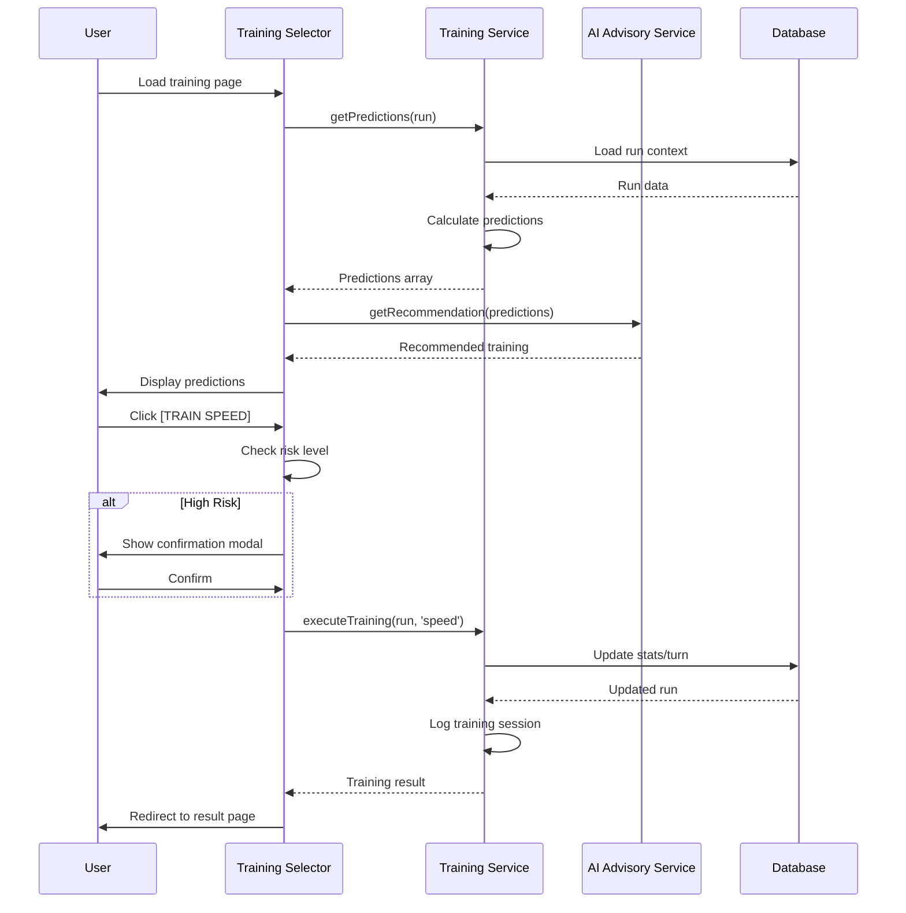
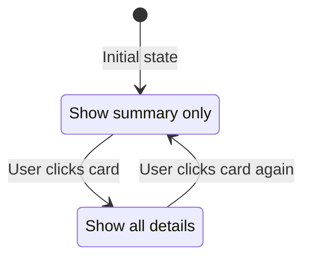
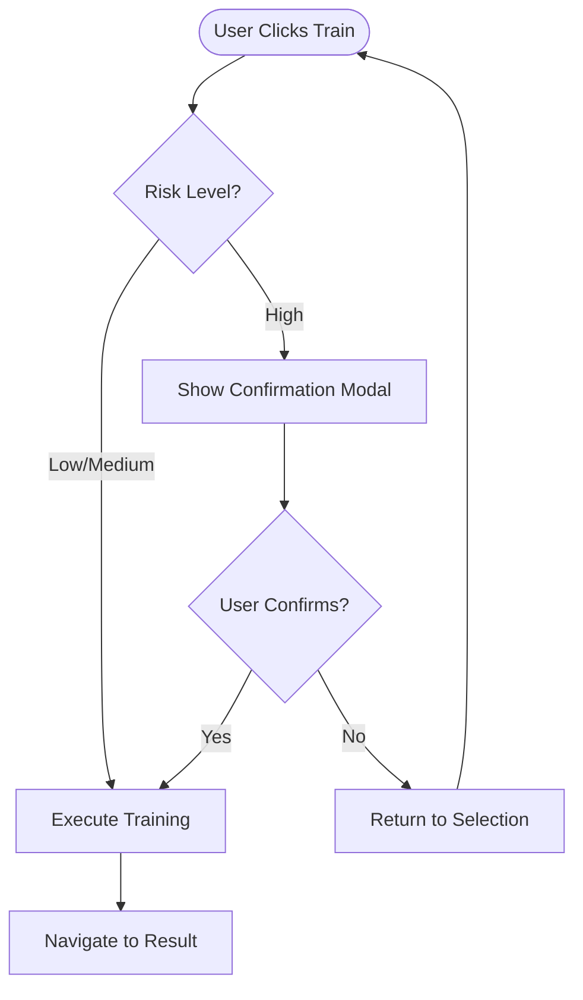

# WF-004: Training Selection Interface

## Umamusume Pretty Derby Career Planner

**Document Version**: 2.3.0  
**Date**: February 22, 2026  
**Related Documents**: [PRD-002], [SPEC-002], [FLOW-002], [SEQ-002]

**Source Specs**:

- `.kiro/specs/umamusume-career-planner-main/requirements.md` (Requirement 2: Training Prediction Engine)
- `.kiro/specs/umamusume-career-planner-main/design.md` (Training Selection UI)

**Related Artifacts**:

- PRD: [PRD-002](../prds/PRD-002_Training_Optimization.md)
- SPEC: [SPEC-002](../specs/SPEC-002_Training_Optimization_Technical.md)
- Flow: [FLOW-002](../flows/FLOW-002_Training_Optimization_System.md)
- Tech Flow: [TECH-FLOW-002](../tech-flow/TECH-FLOW-002_Training_Optimization_Flow.md)
- Sequences: [SEQ-002](../sequences/SEQ-002_Training_Block_Resolution.md), [SEQ-003](../sequences/SEQ-003_Skill_Acquisition_and_Upgrade.md)
- User Flows: [UF-003](../user-flows/UF-003_Training_Day_Flow.md)
- Related WF: [WF-005](WF-005_Training_Result_Screen.md), [WF-001](WF-001_Dashboard_Overview.md)

---

## 1. Overview

### 1.1 Purpose

The Training Selection Interface provides users with AI-powered training predictions, risk assessments, and intelligent recommendations to optimize character stat progression. This interface is the primary decision point for each training turn in a career run.

### 1.2 Key Objectives

| Objective               | Description                                                  |
| ----------------------- | ------------------------------------------------------------ |
| **Prediction Display**  | Show predicted stat gains for all 6 training facilities      |
| **Risk Assessment**     | Visual risk indicators with color-coded badges               |
| **AI Recommendations**  | Highlight optimal training choice based on goals             |
| **Support Integration** | Display active support cards and friendship bonuses          |
| **Quick Actions**       | One-click training execution with confirmation for high-risk |

### 1.3 User Stories

| ID     | User Story                                                                 | Priority |
| ------ | -------------------------------------------------------------------------- | -------- |
| US-001 | As a player, I want to see predicted stat gains for all training options   | P0       |
| US-002 | As a player, I want AI-powered recommendations based on my goals           | P0       |
| US-003 | As a player, I want clear risk indicators to avoid training failures       | P0       |
| US-004 | As a player, I want to see which support cards are active in each training | P0       |
| US-005 | As a player, I want quick access to my current stats and upcoming races    | P1       |

---

## 2. Layout Specifications

### 2.1 Desktop Layout (≥1024px)

┌──────────────────────────────────────────────────────────────────────┐
│ [≡] Menu | Training: Turn 45/78 | [?] Help │
├──────────────────────────────────────────────────────────────────────┤
│ ┌──────────────────────────────────────────────────────────────────┐ │
│ │ Energy: 78/100 [Action +20] | Mood: Good 🙂 | Fail% 12% │ │
│ └──────────────────────────────────────────────────────────────────┘ │
├──────────────────────────────────────────────────────────────────────┤
│ [AI Advisor] "Focus on Speed for the upcoming G1 race!" [Details] │
├──────────────────────────────────────────────────────────────────────┤
│ │
│ ┌──────────────────────────────────────────────────────────────────┐ │
│ │ Training Facilities (Levels 1-5, Multipliers: 1.0×-2.0×)         │ │
│ │ │ │
│ │ ┌─────────────┐ ┌─────────────┐ ┌─────────────┐ ┌───────────┐ │ │
│ │ │ ⚡ SPEED │ │ 💧 STAMINA │ │ 💪 POWER │ │ 🔥 GUTS │ │ │
│ │ │ Lv 3 (1.5×) │ │ Lv 2 (1.25×)│ │ Lv 2 (1.25×)│ │ Lv 1 (1×) │ │ │
│ │ │ │ │ │ │ │ │ │ │ │
│ │ │ Spd +45 │ │ Sta +32 │ │ Pwr +28 │ │ Guts +22 │ │ │
│ │ │ Pwr +5 │ │ Guts +4 │ │ Sta +4 │ │ Spd +3 │ │ │
│ │ │ │ │ │ │ │ │ │ │ │
│ │ │ [3 Cards] │ │ [1 Card] │ │ [2 Cards] │ │ [0 Cards] │ │ │
│ │ │ +15% bonus │ │ +5% bonus │ │ +10% bonus │ │ +0% bonus │ │ │
│ │ │ Dober 🔴 │ │ Creek │ │ Rice │ │ │ │ │
│ │ │ Teio │ │ │ │ Turbo │ │ │ │ │
│ │ │ │ │ │ │ │ │ │ │ │
│ │ │ [SELECT] │ │ [SELECT] │ │ [SELECT] │ │ [SELECT] │ │ │
│ │ └─────────────┘ └─────────────┘ └─────────────┘ └───────────┘ │ │
│ │ │ │
│ │ ┌─────────────┐ ┌─────────────┐ │ │
│ │ │ 🧠 WISDOM │ │ 🛌 REST │ │ │
│ │ │ Lv 4 (1.75×)│ │ │ [Current Stats] │ │
│ │ │ │ │ Energy │ Speed: 980 [A] │ │
│ │ │ Wit +48 │ │ +50 │ Stamina: 820 [B] │ │
│ │ │ Spd +2 │ │ │ Power: 780 [B] │ │
│ │ │ │ │ Bad Status │ Guts: 760 [B] │ │
│ │ │ [Friend] │ │ Cure Chance │ Wisdom: 890 [A] │ │
│ │ │ Riko │ │ │ Soft Cap: 1200 │ │
│ │ │ │ │ │ [Upcoming Race: 8 Days] │ │
│ │ │ [SELECT] │ │ [SELECT] │ Kanto Okami Cup (G1) │ │
│ │ └─────────────┘ └─────────────┘ │ │
│ └──────────────────────────────────────────────────────────────────┘ │
│ │
└──────────────────────────────────────────────────────────────────────┘

```

### 2.2 Tablet Layout (640px-1024px)

```

┌────────────────────────────────────────────────────┐
│ Training Selection - Turn 45 [≡] │
├────────────────────────────────────────────────────┤
│ ☰ Menu Toggle │
├────────────────────────────────────────────────────┤
│ │
│ ┌──────────────────────────────────────────────┐ │
│ │ Status Bar │ │
│ │ Energy: 78% | Mood: Good | Turn: 45/78 │ │
│ └──────────────────────────────────────────────┘ │
│ │
│ ┌──────────────────────────────────────────────┐ │
│ │ 💡 AI Recommendation │ │
│ │ Focus on Speed training │ │
│ │ Confidence: 85% | Risk: Low │ │
│ └──────────────────────────────────────────────┘ │
│ │
│ ┌──────────────────────────────────────────────┐ │
│ │ Training Options (Scrollable) │ │
│ ├──────────────────────────────────────────────┤ │
│ │ │ │
│ │ ⚡ SPEED TRAINING [AI ✓] │ │
│ │ Score: 92/100 │ │
│ │ │ │
│ │ Gains: Spd +45, Sta +5, Pow +3 │ │
│ │ │ │
│ │ Support: 3 active │ │
│ │ • Mejiro Dober (+12) 🔴 │ │
│ │ • Tokai Teio (+8) │ │
│ │ • Kitasan Black (+6) │ │
│ │ │ │
│ │ Hints: │ │
│ │ • Lane Guidance (Guaranteed) 🔴 │ │
│ │ │ │
│ │ Risk: 🟢 Low (12%) │ │
│ │ Energy: -20% │ │
│ │ │ │
│ │ [TRAIN] [DETAILS] │ │
│ └──────────────────────────────────────────────┘ │
│ │
│ ┌──────────────────────────────────────────────┐ │
│ │ 💧 STAMINA TRAINING │ │
│ │ Score: 78/100 │ │
│ │ [Collapsed - Tap to Expand] │ │
│ └──────────────────────────────────────────────┘ │
│ │
│ [3. Power] [4. Guts] [5. Wit] [6. Rest] │
│ │
│ ┌──────────────────────────────────────────────┐ │
│ │ Quick Stats (Collapsible)                    │ │
│ │ Speed: A (980) | Stamina: B (820)            │ │
│ │ Soft Cap: 1200 | [Expand for Details]        │ │
│ └──────────────────────────────────────────────┘ │
│ │
│ [Skip] [Rest] [Ask AI] │
└────────────────────────────────────────────────────┘

```

### 2.3 Mobile Layout (<640px)

```

┌──────────────────────────────┐
│ Turn 45 [≡] │
├──────────────────────────────┤
│ │
│ Energy: 78% | Mood: Good 🙂 │
│ │
│ ┌──────────────────────────┐ │
│ │ 💡 AI: Speed Training │ │
│ │ Confidence: 85% │ │
│ └──────────────────────────┘ │
│ │
│ ┌──────────────────────────┐ │
│ │ ⚡ SPEED [AI ✓] │ │
│ │ Score: 92/100 │ │
│ ├──────────────────────────┤ │
│ │ Spd +45, Sta +5, Pow +3 │ │
│ │ │ │
│ │ Support: 3 active │ │
│ │ • Dober (+12) 🔴 │ │
│ │ • Teio (+8) │ │
│ │ • Kitasan (+6) │ │
│ │ │ │
│ │ Hints: │ │
│ │ • Lane Guidance ✓ 🔴 │ │
│ │ │ │
│ │ Risk: 🟢 12% │ │
│ │ Energy: -20% │ │
│ │ │ │
│ │ [TRAIN] [MORE] │ │
│ └──────────────────────────┘ │
│ │
│ ┌──────────────────────────┐ │
│ │ 💧 STAMINA │ │
│ │ Score: 78/100 │ │
│ │ [Tap to Expand] │ │
│ └──────────────────────────┘ │
│ │
│ Horizontal scroll: │
│ [Pow] [Guts] [Wit] [Rest] → │
│ │
│ ┌──────────────────────────┐ │
│ │ Stats (Collapse) │ │
│ │ Spd: A (980) │ │
│ │ [Show All] │ │
│ └──────────────────────────┘ │
│ │
│ [Skip] [Rest] [AI] │
└──────────────────────────────┘
│ Bottom Navigation Bar │
│ [🏠][👤][⚡][🏆][🤖][⚙️] │
└──────────────────────────────┘

````

---

## 3. Component Specifications

### 3.1 Training Prediction Card

**Component**: `app/Livewire/Training/PredictionCard.php`

```php
class PredictionCard extends Component
{
    public TrainingPrediction $prediction;
    public bool $expanded = false;
    public bool $aiRecommended = false;

    public function render()
    {
        return view('livewire.training.prediction-card', [
            'statGains' => $this->prediction->stat_gains,
            'supportCards' => $this->prediction->active_support_cards,
            'skillHints' => $this->prediction->skill_hints,
            'riskLevel' => $this->prediction->risk_level,
            'energyCost' => $this->prediction->energy_cost,
        ]);
    }

    public function toggleExpand()
    {
        $this->expanded = !$this->expanded;
    }
}
````

**Visual Elements**:

```
┌─────────────────────────────────────────────────────┐
│ Training Type Header                      [AI ✓]    │
│ Recommendation Score: XX/100                        │
├─────────────────────────────────────────────────────┤
│ Predicted Gains:                                    │
│ Speed: +XX  Stamina: +XX  Power: +XX               │
│ Guts:  +XX  Wit:     +XX                           │
│                                                     │
│ Efficiency: ★★★★★ Rating                           │
├─────────────────────────────────────────────────────┤
│ Support Cards Active (N):                           │
│ • Card Name (Type, +Bonus) [Red !] [Friendship]    │
│ • Card Name (Type, +Bonus)                         │
├─────────────────────────────────────────────────────┤
│ Skill Hints:                                        │
│ • Skill Name (Guaranteed ✓) [Red !]               │
│ • Skill Name (XX% chance)                          │
├─────────────────────────────────────────────────────┤
│ Risk: [Badge] XX%                                   │
│ Energy Cost: -XX% (Current → New)                  │
│ Mood Impact: [Mood Change]                         │
├─────────────────────────────────────────────────────┤
│ [PRIMARY ACTION] [DETAILS]                          │
└─────────────────────────────────────────────────────┘
```

**Risk Level Badges**:

| Risk Level | Percentage | Badge Color | Icon |
| ---------- | ---------- | ----------- | ---- |
| Low        | <15%       | Green       | 🟢   |
| Medium     | 15-40%     | Amber       | 🟡   |
| High       | >40%       | Red         | 🔴   |

**AI Recommendation Badge**:

- Display: `[AI ✓]` in header
- Color: Blue/Accent color
- Condition: `recommendation_score >= 85`

### 3.2 Support Card Display

**Component**: `resources/views/components/training/support-card-indicator.blade.php`

```blade
<div class="support-card-indicator">
    @foreach($activeCards as $card)
        <div class="support-card-row" data-testid="support-card-{{ $card->id }}">
            <span class="card-icon">
                @if($card->has_red_exclamation)
                    🔴
                @endif
                @if($card->friendship_active)
                    💛
                @endif
            </span>
            <span class="card-name">{{ $card->name }}</span>
            <span class="card-type">({{ $card->type }})</span>
            <span class="card-bonus">+{{ $card->bonus }}</span>
        </div>
    @endforeach
</div>
```

**Red Exclamation Indicator** (🔴):

- Displayed when: Support card has guaranteed skill hint available
- Position: Before card name
- Tooltip: "Guaranteed skill hint available"

**Friendship Indicator** (💛):

- Displayed when: Bond level ≥ 80% (Friendship Training active)
- Position: After bonus value
- Tooltip: "Friendship Training active (+bonus)"

### 3.3 Skill Hint Display

**Data Structure**:

```php
[
    [
        'skill_name' => 'Lane Guidance',
        'probability' => 100, // Guaranteed
        'is_guaranteed' => true,
        'source_card' => 'Mejiro Dober',
    ],
    [
        'skill_name' => 'Going Strong',
        'probability' => 25,
        'is_guaranteed' => false,
        'source_card' => 'Tokai Teio',
    ],
]
```

**Visual Format**:

```
Skill Hints:
• Lane Guidance (Guaranteed ✓) 🔴
• Going Strong (25% chance)
• Stamina Boost (15% chance)
```

**Guaranteed Indicator**:

- Display: `(Guaranteed ✓)` + Red circle 🔴
- Condition: `is_guaranteed === true` OR `probability === 100`

### 3.4 Stat Gains Display

**Component**: `resources/views/components/training/stat-gains.blade.php`

```blade
<div class="stat-gains">
    <div class="stat-row">
        <span class="stat-label stat-speed">Speed:</span>
        <span class="stat-value">+{{ $gains['speed'] }}</span>
    </div>
    <div class="stat-row">
        <span class="stat-label stat-stamina">Stamina:</span>
        <span class="stat-value">+{{ $gains['stamina'] }}</span>
    </div>
    <div class="stat-row">
        <span class="stat-label stat-power">Power:</span>
        <span class="stat-value">+{{ $gains['power'] }}</span>
    </div>
    <div class="stat-row">
        <span class="stat-label stat-guts">Guts:</span>
        <span class="stat-value">+{{ $gains['guts'] }}</span>
    </div>
    <div class="stat-row">
        <span class="stat-label stat-wit">Wit:</span>
        <span class="stat-value">+{{ $gains['wit'] }}</span>
    </div>
</div>
```

**Stat Colors**:

| Stat    | CSS Variable     | Color     |
| ------- | ---------------- | --------- |
| Speed   | `--stat-speed`   | `#3399ff` |
| Stamina | `--stat-stamina` | `#33cc99` |
| Power   | `--stat-power`   | `#ff4d4d` |
| Guts    | `--stat-guts`    | `#ffa500` |
| Wit     | `--stat-wit`     | `#9933ff` |

### 3.5 Training Formula (Game-Accurate)

**Core Training Formula**:

```
Stat Gain = (Base + StatBonus) × (1 + GrowthRate) × (1 + MoodMultiplier × (1 + MoodEffect)) 
            × (1 + TrainingEffect) × (1 + 0.05 × NumSupportCards) × FriendshipMultiplier
```

**Formula Components**:

| Component | Description | Values |
|-----------|-------------|--------|
| Base | Facility base stat gain | Varies by facility and level |
| StatBonus | Support card stat bonuses | Sum of active card bonuses |
| GrowthRate | Character's growth rate for stat | 0-30% typically |
| MoodMultiplier | Base mood effect | 1.0 |
| MoodEffect | Mood modifier | Great: +20%, Good: +10%, Normal: 0%, Bad: -10%, Very Bad: -20% |
| TrainingEffect | Facility level multiplier | See table below |
| NumSupportCards | Cards present at facility | 0-6 cards |
| FriendshipMultiplier | Friendship training bonus | 1.0 or higher when bond ≥80% |

**Facility Level Multipliers**:

| Level | Multiplier | Description |
|-------|------------|-------------|
| 1     | 1.00×      | Base facility |
| 2     | 1.25×      | +25% gains |
| 3     | 1.50×      | +50% gains |
| 4     | 1.75×      | +75% gains |
| 5     | 2.00×      | Maximum (+100% gains) |

**Support Card Presence Bonus**:

- +5% per support card present at facility
- Maximum +30% with 6 cards (rare scenario)
- Typical: 1-3 cards per facility

**Stat Caps**:

- **Soft Cap**: 1200 (gains reduced to 50% above this)
- **Per-Training Cap**: +100 (reduced to +50 if stat > 1200)
- **Important Breakpoints**: 901 (A grade), 1200 (soft cap), 1600 (practical max)

### 3.6 Efficiency Rating

**Rating Scale**:

| Stars | Score Range | Label         |
| ----- | ----------- | ------------- |
| ★★★★★ | 90-100      | Excellent     |
| ★★★★☆ | 75-89       | Good          |
| ★★★☆☆ | 60-74       | Average       |
| ★★☆☆☆ | 45-59       | Below Average |
| ★☆☆☆☆ | <45         | Poor          |

**Calculation**:

```php
$efficiency = (
    ($statGains['speed'] * $goalWeights['speed']) +
    ($statGains['stamina'] * $goalWeights['stamina']) +
    ($statGains['power'] * $goalWeights['power']) +
    ($statGains['guts'] * $goalWeights['guts']) +
    ($statGains['wit'] * $goalWeights['wit'])
) / $maxPossibleGain;
```

---

## 4. State Management

### 4.1 Livewire Component State

**Main Component**: `app/Livewire/Training/TrainingSelector.php`

```php
class TrainingSelector extends Component
{
    public Character $character;
    public CareerRun $careerRun;

    public $predictions = [];
    public $expandedPredictions = [];
    public $selectedTraining = null;

    protected $listeners = [
        'refresh-predictions' => '$refresh',
        'training-executed' => 'handleTrainingExecuted',
    ];

    public function mount()
    {
        $this->loadPredictions();
    }

    public function loadPredictions()
    {
        $service = app(TrainingPredictionService::class);
        $this->predictions = $service->getPredictions($this->careerRun);
    }

    public function selectTraining($trainingType)
    {
        if ($this->getRiskLevel($trainingType) === 'high') {
            $this->dispatch('show-confirmation-modal', [
                'message' => 'This training has high failure risk. Continue?',
                'action' => 'executeTraining',
                'params' => ['trainingType' => $trainingType],
            ]);
        } else {
            $this->executeTraining($trainingType);
        }
    }

    public function executeTraining($trainingType)
    {
        $service = app(TrainingService::class);
        $result = $service->executeTraining($this->careerRun, $trainingType);

        $this->dispatch('training-executed', result: $result);
        return redirect()->route('training.result', ['run' => $this->careerRun]);
    }

    public function render()
    {
        return view('livewire.training.training-selector');
    }
}
```

### 4.2 Cache Strategy

| Data Type            | Cache Key                   | TTL        | Invalidation          |
| -------------------- | --------------------------- | ---------- | --------------------- |
| Training predictions | `predictions:{run_id}`      | 5 minutes  | On training execution |
| Support card bonuses | `support_bonuses:{deck_id}` | 1 hour     | On deck modification  |
| AI recommendations   | `ai_training:{run_id}`      | 10 minutes | On stat/goal change   |

### 4.3 Real-time Updates

**WebSocket Integration**:

```javascript
// Listen for character stat updates
Echo.private(`character.${characterId}`)
    .listen("StatsUpdated", (e) => {
        Livewire.dispatch("refresh-predictions");
    })
    .listen("TrainingCompleted", (e) => {
        // Redirect to result screen
        window.location.href = e.resultUrl;
    });
```

---

## 5. Interaction Patterns

### 5.1 Training Selection Flow



### 5.2 Prediction Expansion Flow



### 5.3 Risk Confirmation Flow



---

## 6. Accessibility Specifications

### 6.1 WCAG 2.2 AA Compliance

| Criterion                      | Implementation                           | Test Method             |
| ------------------------------ | ---------------------------------------- | ----------------------- |
| **1.1.1 Non-text Content**     | All icons have `aria-label`              | Screen reader testing   |
| **1.4.3 Contrast Ratio**       | 4.5:1 minimum for text                   | Color contrast analyzer |
| **2.1.1 Keyboard**             | All training options keyboard accessible | Keyboard-only testing   |
| **2.4.3 Focus Order**          | Logical tab order through predictions    | Tab key traversal       |
| **2.4.7 Focus Visible**        | Clear focus indicators on cards          | Visual inspection       |
| **3.3.1 Error Identification** | Risk warnings clearly identified         | Screen reader + visual  |
| **4.1.2 Name, Role, Value**    | Proper ARIA attributes on controls       | axe-core scan           |

### 6.2 Keyboard Navigation

| Action               | Shortcut            | Context                     |
| -------------------- | ------------------- | --------------------------- |
| Navigate predictions | `Tab` / `Shift+Tab` | Training selection          |
| Expand prediction    | `Enter` or `Space`  | When card focused           |
| Select training      | `Enter`             | When [TRAIN] button focused |
| Collapse all         | `Esc`               | Expanded predictions        |
| Refresh predictions  | `F5` or `Ctrl+R`    | Training page               |

### 6.3 Screen Reader Announcements

```html
<!-- Prediction card -->
<div
    role="article"
    aria-labelledby="prediction-speed"
    data-testid="prediction-card-speed"
>
    <h3 id="prediction-speed">Speed Training - AI Recommended</h3>

    <!-- AI recommendation announcement -->
    <div aria-live="polite" aria-atomic="true" class="sr-only">
        Speed training recommended with 92% score and low risk
    </div>

    <!-- Stat gains -->
    <div aria-label="Predicted stat gains">
        <span
            >Speed plus 45, Stamina plus 5, Power plus 3, Guts plus 2, Wit plus
            1</span
        >
    </div>

    <!-- Support cards -->
    <div aria-label="Active support cards">
        <span
            >3 support cards active including Mejiro Dober with guaranteed skill
            hint</span
        >
    </div>

    <!-- Risk level -->
    <div role="status" aria-live="polite">
        <span class="sr-only">Risk level: Low at 12 percent</span>
        <span aria-hidden="true">Risk: 🟢 Low (12%)</span>
    </div>
</div>

<!-- Training execution announcement -->
<div aria-live="assertive" aria-atomic="true" class="sr-only">
    Training executed successfully. Speed increased by 48 points.
</div>
```

---

## 7. Performance Specifications

### 7.1 Performance Targets

| Metric                 | Target        | Measurement          |
| ---------------------- | ------------- | -------------------- |
| **Prediction Load**    | < 1.2 seconds | API response time    |
| **Card Expansion**     | < 100ms       | Animation duration   |
| **Training Execution** | < 800ms       | Database transaction |
| **AI Recommendation**  | < 500ms       | With cache hit       |
| **Page Load**          | < 2.0 seconds | Time to Interactive  |

### 7.2 Optimization Strategies

| Strategy               | Implementation                  | Impact                     |
| ---------------------- | ------------------------------- | -------------------------- |
| **Prediction Caching** | 5-minute Redis cache            | -70% API calls             |
| **Lazy Expansion**     | Defer detail rendering          | -30% initial render        |
| **Debounced Refresh**  | 300ms debounce on actions       | Reduced server load        |
| **Optimistic UI**      | Show loading states immediately | Perceived performance +40% |
| **Database Indexing**  | Indexed queries on predictions  | -60% query time            |

### 7.3 Bundle Size Budget

| Asset Type | Budget | Current | Status           |
| ---------- | ------ | ------- | ---------------- |
| JavaScript | 60 KB  | 55 KB   | ✅ Within budget |
| CSS        | 25 KB  | 22 KB   | ✅ Within budget |
| Fonts      | 15 KB  | 14 KB   | ✅ Within budget |
| Images     | 80 KB  | 72 KB   | ✅ Within budget |
| Total      | 180 KB | 163 KB  | ✅ Within budget |

---

## 8. Testing Specifications

### 8.1 Unit Tests

**Test File**: `tests/Unit/Services/TrainingPredictionServiceTest.php`

```php
test('calculates training predictions for all facilities', function () {
    $character = Character::factory()->create();
    $run = CareerRun::factory()->for($character)->create();
    $service = app(TrainingPredictionService::class);

    $predictions = $service->getPredictions($run);

    expect($predictions)->toHaveCount(6)
        ->and($predictions[0])->toHaveKeys([
            'training_type',
            'stat_gains',
            'risk_level',
            'recommendation_score',
        ]);
});

test('ranks predictions by recommendation score', function () {
    $character = Character::factory()->withGoals(['speed' => 1000])->create();
    $run = CareerRun::factory()->for($character)->create();
    $service = app(TrainingPredictionService::class);

    $predictions = $service->getPredictions($run);

    expect($predictions[0]['training_type'])->toBe('speed')
        ->and($predictions[0]['recommendation_score'])->toBeGreaterThan(80);
});

test('calculates support card bonuses correctly', function () {
    $deck = SupportDeck::factory()
        ->hasAttached(
            SupportCard::factory()->count(3)->create(['type' => 'speed']),
            ['slot' => fn($i) => $i + 1]
        )
        ->create();

    $run = CareerRun::factory()->create(['support_deck_id' => $deck->id]);
    $service = app(TrainingPredictionService::class);

    $predictions = $service->getPredictions($run);
    $speedPrediction = collect($predictions)->firstWhere('training_type', 'speed');

    expect($speedPrediction['active_support_cards'])->toHaveCount(3)
        ->and($speedPrediction['stat_gains']['speed'])->toBeGreaterThan(40);
});
```

### 8.2 Feature Tests

**Test File**: `tests/Feature/Training/TrainingSelectorTest.php`

```php
test('user can view training predictions', function () {
    $user = User::factory()->create();
    $character = Character::factory()->for($user)->create();
    $run = CareerRun::factory()->for($character)->create();

    $this->actingAs($user)
        ->get(route('training.select', ['run' => $run]))
        ->assertOk()
        ->assertSee('Training Selection')
        ->assertSee('SPEED TRAINING')
        ->assertSee('STAMINA TRAINING');
});

test('user can execute training', function () {
    $user = User::factory()->create();
    $character = Character::factory()->for($user)->create(['speed' => 500]);
    $run = CareerRun::factory()->for($character)->create(['current_turn' => 45]);

    Livewire::actingAs($user)
        ->test(TrainingSelector::class, ['careerRun' => $run])
        ->call('selectTraining', 'speed')
        ->assertRedirect(route('training.result', ['run' => $run]));

    expect($run->fresh()->speed)->toBeGreaterThan(500)
        ->and($run->fresh()->current_turn)->toBe(46);
});

test('high risk training shows confirmation modal', function () {
    $user = User::factory()->create();
    $run = CareerRun::factory()->create(['energy' => 20, 'mood' => Mood::Bad]);

    Livewire::actingAs($user)
        ->test(TrainingSelector::class, ['careerRun' => $run])
        ->call('selectTraining', 'speed')
        ->assertDispatched('show-confirmation-modal');
});
```

### 8.3 E2E Tests (Playwright)

**Test File**: `tests/e2e/training-selection.spec.js`

```javascript
test.describe("WF-004: Training Selection Interface", () => {
    test("displays training predictions correctly", async ({ page }) => {
        await page.goto("/characters/1/training");

        // Check header
        await expect(page.getByTestId("training-header")).toBeVisible();
        await expect(page.getByTestId("training-header")).toContainText(
            "Turn 45",
        );

        // Check prediction cards
        const predictions = page.getByTestId(/^prediction-card-/);
        await expect(predictions).toHaveCount(6);

        // Check AI recommendation badge
        const speedCard = page.getByTestId("prediction-card-speed");
        await expect(
            speedCard.getByTestId("ai-recommended-badge"),
        ).toBeVisible();

        // Check stat gains display
        await expect(speedCard.getByTestId("stat-gains")).toBeVisible();
        await expect(speedCard.getByTestId("stat-gains")).toContainText(
            "Speed: +45",
        );
    });

    test("displays risk indicators correctly", async ({ page }) => {
        await page.goto("/characters/1/training");

        // Check risk badge colors
        const lowRiskBadge = page.getByTestId("risk-badge-speed");
        await expect(lowRiskBadge).toHaveClass(/bg-green/);

        const mediumRiskBadge = page.getByTestId("risk-badge-stamina");
        await expect(mediumRiskBadge).toHaveClass(/bg-amber/);
    });

    test("displays support card indicators", async ({ page }) => {
        await page.goto("/characters/1/training");

        const speedCard = page.getByTestId("prediction-card-speed");
        const supportSection = speedCard.getByTestId("support-cards");

        // Check support card count
        await expect(supportSection).toContainText("3 active");

        // Check red exclamation for guaranteed hint
        const dober = supportSection.getByTestId("support-card-mejiro-dober");
        await expect(dober).toContainText("🔴");
    });

    test("executes training on button click", async ({ page }) => {
        await page.goto("/characters/1/training");

        const speedCard = page.getByTestId("prediction-card-speed");
        await speedCard.getByTestId("train-button").click();

        // Should redirect to result page
        await expect(page).toHaveURL(/.*training\/result/);
        await expect(page.getByTestId("training-result")).toBeVisible();
    });

    test("shows confirmation for high-risk training", async ({ page }) => {
        await page.goto("/characters/1/training?energy=20&mood=bad");

        const speedCard = page.getByTestId("prediction-card-speed");
        await speedCard.getByTestId("train-button").click();

        // Should show confirmation modal
        const modal = page.getByTestId("confirmation-modal");
        await expect(modal).toBeVisible();
        await expect(modal).toContainText("high failure risk");

        // Cancel
        await modal.getByTestId("cancel-button").click();
        await expect(modal).not.toBeVisible();
    });

    test("supports keyboard navigation", async ({ page }) => {
        await page.goto("/characters/1/training");

        // Tab to first prediction
        await page.keyboard.press("Tab");
        await expect(page.getByTestId("prediction-card-speed")).toBeFocused();

        // Enter to expand
        await page.keyboard.press("Enter");
        await expect(page.getByTestId("prediction-card-speed")).toHaveAttribute(
            "aria-expanded",
            "true",
        );

        // Tab to train button
        await page.keyboard.press("Tab");
        await expect(page.getByTestId("train-button-speed")).toBeFocused();

        // Enter to execute
        await page.keyboard.press("Enter");
        await expect(page).toHaveURL(/.*training\/result/);
    });
});
```

### 8.4 Accessibility Tests

**Test File**: `tests/e2e/accessibility/training-selection.spec.js`

```javascript
import { test, expect } from "@playwright/test";
import AxeBuilder from "@axe-core/playwright";

test.describe("WF-004: Accessibility", () => {
    test("has no automatically detectable accessibility issues", async ({
        page,
    }) => {
        await page.goto("/characters/1/training");

        const accessibilityScanResults = await new AxeBuilder({ page })
            .withTags(["wcag2a", "wcag2aa", "wcag21a", "wcag21aa"])
            .analyze();

        expect(accessibilityScanResults.violations).toEqual([]);
    });

    test("announces predictions to screen readers", async ({ page }) => {
        await page.goto("/characters/1/training");

        const liveRegion = page.locator('[aria-live="polite"]');

        // Check for AI recommendation announcement
        await expect(liveRegion).toContainText(/Speed training recommended/);
    });

    test("announces risk levels to screen readers", async ({ page }) => {
        await page.goto("/characters/1/training");

        const speedCard = page.getByTestId("prediction-card-speed");
        const riskStatus = speedCard.locator('[role="status"]');

        // Check for screen reader text
        const srOnly = riskStatus.locator(".sr-only");
        await expect(srOnly).toContainText("Risk level: Low at 12 percent");
    });

    test("supports keyboard-only workflow", async ({ page }) => {
        await page.goto("/characters/1/training");

        // Navigate using keyboard only
        await page.keyboard.press("Tab"); // Focus first card
        await page.keyboard.press("Enter"); // Expand card
        await page.keyboard.press("Tab"); // Focus train button
        await page.keyboard.press("Enter"); // Execute training

        // Verify navigation completed
        await expect(page).toHaveURL(/.*training\/result/);
    });

    test("maintains focus after actions", async ({ page }) => {
        await page.goto("/characters/1/training");

        const speedCard = page.getByTestId("prediction-card-speed");
        const expandButton = speedCard.getByTestId("expand-button");

        await expandButton.click();

        // Focus should remain on expand button
        await expect(expandButton).toBeFocused();
    });
});
```

---

## 9. Related Documentation

### 9.1 Product Requirements

- [PRD-002: Training Optimization](../prds/PRD-002_Training_Optimization.md)

### 9.2 Technical Specifications

- [SPEC-002: Training Optimization Technical](../specs/SPEC-002_Training_Optimization_Technical.md)

### 9.3 Flow Documentation

- [FLOW-002: Training Optimization System](../flows/FLOW-002_Training_Optimization_System.md)
- [TECH-FLOW-002: Training Optimization Flow](../tech-flow/TECH-FLOW-002_Training_Optimization_Flow.md)

### 9.4 Sequence Diagrams

- [SEQ-002: Training Block Resolution](../sequences/SEQ-002_Training_Block_Resolution.md)
- [SEQ-003: Skill Acquisition and Upgrade](../sequences/SEQ-003_Skill_Acquisition_and_Upgrade.md)

### 9.5 User Flows

- [UF-003: Training Day Flow](../user-flows/UF-003_Training_Day_Flow.md)

### 9.6 Related Wireframes

- [WF-005: Training Result Screen](WF-005_Training_Result_Screen.md)
- [WF-001: Dashboard Overview](WF-001_Dashboard_Overview.md)

---

## 10. Version History

| Version | Date       | Author           | Changes                                                                                                                                                                                                        |
| ------- | ---------- | ---------------- | -------------------------------------------------------------------------------------------------------------------------------------------------------------------------------------------------------------- |
| 2.3.0   | 2026-02-22 | Development Team | Updated version/dates, aligned technology references with current stack (Livewire 4, Neuron AI v2.11, GameTora/umapyoi.net) |
| 2.2.0   | 2026-01-28 | Development Team | Updated with verified game mechanics from Global English Server: added complete training formula, facility level multipliers (1.0×-2.0×), support card presence bonus (+5% per card), stat soft cap at 1200, mood effects (+20%/-20% range) |
| 2.0.0   | 2026-01-24 | Development Team | Comprehensive update aligned with v2.0.0 implementation; added AI recommendations, red exclamation indicators, friendship training, risk confirmations, accessibility specifications, and testing requirements |
| 1.0.0   | 2026-01-14 | Development Team | Initial wireframe specification                                                                                                                                                                                |

---

## 11. Notes

**Implementation Status**: ✅ Complete

**Known Issues**: None

**Future Enhancements**:

- Advanced filtering/sorting of training options
- Historical stat gain tracking per facility
- Customizable prediction display (compact/detailed)
- Training simulation mode (preview without executing)
- Batch training execution (multiple turns)
- Training efficiency analytics dashboard

---

_This wireframe specification reflects the current implementation of the Training Selection Interface and serves as the authoritative reference for UI/UX development and testing._
