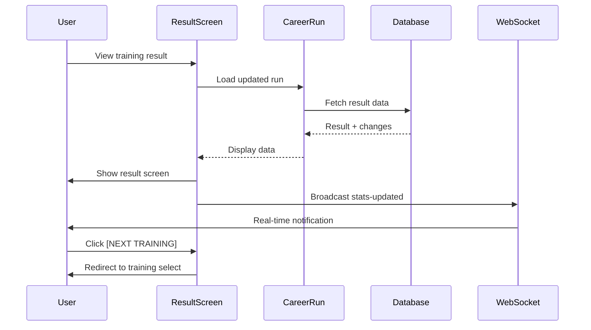
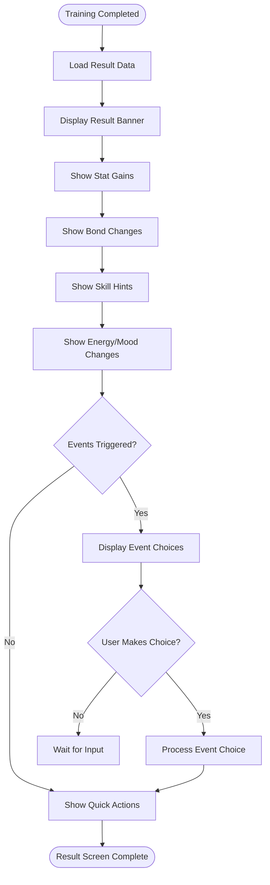
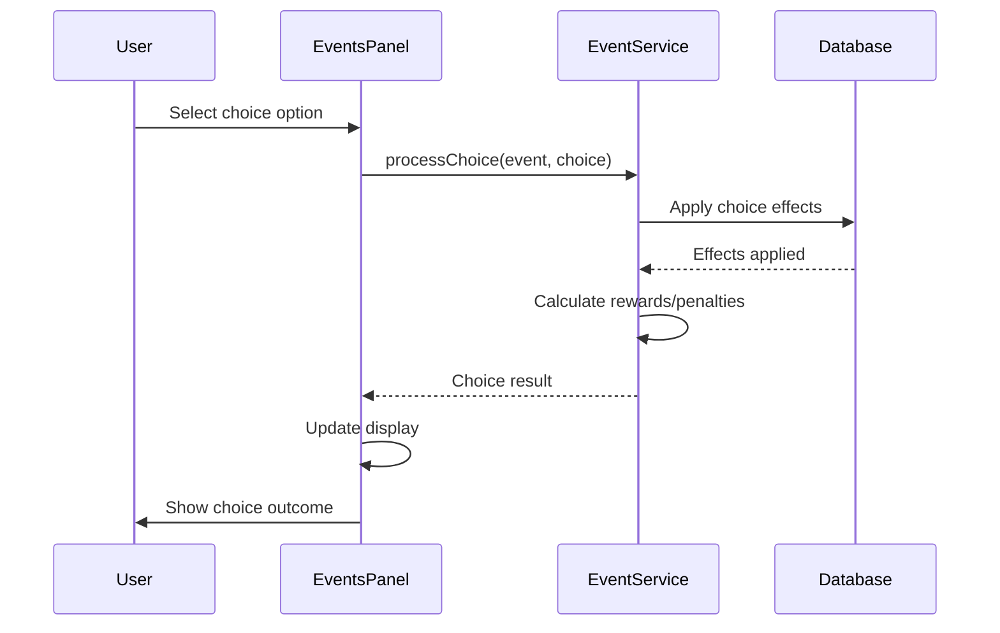
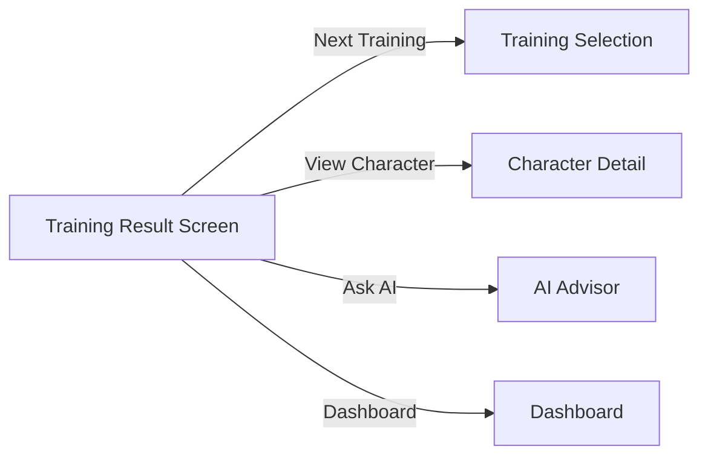

# WF-005: Training Result Screen

## Umamusume Pretty Derby Career Planner

**Document Version**: 2.2.0  
**Date**: January 28, 2026  
**Related Documents**: [PRD-002], [SPEC-002], [FLOW-002], [SEQ-002]

**Source Specs**:

- `.kiro/specs/umamusume-career-planner-main/requirements.md` (Requirement 2: Training Prediction Engine)
- `.kiro/specs/umamusume-career-planner-main/design.md` (Training Results UI)

**Related Artifacts**:

- PRD: [PRD-002](../prds/PRD-002_Training_Optimization.md)
- SPEC: [SPEC-002](../specs/SPEC-002_Training_Optimization_Technical.md)
- Flow: [FLOW-002](../flows/FLOW-002_Training_Optimization_System.md)
- Tech Flow: [TECH-FLOW-002](../tech-flow/TECH-FLOW-002_Training_Optimization_Flow.md)
- Sequences: [SEQ-002](../sequences/SEQ-002_Training_Block_Resolution.md)
- User Flows: [UF-003](../user-flows/UF-003_Training_Day_Flow.md)
- Related WF: [WF-004](WF-004_Training_Selection_Interface.md), [WF-001](WF-001_Dashboard_Overview.md)

---

## 1. Overview

### 1.1 Purpose

The Training Result Screen displays the outcome of a training session, showing actual stat gains, bond changes, skill hints obtained, energy/mood changes, and any triggered events. This screen provides immediate feedback and allows players to review the effectiveness of their training choices.

### 1.2 Key Objectives

| Objective              | Description                                                  |
| ---------------------- | ------------------------------------------------------------ |
| **Clear Feedback**     | Display all training outcomes in an easily digestible format |
| **Comparison Display** | Show predicted vs. actual results where applicable           |
| **Progress Tracking**  | Update stat progression and turn advancement                 |
| **Event Handling**     | Display triggered events and choice outcomes                 |
| **Quick Navigation**   | Enable smooth transition to next training turn or dashboard  |

### 1.3 User Stories

| ID     | User Story                                                          | Priority |
| ------ | ------------------------------------------------------------------- | -------- |
| US-001 | As a player, I want to see my stat gains immediately after training | P0       |
| US-002 | As a player, I want to know if I received skill hints               | P0       |
| US-003 | As a player, I want to see bond changes with support cards          | P0       |
| US-004 | As a player, I want to understand mood and energy changes           | P0       |
| US-005 | As a player, I want to quickly proceed to the next turn             | P0       |

---

## 2. Layout Specifications

### 2.1 Desktop Layout (≥1024px)

┌──────────────────────────────────────────────────────────────────────┐
│ [≡] Menu | Training Result: Turn 46 | [?] Help │
├──────────────────────────────────────────────────────────────────────┤
│ ┌──────────────────────────────────────────────────────────────────┐ │
│ │ Energy: 58/100 (-20%) | Mood: Normal 😐 (Was Good) │ │
│ └──────────────────────────────────────────────────────────────────┘ │
├──────────────────────────────────────────────────────────────────────┤
│ │
│ ERROR: UNABLE TO RENDER FLASHY ANIMATION IN TEXT MODE. │
│ IMAGINE A BIG SUCCESS BANNER HERE. │
│ │
│ ★ T R A I N I N G S U C C E S S ! ★ │
│ │
│ [ ⚡ SPEED TRAINING Lv 3 ] │
│ │
├──────────────────────────────────────────────────────────────────────┤
│ ┌──────────────────────┐ ┌────────────────────────────────────────┐ │
│ │ STAT GAINS │ │ BOND INCREASES │ │
│ │ │ │ │ │
│ │ Speed: +48 🔺 │ │ [Dober] 78% → 85% (+7) 🎉 Hint! │ │
│ │ Stamina: +5 │ │ [Teio] 70% → 75% (+5) │ │
│ │ Power: +3 │ │ [Kit] 82% → 85% (+3) │ │
│ │ Guts: +2 │ │ │ │
│ │ Wisdom: +1 │ │ │ │
│ │ │ │ [NEXT GOAL: Speed 600 (Current: 568)] │ │
│ │ TOTAL: +59 │ │ │ │
│ └──────────────────────┘ └────────────────────────────────────────┘ │
│ │
│ ┌──────────────────────────────────────────────────────────────────┐ │
│ │ SKILL HINTS │ │
│ │ ✨ [Lane Guidance] Lv 1 (Guaranteed!) -40% SP Cost │ │
│ │ 💡 [Going Strong] Lv 1 (Random) -20% SP Cost │ │
│ └──────────────────────────────────────────────────────────────────┘ │
│ │
│ ┌──────────────────────────────────────────────────────────────────┐ │
│ │ EVENT TRIGGERED: "Morning Workout" │ │
│ │ Mejiro Dober approaches you... │ │
│ │ │ │
│ │ [ 1. Continue conversation (+5 Bond) ] │ │
│ │ [ 2. Politely decline (No change) ] │ │
│ └──────────────────────────────────────────────────────────────────┘ │
│ │
│ ┌──────────────────────────────────────────────────────────────────┐ │
│ │ [NEXT TRAINING] [CHARACTER DETAILS] [TEAM RACE] │ │
│ └──────────────────────────────────────────────────────────────────┘ │
└──────────────────────────────────────────────────────────────────────┘

### 2.2 Tablet Layout (640px-1024px)

┌────────────────────────────────────────────────────┐
│ [≡] Menu | Training: Result [?] │
├────────────────────────────────────────────────────┤
│ Energy: 58/100 (-20) | Mood: Normal 😐 │
├────────────────────────────────────────────────────┤
│ │
│ ★ S U C C E S S ! ★ │
│ │
│ [ ⚡ SPEED Lv 3 ] │
│ │
│ ┌────────────────────────────────────────────────┐ │
│ │ STAT GAINS | BOND CHANGES │ │
│ │ Spd: +48 🔺 | [Dober] +7 🎉 Hint! │ │
│ │ Sta: +5 | [Teio] +5 │ │
│ │ Pwr: +3 | [Kit] +3 │ │
│ │ Guts: +2 | │ │
│ │ Wis: +1 | │ │
│ │ TOTAL: +59 | │ │
│ └────────────────────────────────────────────────┘ │
│ │
│ ┌────────────────────────────────────────────────┐ │
│ │ SKILL HINTS │ │
│ │ ✨ [Lane Guidance] (Guaranteed) │ │
│ │ 💡 [Going Strong] │ │
│ └────────────────────────────────────────────────┘ │
│ │
│ ┌────────────────────────────────────────────────┐ │
│ │ EVENT: "Morning Workout" │ │
│ │ Mejiro Dober is talking to you... │ │
│ │ [ 1. Continue conversation ] │ │
│ │ [ 2. Decline ] │ │
│ └────────────────────────────────────────────────┘ │
│ │
│ [NEXT TRAINING] [CHARACTER] [TEAM RACE] │
└────────────────────────────────────────────────────┘

### 2.3 Mobile Layout (<640px)

┌──────────────────────────────┐
│ [≡] Menu | Result [?] │
├──────────────────────────────┤
│ Energy: 58 | Mood: 😐 │
├──────────────────────────────┤
│ │
│ ★ S U C C E S S ★ │
│ [ SPEED Lv 3 ] │
│ │
│ ┌──────────────────────────┐ │
│ │ GAINS | BONDS │ │
│ │ Spd +48 🔺 | Dober +7 🎉 │ │
│ │ Sta +5 | Teio +5 │ │
│ │ Pwr +3 | Kit +3 │ │
│ │ Guts +2 │ │ │
│ │ Wis +1 │ │ │
│ └──────────────────────────┘ │
│ │
│ ┌──────────────────────────┐ │
│ │ HINTS │ │
│ │ ✨ Lane Guidance │ │
│ │ 💡 Going Strong │ │
│ └──────────────────────────┘ │
│ │
│ ┌──────────────────────────┐ │
│ │ EVENT TRIGGERED! │ │
│ │ "Morning Workout" │ │
│ │ [ 1. Talk ] │ │
│ │ [ 2. Decline] │ │
│ └──────────────────────────┘ │
│ │
│ [NEXT] [CHAR] [RACE] │
└──────────────────────────────┘
│ Bottom Navigation Bar │
│ [🏠][👤][⚡][🏆][🤖][⚙️] │
└──────────────────────────────┘

---

## 3. Component Specifications

### 3.1 Result Banner Component

**Component**: `app/Livewire/Training/ResultBanner.php`

```php
class ResultBanner extends Component
{
    public TrainingResult $result;

    public function render()
    {
        return view('livewire.training.result-banner', [
            'success' => $this->result->success,
            'trainingType' => $this->result->training_type,
            'message' => $this->getResultMessage(),
        ]);
    }

    private function getResultMessage(): string
    {
        return $this->result->success
            ? "{$this->result->training_type} Training completed successfully"
            : "Training failed due to {$this->result->failure_reason}";
    }
}
```

**Visual Elements**:

```
┌────────────────────────────────────────────────┐
│ ✅ Training Success!                           │
│ Speed Training completed successfully          │
└────────────────────────────────────────────────┘
```

**States**:

| State   | Icon | Color | Message                          |
| ------- | ---- | ----- | -------------------------------- |
| Success | ✅   | Green | "Training Success!"              |
| Failure | ❌   | Red   | "Training Failed"                |
| Partial | ⚠️   | Amber | "Training Completed with Issues" |

### 3.2 Stat Gains Display

**Component**: `resources/views/components/training/stat-gains.blade.php`

```blade
<div class="stat-gains" data-testid="stat-gains-panel">
    <h3 class="text-lg font-semibold mb-4">Stat Gains</h3>

    @foreach(['speed', 'stamina', 'power', 'guts', 'wit'] as $stat)
        @if($gains[$stat] > 0)
            <div class="stat-row" data-testid="stat-gain-{{ $stat }}">
                <span class="stat-label stat-{{ $stat }}">{{ ucfirst($stat) }}:</span>
                <span class="stat-value">+{{ $gains[$stat] }}</span>

                @if(isset($friendshipBonus[$stat]) && $friendshipBonus[$stat] > 0)
                    <span class="friendship-bonus">(+{{ $friendshipBonus[$stat] }}) 🔺</span>
                @endif
            </div>
        @endif
    @endforeach

    <div class="stat-total">
        <span class="total-label">Total Gain:</span>
        <span class="total-value">+{{ array_sum($gains) }} pts</span>
    </div>
</div>
```

**Data Structure**:

```php
[
    'gains' => [
        'speed' => 48,
        'stamina' => 5,
        'power' => 3,
        'guts' => 2,
        'wit' => 1,
    ],
    'friendshipBonus' => [
        'speed' => 3,
    ],
    'baseGains' => [
        'speed' => 45,
        'stamina' => 5,
        'power' => 3,
        'guts' => 2,
        'wit' => 1,
    ],
    'supportCardBonuses' => [
        'speed' => 15, // +5% per card present (3 cards = +15%)
    ],
    'predicted' => [
        'speed' => 46,
        'stamina' => 5,
        'power' => 3,
        'guts' => 2,
        'wit' => 1,
    ],
    'capApplied' => false, // True if stat > 1200 (cap reduced to +50)
]
```

**Game-Accurate Training Mechanics (Global English Server - Jan 2026)**:

| Mechanic | Value | Description |
|----------|-------|-------------|
| Per-Training Cap | +100 | Maximum stat gain per training session |
| Reduced Cap | +50 | Applied when stat exceeds 1200 |
| Support Card Bonus | +5% per card | Bonus for each support card present at training |
| Friendship Bonus | Variable | Additional bonus when bond ≥ 80% |

**Friendship Bonus Indicator**:

- Display: `(+X) 🔺` after main stat value
- Color: Accent color (gold/yellow)
- Condition: Displayed when any support card has bond ≥ 80%

**Predicted vs Actual Comparison**:

- Display: Shows predicted value alongside actual result
- Accuracy: Percentage match between prediction and actual
- Color: Green (≥95% match), Yellow (80-94%), Red (<80%)

### 3.3 Bond Changes Display

**Component**: `app/Livewire/Training/BondChanges.php`

```php
class BondChanges extends Component
{
    public Collection $bondChanges;

    public function render()
    {
        return view('livewire.training.bond-changes', [
            'changes' => $this->bondChanges->map(function ($change) {
                return [
                    'card_name' => $change->card->name,
                    'old_bond' => $change->old_bond,
                    'new_bond' => $change->new_bond,
                    'delta' => $change->new_bond - $change->old_bond,
                    'milestone_reached' => $this->checkMilestone($change),
                    'reward' => $change->milestone_reward,
                ];
            }),
        ]);
    }

    private function checkMilestone($change): ?int
    {
        $milestones = [20, 40, 60, 80, 100];

        foreach ($milestones as $milestone) {
            if ($change->old_bond < $milestone && $change->new_bond >= $milestone) {
                return $milestone;
            }
        }

        return null;
    }
}
```

**Visual Format**:

```
Bond Changes
────────────────────────────────────────
Mejiro Dober
Bond: 78% → 85% (+7)
Milestone: 80% reached! 🎉
Reward: Skill Hint granted

Tokai Teio
Bond: 70% → 75% (+5)

Kitasan Black
Bond: 82% → 85% (+3)
```

**Milestone Indicators**:

| Milestone | Reward                     | Icon |
| --------- | -------------------------- | ---- |
| 20%       | Small stat bonus           | ⭐   |
| 40%       | Skill hint                 | 💡   |
| 60%       | Special event unlock       | 📅   |
| 80%       | Friendship Training active | 🎉   |
| 100%      | Maximum bond bonus         | 👑   |

### 3.4 Skill Hints Panel

**Component**: `resources/views/components/training/skill-hints.blade.php`

```blade
<div class="skill-hints" data-testid="skill-hints-panel">
    <h3 class="text-lg font-semibold mb-4">Skill Hints Obtained</h3>

    @forelse($hints as $hint)
        <div class="hint-row" data-testid="hint-{{ $hint->skill_id }}">
            <div class="hint-icon">
                @if($hint->is_guaranteed)
                    ✨
                @else
                    💡
                @endif
            </div>

            <div class="hint-details">
                <div class="hint-name">{{ $hint->skill->name }}</div>
                <div class="hint-type">
                    @if($hint->is_guaranteed)
                        Guaranteed hint!
                    @else
                        Random hint ({{ $hint->probability }}% chance)
                    @endif
                </div>
                <div class="hint-cost">
                    SP Cost: {{ $hint->skill->base_sp_cost }} → {{ $hint->reduced_cost }}
                    ({{ $hint->hint_level }} hints, -{{ $hint->discount_percentage }}%)
                </div>
            </div>
        </div>
    @empty
        <p class="text-gray-500 italic">No skill hints obtained this turn</p>
    @endforelse
</div>
```

**Hint Types**:

| Type       | Indicator | Description                          |
| ---------- | --------- | ------------------------------------ |
| Guaranteed | ✨        | Support card red exclamation hint    |
| Random     | 💡        | Probability-based hint from training |

**Cost Calculation Display**:

```
SP Cost: 120 → 96 (Lv 2 hint, -20%)
SP Cost: 120 → 84 (Lv 3 hint, -30%)
SP Cost: 120 → 72 (Lv 5 hint, -40% max)
SP Cost: 120 → 66 (Lv 5 hint + Fast Learner, -45%)
```

### 3.5 Energy/Mood Changes Widget

**Component**: `app/Livewire/Training/EnergyMoodChanges.php`

```php
class EnergyMoodChanges extends Component
{
    public int $oldEnergy;
    public int $newEnergy;
    public Mood $oldMood;
    public Mood $newMood;

    public function render()
    {
        return view('livewire.training.energy-mood-changes', [
            'energyDelta' => $this->newEnergy - $this->oldEnergy,
            'energyPercentage' => $this->newEnergy,
            'moodChanged' => $this->oldMood !== $this->newMood,
            'moodIcon' => $this->getMoodIcon(),
        ]);
    }

    private function getMoodIcon(): string
    {
        return match($this->newMood) {
            Mood::VeryGood => '😊',
            Mood::Good => '🙂',
            Mood::Normal => '😐',
            Mood::Bad => '🙁',
            Mood::VeryBad => '😞',
        };
    }
}
```

**Visual Format**:

```
┌────────────────────────────────────┐
│ Energy/Mood Changes                │
├────────────────────────────────────┤
│ Energy: 78% → 58%                  │
│ Cost: -20%                         │
│ ████████████░░░░░░░░░░░░░░         │
│                                    │
│ Mood: Good → Normal                │
│ Modifier: +2% → 0%                 │
│ 🙂 → 😐                            │
│                                    │
│ Condition: Normal                  │
│ No debuffs                         │
└────────────────────────────────────┘
```

**Energy Bar Colors**:

| Range   | Color  | Status    |
| ------- | ------ | --------- |
| 70-100% | Green  | Excellent |
| 40-69%  | Yellow | Good      |
| 20-39%  | Orange | Low       |
| 0-19%   | Red    | Critical  |

### 3.6 Events Panel

**Component**: `app/Livewire/Training/EventsPanel.php`

```php
class EventsPanel extends Component
{
    public Collection $triggeredEvents;
    public ?int $selectedChoice = null;

    public function selectChoice(int $eventId, int $choiceId)
    {
        $event = $this->triggeredEvents->find($eventId);
        $choice = $event->choices->find($choiceId);

        // Process choice
        $this->processEventChoice($event, $choice);

        // Remove event from display
        $this->triggeredEvents = $this->triggeredEvents->reject(fn($e) => $e->id === $eventId);
    }

    public function render()
    {
        return view('livewire.training.events-panel');
    }
}
```

**Visual Format**:

```
┌───────────────────────────────────────────────┐
│ Events Triggered                              │
├───────────────────────────────────────────────┤
│ 📅 "Morning Workout" Event                    │
│                                               │
│ Mejiro Dober approaches you after training...|
│                                               │
│ Choice Options:                               │
│ ● Continue conversation (+5 Bond)             │
│ ○ Politely decline (No change)                │
│                                               │
│ [MAKE CHOICE]                                 │
└───────────────────────────────────────────────┘
```

**Event Types**:

| Type            | Icon | Description                  |
| --------------- | ---- | ---------------------------- |
| Support Event   | 📅   | Support card character event |
| Story Event     | 📖   | Scenario-based story event   |
| Random Event    | 🎲   | Random encounter             |
| Condition Event | ⚠️   | Condition-triggered event    |

### 3.7 Turn Summary Panel

**Component**: `resources/views/components/training/turn-summary.blade.php`

```blade
<div class="turn-summary" data-testid="turn-summary">
    <h3 class="text-lg font-semibold mb-4">Turn Summary</h3>

    <div class="summary-row">
        <span class="label">Turn:</span>
        <span class="value">{{ $oldTurn }} → {{ $newTurn }}</span>
    </div>

    <div class="summary-row">
        <span class="label">Career Stage:</span>
        <span class="value">{{ $careerStage }}</span>
    </div>

    <div class="summary-row">
        <span class="label">Turns Remaining:</span>
        <span class="value">{{ 78 - $newTurn }}</span>
    </div>

    <h4 class="text-md font-medium mt-4 mb-2">Updated Stats:</h4>

    @foreach($updatedStats as $stat => $value)
        <div class="stat-row">
            <span class="stat-label">{{ ucfirst($stat) }}:</span>
            <span class="stat-value">{{ $value }}</span>
            @if($gradeChanges[$stat] ?? false)
                <span class="grade-change">({{ $gradeChanges[$stat]['old'] }} → {{ $gradeChanges[$stat]['new'] }})</span>
            @endif
        </div>
    @endforeach

    <div class="stat-total">
        <span class="label">Total:</span>
        <span class="value">{{ array_sum($updatedStats) }} pts</span>
    </div>
</div>
```

**Grade Change Indicator**:

- Format: `(C → B)`
- Display: Only when grade changes
- Color: Upgrade (green), Downgrade (red - rare)

---

## 4. State Management

### 4.1 Livewire Component State

**Main Component**: `app/Livewire/Training/ResultScreen.php`

```php
class ResultScreen extends Component
{
    public TrainingResult $result;
    public CareerRun $careerRun;

    public $expandedSections = [
        'stats' => true,
        'bonds' => true,
        'hints' => true,
        'energy' => true,
        'events' => true,
    ];

    protected $listeners = [
        'event-choice-made' => '$refresh',
    ];

    public function toggleSection(string $section)
    {
        $this->expandedSections[$section] = !$this->expandedSections[$section];
    }

    public function nextTraining()
    {
        return redirect()->route('training.select', ['run' => $this->careerRun]);
    }

    public function viewCharacter()
    {
        return redirect()->route('characters.show', ['character' => $this->careerRun->character]);
    }

    public function askAI()
    {
        return redirect()->route('ai-advisor', [
            'context' => 'post_training',
            'run' => $this->careerRun,
        ]);
    }

    public function render()
    {
        return view('livewire.training.result-screen');
    }
}
```

### 4.2 Data Flow



### 4.3 Cache Strategy

| Data Type       | Cache Key                      | TTL       | Invalidation     |
| --------------- | ------------------------------ | --------- | ---------------- |
| Training result | `training_result:{session_id}` | 5 minutes | On next training |
| Updated stats   | `stats:{run_id}`               | 1 minute  | On stat update   |
| Bond changes    | `bond_changes:{session_id}`    | 5 minutes | On next training |

---

## 5. Interaction Patterns

### 5.1 Result Display Flow



### 5.2 Event Choice Flow



### 5.3 Navigation Flow



---

## 6. Accessibility Specifications

### 6.1 WCAG 2.2 AA Compliance

| Criterion                      | Implementation                               | Test Method             |
| ------------------------------ | -------------------------------------------- | ----------------------- |
| **1.1.1 Non-text Content**     | All icons have `aria-label`                  | Screen reader testing   |
| **1.4.3 Contrast Ratio**       | 4.5:1 minimum for text                       | Color contrast analyzer |
| **2.1.1 Keyboard**             | All interactive elements keyboard accessible | Keyboard-only testing   |
| **2.4.3 Focus Order**          | Logical tab order through result components  | Tab key traversal       |
| **2.4.7 Focus Visible**        | Clear focus indicators                       | Visual inspection       |
| **3.3.1 Error Identification** | Training failures clearly identified         | Screen reader + visual  |
| **4.1.2 Name, Role, Value**    | Proper ARIA attributes                       | axe-core scan           |

### 6.2 Keyboard Navigation

| Action                  | Shortcut            | Context               |
| ----------------------- | ------------------- | --------------------- |
| Next Training           | `Enter` or `N`      | When result displayed |
| View Character          | `C`                 | Result screen         |
| Ask AI                  | `A`                 | Result screen         |
| Expand/Collapse Section | `Space`             | When section focused  |
| Navigate Sections       | `Tab` / `Shift+Tab` | Result screen         |

### 6.3 Screen Reader Announcements

```html
<!-- Result announcement -->
<div aria-live="assertive" aria-atomic="true" class="sr-only">
    Training completed successfully. Speed increased by 48 points.
</div>

<!-- Stat gains announcement -->
<div aria-live="polite" aria-atomic="true" class="sr-only">
    Stat gains: Speed plus 48, Stamina plus 5, Power plus 3, Guts plus 2, Wit
    plus 1. Total gain: 59 points.
</div>

<!-- Bond changes announcement -->
<div aria-live="polite" aria-atomic="true" class="sr-only">
    Bond changes: Mejiro Dober increased by 7 to 85 percent. Milestone reached:
    80 percent friendship training now active.
</div>

<!-- Skill hints announcement -->
<div aria-live="polite" aria-atomic="true" class="sr-only">
    Skill hints obtained: Lane Guidance guaranteed hint, Going Strong random
    hint.
</div>

<!-- Energy/mood announcement -->
<div aria-live="polite" aria-atomic="true" class="sr-only">
    Energy decreased from 78 percent to 58 percent. Mood changed from Good to
    Normal.
</div>
```

---

## 7. Performance Specifications

### 7.1 Performance Targets

| Metric                 | Target        | Measurement                        |
| ---------------------- | ------------- | ---------------------------------- |
| **Page Load**          | < 1.5 seconds | Time to first result display       |
| **Component Render**   | < 300ms       | All result panels rendered         |
| **Event Processing**   | < 500ms       | Event choice applied and displayed |
| **Animation Duration** | < 500ms       | Stat increase animations           |
| **Navigation**         | < 200ms       | Redirect to next screen            |

### 7.2 Optimization Strategies

| Strategy                | Implementation                         | Impact                         |
| ----------------------- | -------------------------------------- | ------------------------------ |
| **Eager Loading**       | Preload result data with relationships | -50% query count               |
| **Partial Rendering**   | Render visible sections first          | -40% initial render time       |
| **Lazy Animations**     | Defer animations until scroll          | Improved perceived performance |
| **Cached Calculations** | Cache stat totals and grade changes    | -30% processing time           |

### 7.3 Bundle Size Budget

| Asset Type | Budget | Current | Status           |
| ---------- | ------ | ------- | ---------------- |
| JavaScript | 40 KB  | 35 KB   | ✅ Within budget |
| CSS        | 20 KB  | 18 KB   | ✅ Within budget |
| Images     | 50 KB  | 42 KB   | ✅ Within budget |
| Total      | 110 KB | 95 KB   | ✅ Within budget |

---

## 8. Testing Specifications

### 8.1 Unit Tests

**Test File**: `tests/Unit/Livewire/Training/ResultScreenTest.php`

```php
test('displays training result with stat gains', function () {
    $user = User::factory()->create();
    $character = Character::factory()->for($user)->create(['speed' => 500]);
    $run = CareerRun::factory()->for($character)->create();

    $result = TrainingResult::factory()->create([
        'career_run_id' => $run->id,
        'training_type' => 'speed',
        'success' => true,
        'stat_gains' => ['speed' => 48, 'stamina' => 5],
    ]);

    Livewire::actingAs($user)
        ->test(ResultScreen::class, ['result' => $result])
        ->assertSee('Training Success')
        ->assertSee('+48')
        ->assertSee('+5');
});

test('displays bond changes with milestones', function () {
    $result = TrainingResult::factory()->withBondChanges([
        ['card_id' => 1, 'old_bond' => 78, 'new_bond' => 85],
    ])->create();

    Livewire::test(ResultScreen::class, ['result' => $result])
        ->assertSee('78%')
        ->assertSee('85%')
        ->assertSee('80% reached');
});

test('displays skill hints with cost reduction', function () {
    $result = TrainingResult::factory()->withSkillHints([
        ['skill_id' => 1, 'is_guaranteed' => true, 'hint_level' => 2],
    ])->create();

    Livewire::test(ResultScreen::class, ['result' => $result])
        ->assertSee('Guaranteed hint')
        ->assertSee('-40%');
});
```

### 8.2 Feature Tests

**Test File**: `tests/Feature/Training/TrainingResultTest.php`

```php
test('user can view training result after completion', function () {
    $user = User::factory()->create();
    $run = CareerRun::factory()->create(['user_id' => $user->id]);
    $result = TrainingResult::factory()->create(['career_run_id' => $run->id]);

    $this->actingAs($user)
        ->get(route('training.result', ['result' => $result]))
        ->assertOk()
        ->assertSee('Training Result')
        ->assertSee('Stat Gains');
});

test('user can navigate to next training', function () {
    $user = User::factory()->create();
    $result = TrainingResult::factory()->create();

    Livewire::actingAs($user)
        ->test(ResultScreen::class, ['result' => $result])
        ->call('nextTraining')
        ->assertRedirect(route('training.select'));
});

test('user can process event choices', function () {
    $user = User::factory()->create();
    $result = TrainingResult::factory()->withEvent()->create();

    Livewire::actingAs($user)
        ->test(ResultScreen::class, ['result' => $result])
        ->call('selectChoice', $result->events->first()->id, 1)
        ->assertEmitted('event-choice-made');
});
```

### 8.3 E2E Tests (Playwright)

**Test File**: `tests/e2e/training-result.spec.js`

```javascript
test.describe("WF-005: Training Result Screen", () => {
    test("displays training result correctly", async ({ page }) => {
        await page.goto("/training/results/1");

        // Check result banner
        await expect(page.getByTestId("result-banner")).toBeVisible();
        await expect(page.getByTestId("result-banner")).toContainText(
            "Training Success",
        );

        // Check stat gains
        const statGains = page.getByTestId("stat-gains-panel");
        await expect(statGains).toBeVisible();
        await expect(statGains).toContainText("Speed: +48");

        // Check bond changes
        const bondChanges = page.getByTestId("bond-changes-panel");
        await expect(bondChanges).toBeVisible();
        await expect(bondChanges).toContainText("Mejiro Dober");
    });

    test("displays skill hints with indicators", async ({ page }) => {
        await page.goto("/training/results/1");

        const hintsPanel = page.getByTestId("skill-hints-panel");
        await expect(hintsPanel).toBeVisible();

        // Check for guaranteed hint indicator
        await expect(hintsPanel).toContainText("✨");
        await expect(hintsPanel).toContainText("Guaranteed hint");
    });

    test("displays energy and mood changes", async ({ page }) => {
        await page.goto("/training/results/1");

        const energyMood = page.getByTestId("energy-mood-panel");
        await expect(energyMood).toBeVisible();
        await expect(energyMood).toContainText("Energy: 78% → 58%");
        await expect(energyMood).toContainText("Mood: Good → Normal");
    });

    test("allows event choice selection", async ({ page }) => {
        await page.goto("/training/results/1");

        const eventsPanel = page.getByTestId("events-panel");

        // Click choice option
        await eventsPanel.getByTestId("choice-option-1").click();

        // Verify choice confirmation
        await expect(page.getByRole("alert")).toContainText("Choice applied");
    });

    test("navigates to next training", async ({ page }) => {
        await page.goto("/training/results/1");

        await page.getByTestId("next-training-button").click();

        await expect(page).toHaveURL(/.*training\/select/);
    });

    test("supports keyboard navigation", async ({ page }) => {
        await page.goto("/training/results/1");

        // Tab to next training button
        await page.keyboard.press("Tab");
        await page.keyboard.press("Tab");
        await page.keyboard.press("Tab");

        // Enter to navigate
        await page.keyboard.press("Enter");

        await expect(page).toHaveURL(/.*training\/select/);
    });
});
```

### 8.4 Accessibility Tests

**Test File**: `tests/e2e/accessibility/training-result.spec.js`

```javascript
import { test, expect } from "@playwright/test";
import AxeBuilder from "@axe-core/playwright";

test.describe("WF-005: Accessibility", () => {
    test("has no automatically detectable accessibility issues", async ({
        page,
    }) => {
        await page.goto("/training/results/1");

        const accessibilityScanResults = await new AxeBuilder({ page })
            .withTags(["wcag2a", "wcag2aa", "wcag21a", "wcag21aa"])
            .analyze();

        expect(accessibilityScanResults.violations).toEqual([]);
    });

    test("announces result to screen readers", async ({ page }) => {
        await page.goto("/training/results/1");

        const liveRegion = page.locator('[aria-live="assertive"]');

        await expect(liveRegion).toContainText(
            /Training completed successfully/,
        );
    });

    test("announces stat gains to screen readers", async ({ page }) => {
        await page.goto("/training/results/1");

        const liveRegion = page.locator('[aria-live="polite"]');

        await expect(liveRegion).toContainText(/Stat gains:/);
    });

    test("supports keyboard-only workflow", async ({ page }) => {
        await page.goto("/training/results/1");

        // Navigate through result sections
        await page.keyboard.press("Tab"); // Result banner
        await page.keyboard.press("Tab"); // Stat gains
        await page.keyboard.press("Tab"); // Bond changes
        await page.keyboard.press("Tab"); // Hints
        await page.keyboard.press("Tab"); // Energy/mood
        await page.keyboard.press("Tab"); // Next training button

        // Verify focus on next training button
        await expect(page.getByTestId("next-training-button")).toBeFocused();
    });
});
```

---

## 9. Related Documentation

### 9.1 Product Requirements

- [PRD-002: Training Optimization](../prds/PRD-002_Training_Optimization.md)

### 9.2 Technical Specifications

- [SPEC-002: Training Optimization Technical](../specs/SPEC-002_Training_Optimization_Technical.md)

### 9.3 Flow Documentation

- [FLOW-002: Training Optimization System](../flows/FLOW-002_Training_Optimization_System.md)
- [TECH-FLOW-002: Training Optimization Flow](../tech-flow/TECH-FLOW-002_Training_Optimization_Flow.md)

### 9.4 Sequence Diagrams

- [SEQ-002: Training Block Resolution](../sequences/SEQ-002_Training_Block_Resolution.md)

### 9.5 User Flows

- [UF-003: Training Day Flow](../user-flows/UF-003_Training_Day_Flow.md)

### 9.6 Related Wireframes

- [WF-004: Training Selection Interface](WF-004_Training_Selection_Interface.md)
- [WF-001: Dashboard Overview](WF-001_Dashboard_Overview.md)

---

## 10. Version History

| Version | Date       | Author           | Changes                                                                                                                                                                               |
| ------- | ---------- | ---------------- | ------------------------------------------------------------------------------------------------------------------------------------------------------------------------------------- |
| 2.2.0   | 2026-01-28 | Development Team | Updated with verified game mechanics from Global English Server: per-training cap (+100, reduced to +50 if stat > 1200), support card bonuses (+5% per card), predicted vs actual comparison display |
| 2.0.0   | 2026-01-24 | Development Team | Comprehensive update aligned with v2.0.0 implementation; added friendship bonuses, guaranteed hint indicators, event handling, accessibility specifications, and testing requirements |
| 1.0.0   | 2026-01-14 | Development Team | Initial wireframe specification                                                                                                                                                       |

---

## 11. Notes

**Implementation Status**: ✅ Complete

**Known Issues**: None

**Future Enhancements**:

- Animated stat increase visualizations
- Comparative analysis with predicted vs. actual results
- Historical result comparison
- Shareable result cards for social media
- Advanced filtering for result history
- Integration with community analytics

---

_This wireframe specification reflects the current implementation of the Training Result Screen and serves as the authoritative reference for UI/UX development and testing._
