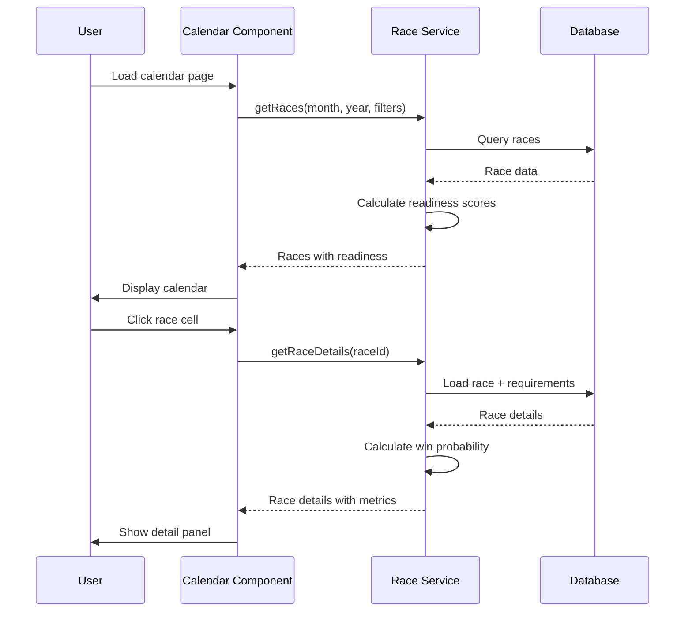
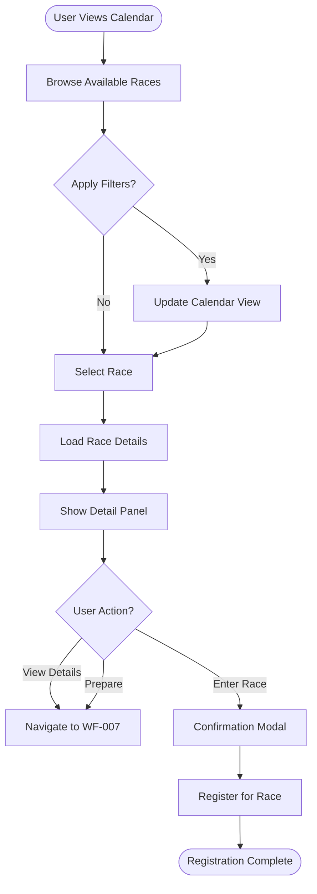
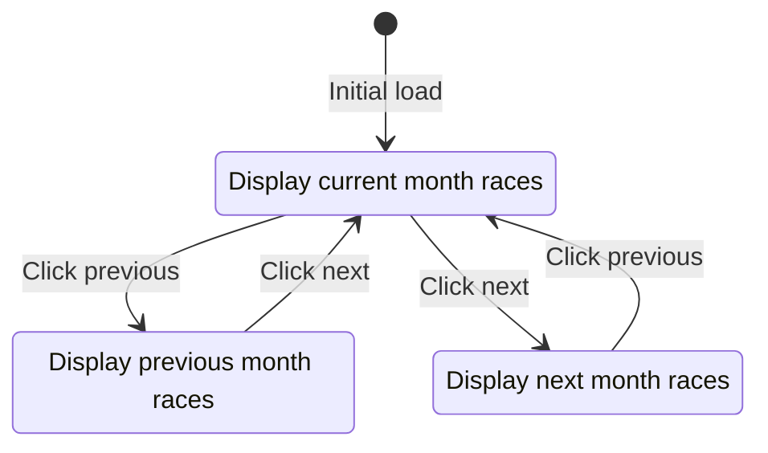
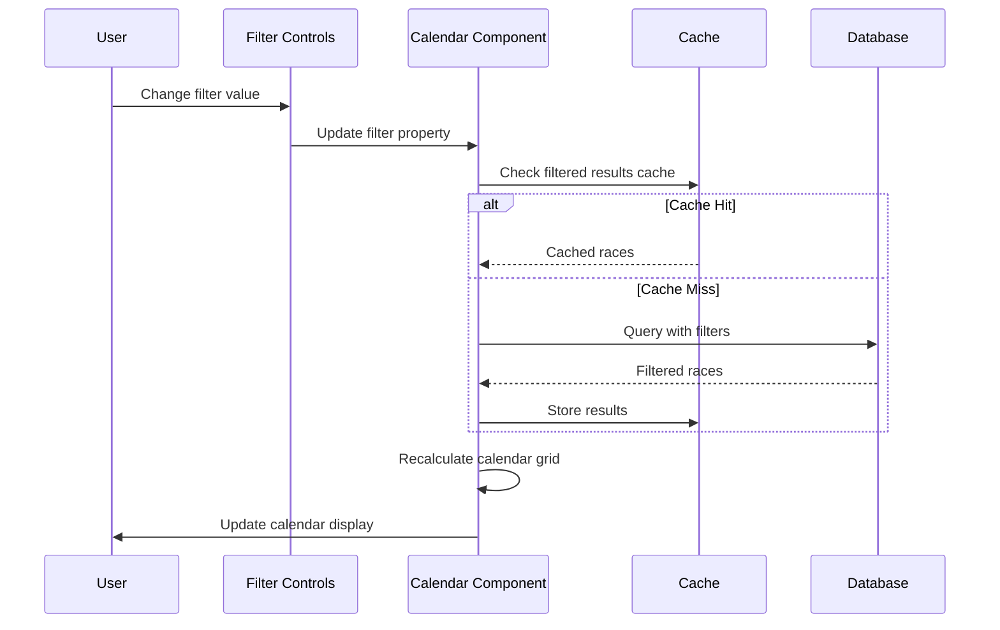

# WF-006: Race Calendar View

## Umamusume Pretty Derby Career Planner

**Document Version**: 2.2.0  
**Date**: January 28, 2026  
**Related Documents**: [PRD-003], [SPEC-003], [FLOW-003], [SEQ-004]

**Source Specs**:

- `.kiro/specs/umamusume-career-planner-main/requirements.md` (Requirement 3: Race Preparation and Strategy)
- `.kiro/specs/umamusume-career-planner-main/design.md` (Race Calendar UI)

**Related Artifacts**:

- PRD: [PRD-003](../prds/PRD-003_Race_Strategy.md)
- SPEC: [SPEC-003](../specs/SPEC-003_Race_Strategy_Technical.md)
- Flow: [FLOW-003](../flows/FLOW-003_Race_Strategy_System.md)
- Tech Flow: [TECH-FLOW-003](../tech-flow/TECH-FLOW-003_Race_Strategy_Flow.md)
- Sequences: [SEQ-004](../sequences/SEQ-004_Race_Registration_and_Outcome.md)
- User Flows: [UF-004](../user-flows/UF-004_Race_Day_Flow.md)
- Related WF: [WF-007](WF-007_Race_Preparation_Screen.md), [WF-001](WF-001_Dashboard_Overview.md)

---

## 1. Overview

### 1.1 Purpose

The Race Calendar View provides a comprehensive schedule of all available races throughout a career run, enabling players to plan race participation, assess readiness, and strategize their racing schedule for optimal stat and skill point acquisition.

### 1.2 Key Objectives

| Objective                | Description                                                               |
| ------------------------ | ------------------------------------------------------------------------- |
| **Race Visibility**      | Display all available races with grade, distance, and surface information |
| **Readiness Assessment** | Show calculated readiness scores for upcoming races                       |
| **Strategic Planning**   | Enable players to plan race participation aligned with goals              |
| **Win Probability**      | Display estimated win probability based on current stats                  |
| **Quick Registration**   | Allow direct race registration from calendar view                         |

### 1.3 User Stories

| ID     | User Story                                                                 | Priority |
| ------ | -------------------------------------------------------------------------- | -------- |
| US-001 | As a player, I want to see all upcoming races in a calendar format         | P0       |
| US-002 | As a player, I want to filter races by grade, distance, and surface        | P0       |
| US-003 | As a player, I want to see my readiness percentage for each race           | P0       |
| US-004 | As a player, I want to view detailed race requirements and win probability | P0       |
| US-005 | As a player, I want AI recommendations for which races to enter            | P1       |

---

## 2. Layout Specifications

### 2.1 Desktop Layout (≥1024px)

┌──────────────────────────────────────────────────────────────────────┐
│ [≡] Menu | Race Calendar: Junior Year, Jan | [?] │
├──────────────────────────────────────────────────────────────────────┤
│ ┌──────────────────────────────────────────────────────────────────┐ │
│ │ CURRENT STATUS: Fans: 12,450 (D Grade) | Next Goal: 20k Fans │ │
│ │ READY FOR: [G3] Fairy Stakes │ │
│ └──────────────────────────────────────────────────────────────────┘ │
├──────────────────────────────────────────────────────────────────────┤
│ ┌───────────────┐ ┌────────────────────────────────────────────────┐ │
│ │ FILTER RACES │ │ SCHEDULE: JANUARY 2026 │ │
│ │ │ │ [ < PREV ] JUNIOR YEAR / JAN [ NEXT > ] │ │
│ │ [Grade] │ ├────────────────────────────────────────────────┤ │
│ │ [x] G1 [x] G2│ │ 11 Jan (Sat) - Week 2 │ │
│ │ [x] G3 [x] OP│ │ ┌────────────────────────────────────────────┐ │ │
│ │ │ │ │ [G3] FAIRY STAKES 🟢 95%│ │ │
│ │ [Distance] │ │ │ Nakayama | Turf | 1600m (Mile) | Right │ │ │
│ │ [ ] Sprint │ │ │ Fans Req: 1,000 | 1st: +10k Fans │ │ │
│ │ [x] Mile │ │ └────────────────────────────────────────────┘ │ │
│ │ [ ] Medium │ │ │ │ │
│ │ [ ] Long │ │ 25 Jan (Sat) - Week 4 │ │ │
│ │ │ │ ┌────────────────────────────────────────────┐ │ │
│ │ [Surface] │ │ │ [OP] WAKAGOMA STAKES 🟡 80%│ │ │
│ │ [x] Turf │ │ │ Kyoto | Turf | 2000m (Med) | Right │ │ │
│ │ [ ] Dirt │ │ │ Fans Req: -- | 1st: +5k Fans │ │ │
│ │ │ │ └────────────────────────────────────────────┘ │ │
│ │ [Rotation] │ │ │ │ │
│ │ [ ] Clockwise │ │ ┌────────────────────────────────────────────┐ │ │
│ │ [ ] Counter │ │ │ [OP] NANOHANA PRIZE 🔴 45%│ │ │
│ │ │ │ │ Nakayama | Turf | 1600m (Mile) | Right │ │ │
│ │ │ │ └────────────────────────────────────────────┘ │ │
│ └───────────────┘ └────────────────────────────────────────────────┘ │
│ │
│ ┌──────────────────────────────────────────────────────────────────┐ │
│ │ SELECTED RACE: [G3] FAIRNY STAKES │ │
│ │ ┌──────────────────────────────────────────────────────────────┐ │ │
│ │ │ DETAILS │ │ │
│ │ │ • Conditions: Sunny / Good │ │ │
│ │ │ • Rivals: [Symboli Rudolf (A)] [Oguri Cap (B+)] │ │ │
│ │ │ • Strategy: [Leader] recommended │ │ │
│ │ │ │ │ │
│ │ │ [ RESERVE (Cost: 0 TP) ] [ ANALYZE ] [ CANCEL ] │ │ │
│ │ └──────────────────────────────────────────────────────────────┘ │ │
│ └──────────────────────────────────────────────────────────────────┘ │
└──────────────────────────────────────────────────────────────────────┘

### 2.2 Tablet Layout (640px-1024px)

┌────────────────────────────────────────────────────┐
│ [≡] Menu | Race Schedule: JAN [?] │
├────────────────────────────────────────────────────┤
│ Fans: 12.4k (D) | Goal: 20k Fans │
├────────────────────────────────────────────────────┤
│ │
│ [ < Prev ] Year 1 / JAN (Junior) [ Next > ] │
│ │
│ ┌────────────────────────────────────────────────┐ │
│ │ 11 Jan (Sat) │ │
│ │ ┌────────────────────────────────────────────┐ │ │
│ │ │ [G3] FAIRY STAKES 🟢 95%│ │ │
│ │ │ Nakayama | Turf | 1600m > │ │ │
│ │ └────────────────────────────────────────────┘ │ │
│ │ 1st: +10k Fans | Req: 1k Fans │ │
│ └────────────────────────────────────────────────┘ │
│ │
│ ┌────────────────────────────────────────────────┐ │
│ │ 25 Jan (Sat) │ │
│ │ ┌────────────────────────────────────────────┐ │ │
│ │ │ [OP] WAKAGOMA STAKES 🟡 80%│ │ │
│ │ │ Kyoto | Turf | 2000m > │ │ │
│ │ └────────────────────────────────────────────┘ │ │
│ └────────────────────────────────────────────────┘ │
│ │
│ ┌────────────────────────────────────────────────┐ │
│ │ [OP] NANOHANA PRIZE 🔴 45%│ │ │
│ │ Nakayama | Turf | 1600m > │ │ │
│ └────────────────────────────────────────────────┘ │
│ │
│ [ SELECTED: [G3] FAIRY STAKES ] │
│ Conditions: Sunny / Good │
│ Rivals: Symboli Rudolf (A) │
│ │
│ [ RESERVE ] [ DETAILS ] [ CANCEL ] │
└────────────────────────────────────────────────────┘

### 2.3 Mobile Layout (<640px)

┌──────────────────────────────┐
│ [≡] Menu | Schedule [?] │
├──────────────────────────────┤
│ Fans: 12.4k (D) - Goal: 20k │
├──────────────────────────────┤
│ │
│ [<] Year 1 / JAN (Jr) [>] │
│ │
│ ┌──────────────────────────┐ │
│ │ 11 JAN: [G3] FAIRY S... │ │
│ │ 🟢 95% | Turf | 1600m │ │
│ │ 1st: +10k | Req: 1k │ │
│ └──────────────────────────┘ │
│ │
│ ┌──────────────────────────┐ │
│ │ 25 JAN: [OP] WAKAGOM... │ │
│ │ 🟡 80% | Turf | 2000m │ │
│ │ 1st: +5k | Req: -- │ │
│ └──────────────────────────┘ │
│ │
│ ┌──────────────────────────┐ │
│ │ 25 JAN: [OP] NANOHAN... │ │
│ │ 🔴 45% | Turf | 1600m │ │
│ └──────────────────────────┘ │
│ │
│ === SELECTED RACE === │
│ [G3] FAIRY STAKES │
│ Turf / 1600m (Mile) / Right │
│ Condition: Sunny / Good │
│ │
│ [ RESERVE ] [ INFO ] [ X ] │
│ │
└──────────────────────────────┘
│ Bottom Navigation Bar │
│ [🏠][👤][⚡][🏆][🤖][⚙️] │
└──────────────────────────────┘

---

## 3. Component Specifications

### 3.1 Calendar Component

**Component**: `app/Livewire/Race/RaceCalendar.php`

```php
class RaceCalendar extends Component
{
    public $currentMonth;
    public $currentYear;
    public $selectedRaceId = null;

    // Filters
    public $gradeFilter = 'all';
    public $distanceFilter = 'all';
    public $surfaceFilter = 'all';

    // View mode
    public $viewMode = 'calendar'; // calendar or list

    public function mount()
    {
        $this->currentMonth = now()->month;
        $this->currentYear = now()->year;
    }

    public function selectRace($raceId)
    {
        $this->selectedRaceId = $raceId;
        $this->dispatch('race-selected', raceId: $raceId);
    }

    public function getRacesProperty()
    {
        return Race::query()
            ->when($this->gradeFilter !== 'all', function ($query) {
                $query->where('grade', $this->gradeFilter);
            })
            ->when($this->distanceFilter !== 'all', function ($query) {
                $query->where('distance_category', $this->distanceFilter);
            })
            ->when($this->surfaceFilter !== 'all', function ($query) {
                $query->where('surface', $this->surfaceFilter);
            })
            ->whereMonth('scheduled_date', $this->currentMonth)
            ->whereYear('scheduled_date', $this->currentYear)
            ->orderBy('scheduled_date')
            ->get();
    }

    public function render()
    {
        return view('livewire.race.race-calendar');
    }
}
```

**Visual Elements**:

| Element          | Description                                          |
| ---------------- | ---------------------------------------------------- |
| Month Navigation | Previous/Next buttons to navigate months             |
| Calendar Grid    | 7-column grid showing days with race indicators      |
| Race Indicator   | Colored badge showing grade, readiness, and distance |
| Filter Controls  | Dropdown selectors for grade, distance, surface      |
| View Toggle      | Switch between calendar and list view                |

### 3.2 Race Cell Component

**Component**: `resources/views/components/race/calendar-cell.blade.php`

```blade
<div class="race-cell"
     data-testid="race-cell-{{ $race->id }}"
     wire:click="selectRace({{ $race->id }})">

    <div class="race-cell__date">{{ $race->day }}</div>

    @if($race)
        <div class="race-cell__grade badge-{{ strtolower($race->grade) }}">
            {{ $race->grade }}
        </div>

        <div class="race-cell__readiness readiness-{{ $race->readiness_tier }}">
            {{ $race->readiness_icon }} {{ $race->readiness_percentage }}%
        </div>

        <div class="race-cell__distance">
            {{ $race->distance }}m
        </div>

        @if($race->is_registered)
            <span class="race-cell__registered">✓ Registered</span>
        @endif
    @endif
</div>
```

**Readiness Indicators**:

| Readiness | Icon | Color  | Range  |
| --------- | ---- | ------ | ------ |
| Excellent | 🟢   | Green  | ≥85%   |
| Good      | 🟡   | Yellow | 70-84% |
| Fair      | 🟠   | Orange | 55-69% |
| Poor      | 🔴   | Red    | <55%   |

### 3.3 Race Detail Panel

**Component**: `app/Livewire/Race/RaceDetailPanel.php`

```php
class RaceDetailPanel extends Component
{
    public Race $race;
    public Character $character;

    public function mount(Race $race, Character $character)
    {
        $this->race = $race;
        $this->character = $character;
    }

    public function getReadinessProperty()
    {
        return app(RaceReadinessService::class)
            ->calculateReadiness($this->character, $this->race);
    }

    public function getWinProbabilityProperty()
    {
        return app(RaceStrategyService::class)
            ->calculateWinProbability($this->character, $this->race);
    }

    public function render()
    {
        return view('livewire.race.race-detail-panel', [
            'readiness' => $this->readiness,
            'winProbability' => $this->winProbability,
        ]);
    }
}
```

**Visual Format**:

```
┌───────────────────────────────────────────────────┐
│ Race Name (Grade)                                 │
├───────────────────────────────────────────────────┤
│ Date: [Date] (Turn [X])                           │
│ Grade: [G1/G2/G3/OP] | Track: [Track Name]       │
│ Distance: [Category] ([Meters]m) | Surface: [Type]│
│ Weather: [Weather] | Condition: [Condition]       │
│                                                   │
│ Readiness: [Icon] [X]% ([Status])                │
│ Win Probability: [X]%                             │
│ Prize Money: ¥[Amount] (1st place)                │
│ Skill Points: [Range] (Based on placement)        │
│                                                   │
│ Stat Requirements:                                │
│ • Speed:   [Required] (Current: [Value]) [Icon]   │
│ • Stamina: [Required] (Current: [Value]) [Icon]   │
│ • Power:   [Required] (Current: [Value]) [Icon]   │
│                                                   │
│ Recommended Running Style: [Style] ([Japanese])   │
│                                                   │
│ [VIEW DETAILS] [ENTER RACE] [PREPARE]             │
└───────────────────────────────────────────────────┘
```

**Track Condition Effects (Global English Server - Jan 2026)**:

| Condition | Power Penalty | Speed Penalty | Stamina Drain | Description |
|-----------|---------------|---------------|---------------|-------------|
| Firm | None | None | None | Optimal racing conditions |
| Good | -50 Power | None | None | Slightly soft ground |
| Soft | -50 to -100 Power | None | +2%/sec | Wet conditions, increased stamina drain |
| Heavy | -50 to -100 Power | -50 Speed | +2%/sec | Very wet, significant penalties |

**Weather Impact on Track Conditions**:

- Weather affects track condition probability, not stats directly
- Sunny → Higher chance of Firm/Good
- Cloudy → Higher chance of Good/Soft
- Rainy → Higher chance of Soft/Heavy

**Class Pyramid and Fan Requirements**:

| Class | Fan Requirement | Description |
|-------|-----------------|-------------|
| Debut | 0 | Starting class |
| Beginner | 0 | Entry level |
| Bronze | 5,000 | First milestone |
| Silver | 20,000 | Intermediate |
| Gold | 50,000 | Advanced |
| Platinum | 100,000 | Expert |
| Star | 160,000 | Elite |
| Top Star | 240,000 | Top tier |
| Legend | 320,000 | Maximum class |

### 3.4 Filter Component

**Component**: `resources/views/components/race/calendar-filters.blade.php`

```blade
<div class="calendar-filters" data-testid="calendar-filters">
    <div class="filter-group">
        <label for="grade-filter">Grade</label>
        <select id="grade-filter" wire:model.live="gradeFilter">
            <option value="all">All Grades</option>
            <option value="G1">G1</option>
            <option value="G2">G2</option>
            <option value="G3">G3</option>
            <option value="OP">Open</option>
        </select>
    </div>

    <div class="filter-group">
        <label for="distance-filter">Distance</label>
        <select id="distance-filter" wire:model.live="distanceFilter">
            <option value="all">All Distances</option>
            <option value="sprint">Sprint (1000-1400m)</option>
            <option value="mile">Mile (1401-1800m)</option>
            <option value="medium">Medium (1801-2400m)</option>
            <option value="long">Long (2401m+)</option>
        </select>
    </div>

    <div class="filter-group">
        <label for="surface-filter">Surface</label>
        <select id="surface-filter" wire:model.live="surfaceFilter">
            <option value="all">All Surfaces</option>
            <option value="turf">Turf</option>
            <option value="dirt">Dirt</option>
        </select>
    </div>

    <div class="view-toggle">
        <button wire:click="$set('viewMode', 'calendar')"
                class="{{ $viewMode === 'calendar' ? 'active' : '' }}">
            Calendar
        </button>
        <button wire:click="$set('viewMode', 'list')"
                class="{{ $viewMode === 'list' ? 'active' : '' }}">
            List
        </button>
    </div>
</div>
```

### 3.5 List View Component

**Alternative View**: `resources/views/components/race/list-view.blade.php`

```blade
<div class="race-list" data-testid="race-list">
    @forelse($races as $race)
        <div class="race-list-item"
             wire:click="selectRace({{ $race->id }})"
             data-testid="race-list-item-{{ $race->id }}">

            <div class="race-list-item__header">
                <span class="badge badge-{{ strtolower($race->grade) }}">
                    {{ $race->grade }}
                </span>
                <h3 class="race-name">{{ $race->name }}</h3>
            </div>

            <div class="race-list-item__details">
                <span class="race-date">{{ $race->formatted_date }}</span>
                <span class="race-distance">{{ $race->distance }}m ({{ $race->distance_category }})</span>
                <span class="race-surface">{{ $race->surface }}</span>
            </div>

            <div class="race-list-item__metrics">
                <div class="metric">
                    <span class="metric-label">Readiness</span>
                    <span class="metric-value readiness-{{ $race->readiness_tier }}">
                        {{ $race->readiness_icon }} {{ $race->readiness_percentage }}%
                    </span>
                </div>
                <div class="metric">
                    <span class="metric-label">Win Prob</span>
                    <span class="metric-value">{{ $race->win_probability }}%</span>
                </div>
            </div>

            <div class="race-list-item__actions">
                <button wire:click.stop="viewDetails({{ $race->id }})">Details</button>
                <button wire:click.stop="enterRace({{ $race->id }})">Enter</button>
            </div>
        </div>
    @empty
        <p class="text-gray-500">No races match your filters</p>
    @endforelse
</div>
```

---

## 4. State Management

### 4.1 Livewire State

**State Properties**:

```php
public $currentMonth = 1;
public $currentYear = 2026;
public $selectedRaceId = null;
public $gradeFilter = 'all';
public $distanceFilter = 'all';
public $surfaceFilter = 'all';
public $viewMode = 'calendar';
```

**Computed Properties**:

```php
public function getRacesProperty()
{
    // Filtered and sorted races for current month/year
}

public function getSelectedRaceProperty()
{
    return Race::find($this->selectedRaceId);
}

public function getCalendarDaysProperty()
{
    // Array of day objects with race data
}
```

### 4.2 Data Flow



### 4.3 Cache Strategy

| Data Type            | Cache Key                            | TTL       | Invalidation         |
| -------------------- | ------------------------------------ | --------- | -------------------- |
| Race list (filtered) | `races:{month}:{year}:{filters}`     | 1 hour    | On race update       |
| Readiness scores     | `readiness:{character_id}:{race_id}` | 5 minutes | On stat update       |
| Win probability      | `win_prob:{character_id}:{race_id}`  | 5 minutes | On stat/skill update |

---

## 5. Interaction Patterns

### 5.1 Race Selection Flow



### 5.2 Calendar Navigation Flow



### 5.3 Filter Application Flow



---

## 6. Accessibility Specifications

### 6.1 WCAG 2.2 AA Compliance

| Criterion                           | Implementation                     | Test Method             |
| ----------------------------------- | ---------------------------------- | ----------------------- |
| **1.1.1 Non-text Content**          | All icons have `aria-label`        | Screen reader testing   |
| **1.4.3 Contrast Ratio**            | 4.5:1 minimum for text             | Color contrast analyzer |
| **2.1.1 Keyboard**                  | Full keyboard navigation support   | Keyboard-only testing   |
| **2.4.3 Focus Order**               | Logical tab order through calendar | Tab key traversal       |
| **2.4.7 Focus Visible**             | Clear focus indicators on cells    | Visual inspection       |
| **3.2.4 Consistent Identification** | Consistent race grade badges       | Manual review           |
| **4.1.2 Name, Role, Value**         | Proper ARIA attributes on controls | axe-core scan           |

### 6.2 Keyboard Navigation

| Action                 | Shortcut           | Context                |
| ---------------------- | ------------------ | ---------------------- |
| Navigate calendar days | `Arrow Keys`       | Calendar grid          |
| Select race            | `Enter` or `Space` | When race cell focused |
| Previous month         | `PageUp` or `[`    | Calendar view          |
| Next month             | `PageDown` or `]`  | Calendar view          |
| Open filters           | `F`                | Calendar view          |
| Switch to list view    | `L`                | Calendar view          |
| Enter race             | `E`                | When race selected     |

### 6.3 Screen Reader Announcements

```html
<!-- Calendar navigation -->
<nav aria-label="Race calendar navigation">
    <button aria-label="Previous month">←</button>
    <h2 id="current-month" aria-live="polite">January 2026</h2>
    <button aria-label="Next month">→</button>
</nav>

<!-- Calendar grid -->
<div role="grid" aria-labelledby="current-month">
    <div role="row">
        <div role="columnheader">Sunday</div>
        <!-- ... -->
    </div>
    <div role="row">
        <div
            role="gridcell"
            aria-label="January 10, Kanto Okami Cup, G1 race, 2400 meters, readiness 85 percent excellent"
            tabindex="0"
        >
            <!-- Cell content -->
        </div>
    </div>
</div>

<!-- Race selection announcement -->
<div aria-live="polite" aria-atomic="true" class="sr-only">
    Kanto Okami Cup selected. G1 race on January 10, 2400 meters turf. Readiness
    85 percent, win probability 35 percent.
</div>
```

---

## 7. Performance Specifications

### 7.1 Performance Targets

| Metric                 | Target        | Measurement                   |
| ---------------------- | ------------- | ----------------------------- |
| **Calendar Load**      | < 1.5 seconds | Time to first render          |
| **Filter Application** | < 300ms       | Filter change to UI update    |
| **Race Selection**     | < 200ms       | Click to detail panel display |
| **Month Navigation**   | < 400ms       | Month change animation        |
| **List View Switch**   | < 250ms       | View mode transition          |

### 7.2 Optimization Strategies

| Strategy               | Implementation                      | Impact                |
| ---------------------- | ----------------------------------- | --------------------- |
| **Lazy Loading**       | Defer off-screen month data         | -40% initial load     |
| **Query Optimization** | Eager load race requirements        | -60% query count      |
| **Response Caching**   | Cache filtered race lists (1hr TTL) | -80% database queries |
| **Debounced Filters**  | 200ms debounce on filter changes    | Reduced re-renders    |
| **Virtual Scrolling**  | List view uses virtual scroll       | Handles 500+ races    |

### 7.3 Bundle Size Budget

| Asset Type | Budget | Current | Status           |
| ---------- | ------ | ------- | ---------------- |
| JavaScript | 45 KB  | 42 KB   | ✅ Within budget |
| CSS        | 18 KB  | 16 KB   | ✅ Within budget |
| Images     | 30 KB  | 25 KB   | ✅ Within budget |
| Total      | 93 KB  | 83 KB   | ✅ Within budget |

---

## 8. Testing Specifications

### 8.1 Unit Tests

**Test File**: `tests/Unit/Services/RaceReadinessServiceTest.php`

```php
test('calculates race readiness correctly', function () {
    $character = Character::factory()->create([
        'speed' => 568,
        'stamina' => 442,
        'power' => 443,
    ]);

    $race = Race::factory()->create([
        'required_speed' => 520,
        'required_stamina' => 480,
        'required_power' => 440,
        'distance' => 2400,
        'surface' => 'turf',
    ]);

    $service = app(RaceReadinessService::class);
    $readiness = $service->calculateReadiness($character, $race);

    expect($readiness->percentage)->toBeGreaterThanOrEqual(70)
        ->and($readiness->tier)->toBe('good');
});

test('accounts for aptitude bonuses in readiness', function () {
    $character = Character::factory()->create([
        'aptitude_turf' => AptitudeGrade::A,
        'aptitude_medium' => AptitudeGrade::S,
    ]);

    $race = Race::factory()->create([
        'distance_category' => 'medium',
        'surface' => 'turf',
    ]);

    $service = app(RaceReadinessService::class);
    $readiness = $service->calculateReadiness($character, $race);

    expect($readiness->aptitude_bonus)->toBeGreaterThan(0);
});
```

### 8.2 Feature Tests

**Test File**: `tests/Feature/Race/RaceCalendarTest.php`

```php
test('user can view race calendar', function () {
    $user = User::factory()->create();
    $races = Race::factory()->count(5)->create();

    $this->actingAs($user)
        ->get(route('races.calendar'))
        ->assertOk()
        ->assertSee('Race Calendar')
        ->assertSee('January 2026');
});

test('user can filter races by grade', function () {
    $user = User::factory()->create();
    Race::factory()->create(['grade' => 'G1']);
    Race::factory()->create(['grade' => 'G2']);

    Livewire::actingAs($user)
        ->test(RaceCalendar::class)
        ->set('gradeFilter', 'G1')
        ->assertSee('G1')
        ->assertDontSee('G2');
});

test('user can navigate months', function () {
    $user = User::factory()->create();

    Livewire::actingAs($user)
        ->test(RaceCalendar::class)
        ->call('nextMonth')
        ->assertSet('currentMonth', 2);
});
```

### 8.3 E2E Tests (Playwright)

**Test File**: `tests/e2e/race-calendar.spec.js`

```javascript
test.describe("WF-006: Race Calendar View", () => {
    test("displays race calendar correctly", async ({ page }) => {
        await page.goto("/races/calendar");

        // Check calendar structure
        await expect(page.getByTestId("calendar-grid")).toBeVisible();
        await expect(page.getByRole("grid")).toBeVisible();

        // Check month header
        await expect(
            page.getByRole("heading", { name: /January 2026/ }),
        ).toBeVisible();

        // Check race indicators
        const raceCells = page.getByTestId(/^race-cell-/);
        await expect(raceCells.first()).toBeVisible();
    });

    test("displays race details on selection", async ({ page }) => {
        await page.goto("/races/calendar");

        // Click race cell
        await page.getByTestId("race-cell-1").click();

        // Verify detail panel
        const detailPanel = page.getByTestId("race-detail-panel");
        await expect(detailPanel).toBeVisible();
        await expect(detailPanel).toContainText("Kanto Okami Cup");
        await expect(detailPanel).toContainText("Readiness:");
        await expect(detailPanel).toContainText("Win Probability:");
    });

    test("filters races correctly", async ({ page }) => {
        await page.goto("/races/calendar");

        // Apply grade filter
        await page.getByTestId("grade-filter").selectOption("G1");

        // Verify filtered results
        await expect(page.getByText("G2")).not.toBeVisible();
        await expect(page.getByText("G1")).toBeVisible();
    });

    test("navigates months correctly", async ({ page }) => {
        await page.goto("/races/calendar");

        // Click next month
        await page.getByLabel("Next month").click();

        await expect(
            page.getByRole("heading", { name: /February 2026/ }),
        ).toBeVisible();
    });

    test("switches between calendar and list view", async ({ page }) => {
        await page.goto("/races/calendar");

        // Switch to list view
        await page.getByRole("button", { name: "List" }).click();

        await expect(page.getByTestId("race-list")).toBeVisible();
        await expect(page.getByTestId("calendar-grid")).not.toBeVisible();
    });

    test("supports keyboard navigation", async ({ page }) => {
        await page.goto("/races/calendar");

        // Tab to calendar grid
        await page.keyboard.press("Tab");
        await page.keyboard.press("Tab");

        // Navigate with arrow keys
        await page.keyboard.press("ArrowRight");
        await page.keyboard.press("ArrowDown");

        // Select race with Enter
        await page.keyboard.press("Enter");

        await expect(page.getByTestId("race-detail-panel")).toBeVisible();
    });
});
```

### 8.4 Accessibility Tests

**Test File**: `tests/e2e/accessibility/race-calendar.spec.js`

```javascript
import { test, expect } from "@playwright/test";
import AxeBuilder from "@axe-core/playwright";

test.describe("WF-006: Accessibility", () => {
    test("has no automatically detectable accessibility issues", async ({
        page,
    }) => {
        await page.goto("/races/calendar");

        const accessibilityScanResults = await new AxeBuilder({ page })
            .withTags(["wcag2a", "wcag2aa", "wcag21a", "wcag21aa"])
            .analyze();

        expect(accessibilityScanResults.violations).toEqual([]);
    });

    test("announces race selection to screen readers", async ({ page }) => {
        await page.goto("/races/calendar");

        const liveRegion = page.locator('[aria-live="polite"]');

        await page.getByTestId("race-cell-1").click();

        await expect(liveRegion).toContainText(/Kanto Okami Cup selected/);
    });

    test("calendar grid has proper ARIA attributes", async ({ page }) => {
        await page.goto("/races/calendar");

        const grid = page.getByRole("grid");
        await expect(grid).toBeVisible();

        const cells = grid.locator('[role="gridcell"]');
        await expect(cells.first()).toHaveAttribute("aria-label");
    });

    test("supports keyboard-only workflow", async ({ page }) => {
        await page.goto("/races/calendar");

        // Navigate using keyboard only
        await page.keyboard.press("Tab"); // Filters
        await page.keyboard.press("Tab"); // Previous month
        await page.keyboard.press("Tab"); // Calendar grid
        await page.keyboard.press("ArrowRight"); // Navigate cell
        await page.keyboard.press("Enter"); // Select race

        // Verify race detail visible
        await expect(page.getByTestId("race-detail-panel")).toBeVisible();
    });
});
```

---

## 9. Related Documentation

### 9.1 Product Requirements

- [PRD-003: Race Strategy](../prds/PRD-003_Race_Strategy.md)

### 9.2 Technical Specifications

- [SPEC-003: Race Strategy Technical](../specs/SPEC-003_Race_Strategy_Technical.md)

### 9.3 Flow Documentation

- [FLOW-003: Race Strategy System](../flows/FLOW-003_Race_Strategy_System.md)
- [TECH-FLOW-003: Race Strategy Flow](../tech-flow/TECH-FLOW-003_Race_Strategy_Flow.md)

### 9.4 Sequence Diagrams

- [SEQ-004: Race Registration and Outcome](../sequences/SEQ-004_Race_Registration_and_Outcome.md)

### 9.5 User Flows

- [UF-004: Race Day Flow](../user-flows/UF-004_Race_Day_Flow.md)

### 9.6 Related Wireframes

- [WF-007: Race Preparation Screen](WF-007_Race_Preparation_Screen.md)
- [WF-001: Dashboard Overview](WF-001_Dashboard_Overview.md)

---

## 10. Version History

| Version | Date       | Author           | Changes                                                                                                                                                                              |
| ------- | ---------- | ---------------- | ------------------------------------------------------------------------------------------------------------------------------------------------------------------------------------ |
| 2.2.0   | 2026-01-28 | Development Team | Updated with verified game mechanics from Global English Server: track conditions (Firm/Good/Soft/Heavy), class pyramid with fan requirements, weather affects track condition probability |
| 2.0.0   | 2026-01-24 | Development Team | Comprehensive update aligned with v2.0.0 implementation; added readiness calculations, win probability, filtering, list view, accessibility specifications, and testing requirements |
| 1.0.0   | 2026-01-14 | Development Team | Initial wireframe specification                                                                                                                                                      |

---

## 11. Notes

**Implementation Status**: ✅ Complete

**Known Issues**: None

**Future Enhancements**:

- Calendar export to iCal/Google Calendar
- Race reminder notifications
- Historical race result overlay
- Multi-character race comparison
- AI-powered race scheduling optimization
- Community race participation statistics

---

_This wireframe specification reflects the current implementation of the Race Calendar View and serves as the authoritative reference for UI/UX development and testing._
