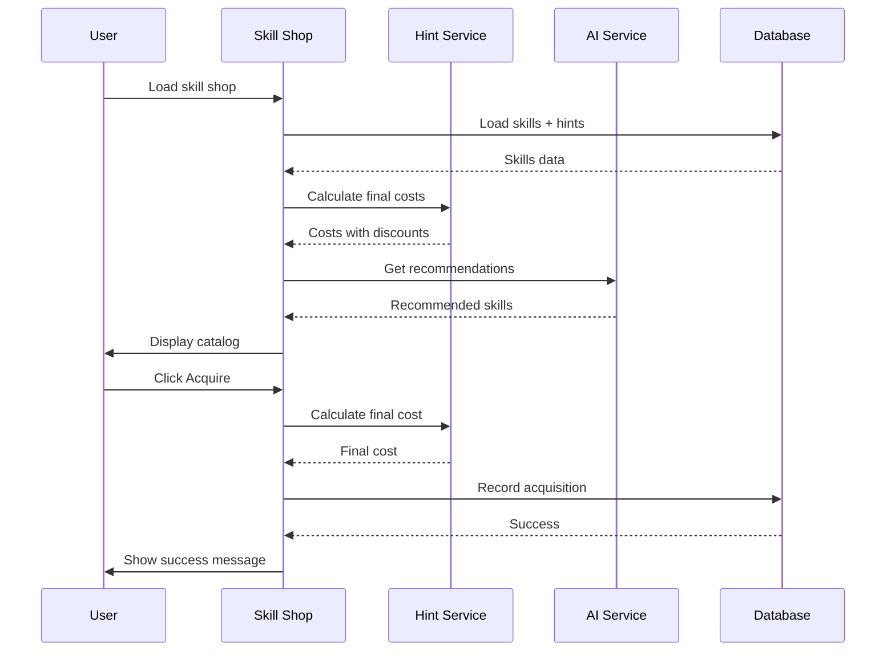
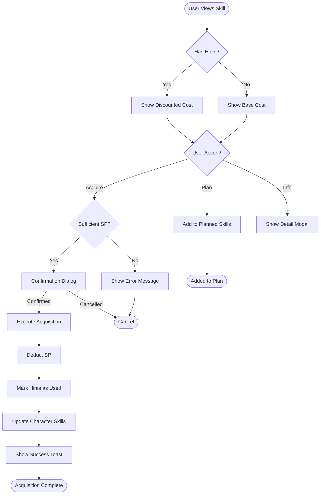
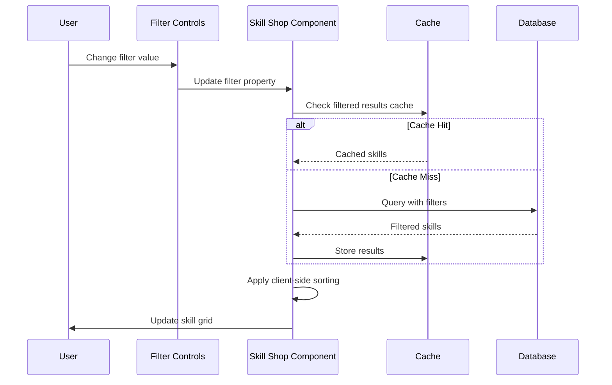
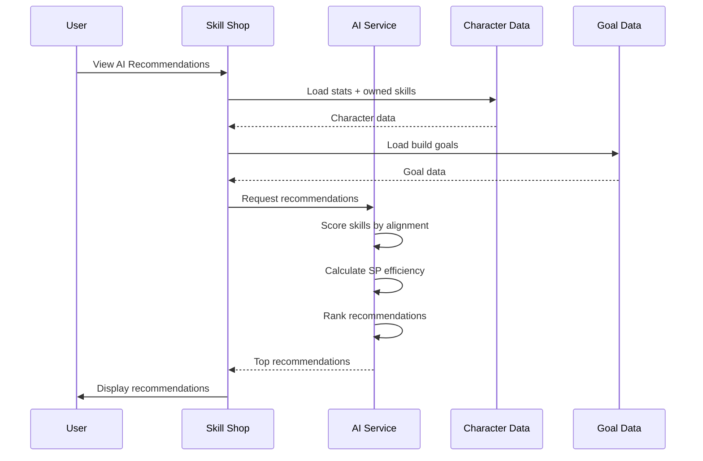

````markdown
# WF-008: Skill Shop Interface

## Umamusume Pretty Derby Career Planner

**Document Version**: 2.2.0  
**Date**: January 28, 2026  
**Related Documents**: [PRD-004], [SPEC-004], [FLOW-004], [SEQ-003]

**Source Specs**:

- `.kiro/specs/umamusume-career-planner-main/requirements.md` (Requirement 4: Comprehensive Skill Management)
- `.kiro/specs/umamusume-career-planner-main/design.md` (Skill Shop UI)

**Related Artifacts**:

- PRD: [PRD-004](../prds/PRD-004_Skill_Management.md)
- SPEC: [SPEC-004](../specs/SPEC-004_Skill_Management_Technical.md)
- Flow: [FLOW-004](../flows/FLOW-004_Skill_Management_System.md)
- Tech Flow: [TECH-FLOW-004](../tech-flow/TECH-FLOW-004_Skill_Management_Flow.md)
- Sequences: [SEQ-003](../sequences/SEQ-003_Skill_Acquisition_and_Upgrade.md)
- User Flows: [UF-005](../user-flows/UF-005_Skill_Management_Flow.md)
- Related WF: [WF-009](WF-009_Skill_Loadout_Manager.md), [WF-001](WF-001_Dashboard_Overview.md)

---

## 1. Overview

### 1.1 Purpose

The Skill Shop Interface provides a comprehensive catalog of available skills, enabling players to browse, search, and acquire skills with SP (Skill Points) cost optimization through hint tracking and discount calculation.

### 1.2 Key Objectives

| Objective                     | Description                                           |
| ----------------------------- | ----------------------------------------------------- |
| **Skill Discovery**           | Browse and search 500+ skills with advanced filtering |
| **SP Cost Management**        | Display hint-based discounts and budget optimization  |
| **Skill Planning**            | Mark skills as planned, skipped, or acquired          |
| **Evolution Tracking**        | Show skill evolution paths and requirements           |
| **Strategic Recommendations** | AI-powered skill recommendations based on build goals |

### 1.3 User Stories

| ID     | User Story                                                                     | Priority |
| ------ | ------------------------------------------------------------------------------ | -------- |
| US-001 | As a player, I want to search skills by English or Japanese name               | P0       |
| US-002 | As a player, I want to see hint-based SP cost reductions before purchasing     | P0       |
| US-003 | As a player, I want to filter skills by type, rarity, and distance suitability | P0       |
| US-004 | As a player, I want to see skill evolution paths and requirements              | P1       |
| US-005 | As a player, I want AI recommendations for optimal skill builds                | P1       |

---

## 2. Layout Specifications

### 2.1 Desktop Layout (≥1024px)

```markdown
┌──────────────────────────────────────────────────────────────────────┐
│ [≡] Menu | Skill Shop [?] │
├──────────────────────────────────────────────────────────────────────┤
│ ┌──────────────────────────────────────────────────────────────────┐ │
│ │ CURRENT SP: 450 pt | Total Earned: 2,400 | Spent: 1,950 │ │
│ └──────────────────────────────────────────────────────────────────┘ │
├──────────────────────────────────────────────────────────────────────┤
│ ┌──────────────────────────────────────────────────────────────────┐ │
│ │ 🤖 ADVISOR RECOMMENDS: │ │
│ │ ┌──────────────────────┐ ┌──────────────────────┐ │ │
│ │ │ 1. Endurance Master │ │ 2. Speed Star │ │ │
│ │ │ [Stamina] [Rare] │ │ [Speed] [Rare] │ │ │
│ │ │ Cost: 180 -> 144 SP │ │ Cost: 120 -> 96 SP │ │ │
│ │ │ Match: 92% (High) │ │ Match: 85% │ │ │
│ │ └──────────────────────┘ └──────────────────────┘ │ │
│ └──────────────────────────────────────────────────────────────────┘ │
│ │
│ ┌──────────────────────────────────────────────────────────────────┐ │
│ │ FILTERS: [ALL] [SPEED] [STAMINA] [POWER] [GUTS] [WIT] [OTHER] │ │
│ │ RARITY: [ALL] [NORMAL] [RARE] [UNIQUE] │ │
│ └──────────────────────────────────────────────────────────────────┘ │
│ │
│ ┌──────────────────────┐ ┌──────────────────────┐ ┌────────────────┐ │
│ │ Going Strong │ │ Lane Guidance │ │ Inner Strength │ │
│ │ [Speed] [Normal] │ │ [Wit] [Normal] │ │ [Guts] [Rare] │ │
│ │ │ │ │ │ │ │
│ │ Cost: 120 -> 96 SP │ │ Cost: 100 SP │ │ Cost: 160 SP │ │
│ │ [Hint Lv 2: -20%] │ │ [No Hints] │ │ [Hint Lv 0] │ │
│ │ │ │ │ │ │ │
│ │ Effect: Final accel │ │ Effect: Positioning │ │ Effect: Stam.. │ │
│ │ │ │ │ │ │ │
│ │ [ LEARN ] [ PLAN ] │ │ [ LEARN ] [ PLAN ] │ │ [ SP SHORT ] │ │
│ └──────────────────────┘ └──────────────────────┘ └────────────────┘ │
│ ┌──────────────────────┐ ┌──────────────────────┐ ┌────────────────┐ │
│ │ ... │ │ ... │ │ ... │ │
│ └──────────────────────┘ └──────────────────────┘ └────────────────┘ │
└──────────────────────────────────────────────────────────────────────┘
```
````

### 2.2 Tablet Layout (640px-1024px)

```

┌────────────────────────────────────────────────────┐
│ [≡] Menu | Skill Shop [?] │
├────────────────────────────────────────────────────┤
│ SP: 450 (Goal: 20k Earned) │
├────────────────────────────────────────────────────┤
│ │
│ [ ADVISOR ] 1. Endurance Master (92% Match) │
│ │
│ [ FILTERS ] Speed / Rare / Mid │
│ │
│ ┌────────────────────────────────────────────────┐ │
│ │ Going Strong │ │
│ │ [Speed] [Normal] │ │
│ │ 120 -> 96 SP (Hint Lv 2) │ │
│ │ [ LEARN ] [ PLAN ] │ │
│ └────────────────────────────────────────────────┘ │
│ │
│ ┌────────────────────────────────────────────────┐ │
│ │ Lane Guidance │ │
│ │ [Wit] [Normal] │
│ │ 100 SP (No Hints) │ │
│ │ [ LEARN ] [ PLAN ] │ │
│ └────────────────────────────────────────────────┘ │
│ │
│ [ LOAD MORE SKILLS ] │
└────────────────────────────────────────────────────┘

```

### 2.3 Mobile Layout (<640px)

```

┌──────────────────────────────┐
│ [≡] Skill Shop [?] │
├──────────────────────────────┤
│ SP: 450 (Goal: 20k) │
├──────────────────────────────┤
│ │
│ [ 🤖 ADVISOR ] │
│ 1. Endurance Master (92%) │
│ │
│ [ FILTERS ] Spd/Rare/Mid │
│ │
│ ┌──────────────────────────┐ │
│ │ Going Strong │ │
│ │ [Speed] [Normal] │ │
│ │ 120 -> 96 SP (Lv2) │ │
│ │ [ LEARN ] [ PLAN ] │ │
│ └──────────────────────────┘ │
│ │
│ ┌──────────────────────────┐ │
│ │ Lane Guidance │ │
│ │ [Wit] [Normal] │ │
│ │ 100 SP (No Hints) │ │
│ │ [ LEARN ] [ PLAN ] │ │
│ └──────────────────────────┘ │
│ │
│ [ LOAD MORE SKILLS ] │
│ │
└──────────────────────────────┘
│ [🏠] [👤] [⚡] [🏆] [🤖] [⚙️] │
└──────────────────────────────┘

```

---

## 3. Component Specifications

### 3.1 SP Balance Widget

**Component**: `app/Livewire/Skills/SPBalanceWidget.php`

```php
class SPBalanceWidget extends Component
{
    public Character $character;

    public function mount(Character $character)
    {
        $this->character = $character;
    }

    public function getSPDataProperty()
    {
        return [
            'current' => $this->character->total_sp_available,
            'earned' => $this->character->total_sp_earned,
            'spent' => $this->character->skills()->sum('sp_cost_paid'),
            'planned' => $this->character->skills()
                ->wherePivot('status', 'planned')
                ->sum('sp_cost'),
        ];
    }

    public function getBudgetStatusProperty()
    {
        $data = $this->sp_data;
        $remaining = $data['current'] - $data['planned'];

        return match(true) {
            $remaining >= 300 => ['status' => 'healthy', 'color' => 'green', 'icon' => '🟢'],
            $remaining >= 150 => ['status' => 'moderate', 'color' => 'yellow', 'icon' => '🟡'],
            $remaining >= 0 => ['status' => 'tight', 'color' => 'orange', 'icon' => '🟠'],
            default => ['status' => 'deficit', 'color' => 'red', 'icon' => '🔴'],
        };
    }

    public function render()
    {
        return view('livewire.skills.sp-balance-widget');
    }
}
```

**Visual Format**:

```
┌────────────────────────────────────────┐
│ SP Balance                             │
├────────────────────────────────────────┤
│ Current SP: 450                        │
│ Total Earned: 2,400 | Spent: 1,950    │
│ Planned SP: 240 (2 skills pending)     │
│                                        │
│ Budget Status: 🟢 Healthy              │
│ Remaining: 210 SP after planned        │
└────────────────────────────────────────┘
```

### 3.2 Skill Search Component

**Component**: `app/Livewire/Skills/SkillSearch.php`

```php
class SkillSearch extends Component
{
    public $search = '';
    public $statusFilter = 'available';
    public $typeFilter = 'all';
    public $rarityFilter = 'all';
    public $distanceFilter = 'all';
    public $styleFilter = 'all';
    public $sortBy = 'recommended';
    public $viewMode = 'grid';

    public function updatedSearch()
    {
        $this->resetPage();
    }

    public function resetFilters()
    {
        $this->reset([
            'search',
            'statusFilter',
            'typeFilter',
            'rarityFilter',
            'distanceFilter',
            'styleFilter',
            'sortBy',
        ]);
    }

    public function getSkillsProperty()
    {
        return Skill::query()
            ->when($this->search, function ($query) {
                $query->where(function ($q) {
                    $q->where('name', 'like', "%{$this->search}%")
                      ->orWhere('name_jp', 'like', "%{$this->search}%");
                });
            })
            ->when($this->statusFilter !== 'all', function ($query) {
                // Filter by acquisition status
            })
            ->when($this->typeFilter !== 'all', function ($query) {
                $query->where('skill_type', $this->typeFilter);
            })
            ->when($this->rarityFilter !== 'all', function ($query) {
                $query->where('rarity', $this->rarityFilter);
            })
            ->orderBy($this->getSortColumn(), $this->getSortDirection())
            ->paginate(12);
    }

    public function render()
    {
        return view('livewire.skills.skill-search');
    }
}
```

### 3.3 Skill Card Component

**Component**: `resources/views/components/skill-card.blade.php`

```blade
<div class="skill-card {{ $skill->rarity }}" data-testid="skill-card-{{ $skill->id }}">
    <div class="skill-card__header">
        <h3 class="skill-card__name">{{ $skill->name }}</h3>
        @if($skill->name_jp)
            <span class="skill-card__name-jp">{{ $skill->name_jp }}</span>
        @endif

        <div class="skill-card__badges">
            <span class="badge badge-{{ strtolower($skill->rarity) }}">
                {{ $skill->rarity }}
            </span>
            <span class="badge badge-{{ strtolower($skill->skill_type) }}">
                {{ $skill->skill_type }}
            </span>
        </div>
    </div>

    <div class="skill-card__cost">
        <div class="cost-breakdown">
            <span class="cost-label">Base Cost:</span>
            <span class="cost-value">{{ $skill->base_sp_cost }} SP</span>
        </div>

        @if($hintLevel > 0)
            <div class="hint-discount">
                <span class="hint-label">Hint Level: {{ $hintLevel }}/5</span>
                <span class="discount-percentage">-{{ $discountPercentage }}%</span>
            </div>
            <div class="final-cost">
                <span class="cost-label">Final Cost:</span>
                <span class="cost-value final">{{ $finalCost }} SP</span>
                @if($finalCost < $skill->base_sp_cost)
                    <span class="cost-savings">✓ Save {{ $skill->base_sp_cost - $finalCost }} SP</span>
                @endif
            </div>
            @if($hasAdditionalDiscounts)
                <div class="additional-discounts">
                    @if($hasFastLearner)
                        <span class="discount-badge">🎓 Fast Learner +10%</span>
                    @endif
                </div>
            @endif
        @else
            <div class="final-cost">
                <span class="cost-label">Final Cost:</span>
                <span class="cost-value">{{ $skill->base_sp_cost }} SP</span>
            </div>
        @endif
    </div>

    <div class="skill-card__requirements">
        @if($skill->distance_requirement)
            <div class="requirement">
                <span class="requirement-label">Distance:</span>
                <span class="requirement-value">{{ $skill->distance_requirement }}</span>
            </div>
        @endif

        @if($skill->style_requirement)
            <div class="requirement">
                <span class="requirement-label">Style:</span>
                <span class="requirement-value">{{ $skill->style_requirement }}</span>
            </div>
        @endif
    </div>

    <div class="skill-card__description">
        <p>{{ $skill->effect_description }}</p>
    </div>

    @if($skill->can_evolve)
        <div class="skill-card__evolution">
            <span class="evolution-indicator">🔄 Can evolve to:</span>
            <span class="evolution-target">{{ $skill->evolution_target->name }}</span>
        </div>
    @endif

    <div class="skill-card__actions">
        @if($isOwned)
            <button class="btn btn-success" disabled>✓ Owned</button>
        @elseif($isPlanned)
            <button wire:click="unplan({{ $skill->id }})" class="btn btn-secondary">
                📋 Planned
            </button>
        @else
            <button wire:click="acquire({{ $skill->id }})" class="btn btn-primary">
                Acquire
            </button>
            <button wire:click="plan({{ $skill->id }})" class="btn btn-secondary">
                Plan
            </button>
        @endif

        <button wire:click="showDetails({{ $skill->id }})" class="btn btn-outline">
            More Info
        </button>
    </div>
</div>
```

**Skill Card States**:

| State           | Visual Indicator              | Actions Available        |
| --------------- | ----------------------------- | ------------------------ |
| Owned           | ✓ Owned badge, green border   | None (disabled)          |
| Planned         | 📋 Planned badge, blue border | Unplan, More Info        |
| Available       | Standard border               | Acquire, Plan, More Info |
| Insufficient SP | Red border, dimmed            | Plan only, More Info     |

### 3.4 Hint Tracking System

**5-Level Hint Discount System (Global English Server - Jan 2026)**:

| Hint Level | Discount Percentage | Example (120 SP Base) |
| ---------- | ------------------- | --------------------- |
| Level 0    | 0%                  | 120 SP                |
| Level 1    | 10%                 | 108 SP (-12)          |
| Level 2    | 20%                 | 96 SP (-24)           |
| Level 3    | 30%                 | 84 SP (-36)           |
| Level 4    | 35%                 | 78 SP (-42)           |
| Level 5    | 40% (max)           | 72 SP (-48)           |

**Additional Discount Sources**:

| Source | Discount | Stacks With Hints |
|--------|----------|-------------------|
| Fast Learner Condition | +10% | Yes |
| Skill Sparks | Variable | Yes |

**Skill Rarities**:

| Rarity | Color | Description |
|--------|-------|-------------|
| Normal | White | Common skills |
| Rare | Gold | Evolved/premium skills |
| Unique | Character-specific | Character-exclusive skills |

**Service**: `app/Services/SkillHintService.php`

```php
class SkillHintService
{
    /**
     * Hint level discount percentages (Global English Server verified)
     */
    private const HINT_DISCOUNTS = [
        0 => 0.00,
        1 => 0.10,
        2 => 0.20,
        3 => 0.30,
        4 => 0.35,
        5 => 0.40, // Maximum discount
    ];

    public function calculateFinalCost(Skill $skill, Character $character): int
    {
        $hintLevel = $this->getHintLevel($skill, $character);
        $baseDiscount = $this->getHintDiscount($hintLevel);
        
        // Apply additional discounts (Fast Learner, etc.)
        $additionalDiscount = $this->getAdditionalDiscounts($character);
        $totalDiscount = min(0.50, $baseDiscount + $additionalDiscount); // Cap at 50%

        return (int) ($skill->base_sp_cost * (1 - $totalDiscount));
    }

    public function getHintLevel(Skill $skill, Character $character): int
    {
        return min(5, $character->skillHints()
            ->where('skill_id', $skill->id)
            ->where('is_used', false)
            ->sum('hint_level'));
    }

    private function getHintDiscount(int $hintLevel): float
    {
        return self::HINT_DISCOUNTS[min(5, $hintLevel)] ?? 0.0;
    }
    
    private function getAdditionalDiscounts(Character $character): float
    {
        $discount = 0.0;
        
        // Fast Learner condition
        if ($character->hasCondition('fast_learner')) {
            $discount += 0.10;
        }
        
        return $discount;
    }
}
```

### 3.5 AI Skill Recommendations

**Component**: `app/Livewire/Skills/AIRecommendations.php`

```php
class AIRecommendations extends Component
{
    public Character $character;
    public $recommendations = [];

    public function mount(Character $character)
    {
        $this->character = $character;
        $this->loadRecommendations();
    }

    public function loadRecommendations()
    {
        $this->recommendations = app(SkillRecommendationService::class)
            ->getRecommendations($this->character);
    }

    public function applyRecommendation($skillId)
    {
        $skill = Skill::findOrFail($skillId);

        $this->dispatch('acquire-skill', skillId: $skillId);
        $this->dispatch('toast', [
            'type' => 'success',
            'message' => "Acquired {$skill->name}",
        ]);
    }

    public function render()
    {
        return view('livewire.skills.ai-recommendations');
    }
}
```

**Visual Format**:

```
┌────────────────────────────────────────────────────┐
│ AI Skill Recommendations                           │
├────────────────────────────────────────────────────┤
│ 🤖 Based on your build goals and race targets:     │
│                                                    │
│ 1. Endurance Master (Stamina)                      │
│    Cost: 180 SP → 126 SP (Lv 3 hint, -30%)         │
│    Priority: High | Match: 92%                     │
│    Reasoning: Upcoming G1 requires strong stamina  │
│    [VIEW DETAILS] [ACQUIRE]                        │
│                                                    │
│ 2. Speed Star (Speed)                              │
│    Cost: 120 SP → 108 SP (Lv 1 hint, -10%)         │
│    Priority: Medium | Match: 85%                   │
│    Reasoning: Complements current speed build      │
│    [VIEW DETAILS] [ACQUIRE]                        │
│                                                    │
│ 3. Going Strong (Speed)                            │
│    Cost: 120 SP → 72 SP (Lv 5 hint, -40% max)      │
│    Priority: Medium | Match: 80%                   │
│    Reasoning: Excellent value with max hints       │
│    [VIEW DETAILS] [ACQUIRE]                        │
│                                                    │
│ [VIEW ALL RECOMMENDATIONS (12 total)]              │
└────────────────────────────────────────────────────┘
```

**Recommendation Scoring**:

| Factor           | Weight | Description                 |
| ---------------- | ------ | --------------------------- |
| Goal Alignment   | 40%    | Matches current build goals |
| Race Suitability | 30%    | Useful for upcoming races   |
| SP Efficiency    | 20%    | Best value with hints       |
| Synergy          | 10%    | Complements owned skills    |

### 3.6 Skill Detail Modal

**Component**: `app/Livewire/Skills/SkillDetailModal.php`

```blade
<div class="modal skill-detail-modal" data-testid="skill-detail-modal">
    <div class="modal-header">
        <h2>{{ $skill->name }}</h2>
        @if($skill->name_jp)
            <span class="name-jp">{{ $skill->name_jp }}</span>
        @endif
        <button wire:click="$dispatch('close-modal')" class="modal-close">×</button>
    </div>

    <div class="modal-body">
        <div class="skill-meta">
            <span class="badge badge-{{ strtolower($skill->rarity) }}">{{ $skill->rarity }}</span>
            <span class="badge badge-{{ strtolower($skill->skill_type) }}">{{ $skill->skill_type }}</span>
        </div>

        <div class="cost-section">
            <h3>SP Cost</h3>
            <div class="cost-breakdown">
                <div class="cost-row">
                    <span>Base Cost:</span>
                    <span>{{ $skill->base_sp_cost }} SP</span>
                </div>
                @if($hintLevel > 0)
                    <div class="cost-row discount">
                        <span>Hint Discount (Lv {{ $hintLevel }}/5):</span>
                        <span>-{{ $discountPercentage }}% (-{{ $discountAmount }} SP)</span>
                    </div>
                    @if($hasFastLearner)
                        <div class="cost-row discount">
                            <span>Fast Learner Bonus:</span>
                            <span>-10%</span>
                        </div>
                    @endif
                    <div class="cost-row final">
                        <span>Final Cost:</span>
                        <span class="final-cost">{{ $finalCost }} SP</span>
                    </div>
                @endif
            </div>
            
            <div class="hint-level-guide">
                <h4>Hint Level Discounts:</h4>
                <ul class="hint-levels">
                    <li class="{{ $hintLevel >= 1 ? 'active' : '' }}">Lv 1: -10%</li>
                    <li class="{{ $hintLevel >= 2 ? 'active' : '' }}">Lv 2: -20%</li>
                    <li class="{{ $hintLevel >= 3 ? 'active' : '' }}">Lv 3: -30%</li>
                    <li class="{{ $hintLevel >= 4 ? 'active' : '' }}">Lv 4: -35%</li>
                    <li class="{{ $hintLevel >= 5 ? 'active' : '' }}">Lv 5: -40% (max)</li>
                </ul>
            </div>
        </div>

        <div class="effect-section">
            <h3>Effect</h3>
            <p>{{ $skill->effect_description }}</p>

            @if($skill->activation_conditions)
                <div class="activation-conditions">
                    <h4>Activation Conditions:</h4>
                    <ul>
                        @foreach($skill->activation_conditions as $condition)
                            <li>{{ $condition }}</li>
                        @endforeach
                    </ul>
                </div>
            @endif
        </div>

        <div class="requirements-section">
            <h3>Requirements</h3>
            @if($skill->distance_requirement)
                <div class="requirement-item">
                    <span class="requirement-label">Distance:</span>
                    <span class="requirement-value">{{ $skill->distance_requirement }}</span>
                </div>
            @endif
            @if($skill->style_requirement)
                <div class="requirement-item">
                    <span class="requirement-label">Running Style:</span>
                    <span class="requirement-value">{{ $skill->style_requirement }}</span>
                </div>
            @endif
        </div>

        @if($skill->can_evolve)
            <div class="evolution-section">
                <h3>Evolution Path</h3>
                <div class="evolution-path">
                    <div class="evolution-current">
                        <span>{{ $skill->name }}</span>
                        <span class="badge">Normal</span>
                    </div>
                    <div class="evolution-arrow">→</div>
                    <div class="evolution-target">
                        <span>{{ $skill->evolution_target->name }}</span>
                        <span class="badge">Rare</span>
                    </div>
                </div>

                @if($skill->evolution_requirements)
                    <div class="evolution-requirements">
                        <h4>Evolution Requirements:</h4>
                        <ul>
                            @foreach($skill->evolution_requirements as $requirement)
                                <li>{{ $requirement }}</li>
                            @endforeach
                        </ul>
                    </div>
                @endif
            </div>
        @endif

        <div class="related-skills">
            <h3>Related Skills</h3>
            <div class="related-skills-grid">
                @foreach($relatedSkills as $related)
                    <div class="related-skill-card">
                        <span>{{ $related->name }}</span>
                        <span class="badge">{{ $related->skill_type }}</span>
                    </div>
                @endforeach
            </div>
        </div>
    </div>

    <div class="modal-footer">
        @if(!$isOwned && $canAfford)
            <button wire:click="acquire" class="btn btn-primary">
                Acquire for {{ $finalCost }} SP
            </button>
        @elseif(!$isOwned && !$canAfford)
            <button class="btn btn-primary" disabled>
                Insufficient SP (Need {{ $finalCost - $currentSP }} more)
            </button>
        @else
            <button class="btn btn-success" disabled>
                ✓ Already Owned
            </button>
        @endif

        <button wire:click="$dispatch('close-modal')" class="btn btn-secondary">
            Close
        </button>
    </div>
</div>
```

---

## 4. State Management

### 4.1 Livewire Component State

**Main Component**: `app/Livewire/Skills/SkillShop.php`

```php
class SkillShop extends Component
{
    public Character $character;

    public $search = '';
    public $filters = [];
    public $sortBy = 'recommended';
    public $viewMode = 'grid';
    public $selectedSkillId = null;

    protected $listeners = [
        'skill-acquired' => '$refresh',
        'skill-planned' => '$refresh',
        'filters-changed' => 'updateFilters',
    ];

    public function mount(Character $character)
    {
        $this->character = $character;
    }

    public function acquireSkill($skillId)
    {
        $skill = Skill::findOrFail($skillId);
        $finalCost = app(SkillHintService::class)
            ->calculateFinalCost($skill, $this->character);

        if ($this->character->total_sp_available < $finalCost) {
            $this->dispatch('toast', [
                'type' => 'error',
                'message' => 'Insufficient SP',
            ]);
            return;
        }

        DB::transaction(function () use ($skill, $finalCost) {
            $this->character->skills()->attach($skill->id, [
                'status' => 'acquired',
                'sp_cost_paid' => $finalCost,
                'turn_acquired' => $this->character->current_turn,
            ]);

            $this->character->decrement('total_sp_available', $finalCost);

            // Mark hints as used
            $this->character->skillHints()
                ->where('skill_id', $skill->id)
                ->update(['is_used' => true]);
        });

        $this->dispatch('skill-acquired', skillId: $skillId);
        $this->dispatch('toast', [
            'type' => 'success',
            'message' => "Acquired {$skill->name} for {$finalCost} SP",
        ]);
    }

    public function render()
    {
        return view('livewire.skills.skill-shop');
    }
}
```

### 4.2 Data Flow



### 4.3 Cache Strategy

| Data Type          | Cache Key                              | TTL        | Invalidation        |
| ------------------ | -------------------------------------- | ---------- | ------------------- |
| Skill catalog      | `skills:catalog:{filters}`             | 1 hour     | On skill update     |
| Hint counts        | `hints:{character_id}:{skill_id}`      | 5 minutes  | On hint acquisition |
| AI recommendations | `ai:skill_rec:{character_id}`          | 10 minutes | On goal/stat update |
| Final costs        | `skill_cost:{character_id}:{skill_id}` | 5 minutes  | On hint update      |

---

## 5. Interaction Patterns

### 5.1 Skill Acquisition Flow



### 5.2 Filter Application Flow



### 5.3 AI Recommendation Flow



---

## 6. Accessibility Specifications

### 6.1 WCAG 2.2 AA Compliance

| Criterion                           | Implementation                               | Test Method             |
| ----------------------------------- | -------------------------------------------- | ----------------------- |
| **1.1.1 Non-text Content**          | All icons have `aria-label`                  | Screen reader testing   |
| **1.4.3 Contrast Ratio**            | 4.5:1 minimum for text                       | Color contrast analyzer |
| **2.1.1 Keyboard**                  | All interactive elements keyboard accessible | Keyboard-only testing   |
| **2.4.3 Focus Order**               | Logical tab order through filters and skills | Tab key traversal       |
| **2.4.7 Focus Visible**             | Clear focus indicators on cards and buttons  | Visual inspection       |
| **3.2.4 Consistent Identification** | Consistent skill status badges               | Manual review           |
| **4.1.2 Name, Role, Value**         | Proper ARIA attributes on controls           | axe-core scan           |

### 6.2 Keyboard Navigation

| Action                | Shortcut       | Context                 |
| --------------------- | -------------- | ----------------------- |
| Search skills         | `/`            | When skill shop loaded  |
| Acquire focused skill | `Enter` or `A` | When skill card focused |
| Plan focused skill    | `P`            | When skill card focused |
| Show skill details    | `I` or `Space` | When skill card focused |
| Navigate skills       | `Arrow Keys`   | Skill grid              |
| Reset filters         | `Ctrl+R`       | Skill shop              |
| Toggle view mode      | `V`            | Skill shop              |

### 6.3 Screen Reader Announcements

```html
<!-- Skill acquisition announcement -->
<div aria-live="assertive" aria-atomic="true" class="sr-only">
    Successfully acquired Going Strong for 96 SP. Remaining balance: 354 SP.
</div>

<!-- Filter update announcement -->
<div aria-live="polite" aria-atomic="true" class="sr-only">
    Filter applied. Showing 28 Speed skills.
</div>

<!-- SP balance warning -->
<div aria-live="assertive" aria-atomic="true" class="sr-only">
    Warning: Low SP balance. Only 85 SP remaining.
</div>

<!-- AI recommendation announcement -->
<div aria-live="polite" aria-atomic="true" class="sr-only">
    AI recommends 3 skills for your build. Top recommendation: Endurance Master
    with 92% match score.
</div>
```

---

## 7. Performance Specifications

### 7.1 Performance Targets

| Metric                 | Target        | Measurement                |
| ---------------------- | ------------- | -------------------------- |
| **Page Load**          | < 1.5 seconds | Time to first render       |
| **Filter Application** | < 200ms       | Filter change to UI update |
| **Search Response**    | < 300ms       | Keystroke to results       |
| **Skill Acquisition**  | < 500ms       | Click to confirmation      |
| **AI Recommendations** | < 2 seconds   | With AI provider           |

### 7.2 Optimization Strategies

| Strategy                   | Implementation                       | Impact                |
| -------------------------- | ------------------------------------ | --------------------- |
| **Lazy Loading**           | Virtual scrolling for skill grid     | Handles 500+ skills   |
| **Query Optimization**     | Eager load hints and requirements    | -60% query count      |
| **Response Caching**       | Cache filtered skill lists (1hr TTL) | -80% database queries |
| **Debounced Search**       | 300ms debounce on search input       | Reduced re-renders    |
| **Cost Calculation Cache** | Cache final costs with hints         | -70% calculations     |

### 7.3 Bundle Size Budget

| Asset Type | Budget | Current | Status           |
| ---------- | ------ | ------- | ---------------- |
| JavaScript | 55 KB  | 52 KB   | ✅ Within budget |
| CSS        | 20 KB  | 18 KB   | ✅ Within budget |
| Images     | 30 KB  | 25 KB   | ✅ Within budget |
| Total      | 105 KB | 95 KB   | ✅ Within budget |

---

## 8. Testing Specifications

### 8.1 Unit Tests

**Test File**: `tests/Unit/Services/SkillHintServiceTest.php`

```php
test('calculates hint discount correctly', function () {
    $skill = Skill::factory()->create(['base_sp_cost' => 120]);
    $character = Character::factory()->create();

    // Add level 2 hint (20% discount)
    $character->skillHints()->create([
        'skill_id' => $skill->id,
        'hint_level' => 2,
        'is_used' => false,
    ]);

    $service = app(SkillHintService::class);
    $finalCost = $service->calculateFinalCost($skill, $character);

    expect($finalCost)->toBe(96) // 120 * (1 - 0.20) = 96
        ->and($service->getHintLevel($skill, $character))->toBe(2);
});

test('applies progressive hint discounts correctly', function () {
    $skill = Skill::factory()->create(['base_sp_cost' => 120]);
    $character = Character::factory()->create();
    $service = app(SkillHintService::class);

    // Test each hint level (Global English Server verified)
    $expectedCosts = [
        0 => 120, // 0% discount
        1 => 108, // 10% discount
        2 => 96,  // 20% discount
        3 => 84,  // 30% discount
        4 => 78,  // 35% discount
        5 => 72,  // 40% discount (max)
    ];

    foreach ($expectedCosts as $level => $expectedCost) {
        $character->skillHints()->delete();
        if ($level > 0) {
            $character->skillHints()->create([
                'skill_id' => $skill->id,
                'hint_level' => $level,
                'is_used' => false,
            ]);
        }
        
        $finalCost = $service->calculateFinalCost($skill, $character);
        expect($finalCost)->toBe($expectedCost);
    }
});

test('caps hint discount at 40%', function () {
    $skill = Skill::factory()->create(['base_sp_cost' => 120]);
    $character = Character::factory()->create();

    // Add hints exceeding level 5
    $character->skillHints()->create([
        'skill_id' => $skill->id,
        'hint_level' => 7, // Exceeds max
        'is_used' => false,
    ]);

    $service = app(SkillHintService::class);
    $finalCost = $service->calculateFinalCost($skill, $character);

    expect($finalCost)->toBe(72); // Still 72 (40% max discount)
});
```

### 8.2 Feature Tests

**Test File**: `tests/Feature/Skills/SkillShopTest.php`

```php
test('user can browse skill shop', function () {
    $user = User::factory()->create();
    $character = Character::factory()->for($user)->create();
    Skill::factory()->count(10)->create();

    $this->actingAs($user)
        ->get(route('skills.shop', ['character' => $character]))
        ->assertOk()
        ->assertSee('Skill Shop')
        ->assertSee('SP Balance');
});

test('user can acquire skill with sufficient SP', function () {
    $user = User::factory()->create();
    $character = Character::factory()->for($user)->create([
        'total_sp_available' => 500,
    ]);
    $skill = Skill::factory()->create(['base_sp_cost' => 120]);

    Livewire::actingAs($user)
        ->test(SkillShop::class, ['character' => $character])
        ->call('acquireSkill', $skill->id)
        ->assertDispatched('skill-acquired')
        ->assertDispatched('toast');

    expect($character->fresh()->total_sp_available)->toBe(380)
        ->and($character->skills->contains($skill))->toBeTrue();
});

test('user cannot acquire skill with insufficient SP', function () {
    $user = User::factory()->create();
    $character = Character::factory()->for($user)->create([
        'total_sp_available' => 50,
    ]);
    $skill = Skill::factory()->create(['base_sp_cost' => 120]);

    Livewire::actingAs($user)
        ->test(SkillShop::class, ['character' => $character])
        ->call('acquireSkill', $skill->id)
        ->assertDispatched('toast', type: 'error');

    expect($character->skills->contains($skill))->toBeFalse();
});
```

### 8.3 E2E Tests (Playwright)

**Test File**: `tests/e2e/skill-shop.spec.js`

```javascript
test.describe("WF-008: Skill Shop Interface", () => {
    test("displays skill shop correctly", async ({ page }) => {
        await page.goto("/characters/1/skills");

        // Check SP balance widget
        await expect(page.getByTestId("sp-balance-widget")).toBeVisible();
        await expect(page.getByText(/Current SP:/)).toBeVisible();

        // Check search and filters
        await expect(page.getByPlaceholder("Search skills...")).toBeVisible();
        await expect(page.getByTestId("skill-filters")).toBeVisible();

        // Check skill cards
        const skillCards = page.getByTestId(/^skill-card-/);
        await expect(skillCards.first()).toBeVisible();
    });

    test("displays hint-based discounts", async ({ page }) => {
        await page.goto("/characters/1/skills");

        // Find skill with hints
        const skillWithHints = page.getByTestId("skill-card-1");
        await expect(skillWithHints).toContainText("Hints:");
        await expect(skillWithHints).toContainText("Final:");
    });

    test("allows skill acquisition", async ({ page }) => {
        await page.goto("/characters/1/skills");

        // Click acquire on available skill
        await page
            .getByTestId("skill-card-1")
            .getByRole("button", { name: "Acquire" })
            .click();

        // Verify success message
        await expect(page.getByRole("alert")).toContainText(
            "Successfully acquired",
        );

        // Verify SP balance updated
        await expect(page.getByTestId("sp-balance-widget")).toContainText(
            /Current SP: \d+/,
        );
    });

    test("displays AI recommendations", async ({ page }) => {
        await page.goto("/characters/1/skills");

        const aiRecs = page.getByTestId("ai-recommendations");
        await expect(aiRecs).toBeVisible();
        await expect(aiRecs).toContainText(/Based on your build goals/);
    });

    test("filters skills correctly", async ({ page }) => {
        await page.goto("/characters/1/skills");

        // Apply type filter
        await page.getByTestId("type-filter").selectOption("speed");

        // Verify filtered results
        const skillCards = page.getByTestId(/^skill-card-/);
        const firstCard = skillCards.first();
        await expect(firstCard).toContainText("Speed");
    });

    test("supports keyboard navigation", async ({ page }) => {
        await page.goto("/characters/1/skills");

        // Tab to search
        await page.keyboard.press("Tab");
        await expect(page.getByPlaceholder("Search skills...")).toBeFocused();

        // Tab to first skill card
        for (let i = 0; i < 5; i++) {
            await page.keyboard.press("Tab");
        }

        // Acquire with Enter
        await page.keyboard.press("Enter");

        await expect(page.getByRole("alert")).toBeVisible();
    });
});
```

### 8.4 Accessibility Tests

**Test File**: `tests/e2e/accessibility/skill-shop.spec.js`

```javascript
import { test, expect } from "@playwright/test";
import AxeBuilder from "@axe-core/playwright";

test.describe("WF-008: Accessibility", () => {
    test("has no automatically detectable accessibility issues", async ({
        page,
    }) => {
        await page.goto("/characters/1/skills");

        const accessibilityScanResults = await new AxeBuilder({ page })
            .withTags(["wcag2a", "wcag2aa", "wcag21a", "wcag21aa"])
            .analyze();

        expect(accessibilityScanResults.violations).toEqual([]);
    });

    test("announces skill acquisition to screen readers", async ({ page }) => {
        await page.goto("/characters/1/skills");

        const liveRegion = page.locator('[aria-live="assertive"]');

        await page
            .getByTestId("skill-card-1")
            .getByRole("button", { name: "Acquire" })
            .click();

        await expect(liveRegion).toContainText(/Successfully acquired/);
    });

    test("skill cards have proper ARIA attributes", async ({ page }) => {
        await page.goto("/characters/1/skills");

        const skillCard = page.getByTestId("skill-card-1");

        await expect(skillCard).toHaveAttribute("aria-label");
    });

    test("supports keyboard-only workflow", async ({ page }) => {
        await page.goto("/characters/1/skills");

        // Navigate using keyboard only
        await page.keyboard.press("Tab"); // Search
        await page.keyboard.press("Tab"); // Filters
        await page.keyboard.press("Tab"); // First skill card

        // Verify focus on skill card
        const firstCard = page.getByTestId("skill-card-1");
        await expect(firstCard).toBeFocused();

        // Acquire with Enter
        await page.keyboard.press("Enter");

        await expect(page.getByRole("alert")).toBeVisible();
    });
});
```

---

## 9. Related Documentation

### 9.1 Product Requirements

- [PRD-004: Skill Management](../prds/PRD-004_Skill_Management.md)

### 9.2 Technical Specifications

- [SPEC-004: Skill Management Technical](../specs/SPEC-004_Skill_Management_Technical.md)

### 9.3 Flow Documentation

- [FLOW-004: Skill Management System](../flows/FLOW-004_Skill_Management_System.md)
- [TECH-FLOW-004: Skill Management Flow](../tech-flow/TECH-FLOW-004_Skill_Management_Flow.md)

### 9.4 Sequence Diagrams

- [SEQ-003: Skill Acquisition and Upgrade](../sequences/SEQ-003_Skill_Acquisition_and_Upgrade.md)

### 9.5 User Flows

- [UF-005: Skill Management Flow](../user-flows/UF-005_Skill_Management_Flow.md)

### 9.6 Related Wireframes

- [WF-009: Skill Loadout Manager](WF-009_Skill_Loadout_Manager.md)
- [WF-001: Dashboard Overview](WF-001_Dashboard_Overview.md)

---

## 10. Version History

| Version | Date       | Author           | Changes                                                                                                                                                                                                   |
| ------- | ---------- | ---------------- | --------------------------------------------------------------------------------------------------------------------------------------------------------------------------------------------------------- |
| 2.2.0   | 2026-01-28 | Development Team | Updated with verified game mechanics from Global English Server: 5-level hint system (10%/20%/30%/35%/40%), Fast Learner condition (+10%), skill rarities (Normal/Rare/Unique), Skill Sparks support |
| 2.0.0   | 2026-01-24 | Development Team | Comprehensive update aligned with v2.0.0 implementation; added SP balance widget, hint tracking system, AI recommendations, skill evolution paths, accessibility specifications, and testing requirements |
| 1.0.0   | 2026-01-14 | Development Team | Initial wireframe specification                                                                                                                                                                           |

---

## 11. Notes

**Implementation Status**: ✅ Complete

**Known Issues**: None

**Future Enhancements**:

- Skill loadout presets for different race types
- Community skill builds sharing
- Historical SP usage analytics
- Skill synergy calculator
- Advanced filtering by skill effect type
- Bulk skill planning workflow

---

_This wireframe specification reflects the current implementation of the Skill Shop Interface and serves as the authoritative reference for UI/UX development and testing._
