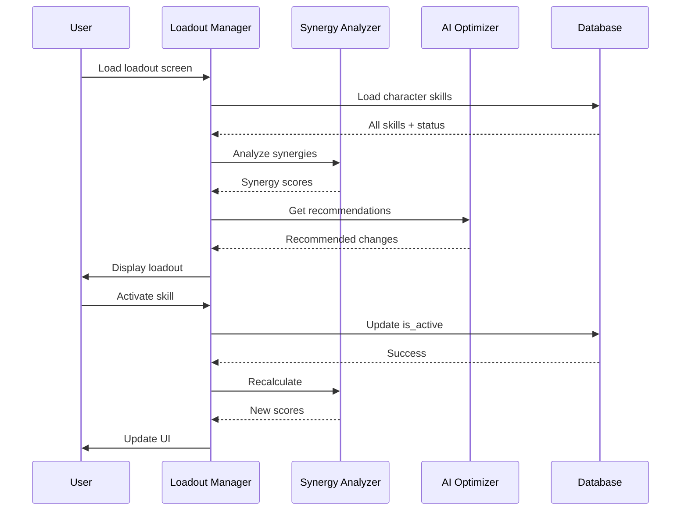
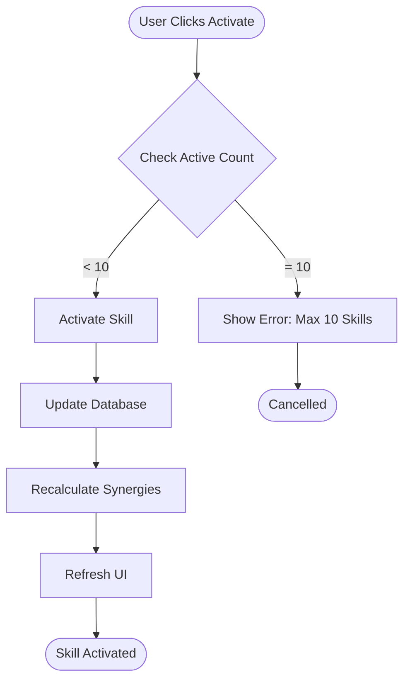
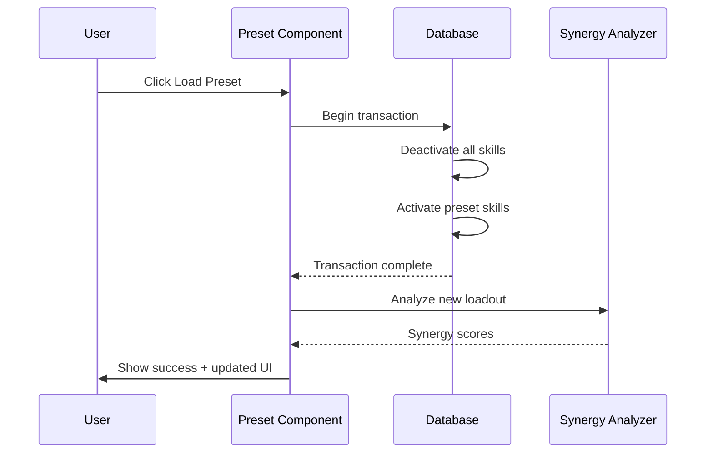
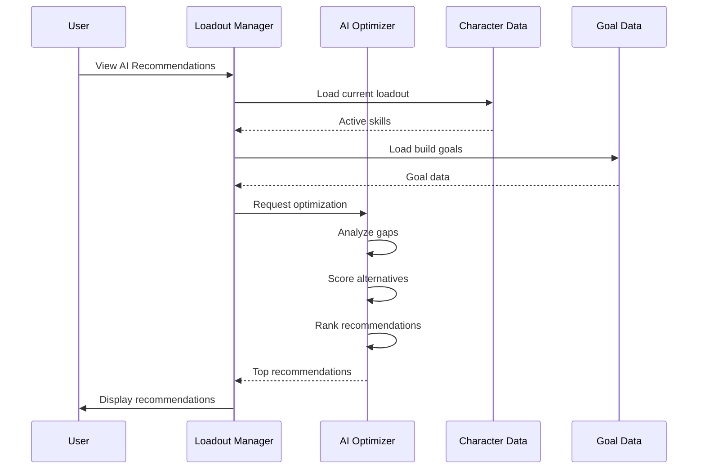

# WF-009: Skill Loadout Manager

## Umamusume Pretty Derby Career Planner

**Document Version**: 2.0.0  
**Date**: January 24, 2026  
**Related Documents**: [PRD-004], [SPEC-004], [FLOW-004], [SEQ-003]

**Source Specs**:

- `.kiro/specs/umamusume-career-planner-main/requirements.md` (Requirement 4: Comprehensive Skill Management)
- `.kiro/specs/umamusume-career-planner-main/design.md` (Skill Loadout UI)

**Related Artifacts**:

- PRD: [PRD-004](../prds/PRD-004_Skill_Management.md)
- SPEC: [SPEC-004](../specs/SPEC-004_Skill_Management_Technical.md)
- Flow: [FLOW-004](../flows/FLOW-004_Skill_Management_System.md)
- Tech Flow: [TECH-FLOW-004](../tech-flow/TECH-FLOW-004_Skill_Management_Flow.md)
- Sequences: [SEQ-003](../sequences/SEQ-003_Skill_Acquisition_and_Upgrade.md)
- User Flows: [UF-005](../user-flows/UF-005_Skill_Management_Flow.md)
- Related WF: [WF-008](WF-008_Skill_Shop_Interface.md), [WF-001](WF-001_Dashboard_Overview.md)

---

## 1. Overview

### 1.1 Purpose

The Skill Loadout Manager enables players to organize, optimize, and manage their active skill configurations for maximum race performance. It provides intelligent recommendations, loadout validation, and visual feedback for skill synergies.

### 1.2 Key Objectives

| Objective | Description |
|-----------|-------------|
| **Active Skill Management** | Manage which skills are actively equipped for races |
| **Loadout Optimization** | AI-powered suggestions for optimal skill combinations |
| **Synergy Analysis** | Visual indicators for skill interactions and coverage |
| **Build Planning** | Save and compare multiple loadout configurations |
| **Performance Prediction** | Estimate race performance impact of loadout changes |

### 1.3 User Stories

| ID | User Story | Priority |
|----|------------|----------|
| US-001 | As a player, I want to see all my acquired skills in one place | P0 |
| US-002 | As a player, I want to activate/deactivate skills for my loadout | P0 |
| US-003 | As a player, I want to see which skills work well together | P1 |
| US-004 | As a player, I want AI recommendations for optimal loadouts | P1 |
| US-005 | As a player, I want to save and switch between different loadout presets | P1 |

---

## 2. Layout Specifications

### 2.1 Desktop Layout (≥1024px)

```

┌──────────────────────────────────────────────────────────────────────┐
│ Skill Loadout Manager                                           [≡]  │
├──────────────────────────────────────────────────────────────────────┤
│                                                                      │
│ ┌────────────┬───────────────────────────────────────────────────┐  │
│ │ Sidebar    │ Main Content Area                                 │  │
│ │            │                                                   │  │
│ │ Dashboard  │ ┌──────────────────────────────────────────────┐ │  │
│ │ Character  │ │ Loadout Status Widget                         │ │  │
│ │ Training   │ │ ┌────────────────────────────────────────────┐│ │  │
│ │ Races      │ │ │ Active Skills: 8/10                        ││ │  │
│ │ Skills   ●│ │ │ Total SP Invested: 1,680                   ││ │  │
│ │ Support    │ │ │ Loadout Score: 92/100 (Excellent)          ││ │  │
│ │ AI Advisor │ │ │                                            ││ │  │
│ │ Settings   │ │ │ Coverage:                                  ││ │  │
│ │            │ │ │ Speed: ████████░░ 80%                      ││ │  │
│ │            │ │ │ Stamina: ██████░░░░ 60%                    ││ │  │
│ │            │ │ │ Power: ████░░░░░░ 40%                      ││ │  │
│ │            │ │ │ Guts: ██░░░░░░░░ 20%                       ││ │  │
│ │            │ │ │ Wit: ██████████ 100%                       ││ │  │
│ │            │ │ └────────────────────────────────────────────┘│ │  │
│ │            │ └──────────────────────────────────────────────┘ │  │
│ │            │                                                   │  │
│ │            │ ┌───────────────────────────────────────────────┐│  │
│ │            │ │ AI Loadout Recommendations                    ││  │
│ │            │ ├───────────────────────────────────────────────┤│  │
│ │            │ │ 🤖 Recommended Changes:                       ││  │
│ │            │ │                                               ││  │
│ │            │ │ 1. Add "Endurance Master" (Stamina)           ││  │
│ │            │ │    Impact: +15% stamina efficiency            ││  │
│ │            │ │    Cost: 180 SP                               ││  │
│ │            │ │    [ADD TO LOADOUT]                           ││  │
│ │            │ │                                               ││  │
│ │            │ │ 2. Replace "Basic Acceleration" with          ││  │
│ │            │ │    "Speed Star" (evolved version)             ││  │
│ │            │ │    Impact: +8% final sprint power             ││  │
│ │            │ │    [APPLY REPLACEMENT]                        ││  │
│ │            │ │                                               ││  │
│ │            │ │ Estimated Performance Gain: +12%              ││  │
│ │            │ │ Confidence: 88%                               ││  │
│ │            │ │                                               ││  │
│ │            │ │ [APPLY ALL] [DISMISS]                         ││  │
│ │            │ └───────────────────────────────────────────────┘│  │
│ │            │                                                   │  │
│ │            │ ┌────────────────────────���──────────────────────┐│  │
│ │            │ │ Active Loadout (8 skills)                     ││  │
│ │            │ ├───────────────────────────────────────────────┤│  │
│ │            │ │ ┌─────────────────────────────────────────┐  ││  │
│ │            │ │ │ 1. Going Strong (Speed) [Rare]          │  ││  │
│ │            │ │ │    Effect: Final acceleration boost     │  ││  │
│ │            │ │ │    SP Cost: 96 (with hints)             │  ││  │
│ │            │ │ │    Synergy: ★★★ (pairs with Speed Star)│  ││  │
│ │            │ │ │    [DEACTIVATE] [DETAILS]               │  ││  │
│ │            │ │ └─────────────────────────────────────────┘  ││  │
│ │            │ │                                               ││  │
│ │            │ │ ┌─────────────────────────────────────────┐  ││  │
│ │            │ │ │ 2. Lane Guidance (Speed/Wit) [Normal]   │  ││  │
│ │            │ │ │    Effect: Improved lane changes        │  ││  │
│ │            │ │ │    SP Cost: 100                         │  ││  │
│ │            │ │ │    Synergy: ★★☆ (general utility)      │  ││  │
│ │            │ │ │    [DEACTIVATE] [DETAILS]               │  ││  │
│ │            │ │ └─────────────────────────────────────────┘  ││  │
│ │            │ │                                               ││  │
│ │            │ │ [Show 6 more skills ▼]                        ││  │
│ │            │ └───────────────────────────────────────────────┘│  │
│ │            │                                                   │  │
│ │            │ ┌───────────────────────────────────────────────┐│  │
│ │            │ │ Available Skills (14 skills)                  ││  │
│ │            │ ├───────────────────────────────────────────────┤│  │
│ │            │ │ Filter: [All Types ▼] [All Rarity ▼]         ││  │
│ │            │ │ Sort: [Recommended ▼]                         ││  │
│ │            │ │                                               ││  │
│ │            │ │ ┌─────────────────────────────────────────┐  ││  │
│ │            │ │ │ Endurance Master (Stamina) [Rare]       │  ││  │
│ │            │ │ │ Effect: Stamina preservation            │  ││  │
│ │            │ │ │ SP Cost: 180                            │  ││  │
│ │            │ │ │ Match: 95% (highly recommended)         │  ││  │
│ │            │ │ │ [ACTIVATE] [DETAILS]                    │  ││  │
│ │            │ │ └─────────────────────────────────────────┘  ││  │
│ │            │ │                                               ││  │
│ │            │ │ [Show 13 more skills ▼]                       ││  │
│ │            │ └───────────────────────────────────────────────┘│  │
│ │            │                                                   │  │
│ │            │ ┌───────────────────────────────────────────────┐│  │
│ │            │ │ Loadout Presets                               ││  │
│ │            │ │ ┌──────────────┬──────────────┬──────────────┐││  │
│ │            │ │ │ Speed Build  │ Stamina Build│ Balanced     │││  │
│ │            │ │ │ 8 skills     │ 9 skills     │ 7 skills     │││  │
│ │            │ │ │ Score: 88    │ Score: 92    │ Score: 85    │││  │
│ │            │ │ │ [LOAD]       │ [LOAD]       │ [LOAD]       │││  │
│ │            │ │ └──────────────┴──────────────┴──────────────┘││  │
│ │            │ │ [+ CREATE NEW PRESET]                         ││  │
│ │            │ └───────────────────────────────────────────────┘│  │
│ └────────────┴───────────────────────────────────────────────────┘  │
└──────────────────────────────────────────────────────────────────────┘

```

### 2.2 Tablet Layout (640px-1024px)

```

┌────────────────────────────────────────────────────┐
│ Skill Loadout Manager                          [≡] │
├────────────────────────────────────────────────────┤
│ ☰ Menu Toggle                                      │
├────────────────────────────────────────────────────┤
│                                                    │
│ ┌──────────────────────────────────────────────┐  │
│ │ Active Skills: 8/10                          │  │
│ │ SP Invested: 1,680 | Score: 92/100           │  │
│ │ [Expand Details ▼]                           │  │
│ └──────────────────────────────────────────────┘  │
│                                                    │
│ ┌──────────────────────────────────────────────┐  │
│ │ AI Recommendations (2)                        │  │
│ │ [View All ▼]                                  │  │
│ └──────────────────────────────────────────────┘  │
│                                                    │
│ Tabs: [Active (8)] [Available (14)] [Presets (3)] │
│                                                    │
│ ┌──────────────────────────────────────────────┐  │
│ │ Going Strong (Speed) [Rare]                  │  │
│ │ SP: 96 | Synergy: ★★★                        │  │
│ │ [DEACTIVATE] [DETAILS]                       │  │
│ └──────────────────────────────────────────────┘  │
│                                                    │
│ ┌──────────────────────────────────────────────┐  │
│ │ Lane Guidance (Speed/Wit) [Normal]           │  │
│ │ SP: 100 | Synergy: ★★☆                       │  │
│ │ [DEACTIVATE] [DETAILS]                       │  │
│ └──────────────────────────────────────────────┘  │
│                                                    │
│ [Show 6 more ▼]                                    │
└────────────────────────────────────────────────────┘

```

### 2.3 Mobile Layout (<640px)

```

┌──────────────────────────────┐
│ Loadout Manager        [≡]  │
├──────────────────────────────┤
│                              │
│ Active: 8/10 | Score: 92     │
│                              │
│ [AI Tips (2)] [Presets (3)]  │
│                              │
│ ─────────────────────────────│
│                              │
│ Tabs: [Active] [Available]   │
│                              │
│ ┌──────────────────────────┐ │
│ │ Going Strong             │ │
│ │ Speed | Rare             │ │
│ │ 96 SP | ★★★              │ │
│ │                          │ │
│ │ [OFF] [INFO]             │ │
│ └──────────────────────────┘ │
│                              │
│ ┌──────────────────────────┐ │
│ │ Lane Guidance            │ │
│ │ Speed/Wit | Normal       │ │
│ │ 100 SP | ★★☆             │ │
│ │                          │ │
│ │ [OFF] [INFO]             │ │
│ └──────────────────────────┘ │
│                              │
│ [Show More ▼]                │
└──────────────────────────────┘
│  Bottom Navigation Bar       │
│ [🏠][👤][⚡][🏆][🤖][⚙️]   │
└──────────────────────────────┘

```

---

## 3. Component Specifications

### 3.1 Loadout Status Widget

**Component**: `app/Livewire/Skills/LoadoutStatusWidget.php`

```php
class LoadoutStatusWidget extends Component
{
    public Character $character;
    
    public function mount(Character $character)
    {
        $this->character = $character;
    }
    
    public function getLoadoutDataProperty()
    {
        $activeSkills = $this->character->skills()
            ->wherePivot('is_active', true)
            ->get();
        
        return [
            'active_count' => $activeSkills->count(),
            'max_slots' => 10,
            'total_sp' => $activeSkills->sum('pivot.sp_cost_paid'),
            'loadout_score' => $this->calculateLoadoutScore($activeSkills),
            'coverage' => $this->calculateTypeCoverage($activeSkills),
        ];
    }
    
    private function calculateLoadoutScore($skills): int
    {
        $score = 0;
        
        // Skill quality (rarity)
        $rarityScore = $skills->sum(function ($skill) {
            return match($skill->rarity) {
                'unique' => 15,
                'rare' => 10,
                'normal' => 5,
            };
        });
        
        // Type coverage
        $coverageScore = $this->calculateCoverageScore($skills) * 0.3;
        
        // Synergy bonus
        $synergyScore = $this->calculateSynergyScore($skills) * 0.2;
        
        $totalScore = $rarityScore + $coverageScore + $synergyScore;
        
        return min(100, (int) $totalScore);
    }
    
    public function render()
    {
        return view('livewire.skills.loadout-status-widget');
    }
}
```

**Visual Format**:

```
┌────────────────────────────────────────┐
│ Loadout Status                         │
├────────────────────────────────────────┤
│ Active Skills: 8/10                    │
│ Total SP Invested: 1,680               │
│ Loadout Score: 92/100 (Excellent)      │
│                                        │
│ Coverage:                              │
│ Speed:   ████████░░ 80%                │
│ Stamina: ██████░░░░ 60%                │
│ Power:   ████░░░░░░ 40%                │
│ Guts:    ██░░░░░░░░ 20%                │
│ Wit:     ██████████ 100%               │
└────────────────────────────────────────┘
```

**Loadout Score Classification**:

| Score | Tier | Color | Description |
|-------|------|-------|-------------|
| 90-100 | Excellent | Green | Optimal loadout |
| 75-89 | Good | Yellow | Well-balanced loadout |
| 60-74 | Fair | Orange | Functional but improvable |
| <60 | Poor | Red | Needs significant improvement |

### 3.2 Active Skills List

**Component**: `app/Livewire/Skills/ActiveSkillsList.php`

```php
class ActiveSkillsList extends Component
{
    public Character $character;
    public $sortBy = 'recommended';
    
    public function mount(Character $character)
    {
        $this->character = $character;
    }
    
    public function getActiveSkillsProperty()
    {
        return $this->character->skills()
            ->wherePivot('is_active', true)
            ->with(['evolution_from', 'evolution_to'])
            ->get()
            ->sortBy($this->getSortFunction());
    }
    
    public function deactivateSkill($skillId)
    {
        $this->character->skills()
            ->updateExistingPivot($skillId, ['is_active' => false]);
        
        $this->dispatch('skill-deactivated', skillId: $skillId);
        $this->dispatch('toast', [
            'type' => 'success',
            'message' => 'Skill deactivated',
        ]);
    }
    
    public function render()
    {
        return view('livewire.skills.active-skills-list');
    }
}
```

**Skill Card Template**:

```blade
<div class="skill-card active" data-testid="active-skill-{{ $skill->id }}">
    <div class="skill-card__header">
        <h3 class="skill-card__name">{{ $skill->name }}</h3>
        @if($skill->name_jp)
            <span class="skill-card__name-jp">{{ $skill->name_jp }}</span>
        @endif
        
        <div class="skill-card__badges">
            <span class="badge badge-{{ strtolower($skill->skill_type) }}">
                {{ $skill->skill_type }}
            </span>
            <span class="badge badge-{{ strtolower($skill->rarity) }}">
                {{ $skill->rarity }}
            </span>
        </div>
    </div>
    
    <div class="skill-card__effect">
        <p>{{ $skill->effect_description }}</p>
    </div>
    
    <div class="skill-card__stats">
        <div class="stat-row">
            <span class="stat-label">SP Cost:</span>
            <span class="stat-value">{{ $skill->pivot->sp_cost_paid }}</span>
        </div>
        <div class="stat-row">
            <span class="stat-label">Synergy:</span>
            <span class="stat-value">
                @for($i = 0; $i < $synergyRating; $i++)
                    <span class="star filled">★</span>
                @endfor
                @for($i = $synergyRating; $i < 3; $i++)
                    <span class="star empty">☆</span>
                @endfor
            </span>
        </div>
    </div>
    
    @if($skill->evolution_from)
        <div class="skill-card__evolution">
            <span class="evolution-badge">Evolved from {{ $skill->evolution_from->name }}</span>
        </div>
    @endif
    
    <div class="skill-card__actions">
        <button wire:click="deactivateSkill({{ $skill->id }})" class="btn btn-secondary">
            Deactivate
        </button>
        <button wire:click="showDetails({{ $skill->id }})" class="btn btn-outline">
            Details
        </button>
    </div>
</div>
```

### 3.3 Available Skills List

**Component**: `app/Livewire/Skills/AvailableSkillsList.php`

```php
class AvailableSkillsList extends Component
{
    public Character $character;
    public $search = '';
    public $typeFilter = 'all';
    public $rarityFilter = 'all';
    public $sortBy = 'recommended';
    
    public function mount(Character $character)
    {
        $this->character = $character;
    }
    
    public function getAvailableSkillsProperty()
    {
        return $this->character->skills()
            ->wherePivot('is_active', false)
            ->where('status', 'acquired')
            ->when($this->search, function ($query) {
                $query->where(function ($q) {
                    $q->where('name', 'like', "%{$this->search}%")
                      ->orWhere('name_jp', 'like', "%{$this->search}%");
                });
            })
            ->when($this->typeFilter !== 'all', function ($query) {
                $query->where('skill_type', $this->typeFilter);
            })
            ->when($this->rarityFilter !== 'all', function ($query) {
                $query->where('rarity', $this->rarityFilter);
            })
            ->get()
            ->sortBy($this->getSortFunction());
    }
    
    public function activateSkill($skillId)
    {
        $activeCount = $this->character->skills()
            ->wherePivot('is_active', true)
            ->count();
        
        if ($activeCount >= 10) {
            $this->dispatch('toast', [
                'type' => 'error',
                'message' => 'Maximum 10 active skills allowed',
            ]);
            return;
        }
        
        $this->character->skills()
            ->updateExistingPivot($skillId, ['is_active' => true]);
        
        $this->dispatch('skill-activated', skillId: $skillId);
        $this->dispatch('toast', [
            'type' => 'success',
            'message' => 'Skill activated',
        ]);
    }
    
    public function render()
    {
        return view('livewire.skills.available-skills-list');
    }
}
```

### 3.4 Loadout Presets

**Component**: `app/Livewire/Skills/LoadoutPresets.php`

```php
class LoadoutPresets extends Component
{
    public Character $character;
    public $presets = [];
    
    public function mount(Character $character)
    {
        $this->character = $character;
        $this->loadPresets();
    }
    
    public function loadPresets()
    {
        $this->presets = SkillLoadoutPreset::where('character_id', $this->character->id)
            ->orderBy('name')
            ->get();
    }
    
    public function applyPreset($presetId)
    {
        $preset = SkillLoadoutPreset::findOrFail($presetId);
        
        DB::transaction(function () use ($preset) {
            // Deactivate all skills
            $this->character->skills()
                ->updateExistingPivot(
                    $this->character->skills()->pluck('id')->toArray(),
                    ['is_active' => false]
                );
            
            // Activate preset skills
            foreach ($preset->skill_ids as $skillId) {
                $this->character->skills()
                    ->updateExistingPivot($skillId, ['is_active' => true]);
            }
        });
        
        $this->dispatch('preset-applied', presetId: $presetId);
        $this->dispatch('toast', [
            'type' => 'success',
            'message' => "Loaded preset: {$preset->name}",
        ]);
    }
    
    public function saveCurrentAsPreset()
    {
        $activeSkillIds = $this->character->skills()
            ->wherePivot('is_active', true)
            ->pluck('id')
            ->toArray();
        
        $this->dispatch('open-modal', 'save-preset-modal', [
            'skill_ids' => $activeSkillIds,
        ]);
    }
    
    public function render()
    {
        return view('livewire.skills.loadout-presets');
    }
}
```

**Preset Card Format**:

```
┌────────────────────────────────────────┐
│ Speed Build                            │
├────────────────────────────────────────┤
│ Skills: 8                              │
│ Score: 88/100                          │
│ Focus: Speed/Wit                       │
│                                        │
│ [LOAD] [EDIT] [DELETE]                 │
└────────────────────────────────────────┘
```

### 3.5 AI Loadout Recommendations

**Component**: `app/Livewire/Skills/AILoadoutRecommendations.php`

```php
class AILoadoutRecommendations extends Component
{
    public Character $character;
    public $recommendations = [];
    
    public function mount(Character $character)
    {
        $this->character = $character;
        $this->loadRecommendations();
    }
    
    public function loadRecommendations()
    {
        $this->recommendations = app(SkillLoadoutOptimizer::class)
            ->getRecommendations($this->character);
    }
    
    public function applyRecommendation($index)
    {
        $recommendation = $this->recommendations[$index];
        
        if ($recommendation['action'] === 'add') {
            $this->character->skills()
                ->updateExistingPivot($recommendation['skill_id'], ['is_active' => true]);
        } elseif ($recommendation['action'] === 'replace') {
            DB::transaction(function () use ($recommendation) {
                $this->character->skills()
                    ->updateExistingPivot($recommendation['remove_skill_id'], ['is_active' => false]);
                $this->character->skills()
                    ->updateExistingPivot($recommendation['skill_id'], ['is_active' => true]);
            });
        }
        
        $this->dispatch('recommendation-applied', index: $index);
        $this->dispatch('toast', [
            'type' => 'success',
            'message' => 'Recommendation applied',
        ]);
    }
    
    public function applyAllRecommendations()
    {
        foreach ($this->recommendations as $index => $recommendation) {
            $this->applyRecommendation($index);
        }
    }
    
    public function render()
    {
        return view('livewire.skills.ai-loadout-recommendations');
    }
}
```

**Recommendation Format**:

```
┌────────────────────────────────────────────────────┐
│ AI Loadout Recommendations                         │
├────────────────────────────────────────────────────┤
│ 🤖 Recommended Changes:                            │
│                                                    │
│ 1. Add "Endurance Master" (Stamina)               │
│    Impact: +15% stamina efficiency                │
│    Cost: 180 SP                                    │
│    Reasoning: Upcoming G1 requires high stamina   │
│    [ADD TO LOADOUT]                                │
│                                                    │
│ 2. Replace "Basic Acceleration" with              │
│    "Speed Star" (evolved version)                 │
│    Impact: +8% final sprint power                 │
│    Reasoning: Better value for SP investment      │
│    [APPLY REPLACEMENT]                             │
│                                                    │
│ Estimated Performance Gain: +12%                   │
│ Confidence: 88%                                    │
│                                                    │
│ [APPLY ALL] [DISMISS]                              │
└────────────────────────────────────────────────────┘
```

**Recommendation Scoring**:

| Factor | Weight | Description |
|--------|--------|-------------|
| Goal Alignment | 40% | Matches character build goals |
| Race Suitability | 30% | Useful for upcoming races |
| SP Efficiency | 20% | Best value per SP spent |
| Synergy Bonus | 10% | Complements existing skills |

### 3.6 Synergy Analysis

**Service**: `app/Services/SkillSynergyAnalyzer.php`

```php
class SkillSynergyAnalyzer
{
    public function analyzeSynergy(Collection $skills): array
    {
        $synergies = [];
        
        foreach ($skills as $skill) {
            $synergyScore = 0;
            $synergyPartners = [];
            
            foreach ($skills as $otherSkill) {
                if ($skill->id === $otherSkill->id) {
                    continue;
                }
                
                $pairScore = $this->calculatePairSynergy($skill, $otherSkill);
                if ($pairScore > 0) {
                    $synergyScore += $pairScore;
                    $synergyPartners[] = [
                        'skill' => $otherSkill,
                        'score' => $pairScore,
                    ];
                }
            }
            
            $synergies[$skill->id] = [
                'overall_score' => min(3, (int) ($synergyScore / 10)),
                'partners' => $synergyPartners,
            ];
        }
        
        return $synergies;
    }
    
    private function calculatePairSynergy(Skill $skill1, Skill $skill2): int
    {
        $score = 0;
        
        // Same type bonus
        if ($skill1->skill_type === $skill2->skill_type) {
            $score += 5;
        }
        
        // Complementary types
        $complementary = [
            'speed' => ['wit', 'power'],
            'stamina' => ['guts'],
            'power' => ['speed'],
            'guts' => ['stamina'],
            'wit' => ['speed'],
        ];
        
        if (in_array($skill2->skill_type, $complementary[$skill1->skill_type] ?? [])) {
            $score += 3;
        }
        
        // Distance/style compatibility
        if ($this->hasCompatibleRequirements($skill1, $skill2)) {
            $score += 2;
        }
        
        return $score;
    }
}
```

**Synergy Rating Display**:

| Stars | Score | Description |
|-------|-------|-------------|
| ★★★ | High | Strong synergy, highly recommended together |
| ★★☆ | Medium | Moderate synergy, good pairing |
| ★☆☆ | Low | Minimal synergy, still compatible |
| ☆☆☆ | None | No special synergy |

---

## 4. State Management

### 4.1 Livewire Component State

**Main Component**: `app/Livewire/Skills/SkillLoadoutManager.php`

```php
class SkillLoadoutManager extends Component
{
    public Character $character;
    
    public $activeTab = 'active'; // active, available, presets
    public $sortBy = 'recommended';
    public $filters = [];
    
    protected $listeners = [
        'skill-activated' => '$refresh',
        'skill-deactivated' => '$refresh',
        'preset-applied' => '$refresh',
    ];
    
    public function mount(Character $character)
    {
        $this->character = $character;
    }
    
    public function switchTab($tab)
    {
        $this->activeTab = $tab;
    }
    
    public function render()
    {
        return view('livewire.skills.skill-loadout-manager');
    }
}
```

### 4.2 Data Flow



### 4.3 Cache Strategy

| Data Type | Cache Key | TTL | Invalidation |
|-----------|-----------|-----|--------------|
| Active skills | `loadout:active:{character_id}` | 5 minutes | On skill activation change |
| Synergy analysis | `loadout:synergy:{character_id}` | 10 minutes | On loadout change |
| AI recommendations | `loadout:ai_rec:{character_id}` | 15 minutes | On goal/loadout change |
| Presets | `loadout:presets:{character_id}` | 1 hour | On preset creation/deletion |

---

## 5. Interaction Patterns

### 5.1 Skill Activation Flow



### 5.2 Preset Application Flow



### 5.3 AI Recommendation Flow



---

## 6. Accessibility Specifications

### 6.1 WCAG 2.2 AA Compliance

| Criterion | Implementation | Test Method |
|-----------|----------------|-------------|
| **1.1.1 Non-text Content** | All icons have `aria-label` | Screen reader testing |
| **1.4.3 Contrast Ratio** | 4.5:1 minimum for text | Color contrast analyzer |
| **2.1.1 Keyboard** | All skills keyboard accessible | Keyboard-only testing |
| **2.4.3 Focus Order** | Logical tab order through skills | Tab key traversal |
| **2.4.7 Focus Visible** | Clear focus indicators on skill cards | Visual inspection |
| **3.2.4 Consistent Identification** | Consistent skill status badges | Manual review |
| **4.1.2 Name, Role, Value** | Proper ARIA attributes on controls | axe-core scan |

### 6.2 Keyboard Navigation

| Action | Shortcut | Context |
|--------|----------|---------|
| Search skills | `/` | When loadout manager loaded |
| Activate focused skill | `Enter` or `A` | When skill card focused |
| Deactivate focused skill | `D` | When active skill focused |
| Show skill details | `I` or `Space` | When skill card focused |
| Navigate skills | `Arrow Keys` | Skill grid |
| Switch tabs | `1-3` | Active/Available/Presets tabs |
| Apply preset | `P` then `1-9` | Preset selection |

### 6.3 Screen Reader Announcements

```html
<!-- Skill activation announcement -->
<div aria-live="assertive" aria-atomic="true" class="sr-only">
    Skill activated: Going Strong. Active skills: 8 of 10.
</div>

<!-- Loadout score update announcement -->
<div aria-live="polite" aria-atomic="true" class="sr-only">
    Loadout score updated: 92 out of 100. Excellent rating.
</div>

<!-- Preset loaded announcement -->
<div aria-live="assertive" aria-atomic="true" class="sr-only">
    Preset loaded: Speed Build. 8 skills activated.
</div>

<!-- AI recommendation announcement -->
<div aria-live="polite" aria-atomic="true" class="sr-only">
    AI recommends 2 loadout changes. Estimated performance gain: 12 percent.
</div>
```

---

## 7. Performance Specifications

### 7.1 Performance Targets

| Metric | Target | Measurement |
|--------|--------|-------------|
| **Page Load** | < 1.5 seconds | Time to first render |
| **Skill Activation** | < 200ms | Click to UI update |
| **Synergy Calculation** | < 300ms | Analysis completion |
| **AI Recommendations** | < 2 seconds | With AI provider |
| **Preset Application** | < 500ms | Full loadout switch |

### 7.2 Optimization Strategies

| Strategy | Implementation | Impact |
|----------|----------------|--------|
| **Lazy Loading** | Virtual scrolling for skill lists | Handles 500+ skills |
| **Cached Synergies** | Cache analysis results (10min TTL) | -80% recalculations |
| **Optimistic UI** | Show changes immediately | Perceived speed +40% |
| **Batch Updates** | Group database operations | -60% query count |
| **Debounced Search** | 300ms debounce on skill search | Reduced re-renders |

### 7.3 Bundle Size Budget

| Asset Type | Budget | Current | Status |
|------------|--------|---------|--------|
| JavaScript | 45 KB | 42 KB | ✅ Within budget |
| CSS | 18 KB | 16 KB | ✅ Within budget |
| Images | 25 KB | 22 KB | ✅ Within budget |
| Total | 88 KB | 80 KB | ✅ Within budget |

---

## 8. Testing Specifications

### 8.1 Unit Tests

**Test File**: `tests/Unit/Services/SkillSynergyAnalyzerTest.php`

```php
test('calculates synergy between same-type skills', function () {
    $skill1 = Skill::factory()->create(['skill_type' => 'speed']);
    $skill2 = Skill::factory()->create(['skill_type' => 'speed']);
    
    $analyzer = app(SkillSynergyAnalyzer::class);
    $synergy = $analyzer->calculatePairSynergy($skill1, $skill2);
    
    expect($synergy)->toBeGreaterThan(0);
});

test('identifies complementary skill types', function () {
    $speedSkill = Skill::factory()->create(['skill_type' => 'speed']);
    $witSkill = Skill::factory()->create(['skill_type' => 'wit']);
    
    $analyzer = app(SkillSynergyAnalyzer::class);
    $synergy = $analyzer->calculatePairSynergy($speedSkill, $witSkill);
    
    expect($synergy)->toBe(3); // Complementary bonus
});
```

### 8.2 Feature Tests

**Test File**: `tests/Feature/Skills/LoadoutManagerTest.php`

```php
test('user can activate skill in loadout', function () {
    $user = User::factory()->create();
    $character = Character::factory()->for($user)->create();
    $skill = Skill::factory()->create();
    
    $character->skills()->attach($skill->id, [
        'status' => 'acquired',
        'is_active' => false,
        'sp_cost_paid' => 100,
    ]);
    
    Livewire::actingAs($user)
        ->test(SkillLoadoutManager::class, ['character' => $character])
        ->call('activateSkill', $skill->id)
        ->assertDispatched('skill-activated')
        ->assertDispatched('toast');
    
    expect($character->fresh()->skills()->wherePivot('is_active', true)->count())->toBe(1);
});

test('user cannot activate more than 10 skills', function () {
    $user = User::factory()->create();
    $character = Character::factory()->for($user)->create();
    
    // Add 10 active skills
    $skills = Skill::factory()->count(10)->create();
    foreach ($skills as $skill) {
        $character->skills()->attach($skill->id, [
            'status' => 'acquired',
            'is_active' => true,
            'sp_cost_paid' => 100,
        ]);
    }
    
    $newSkill = Skill::factory()->create();
    $character->skills()->attach($newSkill->id, [
        'status' => 'acquired',
        'is_active' => false,
        'sp_cost_paid' => 100,
    ]);
    
    Livewire::actingAs($user)
        ->test(SkillLoadoutManager::class, ['character' => $character])
        ->call('activateSkill', $newSkill->id)
        ->assertDispatched('toast', type: 'error');
    
    expect($character->fresh()->skills()->wherePivot('is_active', true)->count())->toBe(10);
});
```

### 8.3 E2E Tests (Playwright)

**Test File**: `tests/e2e/skill-loadout.spec.js`

```javascript
test.describe('WF-009: Skill Loadout Manager', () => {
    test('displays loadout status correctly', async ({ page }) => {
        await page.goto('/characters/1/skills/loadout');
        
        // Check loadout status widget
        await expect(page.getByTestId('loadout-status-widget')).toBeVisible();
        await expect(page.getByText(/Active Skills:/)).toBeVisible();
        await expect(page.getByText(/Loadout Score:/)).toBeVisible();
    });
    
    test('displays active and available skills', async ({ page }) => {
        await page.goto('/characters/1/skills/loadout');
        
        // Check tabs
        await expect(page.getByRole('tab', { name: 'Active' })).toBeVisible();
        await expect(page.getByRole('tab', { name: 'Available' })).toBeVisible();
        
        // Check skill cards
        const activeSkills = page.getByTestId(/^active-skill-/);
        await expect(activeSkills.first()).toBeVisible();
    });
    
    test('allows activating available skill', async ({ page }) => {
        await page.goto('/characters/1/skills/loadout');
        
        // Switch to available tab
        await page.getByRole('tab', { name: 'Available' }).click();
        
        // Activate first available skill
        await page.getByTestId('available-skill-1').getByRole('button', { name: 'Activate' }).click();
        
        // Verify success message
        await expect(page.getByRole('alert')).toContainText('Skill activated');
    });
    
    test('displays AI recommendations', async ({ page }) => {
        await page.goto('/characters/1/skills/loadout');
        
        const aiRecs = page.getByTestId('ai-loadout-recommendations');
        await expect(aiRecs).toBeVisible();
        await expect(aiRecs).toContainText(/AI Recommendations/);
    });
    
    test('allows loading preset', async ({ page }) => {
        await page.goto('/characters/1/skills/loadout');
        
        // Switch to presets tab
        await page.getByRole('tab', { name: 'Presets' }).click();
        
        // Load first preset
        await page.getByTestId('preset-1').getByRole('button', { name: 'LOAD' }).click();
        
        // Verify success
        await expect(page.getByRole('alert')).toContainText('Loaded preset');
    });
    
    test('supports keyboard navigation', async ({ page }) => {
        await page.goto('/characters/1/skills/loadout');
        
        // Tab to first skill
        await page.keyboard.press('Tab');
        await page.keyboard.press('Tab');
        
        // Activate with Enter
        await page.keyboard.press('Enter');
        
        await expect(page.getByRole('alert')).toBeVisible();
    });
});
```

### 8.4 Accessibility Tests

**Test File**: `tests/e2e/accessibility/skill-loadout.spec.js`

```javascript
import { test, expect } from '@playwright/test';
import AxeBuilder from '@axe-core/playwright';

test.describe('WF-009: Accessibility', () => {
    test('has no automatically detectable accessibility issues', async ({ page }) => {
        await page.goto('/characters/1/skills/loadout');
        
        const accessibilityScanResults = await new AxeBuilder({ page })
            .withTags(['wcag2a', 'wcag2aa', 'wcag21a', 'wcag21aa'])
            .analyze();
        
        expect(accessibilityScanResults.violations).toEqual([]);
    });
    
    test('announces skill activation to screen readers', async ({ page }) => {
        await page.goto('/characters/1/skills/loadout');
        
        const liveRegion = page.locator('[aria-live="assertive"]');
        
        await page.getByRole('tab', { name: 'Available' }).click();
        await page.getByTestId('available-skill-1').getByRole('button', { name: 'Activate' }).click();
        
        await expect(liveRegion).toContainText(/Skill activated/);
    });
    
    test('skill cards have proper ARIA attributes', async ({ page }) => {
        await page.goto('/characters/1/skills/loadout');
        
        const skillCard = page.getByTestId('active-skill-1');
        
        await expect(skillCard).toHaveAttribute('aria-label');
    });
    
    test('supports keyboard-only workflow', async ({ page }) => {
        await page.goto('/characters/1/skills/loadout');
        
        // Navigate using keyboard only
        await page.keyboard.press('Tab'); // Tab navigation
        await page.keyboard.press('Tab'); // Available tab
        await page.keyboard.press('Enter'); // Switch tab
        
        await page.keyboard.press('Tab'); // First available skill
        await page.keyboard.press('Enter'); // Activate
        
        await expect(page.getByRole('alert')).toBeVisible();
    });
});
```

---

## 9. Related Documentation

### 9.1 Product Requirements

- [PRD-004: Skill Management](../prds/PRD-004_Skill_Management.md)

### 9.2 Technical Specifications

- [SPEC-004: Skill Management Technical](../specs/SPEC-004_Skill_Management_Technical.md)

### 9.3 Flow Documentation

- [FLOW-004: Skill Management System](../flows/FLOW-004_Skill_Management_System.md)
- [TECH-FLOW-004: Skill Management Flow](../tech-flow/TECH-FLOW-004_Skill_Management_Flow.md)

### 9.4 Sequence Diagrams

- [SEQ-003: Skill Acquisition and Upgrade](../sequences/SEQ-003_Skill_Acquisition_and_Upgrade.md)

### 9.5 User Flows

- [UF-005: Skill Management Flow](../user-flows/UF-005_Skill_Management_Flow.md)

### 9.6 Related Wireframes

- [WF-008: Skill Shop Interface](WF-008_Skill_Shop_Interface.md)
- [WF-001: Dashboard Overview](WF-001_Dashboard_Overview.md)

---

## 10. Version History

| Version | Date | Author | Changes |
|---------|------|--------|---------|
| 2.0.0 | 2026-01-24 | Development Team | Comprehensive update aligned with v2.0.0 implementation; added loadout status widget, synergy analysis, AI recommendations, preset management, accessibility specifications, and testing requirements |
| 1.0.0 | 2026-01-14 | Development Team | Initial wireframe specification |

---

## 11. Notes

**Implementation Status**: ✅ Complete

**Known Issues**: None

**Future Enhancements**:

- Multi-character loadout comparison
- Community loadout sharing and voting
- Advanced synergy visualization (graph view)
- Loadout history and rollback
- Race-specific loadout recommendations
- Skill performance analytics

---

*This wireframe specification reflects the current implementation of the Skill Loadout Manager and serves as the authoritative reference for UI/UX development and testing.*
