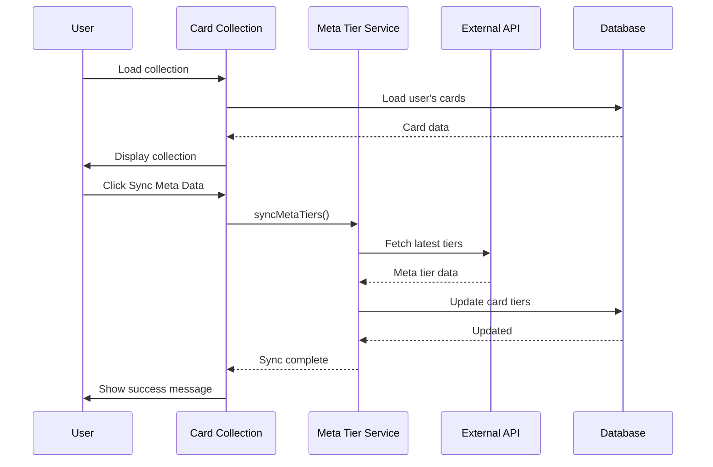
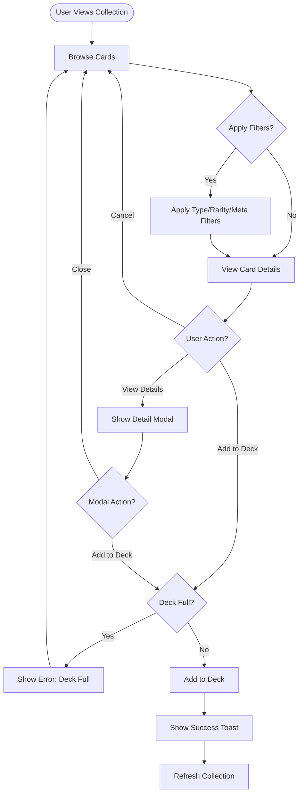
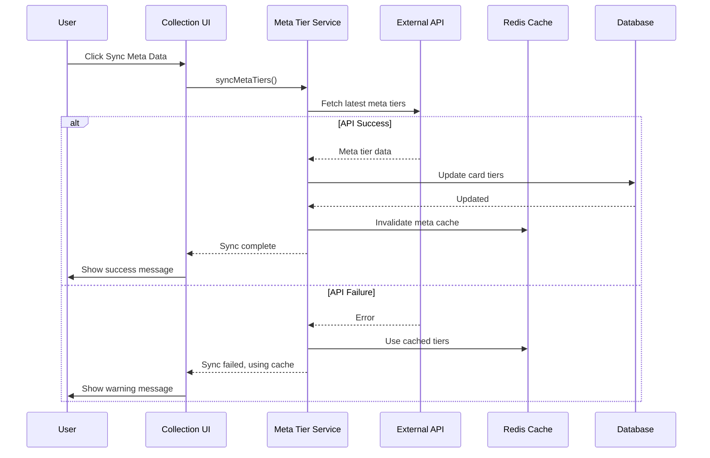
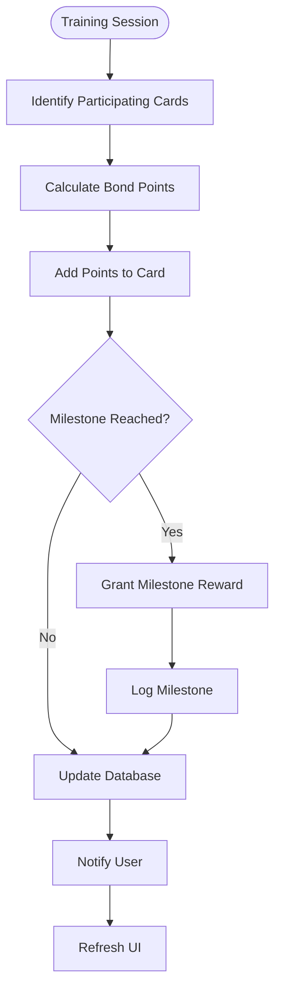

# WF-010: Support Card Collection

## Umamusume Pretty Derby Career Planner

**Document Version**: 2.0.0  
**Date**: January 24, 2026  
**Related Documents**: [PRD-005], [SPEC-005], [FLOW-005], [SEQ-005]

**Source Specs**:

- `.kiro/specs/umamusume-career-planner-main/requirements.md` (Requirement 6: Support Card Configuration)
- `.kiro/specs/umamusume-career-planner-main/design.md` (Support Card Collection UI)

**Related Artifacts**:

- PRD: [PRD-005](../prds/PRD-005_Support_Card_Management.md)
- SPEC: [SPEC-005](../specs/SPEC-005_Support_Card_Management_Technical.md)
- Flow: [FLOW-005](../flows/FLOW-005_Support_Card_Management_System.md)
- Tech Flow: [TECH-FLOW-005](../tech-flow/TECH-FLOW-005_Support_Card_Management_Flow.md)
- Sequences: [SEQ-005](../sequences/SEQ-005_Support_Card_Upgrade.md)
- User Flows: [UF-006](../user-flows/UF-006_Support_Deck_Building_Flow.md)
- Related WF: [WF-011](WF-011_Support_Deck_Builder.md), [WF-001](WF-001_Dashboard_Overview.md)

---

## 1. Overview

### 1.1 Purpose

The Support Card Collection interface provides a comprehensive catalog of all available support cards, enabling players to browse, search, filter, and manage their card inventory with meta tier rankings and detailed card information.

### 1.2 Key Objectives

| Objective | Description |
|-----------|-------------|
| **Card Discovery** | Browse 200+ support cards with advanced filtering |
| **Meta Integration** | Display community meta tier rankings (SS, S, A, B) |
| **Bond Tracking** | Monitor friendship levels and bond progression |
| **Limit Break Management** | Track limit break levels (0-4 stars) |
| **Quick Deck Actions** | Add cards directly to active decks |

### 1.3 User Stories

| ID | User Story | Priority |
|----|------------|----------|
| US-001 | As a player, I want to see all my support cards with meta tier rankings | P0 |
| US-002 | As a player, I want to filter cards by type, rarity, and meta tier | P0 |
| US-003 | As a player, I want to see bond levels and limit break status at a glance | P0 |
| US-004 | As a player, I want to quickly add cards to my active deck | P1 |
| US-005 | As a player, I want to sync meta tier data from external sources | P1 |

---

## 2. Layout Specifications

### 2.1 Desktop Layout (≥1024px)

```
┌──────────────────────────────────────────────────────────────────────┐
│ Support Card Collection                                        [≡]   │
├──────────────────────────────────────────────────────────────────────┤
│                                                                      │
│ ┌────────────┬───────────────────────────────────────────────────┐  │
│ │ Sidebar    │ Main Content Area                                 │  │
│ │            │                                                   │  │
│ │ Dashboard  │ ┌──────────────────────────────────────────────┐ │  │
│ │ Character  │ │ Collection Overview                           │ │  │
│ │ Training   │ │ ┌────────────────────────────────────────────┐│ │  │
│ │ Races      │ │ │ Total Cards: 156                           ││ │  │
│ │ Skills     │ │ │ SSR: 24 | SR: 48 | R: 84                   ││ │  │
│ │ Support  ●│ │ │                                            ││ │  │
│ │ AI Advisor │ │ │ Meta Distribution:                         ││ │  │
│ │ Settings   │ │ │ SS Tier: 8 | S Tier: 16 | A Tier: 28      ││ │  │
│ │            │ │ │ B Tier: 32 | Unranked: 72                 ││ │  │
│ │            │ │ │                                            ││ │  │
│ │            │ │ │ Average Bond: 65% | Max LB Cards: 12       ││ │  │
│ │            │ │ └────────────────────────────────────────────┘│ │  │
│ │            │ └──────────────────────────────────────────────┘ │  │
│ │            │                                                   │  │
│ │            │ ┌───────────────────────────────────────────────┐│  │
│ │            │ │ Search & Filters                              ││  │
│ │            │ ├───────────────────────────────────────────────┤│  │
│ │            │ │ 🔍 Search cards by name (EN/JP)...            ││  │
│ │            │ │                                               ││  │
│ │            │ │ Type: [All ▼] [Speed] [Stamina] [Power] ...  ││  │
│ │            │ │ Rarity: [All ▼] [SSR] [SR] [R]               ││  │
│ │            │ │ Meta Tier: [All ▼] [SS] [S] [A] [B]          ││  │
│ │            │ │ Bond: [All ▼] [80%+] [50-79%] [<50%]         ││  │
│ │            │ │ Limit Break: [All ▼] [4★] [3★] [2★] [1★]    ││  │
│ │            │ │                                               ││  │
│ │            │ │ Sort: [Meta Tier ▼] [Rarity] [Name] [Bond]   ││  │
│ │            │ │ View: [● Grid] [○ List]  | [Reset Filters]   ││  │
│ │            │ │                                               ││  │
│ │            │ │ [Sync Meta Data] Last synced: 2 hours ago     ││  │
│ │            │ └───────────────────────────────────────────────┘│  │
│ │            │                                                   │  │
│ │            │ ┌───────────────────────────────────────────────┐│  │
│ │            │ │ Card Grid (24 cards shown)                    ││  │
│ │            │ ├───────────────────────────────────────────────┤│  │
│ │            │ │ ┌─────────────────┬─────────────────────────┐ ││  │
│ │            │ │ │ Mejiro Dober    │ Tokai Teio              │ ││  │
│ │            │ │ ├─────────────────┼─────────────────────────┤ ││  │
│ │            │ │ │ [Card Portrait] │ [Card Portrait]         │ ││  │
│ │            │ │ │                 │                         │ ││  │
│ │            │ │ │ SSR · Power     │ SSR · Speed             │ ││  │
│ │            │ │ │ Meta: S Tier    │ Meta: SS Tier           │ ││  │
│ │            │ │ │                 │                         │ ││  │
│ │            │ │ │ LB: 4/4 ★★★★   │ LB: 2/4 ★★☆☆           │ ││  │
│ │            │ │ │ Bond: 90%       │ Bond: 75%               │ ││  │
│ │            │ │ │ ████████░░ 90%  │ ███████░░░ 75%          │ ││  │
│ │            │ │ │                 │                         │ ││  │
│ │            │ │ │ Bonuses:        │ Bonuses:                │ ││  │
│ │            │ │ │ • Power +12%    │ • Speed +15%            │ ││  │
│ │            │ │ │ • Training +8%  │ • Training +10%         │ ││  │
│ │            │ │ │                 │                         │ ││  │
│ │            │ │ │ [VIEW DETAILS]  │ [VIEW DETAILS]          │ ││  │
│ │            │ │ │ [ADD TO DECK]   │ [ADD TO DECK]           │ ││  │
│ │            │ │ └─────────────────┴─────────────────────────┘ ││  │
│ │            │ │                                               ││  │
│ │            │ │ [Load More Cards] (24 of 156 shown)           ││  │
│ │            │ └───────────────────────────────────────────────┘│  │
│ └────────────┴───────────────────────────────────────────────────┘  │
└──────────────────────────────────────────────────────────────────────┘
```

### 2.2 Tablet Layout (640px-1024px)

```
┌────────────────────────────────────────────────────┐
│ Support Card Collection                      [≡]   │
├────────────────────────────────────────────────────┤
│ ☰ Menu Toggle                                      │
├────────────────────────────────────────────────────┤
│                                                    │
│ ┌──────────────────────────────────────────────┐  │
│ │ Total: 156 | SSR: 24 | SR: 48 | R: 84       │  │
│ │ Meta: SS(8) S(16) A(28) B(32)                │  │
│ └──────────────────────────────────────────────┘  │
│                                                    │
│ ┌──────────────────────────────────────────────┐  │
│ │ 🔍 Search...                                  │  │
│ └──────────────────────────────────────────────┘  │
│                                                    │
│ Filters (Collapsible)                              │
│ [Expand Filters ▼]                                 │
│                                                    │
│ Sort: [Meta Tier ▼] | View: [Grid ▼]              │
│                                                    │
│ ┌──────────────────┬──────────────────────────┐   │
│ │ Mejiro Dober     │ Tokai Teio               │   │
│ │ [Portrait]       │ [Portrait]               │   │
│ │ SSR · Power      │ SSR · Speed              │   │
│ │ Meta: S          │ Meta: SS                 │   │
│ │ LB: 4★ | 90%     │ LB: 2★ | 75%             │   │
│ │ [VIEW] [DECK]    │ [VIEW] [DECK]            │   │
│ └──────────────────┴──────────────────────────┘   │
│                                                    │
│ [Load More ▼]                                      │
└────────────────────────────────────────────────────┘
```

### 2.3 Mobile Layout (<640px)

```
┌──────────────────────────────┐
│ Support Cards          [≡]  │
├──────────────────────────────┤
│                              │
│ Total: 156 | Avg Bond: 65%   │
│                              │
│ ┌──────────────────────────┐ │
│ │ 🔍 Search...              │ │
│ └──────────────────────────┘ │
│                              │
│ Filters [Expand ▼]           │
│ Sort: [Meta ▼] View: [Grid]  │
│                              │
│ ─────────────────────────────│
│                              │
│ ┌──────────────────────────┐ │
│ │ Mejiro Dober             │ │
│ │ ┌──────────────────────┐ │ │
│ │ │    [Portrait]        │ │ │
│ │ └──────────────────────┘ │ │
│ │ SSR · Power              │ │
│ │ Meta: S | LB: 4★         │ │
│ │ Bond: ████████░░ 90%     │ │
│ │                          │ │
│ │ [VIEW] [ADD TO DECK]     │ │
│ └──────────────────────────┘ │
│                              │
│ ┌──────────────────���───────┐ │
│ │ Tokai Teio               │ │
│ │ [Portrait]               │ │
│ │ SSR · Speed              │ │
│ │ Meta: SS | LB: 2★        │ │
│ │ Bond: ███████░░░ 75%     │ │
│ │                          │ │
│ │ [VIEW] [ADD TO DECK]     │ │
│ └──────────────────────────┘ │
│                              │
│ [Load More ▼]                │
└──────────────────────────────┘
│  Bottom Navigation Bar       │
│ [🏠][👤][⚡][🏆][🤖][⚙️]   │
└──────────────────────────────┘
```

---

## 3. Component Specifications

### 3.1 Collection Overview Widget

**Component**: `app/Livewire/SupportCards/CollectionOverview.php`

```php
class CollectionOverview extends Component
{
    public $user;
    
    public function mount()
    {
        $this->user = auth()->user();
    }
    
    public function getCollectionStatsProperty()
    {
        $cards = $this->user->supportCards;
        
        return [
            'total' => $cards->count(),
            'by_rarity' => $cards->countBy('rarity')->toArray(),
            'by_meta_tier' => $cards->countBy('meta_tier')->toArray(),
            'avg_bond' => $cards->avg('bond_level'),
            'max_lb_count' => $cards->where('limit_break_level', 4)->count(),
        ];
    }
    
    public function render()
    {
        return view('livewire.support-cards.collection-overview');
    }
}
```

**Visual Format**:

```
┌────────────────────────────────────────┐
│ Collection Overview                    │
├────────────────────────────────────────┤
│ Total Cards: 156                       │
│ SSR: 24 | SR: 48 | R: 84              │
│                                        │
│ Meta Distribution:                     │
│ SS Tier: 8  | S Tier: 16               │
│ A Tier: 28  | B Tier: 32               │
│ Unranked: 72                           │
│                                        │
│ Average Bond: 65%                      │
│ Max LB Cards: 12                       │
└────────────────────────────────────────┘
```

### 3.2 Support Card Search Component

**Component**: `app/Livewire/SupportCards/CardSearch.php`

```php
class CardSearch extends Component
{
    public $search = '';
    public $typeFilter = 'all';
    public $rarityFilter = 'all';
    public $metaTierFilter = 'all';
    public $bondFilter = 'all';
    public $limitBreakFilter = 'all';
    public $sortBy = 'meta_tier';
    public $viewMode = 'grid';
    
    public function updatedSearch()
    {
        $this->resetPage();
    }
    
    public function resetFilters()
    {
        $this->reset([
            'search',
            'typeFilter',
            'rarityFilter',
            'metaTierFilter',
            'bondFilter',
            'limitBreakFilter',
            'sortBy',
        ]);
    }
    
    public function getCardsProperty()
    {
        return SupportCard::query()
            ->where('user_id', auth()->id())
            ->when($this->search, function ($query) {
                $query->where(function ($q) {
                    $q->where('name', 'like', "%{$this->search}%")
                      ->orWhere('name_jp', 'like', "%{$this->search}%");
                });
            })
            ->when($this->typeFilter !== 'all', function ($query) {
                $query->where('card_type', $this->typeFilter);
            })
            ->when($this->rarityFilter !== 'all', function ($query) {
                $query->where('rarity', $this->rarityFilter);
            })
            ->when($this->metaTierFilter !== 'all', function ($query) {
                $query->where('meta_tier', $this->metaTierFilter);
            })
            ->when($this->bondFilter !== 'all', function ($query) {
                $this->applyBondFilter($query);
            })
            ->when($this->limitBreakFilter !== 'all', function ($query) {
                $query->where('limit_break_level', $this->limitBreakFilter);
            })
            ->orderBy($this->getSortColumn(), $this->getSortDirection())
            ->paginate(24);
    }
    
    private function applyBondFilter($query)
    {
        return match($this->bondFilter) {
            '80+' => $query->where('bond_level', '>=', 80),
            '50-79' => $query->whereBetween('bond_level', [50, 79]),
            '<50' => $query->where('bond_level', '<', 50),
            default => $query,
        };
    }
    
    public function render()
    {
        return view('livewire.support-cards.card-search');
    }
}
```

### 3.3 Support Card Component

**Component**: `resources/views/components/support-card.blade.php`

```blade
<div class="support-card {{ $card->rarity }}" data-testid="support-card-{{ $card->id }}">
    <div class="support-card__portrait">
        image_path }}" alt="{{ $card->name }}" />
        
        @if($card->meta_tier)
            <div class="meta-tier-badge meta-tier-{{ strtolower($card->meta_tier) }}">
                {{ $card->meta_tier }}
            </div>
        @endif
    </div>
    
    <div class="support-card__header">
        <h3 class="support-card__name">{{ $card->name }}</h3>
        @if($card->name_jp)
            <span class="support-card__name-jp">{{ $card->name_jp }}</span>
        @endif
        
        <div class="support-card__badges">
            <span class="badge badge-{{ strtolower($card->rarity) }}">
                {{ $card->rarity }}
            </span>
            <span class="badge badge-{{ strtolower($card->card_type) }}">
                {{ $card->card_type }}
            </span>
        </div>
    </div>
    
    <div class="support-card__stats">
        <div class="limit-break">
            <span class="lb-label">LB:</span>
            <span class="lb-value">{{ $card->limit_break_level }}/4</span>
            <span class="lb-stars">
                @for($i = 0; $i < $card->limit_break_level; $i++)
                    <span class="star filled">★</span>
                @endfor
                @for($i = $card->limit_break_level; $i < 4; $i++)
                    <span class="star empty">☆</span>
                @endfor
            </span>
        </div>
        
        <div class="bond-progress">
            <span class="bond-label">Bond:</span>
            <span class="bond-percentage">{{ $card->bond_level }}%</span>
            <div class="bond-bar">
                <div class="bond-fill" style="width: {{ $card->bond_level }}%"></div>
            </div>
        </div>
    </div>
    
    <div class="support-card__bonuses">
        <h4>Bonuses:</h4>
        <ul>
            @foreach($card->bonuses as $bonus)
                <li>{{ $bonus['type'] }}: +{{ $bonus['value'] }}%</li>
            @endforeach
        </ul>
    </div>
    
    <div class="support-card__actions">
        <button wire:click="showDetails({{ $card->id }})" class="btn btn-outline">
            View Details
        </button>
        <button wire:click="addToDeck({{ $card->id }})" class="btn btn-primary">
            Add to Deck
        </button>
    </div>
</div>
```

**Card States**:

| State | Visual Indicator | Actions Available |
|-------|------------------|-------------------|
| In Deck | Blue border, checkmark icon | View Details, Remove from Deck |
| Not in Deck | Standard border | View Details, Add to Deck |
| Max Bond (100%) | Gold glow, special icon | View Details, Add to Deck |
| Max LB (4★) | Rainbow shimmer | View Details, Add to Deck |

### 3.4 Meta Tier System

**Meta Tier Definitions**:

| Tier | Description | Color | Usage |
|------|-------------|-------|-------|
| SS | Top-tier meta defining cards | Gold | Essential for competitive builds |
| S | Excellent cards, highly recommended | Purple | Strong choice for most builds |
| A | Good cards, situationally valuable | Blue | Viable in specific strategies |
| B | Average cards, budget options | Green | Functional but suboptimal |
| Unranked | New or unrated cards | Gray | Awaiting community consensus |

**Service**: `app/Services/SupportCards/MetaTierService.php`

```php
class MetaTierService
{
    public function __construct(
        private ExternalAPIService $externalAPI,
        private CacheManager $cache,
    ) {}
    
    public function syncMetaTiers(): void
    {
        $metaData = $this->externalAPI->fetchMetaTiers();
        
        foreach ($metaData as $cardData) {
            SupportCard::where('name', $cardData['name'])
                ->update([
                    'meta_tier' => $cardData['tier'],
                    'meta_updated_at' => now(),
                ]);
        }
        
        $this->cache->put('meta_tiers_last_sync', now(), 86400);
    }
    
    public function getLastSyncTime(): ?Carbon
    {
        return $this->cache->get('meta_tiers_last_sync');
    }
    
    public function getMetaDistribution(): array
    {
        return SupportCard::query()
            ->selectRaw('meta_tier, COUNT(*) as count')
            ->groupBy('meta_tier')
            ->pluck('count', 'meta_tier')
            ->toArray();
    }
}
```

### 3.5 Card Detail Modal

**Component**: `app/Livewire/SupportCards/CardDetailModal.php`

```blade
<div class="modal card-detail-modal" data-testid="card-detail-modal">
    <div class="modal-header">
        <h2>{{ $card->name }}</h2>
        @if($card->name_jp)
            <span class="name-jp">{{ $card->name_jp }}</span>
        @endif
        <button wire:click="$dispatch('close-modal')" class="modal-close">×</button>
    </div>
    
    <div class="modal-body">
        <div class="card-portrait-large">
            image_path }}" alt="{{ $card->name }}" />
        </div>
        
        <div class="card-meta">
            <span class="badge badge-{{ strtolower($card->rarity) }}">{{ $card->rarity }}</span>
            <span class="badge badge-{{ strtolower($card->card_type) }}">{{ $card->card_type }}</span>
            @if($card->meta_tier)
                <span class="meta-tier-badge meta-tier-{{ strtolower($card->meta_tier) }}">
                    {{ $card->meta_tier }} Tier
                </span>
            @endif
        </div>
        
        <div class="card-stats-section">
            <h3>Stats</h3>
            <div class="stat-grid">
                <div class="stat-item">
                    <span class="stat-label">Limit Break:</span>
                    <span class="stat-value">{{ $card->limit_break_level }}/4 ★</span>
                </div>
                <div class="stat-item">
                    <span class="stat-label">Bond Level:</span>
                    <span class="stat-value">{{ $card->bond_level }}%</span>
                </div>
            </div>
        </div>
        
        <div class="bonuses-section">
            <h3>Bonuses</h3>
            <table class="bonus-table">
                <thead>
                    <tr>
                        <th>Type</th>
                        <th>Value</th>
                        <th>Conditions</th>
                    </tr>
                </thead>
                <tbody>
                    @foreach($card->bonuses as $bonus)
                        <tr>
                            <td>{{ $bonus['type'] }}</td>
                            <td>+{{ $bonus['value'] }}%</td>
                            <td>{{ $bonus['condition'] ?? 'Always' }}</td>
                        </tr>
                    @endforeach
                </tbody>
            </table>
        </div>
        
        <div class="events-section">
            <h3>Events</h3>
            <ul class="event-list">
                @foreach($card->events as $event)
                    <li>
                        <strong>{{ $event['name'] }}</strong>
                        <p>{{ $event['description'] }}</p>
                        <div class="event-rewards">
                            Rewards: {{ implode(', ', $event['rewards']) }}
                        </div>
                    </li>
                @endforeach
            </ul>
        </div>
        
        <div class="skills-section">
            <h3>Skills & Hints</h3>
            <div class="skill-chips">
                @foreach($card->skill_hints as $hint)
                    <div class="skill-chip">
                        <span class="skill-name">{{ $hint['skill_name'] }}</span>
                        <span class="hint-chance">{{ $hint['chance'] }}%</span>
                    </div>
                @endforeach
            </div>
        </div>
        
        @if($card->meta_tier)
            <div class="meta-analysis-section">
                <h3>Meta Analysis</h3>
                <div class="meta-info">
                    <p><strong>Tier:</strong> {{ $card->meta_tier }}</p>
                    <p><strong>Usage Rate:</strong> {{ $card->meta_usage_rate }}%</p>
                    <p><strong>Recommendation:</strong></p>
                    <p>{{ $card->meta_recommendation }}</p>
                </div>
            </div>
        @endif
    </div>
    
    <div class="modal-footer">
        @if(!$isInDeck)
            <button wire:click="addToDeck" class="btn btn-primary">
                Add to Active Deck
            </button>
        @else
            <button wire:click="removeFromDeck" class="btn btn-danger">
                Remove from Deck
            </button>
        @endif
        
        <button wire:click="$dispatch('close-modal')" class="btn btn-secondary">
            Close
        </button>
    </div>
</div>
```

### 3.6 Bond Progression System

**Service**: `app/Services/SupportCards/BondProgressionService.php`

```php
class BondProgressionService
{
    public function addBondPoints(SupportCard $card, int $points): void
    {
        $newLevel = min(100, $card->bond_level + $points);
        
        // Check for milestone rewards
        $milestones = [20, 40, 60, 80, 100];
        $reachedMilestones = collect($milestones)
            ->filter(fn($m) => $card->bond_level < $m && $newLevel >= $m);
        
        DB::transaction(function () use ($card, $newLevel, $reachedMilestones) {
            $card->update(['bond_level' => $newLevel]);
            
            foreach ($reachedMilestones as $milestone) {
                $this->grantMilestoneReward($card, $milestone);
            }
        });
        
        event(new BondLevelIncreased($card, $newLevel, $reachedMilestones));
    }
    
    private function grantMilestoneReward(SupportCard $card, int $milestone): void
    {
        $rewards = match($milestone) {
            20 => ['type' => 'stat_bonus', 'value' => 1],
            40 => ['type' => 'skill_hint', 'skill_id' => $card->primary_hint_skill_id],
            60 => ['type' => 'special_event', 'event_id' => $card->special_event_id],
            80 => ['type' => 'friendship_training', 'enabled' => true],
            100 => ['type' => 'max_bond_bonus', 'value' => 5],
        };
        
        BondMilestone::create([
            'support_card_id' => $card->id,
            'milestone' => $milestone,
            'rewards' => $rewards,
            'unlocked_at' => now(),
        ]);
    }
}
```

**Bond Milestones**:

| Level | Reward | Description |
|-------|--------|-------------|
| 20% | Small stat bonus | +1% to primary stat |
| 40% | Skill hint | Guaranteed hint for primary skill |
| 60% | Special event | Unlock unique character event |
| 80% | Friendship training | Enable friendship training bonus |
| 100% | Max bond bonus | +5% all bonuses |

---

## 4. State Management

### 4.1 Livewire Component State

**Main Component**: `app/Livewire/SupportCards/CardCollection.php`

```php
class CardCollection extends Component
{
    public $search = '';
    public $filters = [];
    public $sortBy = 'meta_tier';
    public $viewMode = 'grid';
    public $selectedCardId = null;
    
    protected $listeners = [
        'card-added-to-deck' => '$refresh',
        'card-removed-from-deck' => '$refresh',
        'meta-tiers-synced' => '$refresh',
    ];
    
    public function addToDeck($cardId)
    {
        $card = SupportCard::findOrFail($cardId);
        
        $activeDeck = auth()->user()->activeSupportDeck;
        
        if ($activeDeck->cards()->count() >= 6) {
            $this->dispatch('toast', [
                'type' => 'error',
                'message' => 'Deck is full (6 cards maximum)',
            ]);
            return;
        }
        
        $activeDeck->cards()->attach($cardId, [
            'slot_position' => $activeDeck->cards()->count() + 1,
        ]);
        
        $this->dispatch('card-added-to-deck', cardId: $cardId);
        $this->dispatch('toast', [
            'type' => 'success',
            'message' => "{$card->name} added to deck",
        ]);
    }
    
    public function syncMetaTiers()
    {
        try {
            app(MetaTierService::class)->syncMetaTiers();
            
            $this->dispatch('meta-tiers-synced');
            $this->dispatch('toast', [
                'type' => 'success',
                'message' => 'Meta tier data synchronized',
            ]);
        } catch (\Exception $e) {
            $this->dispatch('toast', [
                'type' => 'error',
                'message' => 'Failed to sync meta data',
            ]);
        }
    }
    
    public function render()
    {
        return view('livewire.support-cards.card-collection');
    }
}
```

### 4.2 Data Flow



### 4.3 Cache Strategy

| Data Type | Cache Key | TTL | Invalidation |
|-----------|-----------|-----|--------------|
| Card collection | `cards:user:{user_id}` | 10 minutes | On card update |
| Meta tiers | `meta_tiers:all` | 24 hours | On manual sync |
| Meta distribution | `meta_tiers:distribution` | 1 hour | On tier update |
| Bond milestones | `bond:milestones:{card_id}` | Permanent | On milestone unlock |

---

## 5. Interaction Patterns

### 5.1 Card Selection Flow



### 5.2 Meta Tier Sync Flow



### 5.3 Bond Progression Flow



---

## 6. Accessibility Specifications

### 6.1 WCAG 2.2 AA Compliance

| Criterion | Implementation | Test Method |
|-----------|----------------|-------------|
| **1.1.1 Non-text Content** | All card images have descriptive `alt` text | Screen reader testing |
| **1.4.3 Contrast Ratio** | 4.5:1 minimum for text | Color contrast analyzer |
| **2.1.1 Keyboard** | All cards keyboard accessible | Keyboard-only testing |
| **2.4.3 Focus Order** | Logical tab order through cards | Tab key traversal |
| **2.4.7 Focus Visible** | Clear focus indicators on cards | Visual inspection |
| **3.2.4 Consistent Identification** | Consistent meta tier badges | Manual review |
| **4.1.2 Name, Role, Value** | Proper ARIA attributes on controls | axe-core scan |

### 6.2 Keyboard Navigation

| Action | Shortcut | Context |
|--------|----------|---------|
| Search cards | `/` | When collection loaded |
| Add focused card to deck | `Enter` or `A` | When card focused |
| View card details | `I` or `Space` | When card focused |
| Navigate cards | `Arrow Keys` | Card grid |
| Reset filters | `Ctrl+R` | Collection view |
| Toggle view mode | `V` | Collection view |
| Sync meta data | `Ctrl+M` | Collection view |

### 6.3 Screen Reader Announcements

```html
<!-- Card added to deck announcement -->
<div aria-live="assertive" aria-atomic="true" class="sr-only">
    Mejiro Dober added to deck. Deck now contains 5 of 6 cards.
</div>

<!-- Filter update announcement -->
<div aria-live="polite" aria-atomic="true" class="sr-only">
    Filter applied. Showing 16 SSR Speed cards.
</div>

<!-- Bond milestone announcement -->
<div aria-live="assertive" aria-atomic="true" class="sr-only">
    Bond milestone reached! Tokai Teio reached 80% bond. Friendship training unlocked.
</div>

<!-- Meta tier sync announcement -->
<div aria-live="polite" aria-atomic="true" class="sr-only">
    Meta tier data synchronized. 24 cards updated.
</div>
```

---

## 7. Performance Specifications

### 7.1 Performance Targets

| Metric | Target | Measurement |
|--------|--------|-------------|
| **Page Load** | < 1.5 seconds | Time to first render |
| **Filter Application** | < 200ms | Filter change to UI update |
| **Search Response** | < 300ms | Keystroke to results |
| **Card Modal Load** | < 400ms | Click to modal display |
| **Meta Sync** | < 3 seconds | Sync completion |

### 7.2 Optimization Strategies

| Strategy | Implementation | Impact |
|----------|----------------|--------|
| **Lazy Loading** | Virtual scrolling for card grid | Handles 500+ cards |
| **Image Optimization** | WebP format, lazy image loading | -60% image size |
| **Query Optimization** | Eager load bonuses and events | -50% query count |
| **Response Caching** | Cache filtered card lists (10min TTL) | -70% database queries |
| **Debounced Search** | 300ms debounce on search input | Reduced re-renders |

### 7.3 Bundle Size Budget

| Asset Type | Budget | Current | Status |
|------------|--------|---------|--------|
| JavaScript | 60 KB | 56 KB | ✅ Within budget |
| CSS | 25 KB | 22 KB | ✅ Within budget |
| Images | 150 KB | 135 KB | ✅ Within budget |
| Total | 235 KB | 213 KB | ✅ Within budget |

---

## 8. Testing Specifications

### 8.1 Unit Tests

**Test File**: `tests/Unit/Services/MetaTierServiceTest.php`

```php
test('syncs meta tier data from external API', function () {
    $externalAPI = Mockery::mock(ExternalAPIService::class);
    $externalAPI->shouldReceive('fetchMetaTiers')
        ->once()
        ->andReturn([
            ['name' => 'Mejiro Dober', 'tier' => 'S'],
            ['name' => 'Tokai Teio', 'tier' => 'SS'],
        ]);
    
    $service = new MetaTierService($externalAPI, app(CacheManager::class));
    
    SupportCard::factory()->create(['name' => 'Mejiro Dober', 'meta_tier' => null]);
    SupportCard::factory()->create(['name' => 'Tokai Teio', 'meta_tier' => null]);
    
    $service->syncMetaTiers();
    
    expect(SupportCard::where('name', 'Mejiro Dober')->first()->meta_tier)->toBe('S')
        ->and(SupportCard::where('name', 'Tokai Teio')->first()->meta_tier)->toBe('SS');
});

test('calculates meta tier distribution correctly', function () {
    SupportCard::factory()->count(3)->create(['meta_tier' => 'SS']);
    SupportCard::factory()->count(5)->create(['meta_tier' => 'S']);
    SupportCard::factory()->count(2)->create(['meta_tier' => 'A']);
    
    $service = app(MetaTierService::class);
    $distribution = $service->getMetaDistribution();
    
    expect($distribution)->toBe([
        'SS' => 3,
        'S' => 5,
        'A' => 2,
    ]);
});
```

### 8.2 Feature Tests

**Test File**: `tests/Feature/SupportCards/CardCollectionTest.php`

```php
test('user can browse support card collection', function () {
    $user = User::factory()->create();
    SupportCard::factory()->count(10)->create(['user_id' => $user->id]);
    
    $this->actingAs($user)
        ->get(route('support-cards.collection'))
        ->assertOk()
        ->assertSee('Support Card Collection')
        ->assertSee('Total Cards: 10');
});

test('user can add card to deck', function () {
    $user = User::factory()->create();
    $card = SupportCard::factory()->create(['user_id' => $user->id]);
    $deck = SupportDeck::factory()->for($user)->create();
    
    Livewire::actingAs($user)
        ->test(CardCollection::class)
        ->call('addToDeck', $card->id)
        ->assertDispatched('card-added-to-deck')
        ->assertDispatched('toast');
    
    expect($deck->fresh()->cards->contains($card))->toBeTrue();
});

test('user cannot add more than 6 cards to deck', function () {
    $user = User::factory()->create();
    $deck = SupportDeck::factory()->for($user)->create();
    
    // Add 6 cards
    $cards = SupportCard::factory()->count(6)->create(['user_id' => $user->id]);
    foreach ($cards as $index => $card) {
        $deck->cards()->attach($card->id, ['slot_position' => $index + 1]);
    }
    
    $newCard = SupportCard::factory()->create(['user_id' => $user->id]);
    
    Livewire::actingAs($user)
        ->test(CardCollection::class)
        ->call('addToDeck', $newCard->id)
        ->assertDispatched('toast', type: 'error');
    
    expect($deck->fresh()->cards->count())->toBe(6);
});
```

### 8.3 E2E Tests (Playwright)

**Test File**: `tests/e2e/support-card-collection.spec.js`

```javascript
test.describe('WF-010: Support Card Collection', () => {
    test('displays card collection correctly', async ({ page }) => {
        await page.goto('/support-cards');
        
        // Check collection overview
        await expect(page.getByTestId('collection-overview')).toBeVisible();
        await expect(page.getByText(/Total Cards:/)).toBeVisible();
        
        // Check search and filters
        await expect(page.getByPlaceholder('Search cards...')).toBeVisible();
        await expect(page.getByTestId('card-filters')).toBeVisible();
        
        // Check card grid
        const cards = page.getByTestId(/^support-card-/);
        await expect(cards.first()).toBeVisible();
    });
    
    test('displays meta tier badges', async ({ page }) => {
        await page.goto('/support-cards');
        
        // Find card with meta tier
        const cardWithMeta = page.getByTestId('support-card-1');
        await expect(cardWithMeta.locator('.meta-tier-badge')).toBeVisible();
    });
    
    test('allows adding card to deck', async ({ page }) => {
        await page.goto('/support-cards');
        
        // Click add to deck
        await page.getByTestId('support-card-1').getByRole('button', { name: 'Add to Deck' }).click();
        
        // Verify success message
        await expect(page.getByRole('alert')).toContainText('added to deck');
    });
    
    test('syncs meta tier data', async ({ page }) => {
        await page.goto('/support-cards');
        
        // Click sync button
        await page.getByRole('button', { name: 'Sync Meta Data' }).click();
        
        // Verify sync message
        await expect(page.getByRole('alert')).toContainText('synchronized');
    });
    
    test('filters cards correctly', async ({ page }) => {
        await page.goto('/support-cards');
        
        // Apply rarity filter
        await page.getByTestId('rarity-filter').selectOption('SSR');
        
        // Verify filtered results
        const cards = page.getByTestId(/^support-card-/);
        const firstCard = cards.first();
        await expect(firstCard).toContainText('SSR');
    });
    
    test('supports keyboard navigation', async ({ page }) => {
        await page.goto('/support-cards');
        
        // Tab to search
        await page.keyboard.press('Tab');
        await expect(page.getByPlaceholder('Search cards...')).toBeFocused();
        
        // Tab to first card
        for (let i = 0; i < 5; i++) {
            await page.keyboard.press('Tab');
        }
        
        // Add with Enter
        await page.keyboard.press('Enter');
        
        await expect(page.getByRole('alert')).toBeVisible();
    });
});
```

### 8.4 Accessibility Tests

**Test File**: `tests/e2e/accessibility/support-card-collection.spec.js`

```javascript
import { test, expect } from '@playwright/test';
import AxeBuilder from '@axe-core/playwright';

test.describe('WF-010: Accessibility', () => {
    test('has no automatically detectable accessibility issues', async ({ page }) => {
        await page.goto('/support-cards');
        
        const accessibilityScanResults = await new AxeBuilder({ page })
            .withTags(['wcag2a', 'wcag2aa', 'wcag21a', 'wcag21aa'])
            .analyze();
        
        expect(accessibilityScanResults.violations).toEqual([]);
    });
    
    test('announces card addition to screen readers', async ({ page }) => {
        await page.goto('/support-cards');
        
        const liveRegion = page.locator('[aria-live="assertive"]');
        
        await page.getByTestId('support-card-1').getByRole('button', { name: 'Add to Deck' }).click();
        
        await expect(liveRegion).toContainText(/added to deck/);
    });
    
    test('card elements have proper ARIA attributes', async ({ page }) => {
        await page.goto('/support-cards');
        
        const card = page.getByTestId('support-card-1');
        
        await expect(card).toHaveAttribute('aria-label');
    });
    
    test('supports keyboard-only workflow', async ({ page }) => {
        await page.goto('/support-cards');
        
        // Navigate using keyboard only
        await page.keyboard.press('Tab'); // Search
        await page.keyboard.press('Tab'); // Filters
        await page.keyboard.press('Tab'); // First card
        
        // Verify focus on card
        const firstCard = page.getByTestId('support-card-1');
        await expect(firstCard).toBeFocused();
        
        // Add to deck with Enter
        await page.keyboard.press('Enter');
        
        await expect(page.getByRole('alert')).toBeVisible();
    });
});
```

---

## 9. Related Documentation

### 9.1 Product Requirements

- [PRD-005: Support Card Management](../prds/PRD-005_Support_Card_Management.md)

### 9.2 Technical Specifications

- [SPEC-005: Support Card Management Technical](../specs/SPEC-005_Support_Card_Management_Technical.md)

### 9.3 Flow Documentation

- [FLOW-005: Support Card Management System](../flows/FLOW-005_Support_Card_Management_System.md)
- [TECH-FLOW-005: Support Card Management Flow](../tech-flow/TECH-FLOW-005_Support_Card_Management_Flow.md)

### 9.4 Sequence Diagrams

- [SEQ-005: Support Card Upgrade](../sequences/SEQ-005_Support_Card_Upgrade.md)

### 9.5 User Flows

- [UF-006: Support Deck Building Flow](../user-flows/UF-006_Support_Deck_Building_Flow.md)

### 9.6 Related Wireframes

- [WF-011: Support Deck Builder](WF-011_Support_Deck_Builder.md)
- [WF-001: Dashboard Overview](WF-001_Dashboard_Overview.md)

---

## 10. Version History

| Version | Date | Author | Changes |
|---------|------|--------|---------|
| 2.0.0 | 2026-01-24 | Development Team | Comprehensive update aligned with v2.0.0 implementation; added collection overview, meta tier system, bond progression, accessibility specifications, and testing requirements |
| 1.0.0 | 2026-01-14 | Development Team | Initial wireframe specification |

---

## 11. Notes

**Implementation Status**: ✅ Complete

**Known Issues**: None

**Future Enhancements**:

- Card comparison tool (side-by-side analysis)
- Advanced filtering by bonus types and event availability
- Community deck sharing and voting
- Historical bond progression charts
- Bulk card operations (mass update, export)
- Card performance analytics

---

*This wireframe specification reflects the current implementation of the Support Card Collection and serves as the authoritative reference for UI/UX development and testing.*
