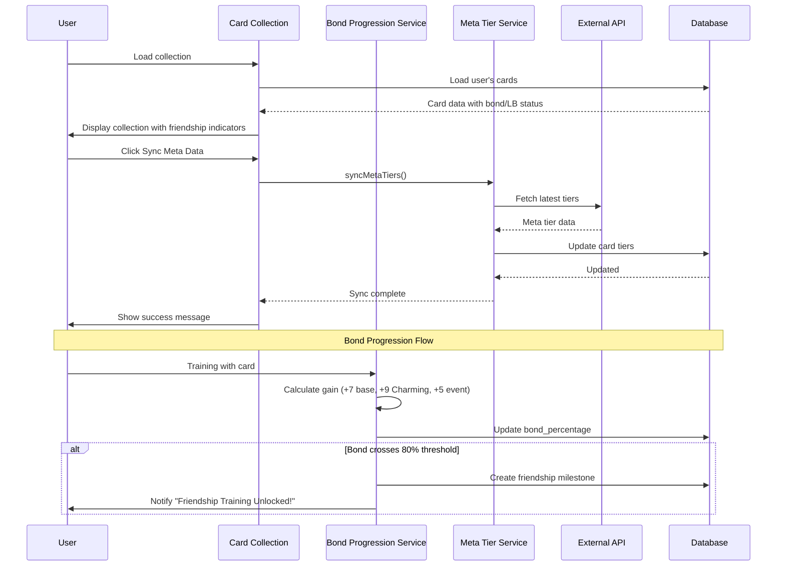
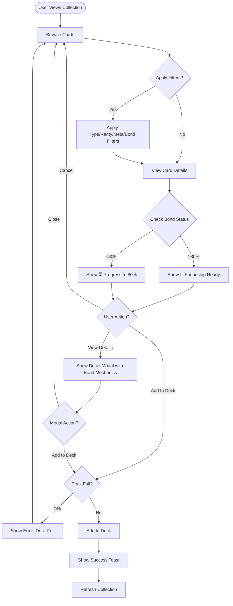
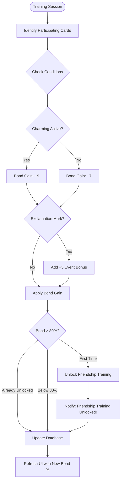
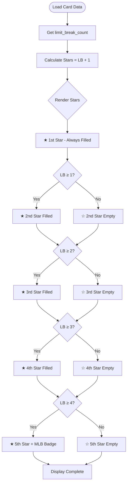

# WF-010: Support Card Collection

## Umamusume Pretty Derby Career Planner

**Document Version**: 2.3.0  
**Date**: February 22, 2026  
**Related Documents**: [PRD-005], [SPEC-005], [FLOW-005], [SEQ-005]

**Source Specs**:

- `.kiro/specs/umamusume-career-planner-main/requirements.md` (Requirement 6: Support Card Configuration)
- `.kiro/specs/umamusume-career-planner-main/design.md` (Support Card Collection UI)

**Related Artifacts**:

- PRD: [PRD-005](../prds/PRD-005_Support_Card_Management.md)
- SPEC: [SPEC-005](../specs/SPEC-005_Support_Card_Management_Technical.md)
- Flow: [FLOW-005](../flows/FLOW-005_Support_Card_Management_System.md)
- Tech Flow: [TECH-FLOW-005](../tech-flow/TECH-FLOW-005_Support_Card_Management_Flow.md)
- Sequences: [SEQ-005](../sequences/SEQ-005_Support_Card_Upgrade.md)
- User Flows: [UF-006](../user-flows/UF-006_Support_Deck_Building_Flow.md)
- Related WF: [WF-011](WF-011_Support_Deck_Builder.md), [WF-001](WF-001_Dashboard_Overview.md)

---

## 1. Overview

### 1.1 Purpose

The Support Card Collection interface provides a comprehensive catalog of all available support cards, enabling players to browse, search, filter, and manage their card inventory with meta tier rankings and detailed card information.

### 1.2 Key Objectives

| Objective                  | Description                                                      |
| -------------------------- | ---------------------------------------------------------------- |
| **Card Discovery**         | Browse 200+ support cards with advanced filtering                |
| **Meta Integration**       | Display community meta tier rankings (SS, S, A, B)               |
| **Bond Tracking**          | Monitor bond gauge (0-100%) with friendship threshold at 80%     |
| **Limit Break Management** | Track limit break levels (★ to ★★★★★, MLB = 4 LB / 5 stars)      |
| **Quick Deck Actions**     | Add cards directly to active decks                               |

### 1.3 Game-Accurate Mechanics (Global English Server - Feb 2026)

#### Support Card Types

| Type     | Icon | Primary Stat | Training Facility |
| -------- | ---- | ------------ | ----------------- |
| Speed    | 🏃   | Speed        | Speed Training    |
| Stamina  | 💪   | Stamina      | Stamina Training  |
| Power    | ⚡   | Power        | Power Training    |
| Guts     | 🔥   | Guts         | Guts Training     |
| Wit      | 🧠   | Wit          | Wit Training      |
| Friend   | 💖   | Variable     | Any Training      |

#### Card Rarities

| Rarity | Base Level Cap | Max Level (MLB) | Friendship Bonus Range |
| ------ | -------------- | --------------- | ---------------------- |
| R      | 25             | 45              | 10-15%                 |
| SR     | 30             | 50              | 15-25%                 |
| SSR    | 35             | 50              | 25-35%                 |

#### Limit Break System

| Stars | Limit Breaks | Level Cap Increase | Status      |
| ----- | ------------ | ------------------ | ----------- |
| ★     | 0 LB         | Base               | Initial     |
| ★★    | 1 LB         | +3-5 levels        | 1st Break   |
| ★★★   | 2 LB         | +3-5 levels        | 2nd Break   |
| ★★★★  | 3 LB         | +3-5 levels        | 3rd Break   |
| ★★★★★ | 4 LB (MLB)   | Max level          | Max LB      |

#### Bond Mechanics

| Condition           | Bond Gain | Notes                              |
| ------------------- | --------- | ---------------------------------- |
| Base Training       | +7        | Card present in training           |
| Charming Active     | +9        | +2 bonus from Charming condition   |
| Exclamation Mark    | +5        | Event available indicator          |
| Friendship Threshold| 80%       | Enables Friendship Training bonus  |

### 1.4 User Stories

| ID     | User Story                                                                | Priority |
| ------ | ------------------------------------------------------------------------- | -------- |
| US-001 | As a player, I want to see all my support cards with meta tier rankings   | P0       |
| US-002 | As a player, I want to filter cards by type, rarity, and meta tier        | P0       |
| US-003 | As a player, I want to see bond levels and limit break status at a glance | P0       |
| US-004 | As a player, I want to quickly add cards to my active deck                | P1       |
| US-005 | As a player, I want to sync meta tier data from external sources          | P1       |
| US-006 | As a player, I want to see friendship bonus percentages by rarity         | P1       |
| US-007 | As a player, I want to track which cards have reached 80% bond threshold  | P1       |

---

## 2. Layout Specifications

### 2.1 Desktop Layout (≥1024px)

```
┌──────────────────────────────────────────────────────────────────────┐
│ [≡] Menu  |  Support Card Collection                        [?]    │
├──────────────────────────────────────────────────────────────────────┤
│ ┌──────────────────────────────────────────────────────────────────┐ │
│ │ TOTAL: 156  |  SSR: 24 (15%)  |  AVG BOND: 65%  |  MLB: 12       │ │
│ └──────────────────────────────────────────────────────────────────┘ │
├──────────────────────────────────────────────────────────────────────┤
│ ┌──────────────────────────────────────────────────────────────────┐ │
│ │ TYPE: [ALL][🏃Spd][💪Sta][⚡Pow][🔥Gut][🧠Wit][💖Frd]            │ │
│ │ RARITY: [ALL][R][SR][SSR]  BOND: [ALL][≥80%][<80%]               │ │
│ │ SORT: [META TIER ▼]  VIEW: [GRID] [LIST]       [ SYNC META ]     │ │
│ └──────────────────────────────────────────────────────────────────┘ │
│                                                                      │
│ ┌────────────┐ ┌────────────┐ ┌────────────┐ ┌────────────┐        │ │
│ │ 🏃 Kitasan │ │ 💪 Satono  │ │ 🧠 Fine Mo │ │ 🔥 Super C │        │ │
│ │ [SSR]      │ │ [SSR]      │ │ [SSR]      │ │ [SSR]      │        │ │
│ │ [SS Tier]  │ │ [S+ Tier]  │ │ [S Tier]   │ │ [A Tier]   │        │ │
│ │ ★★★★★ MLB  │ │ ★★★☆☆      │ │ ★★★★★ MLB  │ │ ★☆☆☆☆      │        │ │
│ │ Bond: 100% │ │ Bond: 85%  │ │ Bond: 45%  │ │ Bond: 12%  │        │ │
│ │ [🤝 READY] │ │ [🤝 READY] │ │ [⏳ 35%]   │ │ [⏳ 68%]   │        │ │
│ │ FB: +35%   │ │ FB: +28%   │ │ FB: +30%   │ │ FB: +25%   │        │ │
│ │ [ DETAIL ] │ │ [ DETAIL ] │ │ [ DETAIL ] │ │ [ DETAIL ] │        │ │
│ └────────────┘ └────────────┘ └────────────┘ └────────────┘        │ │
│                                                                      │
│ [ < PREV ]   PAGE 1 / 12   [ NEXT > ]                                │
└──────────────────────────────────────────────────────────────────────┘
```

**Legend**:

- `🤝 READY` = Bond ≥80%, Friendship Training enabled
- `⏳ XX%` = Progress to 80% threshold
- `FB: +XX%` = Friendship Bonus percentage (when bond ≥80%)
- `★★★★★ MLB` = Max Limit Break (4 LB, 5 stars total)

### 2.2 Tablet Layout (640px-1023px)

```
┌────────────────────────────────────────────────────┐
│ [≡] Menu  |  Support Cards                  [?]    │
├────────────────────────────────────────────────────┤
│ TOTAL: 156   |  SSR: 24 (15%)   |  MLB: 12         │
├────────────────────────────────────────────────────┤
│                                                    │
│ [ TOTAL: 156 ] [ FILTERS ▼ ]  [ SORT: META ▼ ]     │
│                                                    │
│ ┌──────────┐ ┌──────────┐ ┌──────────┐ ┌──────────┐│
│ │🏃 Kitasan│ │💪 Satono │ │🧠 Fine Mo│ │🔥 Super C││
│ │ [SSR]    │ │ [SSR]    │ │ [SSR]    │ │ [SSR]    ││
│ │ [SS Tier]│ │ [S+ Tier]│ │ [S Tier] │ │ [A Tier] ││
│ │ ★★★★★MLB │ │ ★★★☆☆    │ │ ★★★★★MLB │ │ ★☆☆☆☆    ││
│ │ 100%🤝   │ │ 85%🤝    │ │ 45%⏳    │ │ 12%⏳    ││
│ │ [ INFO ] │ │ [ INFO ] │ │ [ INFO ] │ │ [ INFO ] ││
│ └──────────┘ └──────────┘ └──────────┘ └──────────┘│
│                                                    │
│ [ LOAD MORE (24/156) ]                             │
└────────────────────────────────────────────────────┘
```

### 2.3 Mobile Layout (<640px)

```
┌──────────────────────────────┐
│ [≡] Support Cards        [?] │
├──────────────────────────────┤
│ TOTAL: 156 (SSR:24, MLB:12)  │
├──────────────────────────────┤
│                              │
│ [ FILTERS ▼ ] [ SORT: META ] │
│                              │
│ ┌────────────┐ ┌────────────┐│
│ │🏃 Kitasan  │ │💪 Satono   ││
│ │ [SSR]      │ │ [SSR]      ││
│ │ [SS Tier]  │ │ [S+ Tier]  ││
│ │ ★★★★★ 100% │ │ ★★★☆☆ 85%  ││
│ │ 🤝 FB:+35% │ │ 🤝 FB:+28% ││
│ └────────────┘ └────────────┘│
│ ┌────────────┐ ┌────────────┐│
│ │🧠 Fine Mo  │ │🔥 Super C  ││
│ │ [SSR]      │ │ [SSR]      ││
│ │ [S Tier]   │ │ [A Tier]   ││
│ │ ★★★★★ 45%  │ │ ★☆☆☆☆ 12%  ││
│ │ ⏳ to 80%  │ │ ⏳ to 80%  ││
│ └────────────┘ └────────────┘│
│                              │
│ [ LOAD MORE ]                │
│                              │
└──────────────────────────────┘
│ [🏠] [👤] [⚡] [🏆] [🤖] [⚙️] │
└──────────────────────────────┘
```

---

## 3. Component Specifications

### 3.1 Collection Overview Widget

**Component**: `app/Livewire/SupportCards/CollectionOverview.php`

```php
class CollectionOverview extends Component
{
    public $user;

    public function mount()
    {
        $this->user = auth()->user();
    }

    public function getCollectionStatsProperty()
    {
        $cards = $this->user->supportCards;

        return [
            'total' => $cards->count(),
            'by_rarity' => $cards->countBy('rarity')->toArray(),
            'by_type' => $cards->countBy('card_type')->toArray(),
            'by_meta_tier' => $cards->countBy('meta_tier')->toArray(),
            'avg_bond' => $cards->avg('bond_percentage'),
            'friendship_ready_count' => $cards->where('bond_percentage', '>=', 80)->count(),
            'mlb_count' => $cards->where('limit_break_count', 4)->count(),
        ];
    }

    public function render()
    {
        return view('livewire.support-cards.collection-overview');
    }
}
```

**Visual Format**:

```
┌────────────────────────────────────────┐
│ Collection Overview                    │
├────────────────────────────────────────┤
│ Total Cards: 156                       │
│ SSR: 24 | SR: 48 | R: 84              │
│                                        │
│ By Type:                               │
│ 🏃 Speed: 28  | 💪 Stamina: 24         │
│ ⚡ Power: 26  | 🔥 Guts: 22            │
│ 🧠 Wit: 30    | 💖 Friend: 26          │
│                                        │
│ Meta Distribution:                     │
│ SS Tier: 8  | S Tier: 16               │
│ A Tier: 28  | B Tier: 32               │
│ Unranked: 72                           │
│                                        │
│ Bond Status:                           │
│ Average Bond: 65%                      │
│ 🤝 Friendship Ready (≥80%): 42         │
│ ★★★★★ MLB Cards: 12                    │
└────────────────────────────────────────┘
```

### 3.2 Support Card Search Component

**Component**: `app/Livewire/SupportCards/CardSearch.php`

```php
class CardSearch extends Component
{
    public $search = '';
    public $typeFilter = 'all';
    public $rarityFilter = 'all';
    public $metaTierFilter = 'all';
    public $bondFilter = 'all';
    public $limitBreakFilter = 'all';
    public $sortBy = 'meta_tier';
    public $viewMode = 'grid';

    // Card type constants matching game
    public const CARD_TYPES = [
        'speed' => ['icon' => '🏃', 'label' => 'Speed'],
        'stamina' => ['icon' => '💪', 'label' => 'Stamina'],
        'power' => ['icon' => '⚡', 'label' => 'Power'],
        'guts' => ['icon' => '🔥', 'label' => 'Guts'],
        'wit' => ['icon' => '🧠', 'label' => 'Wit'],
        'friend' => ['icon' => '💖', 'label' => 'Friend'],
    ];

    // Friendship threshold from game mechanics
    public const FRIENDSHIP_THRESHOLD = 80;

    public function updatedSearch()
    {
        $this->resetPage();
    }

    public function resetFilters()
    {
        $this->reset([
            'search',
            'typeFilter',
            'rarityFilter',
            'metaTierFilter',
            'bondFilter',
            'limitBreakFilter',
            'sortBy',
        ]);
    }

    public function getCardsProperty()
    {
        return SupportCard::query()
            ->where('user_id', auth()->id())
            ->when($this->search, function ($query) {
                $query->where(function ($q) {
                    $q->where('name', 'like', "%{$this->search}%")
                      ->orWhere('name_jp', 'like', "%{$this->search}%");
                });
            })
            ->when($this->typeFilter !== 'all', function ($query) {
                $query->where('card_type', $this->typeFilter);
            })
            ->when($this->rarityFilter !== 'all', function ($query) {
                $query->where('rarity', $this->rarityFilter);
            })
            ->when($this->metaTierFilter !== 'all', function ($query) {
                $query->where('meta_tier', $this->metaTierFilter);
            })
            ->when($this->bondFilter !== 'all', function ($query) {
                $this->applyBondFilter($query);
            })
            ->when($this->limitBreakFilter !== 'all', function ($query) {
                $query->where('limit_break_count', $this->limitBreakFilter);
            })
            ->orderBy($this->getSortColumn(), $this->getSortDirection())
            ->paginate(24);
    }

    private function applyBondFilter($query)
    {
        return match($this->bondFilter) {
            'friendship_ready' => $query->where('bond_percentage', '>=', self::FRIENDSHIP_THRESHOLD),
            'below_threshold' => $query->where('bond_percentage', '<', self::FRIENDSHIP_THRESHOLD),
            'max_bond' => $query->where('bond_percentage', 100),
            default => $query,
        };
    }

    public function render()
    {
        return view('livewire.support-cards.card-search');
    }
}
```

### 3.3 Support Card Component

**Component**: `resources/views/components/support-card.blade.php`

```blade
@props(['card'])

@php
    $cardTypeIcons = [
        'speed' => '🏃',
        'stamina' => '💪',
        'power' => '⚡',
        'guts' => '🔥',
        'wit' => '🧠',
        'friend' => '💖',
    ];
    
    $friendshipThreshold = 80;
    $isFriendshipReady = $card->bond_percentage >= $friendshipThreshold;
    $isMLB = $card->limit_break_count >= 4;
    $totalStars = $card->limit_break_count + 1; // 0 LB = 1 star, 4 LB = 5 stars
@endphp

<div class="support-card {{ $card->rarity }}" data-testid="support-card-{{ $card->id }}">
    <div class="support-card__portrait">
        image_path }}" alt="{{ $card->name }}" />

        {{-- Card Type Icon --}}
        <div class="card-type-icon card-type-{{ $card->card_type }}">
            {{ $cardTypeIcons[$card->card_type] ?? '❓' }}
        </div>

        @if($card->meta_tier)
            <div class="meta-tier-badge meta-tier-{{ strtolower($card->meta_tier) }}">
                {{ $card->meta_tier }}
            </div>
        @endif
    </div>

    <div class="support-card__header">
        <h3 class="support-card__name">{{ $card->name }}</h3>
        @if($card->name_jp)
            <span class="support-card__name-jp">{{ $card->name_jp }}</span>
        @endif

        <div class="support-card__badges">
            <span class="badge badge-{{ strtolower($card->rarity) }}">
                {{ $card->rarity }}
            </span>
            <span class="badge badge-type-{{ strtolower($card->card_type) }}">
                {{ $cardTypeIcons[$card->card_type] }} {{ ucfirst($card->card_type) }}
            </span>
        </div>
    </div>

    <div class="support-card__stats">
        {{-- Limit Break Stars (★ to ★★★★★) --}}
        <div class="limit-break">
            <span class="lb-label">LB:</span>
            <span class="lb-stars" title="{{ $card->limit_break_count }}/4 Limit Breaks">
                @for($i = 0; $i < $totalStars; $i++)
                    <span class="star filled">★</span>
                @endfor
                @for($i = $totalStars; $i < 5; $i++)
                    <span class="star empty">☆</span>
                @endfor
            </span>
            @if($isMLB)
                <span class="mlb-badge">MLB</span>
            @endif
        </div>

        {{-- Bond Progress with Friendship Threshold --}}
        <div class="bond-progress">
            <span class="bond-label">Bond:</span>
            <span class="bond-percentage {{ $isFriendshipReady ? 'friendship-ready' : '' }}">
                {{ $card->bond_percentage }}%
            </span>
            <div class="bond-bar">
                <div class="bond-fill" style="width: {{ $card->bond_percentage }}%"></div>
                {{-- 80% Friendship Threshold Marker --}}
                <div class="friendship-threshold-marker" style="left: 80%"></div>
            </div>
        </div>

        {{-- Friendship Status Indicator --}}
        <div class="friendship-status">
            @if($isFriendshipReady)
                <span class="status-ready" title="Friendship Training Enabled">
                    🤝 Ready
                </span>
            @else
                <span class="status-progress" title="{{ $friendshipThreshold - $card->bond_percentage }}% to Friendship Training">
                    ⏳ {{ round(($card->bond_percentage / $friendshipThreshold) * 100) }}% to 80%
                </span>
            @endif
        </div>

        {{-- Friendship Bonus (only shown when bond ≥80%) --}}
        @if($isFriendshipReady && $card->friendship_bonus)
            <div class="friendship-bonus">
                <span class="fb-label">FB:</span>
                <span class="fb-value">+{{ $card->friendship_bonus }}%</span>
            </div>
        @endif
    </div>

    <div class="support-card__bonuses">
        <h4>Bonuses:</h4>
        <ul>
            @foreach($card->bonuses as $bonus)
                <li>{{ $bonus['type'] }}: +{{ $bonus['value'] }}%</li>
            @endforeach
        </ul>
    </div>

    <div class="support-card__actions">
        <button wire:click="showDetails({{ $card->id }})" class="btn btn-outline">
            View Details
        </button>
        <button wire:click="addToDeck({{ $card->id }})" class="btn btn-primary">
            Add to Deck
        </button>
    </div>
</div>
```

**Card States**:

| State                    | Visual Indicator                    | Actions Available              |
| ------------------------ | ----------------------------------- | ------------------------------ |
| In Deck                  | Blue border, checkmark icon         | View Details, Remove from Deck |
| Not in Deck              | Standard border                     | View Details, Add to Deck      |
| Friendship Ready (≥80%)  | 🤝 icon, green highlight            | View Details, Add to Deck      |
| Below Threshold (<80%)   | ⏳ icon, progress indicator         | View Details, Add to Deck      |
| Max Bond (100%)          | Gold glow, special icon             | View Details, Add to Deck      |
| MLB (★★★★★)              | Rainbow shimmer, MLB badge          | View Details, Add to Deck      |

### 3.4 Meta Tier System

**Meta Tier Definitions**:

| Tier     | Description                         | Color  | Usage                            |
| -------- | ----------------------------------- | ------ | -------------------------------- |
| SS       | Top-tier meta defining cards        | Gold   | Essential for competitive builds |
| S        | Excellent cards, highly recommended | Purple | Strong choice for most builds    |
| A        | Good cards, situationally valuable  | Blue   | Viable in specific strategies    |
| B        | Average cards, budget options       | Green  | Functional but suboptimal        |
| Unranked | New or unrated cards                | Gray   | Awaiting community consensus     |

**Service**: `app/Services/SupportCards/MetaTierService.php`

```php
class MetaTierService
{
    public function __construct(
        private ExternalAPIService $externalAPI,
        private CacheManager $cache,
    ) {}

    public function syncMetaTiers(): void
    {
        $metaData = $this->externalAPI->fetchMetaTiers();

        foreach ($metaData as $cardData) {
            SupportCard::where('name', $cardData['name'])
                ->update([
                    'meta_tier' => $cardData['tier'],
                    'meta_updated_at' => now(),
                ]);
        }

        $this->cache->put('meta_tiers_last_sync', now(), 86400);
    }

    public function getLastSyncTime(): ?Carbon
    {
        return $this->cache->get('meta_tiers_last_sync');
    }

    public function getMetaDistribution(): array
    {
        return SupportCard::query()
            ->selectRaw('meta_tier, COUNT(*) as count')
            ->groupBy('meta_tier')
            ->pluck('count', 'meta_tier')
            ->toArray();
    }
}
```

### 3.5 Card Detail Modal

**Component**: `app/Livewire/SupportCards/CardDetailModal.php`

```blade
@php
    $cardTypeIcons = [
        'speed' => '🏃',
        'stamina' => '💪',
        'power' => '⚡',
        'guts' => '🔥',
        'wit' => '🧠',
        'friend' => '💖',
    ];
    
    $friendshipThreshold = 80;
    $isFriendshipReady = $card->bond_percentage >= $friendshipThreshold;
    $isMLB = $card->limit_break_count >= 4;
    $totalStars = $card->limit_break_count + 1;
    
    // Friendship bonus ranges by rarity
    $friendshipBonusRanges = [
        'R' => '10-15%',
        'SR' => '15-25%',
        'SSR' => '25-35%',
    ];
@endphp

<div class="modal card-detail-modal" data-testid="card-detail-modal">
    <div class="modal-header">
        <div class="card-type-icon-large">
            {{ $cardTypeIcons[$card->card_type] ?? '❓' }}
        </div>
        <h2>{{ $card->name }}</h2>
        @if($card->name_jp)
            <span class="name-jp">{{ $card->name_jp }}</span>
        @endif
        <button wire:click="$dispatch('close-modal')" class="modal-close">×</button>
    </div>

    <div class="modal-body">
        <div class="card-portrait-large">
            image_path }}" alt="{{ $card->name }}" />
        </div>

        <div class="card-meta">
            <span class="badge badge-{{ strtolower($card->rarity) }}">{{ $card->rarity }}</span>
            <span class="badge badge-type-{{ strtolower($card->card_type) }}">
                {{ $cardTypeIcons[$card->card_type] }} {{ ucfirst($card->card_type) }}
            </span>
            @if($card->meta_tier)
                <span class="meta-tier-badge meta-tier-{{ strtolower($card->meta_tier) }}">
                    {{ $card->meta_tier }} Tier
                </span>
            @endif
        </div>

        <div class="card-stats-section">
            <h3>Card Status</h3>
            <div class="stat-grid">
                {{-- Limit Break Display --}}
                <div class="stat-item">
                    <span class="stat-label">Limit Break:</span>
                    <span class="stat-value">
                        @for($i = 0; $i < $totalStars; $i++)
                            <span class="star filled">★</span>
                        @endfor
                        @for($i = $totalStars; $i < 5; $i++)
                            <span class="star empty">☆</span>
                        @endfor
                        ({{ $card->limit_break_count }}/4 LB)
                        @if($isMLB)
                            <span class="mlb-badge">MLB</span>
                        @endif
                    </span>
                </div>
                
                {{-- Level Display --}}
                <div class="stat-item">
                    <span class="stat-label">Level:</span>
                    <span class="stat-value">{{ $card->level }}/{{ $card->max_level }}</span>
                </div>
                
                {{-- Bond Display with Threshold --}}
                <div class="stat-item">
                    <span class="stat-label">Bond:</span>
                    <span class="stat-value {{ $isFriendshipReady ? 'friendship-ready' : '' }}">
                        {{ $card->bond_percentage }}%
                        @if($isFriendshipReady)
                            <span class="friendship-indicator">🤝 Friendship Ready</span>
                        @else
                            <span class="threshold-progress">
                                ({{ $friendshipThreshold - $card->bond_percentage }}% to threshold)
                            </span>
                        @endif
                    </span>
                </div>
            </div>
        </div>

        {{-- Bond Mechanics Info --}}
        <div class="bond-mechanics-section">
            <h3>Bond Mechanics</h3>
            <table class="mechanics-table">
                <thead>
                    <tr>
                        <th>Condition</th>
                        <th>Bond Gain</th>
                        <th>Status</th>
                    </tr>
                </thead>
                <tbody>
                    <tr>
                        <td>Base Training</td>
                        <td>+7</td>
                        <td>Always</td>
                    </tr>
                    <tr>
                        <td>Charming Active</td>
                        <td>+9</td>
                        <td>When condition active</td>
                    </tr>
                    <tr>
                        <td>Exclamation Mark (!)</td>
                        <td>+5</td>
                        <td>Event available</td>
                    </tr>
                    <tr class="{{ $isFriendshipReady ? 'highlight-row' : '' }}">
                        <td>Friendship Training</td>
                        <td>+{{ $card->friendship_bonus ?? $friendshipBonusRanges[$card->rarity] }}</td>
                        <td>{{ $isFriendshipReady ? '✅ Active (≥80%)' : '❌ Requires 80% bond' }}</td>
                    </tr>
                </tbody>
            </table>
        </div>

        <div class="bonuses-section">
            <h3>Training Bonuses</h3>
            <table class="bonus-table">
                <thead>
                    <tr>
                        <th>Type</th>
                        <th>Value</th>
                        <th>Conditions</th>
                    </tr>
                </thead>
                <tbody>
                    @foreach($card->bonuses as $bonus)
                        <tr>
                            <td>{{ $bonus['type'] }}</td>
                            <td>+{{ $bonus['value'] }}%</td>
                            <td>{{ $bonus['condition'] ?? 'Always' }}</td>
                        </tr>
                    @endforeach
                </tbody>
            </table>
        </div>

        <div class="skills-section">
            <h3>Skill Hints</h3>
            <p class="skill-hint-info">
                Higher limit breaks unlock more/better skills. Event skills from card-specific events.
            </p>
            <div class="skill-chips">
                @foreach($card->skill_hints as $hint)
                    <div class="skill-chip {{ $hint['unlocked'] ? 'unlocked' : 'locked' }}">
                        <span class="skill-name">{{ $hint['skill_name'] }}</span>
                        <span class="hint-chance">{{ $hint['chance'] }}%</span>
                        @if(!$hint['unlocked'])
                            <span class="unlock-req">Requires {{ $hint['lb_required'] }} LB</span>
                        @endif
                    </div>
                @endforeach
            </div>
        </div>

        <div class="events-section">
            <h3>Card Events</h3>
            <ul class="event-list">
                @foreach($card->events as $event)
                    <li>
                        <strong>{{ $event['name'] }}</strong>
                        <p>{{ $event['description'] }}</p>
                        <div class="event-rewards">
                            Rewards: {{ implode(', ', $event['rewards']) }}
                        </div>
                    </li>
                @endforeach
            </ul>
        </div>

        @if($card->meta_tier)
            <div class="meta-analysis-section">
                <h3>Meta Analysis</h3>
                <div class="meta-info">
                    <p><strong>Tier:</strong> {{ $card->meta_tier }}</p>
                    <p><strong>Usage Rate:</strong> {{ $card->meta_usage_rate }}%</p>
                    <p><strong>Recommendation:</strong></p>
                    <p>{{ $card->meta_recommendation }}</p>
                </div>
            </div>
        @endif
    </div>

    <div class="modal-footer">
        @if(!$isInDeck)
            <button wire:click="addToDeck" class="btn btn-primary">
                Add to Active Deck
            </button>
        @else
            <button wire:click="removeFromDeck" class="btn btn-danger">
                Remove from Deck
            </button>
        @endif

        <button wire:click="$dispatch('close-modal')" class="btn btn-secondary">
            Close
        </button>
    </div>
</div>
```

### 3.6 Bond Progression System

**Service**: `app/Services/SupportCards/BondProgressionService.php`

```php
class BondProgressionService
{
    // Game-accurate bond mechanics (Global English Server - Feb 2026)
    public const BASE_BOND_GAIN = 7;           // Base training together
    public const CHARMING_BOND_GAIN = 9;       // With Charming condition (+2)
    public const EXCLAMATION_BOND_GAIN = 5;    // Event available indicator
    public const FRIENDSHIP_THRESHOLD = 80;    // Enables Friendship Training
    
    // Friendship bonus ranges by rarity
    public const FRIENDSHIP_BONUS_RANGES = [
        'R' => ['min' => 10, 'max' => 15],
        'SR' => ['min' => 15, 'max' => 25],
        'SSR' => ['min' => 25, 'max' => 35],
    ];

    public function addBondPoints(SupportCard $card, int $points, ?string $source = null): void
    {
        $newLevel = min(100, $card->bond_percentage + $points);

        // Check for friendship threshold milestone
        $crossedThreshold = $card->bond_percentage < self::FRIENDSHIP_THRESHOLD 
            && $newLevel >= self::FRIENDSHIP_THRESHOLD;

        DB::transaction(function () use ($card, $newLevel, $crossedThreshold, $source) {
            $card->update(['bond_percentage' => $newLevel]);

            // Log bond gain
            BondHistory::create([
                'support_card_id' => $card->id,
                'points_gained' => $newLevel - $card->bond_percentage,
                'source' => $source,
                'new_total' => $newLevel,
            ]);

            if ($crossedThreshold) {
                $this->unlockFriendshipTraining($card);
            }
        });

        event(new BondLevelIncreased($card, $newLevel, $crossedThreshold));
    }

    public function calculateBondGain(bool $hasCharming = false, bool $hasExclamation = false): int
    {
        $gain = self::BASE_BOND_GAIN;
        
        if ($hasCharming) {
            $gain = self::CHARMING_BOND_GAIN; // Replaces base, not additive
        }
        
        if ($hasExclamation) {
            $gain += self::EXCLAMATION_BOND_GAIN;
        }
        
        return $gain;
    }

    public function getFriendshipBonus(SupportCard $card): ?int
    {
        if ($card->bond_percentage < self::FRIENDSHIP_THRESHOLD) {
            return null;
        }
        
        return $card->friendship_bonus ?? self::FRIENDSHIP_BONUS_RANGES[$card->rarity]['max'];
    }

    private function unlockFriendshipTraining(SupportCard $card): void
    {
        BondMilestone::create([
            'support_card_id' => $card->id,
            'milestone' => self::FRIENDSHIP_THRESHOLD,
            'milestone_type' => 'friendship_training',
            'rewards' => [
                'type' => 'friendship_training',
                'enabled' => true,
                'bonus_range' => self::FRIENDSHIP_BONUS_RANGES[$card->rarity],
            ],
            'unlocked_at' => now(),
        ]);
    }
}
```

**Bond Milestones (Game-Accurate)**:

| Level | Milestone              | Description                                    |
| ----- | ---------------------- | ---------------------------------------------- |
| 0%    | Initial                | Card acquired, no bond                         |
| 80%   | Friendship Threshold   | Enables Friendship Training bonus              |
| 100%  | Max Bond               | Maximum bond achieved                          |

**Bond Gain Sources**:

| Source              | Bond Gain | Notes                                          |
| ------------------- | --------- | ---------------------------------------------- |
| Training Together   | +7        | Base gain when card is in training             |
| Charming Condition  | +9        | Replaces base (+2 bonus from condition)        |
| Exclamation Event   | +5        | Additional gain when event is available        |
| Card Events         | Variable  | Depends on event choices                       |

---

## 4. State Management

### 4.1 Livewire Component State

**Main Component**: `app/Livewire/SupportCards/CardCollection.php`

```php
class CardCollection extends Component
{
    public $search = '';
    public $filters = [];
    public $sortBy = 'meta_tier';
    public $viewMode = 'grid';
    public $selectedCardId = null;

    // Game-accurate constants
    public const FRIENDSHIP_THRESHOLD = 80;
    public const MAX_LIMIT_BREAKS = 4;
    public const MAX_STARS = 5;

    protected $listeners = [
        'card-added-to-deck' => '$refresh',
        'card-removed-from-deck' => '$refresh',
        'meta-tiers-synced' => '$refresh',
    ];

    public function addToDeck($cardId)
    {
        $card = SupportCard::findOrFail($cardId);

        $activeDeck = auth()->user()->activeSupportDeck;

        if ($activeDeck->cards()->count() >= 6) {
            $this->dispatch('toast', [
                'type' => 'error',
                'message' => 'Deck is full (6 cards maximum)',
            ]);
            return;
        }

        $activeDeck->cards()->attach($cardId, [
            'slot_position' => $activeDeck->cards()->count() + 1,
        ]);

        $this->dispatch('card-added-to-deck', cardId: $cardId);
        $this->dispatch('toast', [
            'type' => 'success',
            'message' => "{$card->name} added to deck",
        ]);
    }

    public function syncMetaTiers()
    {
        try {
            app(MetaTierService::class)->syncMetaTiers();

            $this->dispatch('meta-tiers-synced');
            $this->dispatch('toast', [
                'type' => 'success',
                'message' => 'Meta tier data synchronized',
            ]);
        } catch (\Exception $e) {
            $this->dispatch('toast', [
                'type' => 'error',
                'message' => 'Failed to sync meta data',
            ]);
        }
    }

    public function render()
    {
        return view('livewire.support-cards.card-collection');
    }
}
```

### 4.2 Data Flow



### 4.3 Cache Strategy

| Data Type              | Cache Key                      | TTL        | Invalidation             |
| ---------------------- | ------------------------------ | ---------- | ------------------------ |
| Card collection        | `cards:user:{user_id}`         | 10 minutes | On card update           |
| Meta tiers             | `meta_tiers:all`               | 24 hours   | On manual sync           |
| Meta distribution      | `meta_tiers:distribution`      | 1 hour     | On tier update           |
| Friendship ready count | `friendship:ready:{user_id}`   | 5 minutes  | On bond update           |
| MLB count              | `mlb:count:{user_id}`          | 5 minutes  | On limit break update    |

---

## 5. Interaction Patterns

### 5.1 Card Selection Flow



### 5.2 Bond Progression Flow



### 5.3 Limit Break Display Flow



---

## 6. Accessibility Specifications

### 6.1 WCAG 2.2 AA Compliance

| Criterion                           | Implementation                              | Test Method             |
| ----------------------------------- | ------------------------------------------- | ----------------------- |
| **1.1.1 Non-text Content**          | All card images have descriptive `alt` text | Screen reader testing   |
| **1.4.3 Contrast Ratio**            | 4.5:1 minimum for text                      | Color contrast analyzer |
| **2.1.1 Keyboard**                  | All cards keyboard accessible               | Keyboard-only testing   |
| **2.4.3 Focus Order**               | Logical tab order through cards             | Tab key traversal       |
| **2.4.7 Focus Visible**             | Clear focus indicators on cards             | Visual inspection       |
| **3.2.4 Consistent Identification** | Consistent meta tier badges                 | Manual review           |
| **4.1.2 Name, Role, Value**         | Proper ARIA attributes on controls          | axe-core scan           |

### 6.2 Keyboard Navigation

| Action                   | Shortcut       | Context                |
| ------------------------ | -------------- | ---------------------- |
| Search cards             | `/`            | When collection loaded |
| Add focused card to deck | `Enter` or `A` | When card focused      |
| View card details        | `I` or `Space` | When card focused      |
| Navigate cards           | `Arrow Keys`   | Card grid              |
| Reset filters            | `Ctrl+R`       | Collection view        |
| Toggle view mode         | `V`            | Collection view        |
| Sync meta data           | `Ctrl+M`       | Collection view        |
| Filter by type           | `T`            | Collection view        |
| Filter by bond status    | `B`            | Collection view        |

### 6.3 Screen Reader Announcements

```html
<!-- Card added to deck announcement -->
<div aria-live="assertive" aria-atomic="true" class="sr-only">
    Mejiro Dober added to deck. Deck now contains 5 of 6 cards.
</div>

<!-- Filter update announcement -->
<div aria-live="polite" aria-atomic="true" class="sr-only">
    Filter applied. Showing 16 SSR Speed cards.
</div>

<!-- Bond milestone announcement -->
<div aria-live="assertive" aria-atomic="true" class="sr-only">
    Bond milestone reached! Tokai Teio reached 80% bond. Friendship Training
    unlocked. Friendship bonus: +30%.
</div>

<!-- Meta tier sync announcement -->
<div aria-live="polite" aria-atomic="true" class="sr-only">
    Meta tier data synchronized. 24 cards updated.
</div>

<!-- Friendship status announcement -->
<div aria-live="polite" aria-atomic="true" class="sr-only">
    Card: Kitasan Black. SSR Speed type. 5 stars, Max Limit Break. 
    Bond: 100%. Friendship Training active. Friendship bonus: 35%.
</div>
```

---

## 7. Performance Specifications

### 7.1 Performance Targets

| Metric                 | Target        | Measurement                |
| ---------------------- | ------------- | -------------------------- |
| **Page Load**          | < 1.5 seconds | Time to first render       |
| **Filter Application** | < 200ms       | Filter change to UI update |
| **Search Response**    | < 300ms       | Keystroke to results       |
| **Card Modal Load**    | < 400ms       | Click to modal display     |
| **Meta Sync**          | < 3 seconds   | Sync completion            |
| **Bond Update**        | < 100ms       | Bond change to UI update   |

### 7.2 Optimization Strategies

| Strategy               | Implementation                        | Impact                |
| ---------------------- | ------------------------------------- | --------------------- |
| **Lazy Loading**       | Virtual scrolling for card grid       | Handles 500+ cards    |
| **Image Optimization** | WebP format, lazy image loading       | -60% image size       |
| **Query Optimization** | Eager load bonuses and events         | -50% query count      |
| **Response Caching**   | Cache filtered card lists (10min TTL) | -70% database queries |
| **Debounced Search**   | 300ms debounce on search input        | Reduced re-renders    |
| **Bond Calculation**   | Client-side threshold checks          | Instant UI feedback   |

### 7.3 Bundle Size Budget

| Asset Type | Budget | Current | Status           |
| ---------- | ------ | ------- | ---------------- |
| JavaScript | 60 KB  | 56 KB   | ✅ Within budget |
| CSS        | 25 KB  | 22 KB   | ✅ Within budget |
| Images     | 150 KB | 135 KB  | ✅ Within budget |
| Total      | 235 KB | 213 KB  | ✅ Within budget |

---

## 8. Testing Specifications

### 8.1 Unit Tests

**Test File**: `tests/Unit/Services/BondProgressionServiceTest.php`

```php
test('calculates base bond gain correctly', function () {
    $service = new BondProgressionService();
    
    expect($service->calculateBondGain())->toBe(7);
});

test('calculates charming bond gain correctly', function () {
    $service = new BondProgressionService();
    
    expect($service->calculateBondGain(hasCharming: true))->toBe(9);
});

test('calculates exclamation event bond gain correctly', function () {
    $service = new BondProgressionService();
    
    expect($service->calculateBondGain(hasExclamation: true))->toBe(12); // 7 + 5
});

test('calculates charming plus exclamation bond gain correctly', function () {
    $service = new BondProgressionService();
    
    expect($service->calculateBondGain(hasCharming: true, hasExclamation: true))->toBe(14); // 9 + 5
});

test('unlocks friendship training at 80% bond', function () {
    $card = SupportCard::factory()->create(['bond_percentage' => 75, 'rarity' => 'SSR']);
    $service = new BondProgressionService();
    
    $service->addBondPoints($card, 10);
    
    expect($card->fresh()->bond_percentage)->toBe(85)
        ->and(BondMilestone::where('support_card_id', $card->id)
            ->where('milestone', 80)
            ->exists())->toBeTrue();
});

test('returns correct friendship bonus range by rarity', function () {
    $ssrCard = SupportCard::factory()->create(['rarity' => 'SSR', 'bond_percentage' => 85]);
    $srCard = SupportCard::factory()->create(['rarity' => 'SR', 'bond_percentage' => 85]);
    $rCard = SupportCard::factory()->create(['rarity' => 'R', 'bond_percentage' => 85]);
    
    $service = new BondProgressionService();
    
    // SSR: 25-35%, SR: 15-25%, R: 10-15%
    expect($service->getFriendshipBonus($ssrCard))->toBeGreaterThanOrEqual(25)
        ->and($service->getFriendshipBonus($srCard))->toBeGreaterThanOrEqual(15)
        ->and($service->getFriendshipBonus($rCard))->toBeGreaterThanOrEqual(10);
});

test('returns null friendship bonus when below threshold', function () {
    $card = SupportCard::factory()->create(['bond_percentage' => 75]);
    $service = new BondProgressionService();
    
    expect($service->getFriendshipBonus($card))->toBeNull();
});
```

**Test File**: `tests/Unit/Services/MetaTierServiceTest.php`

```php
test('syncs meta tier data from external API', function () {
    $externalAPI = Mockery::mock(ExternalAPIService::class);
    $externalAPI->shouldReceive('fetchMetaTiers')
        ->once()
        ->andReturn([
            ['name' => 'Mejiro Dober', 'tier' => 'S'],
            ['name' => 'Tokai Teio', 'tier' => 'SS'],
        ]);

    $service = new MetaTierService($externalAPI, app(CacheManager::class));

    SupportCard::factory()->create(['name' => 'Mejiro Dober', 'meta_tier' => null]);
    SupportCard::factory()->create(['name' => 'Tokai Teio', 'meta_tier' => null]);

    $service->syncMetaTiers();

    expect(SupportCard::where('name', 'Mejiro Dober')->first()->meta_tier)->toBe('S')
        ->and(SupportCard::where('name', 'Tokai Teio')->first()->meta_tier)->toBe('SS');
});

test('calculates meta tier distribution correctly', function () {
    SupportCard::factory()->count(3)->create(['meta_tier' => 'SS']);
    SupportCard::factory()->count(5)->create(['meta_tier' => 'S']);
    SupportCard::factory()->count(2)->create(['meta_tier' => 'A']);

    $service = app(MetaTierService::class);
    $distribution = $service->getMetaDistribution();

    expect($distribution)->toBe([
        'SS' => 3,
        'S' => 5,
        'A' => 2,
    ]);
});
```

### 8.2 Feature Tests

**Test File**: `tests/Feature/SupportCards/CardCollectionTest.php`

```php
test('user can browse support card collection', function () {
    $user = User::factory()->create();
    SupportCard::factory()->count(10)->create(['user_id' => $user->id]);

    $this->actingAs($user)
        ->get(route('support-cards.collection'))
        ->assertOk()
        ->assertSee('Support Card Collection')
        ->assertSee('Total Cards: 10');
});

test('displays card type icons correctly', function () {
    $user = User::factory()->create();
    SupportCard::factory()->create([
        'user_id' => $user->id,
        'card_type' => 'speed',
    ]);

    $this->actingAs($user)
        ->get(route('support-cards.collection'))
        ->assertSee('🏃'); // Speed icon
});

test('displays limit break stars correctly', function () {
    $user = User::factory()->create();
    SupportCard::factory()->create([
        'user_id' => $user->id,
        'limit_break_count' => 4, // MLB
    ]);

    $this->actingAs($user)
        ->get(route('support-cards.collection'))
        ->assertSee('★★★★★')
        ->assertSee('MLB');
});

test('displays friendship ready indicator for cards at 80% bond', function () {
    $user = User::factory()->create();
    SupportCard::factory()->create([
        'user_id' => $user->id,
        'bond_percentage' => 85,
    ]);

    $this->actingAs($user)
        ->get(route('support-cards.collection'))
        ->assertSee('🤝');
});

test('displays progress indicator for cards below 80% bond', function () {
    $user = User::factory()->create();
    SupportCard::factory()->create([
        'user_id' => $user->id,
        'bond_percentage' => 60,
    ]);

    $this->actingAs($user)
        ->get(route('support-cards.collection'))
        ->assertSee('⏳');
});

test('user can filter by friendship ready status', function () {
    $user = User::factory()->create();
    SupportCard::factory()->create([
        'user_id' => $user->id,
        'bond_percentage' => 85,
        'name' => 'Ready Card',
    ]);
    SupportCard::factory()->create([
        'user_id' => $user->id,
        'bond_percentage' => 50,
        'name' => 'Not Ready Card',
    ]);

    Livewire::actingAs($user)
        ->test(CardCollection::class)
        ->set('bondFilter', 'friendship_ready')
        ->assertSee('Ready Card')
        ->assertDontSee('Not Ready Card');
});

test('user can add card to deck', function () {
    $user = User::factory()->create();
    $card = SupportCard::factory()->create(['user_id' => $user->id]);
    $deck = SupportDeck::factory()->for($user)->create();

    Livewire::actingAs($user)
        ->test(CardCollection::class)
        ->call('addToDeck', $card->id)
        ->assertDispatched('card-added-to-deck')
        ->assertDispatched('toast');

    expect($deck->fresh()->cards->contains($card))->toBeTrue();
});

test('user cannot add more than 6 cards to deck', function () {
    $user = User::factory()->create();
    $deck = SupportDeck::factory()->for($user)->create();

    // Add 6 cards
    $cards = SupportCard::factory()->count(6)->create(['user_id' => $user->id]);
    foreach ($cards as $index => $card) {
        $deck->cards()->attach($card->id, ['slot_position' => $index + 1]);
    }

    $newCard = SupportCard::factory()->create(['user_id' => $user->id]);

    Livewire::actingAs($user)
        ->test(CardCollection::class)
        ->call('addToDeck', $newCard->id)
        ->assertDispatched('toast', type: 'error');

    expect($deck->fresh()->cards->count())->toBe(6);
});
```

### 8.3 E2E Tests (Playwright)

**Test File**: `tests/e2e/support-card-collection.spec.js`

```javascript
test.describe("WF-010: Support Card Collection", () => {
    test("displays card collection with game-accurate mechanics", async ({ page }) => {
        await page.goto("/support-cards");

        // Check collection overview
        await expect(page.getByTestId("collection-overview")).toBeVisible();
        await expect(page.getByText(/Total Cards:/)).toBeVisible();
        await expect(page.getByText(/MLB:/)).toBeVisible();

        // Check card type filter icons
        await expect(page.getByText("🏃")).toBeVisible(); // Speed
        await expect(page.getByText("💪")).toBeVisible(); // Stamina
        await expect(page.getByText("⚡")).toBeVisible(); // Power
        await expect(page.getByText("🔥")).toBeVisible(); // Guts
        await expect(page.getByText("🧠")).toBeVisible(); // Wit
        await expect(page.getByText("💖")).toBeVisible(); // Friend
    });

    test("displays limit break stars correctly", async ({ page }) => {
        await page.goto("/support-cards");

        // Find MLB card (5 stars)
        const mlbCard = page.locator('.support-card:has-text("MLB")').first();
        await expect(mlbCard.locator('.star.filled')).toHaveCount(5);
    });

    test("displays friendship ready indicator at 80% bond", async ({ page }) => {
        await page.goto("/support-cards");

        // Find card with friendship ready
        const friendshipReadyCard = page.locator('.support-card:has-text("🤝")').first();
        await expect(friendshipReadyCard).toBeVisible();
    });

    test("displays bond progress for cards below threshold", async ({ page }) => {
        await page.goto("/support-cards");

        // Find card with progress indicator
        const progressCard = page.locator('.support-card:has-text("⏳")').first();
        await expect(progressCard).toBeVisible();
    });

    test("shows friendship bonus in card details", async ({ page }) => {
        await page.goto("/support-cards");

        // Click on a friendship-ready card
        await page.locator('.support-card:has-text("🤝")').first().click();

        // Check modal shows friendship bonus
        await expect(page.getByText(/Friendship Training/)).toBeVisible();
        await expect(page.getByText(/FB:/)).toBeVisible();
    });

    test("displays bond mechanics table in card details", async ({ page }) => {
        await page.goto("/support-cards");

        // Open card details
        await page.getByTestId("support-card-1").getByRole("button", { name: "View Details" }).click();

        // Check bond mechanics info
        await expect(page.getByText("Base Training")).toBeVisible();
        await expect(page.getByText("+7")).toBeVisible();
        await expect(page.getByText("Charming Active")).toBeVisible();
        await expect(page.getByText("+9")).toBeVisible();
        await expect(page.getByText("Exclamation Mark")).toBeVisible();
        await expect(page.getByText("+5")).toBeVisible();
    });

    test("filters cards by friendship ready status", async ({ page }) => {
        await page.goto("/support-cards");

        // Apply friendship ready filter
        await page.getByTestId("bond-filter").selectOption("friendship_ready");

        // All visible cards should have friendship indicator
        const cards = page.locator('.support-card');
        const count = await cards.count();
        
        for (let i = 0; i < count; i++) {
            await expect(cards.nth(i).locator('.friendship-status')).toContainText("🤝");
        }
    });

    test("allows adding card to deck", async ({ page }) => {
        await page.goto("/support-cards");

        // Click add to deck
        await page
            .getByTestId("support-card-1")
            .getByRole("button", { name: "Add to Deck" })
            .click();

        // Verify success message
        await expect(page.getByRole("alert")).toContainText("added to deck");
    });

    test("syncs meta tier data", async ({ page }) => {
        await page.goto("/support-cards");

        // Click sync button
        await page.getByRole("button", { name: "Sync Meta Data" }).click();

        // Verify sync message
        await expect(page.getByRole("alert")).toContainText("synchronized");
    });

    test("supports keyboard navigation", async ({ page }) => {
        await page.goto("/support-cards");

        // Tab to search
        await page.keyboard.press("Tab");
        await expect(page.getByPlaceholder("Search cards...")).toBeFocused();

        // Tab to first card
        for (let i = 0; i < 5; i++) {
            await page.keyboard.press("Tab");
        }

        // Add with Enter
        await page.keyboard.press("Enter");

        await expect(page.getByRole("alert")).toBeVisible();
    });
});
```

### 8.4 Accessibility Tests

**Test File**: `tests/e2e/accessibility/support-card-collection.spec.js`

```javascript
import { test, expect } from "@playwright/test";
import AxeBuilder from "@axe-core/playwright";

test.describe("WF-010: Accessibility", () => {
    test("has no automatically detectable accessibility issues", async ({
        page,
    }) => {
        await page.goto("/support-cards");

        const accessibilityScanResults = await new AxeBuilder({ page })
            .withTags(["wcag2a", "wcag2aa", "wcag21a", "wcag21aa"])
            .analyze();

        expect(accessibilityScanResults.violations).toEqual([]);
    });

    test("announces card addition to screen readers", async ({ page }) => {
        await page.goto("/support-cards");

        const liveRegion = page.locator('[aria-live="assertive"]');

        await page
            .getByTestId("support-card-1")
            .getByRole("button", { name: "Add to Deck" })
            .click();

        await expect(liveRegion).toContainText(/added to deck/);
    });

    test("announces friendship status to screen readers", async ({ page }) => {
        await page.goto("/support-cards");

        // Focus on a card
        const card = page.getByTestId("support-card-1");
        await card.focus();

        // Check aria-label includes bond and friendship info
        const ariaLabel = await card.getAttribute("aria-label");
        expect(ariaLabel).toMatch(/Bond:/);
    });

    test("card elements have proper ARIA attributes", async ({ page }) => {
        await page.goto("/support-cards");

        const card = page.getByTestId("support-card-1");

        await expect(card).toHaveAttribute("aria-label");
    });

    test("supports keyboard-only workflow", async ({ page }) => {
        await page.goto("/support-cards");

        // Navigate using keyboard only
        await page.keyboard.press("Tab"); // Search
        await page.keyboard.press("Tab"); // Filters
        await page.keyboard.press("Tab"); // First card

        // Verify focus on card
        const firstCard = page.getByTestId("support-card-1");
        await expect(firstCard).toBeFocused();

        // Add to deck with Enter
        await page.keyboard.press("Enter");

        await expect(page.getByRole("alert")).toBeVisible();
    });
});
```

---

## 9. Related Documentation

### 9.1 Product Requirements

- [PRD-005: Support Card Management](../prds/PRD-005_Support_Card_Management.md)

### 9.2 Technical Specifications

- [SPEC-005: Support Card Management Technical](../specs/SPEC-005_Support_Card_Management_Technical.md)

### 9.3 Flow Documentation

- [FLOW-005: Support Card Management System](../flows/FLOW-005_Support_Card_Management_System.md)
- [TECH-FLOW-005: Support Card Management Flow](../tech-flow/TECH-FLOW-005_Support_Card_Management_Flow.md)

### 9.4 Sequence Diagrams

- [SEQ-005: Support Card Upgrade](../sequences/SEQ-005_Support_Card_Upgrade.md)

### 9.5 User Flows

- [UF-006: Support Deck Building Flow](../user-flows/UF-006_Support_Deck_Building_Flow.md)

### 9.6 Related Wireframes

- [WF-011: Support Deck Builder](WF-011_Support_Deck_Builder.md)
- [WF-001: Dashboard Overview](WF-001_Dashboard_Overview.md)

---

## 10. Version History

| Version | Date       | Author           | Changes                                                                                                                                                                        |
| ------- | ---------- | ---------------- | ------------------------------------------------------------------------------------------------------------------------------------------------------------------------------ |
| 2.3.0   | 2026-02-22 | Development Team | Updated version/dates, aligned technology references with current stack (Livewire 4, Neuron AI v2.11, GameTora/umapyoi.net) |
| 2.2.0   | 2026-01-28 | Development Team | Updated with verified game mechanics from Global English Server - corrected bond mechanics (+7 base, +9 Charming, +5 exclamation), friendship threshold 80%, limit break system (MLB = 4 LB), card type icons, rarity-based friendship bonus ranges (R: 10-15%, SR: 15-25%, SSR: 25-35%), skill hint unlock system |
| 2.0.0   | 2026-01-24 | Development Team | Comprehensive update aligned with v2.0.0 implementation; added collection overview, meta tier system, bond progression, accessibility specifications, and testing requirements |
| 1.0.0   | 2026-01-14 | Development Team | Initial wireframe specification                                                                                                                                                |

---

## 11. Game Mechanics Reference (Global English Server - Feb 2026)

### 11.1 Support Card Types Summary

| Type    | Icon | Primary Training | Typical Bonuses                    |
| ------- | ---- | ---------------- | ---------------------------------- |
| Speed   | 🏃   | Speed            | Speed bonus, Training effect up    |
| Stamina | 💪   | Stamina          | Stamina bonus, Stamina recovery    |
| Power   | ⚡   | Power            | Power bonus, Race bonus            |
| Guts    | 🔥   | Guts             | Guts bonus, Motivation recovery    |
| Wit     | 🧠   | Wit              | Wit bonus, Skill point bonus       |
| Friend  | 💖   | Any              | Motivation up, Event rate up       |

### 11.2 Limit Break System Summary

| LB Count | Stars   | Status | Level Cap Effect        |
| -------- | ------- | ------ | ----------------------- |
| 0        | ★☆☆☆☆   | Base   | Base level cap          |
| 1        | ★★☆☆☆   | 1 LB   | +3-5 levels             |
| 2        | ★★★☆☆   | 2 LB   | +3-5 levels             |
| 3        | ★★★★☆   | 3 LB   | +3-5 levels             |
| 4        | ★★★★★   | MLB    | Maximum level cap       |

### 11.3 Bond Mechanics Summary

| Condition         | Bond Gain | Notes                              |
| ----------------- | --------- | ---------------------------------- |
| Base Training     | +7        | Card present in training           |
| Charming Active   | +9        | Replaces base (+2 from condition)  |
| Exclamation (!)   | +5        | Event available, additive          |
| Friendship Threshold | 80%    | Enables Friendship Training bonus  |

### 11.4 Friendship Bonus by Rarity

| Rarity | Bonus Range | Typical Value |
| ------ | ----------- | ------------- |
| R      | 10-15%      | ~12%          |
| SR     | 15-25%      | ~20%          |
| SSR    | 25-35%      | ~30%          |

---

## 12. Notes

**Implementation Status**: ✅ Complete

**Known Issues**: None

**Future Enhancements**:

- Card comparison tool (side-by-side analysis)
- Advanced filtering by bonus types and event availability
- Community deck sharing and voting
- Historical bond progression charts
- Bulk card operations (mass update, export)
- Card performance analytics
- Bond gain calculator/simulator
- Optimal training path suggestions based on bond status

---

_This wireframe specification reflects the current implementation of the Support Card Collection with game-accurate mechanics from Umamusume Pretty Derby (Global English Server, verified February 2026) and serves as the authoritative reference for UI/UX development and testing._
