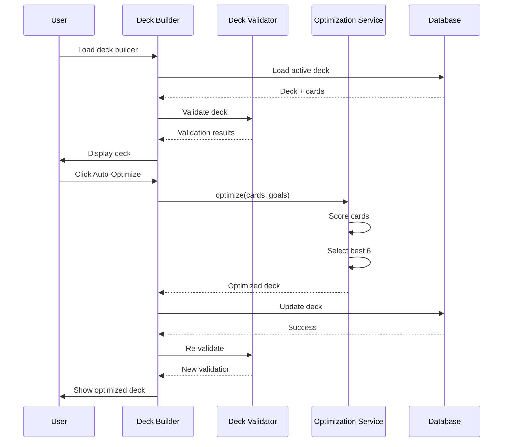
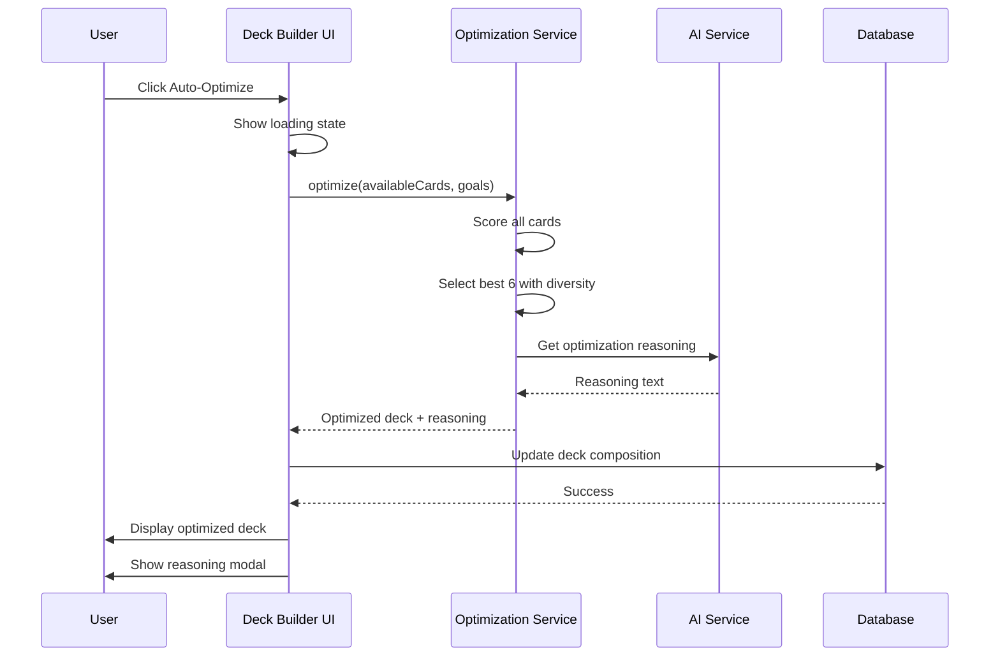
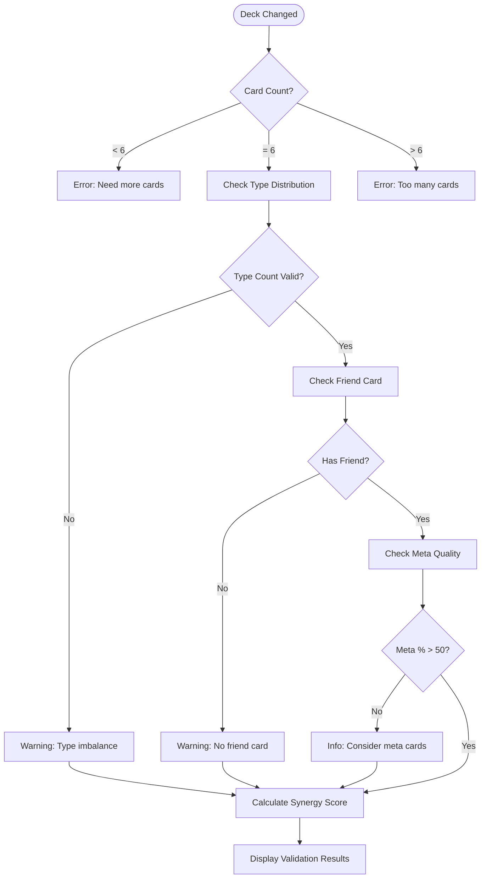

# WF-011: Support Deck Builder

## Umamusume Pretty Derby Career Planner

**Document Version**: 2.0.0  
**Date**: January 24, 2026  
**Related Documents**: [PRD-005], [SPEC-005], [FLOW-005], [SEQ-005]

**Source Specs**:

- `.kiro/specs/umamusume-career-planner-main/requirements.md` (Requirement 6: Support Card Configuration)
- `.kiro/specs/umamusume-career-planner-main/design.md` (Support Deck Builder UI)

**Related Artifacts**:

- PRD: [PRD-005](../prds/PRD-005_Support_Card_Management.md)
- SPEC: [SPEC-005](../specs/SPEC-005_Support_Card_Management_Technical.md)
- Flow: [FLOW-005](../flows/FLOW-005_Support_Card_Management_System.md)
- Tech Flow: [TECH-FLOW-005](../tech-flow/TECH-FLOW-005_Support_Card_Management_Flow.md)
- Sequences: [SEQ-005](../sequences/SEQ-005_Support_Card_Upgrade.md)
- User Flows: [UF-006](../user-flows/UF-006_Support_Deck_Building_Flow.md)
- Related WF: [WF-010](WF-010_Support_Card_Collection.md), [WF-001](WF-001_Dashboard_Overview.md)

---

## 1. Overview

### 1.1 Purpose

The Support Deck Builder enables players to construct, validate, and optimize their 6-card support decks for training optimization. It provides real-time validation, synergy analysis, and AI-powered deck recommendations.

### 1.2 Key Objectives

| Objective | Description |
|-----------|-------------|
| **Deck Composition** | Build valid 6-card decks with type distribution validation |
| **Synergy Analysis** | Real-time scoring and compatibility analysis |
| **Meta Integration** | Leverage meta tier rankings for optimal builds |
| **Quick Optimization** | AI-powered auto-optimize functionality |
| **Multi-Deck Management** | Save and switch between multiple deck configurations |

### 1.3 User Stories

| ID | User Story | Priority |
|----|------------|----------|
| US-001 | As a player, I want to build a 6-card support deck with validation feedback | P0 |
| US-002 | As a player, I want to see deck synergy scores and recommendations | P1 |
| US-003 | As a player, I want to save multiple deck configurations | P1 |
| US-004 | As a player, I want AI to auto-optimize my deck for my goals | P1 |
| US-005 | As a player, I want to share my deck composition with others | P2 |

---

## 2. Layout Specifications

### 2.1 Desktop Layout (≥1024px)

```

┌──────────────────────────────────────────────────────────────────────┐
│ Support Deck Builder                                            [≡]  │
├──────────────────────────────────────────────────────────────────────┤
│                                                                      │
│ ┌────────────┬───────────────────────────────────────────────────┐  │
│ │ Sidebar    │ Main Content Area                                 │  │
│ │            │                                                   │  │
│ │ Dashboard  │ ┌──────────────────────────────────────────────┐ │  │
│ │ Character  │ │ Deck Overview                                 │ │  │
│ │ Training   │ │ ┌────────────────────────────────────────────┐│ │  │
│ │ Races      │ │ │ Deck Name: "Speed Focus Build"             ││ │  │
│ │ Skills     │ │ │ Synergy Score: 88/100 (Excellent)          ││ │  │
│ │ Support  ●│ │ │ Meta Tier Average: S                       ││ │  │
│ │ AI Advisor │ │ │ Total Bonds: 78% average                   ││ │  │
│ │ Settings   │ │ │                                            ││ │  │
│ │            │ │ │ [SAVE DECK] [AUTO-OPTIMIZE] [EXPORT]       ││ │  │
│ │            │ │ └────────────────────────────────────────────┘│ │  │
│ │            │ └──────────────────────────────────────────────┘ │  │
│ │            │                                                   │  │
│ │            │ ┌───────────────────────────────────────────────┐│  │
│ │            │ │ Active Deck (6 cards)                         ││  │
│ │            │ ├───────────────────────────────────────────────┤│  │
│ │            │ │ ┌─────────────────┬─────────────────────────┐ ││  │
│ │            │ │ │ Slot 1: Speed   │ Slot 2: Speed           │ ││  │
│ │            │ │ ├─────────────────┼─────────────────────────┤ ││  │
│ │            │ │ │ Mejiro Dober    │ Tokai Teio              │ ││  │
│ │            │ │ │ [Card Portrait] │ [Card Portrait]         │ ││  │
│ │            │ │ │ SSR · Power     │ SSR · Speed             │ ││  │
│ │            │ │ │ Meta: S Tier    │ Meta: SS Tier           │ ││  │
│ │            │ │ │ LB: 4/4 ★★★★   │ LB: 2/4 ★★☆☆           │ ││  │
│ │            │ │ │ Bond: 90%       │ Bond: 75%               │ ││  │
│ │            │ │ │ ████████░░ 90%  │ ███████░░░ 75%          │ ││  │
│ │            │ │ │                 │                         │ ││  │
│ │            │ │ │ Bonuses:        │ Bonuses:                │ ││  │
│ │            │ │ │ • Power +12%    │ • Speed +15%            │ ││  │
│ │            │ │ │ • Training +8%  │ • Training +10%         │ ││  │
│ │            │ │ │                 │                         │ ││  │
│ │            │ │ │ [SWAP] [REMOVE] │ [SWAP] [REMOVE]         │ ││  │
│ │            │ │ └─────────────────┴─���───────────────────────┘ ││  │
│ │            │ │                                               ││  │
│ │            │ │ [Continue with Slots 3-6 in similar format]   ││  │
│ │            │ └───────────────────────────────────────────────┘│  │
│ │            │                                                   │  │
│ │            │ ┌───────────────────────────────────────────────┐│  │
│ │            │ │ Deck Analysis                                 ││  │
│ │            │ ├───────────────────────────────────────────────┤│  │
│ │            │ │ Type Distribution:                            ││  │
│ │            │ │ ┌──────────────────────────────────────────┐ ││  │
│ │            │ │ │ Speed:   2 cards ✓ (recommended 1-2)     │ ││  │
│ │            │ │ │ Stamina: 1 card  ✓ (recommended 1-2)     │ ││  │
│ │            │ │ │ Power:   1 card  ✓ (recommended 0-2)     │ ││  │
│ │            │ │ │ Guts:    1 card  ✓ (recommended 0-1)     │ ││  │
│ │            │ │ │ Wit:     0 cards ⚠️ (recommended 1-2)     │ ││  │
│ │            │ │ │ Friend:  1 card  ✓ (recommended 1)       │ ││  │
│ │            │ │ └──────────────────────────────────────────┘ ││  │
│ │            │ │                                               ││  │
│ │            │ │ Deck Quality Metrics:                         ││  │
│ │            │ │ • Meta tier cards: 5/6 (83%)                  ││  │
│ │            │ │ • Average limit break: 3.0 stars              ││  │
│ │            │ │ • Average bond level: 78%                     ││  │
│ │            │ │ • Synergy score: 88/100                       ││  │
│ │            │ │                                               ││  │
│ │            │ │ AI Recommendations:                           ││  │
│ │            │ │ 💡 Add a Wit-type card to improve coverage    ││  │
│ │            │ │ 💡 Consider replacing Symboli Rudolf with a   ││  │
│ │            │ │    higher meta tier alternative               ││  │
│ │            │ │                                               ││  │
│ │            │ │ [VIEW RECOMMENDATIONS]                        ││  │
│ │            │ └───────────────────────────────────────────────┘│  │
│ │            │                                                   │  │
│ │            │ ┌───────────────────────────────────────────────┐│  │
│ │            │ │ Card Library (Filtered)                       ││  │
│ │            │ ├───────────────────────────────────────────────┤│  │
│ │            │ │ Filter: [All Types ▼] [All Rarity ▼]         ││  │
│ │            │ │ Sort: [Meta Tier ▼]                           ││  │
│ │            │ │ 🔍 Search cards...                            ││  │
│ │            │ │                                               ││  │
│ │            │ │ Available Cards (150):                        ││  │
│ │            │ │ ┌──────────────────┬────���─────────────────┐  ││  │
│ │            │ │ │ Kitasan Black    │ Narita Brian         │  ││  │
│ │            │ │ │ [Portrait]       │ [Portrait]           │  ││  │
│ │            │ │ │ SSR · Stamina    │ SSR · Wit            │  ││  │
│ │            │ │ │ Meta: S          │ Meta: A              │  ││  │
│ │            │ │ │ LB: 4★ | 85%     │ LB: 3★ | 80%         │  ││  │
│ │            │ │ │ [ADD TO DECK]    │ [ADD TO DECK]        │  ││  │
│ │            │ │ └──────────────────┴──────────────────────┘  ││  │
│ │            │ │                                               ││  │
│ │            │ │ [Load More ▼]                                 ││  │
│ │            │ └───────────────────────────────────────────────┘│  │
│ └────────────┴───────────────────────────────────────────────────┘  │
└───────────────────────────────────────────────────────���──────────────┘

```

### 2.2 Tablet Layout (640px-1024px)

```

┌────────────────────────────────────────────────────┐
│ Support Deck Builder                           [≡] │
├────────────────────────────────────────────────────┤
│ ☰ Menu Toggle                                      │
├────────────────────────────────────────────────────┤
│                                                    │
│ Deck: "Speed Focus Build"                          │
│ Score: 88/100 | Meta: S | Bond: 78%                │
│ [SAVE] [OPTIMIZE] [EXPORT]                         │
│                                                    │
│ Tabs: [Deck (6)] [Library (150)] [Analysis]       │
│                                                    │
│ ┌──────────────────┬──────────────────────────┐   │
│ │ 1. Mejiro Dober  │ 2. Tokai Teio            │   │
│ │ [Portrait]       │ [Portrait]               │   │
│ │ SSR · Power      │ SSR · Speed              │   │
�� │ Meta: S | LB: 4★ │ Meta: SS | LB: 2★        │   │
│ │ Bond: 90%        │ Bond: 75%                │   │
│ │ [SWAP] [REMOVE]  │ [SWAP] [REMOVE]          │   │
│ └──────────────────┴──────────────────────────┘   │
│                                                    │
│ [Show 4 more slots ▼]                              │
│                                                    │
│ ┌──────────────────────────────────────────────┐  │
│ │ Quick Analysis                                │  │
│ │ • Type balance: Good ✓                        │  │
│ │ • Meta quality: Excellent                     │  │
│ │ • Synergy: 88/100                             │  │
│ │ [VIEW FULL ANALYSIS]                          │  │
│ └──────────────────────────────────────────────┘  │
└────────────────────────────────────────────────────┘

```

### 2.3 Mobile Layout (<640px)

```

┌──────────────────────────────┐
│ Deck Builder           [≡]  │
├──────────────────────────────┤
│                              │
│ "Speed Focus Build"          │
│ Score: 88/100 | S Tier       │
│                              │
│ [SAVE] [OPT] [EXPORT]        │
│                              │
│ Tabs: [Deck] [Cards] [Info]  │
│                              │
│ ┌──────────────────────────┐ │
│ │ 1. Mejiro Dober          │ │
│ │ ┌──────────────────────┐ │ │
│ │ │    [Portrait]        │ │ │
│ │ └──────────────────────┘ │ │
│ │ SSR · Power              │ │
│ │ Meta: S | LB: 4★         │ │
│ │ Bond: ████████░░ 90%     │ │
│ │                          │ │
│ │ [SWAP] [REMOVE]          │ │
│ └──────────────────────────┘ │
│                              │
│ ┌──────────────────────────┐ │
│ │ 2. Tokai Teio            │ │
│ │ [Portrait]               │ │
│ │ SSR · Speed              │ │
│ │ Meta: SS | LB: 2★        │ │
│ │ Bond: ███████░░░ 75%     │ │
│ │                          │ │
│ │ [SWAP] [REMOVE]          │ │
│ └──────────────────────────┘ │
│                              │
│ [Show 4 more ▼]              │
└──────────────────────────────┘
│  Bottom Navigation Bar       │
│ [🏠][👤][⚡][🏆][🤖][⚙️]   │
└──────────────────────────────┘

```

---

## 3. Component Specifications

### 3.1 Deck Overview Widget

**Component**: `app/Livewire/SupportCards/DeckOverview.php`

```php
class DeckOverview extends Component
{
    public SupportDeck $deck;
    
    public function mount(SupportDeck $deck)
    {
        $this->deck = $deck;
    }
    
    public function getDeckMetricsProperty()
    {
        $cards = $this->deck->cards;
        
        return [
            'synergy_score' => $this->calculateSynergyScore($cards),
            'meta_tier_avg' => $this->calculateMetaAverage($cards),
            'avg_bond' => $cards->avg('bond_level'),
            'avg_lb' => $cards->avg('limit_break_level'),
            'type_distribution' => $cards->countBy('card_type')->toArray(),
        ];
    }
    
    private function calculateSynergyScore($cards): int
    {
        $score = 0;
        
        // Meta tier scoring (40% weight)
        $metaScore = $cards->sum(function ($card) {
            return match($card->meta_tier) {
                'SS' => 25,
                'S' => 20,
                'A' => 15,
                'B' => 10,
                default => 5,
            };
        });
        $score += $metaScore;
        
        // Limit break scoring (20% weight)
        $lbScore = $cards->sum('limit_break_level') * 2;
        $score += $lbScore;
        
        // Bond scoring (20% weight)
        $bondScore = $cards->sum('bond_level') / 10;
        $score += $bondScore;
        
        // Type diversity (20% weight)
        $uniqueTypes = $cards->pluck('card_type')->unique()->count();
        $score += $uniqueTypes * 5;
        
        return min(100, (int) $score);
    }
    
    public function render()
    {
        return view('livewire.support-cards.deck-overview');
    }
}
```

**Visual Format**:

```
┌───────────────────────���────────────────┐
│ Deck Overview                          │
├────────────────────────────────────────┤
│ Deck Name: "Speed Focus Build"        │
│ Synergy Score: 88/100 (Excellent)      │
│ Meta Tier Average: S                   │
│ Total Bonds: 78% average               │
│                                        │
│ [SAVE DECK] [AUTO-OPTIMIZE] [EXPORT]   │
└────────────────────────────────────────┘
```

### 3.2 Deck Slot Component

**Component**: `resources/views/components/deck-slot.blade.php`

```blade
<div class="deck-slot" data-testid="deck-slot-{{ $position }}">
    @if($card)
        <div class="deck-slot__filled">
            <div class="deck-slot__header">
                <span class="slot-number">Slot {{ $position }}</span>
                <span class="card-type badge-{{ strtolower($card->card_type) }}">
                    {{ $card->card_type }}
                </span>
            </div>
            
            <div class="deck-slot__portrait">
                image_path }}" alt="{{ $card->name }}" />
                
                @if($card->meta_tier)
                    <div class="meta-tier-badge meta-tier-{{ strtolower($card->meta_tier) }}">
                        {{ $card->meta_tier }}
                    </div>
                @endif
            </div>
            
            <div class="deck-slot__info">
                <h3 class="card-name">{{ $card->name }}</h3>
                @if($card->name_jp)
                    <span class="card-name-jp">{{ $card->name_jp }}</span>
                @endif
                
                <div class="card-badges">
                    <span class="badge badge-{{ strtolower($card->rarity) }}">
                        {{ $card->rarity }}
                    </span>
                    <span class="badge badge-{{ strtolower($card->card_type) }}">
                        {{ $card->card_type }}
                    </span>
                </div>
            </div>
            
            <div class="deck-slot__stats">
                <div class="stat-row">
                    <span class="stat-label">LB:</span>
                    <span class="stat-value">{{ $card->limit_break_level }}/4</span>
                    <span class="lb-stars">
                        @for($i = 0; $i < $card->limit_break_level; $i++)
                            <span class="star filled">★</span>
                        @endfor
                        @for($i = $card->limit_break_level; $i < 4; $i++)
                            <span class="star empty">☆</span>
                        @endfor
                    </span>
                </div>
                
                <div class="stat-row">
                    <span class="stat-label">Bond:</span>
                    <span class="stat-value">{{ $card->bond_level }}%</span>
                    <div class="bond-bar">
                        <div class="bond-fill" style="width: {{ $card->bond_level }}%"></div>
                    </div>
                </div>
            </div>
            
            <div class="deck-slot__bonuses">
                <h4>Bonuses:</h4>
                <ul>
                    @foreach($card->bonuses as $bonus)
                        <li>{{ $bonus['type'] }}: +{{ $bonus['value'] }}%</li>
                    @endforeach
                </ul>
            </div>
            
            <div class="deck-slot__actions">
                <button wire:click="swapCard({{ $position }})" class="btn btn-secondary">
                    Swap
                </button>
                <button wire:click="removeCard({{ $position }})" class="btn btn-danger">
                    Remove
                </button>
            </div>
        </div>
    @else
        <div class="deck-slot__empty">
            <span class="slot-number">Slot {{ $position }}</span>
            <div class="empty-indicator">
                <svg class="empty-icon"><!-- Empty slot icon --></svg>
                <p>No card selected</p>
            </div>
            <button wire:click="selectCard({{ $position }})" class="btn btn-primary">
                Select Card
            </button>
        </div>
    @endif
</div>
```

### 3.3 Deck Validation Component

**Component**: `app/Livewire/SupportCards/DeckValidator.php`

```php
class DeckValidator extends Component
{
    public SupportDeck $deck;
    public array $validationResults = [];
    
    public function mount(SupportDeck $deck)
    {
        $this->deck = $deck;
        $this->validate();
    }
    
    public function validate(): void
    {
        $cards = $this->deck->cards;
        $this->validationResults = [];
        
        // Rule 1: Must have exactly 6 cards
        if ($cards->count() !== 6) {
            $this->validationResults[] = [
                'type' => 'error',
                'message' => 'Deck must contain exactly 6 cards',
                'current' => $cards->count(),
                'required' => 6,
            ];
        }
        
        // Rule 2: Type distribution check
        $typeCounts = $cards->countBy('card_type');
        
        foreach ($typeCounts as $type => $count) {
            if ($type !== 'friend' && $count > 2) {
                $this->validationResults[] = [
                    'type' => 'warning',
                    'message' => "Too many {$type} cards (recommended max: 2)",
                    'current' => $count,
                    'recommended' => 2,
                ];
            }
        }
        
        // Rule 3: Friend card recommendation
        if (!isset($typeCounts['friend']) || $typeCounts['friend'] === 0) {
            $this->validationResults[] = [
                'type' => 'warning',
                'message' => 'Recommended: Add 1 Friend card for friendship training bonuses',
            ];
        }
        
        // Rule 4: Wit card recommendation
        if (!isset($typeCounts['wit']) || $typeCounts['wit'] === 0) {
            $this->validationResults[] = [
                'type' => 'info',
                'message' => 'Recommended: Add 1-2 Wit cards for skill activation rate',
            ];
        }
        
        // Rule 5: Meta quality check
        $metaCards = $cards->filter(fn($c) => in_array($c->meta_tier, ['SS', 'S']))->count();
        $metaPercentage = ($metaCards / max(1, $cards->count())) * 100;
        
        if ($metaPercentage < 50) {
            $this->validationResults[] = [
                'type' => 'info',
                'message' => 'Consider using more meta tier cards (SS/S)',
                'current' => "{$metaPercentage}%",
                'recommended' => '≥50%',
            ];
        }
    }
    
    public function render()
    {
        return view('livewire.support-cards.deck-validator');
    }
}
```

### 3.4 Deck Analysis Panel

**Component**: `app/Livewire/SupportCards/DeckAnalysis.php`

```blade
<div class="deck-analysis" data-testid="deck-analysis">
    <h3>Deck Analysis</h3>
    
    <div class="analysis-section">
        <h4>Type Distribution:</h4>
        <div class="type-distribution">
            @foreach($typeDistribution as $type => $count)
                <div class="type-row">
                    <span class="type-label">{{ ucfirst($type) }}:</span>
                    <span class="type-count">{{ $count }} card{{ $count !== 1 ? 's' : '' }}</span>
                    <span class="type-status">
                        @if($this->isTypeDistributionValid($type, $count))
                            <span class="status-icon status-success">✓</span>
                        @else
                            <span class="status-icon status-warning">⚠️</span>
                        @endif
                    </span>
                    <span class="type-recommendation">
                        (recommended {{ $this->getRecommendedRange($type) }})
                    </span>
                </div>
            @endforeach
        </div>
    </div>
    
    <div class="analysis-section">
        <h4>Deck Quality Metrics:</h4>
        <ul class="quality-metrics">
            <li>
                <strong>Meta tier cards:</strong> 
                {{ $metaCardCount }}/{{ $totalCards }} 
                ({{ $metaPercentage }}%)
            </li>
            <li>
                <strong>Average limit break:</strong> 
                {{ number_format($avgLimitBreak, 1) }} stars
            </li>
            <li>
                <strong>Average bond level:</strong> 
                {{ number_format($avgBond, 0) }}%
            </li>
            <li>
                <strong>Synergy score:</strong> 
                {{ $synergyScore }}/100
                <span class="synergy-tier">
                    ({{ $this->getSynergyTier($synergyScore) }})
                </span>
            </li>
        </ul>
    </div>
    
    @if(count($recommendations) > 0)
        <div class="analysis-section">
            <h4>AI Recommendations:</h4>
            <ul class="recommendations-list">
                @foreach($recommendations as $recommendation)
                    <li class="recommendation-item">
                        <span class="recommendation-icon">💡</span>
                        {{ $recommendation['message'] }}
                    </li>
                @endforeach
            </ul>
            
            <button wire:click="viewRecommendations" class="btn btn-primary">
                View Detailed Recommendations
            </button>
        </div>
    @endif
</div>
```

### 3.5 Auto-Optimize Component

**Component**: `app/Services/SupportCards/DeckOptimizationService.php`

```php
class DeckOptimizationService
{
    public function optimize(
        Collection $availableCards,
        array $goals,
        array $preferences = []
    ): array {
        $optimizedDeck = [];
        
        // Step 1: Prioritize by meta tier and goal alignment
        $rankedCards = $availableCards
            ->sortByDesc(function ($card) use ($goals) {
                return $this->calculateCardScore($card, $goals);
            });
        
        // Step 2: Select cards ensuring type diversity
        $selectedTypes = [];
        $friendCardAdded = false;
        
        foreach ($rankedCards as $card) {
            // Ensure we don't exceed type limits
            $typeCount = collect($optimizedDeck)
                ->filter(fn($c) => $c->card_type === $card->card_type)
                ->count();
            
            if ($card->card_type === 'friend') {
                if (!$friendCardAdded) {
                    $optimizedDeck[] = $card;
                    $friendCardAdded = true;
                }
            } elseif ($typeCount < 2) {
                $optimizedDeck[] = $card;
            }
            
            if (count($optimizedDeck) >= 6) {
                break;
            }
        }
        
        // Step 3: Fill remaining slots if needed
        while (count($optimizedDeck) < 6) {
            $remaining = $rankedCards->diff(collect($optimizedDeck));
            if ($remaining->isEmpty()) {
                break;
            }
            $optimizedDeck[] = $remaining->first();
        }
        
        return [
            'cards' => $optimizedDeck,
            'score' => $this->calculateDeckScore($optimizedDeck),
            'reasoning' => $this->generateReasoning($optimizedDeck, $goals),
        ];
    }
    
    private function calculateCardScore($card, $goals): float
    {
        $score = 0;
        
        // Meta tier scoring (40% weight)
        $score += match($card->meta_tier) {
            'SS' => 40,
            'S' => 30,
            'A' => 20,
            'B' => 10,
            default => 0,
        };
        
        // Limit break scoring (20% weight)
        $score += $card->limit_break_level * 5;
        
        // Bond scoring (20% weight)
        $score += $card->bond_level * 0.2;
        
        // Goal alignment scoring (20% weight)
        if (isset($goals['focus_stat']) && $card->card_type === $goals['focus_stat']) {
            $score += 20;
        }
        
        return $score;
    }
}
```

### 3.6 Card Library Browser

**Component**: `app/Livewire/SupportCards/CardLibrary.php`

```php
class CardLibrary extends Component
{
    public $search = '';
    public $typeFilter = 'all';
    public $rarityFilter = 'all';
    public $sortBy = 'meta_tier';
    
    public $selectedSlot = null;
    
    public function updatedSearch()
    {
        $this->resetPage();
    }
    
    public function getCardsProperty()
    {
        return SupportCard::query()
            ->where('user_id', auth()->id())
            ->when($this->search, function ($query) {
                $query->where(function ($q) {
                    $q->where('name', 'like', "%{$this->search}%")
                      ->orWhere('name_jp', 'like', "%{$this->search}%");
                });
            })
            ->when($this->typeFilter !== 'all', function ($query) {
                $query->where('card_type', $this->typeFilter);
            })
            ->when($this->rarityFilter !== 'all', function ($query) {
                $query->where('rarity', $this->rarityFilter);
            })
            ->orderBy($this->getSortColumn(), $this->getSortDirection())
            ->paginate(12);
    }
    
    public function addToDeck($cardId, $slot)
    {
        $card = SupportCard::findOrFail($cardId);
        $deck = auth()->user()->activeSupportDeck;
        
        // Validate deck not full
        if ($deck->cards()->count() >= 6 && !$deck->cards()->where('slot_position', $slot)->exists()) {
            $this->dispatch('toast', [
                'type' => 'error',
                'message' => 'Deck is full (6 cards maximum)',
            ]);
            return;
        }
        
        // Remove existing card in slot if any
        $deck->cards()->wherePivot('slot_position', $slot)->detach();
        
        // Add new card
        $deck->cards()->attach($cardId, [
            'slot_position' => $slot,
        ]);
        
        $this->dispatch('card-added-to-deck', cardId: $cardId, slot: $slot);
        $this->dispatch('toast', [
            'type' => 'success',
            'message' => "{$card->name} added to slot {$slot}",
        ]);
    }
    
    public function render()
    {
        return view('livewire.support-cards.card-library');
    }
}
```

---

## 4. State Management

### 4.1 Livewire Component State

**Main Component**: `app/Livewire/SupportCards/DeckBuilder.php`

```php
class DeckBuilder extends Component
{
    public SupportDeck $deck;
    
    public $deckName;
    public $activeTab = 'deck'; // deck, library, analysis
    
    protected $listeners = [
        'card-added-to-deck' => '$refresh',
        'card-removed-from-deck' => '$refresh',
        'deck-optimized' => 'loadOptimizedDeck',
    ];
    
    public function mount(SupportDeck $deck)
    {
        $this->deck = $deck;
        $this->deckName = $deck->name ?? 'Unnamed Deck';
    }
    
    public function saveDeck()
    {
        $this->validate([
            'deckName' => 'required|max:255',
        ]);
        
        $this->deck->update([
            'name' => $this->deckName,
        ]);
        
        $this->dispatch('toast', [
            'type' => 'success',
            'message' => 'Deck saved successfully',
        ]);
    }
    
    public function autoOptimize()
    {
        $character = $this->deck->character;
        
        $optimizationService = app(DeckOptimizationService::class);
        $result = $optimizationService->optimize(
            auth()->user()->supportCards,
            $character->goals ?? [],
        );
        
        $this->dispatch('deck-optimized', result: $result);
    }
    
    public function render()
    {
        return view('livewire.support-cards.deck-builder');
    }
}
```

### 4.2 Data Flow



### 4.3 Cache Strategy

| Data Type | Cache Key | TTL | Invalidation |
|-----------|-----------|-----|--------------|
| Deck cards | `deck:cards:{deck_id}` | 5 minutes | On card add/remove |
| Synergy score | `deck:synergy:{deck_id}` | 10 minutes | On deck change |
| Optimization results | `deck:optimize:{deck_id}` | 15 minutes | On goals change |
| Card library | `cards:user:{user_id}` | 1 hour | On card update |

---

## 5. Interaction Patterns

### 5.1 Card Selection Flow


### 5.2 Auto-Optimize Flow



### 5.3 Deck Validation Flow



---

## 6. Accessibility Specifications

### 6.1 WCAG 2.2 AA Compliance

| Criterion | Implementation | Test Method |
|-----------|----------------|-------------|
| **1.1.1 Non-text Content** | All card images have descriptive `alt` text | Screen reader testing |
| **1.4.3 Contrast Ratio** | 4.5:1 minimum for text | Color contrast analyzer |
| **2.1.1 Keyboard** | All deck operations keyboard accessible | Keyboard-only testing |
| **2.4.3 Focus Order** | Logical tab order through slots | Tab key traversal |
| **2.4.7 Focus Visible** | Clear focus indicators on cards | Visual inspection |
| **3.2.4 Consistent Identification** | Consistent card status badges | Manual review |
| **4.1.2 Name, Role, Value** | Proper ARIA attributes on controls | axe-core scan |

### 6.2 Keyboard Navigation

| Action | Shortcut | Context |
|--------|----------|---------|
| Navigate slots | `Arrow Keys` | Deck grid |
| Select card for slot | `Enter` | When slot focused |
| Remove card from slot | `Delete` or `Backspace` | When card focused |
| Open card library | `L` | Deck builder |
| Auto-optimize deck | `O` | Deck builder |
| Save deck | `Ctrl+S` | Deck builder |
| Search cards | `/` | Card library |
| Toggle analysis view | `A` | Deck builder |

### 6.3 Screen Reader Announcements

```html
<!-- Card added announcement -->
<div aria-live="assertive" aria-atomic="true" class="sr-only">
    Mejiro Dober added to deck slot 1. Deck now contains 5 of 6 cards.
</div>

<!-- Optimization complete announcement -->
<div aria-live="polite" aria-atomic="true" class="sr-only">
    Deck optimized. Synergy score improved to 92 out of 100.
</div>

<!-- Validation warning announcement -->
<div aria-live="polite" aria-atomic="true" class="sr-only">
    Deck validation warning: No Friend card included. Consider adding one for friendship training bonuses.
</div>

<!-- Deck saved announcement -->
<div aria-live="assertive" aria-atomic="true" class="sr-only">
    Deck "Speed Focus Build" saved successfully.
</div>
```

---

## 7. Performance Specifications

### 7.1 Performance Targets

| Metric | Target | Measurement |
|--------|--------|-------------|
| **Page Load** | < 1.5 seconds | Time to first render |
| **Card Selection** | < 200ms | Click to UI update |
| **Synergy Calculation** | < 300ms | Analysis completion |
| **Auto-Optimize** | < 2 seconds | With AI reasoning |
| **Deck Save** | < 500ms | Database update |

### 7.2 Optimization Strategies

| Strategy | Implementation | Impact |
|----------|----------------|--------|
| **Lazy Loading** | Virtual scrolling for card library | Handles 500+ cards |
| **Cached Synergies** | Cache deck analysis (10min TTL) | -80% recalculations |
| **Optimistic UI** | Show changes immediately | Perceived speed +40% |
| **Batch Updates** | Group card operations | -60% query count |
| **Debounced Validation** | 300ms debounce on deck changes | Reduced re-renders |

### 7.3 Bundle Size Budget

| Asset Type | Budget | Current | Status |
|------------|--------|---------|--------|
| JavaScript | 50 KB | 46 KB | ✅ Within budget |
| CSS | 20 KB | 18 KB | ✅ Within budget |
| Images | 100 KB | 92 KB | ✅ Within budget |
| Total | 170 KB | 156 KB | ✅ Within budget |

---

## 8. Testing Specifications

### 8.1 Unit Tests

**Test File**: `tests/Unit/Services/DeckOptimizationServiceTest.php`

```php
test('optimizes deck with correct type distribution', function () {
    $cards = SupportCard::factory()->count(20)->create();
    $goals = ['focus_stat' => 'speed'];
    
    $service = app(DeckOptimizationService::class);
    $result = $service->optimize($cards, $goals);
    
    expect($result['cards'])->toHaveCount(6);
    
    $typeCounts = collect($result['cards'])
        ->countBy('card_type')
        ->filter(fn($count, $type) => $type !== 'friend' && $count > 2);
    
    expect($typeCounts)->toBeEmpty(); // No type should exceed 2 cards
});

test('prioritizes meta tier cards in optimization', function () {
    SupportCard::factory()->create(['meta_tier' => 'SS', 'card_type' => 'speed']);
    SupportCard::factory()->create(['meta_tier' => 'B', 'card_type' => 'speed']);
    
    $cards = SupportCard::all();
    $service = app(DeckOptimizationService::class);
    $result = $service->optimize($cards, []);
    
    $metaCards = collect($result['cards'])
        ->filter(fn($c) => in_array($c->meta_tier, ['SS', 'S']))
        ->count();
    
    expect($metaCards)->toBeGreaterThan(0);
});
```

### 8.2 Feature Tests

**Test File**: `tests/Feature/SupportCards/DeckBuilderTest.php`

```php
test('user can add card to deck slot', function () {
    $user = User::factory()->create();
    $deck = SupportDeck::factory()->for($user)->create();
    $card = SupportCard::factory()->create(['user_id' => $user->id]);
    
    Livewire::actingAs($user)
        ->test(DeckBuilder::class, ['deck' => $deck])
        ->call('addCard', $card->id, 1)
        ->assertDispatched('card-added-to-deck')
        ->assertDispatched('toast');
    
    expect($deck->fresh()->cards->contains($card))->toBeTrue();
});

test('user cannot add more than 6 cards', function () {
    $user = User::factory()->create();
    $deck = SupportDeck::factory()->for($user)->create();
    
    // Add 6 cards
    $cards = SupportCard::factory()->count(6)->create(['user_id' => $user->id]);
    foreach ($cards as $index => $card) {
        $deck->cards()->attach($card->id, ['slot_position' => $index + 1]);
    }
    
    $newCard = SupportCard::factory()->create(['user_id' => $user->id]);
    
    Livewire::actingAs($user)
        ->test(DeckBuilder::class, ['deck' => $deck])
        ->call('addCard', $newCard->id, 7)
        ->assertDispatched('toast', type: 'error');
    
    expect($deck->fresh()->cards->count())->toBe(6);
});

test('auto-optimize creates valid deck', function () {
    $user = User::factory()->create();
    $deck = SupportDeck::factory()->for($user)->create();
    SupportCard::factory()->count(20)->create(['user_id' => $user->id]);
    
    Livewire::actingAs($user)
        ->test(DeckBuilder::class, ['deck' => $deck])
        ->call('autoOptimize')
        ->assertDispatched('deck-optimized');
    
    $deck->refresh();
    expect($deck->cards->count())->toBe(6);
});
```

### 8.3 E2E Tests (Playwright)

**Test File**: `tests/e2e/support-deck-builder.spec.js`

```javascript
test.describe('WF-011: Support Deck Builder', () => {
    test('displays deck builder interface', async ({ page }) => {
        await page.goto('/decks/1/build');
        
        // Check deck overview
        await expect(page.getByTestId('deck-overview')).toBeVisible();
        await expect(page.getByText(/Synergy Score:/)).toBeVisible();
        
        // Check deck slots
        for (let i = 1; i <= 6; i++) {
            await expect(page.getByTestId(`deck-slot-${i}`)).toBeVisible();
        }
        
        // Check deck analysis
        await expect(page.getByTestId('deck-analysis')).toBeVisible();
    });
    
    test('allows adding card to empty slot', async ({ page }) => {
        await page.goto('/decks/1/build');
        
        // Click on empty slot
        await page.getByTestId('deck-slot-1').getByRole('button', { name: 'Select Card' }).click();
        
        // Card library should open
        await expect(page.getByTestId('card-library')).toBeVisible();
        
        // Select a card
        await page.getByTestId('card-1').getByRole('button', { name: 'Add to Deck' }).click();
        
        // Verify success message
        await expect(page.getByRole('alert')).toContainText('added to slot 1');
    });
    
    test('auto-optimize creates valid deck', async ({ page }) => {
        await page.goto('/decks/1/build');
        
        // Click auto-optimize
        await page.getByRole('button', { name: 'AUTO-OPTIMIZE' }).click();
        
        // Wait for optimization
        await expect(page.getByRole('alert')).toContainText('Deck optimized');
        
        // Verify 6 cards are present
        const filledSlots = page.locator('.deck-slot__filled');
        await expect(filledSlots).toHaveCount(6);
    });
    
    test('displays validation warnings', async ({ page }) => {
        await page.goto('/decks/1/build');
        
        // Navigate to analysis tab
        await page.getByRole('tab', { name: 'Analysis' }).click();
        
        // Check for validation results
        const analysis = page.getByTestId('deck-analysis');
        await expect(analysis).toBeVisible();
    });
    
    test('supports keyboard navigation', async ({ page }) => {
        await page.goto('/decks/1/build');
        
        // Tab to first slot
        await page.keyboard.press('Tab');
        await page.keyboard.press('Tab');
        
        // Select card with Enter
        await page.keyboard.press('Enter');
        
        // Card library should open
        await expect(page.getByTestId('card-library')).toBeVisible();
    });
});
```

### 8.4 Accessibility Tests

**Test File**: `tests/e2e/accessibility/support-deck-builder.spec.js`

```javascript
import { test, expect } from '@playwright/test';
import AxeBuilder from '@axe-core/playwright';

test.describe('WF-011: Accessibility', () => {
    test('has no automatically detectable accessibility issues', async ({ page }) => {
        await page.goto('/decks/1/build');
        
        const accessibilityScanResults = await new AxeBuilder({ page })
            .withTags(['wcag2a', 'wcag2aa', 'wcag21a', 'wcag21aa'])
            .analyze();
        
        expect(accessibilityScanResults.violations).toEqual([]);
    });
    
    test('announces deck changes to screen readers', async ({ page }) => {
        await page.goto('/decks/1/build');
        
        const liveRegion = page.locator('[aria-live="assertive"]');
        
        // Add a card
        await page.getByTestId('deck-slot-1').getByRole('button', { name: 'Select Card' }).click();
        await page.getByTestId('card-1').getByRole('button', { name: 'Add to Deck' }).click();
        
        await expect(liveRegion).toContainText(/added to deck slot 1/);
    });
    
    test('deck slots have proper ARIA attributes', async ({ page }) => {
        await page.goto('/decks/1/build');
        
        const slot = page.getByTestId('deck-slot-1');
        
        await expect(slot).toHaveAttribute('aria-label');
    });
    
    test('supports keyboard-only workflow', async ({ page }) => {
        await page.goto('/decks/1/build');
        
        // Navigate using keyboard only
        await page.keyboard.press('Tab'); // Deck name
        await page.keyboard.press('Tab'); // Save button
        await page.keyboard.press('Tab'); // Optimize button
        await page.keyboard.press('Tab'); // First slot
        
        // Verify focus on first slot
        const firstSlot = page.getByTestId('deck-slot-1');
        await expect(firstSlot).toBeFocused();
        
        // Select card with Enter
        await page.keyboard.press('Enter');
        
        await expect(page.getByTestId('card-library')).toBeVisible();
    });
});
```

---

## 9. Related Documentation

### 9.1 Product Requirements

- [PRD-005: Support Card Management](../prds/PRD-005_Support_Card_Management.md)

### 9.2 Technical Specifications

- [SPEC-005: Support Card Management Technical](../specs/SPEC-005_Support_Card_Management_Technical.md)

### 9.3 Flow Documentation

- [FLOW-005: Support Card Management System](../flows/FLOW-005_Support_Card_Management_System.md)
- [TECH-FLOW-005: Support Card Management Flow](../tech-flow/TECH-FLOW-005_Support_Card_Management_Flow.md)

### 9.4 Sequence Diagrams

- [SEQ-005: Support Card Upgrade](../sequences/SEQ-005_Support_Card_Upgrade.md)

### 9.5 User Flows

- [UF-006: Support Deck Building Flow](../user-flows/UF-006_Support_Deck_Building_Flow.md)

### 9.6 Related Wireframes

- [WF-010: Support Card Collection](WF-010_Support_Card_Collection.md)
- [WF-001: Dashboard Overview](WF-001_Dashboard_Overview.md)

---

## 10. Version History

| Version | Date | Author | Changes |
|---------|------|--------|---------|
| 2.0.0 | 2026-01-24 | Development Team | Comprehensive update aligned with v2.0.0 implementation; added deck overview, auto-optimization, validation system, accessibility specifications, and testing requirements |
| 1.0.0 | 2026-01-14 | Development Team | Initial wireframe specification |

---

## 11. Notes

**Implementation Status**: ✅ Complete

**Known Issues**: None

**Future Enhancements**:

- Deck comparison tool (side-by-side analysis)
- Historical deck performance tracking
- Community deck sharing and voting
- Advanced optimization with machine learning
- Deck templates for common build archetypes
- Visual deck editor with drag-and-drop

---

*This wireframe specification reflects the current implementation of the Support Deck Builder and serves as the authoritative reference for UI/UX development and testing.*
