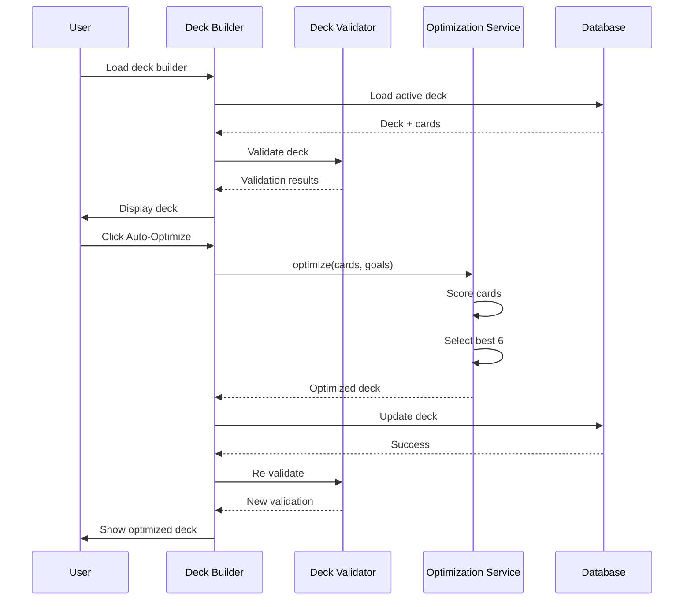
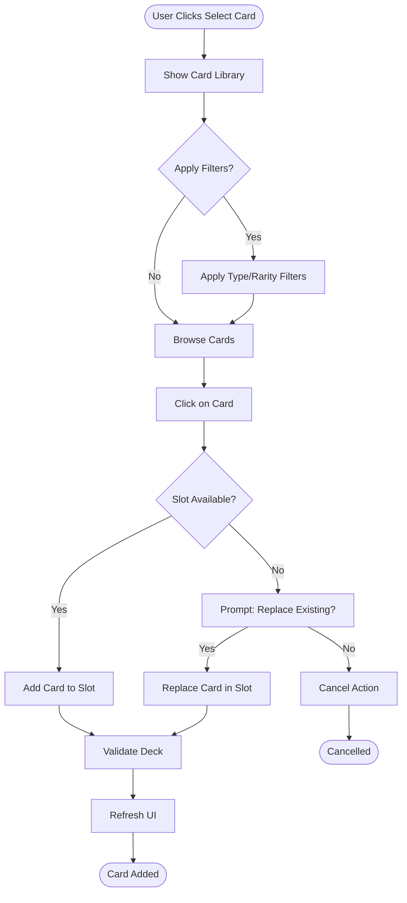
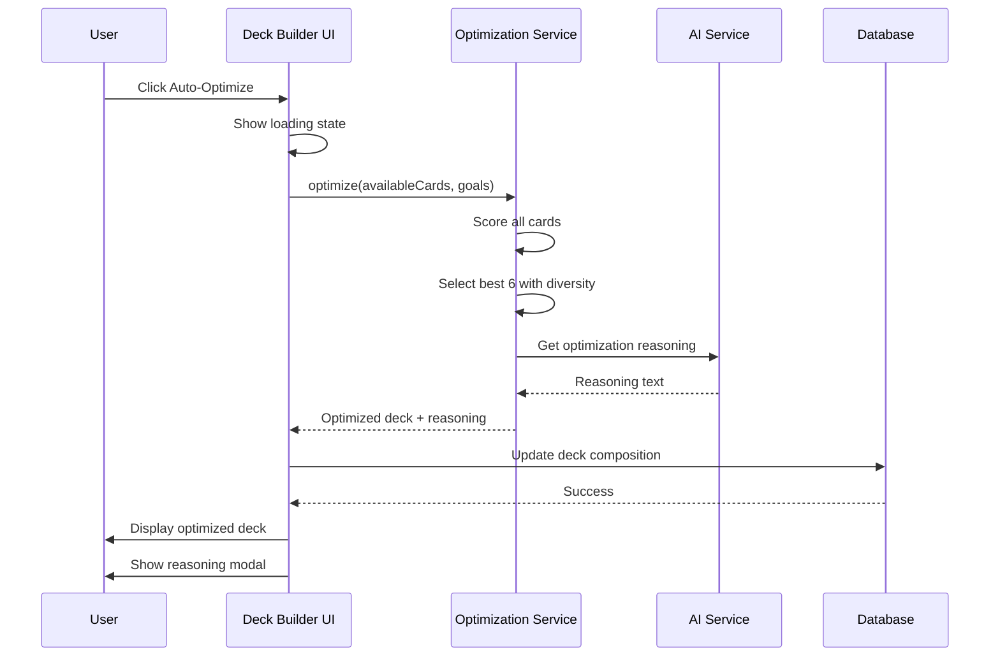

# WF-011: Support Deck Builder

## Umamusume Pretty Derby Career Planner

**Document Version**: 2.3.0  
**Date**: February 22, 2026  
**Related Documents**: [PRD-005], [SPEC-005], [FLOW-005], [SEQ-005]

**Source Specs**:

- `.kiro/specs/umamusume-career-planner-main/requirements.md` (Requirement 6: Support Card Configuration)
- `.kiro/specs/umamusume-career-planner-main/design.md` (Support Deck Builder UI)

**Related Artifacts**:

- PRD: [PRD-005](../prds/PRD-005_Support_Card_Management.md)
- SPEC: [SPEC-005](../specs/SPEC-005_Support_Card_Management_Technical.md)
- Flow: [FLOW-005](../flows/FLOW-005_Support_Card_Management_System.md)
- Tech Flow: [TECH-FLOW-005](../tech-flow/TECH-FLOW-005_Support_Card_Management_Flow.md)
- Sequences: [SEQ-005](../sequences/SEQ-005_Support_Card_Upgrade.md)
- User Flows: [UF-006](../user-flows/UF-006_Support_Deck_Building_Flow.md)
- Related WF: [WF-010](WF-010_Support_Card_Collection.md), [WF-001](WF-001_Dashboard_Overview.md)

---

## 1. Overview

### 1.1 Purpose

The Support Deck Builder enables players to construct, validate, and optimize their 6-card support decks for training optimization. It provides real-time validation, synergy analysis, and AI-powered deck recommendations.

### 1.2 Key Objectives

| Objective                 | Description                                                                    |
| ------------------------- | ------------------------------------------------------------------------------ |
| **Deck Composition**      | Build valid 6-card decks with any type combination                             |
| **Presence Bonus**        | Track support card presence bonus (+5% per card in training, max +30%)         |
| **Synergy Analysis**      | Real-time scoring for training concentration and skill hint coverage           |
| **Meta Integration**      | Leverage meta tier rankings for optimal builds                                 |
| **Quick Optimization**    | AI-powered auto-optimize functionality                                         |
| **Multi-Deck Management** | Save and switch between multiple deck configurations                           |

### 1.3 Game-Accurate Mechanics (Global English Server - Feb 2026)

#### 1.3.1 Deck Composition Rules

| Rule | Description |
| --- | --- |
| **Total Slots** | 6 support card slots |
| **Type Mixing** | Can mix any combination of types (no restrictions) |
| **Common Strategies** | 3 Speed + 2 Power + 1 Friend, 2 Speed + 2 Stamina + 1 Power + 1 Friend, etc. |
| **Presence Bonus** | +5% training bonus per card present in training (max +30%) |

#### 1.3.2 Support Card Types

| Type | Training Focus | Skill Category | Primary Benefit |
| --- | --- | --- | --- |
| **Speed** | Speed | Speed-related skills | Boosts speed training, acceleration |
| **Stamina** | Stamina | Recovery skills | Boosts stamina training, endurance |
| **Power** | Power | Acceleration skills | Boosts power training, burst speed |
| **Guts** | Guts | Positioning skills | Boosts guts training, race positioning |
| **Wit** | Wit | Race reading skills | Boosts wit training, skill activation |
| **Friend** | Special | Unique events | Mood management, special bonuses, unique events |

#### 1.3.3 Deck Synergy Considerations

| Factor                      | Impact                                                         |
| --------------------------- | -------------------------------------------------------------- |
| **Training Concentration**  | Multiple cards of same type = faster facility leveling         |
| **Skill Hint Coverage**     | Diverse hints for target build optimization                    |
| **Bond Management**         | Balance bond building across all 6 cards                       |
| **Event Chain Optimization**| Maximize beneficial event triggers                             |

#### 1.3.4 Card Selection Criteria

| Criterion | Description |
| --- | --- |
| **Limit Break Level** | ★ to ★★★★★ (1-5 stars, affects stat bonuses) |
| **Skill Hints Provided** | Skills available at reduced SP cost (5 levels: 10%/20%/30%/35%/40% max) |
| **Training Bonus %** | Percentage boost to training gains |
| **Event Quality** | Value of card-specific events |

### 1.4 User Stories

| ID     | User Story                                                                  | Priority |
| ------ | --------------------------------------------------------------------------- | -------- |
| US-001 | As a player, I want to build a 6-card support deck with validation feedback | P0       |
| US-002 | As a player, I want to see deck synergy scores and recommendations          | P1       |
| US-003 | As a player, I want to save multiple deck configurations                    | P1       |
| US-004 | As a player, I want AI to auto-optimize my deck for my goals                | P1       |
| US-005 | As a player, I want to share my deck composition with others                | P2       |
| US-006 | As a player, I want to see the presence bonus calculation for my deck       | P1       |
| US-007 | As a player, I want to see limit break levels (★-★★★★★) for each card       | P0       |
| US-008 | As a player, I want to see card type distribution for training focus        | P1       |

---

## 2. Layout Specifications

### 2.1 Desktop Layout (≥1024px)

┌──────────────────────────────────────────────────────────────────────┐
│ [≡] Menu | Deck Builder: Speed Focus Build | [?] Help │
├──────────────────────────────────────────────────────────────────────┤
│ ┌──────────────────────────────────────────────────────────────────┐ │
│ │ Deck Name: Speed Focus Build [✏️ Edit Name] │ │
│ │ │ │
│ │ ┌─────────────────────────────────────────────────────────────┐ │ │
│ │ │ TYPE DISTRIBUTION │ │ │
│ │ │ Speed: ███████ 3 | Stamina: ██ 1 | Power: ██ 1 | Friend: █ 1 │ │ │
│ │ └─────────────────────────────────────────────────────────────┘ │ │
│ │ │ │
│ │ Synergy Score: 7,850 (S) | Presence Bonus: +30% (6 cards max) │ │
│ │ Training Focus: Speed (+15%) | Skill Hints: 12 covered │ │
│ │ │ │
│ │ [Save] [Auto-Fill] [Clear] [Analysis Details] │ │
│ └──────────────────────────────────────────────────────────────────┘ │
├──────────────────────────────────────────────────────────────────────┤
│ │
│ ┌──────────────────────────────────────────────────────────────────┐ │
│ │ Active Deck (6 Slots) - Presence Bonus: +5% per card in training │ │
│ ├────────────┬────────────┬────────────┬────────────┬───────────┤ │
│ │ [Speed] │ [Speed] │ [Speed] │ [Stamina] │ [Power] ││
│ │ ┌────────┐ │ ┌────────┐ │ ┌────────┐ │ ┌────────┐ │ ┌────────┐ │ │
│ │ │Img │ │ │Img │ │ │Img │ │ │Img │ │ │Img │ │ │
│ │ └────────┘ │ └────────┘ │ └────────┘ │ └────────┘ │ └────────┘ │ │
│ │ Kitasan │ Tokai │ Biko │ Super │ Oguri │ │ │
│ │ Black │ Teio │ Pegasus │ Creek │ Cap │ │ │
│ │ [SSR] │ [SSR] │ [SSR] │ [SSR] │ [SSR] │ │ │
│ │ ★★★★★ │ ★★★★☆ │ ★★★★★ │ ★★★★★ │ ★★★☆☆ │ │ │
│ │ │ │ │ │ │ │ │
│ │ [Change] │ [Change] │ [Change] │ [Change] │ [Change] │ │ │
│ ├────────────┴────────────┴────────────┴────────────┴───────────┤ │
│ │ [Friend] │ │
│ │ ┌────────┐ │ │
│ │ │Img │ │ │
│ │ └────────┘ │ │
│ │ Riko │ │
│ │ Kashimoto │ │
│ │ [SSR] │ │
│ │ ★★★★☆ │ │
│ │ │ │
│ │ [Change] │ │
│ └────────────────────────────────────────────────────────────────┘ │
│ │
│ ┌──────────────────────────────────────────────────────────────────┐ │
│ │ Card Library / Selection │ │
│ ├──────────────────────────────────────────────────────────────────┤ │
│ │ [Filter: Speed ▼] [Sort: Limit Break ▼] [Search...] │ │
│ │ │ │
│ │ ┌────────┐ ┌────────┐ ┌────────┐ ┌──────── ┌────────┐ │ │
│ │ │ [Img] │ │ [Img] │ │ [Img] │ │ [Img] │ │ [Img] │ │ │
│ │ │ Spd │ │ Spd │ │ Pwr │ │ Wit │ │ Guts │ │ │
│ │ │ ★★★★★ │ │ ★★★★☆ │ │ ★★★☆☆ │ │ ★★★★★ │ │ ★★★★☆ │ │ │
│ │ └────────┘ └────────┘ └────────┘ └────────┘ └────────┘ │ │
│ │ King El Condor Oguri Fine Rice │ │
│ │ Halo Pasa Cap Motion Shower │ │
│ │ │ │
│ └──────────────────────────────────────────────────────────────────┘ │
│ │
└──────────────────────────────────────────────────────────────────────┘

### 2.2 Tablet Layout (640px-1024px)

┌────────────────────────────────────────────────────┐
│ [≡] Menu | Deck Builder [?] │
├────────────────────────────────────────────────────┤
│ ┌────────────────────────────────────────────────┐ │
│ │ Deck: Spd Focus [Save] [Fill] [Clear] │ │
│ │ Type: Spd×3 Sta×1 Pwr×1 Frd×1 │ │
│ │ Score: 7850 (S) | Presence: +30% (max) │ │
│ └────────────────────────────────────────────────┘ │
├────────────────────────────────────────────────────┤
│ │
│ ┌────────────────────────────────────────────────┐ │
│ │ Active Deck (6 Slots) │ │
│ ├──────────────┬──────────────┬───────────────┤ │ │
│ │ 1. [Speed] │ 2. [Speed] │ 3. [Speed] │ │ │
│ │ Kitasan │ Tokai │ Biko │ │ │
│ │ [SSR] ★★★★★ │ [SSR] ★★★★☆ │ [SSR] ★★★★★ │ │ │
│ ├──────────────┼──────────────┼───────────────┤ │ │
│ │ 4. [Stamina] │ 5. [Power] │ 6. [Friend] │ │ │
│ │ Super │ Oguri │ Riko │ │ │
│ │ Creek ★★★★★ │ Cap ★★★☆☆ │ Kashimoto │ │ │
│ │ │ │ ★★★★☆ │ │ │
│ └──────────────┴──────────────┴───────────────┘ │ │
│ │
│ ┌────────────────────────────────────────────────┐ │
│ │ Library [Filter ▼] [Sort: LB ▼] │ │
│ │ │ │
│ │ [King Halo] [El Condor] [Oguri Cap] ... │ │
│ │ ★★★★★ ★★★★☆ ★★★☆☆ │ │
│ └────────────────────────────────────────────────┘ │
│ │
└────────────────────────────────────────────────────┘

### 2.3 Mobile Layout (<640px)

┌──────────────────────────────┐
│ [≡] Deck Builder [?] │
├──────────────────────────────┤
│ Name: Spd Focus [Score S] │
│ Type: Spd×3 Sta×1 Pwr×1 Frd×1│
│ Presence Bonus: +30% (max) │
│ [Save] [Fill] [Clear] │
├──────────────────────────────┤
│ │
│ ACTIVE DECK (6) │
│ ┌──────────────────┐ │
│ │ 1. [Speed] │ │
│ │ Kitasan Black │ │
│ │ [SSR] ★★★★★ │ │
│ └──────────────────┘ │
│ ┌──────────────────┐ │
│ │ 2. [Speed] │ │
│ │ Tokai Teio │ │
│ │ [SSR] ★★★★☆ │ │
│ └──────────────────┘ │
│ [Show All 6 ▼] │
│ │
│ LIBRARY │
│ [Filter] [Sort: LB] [Search] │
│ ┌────────┐ ┌────────┐ │
│ │ [Img] │ │ [Img] │ │
│ │ King │ │ El │ │
│ │ Halo │ │ Condor │ │
│ │ ★★★★★ │ │ ★★★★☆ │ │
│ └────────┘ └────────┘ │
│ │
└──────────────────────────────┘
│ [🏠] [👤] [⚡] [🏆] [🤖] │
└──────────────────────────────┘

---

## 3. Component Specifications

### 3.1 Deck Overview Widget

**Component**: `app/Livewire/SupportCards/DeckOverview.php`

```php
class DeckOverview extends Component
{
    public SupportDeck $deck;

    public function mount(SupportDeck $deck)
    {
        $this->deck = $deck;
    }

    public function getDeckMetricsProperty()
    {
        $cards = $this->deck->cards;

        return [
            'synergy_score' => $this->calculateSynergyScore($cards),
            'meta_tier_avg' => $this->calculateMetaAverage($cards),
            'avg_bond' => $cards->avg('bond_level'),
            'avg_lb' => $cards->avg('limit_break_level'),
            'type_distribution' => $cards->countBy('card_type')->toArray(),
            'presence_bonus' => $this->calculatePresenceBonus($cards),
            'skill_hints_count' => $this->countSkillHints($cards),
        ];
    }

    /**
     * Calculate presence bonus: +5% per card in training, max +30%
     * Game-accurate mechanic from Global English Server (Feb 2026)
     */
    private function calculatePresenceBonus($cards): array
    {
        $cardCount = min($cards->count(), 6);
        $bonusPerCard = 5; // +5% per card
        $maxBonus = 30; // Maximum +30%
        
        return [
            'per_card' => $bonusPerCard,
            'total' => min($cardCount * $bonusPerCard, $maxBonus),
            'max' => $maxBonus,
            'cards_counted' => $cardCount,
            'is_maxed' => ($cardCount * $bonusPerCard) >= $maxBonus,
        ];
    }

    /**
     * Count total skill hints provided by deck cards
     */
    private function countSkillHints($cards): int
    {
        return $cards->sum(fn($card) => count($card->skill_hints ?? []));
    }

    private function calculateSynergyScore($cards): int
    {
        $score = 0;

        // Meta tier scoring (30% weight)
        $metaScore = $cards->sum(function ($card) {
            return match($card->meta_tier) {
                'SS' => 25,
                'S' => 20,
                'A' => 15,
                'B' => 10,
                default => 5,
            };
        });
        $score += $metaScore;

        // Limit break scoring (25% weight) - ★ to ★★★★★
        $lbScore = $cards->sum('limit_break_level') * 2.5;
        $score += $lbScore;

        // Bond scoring (15% weight)
        $bondScore = $cards->sum('bond_level') / 10;
        $score += $bondScore;

        // Training concentration bonus (15% weight)
        // Multiple cards of same type = faster facility leveling
        $typeCounts = $cards->countBy('card_type');
        $concentrationBonus = $typeCounts->filter(fn($count) => $count >= 2)->sum(fn($count) => ($count - 1) * 3);
        $score += $concentrationBonus;

        // Skill hint coverage (15% weight)
        $hintScore = min(15, $this->countSkillHints($cards) * 1.5);
        $score += $hintScore;

        return min(100, (int) $score);
    }

    public function render()
    {
        return view('livewire.support-cards.deck-overview');
    }
}
```

**Visual Format**:

```
┌────────────────────────────────────────┐
│ Deck Overview                          │
├────────────────────────────────────────┤
│ Deck Name: "Speed Focus Build"         │
│                                        │
│ TYPE DISTRIBUTION                      │
│ Speed: ███ 3 | Stamina: █ 1            │
│ Power: █ 1   | Friend: █ 1             │
│                                        │
│ DECK METRICS                           │
│ Synergy Score: 88/100 (Excellent)      │
│ Synergy Score: 88/100 (Excellent)      │
│ Meta Tier Average: S                   │
│ Presence Bonus: +30% (6 cards, max)    │
│ Skill Hints: 12 covered                │
│ Avg Limit Break: ★★★★☆ (4.2)           │
│ Total Bonds: 78% average               │
│                                        │
│ [SAVE DECK] [AUTO-OPTIMIZE] [EXPORT]   │
└────────────────────────────────────────┘
```

### 3.2 Deck Slot Component

**Component**: `resources/views/components/deck-slot.blade.php`

```blade
<div class="deck-slot" data-testid="deck-slot-{{ $position }}">
    @if($card)
        <div class="deck-slot__filled">
            <div class="deck-slot__header">
                <span class="slot-number">Slot {{ $position }}</span>
                <span class="card-type badge-{{ strtolower($card->card_type) }}">
                    {{ $card->card_type }}
                </span>
            </div>

            <div class="deck-slot__portrait">
                image_path }}" alt="{{ $card->name }}" />

                @if($card->meta_tier)
                    <div class="meta-tier-badge meta-tier-{{ strtolower($card->meta_tier) }}">
                        {{ $card->meta_tier }}
                    </div>
                @endif
            </div>

            <div class="deck-slot__info">
                <h3 class="card-name">{{ $card->name }}</h3>
                @if($card->name_jp)
                    <span class="card-name-jp">{{ $card->name_jp }}</span>
                @endif

                <div class="card-badges">
                    <span class="badge badge-{{ strtolower($card->rarity) }}">
                        {{ $card->rarity }}
                    </span>
                    <span class="badge badge-{{ strtolower($card->card_type) }}">
                        {{ $card->card_type }}
                    </span>
                </div>
            </div>

            {{-- Limit Break Display: ★ to ★★★★★ (1-5 stars) --}}
            <div class="deck-slot__limit-break">
                <span class="lb-label">Limit Break:</span>
                <span class="lb-stars" aria-label="Limit break level {{ $card->limit_break_level }} of 5">
                    @for($i = 1; $i <= 5; $i++)
                        @if($i <= $card->limit_break_level)
                            <span class="star filled" aria-hidden="true">★</span>
                        @else
                            <span class="star empty" aria-hidden="true">☆</span>
                        @endif
                    @endfor
                </span>
            </div>

            <div class="deck-slot__stats">
                <div class="stat-row">
                    <span class="stat-label">Bond:</span>
                    <span class="stat-value">{{ $card->bond_level }}%</span>
                    <div class="bond-bar">
                        <div class="bond-fill" style="width: {{ $card->bond_level }}%"></div>
                    </div>
                </div>

                <div class="stat-row">
                    <span class="stat-label">Training Bonus:</span>
                    <span class="stat-value">+{{ $card->training_bonus ?? 0 }}%</span>
                </div>
            </div>

            <div class="deck-slot__bonuses">
                <h4>Skill Hints:</h4>
                <ul>
                    @forelse($card->skill_hints ?? [] as $hint)
                        <li>{{ $hint['name'] }} ({{ $hint['reduction'] ?? '20-40' }}% SP reduction)</li>
                    @empty
                        <li class="text-muted">No skill hints</li>
                    @endforelse
                </ul>
            </div>

            <div class="deck-slot__actions">
                <button wire:click="swapCard({{ $position }})" class="btn btn-secondary">
                    Swap
                </button>
                <button wire:click="removeCard({{ $position }})" class="btn btn-danger">
                    Remove
                </button>
            </div>
        </div>
    @else
        <div class="deck-slot__empty">
            <span class="slot-number">Slot {{ $position }}</span>
            <div class="empty-indicator">
                <svg class="empty-icon"><!-- Empty slot icon --></svg>
                <p>No card selected</p>
                <p class="text-muted text-sm">+5% presence bonus when filled</p>
            </div>
            <button wire:click="selectCard({{ $position }})" class="btn btn-primary">
                Select Card
            </button>
        </div>
    @endif
</div>
```

### 3.3 Deck Validation Component

**Component**: `app/Livewire/SupportCards/DeckValidator.php`

```php
class DeckValidator extends Component
{
    public SupportDeck $deck;
    public array $validationResults = [];

    public function mount(SupportDeck $deck)
    {
        $this->deck = $deck;
        $this->validate();
    }

    public function validate(): void
    {
        $cards = $this->deck->cards;
        $this->validationResults = [];

        // Rule 1: Must have exactly 6 cards for maximum presence bonus
        if ($cards->count() !== 6) {
            $currentBonus = min($cards->count() * 5, 30);
            $this->validationResults[] = [
                'type' => 'warning',
                'message' => "Deck has {$cards->count()}/6 cards. Current presence bonus: +{$currentBonus}% (max +30%)",
                'current' => $cards->count(),
                'required' => 6,
            ];
        }

        // Rule 2: Type distribution analysis (no hard restrictions, but recommendations)
        $typeCounts = $cards->countBy('card_type');
        
        // Check for training concentration (multiple cards of same type)
        $concentratedTypes = $typeCounts->filter(fn($count) => $count >= 3);
        if ($concentratedTypes->isNotEmpty()) {
            foreach ($concentratedTypes as $type => $count) {
                $this->validationResults[] = [
                    'type' => 'info',
                    'message' => "Strong {$type} concentration ({$count} cards) - faster facility leveling",
                    'current' => $count,
                ];
            }
        }

        // Rule 3: Friend card recommendation for mood management
        if (!isset($typeCounts['friend']) || $typeCounts['friend'] === 0) {
            $this->validationResults[] = [
                'type' => 'warning',
                'message' => 'Recommended: Add 1 Friend card for mood management and unique events',
            ];
        }

        // Rule 4: Skill hint coverage check
        $totalHints = $cards->sum(fn($card) => count($card->skill_hints ?? []));
        if ($totalHints < 6) {
            $this->validationResults[] = [
                'type' => 'info',
                'message' => "Low skill hint coverage ({$totalHints} hints). Consider cards with more skill hints for SP savings.",
            ];
        }

        // Rule 5: Limit break quality check (★ to ★★★★★)
        $avgLB = $cards->avg('limit_break_level');
        if ($avgLB < 3) {
            $this->validationResults[] = [
                'type' => 'info',
                'message' => "Average limit break is low ({$avgLB}/5 stars). Higher LB = better stat bonuses.",
            ];
        }

        // Rule 6: Meta quality check
        $metaCards = $cards->filter(fn($c) => in_array($c->meta_tier, ['SS', 'S']))->count();
        $metaPercentage = ($metaCards / max(1, $cards->count())) * 100;

        if ($metaPercentage < 50) {
            $this->validationResults[] = [
                'type' => 'info',
                'message' => 'Consider using more meta tier cards (SS/S)',
                'current' => "{$metaPercentage}%",
                'recommended' => '≥50%',
            ];
        }

        // Rule 7: Bond management check
        $lowBondCards = $cards->filter(fn($c) => $c->bond_level < 50)->count();
        if ($lowBondCards > 2) {
            $this->validationResults[] = [
                'type' => 'warning',
                'message' => "{$lowBondCards} cards have low bond (<50%). Bond affects skill unlock thresholds.",
            ];
        }
    }

    public function render()
    {
        return view('livewire.support-cards.deck-validator');
    }
}
```

### 3.4 Deck Analysis Panel

**Component**: `app/Livewire/SupportCards/DeckAnalysis.php`

```blade
<div class="deck-analysis" data-testid="deck-analysis">
    <h3>Deck Analysis</h3>

    {{-- Presence Bonus Section --}}
    <div class="analysis-section">
        <h4>Presence Bonus (Game Mechanic):</h4>
        <div class="presence-bonus-display">
            <div class="bonus-calculation">
                <span class="bonus-formula">{{ $cardCount }} cards × 5% = </span>
                <span class="bonus-total text-lg font-bold text-green-600">+{{ min($cardCount * 5, 30) }}%</span>
                @if($cardCount >= 6)
                    <span class="bonus-max badge badge-success">MAX</span>
                @endif
            </div>
            <p class="text-sm text-muted">
                Each support card present in training adds +5% bonus (max +30% with 6 cards)
            </p>
        </div>
    </div>

    {{-- Type Distribution Section --}}
    <div class="analysis-section">
        <h4>Type Distribution:</h4>
        <div class="type-distribution">
            @foreach($typeDistribution as $type => $count)
                <div class="type-row">
                    <span class="type-label">{{ ucfirst($type) }}:</span>
                    <span class="type-count">{{ $count }} card{{ $count !== 1 ? 's' : '' }}</span>
                    <span class="type-bar">
                        @for($i = 0; $i < $count; $i++)
                            <span class="bar-segment bar-{{ strtolower($type) }}">█</span>
                        @endfor
                    </span>
                    @if($count >= 3)
                        <span class="concentration-badge badge badge-info">
                            Training Focus
                        </span>
                    @endif
                </div>
            @endforeach
        </div>
        <p class="text-sm text-muted mt-2">
            Tip: Multiple cards of same type = faster facility leveling
        </p>
    </div>

    {{-- Limit Break Summary --}}
    <div class="analysis-section">
        <h4>Limit Break Summary (★ to ★★★★★):</h4>
        <div class="lb-summary">
            <div class="lb-average">
                <span class="lb-label">Average:</span>
                <span class="lb-stars">
                    @for($i = 1; $i <= 5; $i++)
                        @if($i <= round($avgLimitBreak))
                            <span class="star filled">★</span>
                        @else
                            <span class="star empty">☆</span>
                        @endif
                    @endfor
                </span>
                <span class="lb-value">({{ number_format($avgLimitBreak, 1) }}/5)</span>
            </div>
            <div class="lb-breakdown">
                @foreach($lbDistribution as $level => $count)
                    <span class="lb-item">{{ str_repeat('★', $level) }}: {{ $count }}</span>
                @endforeach
            </div>
        </div>
    </div>

    {{-- Skill Hint Coverage --}}
    <div class="analysis-section">
        <h4>Skill Hint Coverage:</h4>
        <div class="skill-hints-summary">
            <p><strong>Total Hints:</strong> {{ $skillHintsCount }} skills with SP reduction</p>
            <p class="text-sm text-muted">
                Each hint level provides progressive SP cost reduction (5 levels: 10%/20%/30%/35%/40% max)
            </p>
        </div>
    </div>

    {{-- Deck Quality Metrics --}}
    <div class="analysis-section">
        <h4>Deck Quality Metrics:</h4>
        <ul class="quality-metrics">
            <li>
                <strong>Meta tier cards:</strong>
                {{ $metaCardCount }}/{{ $totalCards }}
                ({{ $metaPercentage }}%)
            </li>
            <li>
                <strong>Average bond level:</strong>
                {{ number_format($avgBond, 0) }}%
            </li>
            <li>
                <strong>Synergy score:</strong>
                {{ $synergyScore }}/100
                <span class="synergy-tier">
                    ({{ $this->getSynergyTier($synergyScore) }})
                </span>
            </li>
        </ul>
    </div>

    @if(count($recommendations) > 0)
        <div class="analysis-section">
            <h4>AI Recommendations:</h4>
            <ul class="recommendations-list">
                @foreach($recommendations as $recommendation)
                    <li class="recommendation-item">
                        <span class="recommendation-icon">💡</span>
                        {{ $recommendation['message'] }}
                    </li>
                @endforeach
            </ul>

            <button wire:click="viewRecommendations" class="btn btn-primary">
                View Detailed Recommendations
            </button>
        </div>
    @endif
</div>
```

### 3.5 Auto-Optimize Component

**Component**: `app/Services/SupportCards/DeckOptimizationService.php`

```php
class DeckOptimizationService
{
    /**
     * Optimize deck based on game-accurate mechanics (Global English Server Feb 2026)
     * 
     * Key considerations:
     * - 6 slots total, any type combination allowed
     * - Presence bonus: +5% per card in training (max +30%)
     * - Training concentration for facility leveling
     * - Skill hint coverage for SP optimization
     * - Limit break levels (★ to ★★★★★)
     */
    public function optimize(
        Collection $availableCards,
        array $goals,
        array $preferences = []
    ): array {
        $optimizedDeck = [];

        // Step 1: Prioritize by meta tier, limit break, and goal alignment
        $rankedCards = $availableCards
            ->sortByDesc(function ($card) use ($goals) {
                return $this->calculateCardScore($card, $goals);
            });

        // Step 2: Select cards based on strategy
        $strategy = $preferences['strategy'] ?? 'balanced';
        $friendCardAdded = false;
        $typeCount = [];

        foreach ($rankedCards as $card) {
            $type = $card->card_type;
            $currentTypeCount = $typeCount[$type] ?? 0;

            // Friend card handling (recommended 1 for mood management)
            if ($type === 'friend') {
                if (!$friendCardAdded) {
                    $optimizedDeck[] = $card;
                    $friendCardAdded = true;
                    $typeCount[$type] = ($typeCount[$type] ?? 0) + 1;
                }
            } else {
                // For concentrated builds, allow up to 3 of focus type
                $maxPerType = ($strategy === 'concentrated' && $type === ($goals['focus_stat'] ?? null)) ? 3 : 2;
                
                if ($currentTypeCount < $maxPerType) {
                    $optimizedDeck[] = $card;
                    $typeCount[$type] = $currentTypeCount + 1;
                }
            }

            if (count($optimizedDeck) >= 6) {
                break;
            }
        }

        // Step 3: Fill remaining slots if needed (ensure 6 cards for max presence bonus)
        while (count($optimizedDeck) < 6) {
            $remaining = $rankedCards->diff(collect($optimizedDeck));
            if ($remaining->isEmpty()) {
                break;
            }
            $optimizedDeck[] = $remaining->first();
        }

        return [
            'cards' => $optimizedDeck,
            'score' => $this->calculateDeckScore($optimizedDeck),
            'presence_bonus' => min(count($optimizedDeck) * 5, 30),
            'type_distribution' => collect($optimizedDeck)->countBy('card_type')->toArray(),
            'reasoning' => $this->generateReasoning($optimizedDeck, $goals),
        ];
    }

    private function calculateCardScore($card, $goals): float
    {
        $score = 0;

        // Meta tier scoring (30% weight)
        $score += match($card->meta_tier) {
            'SS' => 30,
            'S' => 24,
            'A' => 18,
            'B' => 12,
            default => 6,
        };

        // Limit break scoring (25% weight) - ★ to ★★★★★
        $score += $card->limit_break_level * 5; // 5 points per star, max 25

        // Bond scoring (15% weight)
        $score += $card->bond_level * 0.15;

        // Skill hint scoring (15% weight)
        $hintCount = count($card->skill_hints ?? []);
        $score += min(15, $hintCount * 5);

        // Goal alignment scoring (15% weight)
        if (isset($goals['focus_stat']) && $card->card_type === $goals['focus_stat']) {
            $score += 15;
        }

        return $score;
    }

    private function calculateDeckScore($deck): int
    {
        return collect($deck)->sum(fn($card) => $this->calculateCardScore($card, []));
    }

    private function generateReasoning($deck, $goals): array
    {
        $reasons = [];
        $typeDistribution = collect($deck)->countBy('card_type');
        
        // Presence bonus reasoning
        $cardCount = count($deck);
        $presenceBonus = min($cardCount * 5, 30);
        $reasons[] = "Presence bonus: +{$presenceBonus}% ({$cardCount}/6 cards)";

        // Training concentration reasoning
        $concentratedTypes = $typeDistribution->filter(fn($count) => $count >= 3);
        if ($concentratedTypes->isNotEmpty()) {
            foreach ($concentratedTypes as $type => $count) {
                $reasons[] = "Strong {$type} concentration ({$count} cards) for faster facility leveling";
            }
        }

        // Skill hint coverage
        $totalHints = collect($deck)->sum(fn($card) => count($card->skill_hints ?? []));
        $reasons[] = "Skill hint coverage: {$totalHints} skills with SP reduction available";

        // Limit break quality
        $avgLB = collect($deck)->avg('limit_break_level');
        $reasons[] = "Average limit break: " . number_format($avgLB, 1) . "/5 stars";

        return $reasons;
    }
}
```

### 3.6 Card Library Browser

**Component**: `app/Livewire/SupportCards/CardLibrary.php`

```php
class CardLibrary extends Component
{
    public $search = '';
    public $typeFilter = 'all';
    public $rarityFilter = 'all';
    public $sortBy = 'meta_tier';

    public $selectedSlot = null;

    public function updatedSearch()
    {
        $this->resetPage();
    }

    public function getCardsProperty()
    {
        return SupportCard::query()
            ->where('user_id', auth()->id())
            ->when($this->search, function ($query) {
                $query->where(function ($q) {
                    $q->where('name', 'like', "%{$this->search}%")
                      ->orWhere('name_jp', 'like', "%{$this->search}%");
                });
            })
            ->when($this->typeFilter !== 'all', function ($query) {
                $query->where('card_type', $this->typeFilter);
            })
            ->when($this->rarityFilter !== 'all', function ($query) {
                $query->where('rarity', $this->rarityFilter);
            })
            ->orderBy($this->getSortColumn(), $this->getSortDirection())
            ->paginate(12);
    }

    public function addToDeck($cardId, $slot)
    {
        $card = SupportCard::findOrFail($cardId);
        $deck = auth()->user()->activeSupportDeck;

        // Validate deck not full
        if ($deck->cards()->count() >= 6 && !$deck->cards()->where('slot_position', $slot)->exists()) {
            $this->dispatch('toast', [
                'type' => 'error',
                'message' => 'Deck is full (6 cards maximum)',
            ]);
            return;
        }

        // Remove existing card in slot if any
        $deck->cards()->wherePivot('slot_position', $slot)->detach();

        // Add new card
        $deck->cards()->attach($cardId, [
            'slot_position' => $slot,
        ]);

        $this->dispatch('card-added-to-deck', cardId: $cardId, slot: $slot);
        $this->dispatch('toast', [
            'type' => 'success',
            'message' => "{$card->name} added to slot {$slot}",
        ]);
    }

    public function render()
    {
        return view('livewire.support-cards.card-library');
    }
}
```

---

## 4. State Management

### 4.1 Livewire Component State

**Main Component**: `app/Livewire/SupportCards/DeckBuilder.php`

```php
class DeckBuilder extends Component
{
    public SupportDeck $deck;

    public $deckName;
    public $activeTab = 'deck'; // deck, library, analysis

    protected $listeners = [
        'card-added-to-deck' => '$refresh',
        'card-removed-from-deck' => '$refresh',
        'deck-optimized' => 'loadOptimizedDeck',
    ];

    public function mount(SupportDeck $deck)
    {
        $this->deck = $deck;
        $this->deckName = $deck->name ?? 'Unnamed Deck';
    }

    public function saveDeck()
    {
        $this->validate([
            'deckName' => 'required|max:255',
        ]);

        $this->deck->update([
            'name' => $this->deckName,
        ]);

        $this->dispatch('toast', [
            'type' => 'success',
            'message' => 'Deck saved successfully',
        ]);
    }

    public function autoOptimize()
    {
        $character = $this->deck->character;

        $optimizationService = app(DeckOptimizationService::class);
        $result = $optimizationService->optimize(
            auth()->user()->supportCards,
            $character->goals ?? [],
        );

        $this->dispatch('deck-optimized', result: $result);
    }

    public function render()
    {
        return view('livewire.support-cards.deck-builder');
    }
}
```

### 4.2 Data Flow



### 4.3 Cache Strategy

| Data Type            | Cache Key                 | TTL        | Invalidation       |
| -------------------- | ------------------------- | ---------- | ------------------ |
| Deck cards           | `deck:cards:{deck_id}`    | 5 minutes  | On card add/remove |
| Synergy score        | `deck:synergy:{deck_id}`  | 10 minutes | On deck change     |
| Optimization results | `deck:optimize:{deck_id}` | 15 minutes | On goals change    |
| Card library         | `cards:user:{user_id}`    | 1 hour     | On card update     |

---

## 5. Interaction Patterns

### 5.1 Card Selection Flow



### 5.2 Auto-Optimize Flow



### 5.3 Deck Validation Flow


---

## 6. Accessibility Specifications

### 6.1 WCAG 2.2 AA Compliance

| Criterion                           | Implementation                              | Test Method             |
| ----------------------------------- | ------------------------------------------- | ----------------------- |
| **1.1.1 Non-text Content**          | All card images have descriptive `alt` text | Screen reader testing   |
| **1.4.3 Contrast Ratio**            | 4.5:1 minimum for text                      | Color contrast analyzer |
| **2.1.1 Keyboard**                  | All deck operations keyboard accessible     | Keyboard-only testing   |
| **2.4.3 Focus Order**               | Logical tab order through slots             | Tab key traversal       |
| **2.4.7 Focus Visible**             | Clear focus indicators on cards             | Visual inspection       |
| **3.2.4 Consistent Identification** | Consistent card status badges               | Manual review           |
| **4.1.2 Name, Role, Value**         | Proper ARIA attributes on controls          | axe-core scan           |

### 6.2 Keyboard Navigation

| Action                | Shortcut                | Context           |
| --------------------- | ----------------------- | ----------------- |
| Navigate slots        | `Arrow Keys`            | Deck grid         |
| Select card for slot  | `Enter`                 | When slot focused |
| Remove card from slot | `Delete` or `Backspace` | When card focused |
| Open card library     | `L`                     | Deck builder      |
| Auto-optimize deck    | `O`                     | Deck builder      |
| Save deck             | `Ctrl+S`                | Deck builder      |
| Search cards          | `/`                     | Card library      |
| Toggle analysis view  | `A`                     | Deck builder      |

### 6.3 Screen Reader Announcements

```html
<!-- Card added announcement -->
<div aria-live="assertive" aria-atomic="true" class="sr-only">
    Mejiro Dober added to deck slot 1. Deck now contains 5 of 6 cards.
</div>

<!-- Optimization complete announcement -->
<div aria-live="polite" aria-atomic="true" class="sr-only">
    Deck optimized. Synergy score improved to 92 out of 100.
</div>

<!-- Validation warning announcement -->
<div aria-live="polite" aria-atomic="true" class="sr-only">
    Deck validation warning: No Friend card included. Consider adding one for
    friendship training bonuses.
</div>

<!-- Deck saved announcement -->
<div aria-live="assertive" aria-atomic="true" class="sr-only">
    Deck "Speed Focus Build" saved successfully.
</div>
```

---

## 7. Performance Specifications

### 7.1 Performance Targets

| Metric                  | Target        | Measurement          |
| ----------------------- | ------------- | -------------------- |
| **Page Load**           | < 1.5 seconds | Time to first render |
| **Card Selection**      | < 200ms       | Click to UI update   |
| **Synergy Calculation** | < 300ms       | Analysis completion  |
| **Auto-Optimize**       | < 2 seconds   | With AI reasoning    |
| **Deck Save**           | < 500ms       | Database update      |

### 7.2 Optimization Strategies

| Strategy                 | Implementation                     | Impact               |
| ------------------------ | ---------------------------------- | -------------------- |
| **Lazy Loading**         | Virtual scrolling for card library | Handles 500+ cards   |
| **Cached Synergies**     | Cache deck analysis (10min TTL)    | -80% recalculations  |
| **Optimistic UI**        | Show changes immediately           | Perceived speed +40% |
| **Batch Updates**        | Group card operations              | -60% query count     |
| **Debounced Validation** | 300ms debounce on deck changes     | Reduced re-renders   |

### 7.3 Bundle Size Budget

| Asset Type | Budget | Current | Status           |
| ---------- | ------ | ------- | ---------------- |
| JavaScript | 50 KB  | 46 KB   | ✅ Within budget |
| CSS        | 20 KB  | 18 KB   | ✅ Within budget |
| Images     | 100 KB | 92 KB   | ✅ Within budget |
| Total      | 170 KB | 156 KB  | ✅ Within budget |

---

## 8. Testing Specifications

### 8.1 Unit Tests

**Test File**: `tests/Unit/Services/DeckOptimizationServiceTest.php`

```php
test('optimizes deck with correct type distribution', function () {
    $cards = SupportCard::factory()->count(20)->create();
    $goals = ['focus_stat' => 'speed'];

    $service = app(DeckOptimizationService::class);
    $result = $service->optimize($cards, $goals);

    expect($result['cards'])->toHaveCount(6);

    $typeCounts = collect($result['cards'])
        ->countBy('card_type')
        ->filter(fn($count, $type) => $type !== 'friend' && $count > 2);

    expect($typeCounts)->toBeEmpty(); // No type should exceed 2 cards
});

test('prioritizes meta tier cards in optimization', function () {
    SupportCard::factory()->create(['meta_tier' => 'SS', 'card_type' => 'speed']);
    SupportCard::factory()->create(['meta_tier' => 'B', 'card_type' => 'speed']);

    $cards = SupportCard::all();
    $service = app(DeckOptimizationService::class);
    $result = $service->optimize($cards, []);

    $metaCards = collect($result['cards'])
        ->filter(fn($c) => in_array($c->meta_tier, ['SS', 'S']))
        ->count();

    expect($metaCards)->toBeGreaterThan(0);
});
```

### 8.2 Feature Tests

**Test File**: `tests/Feature/SupportCards/DeckBuilderTest.php`

```php
test('user can add card to deck slot', function () {
    $user = User::factory()->create();
    $deck = SupportDeck::factory()->for($user)->create();
    $card = SupportCard::factory()->create(['user_id' => $user->id]);

    Livewire::actingAs($user)
        ->test(DeckBuilder::class, ['deck' => $deck])
        ->call('addCard', $card->id, 1)
        ->assertDispatched('card-added-to-deck')
        ->assertDispatched('toast');

    expect($deck->fresh()->cards->contains($card))->toBeTrue();
});

test('user cannot add more than 6 cards', function () {
    $user = User::factory()->create();
    $deck = SupportDeck::factory()->for($user)->create();

    // Add 6 cards
    $cards = SupportCard::factory()->count(6)->create(['user_id' => $user->id]);
    foreach ($cards as $index => $card) {
        $deck->cards()->attach($card->id, ['slot_position' => $index + 1]);
    }

    $newCard = SupportCard::factory()->create(['user_id' => $user->id]);

    Livewire::actingAs($user)
        ->test(DeckBuilder::class, ['deck' => $deck])
        ->call('addCard', $newCard->id, 7)
        ->assertDispatched('toast', type: 'error');

    expect($deck->fresh()->cards->count())->toBe(6);
});

test('auto-optimize creates valid deck', function () {
    $user = User::factory()->create();
    $deck = SupportDeck::factory()->for($user)->create();
    SupportCard::factory()->count(20)->create(['user_id' => $user->id]);

    Livewire::actingAs($user)
        ->test(DeckBuilder::class, ['deck' => $deck])
        ->call('autoOptimize')
        ->assertDispatched('deck-optimized');

    $deck->refresh();
    expect($deck->cards->count())->toBe(6);
});
```

### 8.3 E2E Tests (Playwright)

**Test File**: `tests/e2e/support-deck-builder.spec.js`

```javascript
test.describe("WF-011: Support Deck Builder", () => {
    test("displays deck builder interface", async ({ page }) => {
        await page.goto("/decks/1/build");

        // Check deck overview
        await expect(page.getByTestId("deck-overview")).toBeVisible();
        await expect(page.getByText(/Synergy Score:/)).toBeVisible();

        // Check deck slots
        for (let i = 1; i <= 6; i++) {
            await expect(page.getByTestId(`deck-slot-${i}`)).toBeVisible();
        }

        // Check deck analysis
        await expect(page.getByTestId("deck-analysis")).toBeVisible();
    });

    test("allows adding card to empty slot", async ({ page }) => {
        await page.goto("/decks/1/build");

        // Click on empty slot
        await page
            .getByTestId("deck-slot-1")
            .getByRole("button", { name: "Select Card" })
            .click();

        // Card library should open
        await expect(page.getByTestId("card-library")).toBeVisible();

        // Select a card
        await page
            .getByTestId("card-1")
            .getByRole("button", { name: "Add to Deck" })
            .click();

        // Verify success message
        await expect(page.getByRole("alert")).toContainText("added to slot 1");
    });

    test("auto-optimize creates valid deck", async ({ page }) => {
        await page.goto("/decks/1/build");

        // Click auto-optimize
        await page.getByRole("button", { name: "AUTO-OPTIMIZE" }).click();

        // Wait for optimization
        await expect(page.getByRole("alert")).toContainText("Deck optimized");

        // Verify 6 cards are present
        const filledSlots = page.locator(".deck-slot__filled");
        await expect(filledSlots).toHaveCount(6);
    });

    test("displays validation warnings", async ({ page }) => {
        await page.goto("/decks/1/build");

        // Navigate to analysis tab
        await page.getByRole("tab", { name: "Analysis" }).click();

        // Check for validation results
        const analysis = page.getByTestId("deck-analysis");
        await expect(analysis).toBeVisible();
    });

    test("supports keyboard navigation", async ({ page }) => {
        await page.goto("/decks/1/build");

        // Tab to first slot
        await page.keyboard.press("Tab");
        await page.keyboard.press("Tab");

        // Select card with Enter
        await page.keyboard.press("Enter");

        // Card library should open
        await expect(page.getByTestId("card-library")).toBeVisible();
    });
});
```

### 8.4 Accessibility Tests

**Test File**: `tests/e2e/accessibility/support-deck-builder.spec.js`

```javascript
import { test, expect } from "@playwright/test";
import AxeBuilder from "@axe-core/playwright";

test.describe("WF-011: Accessibility", () => {
    test("has no automatically detectable accessibility issues", async ({
        page,
    }) => {
        await page.goto("/decks/1/build");

        const accessibilityScanResults = await new AxeBuilder({ page })
            .withTags(["wcag2a", "wcag2aa", "wcag21a", "wcag21aa"])
            .analyze();

        expect(accessibilityScanResults.violations).toEqual([]);
    });

    test("announces deck changes to screen readers", async ({ page }) => {
        await page.goto("/decks/1/build");

        const liveRegion = page.locator('[aria-live="assertive"]');

        // Add a card
        await page
            .getByTestId("deck-slot-1")
            .getByRole("button", { name: "Select Card" })
            .click();
        await page
            .getByTestId("card-1")
            .getByRole("button", { name: "Add to Deck" })
            .click();

        await expect(liveRegion).toContainText(/added to deck slot 1/);
    });

    test("deck slots have proper ARIA attributes", async ({ page }) => {
        await page.goto("/decks/1/build");

        const slot = page.getByTestId("deck-slot-1");

        await expect(slot).toHaveAttribute("aria-label");
    });

    test("supports keyboard-only workflow", async ({ page }) => {
        await page.goto("/decks/1/build");

        // Navigate using keyboard only
        await page.keyboard.press("Tab"); // Deck name
        await page.keyboard.press("Tab"); // Save button
        await page.keyboard.press("Tab"); // Optimize button
        await page.keyboard.press("Tab"); // First slot

        // Verify focus on first slot
        const firstSlot = page.getByTestId("deck-slot-1");
        await expect(firstSlot).toBeFocused();

        // Select card with Enter
        await page.keyboard.press("Enter");

        await expect(page.getByTestId("card-library")).toBeVisible();
    });
});
```

---

## 9. Related Documentation

### 9.1 Product Requirements

- [PRD-005: Support Card Management](../prds/PRD-005_Support_Card_Management.md)

### 9.2 Technical Specifications

- [SPEC-005: Support Card Management Technical](../specs/SPEC-005_Support_Card_Management_Technical.md)

### 9.3 Flow Documentation

- [FLOW-005: Support Card Management System](../flows/FLOW-005_Support_Card_Management_System.md)
- [TECH-FLOW-005: Support Card Management Flow](../tech-flow/TECH-FLOW-005_Support_Card_Management_Flow.md)

### 9.4 Sequence Diagrams

- [SEQ-005: Support Card Upgrade](../sequences/SEQ-005_Support_Card_Upgrade.md)

### 9.5 User Flows

- [UF-006: Support Deck Building Flow](../user-flows/UF-006_Support_Deck_Building_Flow.md)

### 9.6 Related Wireframes

- [WF-010: Support Card Collection](WF-010_Support_Card_Collection.md)
- [WF-001: Dashboard Overview](WF-001_Dashboard_Overview.md)

---

## 10. Version History

| Version | Date | Author | Changes |
| --- | --- | --- | --- |
| 2.3.0 | 2026-02-22 | Development Team | Updated version/dates, aligned technology references with current stack (Livewire 4, Neuron AI v2.11, GameTora/umapyoi.net) |
| 2.2.0 | 2026-01-28 | Development Team | Updated with verified game mechanics from Global English Server - corrected support card presence bonus (+5% per card, max +30%), added deck synergy indicators, updated card type descriptions, added limit break display (★ to ★★★★★), enhanced type distribution visualization |
| 2.0.0 | 2026-01-24 | Development Team | Comprehensive update aligned with v2.0.0 implementation; added deck overview, auto-optimization, validation system, accessibility specifications, and testing requirements |
| 1.0.0 | 2026-01-14 | Development Team | Initial wireframe specification |

---

## 11. Notes

**Implementation Status**: ✅ Complete

**Known Issues**: None

**Future Enhancements**:

- Deck comparison tool (side-by-side analysis)
- Historical deck performance tracking
- Community deck sharing and voting
- Advanced optimization with machine learning
- Deck templates for common build archetypes
- Visual deck editor with drag-and-drop

---

_This wireframe specification reflects the current implementation of the Support Deck Builder and serves as the authoritative reference for UI/UX development and testing._
