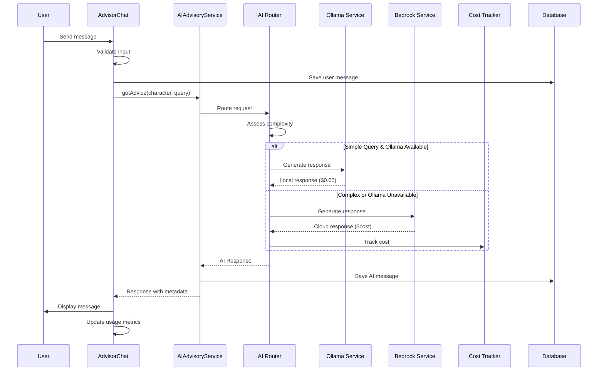
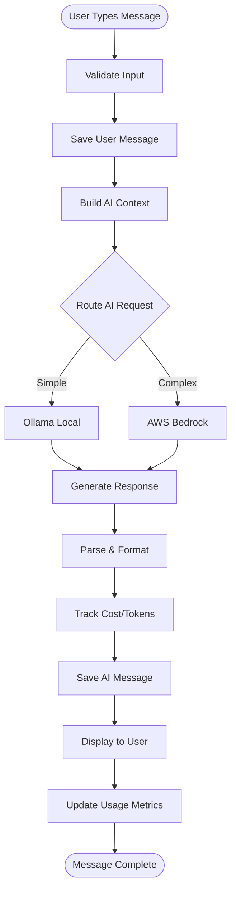
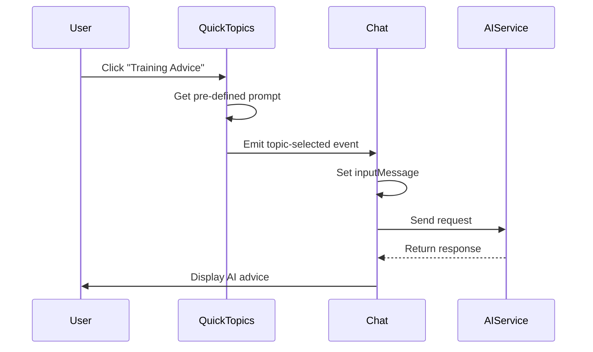
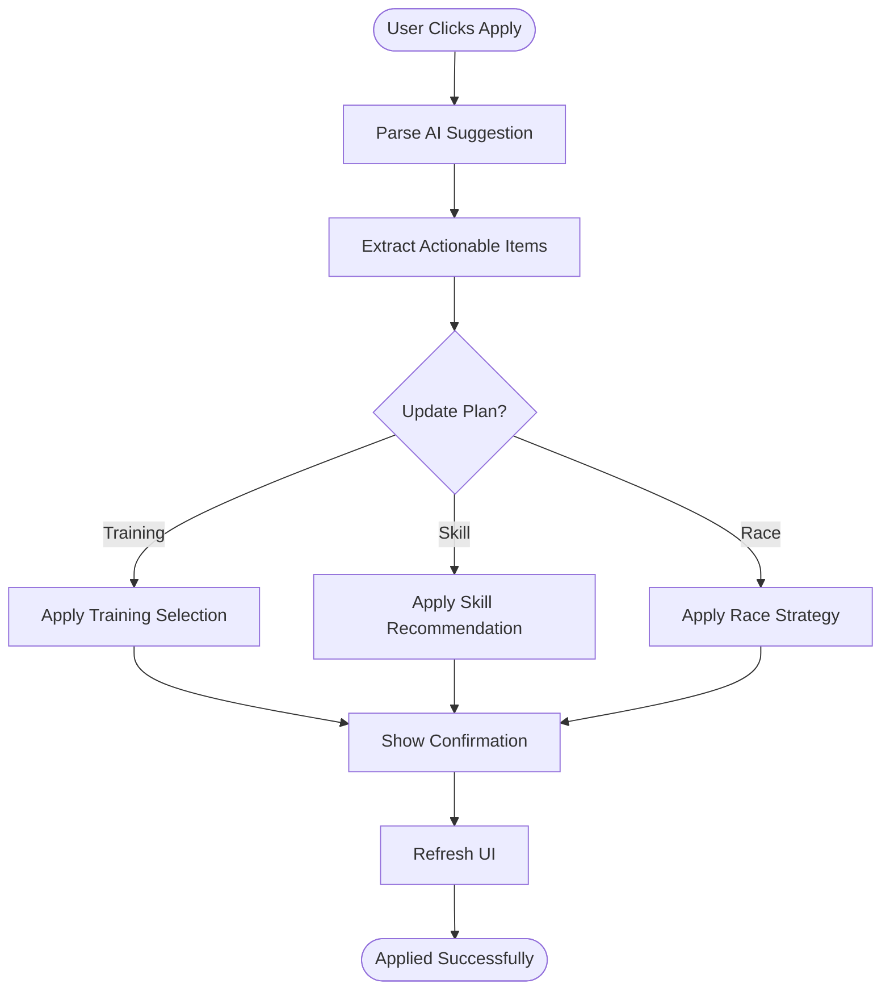

```markdown
# WF-012: AI Advisor Interface

## Umamusume Pretty Derby Career Planner

**Document Version**: 2.0.0  
**Date**: January 24, 2026  
**Related Documents**: [PRD-006], [SPEC-006], [FLOW-006], [SEQ-006]

**Source Specs**:

- `.kiro/specs/umamusume-career-planner-main/requirements.md` (AI Advisory Requirements)
- `.kiro/specs/umamusume-career-planner-main/design.md` (AI Advisor UI)

**Related Artifacts**:

- PRD: [PRD-006](../prds/PRD-006_AI_Advisory.md)
- SPEC: [SPEC-006](../specs/SPEC-006_AI_Advisory_Technical.md)
- Flow: [FLOW-006](../flows/FLOW-006_AI_Advisory_System.md)
- Tech Flow: [TECH-FLOW-006](../tech-flow/TECH-FLOW-006_AI_Advisory_Flow.md)
- Sequences: [SEQ-006](../sequences/SEQ-006_AI_Advice_Generation.md)
- User Flows: [UF-007](../user-flows/UF-007_AI_Advisor_Journey.md)
- MCP Config: [MCP_SERVER_CONFIGURATION_REFERENCE](../MCP_SERVER_CONFIGURATION_REFERENCE.md)
- Related WF: [WF-001](WF-001_Dashboard_Overview.md), [WF-004](WF-004_Training_Selection_Interface.md)

---

## 1. Overview

### 1.1 Purpose

The AI Advisor Interface provides an intelligent conversational interface for training optimization, race strategy, skill recommendations, and career planning. It leverages a hybrid AI architecture combining local Ollama models with AWS Bedrock Claude fallback for optimal performance and cost efficiency.

### 1.2 Key Objectives

| Objective | Description |
|-----------|-------------|
| **Intelligent Recommendations** | Context-aware advice for training, racing, and skill management |
| **Hybrid AI Architecture** | Local-first processing with cloud fallback |
| **Cost Optimization** | Track and manage AI usage costs |
| **Conversation Context** | Maintain context across multiple interactions |
| **MCP Integration** | Leverage Model Context Protocol for enhanced capabilities |

### 1.3 User Stories

| ID | User Story | Priority |
|----|------------|----------|
| US-001 | As a player, I want AI-powered training recommendations based on my current goals | P0 |
| US-002 | As a player, I want race strategy advice for upcoming competitions | P0 |
| US-003 | As a player, I want skill build recommendations optimized for my character | P1 |
| US-004 | As a player, I want to see AI confidence scores and reasoning | P1 |
| US-005 | As a player, I want to track AI usage costs and stay within budget | P1 |

---

## 2. Layout Specifications

### 2.1 Desktop Layout (≥1024px)

```

┌──────────────────────────────────────────────────────────────────────┐
│ AI Advisor                                                      [≡]  │
├──────────────────────────────────────────────────────────────────────┤
│                                                                      │
│ ┌────────────┬───────────────────────────────────────────────────┐  │
│ │ Sidebar    │ Main Content Area                                 │  │
│ │            │                                                   │  │
│ │ Dashboard  │ ┌──────────────────────────────────────────────┐ │  │
│ │ Character  │ │ AI Provider Status                            │ │  │
│ │ Training   │ │ ┌────────────────────────────────────────────┐│ │  │
│ │ Races      │ │ │ Active Provider: Ollama (Local)            ││ │  │
│ │ Skills     │ │ │ Status: ● Online                           ││ │  │
│ │ Support    │ │ │ Fallback: AWS Bedrock Claude 3.5 Sonnet    ││ │  │
│ │ AI Advisor●│ │ │                                            ││ │  │
│ │ Settings   │ │ │ Monthly Usage:                             ││ │  │
│ │            │ │ │ Tokens: 125,430 / 1,000,000                ││ │  │
│ │            │ │ │ Cost: $2.15 / $50.00 budget                ││ │  │
│ │            │ │ │ ████░░░░░░░░░░░░ 12.5%                     ││ │  │
│ │            │ │ └────────────────────────────────────────────┘│ │  │
│ │            │ └──────────────────────────────────────────────┘ │  │
│ │            │                                                   │  │
│ │            │ ┌───────────────────────────────────────────────┐│  │
│ │            │ │ Conversation History                          ││  │
│ │            │ ├───────────────────────────────────────────────┤│  │
│ │            │ │ ┌──────────────────────────────────────────┐ ││  │
│ │            │ │ │ User:                                     │ ││  │
│ │            │ │ │ What training should I do next? My       │ ││  │
│ │            │ │ │ upcoming G1 race is in 15 days and I     │ ││  │
│ │            │ │ │ need to improve my speed.                │ ││  │
│ │            │ │ │                            2 minutes ago  │ ││  │
│ │            │ │ └──────────────────────────────────────────┘ ││  │
│ │            │ │                                               ││  │
│ │            │ │ ┌──────────────────────────────────────────┐ ││  │
│ │            │ │ │ AI Assistant (Ollama - llama3.2):        │ ││  │
│ │            │ │ │                                          │ ││  │
│ │            │ │ │ Based on your current stats and the      │ ││  │
│ │            │ │ │ upcoming G1 race, I recommend focusing   │ ││  │
│ │            │ │ │ on Speed training for the next 3 turns.  │ ││  │
│ │            │ │ │                                          │ ││  │
│ │            │ │ │ **Current Analysis:**                    │ ││  │
│ │            │ │ │ • Speed: 850 (B+) - Needs +150 for A     │ ││  │
│ │            │ │ │ • Stamina: 720 (B) - Adequate for race   │ ││  │
│ │            │ │ │ • Energy: 78% - Good condition           │ ││  │
│ │            │ │ │                                          │ ││  │
│ │            │ │ │ **Recommended Actions:**                 │ ││  │
│ │            │ │ │ 1. Speed Training (Turn 46-48)           │ ││  │
│ │            │ │ │    Expected: +45-50 per turn             │ ││  │
│ │            │ │ │    Risk: Low (12%)                       │ ││  │
│ │            │ │ │                                          │ ││  │
│ │            │ │ │ 2. Consider rest if energy drops below   │ ││  │
│ │            │ │ │    60% to maintain training efficiency   │ ││  │
│ │            │ │ │                                          │ ││  │
│ │            │ │ │ 📊 Confidence: 87%                       │ ││  │
│ │            │ │ │ 🔧 Provider: Ollama Local                │ ││  │
│ │            │ │ │ 💰 Cost: $0.00                           │ ││  │
│ │            │ │ │                                          │ ││  │
│ │            │ │ │ [APPLY SUGGESTION] [ASK FOLLOW-UP]       │ ││  │
│ │            │ │ │ [REGENERATE] [MARK HELPFUL]              │ ││  │
│ │            │ │ │                            1 minute ago   │ ││  │
│ │            │ │ └──────────────────────────────────────────┘ ││  │
│ │            │ └───────────────────────────────────────────────┘│  │
│ │            │                                                   │  │
│ │            │ ┌───────────────────────────────────────────────┐│  │
│ │            │ │ Quick Topics                                  ││  │
│ │            │ │ ┌──────────────────┬──────────────────────┐  ││  │
│ │            │ │ │ [Training Advice]│ [Race Strategy]      │  ││  │
│ │            │ │ ├──────────────────┼──────────────────────┤  ││  │
│ │            │ │ │ [Skill Build]    │ [Career Planning]    │  ││  │
│ │            │ │ └──────────────────┴──────────────────────┘  ││  │
│ │            │ └───────────────────────────────────────────────┘│  │
│ │            │                                                   │  │
│ │            │ ┌───────────────────────────────────────────────┐│  │
│ │            │ │ Message Input                                 ││  │
│ │            │ │ ┌──────────────────────────────────────────┐ ││  │
│ │            │ │ │ Ask AI Advisor...                        │ ││  │
│ │            │ │ │                                          │ ││  │
│ │            │ │ │ Type your question or select a topic     │ ││  │
│ │            │ │ │ above for quick recommendations.         │ ││  │
│ │            │ │ └──────────────────────────────────────────┘ ││  │
│ │            │ │                                               ││  │
│ │            │ │ [📎 Attach Context] [🎤 Voice Input] [Send 📤]││  │
│ │            │ └───────────────────────────────────────────────┘│  │
│ │            │                                                   │  │
│ │            │ ┌───────────────────────────────────────────────┐│  │
│ │            │ │ Context Panel                                 ││  │
│ │            │ ├───────────────────────────────────────────────┤│  │
│ │            │ │ Current Character: Mejiro Ardan               ││  │
│ │            │ │ Turn: 45 | Career Stage: Classic             ││  │
│ │            │ │                                               ││  │
│ │            │ ��� Stats Summary:                                ││  │
│ │            │ │ Speed: 850 | Stamina: 720 | Power: 680        ││  │
│ │            │ │ Guts: 550 | Wit: 620                          ││  │
│ │            │ │                                               ││  │
│ │            │ │ Active Goals:                                 ││  │
│ │            │ │ • Speed ≥ 1000 (15% remaining)                ││  │
│ │            │ │ • Win G1 Race (Upcoming)                      ││  │
│ │            │ │                                               ││  │
│ │            │ │ Upcoming Events:                              ││  │
│ │            │ │ • G1 Kanto Okami Cup (Turn 60)                ││  │
│ │            │ │   Distance: 2400m | Surface: Turf             ││  │
│ │            │ │                                               ││  │
│ │            │ │ [REFRESH CONTEXT]                             ││  │
│ │            │ └───────────────────────────────────────────────┘│  │
│ └────────────┴───────────────────────────────────────────────────┘  │
└──────────────────────────────────────────────────────────────────────┘

```

### 2.2 Tablet Layout (640px-1024px)

```

┌────────────────────────────────────────────────────┐
│ AI Advisor                                   [≡]   │
├────────────────────────────────────────────────────┤
│ ☰ Menu Toggle                                      │
├────────────────────────────────────────────────────┤
│                                                    │
│ ┌──────────────────────────────────────────────┐  │
│ │ Provider: Ollama ● | Cost: $2.15 / $50       │  │
│ │ [Expand Status ▼]                            │  │
│ └──────────────────────────────────────────────┘  │
│                                                    │
│ Tabs: [Chat] [Context] [Settings]                 │
│                                                    │
│ ┌────────────────────���─────────────────────────┐  │
│ │ User:                                         │  │
│ │ What training should I do next?               │  │
│ └──────────────────────────────────────────────┘  │
│                                                    │
│ ┌──────────────────────────────────────────────┐  │
│ │ AI Assistant (Ollama):                        │  │
│ │                                               │  │
│ │ Focus on Speed training for next 3 turns.     │  │
│ │                                               │  │
│ │ **Current Analysis:**                         │  │
│ │ • Speed: 850 (B+) - Needs +150                │  │
│ │ • Stamina: 720 (B) - Adequate                 │  │
│ │                                               │  │
│ │ **Recommendations:**                          │  │
│ │ 1. Speed Training (Turn 46-48)                │  │
│ │    Expected: +45-50 per turn                  │  │
│ │    Risk: Low (12%)                            │  │
│ │                                               │  │
│ │ Confidence: 87% | Cost: $0.00                 │  │
│ │                                               │  │
│ │ [APPLY] [FOLLOW-UP] [REGENERATE]              │  │
│ └──────────────────────────────────────────────┘  │
│                                                    │
│ Quick Topics:                                      │
│ [Training] [Race] [Skills] [Career]                │
│                                                    │
│ ┌──────────────────────────────────────────────┐  │
│ │ Ask AI Advisor...                             │  │
│ │                                               │  │
│ │ [Type message]                                │  │
│ └──────────────────────────────────────────────┘  │
│                                                    │
│ [📎] [🎤] [Send 📤]                                │
└────────────────────────────────────────────────────┘

```

### 2.3 Mobile Layout (<640px)

```

┌──────────────────────────────┐
│ AI Advisor             [≡]  │
├──────────────────────────────┤
│                              │
│ Ollama ● | $2.15 / $50       │
│ [Status ▼]                   │
│                              │
│ ─────────────────────────── │
│                              │
│ ┌──────────────────────────┐ │
│ │ You:                      │ │
│ │ What training next?       │ │
│ └──────────────────────────┘ │
│                              │
│ ┌──────────────────────────┐ │
│ │ AI (Ollama):              │ │
│ │                          │ │
│ │ Focus on Speed training  │ │
│ │ for next 3 turns.        │ │
│ │                          │ │
│ │ Speed: 850 → 1000        │ │
│ │ Expected: +45-50/turn    │ │
│ │ Risk: Low (12%)          │ │
│ │                          │ │
│ │ Confidence: 87%          │ │
│ │ Cost: $0.00              │ │
│ │                          │ │
│ │ [APPLY] [MORE]           │ │
│ └──────────────────────────┘ │
│                              │
│ Topics:                      │
│ [Train] [Race] [Skills]      │
│                              │
│ ┌──────────────────────────┐ │
│ │ Ask...                    │ │
│ │ [Type message]            │ │
│ └──────────────────────────┘ │
│                              │
│ [📎] [Send 📤]                │
└──────────────────────────────┘
│  Bottom Navigation Bar       │
│ [🏠][👤][⚡][🏆][🤖][⚙️]   │
└──────────────────────────────┘

```

---

## 3. Component Specifications

### 3.1 AI Provider Status Widget

**Component**: `app/Livewire/AI/ProviderStatus.php`

```php
class ProviderStatus extends Component
{
    public $activeProvider;
    public $providerStatus;
    public $monthlyUsage;
    public $costBudget;
    
    public function mount()
    {
        $this->loadProviderStatus();
        $this->loadUsageMetrics();
    }
    
    protected $listeners = ['ai-response-received' => 'loadUsageMetrics'];
    
    private function loadProviderStatus()
    {
        $ollamaService = app(OllamaService::class);
        $this->activeProvider = config('ai.default_provider');
        $this->providerStatus = $ollamaService->isAvailable() ? 'online' : 'offline';
    }
    
    private function loadUsageMetrics()
    {
        $tracker = app(AICostTracker::class);
        $this->monthlyUsage = $tracker->getMonthlyUsage();
        $this->costBudget = config('ai.monthly_budget', 50.00);
    }
    
    public function render()
    {
        return view('livewire.ai.provider-status');
    }
}
```

**Visual Format**:

```
┌────────────────────────────────────────┐
│ AI Provider Status                     │
├────────────────────────────────────────┤
│ Active Provider: Ollama (Local)        │
│ Status: ● Online                       │
│ Fallback: AWS Bedrock Claude 3.5 Sonnet│
│                                        │
│ Monthly Usage:                         │
│ Tokens: 125,430 / 1,000,000            │
│ Cost: $2.15 / $50.00 budget            │
│ ████░░░░░░░░░░░░ 12.5%                 │
└────────────────────────────────────────┘
```

### 3.2 Conversation Message Component

**Component**: `resources/views/components/ai-message.blade.php`

```blade
<div class="ai-message {{ $message->sender === 'user' ? 'user-message' : 'ai-message' }}" 
     data-testid="ai-message-{{ $message->id }}">
    
    @if($message->sender === 'user')
        <div class="message-header">
            <span class="sender-label">You:</span>
            <span class="timestamp">{{ $message->created_at->diffForHumans() }}</span>
        </div>
        
        <div class="message-content">
            {{ $message->content }}
        </div>
    @else
        <div class="message-header">
            <span class="sender-label">AI Assistant ({{ $message->provider }})</span>
            <span class="model-badge">{{ $message->model }}</span>
            <span class="timestamp">{{ $message->created_at->diffForHumans() }}</span>
        </div>
        
        <div class="message-content">
            {!! Str::markdown($message->content) !!}
        </div>
        
        <div class="message-metadata">
            <div class="metadata-row">
                <span class="confidence-score" title="AI Confidence">
                    📊 Confidence: {{ $message->confidence }}%
                </span>
                <span class="provider-badge" title="AI Provider">
                    🔧 Provider: {{ ucfirst($message->provider) }}
                </span>
                <span class="cost-display" title="Request Cost">
                    💰 Cost: ${{ number_format($message->cost_usd, 4) }}
                </span>
            </div>
        </div>
        
        <div class="message-actions">
            <button wire:click="applySuggestion({{ $message->id }})" class="btn btn-primary btn-sm">
                Apply Suggestion
            </button>
            <button wire:click="askFollowUp({{ $message->id }})" class="btn btn-secondary btn-sm">
                Ask Follow-up
            </button>
            <button wire:click="regenerate({{ $message->id }})" class="btn btn-secondary btn-sm">
                Regenerate
            </button>
            <button wire:click="markHelpful({{ $message->id }})" class="btn btn-icon btn-sm">
                👍 Helpful
            </button>
        </div>
    @endif
</div>
```

### 3.3 Quick Topics Panel

**Component**: `app/Livewire/AI/QuickTopics.php`

```php
class QuickTopics extends Component
{
    public array $topics = [
        'training' => 'Training Advice',
        'race' => 'Race Strategy',
        'skills' => 'Skill Build',
        'career' => 'Career Planning',
    ];
    
    public function selectTopic(string $topic)
    {
        $prompts = [
            'training' => 'What training should I focus on for my current goals?',
            'race' => 'How should I prepare for my upcoming race?',
            'skills' => 'Which skills should I prioritize acquiring?',
            'career' => 'What is the best strategy for my overall career progression?',
        ];
        
        $this->dispatch('topic-selected', [
            'topic' => $topic,
            'prompt' => $prompts[$topic] ?? '',
        ]);
    }
    
    public function render()
    {
        return view('livewire.ai.quick-topics');
    }
}
```

### 3.4 AI Chat Interface

**Component**: `app/Livewire/AI/AdvisorChat.php`

```php
class AdvisorChat extends Component
{
    public $characterId;
    public $messages = [];
    public $inputMessage = '';
    public $isProcessing = false;
    public $contextData = [];
    
    protected $listeners = [
        'topic-selected' => 'sendTopicMessage',
        'ai-response-received' => 'addAIResponse',
    ];
    
    public function mount($characterId)
    {
        $this->characterId = $characterId;
        $this->loadConversationHistory();
        $this->loadContextData();
    }
    
    public function sendMessage()
    {
        $this->validate([
            'inputMessage' => 'required|string|max:2000',
        ]);
        
        $this->isProcessing = true;
        
        // Add user message
        $userMessage = AIConversation::create([
            'character_id' => $this->characterId,
            'user_id' => auth()->id(),
            'sender' => 'user',
            'content' => $this->inputMessage,
        ]);
        
        $this->messages[] = $userMessage;
        $this->inputMessage = '';
        
        // Get AI response
        $aiService = app(AIAdvisoryService::class);
        $character = Character::findOrFail($this->characterId);
        
        try {
            $response = $aiService->getAdvice($character, 'general', $userMessage->content);
            
            $aiMessage = AIConversation::create([
                'character_id' => $this->characterId,
                'user_id' => auth()->id(),
                'sender' => 'assistant',
                'content' => $response->content,
                'provider' => $response->provider,
                'model' => $response->model,
                'confidence' => $response->confidence,
                'cost_usd' => $response->cost,
                'token_count' => $response->tokenCount,
            ]);
            
            $this->messages[] = $aiMessage;
            
            $this->dispatch('ai-response-received', [
                'messageId' => $aiMessage->id,
                'provider' => $response->provider,
            ]);
            
        } catch (\Exception $e) {
            $this->addError('ai_error', 'Failed to get AI response. Please try again.');
        } finally {
            $this->isProcessing = false;
        }
    }
    
    public function sendTopicMessage($data)
    {
        $this->inputMessage = $data['prompt'];
        $this->sendMessage();
    }
    
    public function applySuggestion($messageId)
    {
        $message = AIConversation::findOrFail($messageId);
        
        // Parse and apply AI suggestions
        $this->dispatch('apply-ai-suggestion', [
            'content' => $message->content,
        ]);
        
        session()->flash('success', 'AI suggestion applied to your plan.');
    }
    
    public function regenerate($messageId)
    {
        $message = AIConversation::findOrFail($messageId);
        $previousUserMessage = AIConversation::where('character_id', $this->characterId)
            ->where('sender', 'user')
            ->where('id', '<', $messageId)
            ->orderBy('id', 'desc')
            ->first();
        
        if ($previousUserMessage) {
            $this->inputMessage = $previousUserMessage->content;
            $this->sendMessage();
        }
    }
    
    private function loadConversationHistory()
    {
        $this->messages = AIConversation::where('character_id', $this->characterId)
            ->orderBy('created_at', 'asc')
            ->limit(20)
            ->get()
            ->toArray();
    }
    
    private function loadContextData()
    {
        $character = Character::with(['careers', 'skills'])->findOrFail($this->characterId);
        
        $this->contextData = [
            'character_name' => $character->name,
            'current_turn' => $character->current_turn,
            'career_stage' => $character->career_stage,
            'stats' => [
                'speed' => $character->speed,
                'stamina' => $character->stamina,
                'power' => $character->power,
                'guts' => $character->guts,
                'wit' => $character->wit,
            ],
            'goals' => $character->goals ?? [],
            'upcoming_races' => $this->getUpcomingRaces($character),
        ];
    }
    
    public function render()
    {
        return view('livewire.ai.advisor-chat');
    }
}
```

### 3.5 Context Panel

**Component**: `app/Livewire/AI/ContextPanel.php`

```blade
<div class="context-panel" data-testid="ai-context-panel">
    <h3>Context Panel</h3>
    
    <div class="context-section">
        <h4>Current Character</h4>
        <div class="context-row">
            <span class="label">Name:</span>
            <span class="value">{{ $contextData['character_name'] }}</span>
        </div>
        <div class="context-row">
            <span class="label">Turn:</span>
            <span class="value">{{ $contextData['current_turn'] }} | {{ ucfirst($contextData['career_stage']) }}</span>
        </div>
    </div>
    
    <div class="context-section">
        <h4>Stats Summary</h4>
        <div class="stats-grid">
            @foreach($contextData['stats'] as $stat => $value)
                <div class="stat-item">
                    <span class="stat-name">{{ ucfirst($stat) }}:</span>
                    <span class="stat-value">{{ $value }}</span>
                </div>
            @endforeach
        </div>
    </div>
    
    <div class="context-section">
        <h4>Active Goals</h4>
        <ul class="goals-list">
            @forelse($contextData['goals'] as $goal)
                <li>
                    <span class="goal-icon">🎯</span>
                    {{ $goal['description'] }}
                    <span class="goal-progress">({{ $goal['progress'] }}% remaining)</span>
                </li>
            @empty
                <li class="no-goals">No active goals</li>
            @endforelse
        </ul>
    </div>
    
    <div class="context-section">
        <h4>Upcoming Events</h4>
        <ul class="events-list">
            @forelse($contextData['upcoming_races'] as $race)
                <li>
                    <span class="race-grade">{{ $race['grade'] }}</span>
                    {{ $race['name'] }}
                    <span class="race-details">(Turn {{ $race['turn'] }})</span>
                    <div class="race-info">
                        Distance: {{ $race['distance'] }}m | Surface: {{ $race['surface'] }}
                    </div>
                </li>
            @empty
                <li class="no-races">No upcoming races</li>
            @endforelse
        </ul>
    </div>
    
    <button wire:click="refreshContext" class="btn btn-secondary">
        Refresh Context
    </button>
</div>
```

### 3.6 Cost Tracking Display

**Service**: `app/Services/AI/AICostTracker.php`

```php
class AICostTracker
{
    public function track(AIResponse $response): void
    {
        DB::table('ai_cost_tracking')->insert([
            'user_id' => auth()->id(),
            'provider' => $response->provider,
            'model' => $response->model,
            'input_tokens' => $response->inputTokens,
            'output_tokens' => $response->outputTokens,
            'cost_usd' => $response->cost,
            'created_at' => now(),
        ]);
        
        $this->checkBudgetThreshold();
    }
    
    public function getMonthlyUsage(): array
    {
        $startOfMonth = now()->startOfMonth();
        
        return [
            'total_tokens' => DB::table('ai_cost_tracking')
                ->where('user_id', auth()->id())
                ->where('created_at', '>=', $startOfMonth)
                ->sum(DB::raw('input_tokens + output_tokens')),
            'total_cost' => DB::table('ai_cost_tracking')
                ->where('user_id', auth()->id())
                ->where('created_at', '>=', $startOfMonth)
                ->sum('cost_usd'),
            'requests_count' => DB::table('ai_cost_tracking')
                ->where('user_id', auth()->id())
                ->where('created_at', '>=', $startOfMonth)
                ->count(),
        ];
    }
    
    private function checkBudgetThreshold(): void
    {
        $usage = $this->getMonthlyUsage();
        $budget = config('ai.monthly_budget', 50.00);
        $threshold = config('ai.budget_warning_threshold', 0.8);
        
        if ($usage['total_cost'] >= $budget * $threshold) {
            event(new AIBudgetThresholdReached(auth()->user(), $usage, $budget));
        }
    }
}
```

**Cost Calculation**:

| Provider | Model | Input Cost | Output Cost |
|----------|-------|------------|-------------|
| Ollama | llama3.2 | $0.00 | $0.00 |
| Bedrock | Claude 3.5 Haiku | $0.25/1M | $1.25/1M |
| Bedrock | Claude 3.5 Sonnet | $3.00/1M | $15.00/1M |
| Bedrock | Claude 4.5 | $5.00/1M | $25.00/1M |

---

## 4. State Management

### 4.1 Livewire Component State

**Main Component**: `app/Livewire/AI/AdvisorChat.php`

```php
class AdvisorChat extends Component
{
    public $characterId;
    public $messages = [];
    public $inputMessage = '';
    public $isProcessing = false;
    public $contextData = [];
    public $activeProvider = 'ollama';
    
    protected $listeners = [
        'topic-selected' => 'sendTopicMessage',
        'ai-response-received' => 'handleAIResponse',
        'context-updated' => 'loadContextData',
    ];
    
    protected $rules = [
        'inputMessage' => 'required|string|max:2000',
    ];
    
    public function updatedInputMessage()
    {
        $this->validateOnly('inputMessage');
    }
}
```

### 4.2 Data Flow



### 4.3 Cache Strategy

| Data Type | Cache Key | TTL | Invalidation |
|-----------|-----------|-----|--------------|
| Conversation history | `ai:chat:{character_id}:history` | 10 minutes | On new message |
| Context data | `ai:chat:{character_id}:context` | 5 minutes | On character update |
| Provider status | `ai:provider:status` | 1 minute | On provider check |
| Monthly usage | `ai:usage:{user_id}:{month}` | 5 minutes | On new request |

---

## 5. Interaction Patterns

### 5.1 Message Flow



### 5.2 Topic Selection Flow



### 5.3 Apply Suggestion Flow



---

## 6. Accessibility Specifications

### 6.1 WCAG 2.2 AA Compliance

| Criterion | Implementation | Test Method |
|-----------|----------------|-------------|
| **1.1.1 Non-text Content** | All icons have `aria-label` attributes | Screen reader testing |
| **1.4.3 Contrast Ratio** | 4.5:1 minimum for text | Color contrast analyzer |
| **2.1.1 Keyboard** | All interactive elements keyboard accessible | Keyboard-only testing |
| **2.4.3 Focus Order** | Logical tab order through messages | Tab key traversal |
| **2.4.7 Focus Visible** | Clear focus indicators on inputs | Visual inspection |
| **3.2.4 Consistent Identification** | Consistent message formatting | Manual review |
| **4.1.2 Name, Role, Value** | Proper ARIA attributes on controls | axe-core scan |

### 6.2 Keyboard Navigation

| Action | Shortcut | Context |
|--------|----------|---------|
| Focus message input | `Alt+/` | AI Advisor |
| Send message | `Ctrl+Enter` | Message input focused |
| Apply suggestion | `Alt+A` | AI message focused |
| Ask follow-up | `Alt+F` | AI message focused |
| Regenerate response | `Alt+R` | AI message focused |
| Select topic | `1-4` | Quick topics focused |
| Clear conversation | `Ctrl+Shift+C` | AI Advisor |

### 6.3 Screen Reader Announcements

```html
<!-- New message announcement -->
<div aria-live="polite" aria-atomic="true" class="sr-only">
    New AI response received. Confidence: 87%. Provider: Ollama Local.
</div>

<!-- Processing announcement -->
<div aria-live="assertive" aria-atomic="true" class="sr-only">
    Processing your request. Please wait.
</div>

<!-- Suggestion applied announcement -->
<div aria-live="assertive" aria-atomic="true" class="sr-only">
    AI suggestion applied to your training plan.
</div>

<!-- Budget warning announcement -->
<div aria-live="assertive" aria-atomic="true" class="sr-only">
    Warning: AI usage has reached 80% of monthly budget.
</div>
```

---

## 7. Performance Specifications

### 7.1 Performance Targets

| Metric | Target | Measurement |
|--------|--------|-------------|
| **Page Load** | < 1.5 seconds | Time to first render |
| **Message Send** | < 300ms | Click to UI update |
| **AI Response (Ollama)** | < 2 seconds | Local processing |
| **AI Response (Bedrock)** | < 5 seconds | Cloud processing |
| **Context Refresh** | < 500ms | Data reload |

### 7.2 Optimization Strategies

| Strategy | Implementation | Impact |
|----------|----------------|--------|
| **Message Streaming** | Stream AI responses for perceived speed | +40% perceived performance |
| **Context Caching** | Cache character context (5min TTL) | -60% data fetching |
| **Lazy Loading** | Load older messages on scroll | Handles 1000+ messages |
| **Debounced Input** | 300ms debounce on typing indicators | Reduced re-renders |
| **Optimistic UI** | Show user message immediately | Instant feedback |

### 7.3 Bundle Size Budget

| Asset Type | Budget | Current | Status |
|------------|--------|---------|--------|
| JavaScript | 40 KB | 36 KB | ✅ Within budget |
| CSS | 15 KB | 13 KB | ✅ Within budget |
| Total | 55 KB | 49 KB | ✅ Within budget |

---

## 8. Testing Specifications

### 8.1 Unit Tests

**Test File**: `tests/Unit/Services/AIAdvisoryServiceTest.php`

```php
test('routes simple queries to Ollama', function () {
    $character = Character::factory()->create();
    $service = app(AIAdvisoryService::class);
    
    $response = $service->getAdvice($character, 'training', 'What should I train?');
    
    expect($response->provider)->toBe('ollama')
        ->and($response->cost)->toBe(0.00);
});

test('falls back to Bedrock when Ollama unavailable', function () {
    Config::set('ai.providers.ollama.enabled', false);
    
    $character = Character::factory()->create();
    $service = app(AIAdvisoryService::class);
    
    $response = $service->getAdvice($character, 'training', 'Complex strategy analysis');
    
    expect($response->provider)->toBe('bedrock')
        ->and($response->cost)->toBeGreaterThan(0.00);
});

test('tracks AI costs correctly', function () {
    $tracker = app(AICostTracker::class);
    
    $response = new AIResponse(
        provider: 'bedrock',
        model: 'claude-3.5-sonnet',
        inputTokens: 1000,
        outputTokens: 2000,
    );
    
    $tracker->track($response);
    
    $usage = $tracker->getMonthlyUsage();
    
    expect($usage['total_tokens'])->toBe(3000)
        ->and($usage['total_cost'])->toBeGreaterThan(0);
});
```

### 8.2 Feature Tests

**Test File**: `tests/Feature/AIAdvisorTest.php`

```php
test('user can send message to AI advisor', function () {
    $user = User::factory()->create();
    $character = Character::factory()->for($user)->create();
    
    Livewire::actingAs($user)
        ->test(AdvisorChat::class, ['characterId' => $character->id])
        ->set('inputMessage', 'What training should I do?')
        ->call('sendMessage')
        ->assertDispatched('ai-response-received')
        ->assertSee('AI Assistant');
});

test('user can apply AI suggestion', function () {
    $user = User::factory()->create();
    $character = Character::factory()->for($user)->create();
    $message = AIConversation::factory()->create([
        'character_id' => $character->id,
        'sender' => 'assistant',
        'content' => 'Focus on Speed training',
    ]);
    
    Livewire::actingAs($user)
        ->test(AdvisorChat::class, ['characterId' => $character->id])
        ->call('applySuggestion', $message->id)
        ->assertDispatched('apply-ai-suggestion')
        ->assertSessionHas('success');
});

test('user can select quick topic', function () {
    $user = User::factory()->create();
    $character = Character::factory()->for($user)->create();
    
    Livewire::actingAs($user)
        ->test(QuickTopics::class)
        ->call('selectTopic', 'training')
        ->assertDispatched('topic-selected');
});
```

### 8.3 E2E Tests (Playwright)

**Test File**: `tests/e2e/ai-advisor.spec.js`

```javascript
test.describe('WF-012: AI Advisor Interface', () => {
    test('displays AI advisor interface', async ({ page }) => {
        await page.goto('/ai-advisor');
        
        // Check provider status
        await expect(page.getByTestId('provider-status')).toBeVisible();
        await expect(page.getByText(/Ollama/)).toBeVisible();
        
        // Check message input
        await expect(page.getByPlaceholder('Ask AI Advisor...')).toBeVisible();
    });
    
    test('sends message and receives AI response', async ({ page }) => {
        await page.goto('/ai-advisor');
        
        // Type message
        const input = page.getByPlaceholder('Ask AI Advisor...');
        await input.fill('What training should I do?');
        
        // Send message
        await page.getByRole('button', { name: 'Send' }).click();
        
        // Wait for response
        await expect(page.getByText(/AI Assistant/)).toBeVisible({ timeout: 10000 });
        await expect(page.getByText(/Confidence:/)).toBeVisible();
    });
    
    test('applies AI suggestion', async ({ page }) => {
        await page.goto('/ai-advisor');
        
        // Find AI message with suggestion
        const message = page.locator('.ai-message').first();
        await message.getByRole('button', { name: 'Apply Suggestion' }).click();
        
        // Verify success message
        await expect(page.getByRole('alert')).toContainText('applied');
    });
    
    test('selects quick topic', async ({ page }) => {
        await page.goto('/ai-advisor');
        
        // Click quick topic
        await page.getByRole('button', { name: 'Training Advice' }).click();
        
        // Verify message sent
        await expect(page.getByText(/What training should I focus on/)).toBeVisible();
    });
    
    test('displays cost tracking', async ({ page }) => {
        await page.goto('/ai-advisor');
        
        // Check cost display
        await expect(page.getByText(/Cost:/)).toBeVisible();
        await expect(page.getByText(/Monthly Usage:/)).toBeVisible();
    });
});
```

### 8.4 Accessibility Tests

**Test File**: `tests/e2e/accessibility/ai-advisor.spec.js`

```javascript
import { test, expect } from '@playwright/test';
import AxeBuilder from '@axe-core/playwright';

test.describe('WF-012: Accessibility', () => {
    test('has no automatically detectable accessibility issues', async ({ page }) => {
        await page.goto('/ai-advisor');
        
        const accessibilityScanResults = await new AxeBuilder({ page })
            .withTags(['wcag2a', 'wcag2aa', 'wcag21a', 'wcag21aa'])
            .analyze();
        
        expect(accessibilityScanResults.violations).toEqual([]);
    });
    
    test('announces AI responses to screen readers', async ({ page }) => {
        await page.goto('/ai-advisor');
        
        const liveRegion = page.locator('[aria-live="polite"]');
        
        // Send message
        await page.getByPlaceholder('Ask AI Advisor...').fill('Test message');
        await page.getByRole('button', { name: 'Send' }).click();
        
        // Wait for announcement
        await expect(liveRegion).toContainText(/New AI response received/);
    });
    
    test('supports keyboard-only workflow', async ({ page }) => {
        await page.goto('/ai-advisor');
        
        // Navigate using keyboard
        await page.keyboard.press('Tab'); // Focus input
        await page.keyboard.type('What should I do?');
        await page.keyboard.press('Control+Enter'); // Send
        
        // Wait for response
        await expect(page.getByText(/AI Assistant/)).toBeVisible({ timeout: 10000 });
        
        // Navigate to action buttons
        await page.keyboard.press('Tab');
        await page.keyboard.press('Enter'); // Apply suggestion
        
        await expect(page.getByRole('alert')).toBeVisible();
    });
    
    test('messages have proper ARIA attributes', async ({ page }) => {
        await page.goto('/ai-advisor');
        
        const message = page.locator('.ai-message').first();
        
        await expect(message).toHaveAttribute('data-testid');
    });
});
```

---

## 9. Related Documentation

### 9.1 Product Requirements

- [PRD-006: AI Advisory](../prds/PRD-006_AI_Advisory.md)

### 9.2 Technical Specifications

- [SPEC-006: AI Advisory Technical](../specs/SPEC-006_AI_Advisory_Technical.md)

### 9.3 Flow Documentation

- [FLOW-006: AI Advisory System](../flows/FLOW-006_AI_Advisory_System.md)
- [TECH-FLOW-006: AI Advisory Flow](../tech-flow/TECH-FLOW-006_AI_Advisory_Flow.md)

### 9.4 Sequence Diagrams

- [SEQ-006: AI Advice Generation](../sequences/SEQ-006_AI_Advice_Generation.md)

### 9.5 User Flows

- [UF-007: AI Advisor Journey](../user-flows/UF-007_AI_Advisor_Journey.md)

### 9.6 Related Wireframes

- [WF-001: Dashboard Overview](WF-001_Dashboard_Overview.md)
- [WF-004: Training Selection Interface](WF-004_Training_Selection_Interface.md)

### 9.7 Configuration Documentation

- [MCP Server Configuration Reference](../MCP_SERVER_CONFIGURATION_REFERENCE.md)
- [Software Integration Specifications](../008_SIS_Software_Integration_Specifications.md)

---

## 10. Version History

| Version | Date | Author | Changes |
|---------|------|--------|---------|
| 2.0.0 | 2026-01-24 | Development Team | Comprehensive update aligned with v2.0.0 implementation; added hybrid AI architecture, MCP integration, cost tracking, conversation management, accessibility specifications, and testing requirements |
| 1.0.0 | 2026-01-14 | Development Team | Initial wireframe specification |

---

## 11. Notes

**Implementation Status**: ✅ Complete

**Known Issues**: None

**Future Enhancements**:

- Voice input for message composition
- Multi-language support for AI responses
- Advanced context management with MCP memory server
- AI suggestion history and analytics
- Team collaboration on AI recommendations
- Custom AI agent training for personalized advice
- Export AI conversation as documentation

---

*This wireframe specification reflects the current implementation of the AI Advisor Interface and serves as the authoritative reference for UI/UX development and testing.*

```
