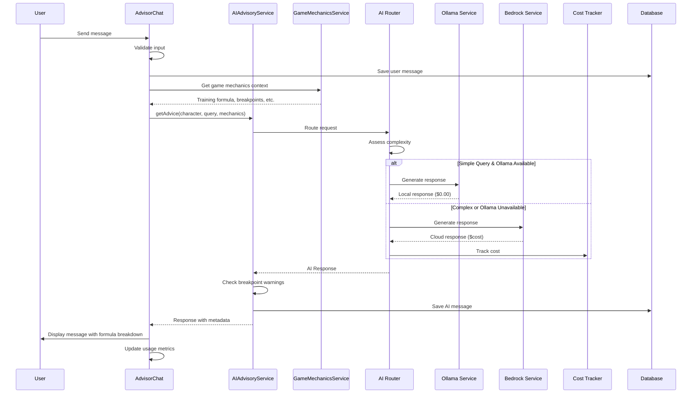
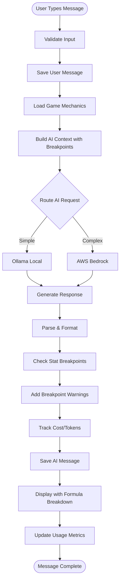
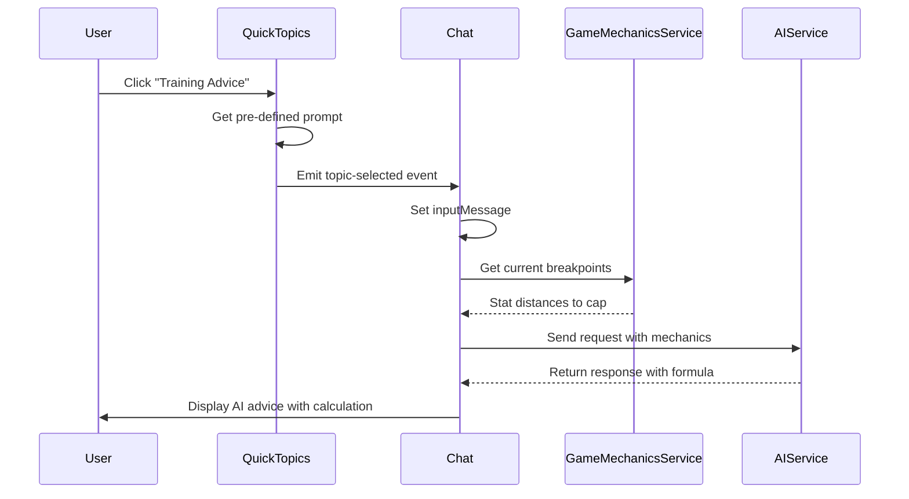
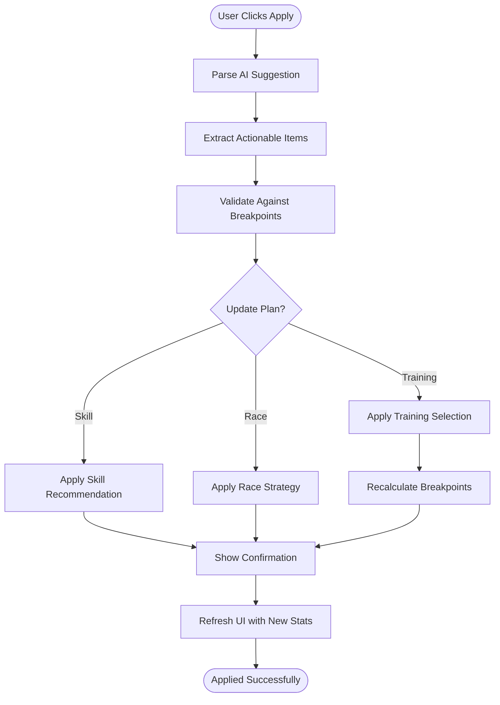

# WF-012: AI Advisor Interface

## Umamusume Pretty Derby Career Planner

**Document Version**: 2.2.0  
**Date**: January 28, 2026  
**Related Documents**: [PRD-006], [SPEC-006], [FLOW-006], [SEQ-006]

**Source Specs**:

- `.kiro/specs/umamusume-career-planner-main/requirements.md` (AI Advisory Requirements)
- `.kiro/specs/umamusume-career-planner-main/design.md` (AI Advisor UI)

**Related Artifacts**:

- PRD: [PRD-006](../prds/PRD-006_AI_Advisory.md)
- SPEC: [SPEC-006](../specs/SPEC-006_AI_Advisory_Technical.md)
- Flow: [FLOW-006](../flows/FLOW-006_AI_Advisory_System.md)
- Tech Flow: [TECH-FLOW-006](../tech-flow/TECH-FLOW-006_AI_Advisory_Flow.md)
- Sequences: [SEQ-006](../sequences/SEQ-006_AI_Advice_Generation.md)
- User Flows: [UF-007](../user-flows/UF-007_AI_Advisor_Journey.md)
- MCP Config: [MCP_SERVER_CONFIGURATION_REFERENCE](../MCP_SERVER_CONFIGURATION_REFERENCE.md)
- Related WF: [WF-001](WF-001_Dashboard_Overview.md), [WF-004](WF-004_Training_Selection_Interface.md)

---

## 1. Overview

### 1.1 Purpose

The AI Advisor Interface provides an intelligent conversational interface for training optimization, race strategy, skill recommendations, and career planning. It leverages a hybrid AI architecture combining local Ollama models with AWS Bedrock Claude fallback for optimal performance and cost efficiency.

**The AI Advisor is built on verified game mechanics from Umamusume Pretty Derby (Global English Server, January 2026)** to provide accurate, actionable advice based on the actual training formula and game systems.

### 1.2 Key Objectives

| Objective | Description |
| --- | --- |
| **Intelligent Recommendations** | Context-aware advice for training, racing, and skill management |
| **Hybrid AI Architecture** | Local-first processing with cloud fallback |
| **Cost Optimization** | Track and manage AI usage costs |
| **Conversation Context** | Maintain context across multiple interactions |
| **MCP Integration** | Leverage Model Context Protocol for enhanced capabilities |
| **Game-Accurate Mechanics** | Advice based on verified training formulas and breakpoints |

### 1.3 User Stories

| ID | User Story | Priority |
| --- | --- | --- |
| US-001 | As a player, I want AI-powered training recommendations based on my current goals | P0 |
| US-002 | As a player, I want race strategy advice for upcoming competitions | P0 |
| US-003 | As a player, I want skill build recommendations optimized for my character | P1 |
| US-004 | As a player, I want to see AI confidence scores and reasoning | P1 |
| US-005 | As a player, I want to track AI usage costs and stay within budget | P1 |
| US-006 | As a player, I want advice that accounts for stat soft caps and breakpoints | P1 |

---

## 2. Game Mechanics Reference (AI Knowledge Base)

### 2.1 Training Formula (Verified Jan 2026 - Global English Server)

The AI Advisor uses the following verified training formula for stat gain predictions:

```
Stat Gain = (Base + StatBonus) × (1 + GrowthRate) × (1 + MoodMultiplier × (1 + MoodEffect)) 
            × (1 + TrainingEffect) × (1 + 0.05 × NumSupportCards) × FriendshipMultiplier
```

**Formula Components**:

| Component | Description | Values |
| --- | --- | --- |
| **Base** | Base stat gain from facility | Varies by facility level |
| **StatBonus** | Bonus from support cards | Sum of card bonuses |
| **GrowthRate** | Character-specific multiplier | 0-30% typical range |
| **MoodMultiplier** | Mood effect base | 0.2 (20% per mood level) |
| **MoodEffect** | Current mood modifier | -2 to +2 (Very Bad to Very Good) |
| **TrainingEffect** | Training level bonus | 0-100% based on facility |
| **NumSupportCards** | Cards at facility | 0-6 cards |
| **FriendshipMultiplier** | Bond level bonus | 1.0-1.2× (at 80%+ bond) |

### 2.2 Stat Breakpoints

The AI Advisor tracks and advises based on critical stat breakpoints:

| Breakpoint | Significance | AI Advice Trigger |
| --- | --- | --- |
| **400** | C Grade threshold | "Consider boosting for B grade" |
| **600** | B Grade threshold | "On track for competitive stats" |
| **800** | A Grade threshold (lower) | "Approaching A grade territory" |
| **901** | A Grade threshold (exact) | "A grade achieved - optimize further" |
| **1000** | S Grade threshold | "Excellent progress toward S grade" |
| **1200** | **Soft Cap** - 50% gains above | "⚠️ Soft cap reached - diminishing returns" |
| **1400** | SS Grade threshold | "Elite stat level achieved" |
| **1600** | Practical maximum | "Near maximum - redirect training" |

### 2.3 Facility Levels & Multipliers

| Level | Multiplier | Unlock Condition |
| --- | --- | --- |
| 1 | 1.00× | Default |
| 2 | 1.25× | Training count threshold |
| 3 | 1.50× | Training count threshold |
| 4 | 1.75× | Training count threshold |
| 5 | 2.00× | Training count threshold / Summer Camp |

**Summer Training Camp**: All facilities automatically at Level 5 for 4 turns (Early July).

### 2.4 Career Structure (~70-78 Turns)

| Year | Phase | Turns | Key Events |
| --- | --- | --- | --- |
| **Year 1** | Junior | ~24 | Foundation building, debut races |
| **Year 2** | Classic | ~24 | Major races, stat development |
| **Year 3** | Senior | ~24-30 | Final optimization, championship |

**Critical Periods**:

- **Summer Camp (Year 1-3)**: 4 turns each, Level 5 facilities
- **Pre-Race Windows**: 3-5 turns before mandatory races
- **Final Stretch**: Last 10 turns for stat optimization

### 2.5 Bond/Friendship System

| Bond Level | Effect | AI Recommendation |
| --- | --- | --- |
| 0-39% | No bonus | "Build bond with support cards" |
| 40-59% | Minor hints | "Continue bond building" |
| 60-79% | Skill hints available | "Approaching friendship threshold" |
| **80%+** | **Friendship Training unlocked** | "✓ Friendship Training available!" |
| 100% | Maximum bond | "Bond maxed - prioritize other cards" |

---

## 3. Layout Specifications

### 3.1 Desktop Layout (≥1024px)

```
┌──────────────────────────────────────────────────────────────────────────────┐
│ [≡] Menu | AI Advisor - Tazuna-san                              [?] Help     │
├──────────────────────────────────────────────────────────────────────────────┤
│ ┌────────────────────────────────────────────────────────┐ ┌───────────────┐ │
│ │                                                        │ │ CONTEXT DATA  │ │
│ │     [ CHARACTER PORTRAIT - TAZUNA / AI ]               │ │               │ │
│ │                                                        │ │ Turn: 45/78   │ │
│ │                                                        │ │ Phase: Classic│ │
│ │                                                        │ │               │ │
│ │                                                        │ │ ┌───────────┐ │ │
│ │                                                        │ │ │STAT STATUS│ │ │
│ │                                                        │ │ │Spd: 850 A │ │ │
│ │                                                        │ │ │Sta: 720 B │ │ │
│ │                                                        │ │ │Pow: 680 B │ │ │
│ │                                                        │ │ │Gut: 450 C │ │ │
│ │                                                        │ │ │Wit: 520 B │ │ │
│ │                                                        │ │ └───────────┘ │ │
│ │                                                        │ │               │ │
│ │                                                        │ │ Next Race:    │ │
│ │                                                        │ │ G1 Derby (T50)│ │
│ │                                                        │ │ 2400m Turf    │ │
│ │                                                        │ │               │ │
│ │                                                        │ │ ⚠️ Breakpoints│ │
│ │                                                        │ │ Spd: 51 to cap│ │
│ │                                                        │ └───────────────┘ │
│ └────────────────────────────────────────────────────────┘                   │
│                                                                              │
│ ┌──────────────────────────────────────────────────────────────────────────┐ │
│ │ [ 🤖 AI Advisor ] (Ollama - Online)                    Cost: $0.00       │ │
│ ├──────────────────────────────────────────────────────────────────────────┤ │
│ │ "Based on your current Speed (850) and the G1 Derby in 5 turns:          │ │
│ │                                                                          │ │
│ │ 📊 **Training Recommendation**: Speed Training                           │ │
│ │ • Expected gain: +18-22 (with 3 support cards)                           │ │
│ │ • Formula: (12 + 5) × 1.15 × 1.2 × 1.5 × 1.15 × 1.05 ≈ 20                │ │
│ │ • You're 51 points from soft cap (1200) - maximize gains now!            │ │
│ │                                                                          │ │
│ │ ⚠️ **Soft Cap Warning**: After reaching 1200, gains reduced by 50%       │ │
│ │                                                                          │ │
│ │ 📊 Confidence: 87% | Risk: Low | Turns to Race: 5                        │ │
│ └──────────────────────────────────────────────────────────────────────────┘ │
│                                                                              │
│ ┌──────────────────────────────────────────────────────────────────────────┐ │
│ │ [ TRAINING ] [ RACE PREP ] [ SKILLS ] [ REST/RECOVERY ] [ EVENTS ]       │ │
│ │ > Type your question here...                                    [ SEND ] │ │
│ └──────────────────────────────────────────────────────────────────────────┘ │
└──────────────────────────────────────────────────────────────────────────────┘
```

### 3.2 Tablet Layout (640px-1024px)

```
┌────────────────────────────────────────────────────┐
│ [≡] AI Advisor - Tazuna-san              [?]       │
├────────────────────────────────────────────────────┤
│ Turn: 45/78 | Phase: Classic | Next: G1 Derby (5t) │
├────────────────────────────────────────────────────┤
│                                                    │
│ [ 🤖 AI ] (Ollama - Online)                        │
│ ┌────────────────────────────────────────────────┐ │
│ │ "Speed Training recommended.                   │ │
│ │ Expected: +18-22 | 51 pts to soft cap"         │ │
│ │ 📊 Confidence: 87% | Risk: Low                 │ │
│ └────────────────────────────────────────────────┘ │
│                                                    │
│ [ USER ]                                           │
│ ┌────────────────────────────────────────────────┐ │
│ │ What should I train next?                      │ │
│ └────────────────────────────────────────────────┘ │
│                                                    │
│ [ 🤖 AI ]                                          │
│ ┌────────────────────────────────────────────────┐ │
│ │ Based on your stats and upcoming race...       │ │
│ │ ⚠️ Soft cap at 1200 - plan accordingly         │ │
│ └────────────────────────────────────────────────┘ │
│                                                    │
│ [ TRAINING ] [ RACE ] [ SKILLS ] [ REST ]          │
│ ┌────────────────────────────────────────────────┐ │
│ │ Type your question...                 [ SEND ] │ │
│ └────────────────────────────────────────────────┘ │
└────────────────────────────────────────────────────┘
```

### 3.3 Mobile Layout (<640px)

```
┌──────────────────────────────┐
│ [≡] AI Advisor         [?]   │
├──────────────────────────────┤
│ T:45/78 | Classic | Derby:5t │
├──────────────────────────────┤
│ [ 🤖 AI ] (Ollama)           │
│ ┌──────────────────────────┐ │
│ │ "Speed Training.         │ │
│ │ +18-22 expected.         │ │
│ │ 51 to soft cap."         │ │
│ │ 📊 87% | Low Risk        │ │
│ └──────────────────────────┘ │
│                              │
│ [ USER ]                     │
│ ┌──────────────────────────┐ │
│ │ Training advice?         │ │
│ └──────────────────────────┘ │
│                              │
│ [ 🤖 AI ]                    │
│ ┌──────────────────────────┐ │
│ │ Train Speed.             │ │
│ │ ⚠️ Cap: 1200             │ │
│ └──────────────────────────┘ │
│                              │
│ [TRAIN][RACE][SKILL][REST]   │
│ ┌──────────────────────────┐ │
│ │ Ask...          [ SEND ] │ │
│ └──────────────────────────┘ │
│                              │
└──────────────────────────────┘
│ [🏠] [👤] [⚡] [🏆] [🤖] [⚙️] │
└──────────────────────────────┘
```

---

## 4. Component Specifications

### 4.1 AI Provider Status Widget

**Component**: `app/Livewire/AI/ProviderStatus.php`

```php
class ProviderStatus extends Component
{
    public $activeProvider;
    public $providerStatus;
    public $monthlyUsage;
    public $costBudget;

    public function mount()
    {
        $this->loadProviderStatus();
        $this->loadUsageMetrics();
    }

    protected $listeners = ['ai-response-received' => 'loadUsageMetrics'];

    private function loadProviderStatus()
    {
        $ollamaService = app(OllamaService::class);
        $this->activeProvider = config('ai.default_provider');
        $this->providerStatus = $ollamaService->isAvailable() ? 'online' : 'offline';
    }

    private function loadUsageMetrics()
    {
        $tracker = app(AICostTracker::class);
        $this->monthlyUsage = $tracker->getMonthlyUsage();
        $this->costBudget = config('ai.monthly_budget', 50.00);
    }

    public function render()
    {
        return view('livewire.ai.provider-status');
    }
}
```

**Visual Format**:

```
┌────────────────────────────────────────┐
│ AI Provider Status                     │
├────────────────────────────────────────┤
│ Active Provider: Ollama (Local)        │
│ Status: ● Online                       │
│ Fallback: AWS Bedrock Claude 3.5 Sonnet│
│                                        │
│ Monthly Usage:                         │
│ Tokens: 125,430 / 1,000,000            │
│ Cost: $2.15 / $50.00 budget            │
│ ████░░░░░░░░░░░░ 12.5%                 │
└────────────────────────────────────────┘
```

### 4.2 Turn Counter & Career Phase Widget (NEW in v2.2.0)

**Component**: `app/Livewire/AI/TurnPhaseIndicator.php`

```php
class TurnPhaseIndicator extends Component
{
    public int $currentTurn;
    public int $totalTurns;
    public string $careerPhase;
    public ?array $nextRace;
    public array $statBreakpoints;

    public function mount($characterId)
    {
        $character = Character::findOrFail($characterId);
        $this->currentTurn = $character->current_turn;
        $this->totalTurns = $this->calculateTotalTurns($character);
        $this->careerPhase = $this->determinePhase($character->current_turn);
        $this->nextRace = $this->getNextMandatoryRace($character);
        $this->statBreakpoints = $this->calculateBreakpoints($character);
    }

    private function determinePhase(int $turn): string
    {
        return match(true) {
            $turn <= 24 => 'Junior',
            $turn <= 48 => 'Classic',
            default => 'Senior',
        };
    }

    private function calculateBreakpoints(Character $character): array
    {
        $breakpoints = [];
        $stats = ['speed', 'stamina', 'power', 'guts', 'wit'];
        
        foreach ($stats as $stat) {
            $value = $character->$stat;
            $toSoftCap = max(0, 1200 - $value);
            $breakpoints[$stat] = [
                'current' => $value,
                'grade' => $this->getGrade($value),
                'to_soft_cap' => $toSoftCap,
                'above_cap' => $value > 1200,
            ];
        }
        
        return $breakpoints;
    }

    private function getGrade(int $value): string
    {
        return match(true) {
            $value >= 1400 => 'SS',
            $value >= 1000 => 'S',
            $value >= 901 => 'A',
            $value >= 800 => 'A-',
            $value >= 600 => 'B',
            $value >= 400 => 'C',
            default => 'D',
        };
    }

    public function render()
    {
        return view('livewire.ai.turn-phase-indicator');
    }
}
```

**Visual Format**:

```
┌─────────────────────────────────────┐
│ Career Progress                     │
├─────────────────────────────────────┤
│ Turn: 45 / 78                       │
│ ████████████████░░░░░░░░ 58%        │
│ Phase: Classic (Year 2)             │
│                                     │
│ ┌─────────────────────────────────┐ │
│ │ STAT BREAKPOINTS                │ │
│ │ Spd: 850 (A) - 350 to cap       │ │
│ │ Sta: 720 (B) - 480 to cap       │ │
│ │ Pow: 680 (B) - 520 to cap       │ │
│ │ Gut: 450 (C) - 750 to cap       │ │
│ │ Wit: 520 (B) - 680 to cap       │ │
│ └─────────────────────────────────┘ │
│                                     │
│ ⚠️ Soft Cap: 1200 (50% gains above) │
│                                     │
│ Next Race: G1 Derby                 │
│ Distance: 2400m | Surface: Turf     │
│ Turns until: 5                      │
└─────────────────────────────────────┘
```

### 4.3 Training Formula Display (NEW in v2.2.0)

**Component**: `app/Livewire/AI/TrainingFormulaDisplay.php`

```php
class TrainingFormulaDisplay extends Component
{
    public array $formulaComponents;
    public int $expectedGain;
    public bool $showFormula = false;

    public function calculateExpectedGain(
        int $base,
        int $statBonus,
        float $growthRate,
        int $moodLevel,
        float $trainingEffect,
        int $supportCards,
        bool $friendshipActive
    ): int {
        $moodMultiplier = 0.2;
        $moodEffect = $moodLevel; // -2 to +2
        
        $friendshipMultiplier = $friendshipActive ? 1.2 : 1.0;
        $cardBonus = 1 + (0.05 * $supportCards);
        
        $gain = ($base + $statBonus) 
            * (1 + $growthRate) 
            * (1 + $moodMultiplier * (1 + $moodEffect))
            * (1 + $trainingEffect)
            * $cardBonus
            * $friendshipMultiplier;
        
        return (int) round($gain);
    }

    public function toggleFormula()
    {
        $this->showFormula = !$this->showFormula;
    }

    public function render()
    {
        return view('livewire.ai.training-formula-display');
    }
}
```

**Visual Format (Expanded)**:

```
┌─────────────────────────────────────────────────────┐
│ Training Calculation Breakdown          [▼ Collapse]│
├─────────────────────────────────────────────────────┤
│ Formula:                                            │
│ Gain = (Base + Bonus) × Growth × Mood × Training    │
│        × Cards × Friendship                         │
│                                                     │
│ Current Values:                                     │
│ ├─ Base Gain:        12                             │
│ ├─ Stat Bonus:       +5 (from support cards)        │
│ ├─ Growth Rate:      ×1.15 (15% character bonus)    │
│ ├─ Mood Effect:      ×1.20 (Very Good mood)         │
│ ├─ Training Level:   ×1.50 (Facility Lv.3)          │
│ ├─ Support Cards:    ×1.15 (3 cards = +15%)         │
│ └─ Friendship:       ×1.05 (1 card at 80%+ bond)    │
│                                                     │
│ Calculation:                                        │
│ (12 + 5) × 1.15 × 1.20 × 1.50 × 1.15 × 1.05        │
│ = 17 × 1.15 × 1.20 × 1.50 × 1.15 × 1.05            │
│ = ~20 stat points                                   │
│                                                     │
│ ⚠️ Note: Above 1200, gains are halved (soft cap)    │
└─────────────────────────────────────────────────────┘
```

### 4.4 Conversation Message Component

**Component**: `resources/views/components/ai-message.blade.php`

```blade
<div class="ai-message {{ $message->sender === 'user' ? 'user-message' : 'ai-message' }}"
     data-testid="ai-message-{{ $message->id }}">

    @if($message->sender === 'user')
        <div class="message-header">
            <span class="sender-label">You:</span>
            <span class="timestamp">{{ $message->created_at->diffForHumans() }}</span>
        </div>

        <div class="message-content">
            {{ $message->content }}
        </div>
    @else
        <div class="message-header">
            <span class="sender-label">AI Assistant ({{ $message->provider }})</span>
            <span class="model-badge">{{ $message->model }}</span>
            <span class="timestamp">{{ $message->created_at->diffForHumans() }}</span>
        </div>

        <div class="message-content">
            {!! Str::markdown($message->content) !!}
        </div>

        @if($message->formula_breakdown)
        <div class="formula-breakdown bg-gray-100 dark:bg-gray-800 p-3 rounded mt-2">
            <button wire:click="toggleFormula" class="text-sm text-blue-600">
                📊 Show Calculation
            </button>
        </div>
        @endif

        <div class="message-metadata">
            <div class="metadata-row">
                <span class="confidence-score" title="AI Confidence">
                    📊 Confidence: {{ $message->confidence }}%
                </span>
                <span class="provider-badge" title="AI Provider">
                    🔧 Provider: {{ ucfirst($message->provider) }}
                </span>
                <span class="cost-display" title="Request Cost">
                    💰 Cost: ${{ number_format($message->cost_usd, 4) }}
                </span>
            </div>
            @if($message->breakpoint_warning)
            <div class="breakpoint-warning text-amber-600 dark:text-amber-400 mt-2">
                ⚠️ {{ $message->breakpoint_warning }}
            </div>
            @endif
        </div>

        <div class="message-actions">
            <button wire:click="applySuggestion({{ $message->id }})" class="btn btn-primary btn-sm">
                Apply Suggestion
            </button>
            <button wire:click="askFollowUp({{ $message->id }})" class="btn btn-secondary btn-sm">
                Ask Follow-up
            </button>
            <button wire:click="regenerate({{ $message->id }})" class="btn btn-secondary btn-sm">
                Regenerate
            </button>
            <button wire:click="markHelpful({{ $message->id }})" class="btn btn-icon btn-sm">
                👍 Helpful
            </button>
        </div>
    @endif
</div>
```

### 4.5 Quick Topics Panel (Updated v2.2.0)

**Component**: `app/Livewire/AI/QuickTopics.php`

```php
class QuickTopics extends Component
{
    public array $topics = [
        'training' => [
            'label' => 'Training Advice',
            'icon' => '🏃',
            'description' => 'Optimal facility selection based on formula',
        ],
        'race_prep' => [
            'label' => 'Race Preparation',
            'icon' => '🏆',
            'description' => 'Pre-race stat requirements and timing',
        ],
        'skills' => [
            'label' => 'Skill Build',
            'icon' => '⚡',
            'description' => 'SP optimization and acquisition order',
        ],
        'rest' => [
            'label' => 'Rest/Recovery',
            'icon' => '💤',
            'description' => 'When to rest vs train',
        ],
        'events' => [
            'label' => 'Event Choices',
            'icon' => '📋',
            'description' => 'Optimal event decision guidance',
        ],
    ];

    public function selectTopic(string $topic)
    {
        $prompts = [
            'training' => 'Based on my current stats and the training formula, which facility should I train at? Consider my growth rates, support card positions, and distance to soft cap.',
            'race_prep' => 'How should I prepare for my upcoming race? What stats do I need and how many turns do I have?',
            'skills' => 'Which skills should I prioritize acquiring? Consider my SP budget, hint availability, and character aptitudes.',
            'rest' => 'Should I rest this turn? Consider my energy level, upcoming races, and training opportunities.',
            'events' => 'What is the optimal choice for the current event? Consider stat gains, skill hints, and long-term impact.',
        ];

        $this->dispatch('topic-selected', [
            'topic' => $topic,
            'prompt' => $prompts[$topic] ?? '',
        ]);
    }

    public function render()
    {
        return view('livewire.ai.quick-topics');
    }
}
```

### 4.6 AI Chat Interface (Updated v2.2.0)

**Component**: `app/Livewire/AI/AdvisorChat.php`

```php
class AdvisorChat extends Component
{
    public $characterId;
    public $messages = [];
    public $inputMessage = '';
    public $isProcessing = false;
    public $contextData = [];
    public $gameMechanics = [];

    protected $listeners = [
        'topic-selected' => 'sendTopicMessage',
        'ai-response-received' => 'addAIResponse',
    ];

    public function mount($characterId)
    {
        $this->characterId = $characterId;
        $this->loadConversationHistory();
        $this->loadContextData();
        $this->loadGameMechanics();
    }

    private function loadGameMechanics()
    {
        // Load verified game mechanics for AI context
        $this->gameMechanics = [
            'training_formula' => 'Gain = (Base + Bonus) × Growth × Mood × Training × Cards × Friendship',
            'soft_cap' => 1200,
            'soft_cap_penalty' => 0.5,
            'breakpoints' => [
                'A_grade' => 901,
                'S_grade' => 1000,
                'soft_cap' => 1200,
                'practical_max' => 1600,
            ],
            'facility_multipliers' => [1.0, 1.25, 1.5, 1.75, 2.0],
            'friendship_threshold' => 80,
            'friendship_bonus' => 1.2,
            'summer_camp_turns' => 4,
            'career_turns' => [70, 78], // Range
        ];
    }

    public function sendMessage()
    {
        $this->validate([
            'inputMessage' => 'required|string|max:2000',
        ]);

        $this->isProcessing = true;

        // Add user message
        $userMessage = AIConversation::create([
            'character_id' => $this->characterId,
            'user_id' => auth()->id(),
            'sender' => 'user',
            'content' => $this->inputMessage,
        ]);

        $this->messages[] = $userMessage;
        $this->inputMessage = '';

        // Get AI response with game mechanics context
        $aiService = app(AIAdvisoryService::class);
        $character = Character::findOrFail($this->characterId);

        try {
            $response = $aiService->getAdvice(
                $character, 
                'general', 
                $userMessage->content,
                $this->gameMechanics // Pass game mechanics to AI
            );

            // Check for breakpoint warnings
            $breakpointWarning = $this->checkBreakpointWarnings($character, $response);

            $aiMessage = AIConversation::create([
                'character_id' => $this->characterId,
                'user_id' => auth()->id(),
                'sender' => 'assistant',
                'content' => $response->content,
                'provider' => $response->provider,
                'model' => $response->model,
                'confidence' => $response->confidence,
                'cost_usd' => $response->cost,
                'token_count' => $response->tokenCount,
                'breakpoint_warning' => $breakpointWarning,
                'formula_breakdown' => $response->formulaBreakdown ?? null,
            ]);

            $this->messages[] = $aiMessage;

            $this->dispatch('ai-response-received', [
                'messageId' => $aiMessage->id,
                'provider' => $response->provider,
            ]);

        } catch (\Exception $e) {
            $this->addError('ai_error', 'Failed to get AI response. Please try again.');
        } finally {
            $this->isProcessing = false;
        }
    }

    private function checkBreakpointWarnings(Character $character, $response): ?string
    {
        $warnings = [];
        $stats = ['speed', 'stamina', 'power', 'guts', 'wit'];
        
        foreach ($stats as $stat) {
            $value = $character->$stat;
            
            // Approaching soft cap
            if ($value >= 1100 && $value < 1200) {
                $warnings[] = ucfirst($stat) . " approaching soft cap (1200)";
            }
            
            // Above soft cap
            if ($value >= 1200) {
                $warnings[] = ucfirst($stat) . " above soft cap - 50% reduced gains";
            }
        }
        
        return !empty($warnings) ? implode('; ', $warnings) : null;
    }

    public function sendTopicMessage($data)
    {
        $this->inputMessage = $data['prompt'];
        $this->sendMessage();
    }

    public function applySuggestion($messageId)
    {
        $message = AIConversation::findOrFail($messageId);

        // Parse and apply AI suggestions
        $this->dispatch('apply-ai-suggestion', [
            'content' => $message->content,
        ]);

        session()->flash('success', 'AI suggestion applied to your plan.');
    }

    public function regenerate($messageId)
    {
        $message = AIConversation::findOrFail($messageId);
        $previousUserMessage = AIConversation::where('character_id', $this->characterId)
            ->where('sender', 'user')
            ->where('id', '<', $messageId)
            ->orderBy('id', 'desc')
            ->first();

        if ($previousUserMessage) {
            $this->inputMessage = $previousUserMessage->content;
            $this->sendMessage();
        }
    }

    private function loadConversationHistory()
    {
        $this->messages = AIConversation::where('character_id', $this->characterId)
            ->orderBy('created_at', 'asc')
            ->limit(20)
            ->get()
            ->toArray();
    }

    private function loadContextData()
    {
        $character = Character::with(['careers', 'skills'])->findOrFail($this->characterId);

        $this->contextData = [
            'character_name' => $character->name,
            'current_turn' => $character->current_turn,
            'total_turns' => $this->calculateTotalTurns($character),
            'career_phase' => $this->determinePhase($character->current_turn),
            'stats' => [
                'speed' => $character->speed,
                'stamina' => $character->stamina,
                'power' => $character->power,
                'guts' => $character->guts,
                'wit' => $character->wit,
            ],
            'stat_grades' => $this->calculateGrades($character),
            'distance_to_cap' => $this->calculateDistanceToCap($character),
            'goals' => $character->goals ?? [],
            'upcoming_races' => $this->getUpcomingRaces($character),
            'support_card_bonds' => $this->getSupportCardBonds($character),
            'facility_levels' => $this->getFacilityLevels($character),
        ];
    }

    private function calculateDistanceToCap(Character $character): array
    {
        return [
            'speed' => max(0, 1200 - $character->speed),
            'stamina' => max(0, 1200 - $character->stamina),
            'power' => max(0, 1200 - $character->power),
            'guts' => max(0, 1200 - $character->guts),
            'wit' => max(0, 1200 - $character->wit),
        ];
    }

    public function render()
    {
        return view('livewire.ai.advisor-chat');
    }
}
```

### 4.7 Context Panel (Updated v2.2.0)

**Component**: `app/Livewire/AI/ContextPanel.php`

```blade
<div class="context-panel" data-testid="ai-context-panel">
    <h3>Context Panel</h3>

    <div class="context-section">
        <h4>Career Progress</h4>
        <div class="context-row">
            <span class="label">Turn:</span>
            <span class="value">{{ $contextData['current_turn'] }} / {{ $contextData['total_turns'] }}</span>
        </div>
        <div class="progress-bar">
            <div class="progress-fill" style="width: {{ ($contextData['current_turn'] / $contextData['total_turns']) * 100 }}%"></div>
        </div>
        <div class="context-row">
            <span class="label">Phase:</span>
            <span class="value">{{ $contextData['career_phase'] }}</span>
        </div>
    </div>

    <div class="context-section">
        <h4>Stats & Breakpoints</h4>
        <div class="stats-grid">
            @foreach($contextData['stats'] as $stat => $value)
                <div class="stat-item {{ $value >= 1200 ? 'above-cap' : '' }}">
                    <span class="stat-name">{{ ucfirst(substr($stat, 0, 3)) }}:</span>
                    <span class="stat-value">{{ $value }}</span>
                    <span class="stat-grade">({{ $contextData['stat_grades'][$stat] }})</span>
                    @if($contextData['distance_to_cap'][$stat] > 0)
                        <span class="to-cap text-xs text-gray-500">
                            {{ $contextData['distance_to_cap'][$stat] }} to cap
                        </span>
                    @else
                        <span class="above-cap-warning text-xs text-amber-500">
                            ⚠️ Above cap
                        </span>
                    @endif
                </div>
            @endforeach
        </div>
        <div class="soft-cap-note text-xs text-gray-500 mt-2">
            ⚠️ Soft cap: 1200 (50% gains above)
        </div>
    </div>

    <div class="context-section">
        <h4>Support Card Bonds</h4>
        <div class="bonds-list">
            @foreach($contextData['support_card_bonds'] as $card)
                <div class="bond-item">
                    <span class="card-name">{{ $card['name'] }}</span>
                    <div class="bond-bar">
                        <div class="bond-fill {{ $card['bond'] >= 80 ? 'friendship-ready' : '' }}" 
                             style="width: {{ $card['bond'] }}%"></div>
                    </div>
                    <span class="bond-value">{{ $card['bond'] }}%</span>
                    @if($card['bond'] >= 80)
                        <span class="friendship-badge">✓ Friendship</span>
                    @endif
                </div>
            @endforeach
        </div>
    </div>

    <div class="context-section">
        <h4>Facility Levels</h4>
        <div class="facility-grid">
            @foreach($contextData['facility_levels'] as $facility => $level)
                <div class="facility-item">
                    <span class="facility-name">{{ $facility }}</span>
                    <span class="facility-level">Lv.{{ $level }}</span>
                    <span class="facility-multiplier">({{ [1.0, 1.25, 1.5, 1.75, 2.0][$level - 1] }}×)</span>
                </div>
            @endforeach
        </div>
    </div>

    <div class="context-section">
        <h4>Upcoming Races</h4>
        <ul class="events-list">
            @forelse($contextData['upcoming_races'] as $race)
                <li>
                    <span class="race-grade">{{ $race['grade'] }}</span>
                    {{ $race['name'] }}
                    <span class="race-details">(Turn {{ $race['turn'] }})</span>
                    <div class="race-info text-xs">
                        {{ $race['distance'] }}m | {{ $race['surface'] }}
                    </div>
                    <div class="turns-until text-xs text-blue-600">
                        {{ $race['turn'] - $contextData['current_turn'] }} turns away
                    </div>
                </li>
            @empty
                <li class="no-races">No upcoming races</li>
            @endforelse
        </ul>
    </div>

    <button wire:click="refreshContext" class="btn btn-secondary">
        Refresh Context
    </button>
</div>
```

### 4.8 Cost Tracking Display

**Service**: `app/Services/AI/AICostTracker.php`

```php
class AICostTracker
{
    public function track(AIResponse $response): void
    {
        DB::table('ai_cost_tracking')->insert([
            'user_id' => auth()->id(),
            'provider' => $response->provider,
            'model' => $response->model,
            'input_tokens' => $response->inputTokens,
            'output_tokens' => $response->outputTokens,
            'cost_usd' => $response->cost,
            'created_at' => now(),
        ]);

        $this->checkBudgetThreshold();
    }

    public function getMonthlyUsage(): array
    {
        $startOfMonth = now()->startOfMonth();

        return [
            'total_tokens' => DB::table('ai_cost_tracking')
                ->where('user_id', auth()->id())
                ->where('created_at', '>=', $startOfMonth)
                ->sum(DB::raw('input_tokens + output_tokens')),
            'total_cost' => DB::table('ai_cost_tracking')
                ->where('user_id', auth()->id())
                ->where('created_at', '>=', $startOfMonth)
                ->sum('cost_usd'),
            'requests_count' => DB::table('ai_cost_tracking')
                ->where('user_id', auth()->id())
                ->where('created_at', '>=', $startOfMonth)
                ->count(),
        ];
    }

    private function checkBudgetThreshold(): void
    {
        $usage = $this->getMonthlyUsage();
        $budget = config('ai.monthly_budget', 50.00);
        $threshold = config('ai.budget_warning_threshold', 0.8);

        if ($usage['total_cost'] >= $budget * $threshold) {
            event(new AIBudgetThresholdReached(auth()->user(), $usage, $budget));
        }
    }
}
```

**Cost Calculation**:

| Provider | Model | Input Cost | Output Cost |
| --- | --- | --- | --- |
| Ollama | llama3.2 | $0.00 | $0.00 |
| Bedrock | Claude 3.5 Haiku | $0.25/1M | $1.25/1M |
| Bedrock | Claude 3.5 Sonnet | $3.00/1M | $15.00/1M |
| Bedrock | Claude 4.5 | $5.00/1M | $25.00/1M |

---

## 5. AI Advice Categories (v2.2.0)

### 5.1 Training Recommendations

The AI provides training advice based on:

| Factor | Consideration |
| --- | --- |
| **Current Stats** | Distance to soft cap (1200) for each stat |
| **Growth Rates** | Character-specific multipliers |
| **Support Cards** | Card positions and bond levels |
| **Facility Levels** | Current multipliers (1.0× to 2.0×) |
| **Upcoming Races** | Stat requirements for mandatory races |
| **Career Phase** | Junior/Classic/Senior optimization |

**Example AI Response**:

```
📊 Training Recommendation: Speed Training

Based on your current situation:
• Speed: 850 (A grade) - 350 points to soft cap
• 3 support cards at Speed facility
• Facility Level 3 (1.5× multiplier)
• 2 cards with 80%+ bond (Friendship Training active)

Expected Gain: +18-22 points
Formula: (12 + 5) × 1.15 × 1.2 × 1.5 × 1.15 × 1.05 ≈ 20

Confidence: 87% | Risk: Low
```

### 5.2 Race Timing Suggestions

| Advice Type | Trigger Condition |
| --- | --- |
| **Stat Gap Warning** | Required stats not met 5 turns before race |
| **Optimal Training Window** | Identify best turns for stat building |
| **Rest Recommendation** | Energy too low before important race |
| **Skill Acquisition** | Missing critical race skills |

### 5.3 Skill Acquisition Priorities

| Priority | Criteria |
| --- | --- |
| **P0 - Critical** | Required for upcoming mandatory race |
| **P1 - High** | Strong synergy with character aptitudes |
| **P2 - Medium** | Good SP efficiency with hints available |
| **P3 - Low** | Nice-to-have, acquire if SP permits |

### 5.4 Rest/Recovery Timing

| Condition | AI Recommendation |
| --- | --- |
| Energy < 30% | "Rest recommended - training gains reduced" |
| Energy < 50% + Race in 3 turns | "Consider resting to prepare for race" |
| Energy > 70% + Good training | "Continue training - energy sufficient" |
| Summer Camp active | "Maximize training - Level 5 facilities!" |

### 5.5 Event Choice Guidance

The AI considers:

- Stat gain options
- Skill hint availability
- Energy recovery options
- Long-term career impact
- Character-specific events

---

## 6. State Management

### 6.1 Livewire Component State

**Main Component**: `app/Livewire/AI/AdvisorChat.php`

```php
class AdvisorChat extends Component
{
    public $characterId;
    public $messages = [];
    public $inputMessage = '';
    public $isProcessing = false;
    public $contextData = [];
    public $gameMechanics = [];
    public $activeProvider = 'ollama';

    protected $listeners = [
        'topic-selected' => 'sendTopicMessage',
        'ai-response-received' => 'handleAIResponse',
        'context-updated' => 'loadContextData',
        'stat-updated' => 'refreshBreakpoints',
    ];

    protected $rules = [
        'inputMessage' => 'required|string|max:2000',
    ];

    public function updatedInputMessage()
    {
        $this->validateOnly('inputMessage');
    }
}
```

### 6.2 Data Flow



### 6.3 Cache Strategy

| Data Type | Cache Key | TTL | Invalidation |
| --- | --- | --- | --- |
| Conversation history | `ai:chat:{character_id}:history` | 10 minutes | On new message |
| Context data | `ai:chat:{character_id}:context` | 5 minutes | On character update |
| Provider status | `ai:provider:status` | 1 minute | On provider check |
| Monthly usage | `ai:usage:{user_id}:{month}` | 5 minutes | On new request |
| Game mechanics | `ai:mechanics:global` | 24 hours | On version update |
| Breakpoint calc | `ai:breakpoints:{character_id}` | 1 minute | On stat change |

---

## 7. Interaction Patterns

### 7.1 Message Flow



### 7.2 Topic Selection Flow



### 7.3 Apply Suggestion Flow



---

## 8. Accessibility Specifications

### 8.1 WCAG 2.2 AA Compliance

| Criterion | Implementation | Test Method |
| --- | --- | --- |
| **1.1.1 Non-text Content** | All icons have `aria-label` attributes | Screen reader testing |
| **1.4.3 Contrast Ratio** | 4.5:1 minimum for text | Color contrast analyzer |
| **2.1.1 Keyboard** | All interactive elements keyboard accessible | Keyboard-only testing |
| **2.4.3 Focus Order** | Logical tab order through messages | Tab key traversal |
| **2.4.7 Focus Visible** | Clear focus indicators on inputs | Visual inspection |
| **3.2.4 Consistent Identification** | Consistent message formatting | Manual review |
| **4.1.2 Name, Role, Value** | Proper ARIA attributes on controls | axe-core scan |

### 8.2 Keyboard Navigation

| Action | Shortcut | Context |
| --- | --- | --- |
| Focus message input | `Alt+/` | AI Advisor |
| Send message | `Ctrl+Enter` | Message input focused |
| Apply suggestion | `Alt+A` | AI message focused |
| Ask follow-up | `Alt+F` | AI message focused |
| Regenerate response | `Alt+R` | AI message focused |
| Select topic | `1-5` | Quick topics focused |
| Clear conversation | `Ctrl+Shift+C` | AI Advisor |
| Toggle formula | `Alt+T` | AI message focused |

### 8.3 Screen Reader Announcements

```html
<!-- New message announcement -->
<div aria-live="polite" aria-atomic="true" class="sr-only">
    New AI response received. Confidence: 87%. Provider: Ollama Local.
    Training recommendation: Speed. Expected gain: 20 points.
</div>

<!-- Processing announcement -->
<div aria-live="assertive" aria-atomic="true" class="sr-only">
    Processing your request. Please wait.
</div>

<!-- Suggestion applied announcement -->
<div aria-live="assertive" aria-atomic="true" class="sr-only">
    AI suggestion applied to your training plan.
</div>

<!-- Budget warning announcement -->
<div aria-live="assertive" aria-atomic="true" class="sr-only">
    Warning: AI usage has reached 80% of monthly budget.
</div>

<!-- Breakpoint warning announcement -->
<div aria-live="polite" aria-atomic="true" class="sr-only">
    Warning: Speed stat approaching soft cap at 1200. Gains will be reduced by 50% above this threshold.
</div>
```

---

## 9. Performance Specifications

### 9.1 Performance Targets

| Metric | Target | Measurement |
| --- | --- | --- |
| **Page Load** | < 1.5 seconds | Time to first render |
| **Message Send** | < 300ms | Click to UI update |
| **AI Response (Ollama)** | < 2 seconds | Local processing |
| **AI Response (Bedrock)** | < 5 seconds | Cloud processing |
| **Context Refresh** | < 500ms | Data reload |
| **Formula Calculation** | < 50ms | Client-side compute |
| **Breakpoint Check** | < 100ms | Server-side check |

### 9.2 Optimization Strategies

| Strategy | Implementation | Impact |
| --- | --- | --- |
| **Message Streaming** | Stream AI responses for perceived speed | +40% perceived performance |
| **Context Caching** | Cache character context (5min TTL) | -60% data fetching |
| **Lazy Loading** | Load older messages on scroll | Handles 1000+ messages |
| **Debounced Input** | 300ms debounce on typing indicators | Reduced re-renders |
| **Optimistic UI** | Show user message immediately | Instant feedback |
| **Mechanics Cache** | Cache game mechanics (24hr TTL) | -95% mechanics lookups |
| **Breakpoint Memo** | Memoize breakpoint calculations | -80% recalculations |

### 9.3 Bundle Size Budget

| Asset Type | Budget | Current | Status |
| --- | --- | --- | --- |
| JavaScript | 45 KB | 41 KB | ✅ Within budget |
| CSS | 18 KB | 15 KB | ✅ Within budget |
| Total | 63 KB | 56 KB | ✅ Within budget |

---

## 10. Testing Specifications

### 10.1 Unit Tests

**Test File**: `tests/Unit/Services/AIAdvisoryServiceTest.php`

```php
test('routes simple queries to Ollama', function () {
    $character = Character::factory()->create();
    $service = app(AIAdvisoryService::class);

    $response = $service->getAdvice($character, 'training', 'What should I train?');

    expect($response->provider)->toBe('ollama')
        ->and($response->cost)->toBe(0.00);
});

test('falls back to Bedrock when Ollama unavailable', function () {
    Config::set('ai.providers.ollama.enabled', false);

    $character = Character::factory()->create();
    $service = app(AIAdvisoryService::class);

    $response = $service->getAdvice($character, 'training', 'Complex strategy analysis');

    expect($response->provider)->toBe('bedrock')
        ->and($response->cost)->toBeGreaterThan(0.00);
});

test('tracks AI costs correctly', function () {
    $tracker = app(AICostTracker::class);

    $response = new AIResponse(
        provider: 'bedrock',
        model: 'claude-3.5-sonnet',
        inputTokens: 1000,
        outputTokens: 2000,
    );

    $tracker->track($response);

    $usage = $tracker->getMonthlyUsage();

    expect($usage['total_tokens'])->toBe(3000)
        ->and($usage['total_cost'])->toBeGreaterThan(0);
});

test('calculates training formula correctly', function () {
    $calculator = app(TrainingFormulaCalculator::class);
    
    $gain = $calculator->calculate(
        base: 12,
        statBonus: 5,
        growthRate: 0.15,
        moodLevel: 2, // Very Good
        trainingEffect: 0.5, // Level 3
        supportCards: 3,
        friendshipActive: true
    );
    
    // Expected: (12 + 5) × 1.15 × 1.4 × 1.5 × 1.15 × 1.2 ≈ 40
    expect($gain)->toBeGreaterThan(35)
        ->and($gain)->toBeLessThan(45);
});

test('identifies soft cap correctly', function () {
    $character = Character::factory()->create(['speed' => 1250]);
    $service = app(BreakpointService::class);
    
    $breakpoints = $service->analyze($character);
    
    expect($breakpoints['speed']['above_cap'])->toBeTrue()
        ->and($breakpoints['speed']['to_soft_cap'])->toBe(0);
});

test('warns when approaching soft cap', function () {
    $character = Character::factory()->create(['speed' => 1150]);
    $service = app(AIAdvisoryService::class);
    
    $response = $service->getAdvice($character, 'training', 'Should I train Speed?');
    
    expect($response->breakpointWarning)->toContain('approaching soft cap');
});
```

### 10.2 Feature Tests

**Test File**: `tests/Feature/AIAdvisorTest.php`

```php
test('user can send message to AI advisor', function () {
    $user = User::factory()->create();
    $character = Character::factory()->for($user)->create();

    Livewire::actingAs($user)
        ->test(AdvisorChat::class, ['characterId' => $character->id])
        ->set('inputMessage', 'What training should I do?')
        ->call('sendMessage')
        ->assertDispatched('ai-response-received')
        ->assertSee('AI Assistant');
});

test('user can apply AI suggestion', function () {
    $user = User::factory()->create();
    $character = Character::factory()->for($user)->create();
    $message = AIConversation::factory()->create([
        'character_id' => $character->id,
        'sender' => 'assistant',
        'content' => 'Focus on Speed training',
    ]);

    Livewire::actingAs($user)
        ->test(AdvisorChat::class, ['characterId' => $character->id])
        ->call('applySuggestion', $message->id)
        ->assertDispatched('apply-ai-suggestion')
        ->assertSessionHas('success');
});

test('user can select quick topic', function () {
    $user = User::factory()->create();
    $character = Character::factory()->for($user)->create();

    Livewire::actingAs($user)
        ->test(QuickTopics::class)
        ->call('selectTopic', 'training')
        ->assertDispatched('topic-selected');
});

test('displays breakpoint warnings in context panel', function () {
    $user = User::factory()->create();
    $character = Character::factory()->for($user)->create([
        'speed' => 1180,
    ]);

    Livewire::actingAs($user)
        ->test(ContextPanel::class, ['characterId' => $character->id])
        ->assertSee('20 to cap')
        ->assertSee('Soft cap: 1200');
});

test('shows formula breakdown on request', function () {
    $user = User::factory()->create();
    $character = Character::factory()->for($user)->create();

    Livewire::actingAs($user)
        ->test(TrainingFormulaDisplay::class, ['characterId' => $character->id])
        ->call('toggleFormula')
        ->assertSee('Formula:')
        ->assertSee('Growth Rate');
});
```

### 10.3 E2E Tests (Playwright)

**Test File**: `tests/e2e/ai-advisor.spec.js`

```javascript
test.describe("WF-012: AI Advisor Interface", () => {
    test("displays AI advisor interface with game mechanics", async ({ page }) => {
        await page.goto("/ai-advisor");

        // Check provider status
        await expect(page.getByTestId("provider-status")).toBeVisible();
        await expect(page.getByText(/Ollama/)).toBeVisible();

        // Check turn counter
        await expect(page.getByText(/Turn:/)).toBeVisible();
        await expect(page.getByText(/Phase:/)).toBeVisible();

        // Check message input
        await expect(page.getByPlaceholder("Ask AI Advisor...")).toBeVisible();
    });

    test("sends message and receives AI response with formula", async ({ page }) => {
        await page.goto("/ai-advisor");

        // Type message
        const input = page.getByPlaceholder("Ask AI Advisor...");
        await input.fill("What training should I do?");

        // Send message
        await page.getByRole("button", { name: "Send" }).click();

        // Wait for response
        await expect(page.getByText(/AI Assistant/)).toBeVisible({
            timeout: 10000,
        });
        await expect(page.getByText(/Confidence:/)).toBeVisible();
        
        // Check for formula breakdown option
        await expect(page.getByText(/Show Calculation/)).toBeVisible();
    });

    test("displays breakpoint warnings", async ({ page }) => {
        // Navigate to character with high stats
        await page.goto("/ai-advisor?character=high-stats-test");

        // Check for soft cap warning
        await expect(page.getByText(/soft cap/i)).toBeVisible();
        await expect(page.getByText(/1200/)).toBeVisible();
    });

    test("applies AI suggestion", async ({ page }) => {
        await page.goto("/ai-advisor");

        // Find AI message with suggestion
        const message = page.locator(".ai-message").first();
        await message.getByRole("button", { name: "Apply Suggestion" }).click();

        // Verify success message
        await expect(page.getByRole("alert")).toContainText("applied");
    });

    test("selects quick topic with game context", async ({ page }) => {
        await page.goto("/ai-advisor");

        // Click quick topic
        await page.getByRole("button", { name: "Training Advice" }).click();

        // Verify message includes game mechanics context
        await expect(
            page.getByText(/training formula|soft cap|breakpoint/i),
        ).toBeVisible({ timeout: 10000 });
    });

    test("displays cost tracking", async ({ page }) => {
        await page.goto("/ai-advisor");

        // Check cost display
        await expect(page.getByText(/Cost:/)).toBeVisible();
        await expect(page.getByText(/Monthly Usage:/)).toBeVisible();
    });

    test("shows career progress indicator", async ({ page }) => {
        await page.goto("/ai-advisor");

        // Check career progress
        await expect(page.getByText(/Turn:/)).toBeVisible();
        await expect(page.getByText(/Junior|Classic|Senior/)).toBeVisible();
    });
});
```

### 10.4 Accessibility Tests

**Test File**: `tests/e2e/accessibility/ai-advisor.spec.js`

```javascript
import { test, expect } from "@playwright/test";
import AxeBuilder from "@axe-core/playwright";

test.describe("WF-012: Accessibility", () => {
    test("has no automatically detectable accessibility issues", async ({
        page,
    }) => {
        await page.goto("/ai-advisor");

        const accessibilityScanResults = await new AxeBuilder({ page })
            .withTags(["wcag2a", "wcag2aa", "wcag21a", "wcag21aa"])
            .analyze();

        expect(accessibilityScanResults.violations).toEqual([]);
    });

    test("announces AI responses to screen readers", async ({ page }) => {
        await page.goto("/ai-advisor");

        const liveRegion = page.locator('[aria-live="polite"]');

        // Send message
        await page.getByPlaceholder("Ask AI Advisor...").fill("Test message");
        await page.getByRole("button", { name: "Send" }).click();

        // Wait for announcement
        await expect(liveRegion).toContainText(/New AI response received/);
    });

    test("announces breakpoint warnings", async ({ page }) => {
        await page.goto("/ai-advisor?character=near-cap-test");

        const liveRegion = page.locator('[aria-live="polite"]');

        // Check for breakpoint announcement
        await expect(liveRegion).toContainText(/soft cap|approaching/i);
    });

    test("supports keyboard-only workflow", async ({ page }) => {
        await page.goto("/ai-advisor");

        // Navigate using keyboard
        await page.keyboard.press("Tab"); // Focus input
        await page.keyboard.type("What should I do?");
        await page.keyboard.press("Control+Enter"); // Send

        // Wait for response
        await expect(page.getByText(/AI Assistant/)).toBeVisible({
            timeout: 10000,
        });

        // Navigate to action buttons
        await page.keyboard.press("Tab");
        await page.keyboard.press("Enter"); // Apply suggestion

        await expect(page.getByRole("alert")).toBeVisible();
    });

    test("messages have proper ARIA attributes", async ({ page }) => {
        await page.goto("/ai-advisor");

        const message = page.locator(".ai-message").first();

        await expect(message).toHaveAttribute("data-testid");
    });

    test("formula breakdown is keyboard accessible", async ({ page }) => {
        await page.goto("/ai-advisor");

        // Send a training question
        await page.getByPlaceholder("Ask AI Advisor...").fill("Training advice?");
        await page.getByRole("button", { name: "Send" }).click();

        // Wait for response
        await expect(page.getByText(/AI Assistant/)).toBeVisible({ timeout: 10000 });

        // Navigate to formula toggle with keyboard
        await page.keyboard.press("Alt+t");

        // Check formula is visible
        await expect(page.getByText(/Formula:/)).toBeVisible();
    });
});
```

---

## 11. Related Documentation

### 11.1 Product Requirements

- [PRD-006: AI Advisory](../prds/PRD-006_AI_Advisory.md)

### 11.2 Technical Specifications

- [SPEC-006: AI Advisory Technical](../specs/SPEC-006_AI_Advisory_Technical.md)

### 11.3 Flow Documentation

- [FLOW-006: AI Advisory System](../flows/FLOW-006_AI_Advisory_System.md)
- [TECH-FLOW-006: AI Advisory Flow](../tech-flow/TECH-FLOW-006_AI_Advisory_Flow.md)

### 11.4 Sequence Diagrams

- [SEQ-006: AI Advice Generation](../sequences/SEQ-006_AI_Advice_Generation.md)

### 11.5 User Flows

- [UF-007: AI Advisor Journey](../user-flows/UF-007_AI_Advisor_Journey.md)

### 11.6 Related Wireframes

- [WF-001: Dashboard Overview](WF-001_Dashboard_Overview.md)
- [WF-004: Training Selection Interface](WF-004_Training_Selection_Interface.md)

### 11.7 Configuration Documentation

- [MCP Server Configuration Reference](../MCP_SERVER_CONFIGURATION_REFERENCE.md)
- [Software Integration Specifications](../008_SIS_Software_Integration_Specifications.md)

### 11.8 Game Mechanics Research

- [Game Mechanics Research Report](../research/game-mechanics-research-report.md)
- [Game Alignment Analysis](../design/game-alignment-analysis.md)

---

## 12. Version History

| Version | Date | Author | Changes |
| --- | --- | --- | --- |
| 2.2.0 | 2026-01-28 | Development Team | Updated with verified game mechanics from Global English Server - added complete training formula, corrected stat breakpoints (901/1200/1600), updated career structure (~70-78 turns), added formula display component, breakpoint warnings, enhanced context panel with bond tracking and facility levels |
| 2.0.0 | 2026-01-24 | Development Team | Comprehensive update aligned with v2.0.0 implementation; added hybrid AI architecture, MCP integration, cost tracking, conversation management, accessibility specifications, and testing requirements |
| 1.0.0 | 2026-01-14 | Development Team | Initial wireframe specification |

---

## 13. Notes

**Implementation Status**: ✅ Complete (v2.2.0 Game Mechanics Update)

**Known Issues**: None

**Game Mechanics Verification**:

- Training formula verified against Global English Server (January 2026)
- Stat breakpoints confirmed: 901 (A grade), 1200 (soft cap), 1600 (practical max)
- Career structure: ~70-78 turns across 3 years
- Summer Training Camp: 4 turns, all facilities Level 5
- Friendship Training threshold: 80% bond

**Future Enhancements**:

- Voice input for message composition
- Multi-language support for AI responses
- Advanced context management with MCP memory server
- AI suggestion history and analytics
- Team collaboration on AI recommendations
- Custom AI agent training for personalized advice
- Export AI conversation as documentation
- Real-time training simulation with formula preview
- Comparative analysis of training options

---

_This wireframe specification reflects the current implementation of the AI Advisor Interface with verified game mechanics from Umamusume Pretty Derby (Global English Server) and serves as the authoritative reference for UI/UX development and testing._
