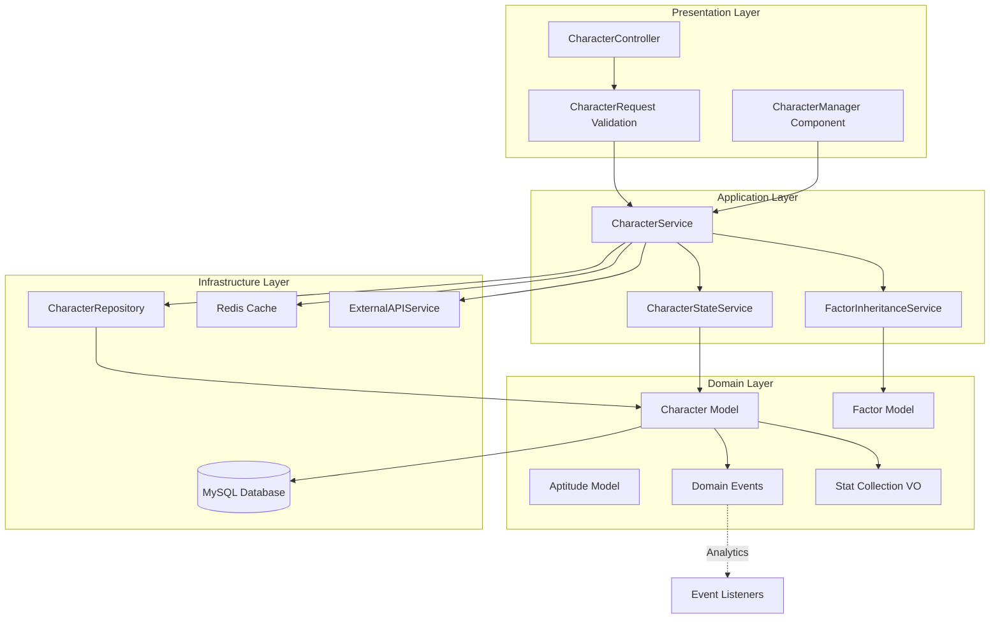

# SPEC-001: Character Management System - Technical Specification

**Document Version**: 2.2.0  
**Date**: 2026-01-28  
**Project**: Umamusume Pretty Derby Career Planner  
**Status**: Active - Updated with game-accurate mechanics  
**Classification**: Internal - Development Team

---

## Document Information

| Attribute | Value |
|-----------|-------|
| **Document ID** | SPEC-001 |
| **Related PRD** | [PRD-001: Character Management](../prds/PRD-001_Character_Management.md) |
| **Architecture Version** | v2.2.0 |
| **Approval Status** | Approved |
| **Last Reviewed** | 2026-01-28 |

### Related Documents

**Requirements & Design**:

- [SRS Section 3.1: Character Management](../003_SRS_Software_Requirement_Specifications.md#31-character-management)
- [SDS Section 4.1: Character Management Architecture](../004_SDS_Software_Design_Specifications.md#41-character-management-module)

**Data & Integration**:

- [DBD Section 5.1: Character Tables](../009_DBD_Database_Documentation.md#51-character-tables)
- [API Section 4.1: Character Endpoints](../010_API_API_Documentation.md#41-character-management-endpoints)

**Visual Documentation**:

- [FLOW-001: Character Management System](../flows/FLOW-001_Character_Management_System.md)
- [SEQ-001: Character Creation Sequence](../sequences/SEQ-001_Character_Creation_Sequence.md)
- [WF-002: Character Creation Wizard](../wireframes/WF-002_Character_Creation_Wizard.md)
- [WF-003: Character Detail Management](../wireframes/WF-003_Character_Detail_Management.md)
- [UF-002: Career Setup Flow](../user-flows/UF-002_Career_Setup_Flow.md)

---

## Table of Contents

1. [Technical Overview](#1-technical-overview)
2. [Architecture Design](#2-architecture-design)
3. [Data Models](#3-data-models)
4. [Service Layer](#4-service-layer)
5. [API Specification](#5-api-specification)
6. [Database Schema](#6-database-schema)
7. [Business Logic](#7-business-logic)
8. [Integration Points](#8-integration-points)
9. [Error Handling](#9-error-handling)
10. [Performance Optimization](#10-performance-optimization)
11. [Security Considerations](#11-security-considerations)
12. [Testing Strategy](#12-testing-strategy)
13. [Appendices](#13-appendices)

---

## 1. Technical Overview

### 1.1 Module Purpose

The Character Management System is the foundational module responsible for managing Uma Musume trainee characters throughout their lifecycle. It handles character creation, state tracking (stats, energy, mood), aptitude configuration, and factor inheritance mechanics.

**Core Responsibilities**:

- Character entity lifecycle management (CRUD operations)
- Real-time stat tracking with validation and soft cap handling
- Aptitude rating system for distance, surface, and running style (G-S grades)
- Factor inheritance calculation from parent characters
- Goal tracking and status monitoring
- Condition and status effect management

### 1.2 Business Context

In Umamusume Pretty Derby, each trainee character represents a single career run attempt. Characters maintain:

- **Base Attributes**: Derived from the trainee template (e.g., Special Week, Tokai Teio)
- **Current State**: Dynamic stats modified through training and events (can exceed 1200 with diminishing returns)
- **Aptitudes**: Compatibility ratings (G-S grades) affecting race performance
- **Factors**: Inherited bonuses from parent characters
- **Goals**: Career objectives defined at creation

### 1.3 Technical Scope

**In Scope**:

- Character entity management with soft deletes
- Stat validation with soft cap handling (diminishing returns above 1200)
- Aptitude CRUD operations (G-S grade system)
- Factor inheritance calculations
- Goal status tracking
- Integration with External API for base character data
- Cache management for frequently accessed character state

**Out of Scope**:

- Training execution logic (handled by SPEC-002)
- Race participation (handled by SPEC-003)
- Skill management (handled by SPEC-004)
- Support deck configuration (handled by SPEC-005)

### 1.4 Technology Stack

| Component | Technology | Version | Purpose |
|-----------|-----------|---------|---------|
| **Framework** | Laravel | 12.x | Application foundation |
| **Language** | PHP | 8.3+ | Server-side logic |
| **Database** | MySQL | 8.0+ | Data persistence |
| **Cache** | Redis | 7.x | State caching |
| **ORM** | Eloquent | 12.x | Database abstraction |
| **Validation** | Laravel Form Requests | 12.x | Input validation |

---

## 2. Architecture Design

### 2.1 Component Architecture



### 2.2 Layer Responsibilities

**Presentation Layer**:

- HTTP request/response handling
- Input validation via Form Requests
- Livewire component rendering for UI interactions

**Application Layer**:

- Business workflow orchestration
- Service coordination
- Transaction management

**Domain Layer**:

- Core business rules
- Entity definitions
- Domain event publishing

**Infrastructure Layer**:

- Data persistence
- External service communication
- Cache management

### 2.3 Design Patterns

| Pattern | Implementation | Purpose |
|---------|---------------|---------|
| **Repository** | `CharacterRepository` | Abstract data access logic |
| **Service Layer** | `CharacterService` | Encapsulate business operations |
| **Factory** | `CharacterFactory` | Streamline object creation |
| **Value Object** | `StatCollection` | Encapsulate stat logic |
| **Observer** | Event Listeners | React to domain events |
| **Strategy** | Factor Calculators | Pluggable inheritance algorithms |

---

## 3. Data Models

### 3.1 Character Entity

The `Character` model represents a single trainee instance within a user's account.

```php
<?php

namespace App\Models;

use App\Enums\ScenarioType;
use App\Enums\MoodStatus;
use App\ValueObjects\StatCollection;
use Illuminate\Database\Eloquent\Model;
use Illuminate\Database\Eloquent\SoftDeletes;
use Illuminate\Database\Eloquent\Factories\HasFactory;

/**
 * Character Entity
 * 
 * Represents an Uma Musume trainee instance with stats, aptitudes, and inheritance.
 * 
 * @property int $id
 * @property string $user_id
 * @property string $name
 * @property string|null $name_jp
 * @property int|null $trainee_id External game character ID
 * @property string|null $image_path
 * @property ScenarioType $scenario_type
 * @property array $base_stats {speed, stamina, power, guts, wit}
 * @property array $growth_rates Percentage bonuses per stat
 * @property array $current_stats Current training values
 * @property int $energy_level 0-100
 * @property MoodStatus $mood_status
 * @property array|null $goals Array of goal definitions
 * @property array|null $conditions Active status effects
 * @property \Carbon\Carbon $created_at
 * @property \Carbon\Carbon $updated_at
 * @property \Carbon\Carbon|null $deleted_at
 */
class Character extends Model
{
    use HasFactory, SoftDeletes;

    protected $table = 'ucp_characters';

    protected $fillable = [
        'user_id',
        'name',
        'name_jp',
        'trainee_id',
        'image_path',
        'scenario_type',
        'base_stats',
        'growth_rates',
        'current_stats',
        'energy_level',
        'mood_status',
        'goals',
        'conditions',
    ];

    protected $casts = [
        'trainee_id' => 'integer',
        'base_stats' => 'array',
        'growth_rates' => 'array',
        'current_stats' => 'array',
        'goals' => 'array',
        'conditions' => 'array',
        'energy_level' => 'integer',
        'scenario_type' => ScenarioType::class,
        'mood_status' => MoodStatus::class,
        'created_at' => 'datetime',
        'updated_at' => 'datetime',
        'deleted_at' => 'datetime',
    ];

    protected $attributes = [
        'energy_level' => 100,
        'mood_status' => MoodStatus::Normal,
        'current_stats' => '{"speed":0,"stamina":0,"power":0,"guts":0,"wit":0}',
    ];

    // Relationships

    public function user()
    {
        return $this->belongsTo(User::class);
    }

    public function careerRuns()
    {
        return $this->hasMany(CareerRun::class);
    }

    public function aptitudes()
    {
        return $this->hasMany(Aptitude::class);
    }

    public function factors()
    {
        return $this->hasMany(Factor::class);
    }

    // Accessors & Mutators

    public function getStatsAttribute(): StatCollection
    {
        return new StatCollection($this->current_stats);
    }

    public function setStatsAttribute(StatCollection $stats): void
    {
        $this->current_stats = $stats->toArray();
    }

    // Business Methods

    public function updateStats(array $deltas): void
    {
        $stats = $this->stats;
        
        foreach ($deltas as $stat => $delta) {
            $stats->add($stat, $delta);
        }
        
        $this->stats = $stats;
    }

    public function clampEnergy(int $value): int
    {
        return max(0, min(100, $value));
    }

    public function hasAchievedGoal(string $goalId): bool
    {
        if (!$this->goals) {
            return false;
        }
        
        $goal = collect($this->goals)->firstWhere('id', $goalId);
        
        return $goal['status'] ?? false === 'completed';
    }
}
```

### 3.2 Aptitude Model

```php
<?php

namespace App\Models;

use App\Enums\AptitudeGrade;
use App\Enums\AptitudeCategory;
use Illuminate\Database\Eloquent\Model;

/**
 * Aptitude Entity
 * 
 * Represents character compatibility ratings for distance, surface, and running style.
 * 
 * @property int $id
 * @property int $character_id
 * @property AptitudeCategory $category
 * @property string $type Specific type (e.g., 'mile', 'turf', 'front_runner')
 * @property AptitudeGrade $grade Rating from G to S (S is maximum)
 * @property int $bonus_value Numeric bonus applied
 */
class Aptitude extends Model
{
    protected $table = 'ucp_aptitudes';

    public $timestamps = false;

    protected $fillable = [
        'character_id',
        'category',
        'type',
        'grade',
        'bonus_value',
    ];

    protected $casts = [
        'character_id' => 'integer',
        'category' => AptitudeCategory::class,
        'grade' => AptitudeGrade::class,
        'bonus_value' => 'integer',
    ];

    public function character()
    {
        return $this->belongsTo(Character::class);
    }

    public function upgradeGrade(): void
    {
        $this->grade = $this->grade->upgrade();
        $this->bonus_value = $this->grade->getBonusValue();
    }
}
```

### 3.3 Factor Model

```php
<?php

namespace App\Models;

use App\Enums\FactorType;
use Illuminate\Database\Eloquent\Model;

/**
 * Factor Entity
 * 
 * Represents inherited traits from parent characters.
 * 
 * @property int $id
 * @property int $character_id
 * @property int|null $source_character_id Parent character ID
 * @property FactorType $factor_type
 * @property string $target Stat, aptitude, or skill name
 * @property int $stars Star rating (1-3)
 * @property int|null $bonus_value Numeric bonus applied
 */
class Factor extends Model
{
    protected $table = 'ucp_factors';

    public $timestamps = false;

    protected $fillable = [
        'character_id',
        'source_character_id',
        'factor_type',
        'target',
        'stars',
        'bonus_value',
    ];

    protected $casts = [
        'character_id' => 'integer',
        'source_character_id' => 'integer',
        'factor_type' => FactorType::class,
        'stars' => 'integer',
        'bonus_value' => 'integer',
    ];

    public function character()
    {
        return $this->belongsTo(Character::class);
    }

    public function sourceCharacter()
    {
        return $this->belongsTo(Character::class, 'source_character_id');
    }
}
```

### 3.4 Enumerations

**ScenarioType**:

```php
<?php

namespace App\Enums;

enum ScenarioType: string
{
    case UraFinale = 'ura_finale';
    case AohariCup = 'aohari_cup';
    case MakeCupDebut = 'make_cup_debut';
    case GrandMasters = 'grand_masters';
    case ProjectLArc = 'project_larc';
}
```

**MoodStatus**:

```php
<?php

namespace App\Enums;

enum MoodStatus: string
{
    case Awful = 'awful';
    case Bad = 'bad';
    case Normal = 'normal';
    case Good = 'good';
    case Great = 'great';
    
    public function getMultiplier(): float
    {
        return match($this) {
            self::Awful => 0.90,
            self::Bad => 0.95,
            self::Normal => 1.00,
            self::Good => 1.05,
            self::Great => 1.10,
        };
    }
}
```

**AptitudeGrade**:

```php
<?php

namespace App\Enums;

/**
 * AptitudeGrade Enum
 * 
 * Game-accurate aptitude grades (G-S). S is maximum grade.
 * A-rank is baseline (0% modifier). Only S provides positive bonus.
 * 
 * Modifiers vary by category:
 * - Surface (Power): S=+5%, A=0%, B=-10%, C=-20%, D=-30%, E=-50%, F=-70%, G=-90%
 * - Distance (Speed): S=+5%, A=0%, B=-10%, C=-20%, D=-40%, E=-60%, F=-80%, G=-90%
 * - Style (Wit): S=+10%, A=0%, B=-15%, C=-25%, D=-40%, E=-60%, F=-80%, G=-90%
 */
enum AptitudeGrade: string
{
    case S = 'S';
    case A = 'A';
    case B = 'B';
    case C = 'C';
    case D = 'D';
    case E = 'E';
    case F = 'F';
    case G = 'G';
    
    /**
     * Get surface aptitude modifier (affects Power)
     */
    public function getSurfaceModifier(): float
    {
        return match($this) {
            self::S => 0.05,   // +5%
            self::A => 0.00,   // Baseline
            self::B => -0.10,  // -10%
            self::C => -0.20,  // -20%
            self::D => -0.30,  // -30%
            self::E => -0.50,  // -50%
            self::F => -0.70,  // -70%
            self::G => -0.90,  // -90%
        };
    }
    
    /**
     * Get distance aptitude modifier (affects Speed)
     */
    public function getDistanceModifier(): float
    {
        return match($this) {
            self::S => 0.05,   // +5%
            self::A => 0.00,   // Baseline
            self::B => -0.10,  // -10%
            self::C => -0.20,  // -20%
            self::D => -0.40,  // -40%
            self::E => -0.60,  // -60%
            self::F => -0.80,  // -80%
            self::G => -0.90,  // -90%
        };
    }
    
    /**
     * Get running style aptitude modifier (affects Wit)
     */
    public function getStyleModifier(): float
    {
        return match($this) {
            self::S => 0.10,   // +10%
            self::A => 0.00,   // Baseline
            self::B => -0.15,  // -15%
            self::C => -0.25,  // -25%
            self::D => -0.40,  // -40%
            self::E => -0.60,  // -60%
            self::F => -0.80,  // -80%
            self::G => -0.90,  // -90%
        };
    }
    
    /**
     * Get legacy bonus value (for backward compatibility)
     * @deprecated Use category-specific modifiers instead
     */
    public function getBonusValue(): int
    {
        return match($this) {
            self::S => 10,
            self::A => 0,
            self::B => -5,
            self::C => -10,
            self::D => -15,
            self::E => -20,
            self::F => -25,
            self::G => -30,
        };
    }
    
    public function upgrade(): self
    {
        return match($this) {
            self::G => self::F,
            self::F => self::E,
            self::E => self::D,
            self::D => self::C,
            self::C => self::B,
            self::B => self::A,
            self::A => self::S,
            self::S => self::S, // Max grade
        };
    }
}
```

### 3.5 Value Objects

**StatCollection**:

```php
<?php

namespace App\ValueObjects;

/**
 * StatCollection Value Object
 * 
 * Encapsulates stat logic with game-accurate soft cap handling.
 * Stats can exceed 1200 but values above 1200 have diminishing returns (50% effectiveness).
 * Per-training cap: +100 (reduced to +50 if stat > 1200)
 */
class StatCollection
{
    private const STAT_MIN = 0;
    private const SOFT_CAP = 1200;
    private const PER_TRAINING_CAP = 100;
    private const PER_TRAINING_CAP_ABOVE_SOFT = 50;
    
    public function __construct(
        private array $stats = [
            'speed' => 0,
            'stamina' => 0,
            'power' => 0,
            'guts' => 0,
            'wit' => 0,
        ]
    ) {
        $this->validateAll();
    }
    
    /**
     * Add stat value with per-training cap enforcement
     */
    public function add(string $stat, int $value): void
    {
        $current = $this->stats[$stat] ?? 0;
        
        // Apply per-training cap based on current stat level
        $maxGain = $current > self::SOFT_CAP 
            ? self::PER_TRAINING_CAP_ABOVE_SOFT 
            : self::PER_TRAINING_CAP;
        
        $cappedValue = min($value, $maxGain);
        $this->stats[$stat] = max(self::STAT_MIN, $current + $cappedValue);
    }
    
    public function get(string $stat): int
    {
        return $this->stats[$stat] ?? 0;
    }
    
    /**
     * Get effective stat value (with diminishing returns above soft cap)
     * Values above 1200 count for 50% effectiveness
     */
    public function getEffective(string $stat): int
    {
        $value = $this->stats[$stat] ?? 0;
        
        if ($value <= self::SOFT_CAP) {
            return $value;
        }
        
        // Diminishing returns: values above 1200 count for half
        $excess = $value - self::SOFT_CAP;
        return self::SOFT_CAP + (int)($excess * 0.5);
    }
    
    public function toArray(): array
    {
        return $this->stats;
    }
    
    /**
     * Get array of effective values (with diminishing returns applied)
     */
    public function toEffectiveArray(): array
    {
        $effective = [];
        foreach ($this->stats as $stat => $value) {
            $effective[$stat] = $this->getEffective($stat);
        }
        return $effective;
    }
    
    private function validateAll(): void
    {
        foreach ($this->stats as $stat => $value) {
            $this->stats[$stat] = max(self::STAT_MIN, (int)$value);
        }
    }
}
```

---

## 4. Service Layer

### 4.1 CharacterService

Main orchestration service for character operations.

```php
<?php

namespace App\Services;

use App\Models\Character;
use App\Repositories\CharacterRepository;
use App\Services\External\ExternalAPIService;
use Illuminate\Support\Facades\DB;
use Illuminate\Support\Facades\Cache;

/**
 * Character Management Service
 * 
 * Handles business logic for character lifecycle management.
 */
class CharacterService
{
    public function __construct(
        private CharacterRepository $repository,
        private FactorInheritanceService $factorService,
        private CharacterStateService $stateService,
        private ExternalAPIService $externalApi
    ) {}

    /**
     * Create a new character instance
     * 
     * @param array $data Character creation data
     * @return Character
     * @throws \App\Exceptions\CharacterCreationException
     */
    public function create(array $data): Character
    {
        return DB::transaction(function () use ($data) {
            // Step 1: Fetch base data from external API if trainee_id provided
            if (isset($data['trainee_id'])) {
                $externalData = $this->externalApi->getCharacter($data['trainee_id']);
                $data = $this->mergeExternalData($data, $externalData);
            }

            // Step 2: Calculate inheritance from parent factors
            if (isset($data['parent_ids'])) {
                $inheritance = $this->factorService->calculateInheritance($data['parent_ids']);
                $data['current_stats'] = $this->applyInheritanceToStats($data['base_stats'], $inheritance);
            } else {
                $data['current_stats'] = $data['base_stats'];
            }

            // Step 3: Create character entity
            $character = $this->repository->create($data);

            // Step 4: Create aptitudes
            if (isset($data['aptitudes'])) {
                $this->createAptitudes($character, $data['aptitudes'], $inheritance ?? []);
            }

            // Step 5: Create factors
            if (isset($inheritance)) {
                $this->createFactors($character, $inheritance);
            }

            // Step 6: Fire domain event
            event(new \App\Events\CharacterCreated($character));

            return $character->fresh(['aptitudes', 'factors']);
        });
    }

    /**
     * Update character state
     * 
     * @param Character $character
     * @param array $changes
     * @return Character
     */
    public function updateState(Character $character, array $changes): Character
    {
        return $this->stateService->updateState($character, $changes);
    }

    /**
     * Get character by ID with caching
     * 
     * @param int $id
     * @return Character|null
     */
    public function findById(int $id): ?Character
    {
        return Cache::tags(['characters'])->remember(
            "character:{$id}",
            now()->addMinutes(5),
            fn () => $this->repository->findWithRelations($id, ['aptitudes', 'factors'])
        );
    }

    /**
     * Invalidate character cache
     * 
     * @param Character $character
     * @return void
     */
    public function invalidateCache(Character $character): void
    {
        Cache::tags(['characters'])->forget("character:{$character->id}");
    }

    /**
     * Merge external API data with user input
     * 
     * @param array $userData
     * @param array $externalData
     * @return array
     */
    private function mergeExternalData(array $userData, array $externalData): array
    {
        return array_merge($userData, [
            'name_jp' => $externalData['name_jp'] ?? null,
            'image_path' => $externalData['image_url'] ?? null,
            'base_stats' => $externalData['base_stats'] ?? [],
            'growth_rates' => $externalData['growth_rates'] ?? [],
        ]);
    }

    /**
     * Apply inheritance bonuses to base stats
     * 
     * @param array $baseStats
     * @param array $inheritance
     * @return array
     */
    private function applyInheritanceToStats(array $baseStats, array $inheritance): array
    {
        $stats = new \App\ValueObjects\StatCollection($baseStats);
        
        foreach ($inheritance['stat_bonuses'] ?? [] as $stat => $bonus) {
            $stats->add($stat, $bonus);
        }
        
        return $stats->toArray();
    }

    /**
     * Create aptitude records
     * 
     * @param Character $character
     * @param array $aptitudes
     * @param array $inheritance
     * @return void
     */
    private function createAptitudes(Character $character, array $aptitudes, array $inheritance): void
    {
        foreach ($aptitudes as $category => $types) {
            foreach ($types as $type => $grade) {
                // Apply red factor bonuses if applicable
                $finalGrade = $this->applyAptitudeInheritance($category, $type, $grade, $inheritance);
                
                $character->aptitudes()->create([
                    'category' => $category,
                    'type' => $type,
                    'grade' => $finalGrade,
                    'bonus_value' => \App\Enums\AptitudeGrade::from($finalGrade)->getBonusValue(),
                ]);
            }
        }
    }

    /**
     * Create factor records
     * 
     * @param Character $character
     * @param array $inheritance
     * @return void
     */
    private function createFactors(Character $character, array $inheritance): void
    {
        foreach ($inheritance['factors'] ?? [] as $factor) {
            $character->factors()->create([
                'source_character_id' => $factor['source_id'] ?? null,
                'factor_type' => $factor['type'],
                'target' => $factor['target'],
                'stars' => $factor['stars'],
                'bonus_value' => $factor['value'],
            ]);
        }
    }

    /**
     * Apply red factor bonuses to aptitude grades
     * 
     * @param string $category
     * @param string $type
     * @param string $baseGrade
     * @param array $inheritance
     * @return string
     */
    private function applyAptitudeInheritance(
        string $category,
        string $type,
        string $baseGrade,
        array $inheritance
    ): string {
        $bonus = 0;
        
        foreach ($inheritance['aptitude_bonuses'] ?? [] as $aptBonus) {
            if ($aptBonus['category'] === $category && $aptBonus['type'] === $type) {
                $bonus += $aptBonus['levels'];
            }
        }
        
        $grade = \App\Enums\AptitudeGrade::from($baseGrade);
        
        for ($i = 0; $i < $bonus; $i++) {
            $grade = $grade->upgrade();
        }
        
        return $grade->value;
    }
}
```

### 4.2 CharacterStateService

Handles state mutation operations with validation.

```php
<?php

namespace App\Services;

use App\Models\Character;
use Illuminate\Support\Facades\DB;

/**
 * Character State Management Service
 * 
 * Handles validation and persistence of character state changes.
 */
class CharacterStateService
{
    /**
     * Update character state with validation
     * 
     * @param Character $character
     * @param array $changes
     * @return Character
     */
    public function updateState(Character $character, array $changes): Character
    {
        return DB::transaction(function () use ($character, $changes) {
            // Update stats if provided
            if (isset($changes['current_stats'])) {
                $character->updateStats($changes['current_stats']);
            }

            // Update energy with clamping
            if (isset($changes['energy_level'])) {
                $character->energy_level = $character->clampEnergy($changes['energy_level']);
            }

            // Update mood
            if (isset($changes['mood_status'])) {
                $character->mood_status = \App\Enums\MoodStatus::from($changes['mood_status']);
            }

            // Update conditions
            if (isset($changes['conditions'])) {
                $character->conditions = $this->validateConditions($changes['conditions']);
            }

            // Update goals
            if (isset($changes['goals'])) {
                $character->goals = $changes['goals'];
            }

            $character->save();

            // Fire state updated event
            event(new \App\Events\CharacterStateUpdated($character, $changes));

            return $character->fresh();
        });
    }

    /**
     * Validate condition data structure
     * 
     * @param array $conditions
     * @return array
     */
    private function validateConditions(array $conditions): array
    {
        return collect($conditions)->map(function ($condition) {
            return [
                'type' => $condition['type'] ?? 'unknown',
                'severity' => $condition['severity'] ?? 'minor',
                'turns_remaining' => max(0, $condition['turns_remaining'] ?? 0),
            ];
        })->toArray();
    }
}
```

### 4.3 FactorInheritanceService

Calculates stat and aptitude bonuses from parent characters.

```php
<?php

namespace App\Services;

use App\Models\Character;
use App\Enums\FactorType;

/**
 * Factor Inheritance Calculation Service
 * 
 * Handles calculation of inherited bonuses from parent characters.
 */
class FactorInheritanceService
{
    private const BLUE_FACTOR_VALUES = [
        1 => 10,  // 1-star
        2 => 15,  // 2-star
        3 => 20,  // 3-star
    ];

    /**
     * Calculate inheritance from parent characters
     * 
     * @param array $parentIds
     * @return array
     */
    public function calculateInheritance(array $parentIds): array
    {
        $parents = Character::with('factors')->whereIn('id', $parentIds)->get();
        
        $inheritance = [
            'stat_bonuses' => [],
            'aptitude_bonuses' => [],
            'skill_hints' => [],
            'factors' => [],
        ];

        foreach ($parents as $parent) {
            foreach ($parent->factors as $factor) {
                match ($factor->factor_type) {
                    FactorType::Stat => $this->applyStatFactor($inheritance, $factor),
                    FactorType::Aptitude => $this->applyAptitudeFactor($inheritance, $factor),
                    FactorType::Skill => $this->applySkillFactor($inheritance, $factor),
                };
            }
        }

        return $inheritance;
    }

    /**
     * Apply blue factor (stat bonus)
     * 
     * @param array &$inheritance
     * @param \App\Models\Factor $factor
     * @return void
     */
    private function applyStatFactor(array &$inheritance, $factor): void
    {
        $stat = $factor->target;
        $bonus = self::BLUE_FACTOR_VALUES[$factor->stars] ?? 0;
        
        $inheritance['stat_bonuses'][$stat] = ($inheritance['stat_bonuses'][$stat] ?? 0) + $bonus;
        
        $inheritance['factors'][] = [
            'source_id' => $factor->character_id,
            'type' => FactorType::Stat,
            'target' => $stat,
            'stars' => $factor->stars,
            'value' => $bonus,
        ];
    }

    /**
     * Apply red factor (aptitude bonus)
     * 
     * @param array &$inheritance
     * @param \App\Models\Factor $factor
     * @return void
     */
    private function applyAptitudeFactor(array &$inheritance, $factor): void
    {
        [$category, $type] = explode(':', $factor->target);
        
        $inheritance['aptitude_bonuses'][] = [
            'category' => $category,
            'type' => $type,
            'levels' => $factor->stars,
        ];
        
        $inheritance['factors'][] = [
            'source_id' => $factor->character_id,
            'type' => FactorType::Aptitude,
            'target' => $factor->target,
            'stars' => $factor->stars,
            'value' => $factor->stars,
        ];
    }

    /**
     * Apply green/white factor (skill hint)
     * 
     * @param array &$inheritance
     * @param \App\Models\Factor $factor
     * @return void
     */
    private function applySkillFactor(array &$inheritance, $factor): void
    {
        $inheritance['skill_hints'][] = [
            'skill_id' => $factor->target,
            'hint_level' => $factor->stars,
        ];
        
        $inheritance['factors'][] = [
            'source_id' => $factor->character_id,
            'type' => FactorType::Skill,
            'target' => $factor->target,
            'stars' => $factor->stars,
            'value' => 0,
        ];
    }
}
```

---

## 5. API Specification

### 5.1 Endpoint Overview

| Method | Endpoint | Description | Auth Required |
|--------|----------|-------------|---------------|
| GET | `/api/v1/characters` | List user's characters | Yes |
| POST | `/api/v1/characters` | Create new character | Yes |
| GET | `/api/v1/characters/{id}` | Get character details | Yes |
| PATCH | `/api/v1/characters/{id}` | Update character | Yes |
| DELETE | `/api/v1/characters/{id}` | Soft delete character | Yes |
| PATCH | `/api/v1/characters/{id}/state` | Update character state | Yes |
| POST | `/api/v1/characters/{id}/sync` | Sync external data | Yes |

### 5.2 Create Character

**Endpoint**: `POST /api/v1/characters`

**Request Headers**:

```http
Content-Type: application/json
Authorization: Bearer {token}
Accept: application/json
```

**Request Body**:

```json
{
    "name": "Special Week",
    "trainee_id": 1001,
    "scenario_type": "ura_finale",
    "parent_ids": [12, 45],
    "aptitudes": {
        "distance": {
            "sprint": "C",
            "mile": "B",
            "medium": "A",
            "long": "B"
        },
        "surface": {
            "turf": "A",
            "dirt": "C"
        },
        "style": {
            "front_runner": "B",
            "pace_chaser": "A",
            "late_surger": "B",
            "end_closer": "C"
        }
    },
    "goals": [
        {
            "id": "goal_1",
            "type": "stat",
            "target": "speed",
            "value": 1200,
            "status": "pending"
        },
        {
            "id": "goal_2",
            "type": "race",
            "target": "ura_finals",
            "value": "win",
            "status": "pending"
        }
    ]
}
```

**Success Response** (201 Created):

```json
{
    "data": {
        "id": 123,
        "user_id": "uuid-here",
        "name": "Special Week",
        "name_jp": "スペシャルウィーク",
        "trainee_id": 1001,
        "image_path": "/images/characters/special_week.png",
        "scenario_type": "ura_finale",
        "base_stats": {
            "speed": 100,
            "stamina": 90,
            "power": 85,
            "guts": 80,
            "wit": 75
        },
        "growth_rates": {
            "speed": 20,
            "stamina": 10,
            "power": 15,
            "guts": 10,
            "wit": 10
        },
        "current_stats": {
            "speed": 120,
            "stamina": 100,
            "power": 100,
            "guts": 90,
            "wit": 85
        },
        "energy_level": 100,
        "mood_status": "normal",
        "goals": [
            {
                "id": "goal_1",
                "type": "stat",
                "target": "speed",
                "value": 1200,
                "status": "pending"
            }
        ],
        "conditions": null,
        "aptitudes": [
            {
                "id": 1,
                "category": "distance",
                "type": "mile",
                "grade": "A",
                "bonus_value": 10
            }
        ],
        "factors": [
            {
                "id": 1,
                "factor_type": "stat",
                "target": "speed",
                "stars": 3,
                "bonus_value": 20
            }
        ],
        "created_at": "2026-01-24T10:00:00Z",
        "updated_at": "2026-01-24T10:00:00Z"
    }
}
```

**Error Responses**:

```json
// 422 Validation Error
{
    "message": "The given data was invalid.",
    "errors": {
        "trainee_id": ["The trainee_id field is required."],
        "scenario_type": ["The selected scenario_type is invalid."]
    }
}

// 404 Not Found (parent character)
{
    "message": "Parent character not found",
    "error_code": "PARENT_NOT_FOUND"
}

// 503 Service Unavailable (external API)
{
    "message": "Unable to fetch character data from external source",
    "error_code": "EXTERNAL_API_UNAVAILABLE"
}
```

### 5.3 Update Character State

**Endpoint**: `PATCH /api/v1/characters/{id}/state`

**Request Body**:

```json
{
    "current_stats": {
        "speed": 450,
        "stamina": 380,
        "power": 420
    },
    "energy_level": 85,
    "mood_status": "great",
    "conditions": [
        {
            "type": "practice_poor",
            "severity": "moderate",
            "turns_remaining": 3
        }
    ]
}
```

**Success Response** (200 OK):

```json
{
    "data": {
        "id": 123,
        "current_stats": {
            "speed": 450,
            "stamina": 380,
            "power": 420,
            "guts": 90,
            "wit": 85
        },
        "energy_level": 85,
        "mood_status": "great",
        "conditions": [
            {
                "type": "practice_poor",
                "severity": "moderate",
                "turns_remaining": 3
            }
        ],
        "updated_at": "2026-01-24T11:30:00Z"
    }
}
```

### 5.4 Sync External Data

**Endpoint**: `POST /api/v1/characters/{id}/sync`

Triggers a refresh of base metadata from external APIs.

**Success Response** (200 OK):

```json
{
    "message": "Character data synchronized successfully",
    "data": {
        "fields_updated": ["name_jp", "image_path", "base_stats"],
        "synced_at": "2026-01-24T12:00:00Z"
    }
}
```

---

## 6. Database Schema

### 6.1 Table: `ucp_characters`

Primary table storing character instances.

```sql
CREATE TABLE ucp_characters (
    id BIGINT UNSIGNED AUTO_INCREMENT PRIMARY KEY,
    user_id CHAR(36) NOT NULL,
    name VARCHAR(255) NOT NULL,
    name_jp VARCHAR(255) NULL,
    trainee_id INT UNSIGNED NULL,
    image_path VARCHAR(500) NULL,
    scenario_type ENUM('ura_finale', 'aohari_cup', 'make_cup_debut', 'grand_masters', 'project_larc') NOT NULL,
    base_stats JSON NOT NULL COMMENT '{"speed":0,"stamina":0,"power":0,"guts":0,"wit":0}',
    growth_rates JSON NOT NULL DEFAULT '{"speed":0,"stamina":0,"power":0,"guts":0,"wit":0}',
    current_stats JSON NOT NULL DEFAULT '{"speed":0,"stamina":0,"power":0,"guts":0,"wit":0}',
    energy_level TINYINT UNSIGNED NOT NULL DEFAULT 100 CHECK (energy_level BETWEEN 0 AND 100),
    mood_status ENUM('awful', 'bad', 'normal', 'good', 'great') NOT NULL DEFAULT 'normal',
    goals JSON NULL,
    conditions JSON NULL,
    created_at TIMESTAMP NOT NULL DEFAULT CURRENT_TIMESTAMP,
    updated_at TIMESTAMP NOT NULL DEFAULT CURRENT_TIMESTAMP ON UPDATE CURRENT_TIMESTAMP,
    deleted_at TIMESTAMP NULL,
    
    FOREIGN KEY (user_id) REFERENCES ucp_users(id) ON DELETE CASCADE,
    INDEX idx_user_id (user_id),
    INDEX idx_trainee_id (trainee_id),
    INDEX idx_scenario_type (scenario_type),
    INDEX idx_deleted_at (deleted_at)
) ENGINE=InnoDB DEFAULT CHARSET=utf8mb4 COLLATE=utf8mb4_unicode_ci;
```

### 6.2 Table: `ucp_aptitudes`

Stores aptitude ratings for each character.

```sql
CREATE TABLE ucp_aptitudes (
    id BIGINT UNSIGNED AUTO_INCREMENT PRIMARY KEY,
    character_id BIGINT UNSIGNED NOT NULL,
    category ENUM('distance', 'surface', 'style') NOT NULL,
    type VARCHAR(50) NOT NULL COMMENT 'sprint, mile, turf, front_runner, etc.',
    grade ENUM('SS', 'S', 'A', 'B', 'C', 'D', 'E', 'F', 'G') NOT NULL,
    bonus_value TINYINT NOT NULL DEFAULT 0,
    
    FOREIGN KEY (character_id) REFERENCES ucp_characters(id) ON DELETE CASCADE,
    UNIQUE KEY unique_aptitude (character_id, category, type),
    INDEX idx_grade (grade)
) ENGINE=InnoDB DEFAULT CHARSET=utf8mb4 COLLATE=utf8mb4_unicode_ci;
```

### 6.3 Table: `ucp_factors`

Stores inherited factors from parent characters.

```sql
CREATE TABLE ucp_factors (
    id BIGINT UNSIGNED AUTO_INCREMENT PRIMARY KEY,
    character_id BIGINT UNSIGNED NOT NULL,
    source_character_id BIGINT UNSIGNED NULL COMMENT 'Parent character ID',
    factor_type ENUM('stat', 'aptitude', 'skill') NOT NULL,
    target VARCHAR(100) NOT NULL COMMENT 'Stat name, aptitude type, or skill ID',
    stars TINYINT UNSIGNED NOT NULL CHECK (stars BETWEEN 1 AND 3),
    bonus_value SMALLINT NULL,
    
    FOREIGN KEY (character_id) REFERENCES ucp_characters(id) ON DELETE CASCADE,
    FOREIGN KEY (source_character_id) REFERENCES ucp_characters(id) ON DELETE SET NULL,
    INDEX idx_character_id (character_id),
    INDEX idx_factor_type (factor_type)
) ENGINE=InnoDB DEFAULT CHARSET=utf8mb4 COLLATE=utf8mb4_unicode_ci;
```

### 6.4 Indexes & Performance

**Query Optimization**:

- `idx_user_id`: Fast user character lookups
- `idx_trainee_id`: External sync operations
- `idx_deleted_at`: Soft delete filtering
- `unique_aptitude`: Prevent duplicate aptitude entries

**Storage Estimates**:

- Characters: ~1KB per row
- Aptitudes: ~50B per row (avg 10 per character)
- Factors: ~100B per row (avg 5 per character)

---

## 7. Business Logic

### 7.1 Stat Clamping Rules

All character stats must be clamped to the valid range:

- **Minimum**: 0
- **Maximum**: 1200
- **Enforcement**: Validated in `StatCollection` value object

```php
// Example usage
$stats = new StatCollection(['speed' => 1500]); // Clamped to 1200
$stats->add('speed', -2000); // Results in 0
```

### 7.2 Energy Management

Energy governs training risk and recovery:

- **Range**: 0-100
- **Starting Value**: 100
- **Depletion**: 15-30 per training session
- **Recovery**: 50-70 via Rest action
- **Risk Threshold**: Below 50 increases failure probability

### 7.3 Mood Effects

Mood status affects training outcomes:

| Status | Multiplier | Training Gain Impact |
|--------|-----------|---------------------|
| Awful | 0.90x | -10% effectiveness |
| Bad | 0.95x | -5% effectiveness |
| Normal | 1.00x | Baseline |
| Good | 1.05x | +5% effectiveness |
| Great | 1.10x | +10% effectiveness |

### 7.4 Inheritance Calculation

**Blue Factors (Stats)**:

- 1-star: +10 to target stat
- 2-star: +15 to target stat
- 3-star: +20 to target stat

**Red Factors (Aptitudes)**:

- 1-star: +1 grade level
- 2-star: +2 grade levels
- 3-star: +3 grade levels

**Green/White Factors (Skills)**:

- Grants initial skill hint at specified level

### 7.5 Goal Tracking

Goals are stored as JSON arrays with the following structure:

```json
{
    "id": "unique_goal_id",
    "type": "stat|race|achievement",
    "target": "speed|race_name|achievement_id",
    "value": 1200,
    "status": "pending|in_progress|completed|failed",
    "progress": 850,
    "required": 1200
}
```

**Validation Rules**:

- `type` must be one of: stat, race, achievement
- `status` must be one of: pending, in_progress, completed, failed
- `progress` must be ≥ 0
- `required` must be > 0

---

## 8. Integration Points

### 8.1 External API Integration

**Primary Source**: `umapyoi.net`  
**Fallback**: `umamusumedb.com`

**Data Synced**:

- Character base stats
- Growth rate modifiers
- Official Japanese names
- Character images

**Sync Strategy**:

- On character creation (if `trainee_id` provided)
- Manual sync via `/sync` endpoint
- Cached for 24 hours

```php
// Example integration
$externalData = $this->externalApi->getCharacter(1001);

// Expected response structure
[
    'id' => 1001,
    'name_en' => 'Special Week',
    'name_jp' => 'スペシャルウィーク',
    'image_url' => 'https://...',
    'base_stats' => ['speed' => 100, 'stamina' => 90, ...],
    'growth_rates' => ['speed' => 20, 'stamina' => 10, ...],
]
```

### 8.2 Event Broadcasting

**Events Fired**:

1. `CharacterCreated`: After successful character creation
2. `CharacterStateUpdated`: After state mutation
3. `CharacterDeleted`: After soft delete

**Listeners**:

- `UpdateAnalyticsDashboard`: Track character creation metrics
- `InvalidateCharacterCache`: Clear Redis cache
- `NotifyUserOfMilestone`: Trigger notifications for goal completion

### 8.3 Cache Integration

**Cache Strategy**:

```php
// Read-through cache pattern
$character = Cache::tags(['characters'])->remember(
    "character:{$id}",
    now()->addMinutes(5),
    fn() => Character::with(['aptitudes', 'factors'])->find($id)
);

// Invalidation on write
Cache::tags(['characters'])->forget("character:{$id}");
```

**Cache Keys**:

- `character:{id}`: Full character data with relations
- `user:{user_id}:characters`: Character list per user

**TTL**: 5 minutes for active characters

---

## 9. Error Handling

### 9.1 Exception Hierarchy

```php
App\Exceptions\CharacterException (Base)
├── CharacterNotFoundException
├── CharacterCreationException
├── InvalidStatValueException
├── InvalidAptitudeGradeException
├── ParentCharacterIncompatibleException
└─��� ExternalAPIUnavailableException
```

### 9.2 Error Codes

| Code | HTTP Status | Description | Resolution |
|------|-------------|-------------|------------|
| `CHAR_NOT_FOUND` | 404 | Character ID does not exist | Verify ID |
| `CHAR_INVALID_STAT` | 422 | Stat value outside 0-1200 | Validate input |
| `CHAR_PARENT_INCOMPATIBLE` | 422 | Parent selection invalid | Choose different parents |
| `CHAR_SCENARIO_INVALID` | 422 | Unsupported scenario type | Use valid scenario |
| `CHAR_EXTERNAL_API_FAIL` | 503 | External API unavailable | Retry or use cache |

### 9.3 Validation Rules

```php
// Character creation validation
[
    'name' => 'required|string|max:255',
    'trainee_id' => 'nullable|integer|exists:external_characters,id',
    'scenario_type' => 'required|in:ura_finale,aohari_cup,make_cup_debut,grand_masters,project_larc',
    'parent_ids' => 'nullable|array|size:2',
    'parent_ids.*' => 'integer|exists:ucp_characters,id',
    'aptitudes' => 'required|array',
    'aptitudes.*.*.grade' => 'required|in:SS,S,A,B,C,D,E,F,G',
]
```

---

## 10. Performance Optimization

### 10.1 Query Optimization

**Eager Loading**:

```php
// Always eager load relationships to avoid N+1
Character::with(['aptitudes', 'factors', 'careerRuns'])->get();
```

**Selective Column Loading**:

```php
// Load only required columns
Character::select(['id', 'name', 'current_stats'])->get();
```

**Index Usage**:

- Ensure queries use `idx_user_id` for user-scoped queries
- Use `idx_trainee_id` for external sync operations

### 10.2 Caching Strategy

**Read-Heavy Operations**:

- Character detail views: 5-minute cache
- Character lists: 3-minute cache
- External API data: 24-hour cache

**Write Operations**:

- Invalidate specific character cache on update
- Use cache tags for bulk invalidation

### 10.3 Performance Targets

| Operation | Target | Measurement |
|-----------|--------|-------------|
| Character list (10 items) | < 50ms | p95 |
| Character detail with relations | < 100ms | p95 |
| Character creation | < 300ms | p95 |
| State update | < 150ms | p95 |

---

## 11. Security Considerations

### 11.1 Authorization

**Policy Rules**:

```php
// CharacterPolicy.php

public function view(User $user, Character $character): bool
{
    return $user->id === $character->user_id;
}

public function update(User $user, Character $character): bool
{
    return $user->id === $character->user_id;
}

public function delete(User $user, Character $character): bool
{
    return $user->id === $character->user_id;
}
```

**Enforcement**:

```php
// Controller
$this->authorize('update', $character);
```

### 11.2 Input Sanitization

All user input is validated via Form Requests:

```php
class StoreCharacterRequest extends FormRequest
{
    public function rules(): array
    {
        return [
            'name' => ['required', 'string', 'max:255', 'regex:/^[\pL\s\-]+$/u'],
            'current_stats.*' => ['integer', 'between:0,1200'],
            // ... additional rules
        ];
    }
}
```

### 11.3 SQL Injection Prevention

- All queries use Eloquent ORM with parameter binding
- No raw SQL with user input concatenation
- JSON columns use native JSON operations

### 11.4 Mass Assignment Protection

```php
// Model
protected $fillable = [
    'name',
    'trainee_id',
    // ... explicit allowed fields
];

protected $guarded = [
    'id',
    'user_id', // Never mass-assignable
];
```

---

## 12. Testing Strategy

### 12.1 Unit Tests

**Coverage Targets**: 80% minimum

```php
// tests/Unit/Services/CharacterServiceTest.php

test('creates character with inheritance from parents', function () {
    $parent1 = Character::factory()->create();
    $parent2 = Character::factory()->create();
    
    $data = [
        'name' => 'Test Character',
        'trainee_id' => 1001,
        'scenario_type' => 'ura_finale',
        'parent_ids' => [$parent1->id, $parent2->id],
    ];
    
    $character = app(CharacterService::class)->create($data);
    
    expect($character->current_stats['speed'])->toBeGreaterThan(0)
        ->and($character->factors)->toHaveCount(2);
});

test('clamps stat values to valid range', function () {
    $stats = new StatCollection(['speed' => 1500]);
    
    expect($stats->get('speed'))->toBe(1200);
});
```

### 12.2 Feature Tests

```php
// tests/Feature/CharacterManagementTest.php

test('authenticated user can create character', function () {
    $user = User::factory()->create();
    
    $response = $this->actingAs($user)
        ->postJson('/api/v1/characters', [
            'name' => 'Special Week',
            'trainee_id' => 1001,
            'scenario_type' => 'ura_finale',
        ]);
    
    $response->assertStatus(201)
        ->assertJsonStructure([
            'data' => ['id', 'name', 'current_stats']
        ]);
    
    $this->assertDatabaseHas('ucp_characters', [
        'user_id' => $user->id,
        'name' => 'Special Week',
    ]);
});

test('user cannot view another users character', function () {
    $user1 = User::factory()->create();
    $user2 = User::factory()->create();
    $character = Character::factory()->for($user2)->create();
    
    $response = $this->actingAs($user1)
        ->getJson("/api/v1/characters/{$character->id}");
    
    $response->assertStatus(403);
});
```

### 12.3 Integration Tests

```php
// tests/Integration/FactorInheritanceTest.php

test('blue factors correctly apply stat bonuses', function () {
    $parent = Character::factory()->create();
    $parent->factors()->create([
        'factor_type' => 'stat',
        'target' => 'speed',
        'stars' => 3,
        'bonus_value' => 20,
    ]);
    
    $service = app(FactorInheritanceService::class);
    $inheritance = $service->calculateInheritance([$parent->id]);
    
    expect($inheritance['stat_bonuses']['speed'])->toBe(20);
});
```

### 12.4 Test Data Factories

```php
// database/factories/CharacterFactory.php

class CharacterFactory extends Factory
{
    public function definition(): array
    {
        return [
            'user_id' => User::factory(),
            'name' => $this->faker->firstName(),
            'trainee_id' => $this->faker->numberBetween(1001, 1050),
            'scenario_type' => 'ura_finale',
            'base_stats' => [
                'speed' => 100,
                'stamina' => 90,
                'power' => 85,
                'guts' => 80,
                'wit' => 75,
            ],
            'growth_rates' => [
                'speed' => 20,
                'stamina' => 10,
                'power' => 15,
                'guts' => 10,
                'wit' => 10,
            ],
            'current_stats' => [
                'speed' => 100,
                'stamina' => 90,
                'power' => 85,
                'guts' => 80,
                'wit' => 75,
            ],
            'energy_level' => 100,
            'mood_status' => 'normal',
        ];
    }
}
```

---

## 13. Appendices

### Appendix A: Stat Grade Mapping

| Grade | Stat Range | Training Difficulty |
|-------|-----------|---------------------|
| SS | 1100-1200 | Extremely Hard |
| S | 950-1099 | Very Hard |
| A | 850-949 | Hard |
| B+ | 750-849 | Moderate+ |
| B | 650-749 | Moderate |
| C+ | 550-649 | Easy+ |
| C | 450-549 | Easy |
| D+ | 350-449 | Very Easy+ |
| D | 250-349 | Very Easy |
| E | 150-249 | Trivial |
| F | 0-149 | Minimal |

### Appendix B: Scenario Comparison

| Scenario | Difficulty | Unique Mechanics | Best For |
|----------|-----------|------------------|----------|
| URA Finale | Standard | Classic structure | Beginners |
| Aoharu Cup | Hard | Team battles | Advanced players |
| Make Cup Debut | Moderate | Skill focus | Skill farming |
| Grand Masters | Very Hard | Multi-phase | Veterans |
| Project L'Arc | Expert | Arc training | Min-maxing |

### Appendix C: Growth Rate Examples

**Speed-focused Character** (e.g., Silence Suzuka):

```json
{
    "speed": 30,
    "stamina": 0,
    "power": 10,
    "guts": 0,
    "wit": 10
}
```

**Balanced Character** (e.g., Special Week):

```json
{
    "speed": 20,
    "stamina": 10,
    "power": 15,
    "guts": 10,
    "wit": 10
}
```

**Stamina-focused Character** (e.g., Gold Ship):

```json
{
    "speed": 0,
    "stamina": 30,
    "power": 0,
    "guts": 20,
    "wit": 0
}
```

### Appendix D: Change Log

| Version | Date | Author | Changes |
|---------|------|--------|---------|
| 2.2.0 | 2026-01-28 | Development Team | Game-accurate mechanics: S max aptitude grade (removed SS), category-specific aptitude modifiers, stat soft cap with diminishing returns above 1200, per-training caps |
| 2.0.0 | 2026-01-24 | Development Team | Full v2.0.0 alignment, added enums, value objects |
| 1.0.0 | 2026-01-23 | Development Team | Initial technical specification |

---

**Document Approval**

| Role | Name | Signature | Date |
|------|------|-----------|------|
| Tech Lead | [Name] | _________ | 2026-01-24 |
| Product Owner | [Name] | _________ | 2026-01-24 |
| QA Lead | [Name] | _________ | 2026-01-24 |

---

**Document Control**  
**Maintained By**: Backend Development Team  
**Review Frequency**: Bi-weekly during active development  
**Next Review Date**: 2026-02-07  
**Distribution**: Development Team, QA Team, Product Management

---

**End of Document**
