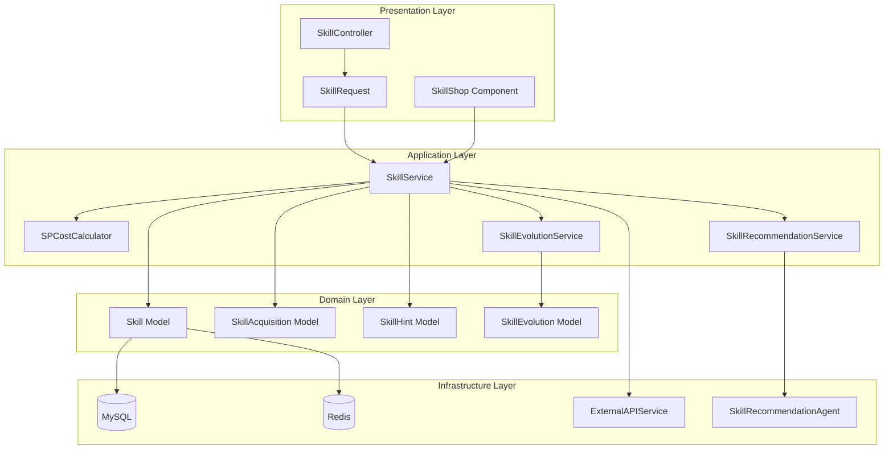

# SPEC-004: Skill Management System - Technical Specification

**Document Version**: 2.2.0  
**Date**: 2026-01-27  
**Project**: Umamusume Pretty Derby Career Planner  
**Status**: Active - Updated with January 2026 schema enhancements  
**Classification**: Internal - Development Team

---

## Document Information

| Attribute | Value |
|-----------|-------|
| **Document ID** | SPEC-004 |
| **Related PRD** | [PRD-004: Skill Management](../prds/PRD-004_Skill_Management.md) |
| **Architecture Version** | v2.0.0 |
| **Approval Status** | Approved |
| **Last Reviewed** | 2026-01-24 |

### Related Documents

**Requirements & Design**:

- [SRS Section 3.4: Skill Management](../003_SRS_Software_Requirement_Specifications.md#34-skill-management)
- [SDS Section 4.4: Skill Management Architecture](../004_SDS_Software_Design_Specifications.md#44-skill-management-module)

**Data & Integration**:

- [DBD Section 5.4: Skill Tables](../009_DBD_Database_Documentation.md#54-skill-tables)
- [API Section 4.4: Skill Endpoints](../010_API_API_Documentation.md#44-skill-endpoints)

**Visual Documentation**:

- [FLOW-004: Skill Management System](../flows/FLOW-004_Skill_Management_System.md)
- [SEQ-003: Skill Acquisition and Upgrade](../sequences/SEQ-003_Skill_Acquisition_and_Upgrade.md)
- [WF-008: Skill Shop Interface](../wireframes/WF-008_Skill_Shop_Interface.md)
- [WF-009: Skill Loadout Manager](../wireframes/WF-009_Skill_Loadout_Manager.md)
- [UF-005: Skill Management Flow](../user-flows/UF-005_Skill_Management_Flow.md)

---

## Table of Contents

1. [Technical Overview](#1-technical-overview)
2. [Architecture Design](#2-architecture-design)
3. [Skill Catalog System](#3-skill-catalog-system)
4. [Acquisition & Hint Mechanics](#4-acquisition--hint-mechanics)
5. [Evolution System](#5-evolution-system)
6. [Service Layer](#6-service-layer)
7. [API Specification](#7-api-specification)
8. [Database Schema](#8-database-schema)
9. [AI Integration](#9-ai-integration)
10. [Business Logic](#10-business-logic)
11. [Integration Points](#11-integration-points)
12. [Error Handling](#12-error-handling)
13. [Performance Optimization](#13-performance-optimization)
14. [Security Considerations](#14-security-considerations)
15. [Testing Strategy](#15-testing-strategy)
16. [Appendices](#16-appendices)

---

## 1. Technical Overview

### 1.1 Module Purpose

The Skill Management System handles the complete lifecycle of skills in character development, including cataloging available skills, tracking acquisition during career runs, managing cost reductions through hints, and handling skill evolution mechanics. Skills are critical performance modifiers that activate during races based on specific conditions.

**Core Responsibilities**:

- Skill catalog management with metadata synchronization
- Skill hint tracking with multi-level discount system
- SP (Skill Point) cost calculation with discounts
- Skill acquisition validation and persistence
- Skill evolution logic with prerequisite checking
- AI-powered skill recommendation engine
- Skill loadout optimization for races

### 1.2 Business Context

In Umamusume Pretty Derby, skills provide conditional performance boosts during races:

- **Normal Skills**: Common abilities with basic effects
- **Rare Skills**: Enhanced versions with stronger effects
- **Unique Skills**: Character-specific signature abilities

**Skill Economics**:

- SP Cost: Base cost reduced by hint levels
- Hint Sources: Training events, support cards, race rewards
- Evolution: Normal → Rare upgrades at discounted cost

Strategic skill acquisition directly impacts race performance and career success.

### 1.3 Technical Scope

**In Scope**:

- Skill catalog database with external sync
- Hint tracking with 5-level progression system
- SP cost calculation engine
- Acquisition workflow with validation
- Evolution logic with prerequisite checking
- SP budget optimization algorithms
- AI-powered skill recommendations
- Skill effectiveness analysis for race conditions

**Out of Scope**:

- Race simulation/activation logic (game engine)
- Support card skill provision (SPEC-005)
- Character stat modifications (SPEC-001)
- Training hint generation (SPEC-002)

### 1.4 Technology Stack

| Component | Technology | Version | Purpose |
|-----------|-----------|---------|---------|
| **Framework** | Laravel | 12.x | Application foundation |
| **Language** | PHP | 8.3+ | Server-side logic |
| **Database** | MySQL | 8.0+ | Data persistence |
| **Cache** | Redis | 7.x | Skill metadata caching |
| **AI** | Neuron Framework | 1.x | Recommendation agents |
| **AI Provider (Local)** | Ollama | Latest | Quick recommendations |
| **AI Provider (Cloud)** | AWS Bedrock Claude | 4.5 | Complex optimization |

---

## 2. Architecture Design

### 2.1 Component Architecture



### 2.2 Layer Responsibilities

**Presentation Layer**:

- HTTP request/response handling
- Skill shop UI rendering
- Input validation for acquisitions

**Application Layer**:

- Skill acquisition workflows
- Cost calculation orchestration
- Evolution transaction management
- AI recommendation coordination

**Domain Layer**:

- Skill business rules
- Hint discount logic
- Evolution prerequisites
- SP budgeting algorithms

**Infrastructure Layer**:

- Database persistence
- External API synchronization
- Cache management
- AI service integration

### 2.3 Design Patterns

| Pattern | Implementation | Purpose |
|---------|---------------|---------|
| **Repository** | `SkillRepository` | Abstract data access |
| **Strategy** | Cost calculators | Pluggable discount strategies |
| **Factory** | `SkillAcquisitionFactory` | Acquisition object creation |
| **Observer** | Event listeners | React to skill events |
| **Specification** | Evolution validators | Complex prerequisite rules |
| **Cache-Aside** | Skill catalog | Performance optimization |

---

## 3. Skill Catalog System

### 3.1 Skill Model

The core skill entity representing available abilities.

```php
<?php

namespace App\Models;

use App\Enums\{SkillRarity, SkillType, SkillCategory};
use Illuminate\Database\Eloquent\Model;
use Illuminate\Database\Eloquent\Factories\HasFactory;

/**
 * Skill Entity
 * 
 * Represents a skill definition in the game database.
 * 
 * @property int $id
 * @property string $name
 * @property string|null $name_jp
 * @property string $description
 * @property SkillType $skill_type
 * @property SkillRarity $rarity
 * @property SkillCategory $category
 * @property int $base_sp_cost
 * @property string|null $icon_path
 * @property int|null $evolution_from_id
 * @property array|null $conditions
 * @property array|null $effects
 * @property \Carbon\Carbon $created_at
 * @property \Carbon\Carbon $updated_at
 */
class Skill extends Model
{
    use HasFactory;

    protected $table = 'ucp_skills';

    protected $fillable = [
        'name',
        'name_jp',
        'description',
        'skill_type',
        'rarity',
        'category',
        'base_sp_cost',
        'icon_path',
        'evolution_from_id',
        'conditions',
        'effects',
    ];

    protected $casts = [
        'skill_type' => SkillType::class,
        'rarity' => SkillRarity::class,
        'category' => SkillCategory::class,
        'base_sp_cost' => 'integer',
        'evolution_from_id' => 'integer',
        'conditions' => 'array',
        'effects' => 'array',
        'created_at' => 'datetime',
        'updated_at' => 'datetime',
    ];

    // Relationships

    public function evolutions()
    {
        return $this->hasMany(Skill::class, 'evolution_from_id');
    }

    public function preEvolution()
    {
        return $this->belongsTo(Skill::class, 'evolution_from_id');
    }

    public function acquisitions()
    {
        return $this->hasMany(SkillAcquisition::class);
    }

    public function hints()
    {
        return $this->hasMany(SkillHint::class);
    }

    // Business Methods

    public function hasEvolution(): bool
    {
        return $this->evolutions()->exists();
    }

    public function isEvolution(): bool
    {
        return $this->evolution_from_id !== null;
    }

    public function matchesConditions(array $context): bool
    {
        if (empty($this->conditions)) {
            return true; // Universal skill
        }

        // Check distance conditions
        if (isset($this->conditions['distance'])) {
            if (!in_array($context['distance_type'] ?? null, $this->conditions['distance'])) {
                return false;
            }
        }

        // Check surface conditions
        if (isset($this->conditions['surface'])) {
            if (!in_array($context['surface'] ?? null, $this->conditions['surface'])) {
                return false;
            }
        }

        // Check running style conditions
        if (isset($this->conditions['running_style'])) {
            if (!in_array($context['running_style'] ?? null, $this->conditions['running_style'])) {
                return false;
            }
        }

        // Check track condition
        if (isset($this->conditions['track_condition'])) {
            if (!in_array($context['track_condition'] ?? null, $this->conditions['track_condition'])) {
                return false;
            }
        }

        return true;
    }

    public function getEffectiveness(array $context): float
    {
        if (!$this->matchesConditions($context)) {
            return 0.0;
        }

        // Base effectiveness
        $effectiveness = match ($this->rarity) {
            SkillRarity::Unique => 1.5,
            SkillRarity::Rare => 1.2,
            SkillRarity::Normal => 1.0,
        };

        // Contextual bonuses
        $conditionMatches = 0;
        $totalConditions = 0;

        foreach (['distance', 'surface', 'running_style'] as $condition) {
            if (isset($this->conditions[$condition])) {
                $totalConditions++;
                if (in_array($context["{$condition}_type"] ?? null, $this->conditions[$condition])) {
                    $conditionMatches++;
                }
            }
        }

        if ($totalConditions > 0) {
            $matchRatio = $conditionMatches / $totalConditions;
            $effectiveness *= (0.8 + ($matchRatio * 0.2)); // 80-100% based on match
        }

        return $effectiveness;
    }
}
```

### 3.2 Skill Enumerations

**SkillType**:

```php
<?php

namespace App\Enums;

enum SkillType: string
{
    case Acceleration = 'acceleration';
    case Speed = 'speed';
    case Stamina = 'stamina';
    case Power = 'power';
    case Guts = 'guts';
    case Wit = 'wit';
    case Recovery = 'recovery';
    case Debuff = 'debuff';
    case Special = 'special';
}
```

**SkillRarity**:

```php
<?php

namespace App\Enums;

enum SkillRarity: string
{
    case Normal = 'normal';
    case Rare = 'rare';
    case Unique = 'unique';
    
    public function getBaseCostMultiplier(): float
    {
        return match($this) {
            self::Normal => 1.0,
            self::Rare => 1.5,
            self::Unique => 2.0,
        };
    }
}
```

**SkillCategory**:

```php
<?php

namespace App\Enums;

enum SkillCategory: string
{
    case StartDash = 'start_dash';
    case Positioning = 'positioning';
    case InTheRun = 'in_the_run';
    case LastSpurt = 'last_spurt';
    case LaneChange = 'lane_change';
    case Recovery = 'recovery';
    case Debuff = 'debuff';
    case Passive = 'passive';
}
```

### 3.3 Skill Search and Filtering

```php
<?php

namespace App\Services\Skill;

use App\Models\Skill;
use Illuminate\Database\Eloquent\Builder;

/**
 * Skill Search Service
 * 
 * Provides advanced filtering and search capabilities for skills.
 */
class SkillSearchService
{
    /**
     * Search skills with filters
     * 
     * @param array $filters
     * @return \Illuminate\Contracts\Pagination\LengthAwarePaginator
     */
    public function search(array $filters = [])
    {
        $query = Skill::query();

        // Text search
        if (!empty($filters['search'])) {
            $query->where(function (Builder $q) use ($filters) {
                $q->where('name', 'like', "%{$filters['search']}%")
                  ->orWhere('name_jp', 'like', "%{$filters['search']}%")
                  ->orWhere('description', 'like', "%{$filters['search']}%");
            });
        }

        // Skill type filter
        if (!empty($filters['skill_type'])) {
            $query->where('skill_type', $filters['skill_type']);
        }

        // Rarity filter
        if (!empty($filters['rarity'])) {
            $query->where('rarity', $filters['rarity']);
        }

        // Category filter
        if (!empty($filters['category'])) {
            $query->where('category', $filters['category']);
        }

        // Distance condition filter
        if (!empty($filters['distance'])) {
            $query->whereJsonContains('conditions->distance', $filters['distance']);
        }

        // Surface condition filter
        if (!empty($filters['surface'])) {
            $query->whereJsonContains('conditions->surface', $filters['surface']);
        }

        // Running style filter
        if (!empty($filters['running_style'])) {
            $query->whereJsonContains('conditions->running_style', $filters['running_style']);
        }

        // SP cost range filter
        if (!empty($filters['min_cost'])) {
            $query->where('base_sp_cost', '>=', $filters['min_cost']);
        }
        if (!empty($filters['max_cost'])) {
            $query->where('base_sp_cost', '<=', $filters['max_cost']);
        }

        // Evolution filter
        if (isset($filters['is_evolution'])) {
            if ($filters['is_evolution']) {
                $query->whereNotNull('evolution_from_id');
            } else {
                $query->whereNull('evolution_from_id');
            }
        }

        // Sorting
        $sortBy = $filters['sort_by'] ?? 'name';
        $sortOrder = $filters['sort_order'] ?? 'asc';
        
        $query->orderBy($sortBy, $sortOrder);

        return $query->paginate($filters['per_page'] ?? 20);
    }

    /**
     * Get skills relevant for race context
     * 
     * @param array $raceContext
     * @return \Illuminate\Support\Collection
     */
    public function getRelevantSkills(array $raceContext)
    {
        return Skill::all()->filter(function ($skill) use ($raceContext) {
            return $skill->matchesConditions($raceContext);
        })->sortByDesc(function ($skill) use ($raceContext) {
            return $skill->getEffectiveness($raceContext);
        });
    }
}
```

---

## 4. Acquisition & Hint Mechanics

### 4.1 Skill Hint Model

Tracks hint levels for SP cost discounts.

```php
<?php

namespace App\Models;

use Illuminate\Database\Eloquent\Model;

/**
 * Skill Hint Entity
 * 
 * Tracks hint levels that reduce skill acquisition costs.
 * 
 * @property int $id
 * @property int $character_id
 * @property int $skill_id
 * @property int $level Hint level (1-5)
 * @property string $source_type 'training', 'event', 'race', 'support_card'
 * @property int|null $source_id
 * @property \Carbon\Carbon $created_at
 */
class SkillHint extends Model
{
    protected $table = 'ucp_skill_hints';

    public $timestamps = false;

    protected $fillable = [
        'character_id',
        'skill_id',
        'level',
        'source_type',
        'source_id',
    ];

    protected $casts = [
        'character_id' => 'integer',
        'skill_id' => 'integer',
        'level' => 'integer',
        'source_id' => 'integer',
        'created_at' => 'datetime',
    ];

    protected $attributes = [
        'level' => 1,
    ];

    // Relationships

    public function character()
    {
        return $this->belongsTo(Character::class);
    }

    public function skill()
    {
        return $this->belongsTo(Skill::class);
    }

    // Business Methods

    public function increaseLevel(int $amount = 1): void
    {
        $this->level = min(5, $this->level + $amount);
    }

    public function getDiscountPercentage(): int
    {
        return match ($this->level) {
            1 => 10,
            2 => 20,
            3 => 30,
            4 => 40,
            5 => 40, // Max cap
            default => 0,
        };
    }
}
```

### 4.2 SP Cost Calculator

Calculates final skill costs with hint discounts.

```php
<?php

namespace App\Services\Skill;

use App\Models\{Skill, SkillHint, Character};

/**
 * SP Cost Calculator
 * 
 * Calculates final skill acquisition costs with hint discounts.
 */
class SPCostCalculator
{
    /**
     * Hint level discount percentages
     */
    private const DISCOUNT_MAP = [
        0 => 0,
        1 => 10,
        2 => 20,
        3 => 30,
        4 => 40,
        5 => 40, // Max discount
    ];

    /**
     * Scenario-specific discount modifiers
     */
    private const SCENARIO_MODIFIERS = [
        'ura_finale' => 1.0,
        'aohari_cup' => 0.95, // 5% discount
        'make_cup_debut' => 0.90, // 10% discount
        'grand_masters' => 1.05, // 5% increase
        'project_larc' => 0.85, // 15% discount
    ];

    /**
     * Calculate final SP cost for skill acquisition
     * 
     * @param Skill $skill
     * @param Character $character
     * @param SkillHint|null $hint
     * @return int
     */
    public function calculateFinalCost(
        Skill $skill,
        Character $character,
        ?SkillHint $hint = null
    ): int {
        $baseCost = $skill->base_sp_cost;

        // Apply hint discount
        $hintDiscount = 0;
        if ($hint) {
            $hintDiscount = self::DISCOUNT_MAP[$hint->level] ?? 0;
        }

        $costAfterHint = $baseCost * (1 - ($hintDiscount / 100));

        // Apply scenario modifier
        $scenarioModifier = self::SCENARIO_MODIFIERS[$character->scenario_type->value] ?? 1.0;
        $finalCost = $costAfterHint * $scenarioModifier;

        return max(1, (int) floor($finalCost)); // Minimum 1 SP
    }

    /**
     * Calculate costs for multiple skills
     * 
     * @param array $skillIds
     * @param Character $character
     * @return array
     */
    public function calculateBulkCosts(array $skillIds, Character $character): array
    {
        $skills = Skill::whereIn('id', $skillIds)->get()->keyBy('id');
        $hints = SkillHint::where('character_id', $character->id)
            ->whereIn('skill_id', $skillIds)
            ->get()
            ->keyBy('skill_id');

        $costs = [];

        foreach ($skillIds as $skillId) {
            $skill = $skills->get($skillId);
            if (!$skill) {
                continue;
            }

            $hint = $hints->get($skillId);
            $costs[$skillId] = [
                'skill_name' => $skill->name,
                'base_cost' => $skill->base_sp_cost,
                'hint_level' => $hint?->level ?? 0,
                'hint_discount' => $hint ? self::DISCOUNT_MAP[$hint->level] : 0,
                'final_cost' => $this->calculateFinalCost($skill, $character, $hint),
            ];
        }

        return $costs;
    }

    /**
     * Get maximum affordable skills within SP budget
     * 
     * @param Character $character
     * @param int $availableSP
     * @param array $skillIds
     * @return array
     */
    public function getAffordableSkills(
        Character $character,
        int $availableSP,
        array $skillIds
    ): array {
        $costs = $this->calculateBulkCosts($skillIds, $character);

        // Sort by cost efficiency (effectiveness / cost)
        uasort($costs, fn($a, $b) => $a['final_cost'] <=> $b['final_cost']);

        $affordable = [];
        $remainingSP = $availableSP;

        foreach ($costs as $skillId => $costData) {
            if ($costData['final_cost'] <= $remainingSP) {
                $affordable[] = array_merge(['skill_id' => $skillId], $costData);
                $remainingSP -= $costData['final_cost'];
            }
        }

        return [
            'affordable_skills' => $affordable,
            'remaining_sp' => $remainingSP,
            'total_cost' => $availableSP - $remainingSP,
        ];
    }
}
```

### 4.3 Skill Acquisition Model

```php
<?php

namespace App\Models;

use Illuminate\Database\Eloquent\Model;

/**
 * Skill Acquisition Entity
 * 
 * Pivot record linking characters to acquired skills.
 * 
 * @property int $id
 * @property int $career_id
 * @property int $character_id
 * @property int $skill_id
 * @property int $sp_cost_paid
 * @property bool $is_evolution
 * @property int|null $turn_acquired
 * @property \Carbon\Carbon $acquired_at
 */
class SkillAcquisition extends Model
{
    protected $table = 'ucp_skill_acquisitions';

    const UPDATED_AT = null;
    const CREATED_AT = 'acquired_at';

    protected $fillable = [
        'career_id',
        'character_id',
        'skill_id',
        'sp_cost_paid',
        'is_evolution',
        'turn_acquired',
    ];

    protected $casts = [
        'career_id' => 'integer',
        'character_id' => 'integer',
        'skill_id' => 'integer',
        'sp_cost_paid' => 'integer',
        'is_evolution' => 'boolean',
        'turn_acquired' => 'integer',
        'acquired_at' => 'datetime',
    ];

    // Relationships

    public function career()
    {
        return $this->belongsTo(CareerRun::class, 'career_id');
    }

    public function character()
    {
        return $this->belongsTo(Character::class);
    }

    public function skill()
    {
        return $this->belongsTo(Skill::class);
    }
}
```

---

## 5. Evolution System

### 5.1 Evolution Service

Handles skill evolution logic and validation.

```php
<?php

namespace App\Services\Skill;

use App\Models\{Character, Skill, SkillHint, SkillAcquisition};
use App\Exceptions\{SkillEvolutionException, InsufficientSPException};
use Illuminate\Support\Facades\DB;

/**
 * Skill Evolution Service
 * 
 * Manages skill evolution from normal to rare versions.
 */
class SkillEvolutionService
{
    public function __construct(
        private SPCostCalculator $costCalculator
    ) {}

    /**
     * Evolve a skill to its rare version
     * 
     * @param Character $character
     * @param Skill $baseSkill
     * @param Skill $targetSkill
     * @param int $careerRunId
     * @return SkillAcquisition
     * @throws SkillEvolutionException
     * @throws InsufficientSPException
     */
    public function evolveSkill(
        Character $character,
        Skill $baseSkill,
        Skill $targetSkill,
        int $careerRunId
    ): SkillAcquisition {
        return DB::transaction(function () use ($character, $baseSkill, $targetSkill, $careerRunId) {
            // Validate evolution is possible
            $this->validateEvolution($character, $baseSkill, $targetSkill);

            // Get existing acquisition
            $baseAcquisition = SkillAcquisition::where('character_id', $character->id)
                ->where('skill_id', $baseSkill->id)
                ->firstOrFail();

            // Calculate upgrade cost
            $hint = SkillHint::where('character_id', $character->id)
                ->where('skill_id', $targetSkill->id)
                ->first();

            $targetCost = $this->costCalculator->calculateFinalCost($targetSkill, $character, $hint);
            $paidCost = $baseAcquisition->sp_cost_paid;
            $upgradeCost = max(0, $targetCost - $paidCost);

            // Check SP availability
            $career = CareerRun::findOrFail($careerRunId);
            if ($career->skill_points < $upgradeCost) {
                throw new InsufficientSPException(
                    "Insufficient SP. Need {$upgradeCost}, have {$career->skill_points}"
                );
            }

            // Deduct SP
            $career->decrement('skill_points', $upgradeCost);

            // Remove base skill
            $baseAcquisition->delete();

            // Add evolved skill
            $acquisition = SkillAcquisition::create([
                'career_id' => $careerRunId,
                'character_id' => $character->id,
                'skill_id' => $targetSkill->id,
                'sp_cost_paid' => $paidCost + $upgradeCost,
                'is_evolution' => true,
                'turn_acquired' => $career->current_turn,
            ]);

            // Transfer hint if exists
            $baseHint = SkillHint::where('character_id', $character->id)
                ->where('skill_id', $baseSkill->id)
                ->first();

            if ($baseHint && !$hint) {
                SkillHint::create([
                    'character_id' => $character->id,
                    'skill_id' => $targetSkill->id,
                    'level' => $baseHint->level,
                    'source_type' => 'evolution',
                ]);
            }

            // Fire event
            event(new \App\Events\SkillEvolved($character, $baseSkill, $targetSkill));

            return $acquisition;
        });
    }

    /**
     * Validate evolution prerequisites
     * 
     * @param Character $character
     * @param Skill $baseSkill
     * @param Skill $targetSkill
     * @return void
     * @throws SkillEvolutionException
     */
    private function validateEvolution(
        Character $character,
        Skill $baseSkill,
        Skill $targetSkill
    ): void {
        // Verify target is evolution of base
        if ($targetSkill->evolution_from_id !== $baseSkill->id) {
            throw new SkillEvolutionException(
                "Target skill is not an evolution of the base skill"
            );
        }

        // Verify character owns base skill
        $ownsBase = SkillAcquisition::where('character_id', $character->id)
            ->where('skill_id', $baseSkill->id)
            ->exists();

        if (!$ownsBase) {
            throw new SkillEvolutionException(
                "Character does not own the base skill"
            );
        }

        // Verify character doesn't already own evolved version
        $ownsEvolved = SkillAcquisition::where('character_id', $character->id)
            ->where('skill_id', $targetSkill->id)
            ->exists();

        if ($ownsEvolved) {
            throw new SkillEvolutionException(
                "Character already owns the evolved skill"
            );
        }
    }

    /**
     * Get available evolutions for character
     * 
     * @param Character $character
     * @return \Illuminate\Support\Collection
     */
    public function getAvailableEvolutions(Character $character)
    {
        $ownedSkills = SkillAcquisition::where('character_id', $character->id)
            ->with('skill.evolutions')
            ->get();

        $evolutions = collect();

        foreach ($ownedSkills as $acquisition) {
            $skill = $acquisition->skill;
            
            foreach ($skill->evolutions as $evolution) {
                // Check if already owned
                $alreadyOwned = SkillAcquisition::where('character_id', $character->id)
                    ->where('skill_id', $evolution->id)
                    ->exists();

                if (!$alreadyOwned) {
                    $hint = SkillHint::where('character_id', $character->id)
                        ->where('skill_id', $evolution->id)
                        ->first();

                    $targetCost = $this->costCalculator->calculateFinalCost($evolution, $character, $hint);
                    $upgradeCost = max(0, $targetCost - $acquisition->sp_cost_paid);

                    $evolutions->push([
                        'base_skill' => $skill,
                        'evolved_skill' => $evolution,
                        'base_cost_paid' => $acquisition->sp_cost_paid,
                        'target_cost' => $targetCost,
                        'upgrade_cost' => $upgradeCost,
                        'hint_level' => $hint?->level ?? 0,
                    ]);
                }
            }
        }

        return $evolutions->sortBy('upgrade_cost');
    }
}
```

---

## 6. Service Layer

### 6.1 Skill Service

Main orchestration service for skill operations.

```php
<?php

namespace App\Services\Skill;

use App\Models\{Skill, Character, SkillHint, SkillAcquisition, CareerRun};
use App\Repositories\SkillRepository;
use App\Services\External\ExternalAPIService;
use App\Exceptions\{InsufficientSPException, SkillAlreadyOwnedException};
use Illuminate\Support\Facades\{DB, Cache};

/**
 * Skill Management Service
 * 
 * Handles skill-related business operations.
 */
class SkillService
{
    public function __construct(
        private SkillRepository $repository,
        private SPCostCalculator $costCalculator,
        private SkillEvolutionService $evolutionService,
        private ExternalAPIService $externalApi
    ) {}

    /**
     * Acquire a skill for character
     * 
     * @param Character $character
     * @param int $skillId
     * @param int $careerRunId
     * @param bool $useHint
     * @return SkillAcquisition
     * @throws InsufficientSPException
     * @throws SkillAlreadyOwnedException
     */
    public function acquireSkill(
        Character $character,
        int $skillId,
        int $careerRunId,
        bool $useHint = true
    ): SkillAcquisition {
        return DB::transaction(function () use ($character, $skillId, $careerRunId, $useHint) {
            $skill = Skill::findOrFail($skillId);

            // Validate not already owned
            $this->validateNotOwned($character, $skill);

            // Get hint if applicable
            $hint = null;
            if ($useHint) {
                $hint = SkillHint::where('character_id', $character->id)
                    ->where('skill_id', $skillId)
                    ->first();
            }

            // Calculate cost
            $cost = $this->costCalculator->calculateFinalCost($skill, $character, $hint);

            // Validate SP availability
            $career = CareerRun::findOrFail($careerRunId);
            if ($career->skill_points < $cost) {
                throw new InsufficientSPException(
                    "Insufficient SP. Need {$cost}, have {$career->skill_points}"
                );
            }

            // Deduct SP
            $career->decrement('skill_points', $cost);

            // Create acquisition record
            $acquisition = SkillAcquisition::create([
                'career_id' => $careerRunId,
                'character_id' => $character->id,
                'skill_id' => $skillId,
                'sp_cost_paid' => $cost,
                'is_evolution' => false,
                'turn_acquired' => $career->current_turn,
            ]);

            // Mark hint as used (optional: delete or flag)
            if ($hint) {
                // Keep hint for reference, but could add 'used' flag
            }

            // Fire event
            event(new \App\Events\SkillAcquired($character, $skill, $cost));

            return $acquisition;
        });
    }

    /**
     * Add skill hint to character
     * 
     * @param int $characterId
     * @param int $skillId
     * @param int $level
     * @param string $sourceType
     * @param int|null $sourceId
     * @return SkillHint
     */
    public function addHint(
        int $characterId,
        int $skillId,
        int $level = 1,
        string $sourceType = 'training',
        ?int $sourceId = null
    ): SkillHint {
        // Check if hint already exists
        $existing = SkillHint::where('character_id', $characterId)
            ->where('skill_id', $skillId)
            ->first();

        if ($existing) {
            // Increase level
            $existing->increaseLevel($level);
            $existing->save();
            return $existing;
        }

        // Create new hint
        return SkillHint::create([
            'character_id' => $characterId,
            'skill_id' => $skillId,
            'level' => min(5, $level),
            'source_type' => $sourceType,
            'source_id' => $sourceId,
        ]);
    }

    /**
     * Get skills available for acquisition
     * 
     * @param Character $character
     * @param array $filters
     * @return \Illuminate\Support\Collection
     */
    public function getAvailableSkills(Character $character, array $filters = [])
    {
        $ownedSkillIds = SkillAcquisition::where('character_id', $character->id)
            ->pluck('skill_id')
            ->toArray();

        $searchService = app(SkillSearchService::class);
        $skills = $searchService->search($filters);

        // Filter out owned skills
        return $skills->reject(function ($skill) use ($ownedSkillIds) {
            return in_array($skill->id, $ownedSkillIds);
        });
    }

    /**
     * Get skills with costs for character
     * 
     * @param Character $character
     * @param array $skillIds
     * @return array
     */
    public function getSkillsWithCosts(Character $character, array $skillIds): array
    {
        return $this->costCalculator->calculateBulkCosts($skillIds, $character);
    }

    /**
     * Sync skill definitions from external API
     * 
     * @return int
     */
    public function syncSkillDefinitions(): int
    {
        $externalSkills = $this->externalApi->getSkills();
        $syncedCount = 0;

        foreach ($externalSkills as $externalSkill) {
            $this->repository->updateOrCreate(
                ['id' => $externalSkill['id']],
                [
                    'name' => $externalSkill['name'],
                    'name_jp' => $externalSkill['name_jp'] ?? null,
                    'description' => $externalSkill['description'] ?? '',
                    'skill_type' => $externalSkill['type'],
                    'rarity' => $externalSkill['rarity'],
                    'category' => $externalSkill['category'],
                    'base_sp_cost' => $externalSkill['sp_cost'],
                    'icon_path' => $externalSkill['icon_url'] ?? null,
                    'conditions' => $externalSkill['conditions'] ?? null,
                    'effects' => $externalSkill['effects'] ?? null,
                ]
            );

            $syncedCount++;
        }

        Cache::tags(['skills'])->flush();

        return $syncedCount;
    }

    /**
     * Validate skill is not already owned
     * 
     * @param Character $character
     * @param Skill $skill
     * @return void
     * @throws SkillAlreadyOwnedException
     */
    private function validateNotOwned(Character $character, Skill $skill): void
    {
        $exists = SkillAcquisition::where('character_id', $character->id)
            ->where('skill_id', $skill->id)
            ->exists();

        if ($exists) {
            throw new SkillAlreadyOwnedException(
                "Character already owns skill: {$skill->name}"
            );
        }
    }
}
```

---

## 7. API Specification

### 7.1 Endpoint Overview

| Method | Endpoint | Description | Auth Required |
|--------|----------|-------------|---------------|
| GET | `/api/v1/skills` | List/search skills | Yes |
| GET | `/api/v1/skills/{id}` | Get skill details | Yes |
| GET | `/api/v1/characters/{id}/skills` | Get acquired skills | Yes |
| POST | `/api/v1/characters/{id}/skills/acquire` | Acquire skill | Yes |
| POST | `/api/v1/characters/{id}/skills/evolve` | Evolve skill | Yes |
| POST | `/api/v1/characters/{id}/skills/hint` | Add skill hint | Yes |
| GET | `/api/v1/characters/{id}/skills/available` | Get available skills with costs | Yes |
| GET | `/api/v1/characters/{id}/skills/evolutions` | Get available evolutions | Yes |

### 7.2 List Skills

**Endpoint**: `GET /api/v1/skills`

**Query Parameters**:

- `search` (optional): Text search
- `skill_type` (optional): acceleration, speed, stamina, etc.
- `rarity` (optional): normal, rare, unique
- `category` (optional): start_dash, positioning, etc.
- `distance` (optional): sprint, mile, medium, long
- `surface` (optional): turf, dirt
- `running_style` (optional): front_runner, pace_chaser, etc.
- `min_cost`, `max_cost` (optional): SP cost range
- `is_evolution` (optional): true/false
- `sort_by` (optional): name, base_sp_cost, rarity
- `sort_order` (optional): asc, desc
- `per_page` (optional): Results per page

**Success Response** (200 OK):

```json
{
    "data": [
        {
            "id": 101,
            "name": "Lane Guidance",
            "name_jp": "コーナー回復○",
            "description": "Recovers stamina slightly when exiting corners",
            "skill_type": "recovery",
            "rarity": "normal",
            "category": "in_the_run",
            "base_sp_cost": 120,
            "icon_path": "/icons/skills/lane_guidance.png",
            "conditions": {
                "distance": ["mile", "medium"],
                "surface": ["turf"]
            },
            "effects": {
                "stamina_recovery": 10
            },
            "has_evolution": true
        }
    ],
    "meta": {
        "current_page": 1,
        "total": 247
    }
}
```

### 7.3 Acquire Skill

**Endpoint**: `POST /api/v1/characters/{id}/skills/acquire`

**Request Body**:

```json
{
    "skill_id": 101,
    "career_run_id": "uuid-here",
    "use_hint": true
}
```

**Success Response** (201 Created):

```json
{
    "data": {
        "skill": {
            "id": 101,
            "name": "Lane Guidance"
        },
        "cost_paid": 96,
        "cost_breakdown": {
            "base_cost": 120,
            "hint_level": 2,
            "hint_discount": 20,
            "scenario_modifier": 1.0,
            "final_cost": 96
        },
        "remaining_sp": 204,
        "turn_acquired": 45
    }
}
```

### 7.4 Evolve Skill

**Endpoint**: `POST /api/v1/characters/{id}/skills/evolve`

**Request Body**:

```json
{
    "base_skill_id": 101,
    "target_skill_id": 201,
    "career_run_id": "uuid-here"
}
```

**Success Response** (200 OK):

```json
{
    "data": {
        "base_skill": {
            "id": 101,
            "name": "Lane Guidance"
        },
        "evolved_skill": {
            "id": 201,
            "name": "Arc Maestro"
        },
        "costs": {
            "base_cost_paid": 96,
            "target_cost": 180,
            "upgrade_cost": 84
        },
        "remaining_sp": 120
    }
}
```

### 7.5 Get Available Skills with Costs

**Endpoint**: `GET /api/v1/characters/{id}/skills/available`

**Query Parameters**:

- `career_run_id` (required): Career run context
- `race_context` (optional): JSON encoded race context for relevance filtering

**Success Response** (200 OK):

```json
{
    "data": [
        {
            "skill_id": 102,
            "name": "Corner Acceleration",
            "base_cost": 150,
            "hint_level": 3,
            "hint_discount": 30,
            "final_cost": 105,
            "effectiveness": 1.35,
            "is_relevant": true
        }
    ],
    "meta": {
        "total_skills": 124,
        "with_hints": 42,
        "average_discount": 18.5
    }
}
```

---

## 8. Database Schema

### 8.1 Table: `ucp_skills`

Master skill catalog.

```sql
CREATE TABLE ucp_skills (
    id BIGINT UNSIGNED AUTO_INCREMENT PRIMARY KEY,
    name VARCHAR(255) NOT NULL,
    name_jp VARCHAR(255) NULL,
    name_en VARCHAR(255) NULL COMMENT 'NEW: English skill name for i18n',
    description TEXT NOT NULL,
    skill_type VARCHAR(50) NOT NULL COMMENT 'acceleration, speed, stamina, etc.',
    rarity ENUM('normal', 'rare', 'unique') NOT NULL,
    category VARCHAR(50) NOT NULL COMMENT 'start_dash, positioning, etc.',
    status ENUM('active', 'deprecated', 'unreleased') NOT NULL DEFAULT 'active' COMMENT 'NEW: Skill availability status',
    base_sp_cost SMALLINT UNSIGNED NOT NULL,
    icon_path VARCHAR(500) NULL,
    evolution_from_id BIGINT UNSIGNED NULL COMMENT 'Base skill for evolutions',
    conditions JSON NULL COMMENT 'Activation conditions',
    effects JSON NULL COMMENT 'Skill effects and values',
    created_at TIMESTAMP NOT NULL DEFAULT CURRENT_TIMESTAMP,
    updated_at TIMESTAMP NOT NULL DEFAULT CURRENT_TIMESTAMP ON UPDATE CURRENT_TIMESTAMP,
    
    FOREIGN KEY (evolution_from_id) REFERENCES ucp_skills(id) ON DELETE SET NULL,
    INDEX idx_skill_type (skill_type),
    INDEX idx_rarity (rarity),
    INDEX idx_category (category),
    INDEX idx_status (status),
    INDEX idx_evolution_from (evolution_from_id),
    FULLTEXT idx_search (name, name_en, description)
) ENGINE=InnoDB DEFAULT CHARSET=utf8mb4 COLLATE=utf8mb4_unicode_ci;
```

### 8.2 Table: `ucp_skill_hints`

Hint tracking for SP discounts.

```sql
CREATE TABLE ucp_skill_hints (
    id BIGINT UNSIGNED AUTO_INCREMENT PRIMARY KEY,
    character_id BIGINT UNSIGNED NOT NULL,
    skill_id BIGINT UNSIGNED NOT NULL,
    level TINYINT UNSIGNED NOT NULL DEFAULT 1 CHECK (level BETWEEN 1 AND 5),
    source_type VARCHAR(50) NOT NULL COMMENT 'training, event, race, support_card',
    source_id BIGINT UNSIGNED NULL COMMENT 'ID of source entity',
    created_at TIMESTAMP NOT NULL DEFAULT CURRENT_TIMESTAMP,
    
    FOREIGN KEY (character_id) REFERENCES ucp_characters(id) ON DELETE CASCADE,
    FOREIGN KEY (skill_id) REFERENCES ucp_skills(id) ON DELETE CASCADE,
    UNIQUE KEY unique_character_skill (character_id, skill_id),
    INDEX idx_character_id (character_id),
    INDEX idx_skill_id (skill_id),
    INDEX idx_level (level)
) ENGINE=InnoDB DEFAULT CHARSET=utf8mb4 COLLATE=utf8mb4_unicode_ci;
```

### 8.3 Table: `ucp_skill_acquisitions`

Record of acquired skills.

```sql
CREATE TABLE ucp_skill_acquisitions (
    id BIGINT UNSIGNED AUTO_INCREMENT PRIMARY KEY,
    career_id BIGINT UNSIGNED NOT NULL,
    character_id BIGINT UNSIGNED NOT NULL,
    skill_id BIGINT UNSIGNED NOT NULL,
    sp_cost_paid SMALLINT UNSIGNED NOT NULL,
    is_evolution BOOLEAN NOT NULL DEFAULT FALSE,
    turn_acquired TINYINT UNSIGNED NULL,
    hint_level TINYINT UNSIGNED NULL DEFAULT 0 COMMENT 'NEW: Hint level at acquisition (0-5)',
    hint_count INT UNSIGNED NULL DEFAULT 0 COMMENT 'NEW: Total hints received for this skill',
    first_hint_at TIMESTAMP NULL COMMENT 'NEW: When first hint was received',
    last_hint_at TIMESTAMP NULL COMMENT 'NEW: When last hint was received',
    acquired_at TIMESTAMP NOT NULL DEFAULT CURRENT_TIMESTAMP,
    
    FOREIGN KEY (career_id) REFERENCES ucp_careers(id) ON DELETE CASCADE,
    FOREIGN KEY (character_id) REFERENCES ucp_characters(id) ON DELETE CASCADE,
    FOREIGN KEY (skill_id) REFERENCES ucp_skills(id) ON DELETE CASCADE,
    UNIQUE KEY unique_character_skill (character_id, skill_id),
    INDEX idx_career_id (career_id),
    INDEX idx_character_id (character_id),
    INDEX idx_is_evolution (is_evolution),
    INDEX idx_hint_level (hint_level)
) ENGINE=InnoDB DEFAULT CHARSET=utf8mb4 COLLATE=utf8mb4_unicode_ci;
```

---

## 9. AI Integration

### 9.1 Skill Recommendation Agent

**Agent Class**: `App\Neuron\Agents\SkillRecommendationAgent`

**System Prompt**:

```text
You are an expert Umamusume skill optimization strategist.

Analyze the character's current state and race context to recommend optimal skills.

**Character State:**
- Name: {{ character_name }}
- Stats: Speed {{ speed }}, Stamina {{ stamina }}, Power {{ power }}, Guts {{ guts }}, Wit {{ wit }}
- Available SP: {{ available_sp }}
- Current Skills: {{ current_skills }}
- Running Style: {{ running_style }}

**Race Context:**
- Upcoming Race: {{ race_name }} ({{ distance }}m, {{ surface }})
- Distance Type: {{ distance_type }}
- Track Condition: {{ track_condition }}

**Available Skills:**
{{ available_skills_json }}

**Task:**
Recommend top 5 skills to acquire, prioritizing race relevance and cost efficiency.

**Output Format (JSON):**
{
    "recommendations": [
        {
            "skill_id": 123,
            "priority": 1-5,
            "reasoning": "Why this skill is recommended",
            "effectiveness": 0.0-1.0
        }
    ],
    "total_cost": 450,
    "strategy_note": "Overall skill build strategy"
}
```

**Available Tools**:

```php
[
    'SkillCostTool' => 'Calculate costs with hints',
    'SkillEffectivenessTool' => 'Evaluate skill effectiveness for race',
    'SPBudgetTool' => 'Optimize skill selection within budget',
]
```

### 9.2 Skill Recommendation Service

```php
<?php

namespace App\Services\Skill;

use App\Models\{Character, RaceDefinition};
use App\Services\AI\AIAdvisoryService;
use App\Neuron\Agents\SkillRecommendationAgent;

/**
 * AI-Powered Skill Recommendation Service
 */
class SkillRecommendationService
{
    public function __construct(
        private SkillRecommendationAgent $agent,
        private AIAdvisoryService $aiService,
        private SkillSearchService $searchService,
        private SPCostCalculator $costCalculator
    ) {}

    /**
     * Get AI recommendations for skills
     * 
     * @param Character $character
     * @param int $careerRunId
     * @param RaceDefinition|null $upcomingRace
     * @return array
     */
    public function getRecommendations(
        Character $character,
        int $careerRunId,
        ?RaceDefinition $upcomingRace = null
    ): array {
        $career = CareerRun::findOrFail($careerRunId);

        // Get race context
        $raceContext = $upcomingRace ? [
            'race_name' => $upcomingRace->name,
            'distance' => $upcomingRace->distance,
            'distance_type' => $upcomingRace->distance_type,
            'surface' => strtolower($upcomingRace->surface),
            'track_condition' => 'good', // Default
        ] : null;

        // Get available skills
        $availableSkills = $this->searchService->getRelevantSkills($raceContext ?? []);

        // Calculate costs
        $skillIds = $availableSkills->pluck('id')->toArray();
        $costs = $this->costCalculator->calculateBulkCosts($skillIds, $character);

        // Build AI context
        $context = $this->buildContext($character, $career, $availableSkills, $costs, $raceContext);

        // Get AI recommendations
        $advice = $this->aiService->getAdvice(
            context: $context,
            topic: 'skill_recommendation',
            agent: $this->agent
        );

        return $advice;
    }

    /**
     * Build AI context
     * 
     * @param Character $character
     * @param CareerRun $career
     * @param \Illuminate\Support\Collection $skills
     * @param array $costs
     * @param array|null $raceContext
     * @return string
     */
    private function buildContext(
        Character $character,
        CareerRun $career,
        $skills,
        array $costs,
        ?array $raceContext
    ): string {
        $currentSkills = $character->skills->pluck('name')->join(', ') ?: 'None';
        
        $skillsJson = json_encode($skills->map(function ($skill) use ($costs) {
            return [
                'id' => $skill->id,
                'name' => $skill->name,
                'cost' => $costs[$skill->id]['final_cost'] ?? $skill->base_sp_cost,
                'hint_level' => $costs[$skill->id]['hint_level'] ?? 0,
            ];
        })->values());

        $raceInfo = $raceContext ? 
            "Upcoming Race: {$raceContext['race_name']} ({$raceContext['distance']}m, {$raceContext['surface']})" :
            "No specific race targeted";

        return <<<CONTEXT
        Character: {$character->name}
        Stats: Speed {$character->current_stats['speed']}, Stamina {$character->current_stats['stamina']}, Power {$character->current_stats['power']}
        Available SP: {$career->skill_points}
        Current Skills: {$currentSkills}
        
        {$raceInfo}
        
        Available Skills: {$skillsJson}
        CONTEXT;
    }
}
```

---

## 10. Business Logic

### 10.1 Hint Discount Table

| Level | Discount % | SP Cost Reduction (Base 120) |
|-------|-----------|------------------------------|
| 0 | 0% | 120 SP |
| 1 | 10% | 108 SP |
| 2 | 20% | 96 SP |
| 3 | 30% | 84 SP |
| 4 | 40% | 72 SP |
| 5 | 40% (Max) | 72 SP |

### 10.2 Skill Rarity Cost Multipliers

| Rarity | Base Cost Range | Typical Examples |
|--------|----------------|------------------|
| Normal | 100-180 SP | Lane Guidance, Speed Boost |
| Rare | 150-270 SP | Arc Maestro, Last Spurt |
| Unique | 200-360 SP | Character signatures |

### 10.3 Scenario SP Cost Modifiers

| Scenario | Modifier | Effect on 120 SP Skill |
|----------|---------|------------------------|
| URA Finale | 1.0x | 120 SP |
| Aoharu Cup | 0.95x | 114 SP |
| Make Cup Debut | 0.90x | 108 SP |
| Grand Masters | 1.05x | 126 SP |
| Project L'Arc | 0.85x | 102 SP |

### 10.4 Evolution Cost Calculation

```text
Upgrade Cost = max(0, TargetCost - PaidCost)

Example:
- Base Skill: Lane Guidance (paid 96 SP with Lv2 hint)
- Target Skill: Arc Maestro (base 180 SP)
- With Lv3 hint on target: 180 * 0.7 = 126 SP
- Upgrade Cost: 126 - 96 = 30 SP
```

---

## 11. Integration Points

### 11.1 Training System Integration

Training sessions can grant skill hints:

```php
// After training execution
if ($hintGained) {
    app(SkillService::class)->addHint(
        characterId: $character->id,
        skillId: $hintGained['skill_id'],
        level: 1,
        sourceType: 'training'
    );
}
```

### 11.2 Support Card Integration

Support cards provide skill hints during training:

```php
// From support card
$card->skills_provided; // ['Lane Guidance', 'Speed Boost']

// Register hints
foreach ($card->skills_provided as $skillName) {
    $skill = Skill::where('name', $skillName)->first();
    if ($skill) {
        app(SkillService::class)->addHint(...);
    }
}
```

### 11.3 Race System Integration

Skills are evaluated for race effectiveness:

```php
$raceContext = [
    'distance_type' => 'medium',
    'surface' => 'turf',
    'running_style' => 'late_surger',
    'track_condition' => 'good',
];

$effectiveness = $skill->getEffectiveness($raceContext);
```

---

## 12. Error Handling

### 12.1 Exception Hierarchy

```php
App\Exceptions\SkillException (Base)
├── InsufficientSPException
├── SkillAlreadyOwnedException
├── SkillNotFoundException
├── SkillEvolutionException
└── InvalidHintLevelException
```

### 12.2 Error Codes

| Code | HTTP Status | Description | Resolution |
|------|-------------|-------------|------------|
| `SKILL_INSUFFICIENT_SP` | 422 | Not enough SP to acquire | Earn more SP or choose cheaper skill |
| `SKILL_ALREADY_OWNED` | 422 | Skill already acquired | Choose different skill |
| `SKILL_NOT_FOUND` | 404 | Skill ID invalid | Verify skill ID |
| `SKILL_EVOLUTION_INVALID` | 422 | Cannot evolve skill | Check prerequisites |
| `SKILL_HINT_INVALID` | 422 | Invalid hint level | Use level 1-5 |

### 12.3 Validation Rules

```php
// Skill acquisition
[
    'skill_id' => 'required|exists:ucp_skills,id',
    'career_run_id' => 'required|uuid|exists:ucp_careers,id',
    'use_hint' => 'boolean',
]

// Skill evolution
[
    'base_skill_id' => 'required|exists:ucp_skills,id',
    'target_skill_id' => 'required|exists:ucp_skills,id',
    'career_run_id' => 'required|uuid|exists:ucp_careers,id',
]

// Add hint
[
    'skill_id' => 'required|exists:ucp_skills,id',
    'level' => 'required|integer|min:1|max:5',
    'source_type' => 'required|in:training,event,race,support_card',
]
```

---

## 13. Performance Optimization

### 13.1 Caching Strategy

```php
// Skill catalog (static data)
Cache::tags(['skills'])->remember('skills:catalog', now()->addDay(), ...);

// Character skills with costs
Cache::tags(['character-skills', "character:{$id}"])->remember(
    "character:{$id}:skills:costs",
    now()->addMinutes(10),
    ...
);
```

### 13.2 Query Optimization

**Eager Loading**:

```php
$character = Character::with([
    'skills',
    'skillHints.skill',
    'skillAcquisitions.skill',
])->findOrFail($id);
```

**Indexed Queries**:

- Use `idx_character_id` for character skill lookups
- Use `FULLTEXT idx_search` for skill catalog search
- Use `idx_rarity` and `idx_skill_type` for filtering

### 13.3 Performance Targets

| Operation | Target | Measurement |
|-----------|--------|-------------|
| Skill search | < 50ms | p95 |
| Cost calculation (bulk) | < 30ms | p95 |
| Skill acquisition | < 150ms | p95 |
| Evolution execution | < 200ms | p95 |
| AI recommendations | < 3s | p95 |

---

## 14. Security Considerations

### 14.1 Authorization

```php
public function acquire(User $user, Character $character): bool
{
    return $user->id === $character->user_id;
}

public function viewSkills(User $user, Character $character): bool
{
    return $user->id === $character->user_id;
}

public function evolve(User $user, Character $character): bool
{
    return $user->id === $character->user_id;
}
```

**Policy Enforcement**:

```php
// Controller
$this->authorize('acquire', $character);
$this->authorize('evolve', $character);
```

### 14.2 Input Validation

**Skill ID Validation**:

- Verify skill exists in database
- Ensure skill is not already owned
- Validate skill is acquirable (not evolution-only)

**SP Budget Validation**:

- Verify sufficient SP before deduction
- Prevent negative SP balances
- Validate cost calculation integrity

**Evolution Validation**:

- Verify base skill ownership
- Confirm evolution relationship exists
- Prevent duplicate evolutions

### 14.3 Transaction Integrity

All skill acquisitions and evolutions use database transactions:

```php
DB::transaction(function () {
    // Validate state
    // Deduct SP
    // Create acquisition record
    // Update related entities
});
```

### 14.4 Rate Limiting

```php
RateLimiter::for('skill-acquisition', function (Request $request) {
    return Limit::perMinute(30)->by($request->user()->id);
});
```

### 14.5 Mass Assignment Protection

```php
// Skill Model
protected $fillable = [
    'name',
    'description',
    // ... explicit allowed fields
];

protected $guarded = [
    'id',
    'base_sp_cost', // Prevent cost manipulation
];
```

---

## 15. Testing Strategy

### 15.1 Unit Tests

```php
// tests/Unit/Services/SPCostCalculatorTest.php

use App\Services\Skill\SPCostCalculator;
use App\Models\{Skill, Character, SkillHint};

test('calculates cost with hint discount correctly', function () {
    $skill = Skill::factory()->make(['base_sp_cost' => 120]);
    $character = Character::factory()->make(['scenario_type' => 'ura_finale']);
    $hint = new SkillHint(['level' => 2]); // 20% discount
    
    $calculator = app(SPCostCalculator::class);
    $cost = $calculator->calculateFinalCost($skill, $character, $hint);
    
    expect($cost)->toBe(96); // 120 * 0.8
});

test('applies scenario modifiers correctly', function () {
    $skill = Skill::factory()->make(['base_sp_cost' => 100]);
    $character = Character::factory()->make(['scenario_type' => 'make_cup_debut']);
    
    $calculator = app(SPCostCalculator::class);
    $cost = $calculator->calculateFinalCost($skill, $character, null);
    
    expect($cost)->toBe(90); // 100 * 0.9 (10% discount)
});

test('hint level 5 caps at 40 percent discount', function () {
    $skill = Skill::factory()->make(['base_sp_cost' => 100]);
    $character = Character::factory()->make();
    $hint = new SkillHint(['level' => 5]);
    
    $calculator = app(SPCostCalculator::class);
    $cost = $calculator->calculateFinalCost($skill, $character, $hint);
    
    expect($cost)->toBe(60); // 100 * 0.6 (40% max discount)
});

test('minimum cost is 1 SP', function () {
    $skill = Skill::factory()->make(['base_sp_cost' => 10]);
    $character = Character::factory()->make(['scenario_type' => 'project_larc']);
    $hint = new SkillHint(['level' => 5]);
    
    $calculator = app(SPCostCalculator::class);
    $cost = $calculator->calculateFinalCost($skill, $character, $hint);
    
    expect($cost)->toBeGreaterThanOrEqual(1);
});

test('skill matches distance conditions correctly', function () {
    $skill = Skill::factory()->make([
        'conditions' => [
            'distance' => ['mile', 'medium'],
            'surface' => ['turf'],
        ],
    ]);
    
    $context = [
        'distance_type' => 'medium',
        'surface' => 'turf',
    ];
    
    expect($skill->matchesConditions($context))->toBeTrue();
});

test('skill rejects mismatched conditions', function () {
    $skill = Skill::factory()->make([
        'conditions' => [
            'distance' => ['sprint'],
        ],
    ]);
    
    $context = [
        'distance_type' => 'long',
    ];
    
    expect($skill->matchesConditions($context))->toBeFalse();
});
```

### 15.2 Feature Tests

```php
// tests/Feature/SkillAcquisitionTest.php

test('user can acquire skill with sufficient SP', function () {
    $user = User::factory()->create();
    $character = Character::factory()->for($user)->create();
    $career = CareerRun::factory()->for($character)->create(['skill_points' => 200]);
    $skill = Skill::factory()->create(['base_sp_cost' => 100]);
    
    $response = $this->actingAs($user)
        ->postJson("/api/v1/characters/{$character->id}/skills/acquire", [
            'skill_id' => $skill->id,
            'career_run_id' => $career->id,
            'use_hint' => false,
        ]);
    
    $response->assertStatus(201)
        ->assertJsonPath('data.cost_paid', 100)
        ->assertJsonPath('data.remaining_sp', 100);
    
    $this->assertDatabaseHas('ucp_skill_acquisitions', [
        'character_id' => $character->id,
        'skill_id' => $skill->id,
        'sp_cost_paid' => 100,
    ]);
    
    $career->refresh();
    expect($career->skill_points)->toBe(100);
});

test('user cannot acquire skill with insufficient SP', function () {
    $user = User::factory()->create();
    $character = Character::factory()->for($user)->create();
    $career = CareerRun::factory()->for($character)->create(['skill_points' => 50]);
    $skill = Skill::factory()->create(['base_sp_cost' => 100]);
    
    $response = $this->actingAs($user)
        ->postJson("/api/v1/characters/{$character->id}/skills/acquire", [
            'skill_id' => $skill->id,
            'career_run_id' => $career->id,
        ]);
    
    $response->assertStatus(422)
        ->assertJsonPath('error_code', 'SKILL_INSUFFICIENT_SP');
});

test('hint reduces skill cost correctly', function () {
    $user = User::factory()->create();
    $character = Character::factory()->for($user)->create();
    $career = CareerRun::factory()->for($character)->create(['skill_points' => 200]);
    $skill = Skill::factory()->create(['base_sp_cost' => 120]);
    
    // Add hint
    SkillHint::create([
        'character_id' => $character->id,
        'skill_id' => $skill->id,
        'level' => 3, // 30% discount
        'source_type' => 'training',
    ]);
    
    $response = $this->actingAs($user)
        ->postJson("/api/v1/characters/{$character->id}/skills/acquire", [
            'skill_id' => $skill->id,
            'career_run_id' => $career->id,
            'use_hint' => true,
        ]);
    
    $response->assertStatus(201)
        ->assertJsonPath('data.cost_paid', 84); // 120 * 0.7
});

test('user cannot acquire already owned skill', function () {
    $user = User::factory()->create();
    $character = Character::factory()->for($user)->create();
    $career = CareerRun::factory()->for($character)->create(['skill_points' => 200]);
    $skill = Skill::factory()->create();
    
    // Already owned
    SkillAcquisition::create([
        'career_id' => $career->id,
        'character_id' => $character->id,
        'skill_id' => $skill->id,
        'sp_cost_paid' => 100,
    ]);
    
    $response = $this->actingAs($user)
        ->postJson("/api/v1/characters/{$character->id}/skills/acquire", [
            'skill_id' => $skill->id,
            'career_run_id' => $career->id,
        ]);
    
    $response->assertStatus(422)
        ->assertJsonPath('error_code', 'SKILL_ALREADY_OWNED');
});

test('user cannot acquire another users character skills', function () {
    $user1 = User::factory()->create();
    $user2 = User::factory()->create();
    $character = Character::factory()->for($user2)->create();
    $career = CareerRun::factory()->for($character)->create();
    $skill = Skill::factory()->create();
    
    $response = $this->actingAs($user1)
        ->postJson("/api/v1/characters/{$character->id}/skills/acquire", [
            'skill_id' => $skill->id,
            'career_run_id' => $career->id,
        ]);
    
    $response->assertStatus(403);
});

test('skill evolution works correctly', function () {
    $user = User::factory()->create();
    $character = Character::factory()->for($user)->create();
    $career = CareerRun::factory()->for($character)->create(['skill_points' => 200]);
    
    $baseSkill = Skill::factory()->create(['base_sp_cost' => 120]);
    $evolvedSkill = Skill::factory()->create([
        'base_sp_cost' => 180,
        'rarity' => 'rare',
        'evolution_from_id' => $baseSkill->id,
    ]);
    
    // Own base skill
    SkillAcquisition::create([
        'career_id' => $career->id,
        'character_id' => $character->id,
        'skill_id' => $baseSkill->id,
        'sp_cost_paid' => 96, // Paid with hint
    ]);
    
    // Add hint for evolved skill
    SkillHint::create([
        'character_id' => $character->id,
        'skill_id' => $evolvedSkill->id,
        'level' => 2, // 20% discount
        'source_type' => 'training',
    ]);
    
    $response = $this->actingAs($user)
        ->postJson("/api/v1/characters/{$character->id}/skills/evolve", [
            'base_skill_id' => $baseSkill->id,
            'target_skill_id' => $evolvedSkill->id,
            'career_run_id' => $career->id,
        ]);
    
    $response->assertStatus(200);
    
    // Base skill removed
    $this->assertDatabaseMissing('ucp_skill_acquisitions', [
        'character_id' => $character->id,
        'skill_id' => $baseSkill->id,
    ]);
    
    // Evolved skill acquired
    $this->assertDatabaseHas('ucp_skill_acquisitions', [
        'character_id' => $character->id,
        'skill_id' => $evolvedSkill->id,
        'is_evolution' => true,
    ]);
});

test('skill search filters work correctly', function () {
    Skill::factory()->create(['skill_type' => 'speed', 'rarity' => 'normal']);
    Skill::factory()->create(['skill_type' => 'stamina', 'rarity' => 'rare']);
    Skill::factory()->create(['skill_type' => 'speed', 'rarity' => 'rare']);
    
    $user = User::factory()->create();
    
    $response = $this->actingAs($user)
        ->getJson('/api/v1/skills?skill_type=speed&rarity=rare');
    
    $response->assertStatus(200)
        ->assertJsonCount(1, 'data');
});
```

### 15.3 Integration Tests

```php
// tests/Integration/SkillEvolutionServiceTest.php

test('evolution service handles full workflow', function () {
    $character = Character::factory()->create();
    $career = CareerRun::factory()->for($character)->create(['skill_points' => 300]);
    
    $baseSkill = Skill::factory()->create(['base_sp_cost' => 100]);
    $evolvedSkill = Skill::factory()->create([
        'base_sp_cost' => 180,
        'evolution_from_id' => $baseSkill->id,
    ]);
    
    // Acquire base skill
    SkillAcquisition::create([
        'career_id' => $career->id,
        'character_id' => $character->id,
        'skill_id' => $baseSkill->id,
        'sp_cost_paid' => 80,
    ]);
    
    $service = app(SkillEvolutionService::class);
    $acquisition = $service->evolveSkill($character, $baseSkill, $evolvedSkill, $career->id);
    
    expect($acquisition->skill_id)->toBe($evolvedSkill->id)
        ->and($acquisition->is_evolution)->toBeTrue();
    
    $career->refresh();
    expect($career->skill_points)->toBeLessThan(300);
});

test('available evolutions are calculated correctly', function () {
    $character = Character::factory()->create();
    $career = CareerRun::factory()->for($character)->create();
    
    $skill1 = Skill::factory()->create(['base_sp_cost' => 100]);
    $evolution1 = Skill::factory()->create([
        'base_sp_cost' => 150,
        'evolution_from_id' => $skill1->id,
    ]);
    
    $skill2 = Skill::factory()->create(['base_sp_cost' => 120]);
    $evolution2 = Skill::factory()->create([
        'base_sp_cost' => 180,
        'evolution_from_id' => $skill2->id,
    ]);
    
    // Own both base skills
    SkillAcquisition::create([
        'career_id' => $career->id,
        'character_id' => $character->id,
        'skill_id' => $skill1->id,
        'sp_cost_paid' => 80,
    ]);
    
    SkillAcquisition::create([
        'career_id' => $career->id,
        'character_id' => $character->id,
        'skill_id' => $skill2->id,
        'sp_cost_paid' => 96,
    ]);
    
    $service = app(SkillEvolutionService::class);
    $evolutions = $service->getAvailableEvolutions($character);
    
    expect($evolutions)->toHaveCount(2);
});

test('external skill sync updates database', function () {
    Http::fake([
        'umapyoi.net/api/skills' => Http::response([
            [
                'id' => 1001,
                'name' => 'Lane Guidance',
                'name_jp' => 'コーナー回復○',
                'description' => 'Recovers stamina in corners',
                'type' => 'recovery',
                'rarity' => 'normal',
                'category' => 'in_the_run',
                'sp_cost' => 120,
                'conditions' => ['distance' => ['mile', 'medium']],
            ]
        ], 200),
    ]);
    
    $service = app(SkillService::class);
    $syncedCount = $service->syncSkillDefinitions();
    
    expect($syncedCount)->toBe(1);
    
    $this->assertDatabaseHas('ucp_skills', [
        'id' => 1001,
        'name' => 'Lane Guidance',
        'base_sp_cost' => 120,
    ]);
});
```

### 15.4 AI Integration Tests

```php
// tests/Integration/SkillRecommendationAITest.php

test('AI provides valid skill recommendations', function () {
    $character = Character::factory()->create([
        'current_stats' => ['speed' => 900, 'stamina' => 750, 'power' => 850],
    ]);
    $career = CareerRun::factory()->for($character)->create(['skill_points' => 500]);
    $race = RaceDefinition::factory()->create(['distance_type' => 'medium']);
    
    Skill::factory()->count(10)->create();
    
    $service = app(SkillRecommendationService::class);
    $recommendations = $service->getRecommendations($character, $career->id, $race);
    
    expect($recommendations)->toHaveKeys(['recommendations', 'total_cost', 'strategy_note'])
        ->and($recommendations['recommendations'])->not->toBeEmpty()
        ->and($recommendations['total_cost'])->toBeLessThanOrEqual(500);
});
```

### 15.5 Performance Tests

```php
// tests/Performance/SkillPerformanceTest.php

test('skill search completes within performance target', function () {
    Skill::factory()->count(500)->create();
    
    $user = User::factory()->create();
    
    $startTime = microtime(true);
    
    $response = $this->actingAs($user)
        ->getJson('/api/v1/skills?search=speed&rarity=normal');
    
    $endTime = microtime(true);
    $executionTime = ($endTime - $startTime) * 1000;
    
    $response->assertStatus(200);
    expect($executionTime)->toBeLessThan(50); // 50ms target
});

test('bulk cost calculation is performant', function () {
    $character = Character::factory()->create();
    $skillIds = Skill::factory()->count(100)->create()->pluck('id')->toArray();
    
    $calculator = app(SPCostCalculator::class);
    
    $startTime = microtime(true);
    $calculator->calculateBulkCosts($skillIds, $character);
    $endTime = microtime(true);
    
    $executionTime = ($endTime - $startTime) * 1000;
    
    expect($executionTime)->toBeLessThan(30); // 30ms target
});
```

### 15.6 Test Data Factories

```php
// database/factories/SkillFactory.php

namespace Database\Factories;

use Illuminate\Database\Eloquent\Factories\Factory;

class SkillFactory extends Factory
{
    public function definition(): array
    {
        return [
            'name' => $this->faker->words(2, true),
            'name_jp' => null,
            'description' => $this->faker->sentence(),
            'skill_type' => $this->faker->randomElement([
                'speed', 'stamina', 'power', 'guts', 'wit', 'recovery', 'debuff'
            ]),
            'rarity' => $this->faker->randomElement(['normal', 'rare', 'unique']),
            'category' => $this->faker->randomElement([
                'start_dash', 'positioning', 'in_the_run', 'last_spurt'
            ]),
            'base_sp_cost' => $this->faker->numberBetween(80, 200),
            'conditions' => $this->faker->optional()->passthrough([
                'distance' => $this->faker->randomElements(['sprint', 'mile', 'medium', 'long'], 2),
                'surface' => $this->faker->randomElements(['turf', 'dirt'], 1),
            ]),
        ];
    }
    
    public function normal(): self
    {
        return $this->state(fn (array $attributes) => [
            'rarity' => 'normal',
            'base_sp_cost' => $this->faker->numberBetween(80, 150),
        ]);
    }
    
    public function rare(): self
    {
        return $this->state(fn (array $attributes) => [
            'rarity' => 'rare',
            'base_sp_cost' => $this->faker->numberBetween(150, 250),
        ]);
    }
    
    public function unique(): self
    {
        return $this->state(fn (array $attributes) => [
            'rarity' => 'unique',
            'base_sp_cost' => $this->faker->numberBetween(200, 350),
        ]);
    }
    
    public function evolution(Skill $baseSkill): self
    {
        return $this->state(fn (array $attributes) => [
            'rarity' => 'rare',
            'evolution_from_id' => $baseSkill->id,
            'skill_type' => $baseSkill->skill_type,
            'category' => $baseSkill->category,
            'base_sp_cost' => (int) ($baseSkill->base_sp_cost * 1.5),
        ]);
    }
}
```

```php
// database/factories/SkillHintFactory.php

namespace Database\Factories;

use App\Models\{Character, Skill};
use Illuminate\Database\Eloquent\Factories\Factory;

class SkillHintFactory extends Factory
{
    public function definition(): array
    {
        return [
            'character_id' => Character::factory(),
            'skill_id' => Skill::factory(),
            'level' => $this->faker->numberBetween(1, 5),
            'source_type' => $this->faker->randomElement([
                'training', 'event', 'race', 'support_card'
            ]),
        ];
    }
    
    public function maxLevel(): self
    {
        return $this->state(fn (array $attributes) => [
            'level' => 5,
        ]);
    }
}
```

---

## 16. Appendices

### Appendix A: Popular Skill Examples

**Speed Skills**:

- **Lane Guidance** (Normal, 120 SP): Slight stamina recovery in corners
- **Arc Maestro** (Rare, 180 SP): Enhanced corner speed and stamina recovery
- **Speed Star** (Unique, 250 SP): Burst acceleration in final stretch

**Stamina Skills**:

- **Stamina Keeper** (Normal, 100 SP): Reduces stamina consumption
- **Endless Runner** (Rare, 160 SP): Significant stamina preservation
- **Marathon Runner** (Rare, 180 SP): Long-distance stamina optimization

**Power Skills**:

- **Quick Acceleration** (Normal, 110 SP): Faster acceleration from turns
- **Corner Master** (Rare, 170 SP): Enhanced corner exit speed
- **Power Charge** (Unique, 240 SP): Explosive final spurt power

**Positional Skills**:

- **Good Start** (Normal, 90 SP): Improved starting position
- **Lane Change** (Normal, 100 SP): Efficient lane switching
- **Positioning Sense** (Rare, 150 SP): Optimal race line positioning

### Appendix B: Skill Effectiveness by Race Type

| Skill Category | Sprint | Mile | Medium | Long |
|---------------|--------|------|--------|------|
| Start Dash | ★★★ | ★★☆ | ★☆☆ | ☆☆☆ |
| Speed Boost | ★★★ | ★★★ | ★★☆ | ★☆☆ |
| Stamina Recovery | ★☆☆ | ★★☆ | ★★★ | ★★★ |
| Last Spurt | ★★☆ | ★★★ | ★★★ | ★★☆ |
| Corner Skills | ★☆☆ | ★★☆ | ★★★ | ★★★ |

### Appendix C: Optimal Skill Loadouts

**Sprint Runner (1000-1400m)**:

1. Good Start (positioning)
2. Speed Star (acceleration)
3. Quick Lane Change (mobility)
4. Last Spurt (finish)
5. Power Charge (final stretch)

**Mile Runner (1400-1800m)**:

1. Arc Maestro (corners)
2. Positioning Sense (race line)
3. Stamina Keeper (efficiency)
4. Last Spurt (finish)
5. Speed Boost (acceleration)

**Long Runner (2400m+)**:

1. Marathon Runner (stamina)
2. Endless Runner (preservation)
3. Corner Recovery (stamina restore)
4. Late Surge (timing)
5. Guts Boost (endurance)

### Appendix D: SP Earning Guide

**Training Sessions**: 5-10 SP per session  
**Race Victories**:

- G1: 45-50 SP
- G2: 30-40 SP
- G3: 20-30 SP
- OP: 10-20 SP

**Events**: 10-30 SP (scenario-dependent)  
**Total Available per Career**: ~800-1200 SP

### Appendix E: Hint Acquisition Methods

| Source | Frequency | Typical Level | Notes |
|--------|-----------|---------------|-------|
| Training Events | Common | 1-2 | Based on support cards present |
| Support Card Bond | Guaranteed | 1 | At specific bond milestones |
| Race Rewards | Uncommon | 1-3 | G1/G2 races |
| Scenario Events | Rare | 2-4 | Character-specific events |
| Inheritance | Rare | 1 | From parent characters (white factors) |

### Appendix F: Change Log

| Version | Date | Author | Changes |
|---------|------|--------|---------|
| 2.0.0 | 2026-01-24 | Development Team | Full v2.0.0 alignment, complete testing strategy, AI integration, comprehensive calculators |
| 1.0.0 | 2026-01-23 | Development Team | Initial technical specification |

---

**Document Approval**

| Role | Name | Signature | Date |
|------|------|-----------|------|
| Tech Lead | [Name] | _________ | 2026-01-24 |
| Product Owner | [Name] | _________ | 2026-01-24 |
| QA Lead | [Name] | _________ | 2026-01-24 |
| Game Designer | [Name] | _________ | 2026-01-24 |

---

**Document Control**  
**Maintained By**: Backend Development Team  
**Review Frequency**: Bi-weekly during active development  
**Next Review Date**: 2026-02-07  
**Distribution**: Development Team, QA Team, Product Management, Game Design Team

---

**End of Document**
