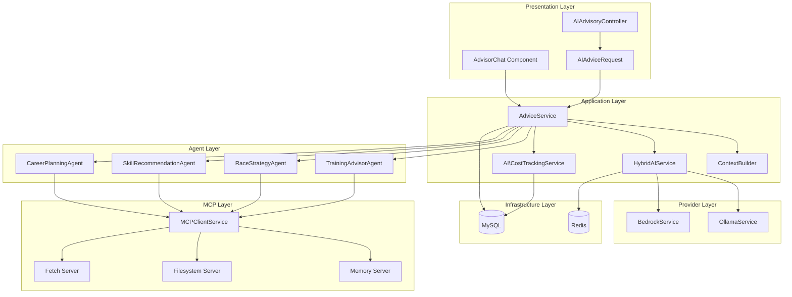

# SPEC-006: AI Advisory System - Technical Specification

**Document Version**: 2.3.0  
**Date**: 2026-02-22  
**Project**: Umamusume Pretty Derby Career Planner  
**Status**: Complete - Implementation verified  
**Classification**: Internal - Development Team

---

## Document Information

| Attribute | Value |
|-----------|-------|
| **Document ID** | SPEC-006 |
| **Related PRD** | [PRD-006: AI Advisory](../prds/PRD-006_AI_Advisory.md) |
| **Architecture Version** | v2.3.0 |
| **Approval Status** | Approved |
| **Last Reviewed** | 2026-02-22 |

### Related Documents

**Requirements & Design**:

- [SRS Section 2.7: AI Advisory](../003_SRS_Software_Requirement_Specifications.md#27-ai-advisory-fr-07)
- [SDS Section 6: AI and MCP Integration](../004_SDS_Software_Design_Specifications.md#6-ai-and-mcp-integration)

**Data & Integration**:

- [DBD Section 4.5: AI Conversations](../009_DBD_Database_Documentation.md#45-ucp_ai_conversations)
- [SIS Section 2: AI Provider Integration](../008_SIS_Software_Integration_Specifications.md#2-ai-provider-integration)
- [SIP Section 5: Integration Points](../007_SIP_Software_Integration_Plan.md#5-integration-points)

**Visual Documentation**:

- [FLOW-006: AI Advisory System](../flows/FLOW-006_AI_Advisory_System.md)
- [SEQ-006: AI Advice Generation](../sequences/SEQ-006_AI_Advice_Generation.md)
- [WF-012: AI Advisor Interface](../wireframes/WF-012_AI_Advisor_Interface.md)
- [UF-007: AI Advisor Journey](../user-flows/UF-007_AI_Advisor_Journey.md)

---

## Table of Contents

1. [Technical Overview](#1-technical-overview)
2. [Architecture Design](#2-architecture-design)
3. [Neuron AI Integration](#3-neuron-ai-integration)
4. [Hybrid AI Provider System](#4-hybrid-ai-provider-system)
5. [MCP Integration](#5-mcp-integration)
6. [Service Layer](#6-service-layer)
7. [API Specification](#7-api-specification)
8. [Database Schema](#8-database-schema)
9. [Cost Tracking System](#9-cost-tracking-system)
10. [Business Logic](#10-business-logic)
11. [Integration Points](#11-integration-points)
12. [Error Handling](#12-error-handling)
13. [Performance Optimization](#13-performance-optimization)
14. [Security Considerations](#14-security-considerations)
15. [Testing Strategy](#15-testing-strategy)
16. [Appendices](#16-appendices)

---

## 1. Technical Overview

### 1.1 Module Purpose

The AI Advisory System provides intelligent, context-aware recommendations for training optimization, race strategy, skill acquisition, and career planning. The system uses a hybrid architecture with local-first processing via Ollama and cloud fallback via AWS Bedrock Claude models.

**Core Responsibilities**:

- Training advice generation with stat gain predictions
- Race strategy recommendations with win probability analysis
- Skill build optimization and SP budget planning
- Career milestone planning and goal tracking
- Conversation history management and context persistence
- Cost tracking and budget enforcement for cloud AI usage
- Confidence scoring for all recommendations
- MCP tool integration for enhanced context

### 1.2 Business Context

In Umamusume Pretty Derby, optimal decision-making requires:

- **Training Selection**: Choosing the best training option each turn
- **Race Preparation**: Determining readiness and optimal running style
- **Skill Planning**: Prioritizing skill acquisitions within SP budget
- **Long-term Strategy**: Balancing immediate gains with future goals

The AI Advisory System provides intelligent guidance across all these domains, reducing the complexity of optimization while respecting player agency.

### 1.3 Technical Scope

**In Scope**:

- Hybrid AI provider architecture (Ollama + Bedrock)
- Neuron AI agent orchestration
- MCP server integration for tool execution
- Context building and prompt engineering
- Conversation persistence and history
- Cost tracking and budget management
- Confidence scoring algorithms
- Response formatting and normalization

**Out of Scope**:

- AI model training or fine-tuning
- Real-time game integration
- Voice or speech interfaces
- Multi-language response generation

### 1.4 Technology Stack

| Component | Technology | Version | Purpose |
|-----------|-----------|---------|---------|
| **AI Framework** | Neuron AI | v2.11 | Agent orchestration |
| **Local AI** | Ollama | Latest | Primary local inference |
| **Cloud AI** | AWS Bedrock | Claude 3.5/4.5 | Cloud fallback |
| **MCP** | Model Context Protocol | Latest | Tool execution |
| **Framework** | Laravel | 12.x | Application foundation |
| **Language** | PHP | 8.2+ | Server-side logic |
| **Database** | MySQL | 8.0+ | Conversation persistence |
| **Cache** | Redis | 7.x | Response caching |

---

## 2. Architecture Design

### 2.1 Component Architecture



### 2.2 Layer Responsibilities

**Presentation Layer**:

- HTTP request/response handling
- AI chat UI rendering
- Request validation and sanitization

**Application Layer**:

- Advisory workflow orchestration
- Context building and prompt assembly
- Provider routing decisions
- Cost tracking and budget enforcement

**Agent Layer**:

- Domain-specific AI agents
- Tool invocation coordination
- Response structuring

**Provider Layer**:

- AI model communication
- Response parsing and normalization
- Error handling and retries

**MCP Layer**:

- Tool execution and context management
- Memory persistence
- External resource access

**Infrastructure Layer**:

- Database persistence
- Cache management
- External service communication

### 2.3 Design Patterns

| Pattern | Implementation | Purpose |
|---------|---------------|---------|
| **Strategy** | Provider selection | Pluggable AI backends |
| **Factory** | Agent creation | Dynamic agent instantiation |
| **Chain of Responsibility** | Fallback handling | Graceful degradation |
| **Observer** | Cost tracking | React to AI completions |
| **Decorator** | Context enrichment | Layer context onto prompts |
| **Repository** | Conversation storage | Abstract data access |

---

## 3. Neuron AI Integration

### 3.1 Agent Architecture

Neuron agents are topic-specific advisors that orchestrate AI interactions.

```php
<?php

namespace App\Neuron\Agents;

use NeuronAI\Agent;
use NeuronAI\SystemPrompt;
use App\Neuron\Tools\{
    GetCharacterStatsTool,
    GetTrainingPredictionsTool,
    GetGoalProgressTool
};

/**
 * Training Advisor Agent
 * 
 * Provides intelligent training recommendations based on
 * current character state, goals, and game mechanics.
 */
class TrainingAdvisorAgent extends Agent
{
    protected string $name = 'Training Advisor';
    
    protected string $description = 'Provides training recommendations based on current career state';

    /**
     * Get system instructions
     * 
     * @return string
     */
    public function instructions(): string
    {
        return <<<PROMPT
You are an expert Umamusume training advisor. Your role is to analyze the current 
character state and recommend optimal training decisions.

**Context Understanding:**
- Speed, Stamina, Power, Guts, and Wit are the five core stats (0-1200+ range, soft cap at 1200)
- Stats above 1200 have diminishing returns (50% effectiveness)
- Per-training cap: +100 (reduced to +50 if stat > 1200)
- Energy level affects training success rate (0-100%)
- Mood affects stat gains: Great +4%, Good +2%, Normal 0%, Bad -2%, Awful -4%
- Support cards provide bonuses when present at training facilities (+5% per card)
- Friendship training activates at 80%+ bond level (1.2x multiplier)

**Response Requirements:**
1. Always provide a clear, actionable recommendation
2. Explain your reasoning based on the data
3. Identify risks and potential issues
4. Suggest alternatives when appropriate
5. Include a confidence score (0.0-1.0)

**Output Format (JSON):**
{
    "recommendation": {
        "action": "training_type",
        "priority": "high|medium|low",
        "expected_gains": {"speed": 0, "stamina": 0, "power": 0, "guts": 0, "wit": 0},
        "risk_percentage": 0,
        "energy_after": 0
    },
    "reasoning": "Explanation of why this recommendation",
    "risks": ["List of potential risks"],
    "alternatives": [{"action": "...", "priority": "...", "note": "..."}],
    "confidence": 0.85
}
PROMPT;
    }

    /**
     * Get available tools
     * 
     * @return array
     */
    public function tools(): array
    {
        return [
            new GetCharacterStatsTool(),
            new GetTrainingPredictionsTool(),
            new GetGoalProgressTool(),
        ];
    }

    /**
     * Get the AI provider for this agent
     * 
     * @return \NeuronAI\Provider
     */
    public function provider(): \NeuronAI\Provider
    {
        return app(\App\Services\AI\HybridAIService::class)->getProvider();
    }
}
```

### 3.2 Race Strategy Agent

```php
<?php

namespace App\Neuron\Agents;

use NeuronAI\Agent;
use App\Neuron\Tools\{
    GetCharacterStatsTool,
    GetRaceRequirementsTool,
    GetAptitudeAnalysisTool,
    GetSkillSynergyTool
};

/**
 * Race Strategy Agent
 * 
 * Provides race preparation and strategy recommendations.
 */
class RaceStrategyAgent extends Agent
{
    protected string $name = 'Race Strategy Advisor';
    
    protected string $description = 'Optimizes race preparation and running style selection';

    /**
     * Get system instructions
     * 
     * @return string
     */
    public function instructions(): string
    {
        return <<<PROMPT
You are an expert Umamusume race strategist. Analyze race requirements and 
character capabilities to recommend optimal race strategy.

**Race Analysis Factors:**
- Distance categories: Sprint (1000-1400m), Mile (1401-1800m), Medium (1801-2400m), Long (2401m+)
- Surface types: Turf, Dirt
- Running styles: Front Runner (Nige), Pace Chaser (Senkou), Late Surger (Sashi), End Closer (Oikomi)
- Aptitude grades (G-S): S=+5%, A=0% (baseline), B=-10%, C=-20%, D=-35%, E=-55%, F=-75%, G=-90%
- Track conditions: Firm (no penalty), Good (Power -50), Soft (Power -50/-100, +2% stamina drain), Heavy (Speed -50, Power -50/-100, +2% stamina drain)

**Readiness Assessment:**
- Compare character stats against race requirements
- Evaluate aptitude match for distance, surface, and style
- Consider active skills and their synergy with race conditions
- Factor in current mood and condition status

**Output Format (JSON):**
{
    "readiness_score": 85,
    "recommended_style": "sashi",
    "win_probability": 35,
    "stat_gaps": {"speed": -50, "stamina": 0},
    "skill_recommendations": ["skill_id_1", "skill_id_2"],
    "reasoning": "Detailed analysis",
    "risks": ["List of concerns"],
    "preparation_tips": ["Actionable advice"],
    "confidence": 0.80
}
PROMPT;
    }

    /**
     * Get available tools
     * 
     * @return array
     */
    public function tools(): array
    {
        return [
            new GetCharacterStatsTool(),
            new GetRaceRequirementsTool(),
            new GetAptitudeAnalysisTool(),
            new GetSkillSynergyTool(),
        ];
    }
}
```

### 3.3 Skill Advisor Agent

```php
<?php

namespace App\Neuron\Agents;

use NeuronAI\Agent;
use App\Neuron\Tools\{
    GetCharacterStatsTool,
    GetSkillCatalogTool,
    GetSkillHintsTool,
    GetSPBudgetTool
};

/**
 * Skill Advisor Agent
 * 
 * Provides skill acquisition recommendations and SP optimization.
 */
class SkillRecommendationAgent extends Agent
{
    protected string $name = 'Skill Advisor';
    
    protected string $description = 'Recommends skill acquisitions and optimizes SP budget';

    /**
     * Get system instructions
     * 
     * @return string
     */
    public function instructions(): string
    {
        return <<<PROMPT
You are an expert Umamusume skill build advisor. Recommend optimal skill 
acquisitions based on race goals, SP budget, and available hints.

**Skill System Knowledge:**
- Skills cost SP (Skill Points) to acquire
- Hints reduce cost: Level 1=10%, Level 2=20%, Level 3=30%, Level 4=35%, Level 5=40% (max)
- Additional discount sources: Fast Learner condition, Skill Sparks, Hint Books
- Skill categories: Normal, Rare, Unique
- Some Normal skills can evolve to Rare versions
- Skills have activation conditions (distance, position, phase)

**Optimization Factors:**
- Match skills to target race conditions
- Prioritize skills with hint discounts
- Consider skill synergies and combinations
- Balance immediate needs vs long-term build
- Account for evolution opportunities

**Output Format (JSON):**
{
    "recommended_skills": [
        {
            "skill_id": 123,
            "skill_name": "Skill Name",
            "base_cost": 120,
            "discounted_cost": 96,
            "priority": "high",
            "reasoning": "Why this skill"
        }
    ],
    "sp_budget_analysis": {
        "available": 450,
        "recommended_spend": 380,
        "remaining": 70
    },
    "build_strategy": "Description of overall strategy",
    "evolution_opportunities": ["skill_id_1"],
    "confidence": 0.85
}
PROMPT;
    }

    /**
     * Get available tools
     * 
     * @return array
     */
    public function tools(): array
    {
        return [
            new GetCharacterStatsTool(),
            new GetSkillCatalogTool(),
            new GetSkillHintsTool(),
            new GetSPBudgetTool(),
        ];
    }
}
```

### 3.4 Agent Configuration

**Configuration File**: `config/neuron.php`

```php
<?php

return [
    'agents' => [
        'training_advisor' => [
            'class' => \App\Neuron\Agents\TrainingAdvisorAgent::class,
            'enabled' => true,
            'description' => 'Provides training recommendations',
            'complexity_threshold' => 50,
        ],
        'race_strategy' => [
            'class' => \App\Neuron\Agents\RaceStrategyAgent::class,
            'enabled' => true,
            'description' => 'Optimizes race preparation',
            'complexity_threshold' => 60,
        ],
        'skill_advisor' => [
            'class' => \App\Neuron\Agents\SkillRecommendationAgent::class,
            'enabled' => true,
            'description' => 'Recommends skill acquisitions',
            'complexity_threshold' => 55,
        ],
        'career_planner' => [
            'class' => \App\Neuron\Agents\CareerPlanningAgent::class,
            'enabled' => true,
            'description' => 'Long-term strategy and milestone planning',
            'complexity_threshold' => 70,
        ],
    ],

    'memory' => [
        'driver' => 'database',
        'table' => 'ucp_ai_conversations',
        'retention_days' => 90,
    ],

    'tools' => [
        'enabled' => true,
        'timeout' => 30,
        'max_iterations' => 5,
    ],

    'response' => [
        'require_confidence' => true,
        'require_reasoning' => true,
        'require_alternatives' => false,
    ],
];
```

### 3.5 Agent Tools

```php
<?php

namespace App\Neuron\Tools;

use NeuronAI\Tool;
use App\Models\Character;
use App\Services\TrainingPredictionService;

/**
 * Get Training Predictions Tool
 * 
 * Retrieves training predictions for all facilities.
 */
class GetTrainingPredictionsTool extends Tool
{
    protected string $name = 'get_training_predictions';
    
    protected string $description = 'Get predicted stat gains for all training options';

    /**
     * Define tool parameters
     * 
     * @return array
     */
    public function parameters(): array
    {
        return [
            'character_id' => [
                'type' => 'integer',
                'description' => 'The character ID to get predictions for',
                'required' => true,
            ],
        ];
    }

    /**
     * Execute the tool
     * 
     * @param array $params
     * @return array
     */
    public function execute(array $params): array
    {
        $character = Character::findOrFail($params['character_id']);
        $service = app(TrainingPredictionService::class);
        
        return $service->getPredictions($character);
    }
}
```

```php
<?php

namespace App\Neuron\Tools;

use NeuronAI\Tool;
use App\Models\Character;

/**
 * Get Character Stats Tool
 * 
 * Retrieves current character state including stats, mood, and energy.
 */
class GetCharacterStatsTool extends Tool
{
    protected string $name = 'get_character_stats';
    
    protected string $description = 'Get current character stats, mood, energy, and conditions';

    /**
     * Define tool parameters
     * 
     * @return array
     */
    public function parameters(): array
    {
        return [
            'character_id' => [
                'type' => 'integer',
                'description' => 'The character ID to retrieve',
                'required' => true,
            ],
        ];
    }

    /**
     * Execute the tool
     * 
     * @param array $params
     * @return array
     */
    public function execute(array $params): array
    {
        $character = Character::with(['aptitudes', 'activeCareer'])
            ->findOrFail($params['character_id']);
        
        return [
            'id' => $character->id,
            'name' => $character->name,
            'stats' => $character->current_stats,
            'energy' => $character->energy_level,
            'mood' => $character->mood_status,
            'conditions' => $character->conditions ?? [],
            'current_turn' => $character->activeCareer?->current_turn,
            'career_stage' => $character->activeCareer?->career_stage,
            'goals' => $character->goals ?? [],
        ];
    }
}
```

---

## 4. Hybrid AI Provider System

### 4.1 Provider Configuration

**Configuration File**: `config/ai.php`

```php
<?php

return [
    'default_provider' => env('AI_DEFAULT_PROVIDER', 'ollama'),

    'providers' => [
        'ollama' => [
            'enabled' => env('OLLAMA_ENABLED', true),
            'base_url' => env('OLLAMA_BASE_URL', 'http://localhost:11434'),
            'model' => env('OLLAMA_MODEL', 'llama3.2'),
            'timeout' => env('OLLAMA_TIMEOUT', 30),
            'temperature' => env('OLLAMA_TEMPERATURE', 0.7),
            'max_tokens' => env('OLLAMA_MAX_TOKENS', 2048),
        ],
        'bedrock' => [
            'enabled' => env('BEDROCK_ENABLED', false),
            'region' => env('AWS_DEFAULT_REGION', 'us-east-1'),
            'model' => env('BEDROCK_MODEL', 'anthropic.claude-3-5-sonnet-20241022-v2:0'),
            'max_tokens' => env('BEDROCK_MAX_TOKENS', 4096),
            'temperature' => env('BEDROCK_TEMPERATURE', 0.7),
        ],
    ],

    'routing' => [
        'local_complexity_threshold' => env('AI_LOCAL_THRESHOLD', 70),
        'cost_threshold_usd' => env('AI_COST_THRESHOLD', 0.10),
        'fallback_enabled' => env('AI_FALLBACK_ENABLED', true),
        'retry_attempts' => env('AI_RETRY_ATTEMPTS', 3),
        'retry_delay_ms' => env('AI_RETRY_DELAY', 1000),
    ],

    'caching' => [
        'enabled' => env('AI_CACHE_ENABLED', true),
        'ttl' => env('AI_CACHE_TTL', 300),
        'prefix' => 'ai:response:',
    ],

    'monitoring' => [
        'enabled' => true,
        'log_requests' => true,
        'log_responses' => false,
        'track_costs' => true,
        'track_latency' => true,
    ],

    'limits' => [
        'max_prompt_length' => 8000,
        'max_context_sections' => 10,
        'max_conversation_turns' => 20,
    ],
];
```

### 4.2 Ollama Service

```php
<?php

namespace App\Services\AI;

use Illuminate\Support\Facades\{Http, Log, Cache};
use App\Exceptions\AI\OllamaUnavailableException;
use App\DTOs\AI\AIResponse;

/**
 * Ollama Local AI Service
 * 
 * Handles communication with local Ollama instance.
 */
class OllamaService
{
    private string $baseUrl;
    private string $model;
    private int $timeout;
    private float $temperature;

    public function __construct()
    {
        $this->baseUrl = config('ai.providers.ollama.base_url');
        $this->model = config('ai.providers.ollama.model');
        $this->timeout = config('ai.providers.ollama.timeout');
        $this->temperature = config('ai.providers.ollama.temperature');
    }

    /**
     * Check if Ollama is available
     * 
     * @return bool
     */
    public function isAvailable(): bool
    {
        $cacheKey = 'ollama:health:status';
        
        return Cache::remember($cacheKey, 30, function () {
            try {
                $response = Http::timeout(5)
                    ->get("{$this->baseUrl}/api/tags");
                    
                return $response->successful();
            } catch (\Exception $e) {
                Log::warning('Ollama health check failed', [
                    'error' => $e->getMessage(),
                ]);
                return false;
            }
        });
    }

    /**
     * Generate AI response
     * 
     * @param string $prompt
     * @param string|null $systemPrompt
     * @param array $options
     * @return AIResponse
     * @throws OllamaUnavailableException
     */
    public function generate(
        string $prompt,
        ?string $systemPrompt = null,
        array $options = []
    ): AIResponse {
        if (!$this->isAvailable()) {
            throw new OllamaUnavailableException('Ollama service is not available');
        }

        $startTime = microtime(true);

        try {
            $response = Http::timeout($this->timeout)
                ->post("{$this->baseUrl}/api/generate", [
                    'model' => $options['model'] ?? $this->model,
                    'prompt' => $prompt,
                    'system' => $systemPrompt,
                    'stream' => false,
                    'options' => [
                        'temperature' => $options['temperature'] ?? $this->temperature,
                        'num_predict' => $options['max_tokens'] ?? config('ai.providers.ollama.max_tokens'),
                    ],
                ]);

            if (!$response->successful()) {
                throw new OllamaUnavailableException(
                    "Ollama request failed: {$response->status()}"
                );
            }

            $data = $response->json();
            $duration = (microtime(true) - $startTime) * 1000;

            Log::debug('Ollama generation completed', [
                'model' => $this->model,
                'duration_ms' => $duration,
                'eval_count' => $data['eval_count'] ?? 0,
            ]);

            return new AIResponse(
                content: $data['response'],
                provider: 'ollama',
                model: $this->model,
                tokensUsed: ($data['prompt_eval_count'] ?? 0) + ($data['eval_count'] ?? 0),
                inputTokens: $data['prompt_eval_count'] ?? 0,
                outputTokens: $data['eval_count'] ?? 0,
                durationMs: $duration,
                costUsd: 0.0, // Local processing is free
            );
        } catch (OllamaUnavailableException $e) {
            throw $e;
        } catch (\Exception $e) {
            Log::error('Ollama generation failed', [
                'error' => $e->getMessage(),
            ]);
            
            throw new OllamaUnavailableException(
                "Ollama generation failed: {$e->getMessage()}",
                previous: $e
            );
        }
    }

    /**
     * Get provider name
     * 
     * @return string
     */
    public function getName(): string
    {
        return 'ollama';
    }

    /**
     * Get current model
     * 
     * @return string
     */
    public function getModel(): string
    {
        return $this->model;
    }
}
```

### 4.3 Bedrock Service

```php
<?php

namespace App\Services\AI;

use Aws\BedrockRuntime\BedrockRuntimeClient;
use Illuminate\Support\Facades\Log;
use App\Exceptions\AI\BedrockException;
use App\DTOs\AI\AIResponse;

/**
 * AWS Bedrock AI Service
 * 
 * Handles communication with AWS Bedrock Claude models.
 */
class BedrockService
{
    private BedrockRuntimeClient $client;
    private string $modelId;
    private int $maxTokens;
    private float $temperature;

    public function __construct()
    {
        $this->client = new BedrockRuntimeClient([
            'region' => config('ai.providers.bedrock.region'),
            'version' => 'latest',
        ]);
        
        $this->modelId = config('ai.providers.bedrock.model');
        $this->maxTokens = config('ai.providers.bedrock.max_tokens');
        $this->temperature = config('ai.providers.bedrock.temperature');
    }

    /**
     * Check if Bedrock is enabled
     * 
     * @return bool
     */
    public function isEnabled(): bool
    {
        return config('ai.providers.bedrock.enabled', false);
    }

    /**
     * Generate AI response
     * 
     * @param string $prompt
     * @param string|null $systemPrompt
     * @param array $options
     * @return AIResponse
     * @throws BedrockException
     */
    public function generate(
        string $prompt,
        ?string $systemPrompt = null,
        array $options = []
    ): AIResponse {
        if (!$this->isEnabled()) {
            throw new BedrockException('Bedrock is not enabled');
        }

        $startTime = microtime(true);

        try {
            $messages = [
                ['role' => 'user', 'content' => $prompt],
            ];

            $body = [
                'anthropic_version' => 'bedrock-2023-05-31',
                'max_tokens' => $options['max_tokens'] ?? $this->maxTokens,
                'temperature' => $options['temperature'] ?? $this->temperature,
                'messages' => $messages,
            ];

            if ($systemPrompt) {
                $body['system'] = $systemPrompt;
            }

            $result = $this->client->invokeModel([
                'modelId' => $options['model'] ?? $this->modelId,
                'contentType' => 'application/json',
                'accept' => 'application/json',
                'body' => json_encode($body),
            ]);

            $response = json_decode($result['body']->getContents(), true);
            $duration = (microtime(true) - $startTime) * 1000;

            $inputTokens = $response['usage']['input_tokens'] ?? 0;
            $outputTokens = $response['usage']['output_tokens'] ?? 0;
            $cost = $this->calculateCost($inputTokens, $outputTokens);

            Log::debug('Bedrock generation completed', [
                'model' => $this->modelId,
                'duration_ms' => $duration,
                'input_tokens' => $inputTokens,
                'output_tokens' => $outputTokens,
                'cost_usd' => $cost,
            ]);

            return new AIResponse(
                content: $response['content'][0]['text'] ?? '',
                provider: 'bedrock',
                model: $this->modelId,
                tokensUsed: $inputTokens + $outputTokens,
                inputTokens: $inputTokens,
                outputTokens: $outputTokens,
                durationMs: $duration,
                costUsd: $cost,
            );
        } catch (\Exception $e) {
            Log::error('Bedrock generation failed', [
                'error' => $e->getMessage(),
                'model' => $this->modelId,
            ]);
            
            throw new BedrockException(
                "Bedrock generation failed: {$e->getMessage()}",
                previous: $e
            );
        }
    }

    /**
     * Calculate cost based on token usage
     * 
     * @param int $inputTokens
     * @param int $outputTokens
     * @return float
     */
    private function calculateCost(int $inputTokens, int $outputTokens): float
    {
        $pricing = $this->getPricing();
        
        $inputCost = ($inputTokens / 1_000_000) * $pricing['input'];
        $outputCost = ($outputTokens / 1_000_000) * $pricing['output'];
        
        return round($inputCost + $outputCost, 6);
    }

    /**
     * Get pricing for current model
     * 
     * @return array
     */
    private function getPricing(): array
    {
        $pricingTable = [
            'anthropic.claude-3-5-sonnet' => ['input' => 3.00, 'output' => 15.00],
            'anthropic.claude-3-opus' => ['input' => 15.00, 'output' => 75.00],
            'anthropic.claude-3-haiku' => ['input' => 0.25, 'output' => 1.25],
            'anthropic.claude-3-5-haiku' => ['input' => 1.00, 'output' => 5.00],
        ];

        foreach ($pricingTable as $prefix => $pricing) {
            if (str_starts_with($this->modelId, $prefix)) {
                return $pricing;
            }
        }

        // Default pricing
        return ['input' => 3.00, 'output' => 15.00];
    }

    /**
     * Get provider name
     * 
     * @return string
     */
    public function getName(): string
    {
        return 'bedrock';
    }

    /**
     * Get current model
     * 
     * @return string
     */
    public function getModel(): string
    {
        return $this->modelId;
    }
}
```

### 4.4 Hybrid AI Service (Router)

```php
<?php

namespace App\Services\AI;

use Illuminate\Support\Facades\{Log, Cache};
use App\DTOs\AI\AIResponse;
use App\Exceptions\AI\{AIProviderException, AIBudgetExceededException};

/**
 * Hybrid AI Service
 * 
 * Routes requests to appropriate AI provider based on complexity,
 * availability, and cost constraints.
 */
class HybridAIService
{
    public function __construct(
        private OllamaService $ollama,
        private BedrockService $bedrock,
        private CostTrackingService $costTracker
    ) {}

    /**
     * Generate AI response with automatic provider selection
     * 
     * @param string $prompt
     * @param string|null $systemPrompt
     * @param array $options
     * @return AIResponse
     * @throws AIProviderException
     */
    public function generate(
        string $prompt,
        ?string $systemPrompt = null,
        array $options = []
    ): AIResponse {
        $complexity = $this->assessComplexity($prompt, $options);
        $forceCloud = $options['force_cloud'] ?? false;
        $forceLocal = $options['force_local'] ?? false;

        Log::debug('AI request routing', [
            'complexity' => $complexity,
            'force_cloud' => $forceCloud,
            'force_local' => $forceLocal,
        ]);

        // Check if cloud should be used
        if ($forceCloud || $this->shouldUseCloud($complexity, $options)) {
            return $this->tryCloudWithFallback($prompt, $systemPrompt, $options);
        }

        // Try local first
        if (!$forceLocal || $this->ollama->isAvailable()) {
            return $this->tryLocalWithFallback($prompt, $systemPrompt, $options);
        }

        throw new AIProviderException('No AI provider available');
    }

    /**
     * Try local provider with cloud fallback
     * 
     * @param string $prompt
     * @param string|null $systemPrompt
     * @param array $options
     * @return AIResponse
     */
    private function tryLocalWithFallback(
        string $prompt,
        ?string $systemPrompt,
        array $options
    ): AIResponse {
        try {
            return $this->ollama->generate($prompt, $systemPrompt, $options);
        } catch (\Exception $e) {
            Log::warning('Local AI failed, attempting cloud fallback', [
                'error' => $e->getMessage(),
            ]);

            if (config('ai.routing.fallback_enabled') && $this->bedrock->isEnabled()) {
                return $this->tryCloud($prompt, $systemPrompt, $options);
            }

            throw new AIProviderException(
                'Local AI unavailable and cloud fallback disabled',
                previous: $e
            );
        }
    }

    /**
     * Try cloud provider with local fallback
     * 
     * @param string $prompt
     * @param string|null $systemPrompt
     * @param array $options
     * @return AIResponse
     */
    private function tryCloudWithFallback(
        string $prompt,
        ?string $systemPrompt,
        array $options
    ): AIResponse {
        try {
            return $this->tryCloud($prompt, $systemPrompt, $options);
        } catch (\Exception $e) {
            Log::warning('Cloud AI failed, attempting local fallback', [
                'error' => $e->getMessage(),
            ]);

            if ($this->ollama->isAvailable()) {
                return $this->ollama->generate($prompt, $systemPrompt, $options);
            }

            throw new AIProviderException(
                'Cloud AI unavailable and local fallback failed',
                previous: $e
            );
        }
    }

    /**
     * Try cloud provider with budget check
     * 
     * @param string $prompt
     * @param string|null $systemPrompt
     * @param array $options
     * @return AIResponse
     * @throws AIBudgetExceededException
     */
    private function tryCloud(
        string $prompt,
        ?string $systemPrompt,
        array $options
    ): AIResponse {
        // Check budget before cloud request
        $threshold = config('ai.routing.cost_threshold_usd');
        $currentSpend = $this->costTracker->getTodaySpend();

        if ($currentSpend >= $threshold) {
            throw new AIBudgetExceededException(
                "Daily AI budget exceeded (${currentSpend} / ${threshold} USD)"
            );
        }

        $response = $this->bedrock->generate($prompt, $systemPrompt, $options);

        // Track the cost
        $this->costTracker->trackUsage($response);

        return $response;
    }

    /**
     * Determine if cloud should be used based on complexity
     * 
     * @param int $complexity
     * @param array $options
     * @return bool
     */
    private function shouldUseCloud(int $complexity, array $options): bool
    {
        // Force local takes precedence
        if ($options['force_local'] ?? false) {
            return false;
        }

        // Check if local is available
        if (!$this->ollama->isAvailable()) {
            return true;
        }

        // Check complexity threshold
        $threshold = config('ai.routing.local_complexity_threshold');
        
        return $complexity > $threshold;
    }

    /**
     * Assess query complexity
     * 
     * @param string $prompt
     * @param array $options
     * @return int 0-100 complexity score
     */
    private function assessComplexity(string $prompt, array $options): int
    {
        $score = 0;

        // Prompt length factor
        $length = strlen($prompt);
        if ($length > 2000) $score += 20;
        if ($length > 4000) $score += 20;

        // Topic complexity
        $topic = $options['topic'] ?? 'general';
        $topicScores = [
            'training' => 40,
            'race' => 50,
            'skills' => 45,
            'career' => 70,
            'conversation' => 30,
            'general' => 35,
        ];
        $score += $topicScores[$topic] ?? 35;

        // Context sections
        $contextCount = $options['context_count'] ?? 0;
        $score += min(20, $contextCount * 4);

        // Conversation history length
        $historyLength = $options['history_length'] ?? 0;
        $score += min(10, $historyLength * 2);

        return min(100, $score);
    }

    /**
     * Get the current provider for direct access
     * 
     * @return OllamaService|BedrockService
     */
    public function getProvider(): OllamaService|BedrockService
    {
        if ($this->ollama->isAvailable()) {
            return $this->ollama;
        }

        return $this->bedrock;
    }
}
```

### 4.5 AI Response DTO

```php
<?php

namespace App\DTOs\AI;

/**
 * AI Response Data Transfer Object
 */
readonly class AIResponse
{
    public function __construct(
        public string $content,
        public string $provider,
        public string $model,
        public int $tokensUsed,
        public int $inputTokens,
        public int $outputTokens,
        public float $durationMs,
        public float $costUsd
    ) {}

    /**
     * Parse JSON content from response
     * 
     * @return array|null
     */
    public function parseJson(): ?array
    {
        // Try to extract JSON from response
        if (preg_match('/\{[\s\S]*\}/', $this->content, $matches)) {
            $decoded = json_decode($matches[0], true);
            if (json_last_error() === JSON_ERROR_NONE) {
                return $decoded;
            }
        }

        return null;
    }

    /**
     * Check if response was from local provider
     * 
     * @return bool
     */
    public function isLocal(): bool
    {
        return $this->provider === 'ollama';
    }

    /**
     * Check if response was from cloud provider
     * 
     * @return bool
     */
    public function isCloud(): bool
    {
        return $this->provider === 'bedrock';
    }

    /**
     * Convert to array
     * 
     * @return array
     */
    public function toArray(): array
    {
        return [
            'content' => $this->content,
            'provider' => $this->provider,
            'model' => $this->model,
            'tokens_used' => $this->tokensUsed,
            'input_tokens' => $this->inputTokens,
            'output_tokens' => $this->outputTokens,
            'duration_ms' => $this->durationMs,
            'cost_usd' => $this->costUsd,
        ];
    }
}
```

---

## 5. MCP Integration

### 5.1 MCP Configuration

**Configuration File**: `config/mcp.php`

```php
<?php

return [
    'servers' => [
        'memory' => [
            'command' => 'npx',
            'args' => ['-y', '@modelcontextprotocol/server-memory'],
            'enabled' => env('MCP_MEMORY_ENABLED', true),
            'description' => 'Conversation context persistence',
            'timeout' => 30,
        ],
        'filesystem' => [
            'command' => 'npx',
            'args' => ['-y', '@anthropic/mcp-server-filesystem', storage_path()],
            'enabled' => env('MCP_FILESYSTEM_ENABLED', true),
            'description' => 'Document access for approved paths',
            'timeout' => 30,
        ],
        'fetch' => [
            'command' => 'npx',
            'args' => ['-y', '@anthropic/mcp-server-fetch'],
            'enabled' => env('MCP_FETCH_ENABLED', true),
            'description' => 'HTTP resource retrieval',
            'timeout' => 60,
            'allowed_domains' => [
                'umapyoi.net',
                'gametora.com',
            ],
        ],
    ],

    'monitoring' => [
        'enabled' => true,
        'log_requests' => true,
        'track_usage' => true,
        'track_latency' => true,
    ],

    'limits' => [
        'max_concurrent_servers' => 3,
        'server_startup_timeout' => 10,
        'tool_execution_timeout' => 30,
    ],
];
```

### 5.2 MCP Client Service

```php
<?php

namespace App\Services\MCP;

use Illuminate\Support\Facades\{Log, Process};
use App\Models\MCPToolUsage;

/**
 * MCP Client Service
 * 
 * Manages MCP server connections and tool execution.
 */
class MCPClientService
{
    private array $servers = [];
    private array $serverProcesses = [];

    /**
     * Initialize MCP servers
     * 
     * @return void
     */
    public function initialize(): void
    {
        $config = config('mcp.servers');

        foreach ($config as $name => $settings) {
            if ($settings['enabled'] ?? false) {
                $this->startServer($name, $settings);
            }
        }
    }

    /**
     * Start an MCP server
     * 
     * @param string $name
     * @param array $settings
     * @return void
     */
    private function startServer(string $name, array $settings): void
    {
        try {
            $process = Process::timeout($settings['timeout'] ?? 30)
                ->start(
                    array_merge([$settings['command']], $settings['args'] ?? [])
                );

            $this->serverProcesses[$name] = $process;
            $this->servers[$name] = [
                'status' => 'running',
                'started_at' => now(),
                'settings' => $settings,
            ];

            Log::info("MCP server started: {$name}");
        } catch (\Exception $e) {
            Log::error("Failed to start MCP server: {$name}", [
                'error' => $e->getMessage(),
            ]);

            $this->servers[$name] = [
                'status' => 'failed',
                'error' => $e->getMessage(),
            ];
        }
    }

    /**
     * Execute a tool on an MCP server
     * 
     * @param string $serverName
     * @param string $toolName
     * @param array $params
     * @return array
     */
    public function executeTool(string $serverName, string $toolName, array $params): array
    {
        $startTime = microtime(true);
        $success = false;
        $result = [];

        try {
            if (!isset($this->servers[$serverName])) {
                throw new \Exception("MCP server not available: {$serverName}");
            }

            // Execute tool via MCP protocol
            $result = $this->sendToolRequest($serverName, $toolName, $params);
            $success = true;

            return $result;
        } catch (\Exception $e) {
            Log::error("MCP tool execution failed", [
                'server' => $serverName,
                'tool' => $toolName,
                'error' => $e->getMessage(),
            ]);

            throw $e;
        } finally {
            // Track usage
            $this->trackUsage(
                serverName: $serverName,
                toolName: $toolName,
                success: $success,
                latencyMs: (microtime(true) - $startTime) * 1000
            );
        }
    }

    /**
     * Send tool request to MCP server
     * 
     * @param string $serverName
     * @param string $toolName
     * @param array $params
     * @return array
     */
    private function sendToolRequest(string $serverName, string $toolName, array $params): array
    {
        // MCP protocol implementation
        $request = [
            'jsonrpc' => '2.0',
            'method' => 'tools/call',
            'params' => [
                'name' => $toolName,
                'arguments' => $params,
            ],
            'id' => uniqid('mcp_'),
        ];

        // Send to server process and await response
        // Implementation depends on MCP SDK being used
        
        return [];
    }

    /**
     * Track tool usage
     * 
     * @param string $serverName
     * @param string $toolName
     * @param bool $success
     * @param float $latencyMs
     * @return void
     */
    private function trackUsage(
        string $serverName,
        string $toolName,
        bool $success,
        float $latencyMs
    ): void {
        if (!config('mcp.monitoring.track_usage')) {
            return;
        }

        MCPToolUsage::updateOrCreate(
            [
                'tool_name' => $toolName,
                'server_name' => $serverName,
                'usage_date' => now()->toDateString(),
            ],
            [
                'invocation_count' => \DB::raw('invocation_count + 1'),
                'success_count' => \DB::raw($success ? 'success_count + 1' : 'success_count'),
                'error_count' => \DB::raw($success ? 'error_count' : 'error_count + 1'),
                'avg_latency_ms' => \DB::raw(
                    "(avg_latency_ms * invocation_count + {$latencyMs}) / (invocation_count + 1)"
                ),
            ]
        );
    }

    /**
     * Get server health status
     * 
     * @return array
     */
    public function getHealthStatus(): array
    {
        $status = [];

        foreach ($this->servers as $name => $server) {
            $status[$name] = [
                'status' => $server['status'],
                'uptime' => $server['started_at'] 
                    ? now()->diffInSeconds($server['started_at']) 
                    : null,
                'error' => $server['error'] ?? null,
            ];
        }

        return $status;
    }

    /**
     * Shutdown all MCP servers
     * 
     * @return void
     */
    public function shutdown(): void
    {
        foreach ($this->serverProcesses as $name => $process) {
            try {
                $process->signal(SIGTERM);
                Log::info("MCP server stopped: {$name}");
            } catch (\Exception $e) {
                Log::warning("Failed to stop MCP server: {$name}", [
                    'error' => $e->getMessage(),
                ]);
            }
        }

        $this->servers = [];
        $this->serverProcesses = [];
    }
}
```

### 5.3 MCP Monitoring Service

```php
<?php

namespace App\Services\MCP;

use App\Models\MCPToolUsage;
use Illuminate\Support\Facades\Cache;

/**
 * MCP Monitoring Service
 * 
 * Provides monitoring and analytics for MCP tool usage.
 */
class MCPMonitoringService
{
    /**
     * Get usage summary for date range
     * 
     * @param \Carbon\Carbon $startDate
     * @param \Carbon\Carbon $endDate
     * @return array
     */
    public function getUsageSummary(
        \Carbon\Carbon $startDate,
        \Carbon\Carbon $endDate
    ): array {
        $usage = MCPToolUsage::whereBetween('usage_date', [$startDate, $endDate])
            ->selectRaw('
                tool_name,
                server_name,
                SUM(invocation_count) as total_invocations,
                SUM(success_count) as total_success,
                SUM(error_count) as total_errors,
                AVG(avg_latency_ms) as avg_latency
            ')
            ->groupBy('tool_name', 'server_name')
            ->get();

        return $usage->map(fn($row) => [
            'tool_name' => $row->tool_name,
            'server_name' => $row->server_name,
            'total_invocations' => $row->total_invocations,
            'success_rate' => $row->total_invocations > 0
                ? round(($row->total_success / $row->total_invocations) * 100, 2)
                : 0,
            'error_rate' => $row->total_invocations > 0
                ? round(($row->total_errors / $row->total_invocations) * 100, 2)
                : 0,
            'avg_latency_ms' => round($row->avg_latency, 2),
        ])->toArray();
    }

    /**
     * Get today's tool usage
     * 
     * @return array
     */
    public function getTodayUsage(): array
    {
        return Cache::remember('mcp:today:usage', 60, function () {
            return MCPToolUsage::where('usage_date', now()->toDateString())
                ->get()
                ->toArray();
        });
    }

    /**
     * Get error rates by server
     * 
     * @return array
     */
    public function getErrorRatesByServer(): array
    {
        return MCPToolUsage::where('usage_date', '>=', now()->subDays(7))
            ->selectRaw('
                server_name,
                SUM(error_count) as total_errors,
                SUM(invocation_count) as total_invocations
            ')
            ->groupBy('server_name')
            ->get()
            ->mapWithKeys(fn($row) => [
                $row->server_name => $row->total_invocations > 0
                    ? round(($row->total_errors / $row->total_invocations) * 100, 2)
                    : 0,
            ])
            ->toArray();
    }
}
```

---

## 6. Service Layer

### 6.1 AI Advisory Service

```php
<?php

namespace App\Services\AI;

use App\Models\{Character, AIConversation, AIRecommendation};
use App\Neuron\Agents\{
    TrainingAdvisorAgent,
    RaceStrategyAgent,
    SkillRecommendationAgent,
    CareerPlanningAgent
};
use App\DTOs\AI\{AIResponse, AIAdvice};
use Illuminate\Support\Facades\{DB, Log};

/**
 * AI Advisory Service
 * 
 * Orchestrates AI advisory operations across all domains.
 */
class AdviceService
{
    public function __construct(
        private HybridAIService $aiService,
        private ContextBuilder $contextBuilder,
        private CostTrackingService $costTracker
    ) {}

    /**
     * Get training advice
     * 
     * @param Character $character
     * @param string $query
     * @param array $options
     * @return AIAdvice
     */
    public function getTrainingAdvice(
        Character $character,
        string $query,
        array $options = []
    ): AIAdvice {
        $context = $this->contextBuilder->buildTrainingContext($character);
        
        $agent = new TrainingAdvisorAgent();
        $agent->withContext($context);

        $response = $this->executeAgent($agent, $query, $options);

        $advice = $this->parseAdvice($response, 'training');
        
        $this->persistRecommendation($character, $advice, 'training');

        return $advice;
    }

    /**
     * Get race strategy advice
     * 
     * @param Character $character
     * @param int $raceId
     * @param string $query
     * @param array $options
     * @return AIAdvice
     */
    public function getRaceAdvice(
        Character $character,
        int $raceId,
        string $query,
        array $options = []
    ): AIAdvice {
        $context = $this->contextBuilder->buildRaceContext($character, $raceId);
        
        $agent = new RaceStrategyAgent();
        $agent->withContext($context);

        $response = $this->executeAgent($agent, $query, $options);

        $advice = $this->parseAdvice($response, 'race');
        
        $this->persistRecommendation($character, $advice, 'race');

        return $advice;
    }

    /**
     * Get skill advice
     * 
     * @param Character $character
     * @param string $query
     * @param array $options
     * @return AIAdvice
     */
    public function getSkillAdvice(
        Character $character,
        string $query,
        array $options = []
    ): AIAdvice {
        $context = $this->contextBuilder->buildSkillContext($character);
        
        $agent = new SkillRecommendationAgent();
        $agent->withContext($context);

        $response = $this->executeAgent($agent, $query, $options);

        $advice = $this->parseAdvice($response, 'skill');
        
        $this->persistRecommendation($character, $advice, 'skill');

        return $advice;
    }

    /**
     * Handle interactive conversation
     * 
     * @param Character $character
     * @param string $message
     * @param string $contextType
     * @param int|null $conversationId
     * @param array $options
     * @return array
     */
    public function handleConversation(
        Character $character,
        string $message,
        string $contextType,
        ?int $conversationId = null,
        array $options = []
    ): array {
        // Load or create conversation
        $conversation = $conversationId
            ? AIConversation::findOrFail($conversationId)
            : $this->createConversation($character, $contextType);

        // Build context with conversation history
        $context = $this->contextBuilder->buildConversationContext(
            $character,
            $contextType,
            $conversation->messages ?? []
        );

        // Select appropriate agent
        $agent = $this->getAgentForContext($contextType);
        $agent->withContext($context);

        // Execute
        $response = $this->executeAgent($agent, $message, $options);

        // Update conversation
        $this->updateConversation($conversation, $message, $response);

        return [
            'conversation_id' => $conversation->id,
            'message' => [
                'role' => 'assistant',
                'content' => $response->content,
                'timestamp' => now()->toIso8601String(),
            ],
            'confidence' => $this->extractConfidence($response),
            'meta' => [
                'provider' => $response->provider,
                'model' => $response->model,
                'tokens_used' => $response->tokensUsed,
                'duration_ms' => $response->durationMs,
                'cost_usd' => $response->costUsd,
            ],
        ];
    }

    /**
     * Execute agent with query
     * 
     * @param mixed $agent
     * @param string $query
     * @param array $options
     * @return AIResponse
     */
    private function executeAgent(mixed $agent, string $query, array $options): AIResponse
    {
        $systemPrompt = $agent->instructions();
        $prompt = $this->buildPrompt($query, $agent->getContext());

        return $this->aiService->generate($prompt, $systemPrompt, $options);
    }

    /**
     * Build prompt with context
     * 
     * @param string $query
     * @param array $context
     * @return string
     */
    private function buildPrompt(string $query, array $context): string
    {
        $contextJson = json_encode($context, JSON_PRETTY_PRINT);

        return <<<PROMPT
**Current Context:**
```json
{$contextJson}
```

**User Query:**
{$query}

Please analyze the context and provide your recommendation in the specified JSON format.
PROMPT;
    }

    /**
     * Parse AI response into advice structure
     * 
     * @param AIResponse $response
     * @param string $type
     * @return AIAdvice
     */
    private function parseAdvice(AIResponse $response, string $type): AIAdvice
    {
        $parsed = $response->parseJson();

        if (!$parsed) {
            // Fallback for non-JSON responses
            return new AIAdvice(
                recommendation: ['content' => $response->content],
                reasoning: 'Unable to parse structured response',
                risks: [],
                alternatives: [],
                confidence: 0.5,
                provider: $response->provider,
                model: $response->model,
                tokensUsed: $response->tokensUsed,
                durationMs: $response->durationMs,
                costUsd: $response->costUsd
            );
        }

        return new AIAdvice(
            recommendation: $parsed['recommendation'] ?? $parsed,
            reasoning: $parsed['reasoning'] ?? '',
            risks: $parsed['risks'] ?? [],
            alternatives: $parsed['alternatives'] ?? [],
            confidence: $parsed['confidence'] ?? 0.7,
            provider: $response->provider,
            model: $response->model,
            tokensUsed: $response->tokensUsed,
            durationMs: $response->durationMs,
            costUsd: $response->costUsd
        );
    }

    /**
     * Persist recommendation to database
     * 
     * @param Character $character
     * @param AIAdvice $advice
     * @param string $type
     * @return AIRecommendation
     */
    private function persistRecommendation(
        Character $character,
        AIAdvice $advice,
        string $type
    ): AIRecommendation {
        return AIRecommendation::create([
            'character_id' => $character->id,
            'recommendation_type' => $type,
            'content' => [
                'recommendation' => $advice->recommendation,
                'reasoning' => $advice->reasoning,
                'risks' => $advice->risks,
                'alternatives' => $advice->alternatives,
            ],
            'confidence_score' => $advice->confidence,
            'provider' => $advice->provider,
            'model' => $advice->model,
            'tokens_used' => $advice->tokensUsed,
            'cost_usd' => $advice->costUsd,
            'was_accepted' => null, // Updated later by user action
        ]);
    }

    /**
     * Create new conversation
     * 
     * @param Character $character
     * @param string $contextType
     * @return AIConversation
     */
    private function createConversation(
        Character $character,
        string $contextType
    ): AIConversation {
        return AIConversation::create([
            'user_id' => $character->user_id,
            'context_type' => $contextType,
            'context_id' => $character->id,
            'messages' => [],
            'model_used' => config('ai.default_provider'),
            'provider' => config('ai.default_provider'),
            'token_count' => 0,
            'cost_usd' => 0,
        ]);
    }

    /**
     * Update conversation with new message
     * 
     * @param AIConversation $conversation
     * @param string $userMessage
     * @param AIResponse $response
     * @return void
     */
    private function updateConversation(
        AIConversation $conversation,
        string $userMessage,
        AIResponse $response
    ): void {
        $messages = $conversation->messages ?? [];

        // Add user message
        $messages[] = [
            'role' => 'user',
            'content' => $userMessage,
            'timestamp' => now()->toIso8601String(),
        ];

        // Add assistant response
        $messages[] = [
            'role' => 'assistant',
            'content' => $response->content,
            'timestamp' => now()->toIso8601String(),
        ];

        // Trim to max conversation turns
        $maxTurns = config('ai.limits.max_conversation_turns', 20);
        if (count($messages) > $maxTurns * 2) {
            $messages = array_slice($messages, -($maxTurns * 2));
        }

        $conversation->update([
            'messages' => $messages,
            'model_used' => $response->model,
            'provider' => $response->provider,
            'token_count' => $conversation->token_count + $response->tokensUsed,
            'cost_usd' => $conversation->cost_usd + $response->costUsd,
        ]);
    }

    /**
     * Get agent for context type
     * 
     * @param string $contextType
     * @return mixed
     */
    private function getAgentForContext(string $contextType): mixed
    {
        return match ($contextType) {
            'training' => new TrainingAdvisorAgent(),
            'race' => new RaceStrategyAgent(),
            'skills' => new SkillRecommendationAgent(),
            'career' => new CareerPlanningAgent(),
            default => new TrainingAdvisorAgent(),
        };
    }

    /**
     * Extract confidence from response
     * 
     * @param AIResponse $response
     * @return float
     */
    private function extractConfidence(AIResponse $response): float
    {
        $parsed = $response->parseJson();
        
        return $parsed['confidence'] ?? 0.7;
    }
}

```

### 6.2 Context Builder

```php
<?php

namespace App\Services\AI;

use App\Models\{Character, Race};
use App\Services\{TrainingPredictionService, RaceService, SkillService};

/**
 * Context Builder Service
 * 
 * Builds domain context for AI prompts.
 */
class ContextBuilder
{
    public function __construct(
        private TrainingPredictionService $trainingService,
        private RaceService $raceService,
        private SkillService $skillService
    ) {}

    /**
     * Build training context
     * 
     * @param Character $character
     * @return array
     */
    public function buildTrainingContext(Character $character): array
    {
        $activeCareer = $character->activeCareer;

        return [
            'character' => [
                'id' => $character->id,
                'name' => $character->name,
                'scenario_type' => $character->scenario_type,
            ],
            'current_state' => [
                'stats' => $character->current_stats,
                'energy' => $character->energy_level,
                'mood' => $character->mood_status,
                'conditions' => $character->conditions ?? [],
            ],
            'career' => $activeCareer ? [
                'current_turn' => $activeCareer->current_turn,
                'career_stage' => $activeCareer->career_stage,
                'status' => $activeCareer->status,
            ] : null,
            'goals' => $character->goals ?? [],
            'training_predictions' => $this->trainingService->getPredictions($character),
            'upcoming_races' => $this->raceService->getUpcomingRaces($character, 3),
            'support_deck' => $this->getSupportDeckSummary($character),
        ];
    }

    /**
     * Build race context
     * 
     * @param Character $character
     * @param int $raceId
     * @return array
     */
    public function buildRaceContext(Character $character, int $raceId): array
    {
        $race = Race::findOrFail($raceId);
        $readiness = $this->raceService->calculateReadiness($character, $race);

        return [
            'character' => [
                'id' => $character->id,
                'name' => $character->name,
                'stats' => $character->current_stats,
                'aptitudes' => $character->aptitudes->toArray(),
            ],
            'race' => [
                'id' => $race->id,
                'name' => $race->name,
                'grade' => $race->grade,
                'distance' => $race->distance,
                'surface' => $race->surface,
                'requirements' => $race->stat_requirements,
            ],
            'readiness' => $readiness,
            'active_skills' => $this->skillService->getActiveSkills($character),
            'recommended_styles' => $this->raceService->getRecommendedStyles($character, $race),
        ];
    }

    /**
     * Build skill context
     * 
     * @param Character $character
     * @return array
     */
    public function buildSkillContext(Character $character): array
    {
        $activeCareer = $character->activeCareer;

        return [
            'character' => [
                'id' => $character->id,
                'name' => $character->name,
                'stats' => $character->current_stats,
                'aptitudes' => $character->aptitudes->toArray(),
            ],
            'sp_budget' => [
                'available' => $activeCareer?->total_sp_available ?? 0,
                'spent' => $this->skillService->getSpentSP($character),
                'remaining' => $this->skillService->getRemainingSP($character),
            ],
            'acquired_skills' => $this->skillService->getAcquiredSkills($character),
            'available_hints' => $this->skillService->getAvailableHints($character),
            'target_races' => $this->raceService->getTargetRaces($character),
            'recommended_skills' => $this->skillService->getRecommendedSkills($character, 10),
        ];
    }

    /**
     * Build conversation context with history
     * 
     * @param Character $character
     * @param string $contextType
     * @param array $conversationHistory
     * @return array
     */
    public function buildConversationContext(
        Character $character,
        string $contextType,
        array $conversationHistory = []
    ): array {
        $baseContext = match ($contextType) {
            'training' => $this->buildTrainingContext($character),
            'race' => $this->buildTrainingContext($character), // Use training as base
            'skills' => $this->buildSkillContext($character),
            default => $this->buildTrainingContext($character),
        };

        $baseContext['conversation_history'] = array_slice(
            $conversationHistory,
            -10 // Last 10 messages for context
        );

        return $baseContext;
    }

    /**
     * Get support deck summary
     * 
     * @param Character $character
     * @return array
     */
    private function getSupportDeckSummary(Character $character): array
    {
        $deck = $character->activeCareer?->supportDeck;

        if (!$deck) {
            return [];
        }

        return $deck->cards->map(fn($card) => [
            'name' => $card->name,
            'type' => $card->specialization,
            'bond_level' => $card->pivot->bond_level,
            'is_friendship_active' => $card->pivot->bond_level >= 80,
        ])->toArray();
    }
}
```

### 6.3 AI Advice DTO

```php
<?php

namespace App\DTOs\AI;

/**
 * AI Advice Data Transfer Object
 */
readonly class AIAdvice
{
    public function __construct(
        public array $recommendation,
        public string $reasoning,
        public array $risks,
        public array $alternatives,
        public float $confidence,
        public string $provider,
        public string $model,
        public int $tokensUsed,
        public float $durationMs,
        public float $costUsd
    ) {}

    /**
     * Convert to array for API response
     * 
     * @return array
     */
    public function toArray(): array
    {
        return [
            'recommendation' => $this->recommendation,
            'reasoning' => $this->reasoning,
            'risks' => $this->risks,
            'alternatives' => $this->alternatives,
            'confidence' => $this->confidence,
        ];
    }

    /**
     * Get metadata for API response
     * 
     * @return array
     */
    public function getMeta(): array
    {
        return [
            'provider' => $this->provider,
            'model' => $this->model,
            'tokens_used' => $this->tokensUsed,
            'duration_ms' => $this->durationMs,
            'cost_usd' => $this->costUsd,
        ];
    }
}
```

---

## 7. API Specification

### 7.1 Endpoint Overview

| Method | Endpoint | Description | Auth Required |
|--------|----------|-------------|---------------|
| POST | `/api/ai/training` | Get training advice | Yes |
| POST | `/api/ai/race` | Get race strategy advice | Yes |
| POST | `/api/ai/skills` | Get skill recommendations | Yes |
| POST | `/api/ai/conversation` | Interactive AI conversation | Yes |
| GET | `/api/ai/conversations` | List user conversations | Yes |
| GET | `/api/ai/conversations/{id}` | Get conversation details | Yes |
| DELETE | `/api/ai/conversations/{id}` | Delete conversation | Yes |
| GET | `/api/ai/usage` | Get AI usage statistics | Yes |

### 7.2 Training Advice

**Endpoint**: `POST /api/ai/training`

**Request Body**:

```json
{
    "character_id": 123,
    "query": "What should I train next?",
    "provider": "auto",
    "options": {
        "include_reasoning": true,
        "force_cloud": false
    }
}
```

**Success Response** (200 OK):

```json
{
    "success": true,
    "data": {
        "recommendation": {
            "action": "speed",
            "priority": "high",
            "expected_gains": {
                "speed": 45,
                "stamina": 5,
                "power": 2,
                "guts": 1,
                "wit": 1
            },
            "risk_percentage": 12,
            "energy_after": 68
        },
        "reasoning": "Speed training is optimal because your next race requires high speed stats and you have 3 speed support cards active with friendship bonuses.",
        "risks": [
            "Energy will drop below 70%, increasing failure risk next turn",
            "Missing stamina training may affect long-distance race performance"
        ],
        "alternatives": [
            {
                "action": "stamina",
                "priority": "medium",
                "note": "More conservative choice for upcoming long-distance race"
            },
            {
                "action": "rest",
                "priority": "low",
                "note": "Consider if energy management is a concern"
            }
        ],
        "confidence": 0.85
    },
    "meta": {
        "provider": "ollama",
        "model": "llama3.2",
        "tokens_used": 1200,
        "duration_ms": 1100,
        "cost_usd": 0.0
    }
}
```

### 7.3 Race Strategy Advice

**Endpoint**: `POST /api/ai/race`

**Request Body**:

```json
{
    "character_id": 123,
    "race_id": 456,
    "query": "Am I ready for this race? What strategy should I use?",
    "provider": "auto"
}
```

**Success Response** (200 OK):

```json
{
    "success": true,
    "data": {
        "recommendation": {
            "readiness_score": 82,
            "recommended_style": "sashi",
            "win_probability": 35,
            "stat_gaps": {
                "speed": 0,
                "stamina": -50,
                "power": 0,
                "guts": -30,
                "wit": 0
            }
        },
        "reasoning": "Your speed and power stats exceed requirements. Late Surger (Sashi) style recommended due to your A aptitude and strong finishing power.",
        "risks": [
            "Stamina 50 points below optimal for this distance",
            "Guts slightly low for last spurt effectiveness"
        ],
        "alternatives": [
            {
                "style": "senkou",
                "note": "Pace Chaser could work with your speed advantage"
            }
        ],
        "preparation_tips": [
            "Consider 2 stamina training sessions before race",
            "Acquire 'End Spurt' skill for better finishing"
        ],
        "confidence": 0.78
    },
    "meta": {
        "provider": "ollama",
        "model": "llama3.2",
        "tokens_used": 1450,
        "duration_ms": 1300,
        "cost_usd": 0.0
    }
}
```

### 7.4 Skill Recommendations

**Endpoint**: `POST /api/ai/skills`

**Request Body**:

```json
{
    "character_id": 123,
    "query": "Which skills should I prioritize for mid-distance turf races?",
    "provider": "auto"
}
```

**Success Response** (200 OK):

```json
{
    "success": true,
    "data": {
        "recommendation": {
            "priority_skills": [
                {
                    "skill_id": 101,
                    "skill_name": "Speed Star",
                    "base_cost": 120,
                    "discounted_cost": 96,
                    "hint_level": 1,
                    "priority": "high",
                    "reasoning": "Essential for mid-distance, you have a hint"
                },
                {
                    "skill_id": 205,
                    "skill_name": "Positioning",
                    "base_cost": 100,
                    "discounted_cost": 60,
                    "hint_level": 2,
                    "priority": "high",
                    "reasoning": "Max discount available, synergizes with Sashi style"
                }
            ],
            "sp_budget_analysis": {
                "available": 450,
                "recommended_spend": 380,
                "remaining_after": 70
            }
        },
        "reasoning": "Prioritizing skills with hint discounts maximizes SP efficiency. Focus on positioning and speed skills for your Late Surger build.",
        "risks": [
            "Spending all SP now limits flexibility for rare skill opportunities"
        ],
        "alternatives": [
            {
                "strategy": "Save SP",
                "note": "Wait for more hints to maximize discounts"
            }
        ],
        "evolution_opportunities": [
            {
                "normal_skill": "Go with the Flow",
                "evolved_skill": "Lane Legerdemain",
                "requirements_met": true
            }
        ],
        "confidence": 0.82
    },
    "meta": {
        "provider": "ollama",
        "model": "llama3.2",
        "tokens_used": 1600,
        "duration_ms": 1400,
        "cost_usd": 0.0
    }
}
```

### 7.5 Interactive Conversation

**Endpoint**: `POST /api/ai/conversation`

**Request Body**:

```json
{
    "character_id": 123,
    "context_type": "training",
    "message": "Should I rest or train given my current energy?",
    "conversation_id": null,
    "provider": "auto"
}
```

**Success Response** (200 OK):

```json
{
    "success": true,
    "data": {
        "conversation_id": 789,
        "message": {
            "role": "assistant",
            "content": "Given your current energy at 55%, I recommend resting this turn. Training at low energy increases failure risk to approximately 35%, which could result in stat losses and mood decrease. After resting, your energy should recover to ~80%, making training much safer next turn.",
            "timestamp": "2026-01-24T10:30:00Z"
        },
        "confidence": 0.88
    },
    "meta": {
        "provider": "ollama",
        "model": "llama3.2",
        "tokens_used": 850,
        "duration_ms": 900,
        "cost_usd": 0.0
    }
}
```

### 7.6 AI Usage Statistics

**Endpoint**: `GET /api/ai/usage`

**Query Parameters**:

- `start_date` (optional): Start date for usage period
- `end_date` (optional): End date for usage period

**Success Response** (200 OK):

```json
{
    "success": true,
    "data": {
        "period": {
            "start": "2026-01-01",
            "end": "2026-01-24"
        },
        "summary": {
            "total_requests": 156,
            "total_tokens": 45000,
            "total_cost_usd": 0.12,
            "average_response_time_ms": 1150
        },
        "by_provider": {
            "ollama": {
                "requests": 142,
                "tokens": 38000,
                "cost_usd": 0.0
            },
            "bedrock": {
                "requests": 14,
                "tokens": 7000,
                "cost_usd": 0.12
            }
        },
        "by_topic": {
            "training": 85,
            "race": 32,
            "skills": 24,
            "conversation": 15
        }
    }
}
```

---

## 8. Database Schema

### 8.1 Table: `ucp_ai_conversations`

AI conversation history for context persistence.

```sql
CREATE TABLE ucp_ai_conversations (
    id BIGINT UNSIGNED AUTO_INCREMENT PRIMARY KEY,
    user_id CHAR(36) NOT NULL,
    context_type ENUM('training', 'race', 'skill', 'career', 'general') NOT NULL,
    context_id BIGINT UNSIGNED NULL COMMENT 'Related entity ID (character, race, etc.)',
    messages JSON NOT NULL COMMENT 'Array of {role, content, timestamp}',
    model_used VARCHAR(100) NOT NULL,
    provider ENUM('ollama', 'bedrock') NOT NULL,
    token_count INT UNSIGNED NOT NULL DEFAULT 0,
    cost_usd DECIMAL(10, 6) NOT NULL DEFAULT 0,
    created_at TIMESTAMP NOT NULL DEFAULT CURRENT_TIMESTAMP,
    updated_at TIMESTAMP NOT NULL DEFAULT CURRENT_TIMESTAMP ON UPDATE CURRENT_TIMESTAMP,
    
    FOREIGN KEY (user_id) REFERENCES ucp_users(id) ON DELETE CASCADE,
    INDEX idx_user_context (user_id, context_type),
    INDEX idx_created_at (created_at)
) ENGINE=InnoDB DEFAULT CHARSET=utf8mb4 COLLATE=utf8mb4_unicode_ci;
```

### 8.2 Table: `ucp_ai_recommendations`

Persisted AI recommendations for tracking and analysis.

```sql
CREATE TABLE ucp_ai_recommendations (
    id BIGINT UNSIGNED AUTO_INCREMENT PRIMARY KEY,
    character_id BIGINT UNSIGNED NOT NULL,
    recommendation_type ENUM('training', 'race', 'skill', 'career') NOT NULL,
    content JSON NOT NULL COMMENT 'Structured recommendation data',
    confidence_score DECIMAL(3, 2) NOT NULL CHECK (confidence_score BETWEEN 0 AND 1),
    provider VARCHAR(50) NOT NULL,
    model VARCHAR(100) NOT NULL,
    tokens_used INT UNSIGNED NOT NULL DEFAULT 0,
    cost_usd DECIMAL(10, 6) NOT NULL DEFAULT 0,
    was_accepted BOOLEAN NULL COMMENT 'NULL = pending, TRUE = accepted, FALSE = rejected',
    created_at TIMESTAMP NOT NULL DEFAULT CURRENT_TIMESTAMP,
    
    FOREIGN KEY (character_id) REFERENCES ucp_characters(id) ON DELETE CASCADE,
    INDEX idx_character_type (character_id, recommendation_type),
    INDEX idx_created_at (created_at),
    INDEX idx_confidence (confidence_score)
) ENGINE=InnoDB DEFAULT CHARSET=utf8mb4 COLLATE=utf8mb4_unicode_ci;
```

### 8.3 Table: `ucp_ai_usage_daily`

Daily aggregated AI usage metrics.

```sql
CREATE TABLE ucp_ai_usage_daily (
    id BIGINT UNSIGNED AUTO_INCREMENT PRIMARY KEY,
    user_id CHAR(36) NOT NULL,
    usage_date DATE NOT NULL,
    provider ENUM('ollama', 'bedrock') NOT NULL,
    request_count INT UNSIGNED NOT NULL DEFAULT 0,
    total_tokens INT UNSIGNED NOT NULL DEFAULT 0,
    input_tokens INT UNSIGNED NOT NULL DEFAULT 0,
    output_tokens INT UNSIGNED NOT NULL DEFAULT 0,
    total_cost_usd DECIMAL(10, 6) NOT NULL DEFAULT 0,
    avg_latency_ms FLOAT NULL,
    error_count INT UNSIGNED NOT NULL DEFAULT 0,
    created_at TIMESTAMP NOT NULL DEFAULT CURRENT_TIMESTAMP,
    updated_at TIMESTAMP NOT NULL DEFAULT CURRENT_TIMESTAMP ON UPDATE CURRENT_TIMESTAMP,
    
    FOREIGN KEY (user_id) REFERENCES ucp_users(id) ON DELETE CASCADE,
    UNIQUE KEY unique_user_date_provider (user_id, usage_date, provider),
    INDEX idx_usage_date (usage_date)
) ENGINE=InnoDB DEFAULT CHARSET=utf8mb4 COLLATE=utf8mb4_unicode_ci;
```

---

## 9. Cost Tracking System

### 9.1 Cost Tracking Service

```php
<?php

namespace App\Services\AI;

use App\Models\AIUsageDaily;
use App\DTOs\AI\AIResponse;
use Illuminate\Support\Facades\{DB, Cache, Log};

/**
 * Cost Tracking Service
 * 
 * Tracks AI usage and costs for budget management.
 */
class CostTrackingService
{
    private const CACHE_KEY_TODAY_SPEND = 'ai:cost:today:';

    /**
     * Track AI usage from response
     * 
     * @param AIResponse $response
     * @param string|null $userId
     * @return void
     */
    public function trackUsage(AIResponse $response, ?string $userId = null): void
    {
        $userId = $userId ?? auth()->id();

        if (!$userId) {
            return;
        }

        AIUsageDaily::updateOrCreate(
            [
                'user_id' => $userId,
                'usage_date' => now()->toDateString(),
                'provider' => $response->provider,
            ],
            [
                'request_count' => DB::raw('request_count + 1'),
                'total_tokens' => DB::raw("total_tokens + {$response->tokensUsed}"),
                'input_tokens' => DB::raw("input_tokens + {$response->inputTokens}"),
                'output_tokens' => DB::raw("output_tokens + {$response->outputTokens}"),
                'total_cost_usd' => DB::raw("total_cost_usd + {$response->costUsd}"),
                'avg_latency_ms' => DB::raw(
                    "(avg_latency_ms * request_count + {$response->durationMs}) / (request_count + 1)"
                ),
            ]
        );

        // Update cache for quick budget checks
        $this->updateCachedSpend($userId, $response->costUsd);

        Log::debug('AI usage tracked', [
            'user_id' => $userId,
            'provider' => $response->provider,
            'tokens' => $response->tokensUsed,
            'cost' => $response->costUsd,
        ]);
    }

    /**
     * Get today's spend for user
     * 
     * @param string|null $userId
     * @return float
     */
    public function getTodaySpend(?string $userId = null): float
    {
        $userId = $userId ?? auth()->id();
        $cacheKey = self::CACHE_KEY_TODAY_SPEND . $userId;

        return Cache::remember($cacheKey, 60, function () use ($userId) {
            return AIUsageDaily::where('user_id', $userId)
                ->where('usage_date', now()->toDateString())
                ->sum('total_cost_usd');
        });
    }

    /**
     * Get usage summary for period
     * 
     * @param string $userId
     * @param \Carbon\Carbon $startDate
     * @param \Carbon\Carbon $endDate
     * @return array
     */
    public function getUsageSummary(
        string $userId,
        \Carbon\Carbon $startDate,
        \Carbon\Carbon $endDate
    ): array {
        $usage = AIUsageDaily::where('user_id', $userId)
            ->whereBetween('usage_date', [$startDate, $endDate])
            ->get();

        $byProvider = $usage->groupBy('provider')->map(fn($group) => [
            'requests' => $group->sum('request_count'),
            'tokens' => $group->sum('total_tokens'),
            'cost_usd' => round($group->sum('total_cost_usd'), 6),
        ]);

        return [
            'period' => [
                'start' => $startDate->toDateString(),
                'end' => $endDate->toDateString(),
            ],
            'summary' => [
                'total_requests' => $usage->sum('request_count'),
                'total_tokens' => $usage->sum('total_tokens'),
                'total_cost_usd' => round($usage->sum('total_cost_usd'), 6),
                'average_response_time_ms' => round($usage->avg('avg_latency_ms'), 2),
            ],
            'by_provider' => $byProvider->toArray(),
        ];
    }

    /**
     * Check if budget exceeded
     * 
     * @param string|null $userId
     * @return bool
     */
    public function isBudgetExceeded(?string $userId = null): bool
    {
        $threshold = config('ai.routing.cost_threshold_usd', 0.10);
        $currentSpend = $this->getTodaySpend($userId);

        return $currentSpend >= $threshold;
    }

    /**
     * Update cached spend
     * 
     * @param string $userId
     * @param float $additionalCost
     * @return void
     */
    private function updateCachedSpend(string $userId, float $additionalCost): void
    {
        $cacheKey = self::CACHE_KEY_TODAY_SPEND . $userId;
        $current = Cache::get($cacheKey, 0);
        Cache::put($cacheKey, $current + $additionalCost, now()->endOfDay());
    }

    /**
     * Track error
     * 
     * @param string $provider
     * @param string|null $userId
     * @return void
     */
    public function trackError(string $provider, ?string $userId = null): void
    {
        $userId = $userId ?? auth()->id();

        if (!$userId) {
            return;
        }

        AIUsageDaily::updateOrCreate(
            [
                'user_id' => $userId,
                'usage_date' => now()->toDateString(),
                'provider' => $provider,
            ],
            [
                'error_count' => DB::raw('error_count + 1'),
            ]
        );
    }
}
```

### 9.2 Pricing Reference

| Provider | Model | Input Cost (per 1M tokens) | Output Cost (per 1M tokens) |
|----------|-------|---------------------------|----------------------------|
| Ollama | llama3.2 | $0.00 | $0.00 |
| Ollama | mistral | $0.00 | $0.00 |
| Bedrock | Claude 3.5 Sonnet | $3.00 | $15.00 |
| Bedrock | Claude 3.5 Haiku | $1.00 | $5.00 |
| Bedrock | Claude 3 Opus | $15.00 | $75.00 |
| Bedrock | Claude 4.5 | $5.00 | $25.00 |

### 9.3 Budget Enforcement

Budget enforcement occurs at the routing layer:

1. Before cloud request, check `CostTrackingService::isBudgetExceeded()`
2. If exceeded, attempt local provider
3. If local unavailable, return graceful degradation response with error code `AI_003`

---

## 10. Business Logic

### 10.1 Routing Decision Matrix

| Query Complexity | Ollama Available | Bedrock Enabled | Budget OK | Provider Selected |
|-----------------|------------------|-----------------|-----------|-------------------|
| Simple (< 50) | Yes | - | - | Ollama |
| Simple (< 50) | No | Yes | Yes | Bedrock |
| Simple (< 50) | No | Yes | No | Error (AI_003) |
| Simple (< 50) | No | No | - | Error (AI_001) |
| Complex (≥ 50) | Yes | Yes | Yes | Bedrock |
| Complex (≥ 50) | Yes | Yes | No | Ollama |
| Complex (≥ 50) | Yes | No | - | Ollama |
| Complex (≥ 50) | No | Yes | Yes | Bedrock |
| Complex (≥ 50) | No | Yes | No | Error (AI_003) |

### 10.2 Complexity Scoring

| Factor | Score Range | Description |
|--------|-------------|-------------|
| Prompt length | 0-40 | > 2000 chars: +20, > 4000 chars: +40 |
| Topic | 30-70 | training: 40, race: 50, skills: 45, career: 70 |
| Context sections | 0-20 | 4 points per section, max 20 |
| Conversation history | 0-10 | 2 points per message, max 10 |

### 10.3 Confidence Scoring Guidelines

| Confidence Level | Range | Interpretation |
|-----------------|-------|----------------|
| Very High | 0.90 - 1.00 | Clear-cut recommendation |
| High | 0.75 - 0.89 | Strong recommendation |
| Moderate | 0.60 - 0.74 | Good recommendation with caveats |
| Low | 0.40 - 0.59 | Uncertain, consider alternatives |
| Very Low | 0.00 - 0.39 | Insufficient data or conflicting factors |

---

## 11. Integration Points

### 11.1 Training System Integration

AI advisory integrates with training predictions:

```php
// In TrainingAdvisorAgent tool
$predictions = app(TrainingPredictionService::class)->getPredictions($character);

// AI uses predictions to formulate advice
$context['training_options'] = $predictions;
```

### 11.2 Race System Integration

Race strategy uses readiness calculations:

```php
// In RaceStrategyAgent tool
$readiness = app(RaceService::class)->calculateReadiness($character, $race);
$winProbability = app(RaceService::class)->calculateWinProbability($character, $race);

$context['readiness'] = $readiness;
$context['win_probability'] = $winProbability;
```

### 11.3 Skill System Integration

Skill recommendations use hint tracking:

```php
// In SkillRecommendationAgent tool
$availableHints = app(SkillService::class)->getAvailableHints($character);
$spBudget = app(SkillService::class)->getRemainingSP($character);

$context['hints'] = $availableHints;
$context['sp_remaining'] = $spBudget;
```

---

## 12. Error Handling

### 12.1 Exception Hierarchy

```php
App\Exceptions\AI\AIException (Base)
├── AIProviderException
│   ├── OllamaUnavailableException
│   └── BedrockException
├── AIBudgetExceededException
├── AIRateLimitException
└── AIContextException
```

### 12.2 Error Codes

| Code | HTTP Status | Description | Resolution |
|------|-------------|-------------|------------|
| `AI_001` | 503 | Provider unavailable | Retry later or use fallback |
| `AI_002` | 429 | Rate limit exceeded | Wait and retry |
| `AI_003` | 402 | Cost threshold exceeded | Increase budget or use local |
| `AI_004` | 422 | Invalid request | Check request parameters |
| `AI_005` | 500 | Generation failed | Retry or contact support |

### 12.3 Error Response Format

```json
{
    "success": false,
    "error": {
        "code": "AI_001",
        "message": "AI provider is currently unavailable",
        "details": "Ollama service is not responding. Cloud fallback is disabled.",
        "retry_after": 60
    }
}
```

---

## 13. Performance Optimization

### 13.1 Performance Targets

| Metric | Target | Notes |
|--------|--------|-------|
| AI response time (local) | < 2.5s (p95) | Includes context building |
| AI response time (cloud) | < 5.0s (p95) | Network latency included |
| Context build time | < 200ms | Use eager loading |
| Cache hit rate | > 80% | For repeated queries |

### 13.2 Caching Strategy

```php
// Context caching (5 minutes)
Cache::remember("ai:context:{$characterId}", 300, fn() => $this->buildContext());

// Response caching (context-dependent)
// Only cache identical prompts with same context hash
$cacheKey = "ai:response:" . md5($prompt . json_encode($context));
Cache::remember($cacheKey, 300, fn() => $this->generate($prompt));
```

### 13.3 Optimization Techniques

- **Eager Loading**: Load all relationships in single query for context
- **Context Pruning**: Remove unnecessary data from context
- **Prompt Compression**: Minimize token usage in prompts
- **Response Streaming**: Stream long responses (future enhancement)

---

## 14. Security Considerations

### 14.1 Authentication

All AI endpoints require authentication via Sanctum:

```php
Route::middleware('auth:sanctum')->prefix('ai')->group(function () {
    Route::post('/training', [AIAdvisoryController::class, 'training']);
    Route::post('/race', [AIAdvisoryController::class, 'race']);
    Route::post('/skills', [AIAdvisoryController::class, 'skills']);
    Route::post('/conversation', [AIAdvisoryController::class, 'conversation']);
});
```

### 14.2 Authorization

Users can only access AI for their own characters:

```php
public function authorize(): bool
{
    $character = Character::find($this->character_id);
    
    return $character && $character->user_id === auth()->id();
}
```

### 14.3 Input Sanitization

```php
// Sanitize user query
$query = strip_tags($request->query);
$query = preg_replace('/[\x00-\x1F\x7F]/', '', $query);
$query = Str::limit($query, 2000);

// Validate provider selection
$provider = in_array($request->provider, ['ollama', 'bedrock', 'auto'])
    ? $request->provider
    : 'auto';
```

### 14.4 Rate Limiting

```php
RateLimiter::for('ai', function (Request $request) {
    return Limit::perMinute(30)->by($request->user()->id);
});
```

---

## 15. Testing Strategy

### 15.1 Unit Tests

```php
// tests/Unit/Services/AI/HybridAIServiceTest.php

test('routes simple queries to local provider', function () {
    $service = app(HybridAIService::class);
    
    Http::fake([
        'localhost:11434/*' => Http::response(['response' => 'test'], 200),
    ]);
    
    $response = $service->generate('Simple question', null, ['topic' => 'training']);
    
    expect($response->provider)->toBe('ollama');
});

test('falls back to cloud when local unavailable', function () {
    $service = app(HybridAIService::class);
    
    // Mock Ollama as unavailable
    Http::fake([
        'localhost:11434/*' => Http::response(null, 500),
    ]);
    
    // Mock Bedrock response
    $this->mock(BedrockService::class)
        ->shouldReceive('generate')
        ->once()
        ->andReturn(new AIResponse(
            content: 'Cloud response',
            provider: 'bedrock',
            model: 'claude-3',
            tokensUsed: 100,
            inputTokens: 50,
            outputTokens: 50,
            durationMs: 1000,
            costUsd: 0.001
        ));
    
    $response = $service->generate('Test query');
    
    expect($response->provider)->toBe('bedrock');
});

test('respects budget threshold', function () {
    $costTracker = $this->mock(CostTrackingService::class);
    $costTracker->shouldReceive('isBudgetExceeded')->andReturn(true);
    $costTracker->shouldReceive('getTodaySpend')->andReturn(0.15);
    
    $service = new HybridAIService(
        app(OllamaService::class),
        app(BedrockService::class),
        $costTracker
    );
    
    // Force cloud should fail due to budget
    expect(fn() => $service->generate('Test', null, ['force_cloud' => true]))
        ->toThrow(AIBudgetExceededException::class);
});
```

### 15.2 Feature Tests

```php
// tests/Feature/AI/AIAdvisoryTest.php

test('authenticated user can get training advice', function () {
    $user = User::factory()->create();
    $character = Character::factory()->for($user)->create();
    
    // Mock AI response
    Http::fake([
        'localhost:11434/*' => Http::response([
            'response' => json_encode([
                'recommendation' => ['action' => 'speed'],
                'reasoning' => 'Test reasoning',
                'risks' => [],
                'alternatives' => [],
                'confidence' => 0.85,
            ]),
            'eval_count' => 100,
        ], 200),
    ]);
    
    $response = $this->actingAs($user)
        ->postJson('/api/ai/training', [
            'character_id' => $character->id,
            'query' => 'What should I train?',
        ]);
    
    $response->assertStatus(200)
        ->assertJsonPath('success', true)
        ->assertJsonStructure([
            'data' => [
                'recommendation',
                'reasoning',
                'risks',
                'alternatives',
                'confidence',
            ],
            'meta' => [
                'provider',
                'model',
                'tokens_used',
            ],
        ]);
});

test('unauthenticated user cannot access AI endpoints', function () {
    $response = $this->postJson('/api/ai/training', [
        'character_id' => 1,
        'query' => 'Test',
    ]);
    
    $response->assertStatus(401);
});

test('user cannot access other users characters', function () {
    $user1 = User::factory()->create();
    $user2 = User::factory()->create();
    $character = Character::factory()->for($user1)->create();
    
    $response = $this->actingAs($user2)
        ->postJson('/api/ai/training', [
            'character_id' => $character->id,
            'query' => 'Test',
        ]);
    
    $response->assertStatus(403);
});

test('rate limiting is enforced', function () {
    $user = User::factory()->create();
    $character = Character::factory()->for($user)->create();
    
    Http::fake(['*' => Http::response(['response' => 'test'], 200)]);
    
    // Make 30 requests (limit)
    for ($i = 0; $i < 30; $i++) {
        $this->actingAs($user)
            ->postJson('/api/ai/training', [
                'character_id' => $character->id,
                'query' => 'Test',
            ]);
    }
    
    // 31st request should be rate limited
    $response = $this->actingAs($user)
        ->postJson('/api/ai/training', [
            'character_id' => $character->id,
            'query' => 'Test',
        ]);
    
    $response->assertStatus(429);
});
```

### 15.3 Integration Tests

```php
// tests/Integration/AI/NeuronAgentTest.php

test('training advisor agent provides structured recommendations', function () {
    $character = Character::factory()
        ->has(Career::factory()->state(['current_turn' => 30]))
        ->create();
    
    $agent = new TrainingAdvisorAgent();
    $agent->withContext([
        'character' => $character->toArray(),
        'current_state' => [
            'stats' => $character->current_stats,
            'energy' => 75,
            'mood' => 'good',
        ],
    ]);
    
    // This would require actual AI model in integration environment
    // For CI, we mock the provider
    $response = $agent->run('What should I train?');
    
    $parsed = json_decode($response, true);
    
    expect($parsed)->toHaveKeys([
        'recommendation',
        'reasoning',
        'confidence',
    ]);
});
```

### 15.4 Test Data Factories

```php
// database/factories/AIConversationFactory.php

namespace Database\Factories;

use App\Models\AIConversation;
use Illuminate\Database\Eloquent\Factories\Factory;

class AIConversationFactory extends Factory
{
    protected $model = AIConversation::class;

    public function definition(): array
    {
        return [
            'user_id' => \App\Models\User::factory(),
            'context_type' => $this->faker->randomElement(['training', 'race', 'skill']),
            'context_id' => null,
            'messages' => [
                [
                    'role' => 'user',
                    'content' => $this->faker->sentence(),
                    'timestamp' => now()->subMinutes(5)->toIso8601String(),
                ],
                [
                    'role' => 'assistant',
                    'content' => $this->faker->paragraph(),
                    'timestamp' => now()->subMinutes(4)->toIso8601String(),
                ],
            ],
            'model_used' => 'llama3.2',
            'provider' => 'ollama',
            'token_count' => $this->faker->numberBetween(500, 2000),
            'cost_usd' => 0.0,
        ];
    }

    /**
     * Cloud conversation with cost
     */
    public function cloud(): self
    {
        return $this->state(fn (array $attributes) => [
            'provider' => 'bedrock',
            'model_used' => 'anthropic.claude-3-5-sonnet',
            'cost_usd' => $this->faker->randomFloat(6, 0.001, 0.01),
        ]);
    }
}
```

```php
// database/factories/AIRecommendationFactory.php

namespace Database\Factories;

use App\Models\AIRecommendation;
use Illuminate\Database\Eloquent\Factories\Factory;

class AIRecommendationFactory extends Factory
{
    protected $model = AIRecommendation::class;

    public function definition(): array
    {
        $type = $this->faker->randomElement(['training', 'race', 'skill']);
        
        return [
            'character_id' => \App\Models\Character::factory(),
            'recommendation_type' => $type,
            'content' => $this->generateContent($type),
            'confidence_score' => $this->faker->randomFloat(2, 0.6, 0.95),
            'provider' => $this->faker->randomElement(['ollama', 'bedrock']),
            'model' => 'llama3.2',
            'tokens_used' => $this->faker->numberBetween(500, 1500),
            'cost_usd' => 0.0,
            'was_accepted' => null,
        ];
    }

    /**
     * Generate content based on type
     */
    private function generateContent(string $type): array
    {
        return match ($type) {
            'training' => [
                'recommendation' => [
                    'action' => $this->faker->randomElement(['speed', 'stamina', 'power']),
                    'priority' => 'high',
                ],
                'reasoning' => $this->faker->paragraph(),
                'risks' => [$this->faker->sentence()],
                'alternatives' => [],
            ],
            'race' => [
                'recommendation' => [
                    'readiness_score' => $this->faker->numberBetween(60, 95),
                    'recommended_style' => $this->faker->randomElement(['nige', 'senkou', 'sashi', 'oikomi']),
                ],
                'reasoning' => $this->faker->paragraph(),
                'risks' => [],
                'alternatives' => [],
            ],
            'skill' => [
                'recommendation' => [
                    'priority_skills' => [],
                ],
                'reasoning' => $this->faker->paragraph(),
                'risks' => [],
                'alternatives' => [],
            ],
        };
    }

    /**
     * Accepted recommendation
     */
    public function accepted(): self
    {
        return $this->state(fn (array $attributes) => [
            'was_accepted' => true,
        ]);
    }

    /**
     * Rejected recommendation
     */
    public function rejected(): self
    {
        return $this->state(fn (array $attributes) => [
            'was_accepted' => false,
        ]);
    }
}
```

---

## 16. Appendices

### Appendix A: Environment Variables

| Variable | Default | Description |
|----------|---------|-------------|
| `AI_DEFAULT_PROVIDER` | `ollama` | Primary AI provider |
| `OLLAMA_ENABLED` | `true` | Enable Ollama |
| `OLLAMA_BASE_URL` | `http://localhost:11434` | Ollama endpoint |
| `OLLAMA_MODEL` | `llama3.2` | Ollama model |
| `OLLAMA_TIMEOUT` | `30` | Request timeout (seconds) |
| `OLLAMA_TEMPERATURE` | `0.7` | Generation temperature |
| `BEDROCK_ENABLED` | `false` | Enable Bedrock fallback |
| `AWS_DEFAULT_REGION` | `us-east-1` | AWS region |
| `BEDROCK_MODEL` | `anthropic.claude-3-5-sonnet` | Bedrock model ID |
| `BEDROCK_MAX_TOKENS` | `4096` | Max output tokens |
| `AI_COST_THRESHOLD` | `0.10` | Daily budget (USD) |
| `AI_FALLBACK_ENABLED` | `true` | Enable provider fallback |
| `AI_RETRY_ATTEMPTS` | `3` | Retry count on failure |
| `AI_LOCAL_THRESHOLD` | `70` | Local complexity threshold |
| `AI_CACHE_TTL` | `300` | Response cache TTL (seconds) |

### Appendix B: Requirements Traceability

| Requirement | Source | Implementation |
|-------------|--------|----------------|
| BR-6.1 | BRS §4.6 | `HybridAIService`, `config/ai.php` |
| BR-6.2 | BRS §4.6 | `TrainingAdvisorAgent`, `RaceStrategyAgent`, `SkillRecommendationAgent` |
| BR-6.3 | BRS §4.6 | `AIConversation` model, `handleConversation()` |
| BR-6.4 | BRS §4.6 | `CostTrackingService`, `ucp_ai_usage_daily` |
| BR-6.5 | BRS §4.6 | Confidence scoring in all responses |
| FR-07.1 | SRS §2.7 | `getTrainingAdvice()` |
| FR-07.2 | SRS §2.7 | `getRaceAdvice()` |
| FR-07.3 | SRS §2.7 | `getSkillAdvice()` |
| FR-07.4 | SRS §2.7 | `AIConversation` persistence |
| FR-07.5 | SRS §2.7 | `CostTrackingService`, usage endpoints |
| FR-07.6 | SRS §2.7 | `HybridAIService` routing |
| FR-07.7 | SRS §2.7 | `confidence` field in all responses |

### Appendix C: Change Log

| Version | Date | Author | Changes |
|---------|------|--------|---------|
| 2.3.0 | 2026-02-22 | Development Team | Updated service names (AdviceService, HybridAIService, AI\CostTrackingService), SkillAdvisorAgent renamed to SkillRecommendationAgent, Neuron AI v2.11, PHP 8.2+, replaced UmamusumeDB with GameTora, marked implementation complete |
| 2.2.0 | 2026-01-28 | Development Team | Updated AI agent prompts with game-accurate mechanics: 5-level hint system, S max aptitude, stat soft cap, track condition penalties |
| 2.0.0 | 2026-01-24 | Development Team | Full v2.0.0 alignment with comprehensive services, agents, API endpoints, database schema, cost tracking, security, testing strategy, and complete appendices following SPEC-005 format |
| 1.0.0 | 2026-01-14 | Development Team | Initial technical specification |

---

**Document Approval**

| Role | Name | Signature | Date |
|------|------|-----------|------|
| Tech Lead | [Name] | _________ | 2026-01-24 |
| Product Owner | [Name] | _________ | 2026-01-24 |
| QA Lead | [Name] | _________ | 2026-01-24 |
| AI/ML Lead | [Name] | _________ | 2026-01-24 |

---

**Document Control**  
**Maintained By**: Backend Development Team  
**Review Frequency**: Bi-weekly during active development  
**Next Review Date**: 2026-03-07  
**Distribution**: Development Team, QA Team, Product Management, AI Team

---

**End of Document**
