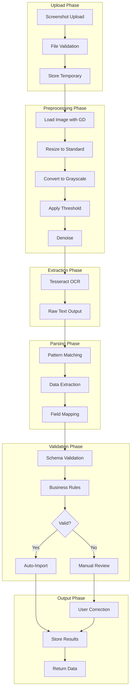
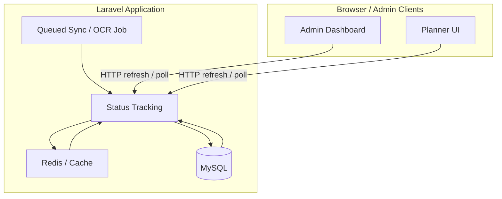

# SPEC-007: External Integration System - Technical Specification

**Document Version**: 2.3.0
**Date**: 2026-03-11
**Project**: Umamusume Pretty Derby Career Planner
**Status**: Active - Updated with polling-based status delivery and corrected OCR validation
**Classification**: Internal - Development Team

---

## Document Information

| Attribute | Value |
| --- | --- |
| **Document ID** | SPEC-007 |
| **Related PRD** | [PRD-007: External Integration](../02-prds/PRD-007_External_Integration.md) |
| **Architecture Version** | v2.3.0 |
| **Approval Status** | Approved |
| **Last Reviewed** | 2026-03-11 |

### Related Documents

**Requirements & Design**:

- [SRS Section 3.8: External Integration](../00-core-
docs/003_SRS_Software_Requirement_Specifications.md#28-external-integration-fr-08)
- [SDS Section 4.7: External Integration Architecture](../00-core-
docs/004_SDS_Software_Design_Specifications.md#7-ocr-pipeline)

**Data & Integration**:
{
    private const BASE_URL = 'https://umapyoi.net/api/v1';
    private const CACHE_PREFIX = 'umapyoi';
    private const DEFAULT_TIMEOUT = 10;
    private const DEFAULT_RETRY_TIMES = 3;

    public function __construct(
        private CircuitBreaker $circuitBreaker,
        private string $apiKey = ''
    ) {
        $this->apiKey = config('external-apis.umapyoi.api_key', '');
    }

    /**
     * Get characters/trainees data
     *
     * @param array $filters Optional filters
     * @return array
     */
    public function getCharacters(array $filters = []): array
    {
        return $this->cachedRequest(
            endpoint: '/characters',
            cacheKey: $this->buildCacheKey('characters', $filters),
            cacheTtl: config('external-apis.cache_ttl.characters', 86400),
            params: $filters
        );
    }

    /**
     * Get single character by ID
     *
     * @param int $traineeId External trainee ID
     * @return array
     */
    public function getCharacter(int $traineeId): array
    {
        return $this->cachedRequest(
            endpoint: "/characters/{$traineeId}",
            cacheKey: $this->buildCacheKey("character:{$traineeId}"),
            cacheTtl: config('external-apis.cache_ttl.characters', 86400)
        );
    }

    /**
     * Get support cards data
     *
     * @param array $filters Optional filters
     * @return array
     */
    public function getSupportCards(array $filters = []): array
    {
        return $this->cachedRequest(
            endpoint: '/support-cards',
            cacheKey: $this->buildCacheKey('support-cards', $filters),
            cacheTtl: config('external-apis.cache_ttl.support_cards', 86400),
            params: $filters
        );
    }

    /**
     * Get skills data
     *
     * @param array $filters Optional filters
     * @return array
     */
    public function getSkills(array $filters = []): array
    {
        return $this->cachedRequest(
            endpoint: '/skills',
            cacheKey: $this->buildCacheKey('skills', $filters),
            cacheTtl: config('external-apis.cache_ttl.skills', 86400),
            params: $filters
        );
    }

    /**
     * Get races data
     *
     * @param array $filters Optional filters
     * @return array
     */
    public function getRaces(array $filters = []): array
    {
        return $this->cachedRequest(
            endpoint: '/races',
            cacheKey: $this->buildCacheKey('races', $filters),
            cacheTtl: config('external-apis.cache_ttl.races', 86400),
            params: $filters
        );
    }

    /**
     * Get meta tier rankings
     *
     * @param string|null $type Card type filter
     * @return array
     */
    public function getMetaTiers(?string $type = null): array
    {
        $params = $type ? ['type' => $type] : [];

        return $this->cachedRequest(
            endpoint: '/meta/tiers',
            cacheKey: $this->buildCacheKey('meta-tiers', $params),
            cacheTtl: config('external-apis.cache_ttl.meta', 43200), // 12 hours
            params: $params
        );
    }

    /**
     * Check API health status
     *
     * @return bool
     */
    public function isHealthy(): bool
    {
        try {
            $response = Http::timeout(5)
                ->get(self::BASE_URL . '/health');

            return $response->successful();
        } catch (\Exception $e) {
            Log::warning('Umapyoi health check failed', [
                'error' => $e->getMessage(),
            ]);
            return false;
        }
    }

    /**
     * Get API source identifier
     *
     * @return string
     */
    public function getSourceIdentifier(): string
    {
        return 'umapyoi';
    }

    /**
     * Execute cached API request
     *
     * @param string $endpoint API endpoint
     * @param string $cacheKey Cache key
     * @param int $cacheTtl Cache TTL in seconds
     * @param array $params Query parameters
     * @return array
     * @throws ExternalAPIException
     */
    private function cachedRequest(
        string $endpoint,
        string $cacheKey,
        int $cacheTtl,
        array $params = []
    ): array {
        // Check cache first
        if ($cached = Cache::get($cacheKey)) {
            return $cached;
        }

        // Execute through circuit breaker
        $data = $this->circuitBreaker->call(
            key: 'umapyoi',
            callback: fn() => $this->executeRequest($endpoint, $params),
            fallback: fn() => $this->getFallbackData($endpoint)
        );

        // Cache successful response
        if (!empty($data)) {
            Cache::put($cacheKey, $data, $cacheTtl);
        }

        return $data;
    }

    /**
     * Execute HTTP request
     *
     * @param string $endpoint API endpoint
     * @param array $params Query parameters
     * @return array
     * @throws ExternalAPIException
     */
    private function executeRequest(string $endpoint, array $params = []): array
    {
        $response = Http::timeout(self::DEFAULT_TIMEOUT)
            ->retry(self::DEFAULT_RETRY_TIMES, 100)
            ->withHeaders($this->buildHeaders())
            ->get(self::BASE_URL . $endpoint, $params);

        if (!$response->successful()) {
            throw new ExternalAPIException(
                "Umapyoi API request failed: {$response->status()}",
                $response->status()
            );
        }

        return $response->json('data', []);
    }

    /**
     * Build request headers
     *
     * @return array
     */
    private function buildHeaders(): array
    {
        $headers = [
            'Accept' => 'application/json',
            'User-Agent' => 'UmamusumeCareerPlanner/2.0',
        ];

        if ($this->apiKey) {
            $headers['Authorization'] = "Bearer {$this->apiKey}";
        }

        return $headers;
    }

    /**
     * Build cache key
     *
     * @param string $type Data type
     * @param array $params Parameters
     * @return string
     */
    private function buildCacheKey(string $type, array $params = []): string
    {
        $paramHash = $params ? ':' . md5(serialize($params)) : '';
        return self::CACHE_PREFIX . ":{$type}{$paramHash}";
    }

    /**
     * Get fallback data when API unavailable
     *
     * @param string $endpoint Requested endpoint
     * @return array
     */
    private function getFallbackData(string $endpoint): array
    {
        // Try to return stale cached data
        $staleKey = self::CACHE_PREFIX . ":stale:{$endpoint}";

        if ($stale = Cache::get($staleKey)) {
            Log::info('Returning stale data for endpoint', [
                'endpoint' => $endpoint,
            ]);
            return $stale;
        }

        Log::warning('No fallback data available', [
            'endpoint' => $endpoint,
        ]);

        return [];
    }
}
```text

### 3.3 UmamusumeDB API Client

```php
<?php

namespace App\Services\ExternalAPI\Clients;

use App\Contracts\ExternalApiClientInterface;
use App\Services\ExternalAPI\CircuitBreaker;
use Illuminate\Support\Facades\{Http, Cache, Log};

/**
 * UmamusumeDB API Client
 *
 * Fallback external data source for game information.
 */
class UmamusumeDBApiClient implements ExternalApiClientInterface
{
    private const BASE_URL = 'https://umamusumedb.com/api';
    private const CACHE_PREFIX = 'umadb';

    public function __construct(

`GameTora` is used elsewhere in the project as a supplementary scraper/CDN-backed enrichment source
for support-card metadata and artwork, but it is not modeled in this SPEC as a first-class API
client because it does not provide the same stable direct API contract as `Umapyoi` and
`UmamusumeDB`.
        private CircuitBreaker $circuitBreaker
    ) {}

    /**
     * Get characters/trainees data
     *
     * @param array $filters Optional filters
     * @return array
     */
    public function getCharacters(array $filters = []): array
    {
        return $this->cachedRequest('/characters', $filters);
    }

    /**
     * Get single character by ID
     *
     * @param int $traineeId External trainee ID
     * @return array
     */
    public function getCharacter(int $traineeId): array
    {
        return $this->cachedRequest("/characters/{$traineeId}");
    }

    /**
     * Get support cards data
     *
     * @param array $filters Optional filters
     * @return array
     */
    public function getSupportCards(array $filters = []): array
    {
        return $this->cachedRequest('/support-cards', $filters);
    }

    /**
     * Get skills data
     *
     * @param array $filters Optional filters
     * @return array
     */
    public function getSkills(array $filters = []): array
    {
        return $this->cachedRequest('/skills', $filters);
    }

    /**
     * Get races data
     *
     * @param array $filters Optional filters
     * @return array
     */
    public function getRaces(array $filters = []): array
    {
        return $this->cachedRequest('/races', $filters);
    }

    /**
     * Check API health status
     *
     * @return bool
     */
    public function isHealthy(): bool
    {
        try {
            $response = Http::timeout(5)->get(self::BASE_URL . '/status');
            return $response->successful();
        } catch (\Exception $e) {
            return false;
        }
    }

    /**
     * Get API source identifier
     *
     * @return string
     */
    public function getSourceIdentifier(): string
    {
        return 'umamusumedb';
    }

    /**
     * Execute cached API request
     *
     * @param string $endpoint API endpoint
     * @param array $params Query parameters
     * @return array
     */
    private function cachedRequest(string $endpoint, array $params = []): array
    {
        $cacheKey = $this->buildCacheKey($endpoint, $params);

        return Cache::remember($cacheKey, 86400, function () use ($endpoint, $params) {
            return $this->circuitBreaker->call(
                key: 'umamusumedb',
                callback: fn() => $this->executeRequest($endpoint, $params),
                fallback: fn() => []
            );
        });
    }

    /**
     * Execute HTTP request
     *
     * @param string $endpoint API endpoint
     * @param array $params Query parameters
     * @return array
     */
    private function executeRequest(string $endpoint, array $params = []): array
    {
        $response = Http::timeout(10)
            ->retry(2, 200)
            ->get(self::BASE_URL . $endpoint, $params);

        return $response->successful() ? $response->json('data', []) : [];
    }

    /**
     * Build cache key
     *
     * @param string $endpoint Endpoint
     * @param array $params Parameters
     * @return string
     */
    private function buildCacheKey(string $endpoint, array $params = []): string
    {
        $paramHash = $params ? ':' . md5(serialize($params)) : '';
        return self::CACHE_PREFIX . ":{$endpoint}{$paramHash}";
    }
}
```

---

## 4. Circuit Breaker Pattern

### 4.1 Circuit Breaker States

```mermaid
stateDiagram-v2
    [*] --> Closed: Initial State
    Closed --> Open: Failure Threshold Exceeded
    Open --> HalfOpen: Recovery Timeout Elapsed
    HalfOpen --> Closed: Probe Success
    HalfOpen --> Open: Probe Failure

    Closed: Normal Operation
    Closed: Requests pass through
    Closed: Track failures

    Open: Circuit Tripped
    Open: Return fallback immediately
    Open: Wait for recovery timeout

    HalfOpen: Testing Recovery
    HalfOpen: Allow limited probe requests
    HalfOpen: Evaluate success/failure
```text

### 4.2 Circuit Breaker Implementation

```php
<?php

namespace App\Services\ExternalAPI;

use Illuminate\Support\Facades\{Cache, Log};
use App\Enums\CircuitState;

/**
 * Circuit Breaker Implementation
 *
 * Prevents cascade failures by tracking external service health.
 */
class CircuitBreaker
{
    private const CACHE_PREFIX = 'circuit_breaker';

    private int $failureThreshold;
    private int $recoveryTimeout;
    private int $sampleWindow;

    public function __construct()
    {
        $this->failureThreshold = config('external-apis.circuit_breaker.failure_threshold', 5);
        $this->recoveryTimeout = config('external-apis.circuit_breaker.recovery_timeout', 60);
        $this->sampleWindow = config('external-apis.circuit_breaker.sample_window', 120);
    }

    /**
     * Execute callback through circuit breaker
     *
     * @param string $key Circuit identifier
     * @param callable $callback Main operation
     * @param callable $fallback Fallback operation
     * @return mixed
     */
    public function call(string $key, callable $callback, callable $fallback): mixed
    {
        $state = $this->getState($key);

        return match ($state) {
            CircuitState::Open => $this->handleOpen($key, $fallback),
            CircuitState::HalfOpen => $this->handleHalfOpen($key, $callback, $fallback),
            default => $this->handleClosed($key, $callback, $fallback),
        };
    }

    /**
     * Get current circuit state
     *
     * @param string $key Circuit identifier
     * @return CircuitState
     */
    public function getState(string $key): CircuitState
    {
        $data = $this->getCircuitData($key);

        if ($data['state'] === CircuitState::Open->value) {
            // Check if recovery timeout has elapsed
            if (time() - $data['opened_at'] >= $this->recoveryTimeout) {
                return CircuitState::HalfOpen;
            }
            return CircuitState::Open;
        }

        return CircuitState::from($data['state']);
    }

    /**
     * Handle closed state (normal operation)
     *
     * @param string $key Circuit identifier
     * @param callable $callback Main operation
     * @param callable $fallback Fallback operation
     * @return mixed
     */
    private function handleClosed(string $key, callable $callback, callable $fallback): mixed
    {
        try {
            $result = $callback();
            $this->recordSuccess($key);
            return $result;
        } catch (\Exception $e) {
            $this->recordFailure($key);

            if ($this->shouldTrip($key)) {
                $this->trip($key);
            }

            Log::warning('Circuit breaker recorded failure', [
                'key' => $key,
                'error' => $e->getMessage(),
            ]);

            return $fallback();
        }
    }

    /**
     * Handle open state (circuit tripped)
     *
     * @param string $key Circuit identifier
     * @param callable $fallback Fallback operation
     * @return mixed
     */
    private function handleOpen(string $key, callable $fallback): mixed
    {
        Log::info('Circuit breaker open, returning fallback', [
            'key' => $key,
        ]);

        return $fallback();
    }

    /**
     * Handle half-open state (testing recovery)
     *
     * @param string $key Circuit identifier
     * @param callable $callback Main operation
     * @param callable $fallback Fallback operation
     * @return mixed
     */
    private function handleHalfOpen(string $key, callable $callback, callable $fallback): mixed
    {
        try {
            $result = $callback();
            $this->reset($key);

            Log::info('Circuit breaker recovered', [
                'key' => $key,
            ]);

            return $result;
        } catch (\Exception $e) {
            $this->trip($key);

            Log::warning('Circuit breaker probe failed', [
                'key' => $key,
                'error' => $e->getMessage(),
            ]);

            return $fallback();
        }
    }

    /**
     * Record successful operation
     *
     * @param string $key Circuit identifier
     * @return void
     */
    private function recordSuccess(string $key): void
    {
        $data = $this->getCircuitData($key);
        $data['successes']++;
        $this->saveCircuitData($key, $data);
    }

    /**
     * Record failed operation
     *
     * @param string $key Circuit identifier
     * @return void
     */
    private function recordFailure(string $key): void
    {
        $data = $this->getCircuitData($key);
        $data['failures']++;
        $data['last_failure'] = time();
        $this->saveCircuitData($key, $data);
    }

    /**
     * Check if circuit should trip
     *
     * @param string $key Circuit identifier
     * @return bool
     */
    private function shouldTrip(string $key): bool
    {
        $data = $this->getCircuitData($key);

        // Check if failures within sample window exceed threshold
        $windowStart = time() - $this->sampleWindow;

        return $data['failures'] >= $this->failureThreshold
            && $data['last_failure'] >= $windowStart;
    }

    /**
     * Trip the circuit (open it)
     *
     * @param string $key Circuit identifier
     * @return void
     */
    private function trip(string $key): void
    {
        $data = $this->getCircuitData($key);
        $data['state'] = CircuitState::Open->value;
        $data['opened_at'] = time();
        $this->saveCircuitData($key, $data);

        Log::warning('Circuit breaker tripped', [
            'key' => $key,
            'failures' => $data['failures'],
        ]);

        event(new \App\Events\CircuitBreakerTripped($key));
    }

    /**
     * Reset circuit to closed state
     *
     * @param string $key Circuit identifier
     * @return void
     */
    private function reset(string $key): void
    {
        $this->saveCircuitData($key, $this->getDefaultData());

        event(new \App\Events\CircuitBreakerReset($key));
    }

    /**
     * Get circuit data from cache
     *
     * @param string $key Circuit identifier
     * @return array
     */
    private function getCircuitData(string $key): array
    {
        return Cache::get(
            self::CACHE_PREFIX . ":{$key}",
            $this->getDefaultData()
        );
    }

    /**
     * Save circuit data to cache
     *
     * @param string $key Circuit identifier
     * @param array $data Circuit data
     * @return void
     */
    private function saveCircuitData(string $key, array $data): void
    {
        Cache::put(
            self::CACHE_PREFIX . ":{$key}",
            $data,
            now()->addHours(24)
        );
    }

    /**
     * Get default circuit data
     *
     * @return array
     */
    private function getDefaultData(): array
    {
        return [
            'state' => CircuitState::Closed->value,
            'failures' => 0,
            'successes' => 0,
            'last_failure' => null,
            'opened_at' => null,
        ];
    }

    /**
     * Force reset circuit (admin operation)
     *
     * @param string $key Circuit identifier
     * @return void
     */
    public function forceReset(string $key): void
    {
        $this->reset($key);

        Log::info('Circuit breaker force reset', [
            'key' => $key,
        ]);
    }

    /**
     * Get all circuit states
     *
     * @return array
     */
    public function getAllStates(): array
    {
        $keys = ['umapyoi', 'umamusumedb'];
        $states = [];

        foreach ($keys as $key) {
            $states[$key] = [
                'state' => $this->getState($key)->value,
                'data' => $this->getCircuitData($key),
            ];
        }

        return $states;
    }
}
```

### 4.3 Circuit State Enum

```php
<?php

namespace App\Enums;

enum CircuitState: string
{
    case Closed = 'closed';
    case Open = 'open';
    case HalfOpen = 'half_open';

    /**
     * Check if requests should pass through
     *
     * @return bool
     */
    public function allowsRequests(): bool
    {
        return match($this) {
            self::Closed => true,
            self::HalfOpen => true, // Limited
            self::Open => false,
        };
    }

    /**
     * Get display label
     *
     * @return string
     */
    public function label(): string
    {
        return match($this) {
            self::Closed => 'Healthy',
            self::Open => 'Unavailable',
            self::HalfOpen => 'Recovering',
        };
    }

    /**
     * Get status color
     *
     * @return string
     */
    public function color(): string
    {
        return match($this) {
            self::Closed => 'green',
            self::Open => 'red',
            self::HalfOpen => 'yellow',
        };
    }
}
```text

---

## 5. OCR Processing Pipeline

### 5.1 Pipeline Architecture



### 5.2 Image Processing Service

```php
<?php

namespace App\Services\OCR;

use Illuminate\Http\UploadedFile;
use Illuminate\Support\Facades\{Storage, Log};
use App\Exceptions\OCRProcessingException;

/**
 * Image Processing Service
 *
 * Preprocesses images for optimal OCR extraction using GD library.
 */
class ImageProcessingService
{
    private const MAX_WIDTH = 2000;
    private const MAX_HEIGHT = 2000;
    private const THRESHOLD_VALUE = 128;

    /**
     * Preprocess image for OCR
     *
     * @param UploadedFile $file Uploaded image file
     * @return string Path to processed image
     * @throws OCRProcessingException
     */
    public function preprocess(UploadedFile $file): string
    {
        $this->validateImage($file);

        $sourcePath = $file->getPathname();
        $image = $this->loadImage($sourcePath, $file->getMimeType());

        // Apply preprocessing steps
        $image = $this->resize($image);
        $image = $this->convertToGrayscale($image);
        $image = $this->applyThreshold($image);
        $image = $this->denoise($image);

        // Save processed image
        $outputPath = $this->saveProcessedImage($image);

        imagedestroy($image);

        return $outputPath;
    }

    /**
     * Validate uploaded image
     *
     * @param UploadedFile $file Uploaded file
     * @return void
     * @throws OCRProcessingException
     */
    private function validateImage(UploadedFile $file): void
    {
        $allowedMimes = ['image/jpeg', 'image/png', 'image/gif', 'image/webp'];

        if (!in_array($file->getMimeType(), $allowedMimes)) {
            throw new OCRProcessingException(
                'Invalid image format. Allowed: JPEG, PNG, GIF, WebP'
            );
        }

        $maxSize = config('ocr.max_file_size', 10 * 1024 * 1024); // 10MB

        if ($file->getSize() > $maxSize) {
            throw new OCRProcessingException(
                'Image file too large. Maximum size: ' . ($maxSize / 1024 / 1024) . 'MB'
            );
        }
    }

    /**
     * Load image from file
     *
     * @param string $path File path
     * @param string $mimeType MIME type
     * @return \GdImage
     * @throws OCRProcessingException
     */
    private function loadImage(string $path, string $mimeType): \GdImage
    {
        $image = match ($mimeType) {
            'image/jpeg' => imagecreatefromjpeg($path),
            'image/png' => imagecreatefrompng($path),
            'image/gif' => imagecreatefromgif($path),
            'image/webp' => imagecreatefromwebp($path),
            default => throw new OCRProcessingException("Unsupported image type: {$mimeType}"),
        };

        if ($image === false) {
            throw new OCRProcessingException('Failed to load image');
        }

        return $image;
    }

    /**
     * Resize image to standard dimensions
     *
     * @param \GdImage $image Source image
     * @return \GdImage
     */
    private function resize(\GdImage $image): \GdImage
    {
        $width = imagesx($image);
        $height = imagesy($image);

        // Calculate new dimensions maintaining aspect ratio
        $ratio = min(self::MAX_WIDTH / $width, self::MAX_HEIGHT / $height, 1);

        if ($ratio >= 1) {
            return $image; // No resize needed
        }

        $newWidth = (int) ($width * $ratio);
        $newHeight = (int) ($height * $ratio);

        $resized = imagecreatetruecolor($newWidth, $newHeight);
        imagecopyresampled(
            $resized, $image,
            0, 0, 0, 0,
            $newWidth, $newHeight, $width, $height
        );

        imagedestroy($image);

        return $resized;
    }

    /**
     * Convert image to grayscale
     *
     * @param \GdImage $image Source image
     * @return \GdImage
     */
    private function convertToGrayscale(\GdImage $image): \GdImage
    {
        imagefilter($image, IMG_FILTER_GRAYSCALE);
        return $image;
    }

    /**
     * Apply binary threshold
     *
     * @param \GdImage $image Source image
     * @return \GdImage
     */
    private function applyThreshold(\GdImage $image): \GdImage
    {
        $width = imagesx($image);
        $height = imagesy($image);

        for ($x = 0; $x < $width; $x++) {
            for ($y = 0; $y < $height; $y++) {
                $rgb = imagecolorat($image, $x, $y);
                $gray = ($rgb >> 16) & 0xFF; // Get red channel (grayscale)

                $newColor = $gray > self::THRESHOLD_VALUE ? 255 : 0;
                $color = imagecolorallocate($image, $newColor, $newColor, $newColor);
                imagesetpixel($image, $x, $y, $color);
            }
        }

        return $image;
    }

    /**
     * Apply denoise filter
     *
     * @param \GdImage $image Source image
     * @return \GdImage
     */
    private function denoise(\GdImage $image): \GdImage
    {
        // Apply median filter effect using smooth filter
        imagefilter($image, IMG_FILTER_SMOOTH, 1);

        // Increase contrast to sharpen text
        imagefilter($image, IMG_FILTER_CONTRAST, -10);

        return $image;
    }

    /**
     * Save processed image
     *
     * @param \GdImage $image Processed image
     * @return string Output path
     */
    private function saveProcessedImage(\GdImage $image): string
    {
        $filename = 'ocr_processed_' . uniqid() . '.png';
        $path = storage_path("app/temp/{$filename}");

        // Ensure directory exists
        if (!is_dir(dirname($path))) {
            mkdir(dirname($path), 0755, true);
        }

        imagepng($image, $path);

        return $path;
    }
}
```text

### 5.3 Tesseract Service

```php
<?php

namespace App\Services\OCR;

use Illuminate\Support\Facades\{Process, Log};
use App\Exceptions\OCRProcessingException;

/**
 * Tesseract OCR Service
 *
 * Extracts text from preprocessed images using Tesseract OCR engine.
 */
class TesseractService
{
    private string $tesseractPath;
    private string $language;
    private int $timeout;

    public function __construct()
    {
        $this->tesseractPath = config('ocr.tesseract_path', '/usr/bin/tesseract');
        $this->language = config('ocr.language', 'jpn+eng');
        $this->timeout = config('ocr.timeout', 60);
    }

    /**
     * Extract text from image
     *
     * @param string $imagePath Path to preprocessed image
     * @return string Extracted text
     * @throws OCRProcessingException
     */
    public function extract(string $imagePath): string
    {
        $this->validateTesseract();
        $this->validateImagePath($imagePath);

        $outputBase = tempnam(sys_get_temp_dir(), 'ocr_');
        $outputFile = $outputBase . '.txt';

        try {
            $result = Process::timeout($this->timeout)->run([
                $this->tesseractPath,
                $imagePath,
                $outputBase,
                '-l', $this->language,
                '--oem', '3',
                '--psm', '6',
            ]);

            if (!$result->successful()) {
                throw new OCRProcessingException(
                    'Tesseract extraction failed: ' . $result->errorOutput()
                );
            }

            if (!file_exists($outputFile)) {
                throw new OCRProcessingException('Tesseract output file not created');
            }

            $text = file_get_contents($outputFile);

            return $this->cleanText($text);
        } finally {
            // Cleanup temporary files
            @unlink($outputBase);
            @unlink($outputFile);
        }
    }

    /**
     * Extract text with confidence scores
     *
     * @param string $imagePath Path to preprocessed image
     * @return array{text: string, confidence: float, words: array}
     * @throws OCRProcessingException
     */
    public function extractWithConfidence(string $imagePath): array
    {
        $this->validateTesseract();
        $this->validateImagePath($imagePath);

        $outputBase = tempnam(sys_get_temp_dir(), 'ocr_');
        $outputFile = $outputBase . '.tsv';

        try {
            $result = Process::timeout($this->timeout)->run([
                $this->tesseractPath,
                $imagePath,
                $outputBase,
                '-l', $this->language,
                '--oem', '3',
                '--psm', '6',
                'tsv',
            ]);

            if (!$result->successful()) {
                throw new OCRProcessingException(
                    'Tesseract extraction failed: ' . $result->errorOutput()
                );
            }

            return $this->parseTsvOutput($outputFile);
        } finally {
            @unlink($outputBase);
            @unlink($outputFile);
        }
    }

    /**
     * Validate Tesseract installation
     *
     * @return void
     * @throws OCRProcessingException
     */
    private function validateTesseract(): void
    {
        if (!file_exists($this->tesseractPath)) {
            throw new OCRProcessingException(
                "Tesseract not found at: {$this->tesseractPath}"
            );
        }
    }

    /**
     * Validate image path exists
     *
     * @param string $imagePath Image path
     * @return void
     * @throws OCRProcessingException
     */
    private function validateImagePath(string $imagePath): void
    {
        if (!file_exists($imagePath)) {
            throw new OCRProcessingException(
                "Image file not found: {$imagePath}"
            );
        }
    }

    /**
     * Clean extracted text
     *
     * @param string $text Raw text
     * @return string Cleaned text
     */
    private function cleanText(string $text): string
    {
        // Remove excessive whitespace
        $text = preg_replace('/\s+/', ' ', $text);

        // Trim leading/trailing whitespace
        $text = trim($text);

        return $text;
    }

    /**
     * Parse TSV output with confidence scores
     *
     * @param string $tsvPath TSV file path
     * @return array
     */
    private function parseTsvOutput(string $tsvPath): array
    {
        if (!file_exists($tsvPath)) {
            return ['text' => '', 'confidence' => 0, 'words' => []];
        }

        $content = file_get_contents($tsvPath);
        $lines = explode("\n", trim($content));

        $words = [];
        $totalConfidence = 0;
        $wordCount = 0;
        $fullText = '';

        foreach (array_slice($lines, 1) as $line) { // Skip header
            $parts = explode("\t", $line);

            if (count($parts) >= 12 && !empty(trim($parts[11]))) {
                $word = trim($parts[11]);
                $confidence = (float) ($parts[10] ?? 0);

                $words[] = [
                    'text' => $word,
                    'confidence' => $confidence,
                    'x' => (int) $parts[6],
                    'y' => (int) $parts[7],
                    'width' => (int) $parts[8],
                    'height' => (int) $parts[9],
                ];

                $fullText .= $word . ' ';
                $totalConfidence += $confidence;
                $wordCount++;
            }
        }

        return [
            'text' => trim($fullText),
            'confidence' => $wordCount > 0 ? $totalConfidence / $wordCount : 0,
            'words' => $words,
        ];
    }

    /**
     * Check if Tesseract is available
     *
     * @return bool
     */
    public function isAvailable(): bool
    {
        try {
            $result = Process::timeout(5)->run([
                $this->tesseractPath,
                '--version',
            ]);

            return $result->successful();
        } catch (\Exception $e) {
            return false;
        }
    }

    /**
     * Get available languages
     *
     * @return array
     */
    public function getAvailableLanguages(): array
    {
        try {
            $result = Process::timeout(5)->run([
                $this->tesseractPath,
                '--list-langs',
            ]);

            if ($result->successful()) {
                $lines = explode("\n", $result->output());
                return array_filter(array_slice($lines, 1)); // Skip header
            }
        } catch (\Exception $e) {
            Log::warning('Failed to get Tesseract languages', [
                'error' => $e->getMessage(),
            ]);
        }

        return [];
    }
}
```

### 5.4 OCR Parser Service

```php
<?php

namespace App\Services\OCR;

use Illuminate\Support\Facades\Log;

/**
 * OCR Parser Service
 *
 * Parses raw OCR text into structured game data.
 */
class OCRParserService
{
    /**
     * Stat extraction patterns
     *
     * These regexes are indicative rather than exhaustive. OCR output may still
     * require manual review for split tokens or spacing artifacts such as
     * "Spee d", and the validation layer is expected to catch unrealistic values.
     */
    private const STAT_PATTERNS = [
        'speed' => '/(?:Speed|スピード)[:\s]*(\d{1,4})/i',
        'stamina' => '/(?:Stamina|スタミナ)[:\s]*(\d{1,4})/i',
        'power' => '/(?:Power|パワー)[:\s]*(\d{1,4})/i',
        'guts' => '/(?:Guts|根性)[:\s]*(\d{1,4})/i',
        'wit' => '/(?:Wit|Wisdom|賢さ)[:\s]*(\d{1,4})/i',
    ];

    /**
     * Aptitude extraction patterns
     */
    private const APTITUDE_PATTERNS = [
        'distance' => [
            'sprint' => '/(?:Sprint|短距離)[:\s]*([A-GS])/i',
            'mile' => '/(?:Mile|マイル)[:\s]*([A-GS])/i',
            'medium' => '/(?:Medium|中距離)[:\s]*([A-GS])/i',
            'long' => '/(?:Long|長距離)[:\s]*([A-GS])/i',
        ],
        'surface' => [
            'turf' => '/(?:Turf|芝)[:\s]*([A-GS])/i',
            'dirt' => '/(?:Dirt|ダート)[:\s]*([A-GS])/i',
        ],
        'style' => [
            'nige' => '/(?:Nige|逃げ)[:\s]*([A-GS])/i',
            'senkou' => '/(?:Senkou|先行)[:\s]*([A-GS])/i',
            'sashi' => '/(?:Sashi|差し)[:\s]*([A-GS])/i',
            'oikomi' => '/(?:Oikomi|追込)[:\s]*([A-GS])/i',
        ],
    ];

    /**
     * Mood extraction pattern
     */
    private const MOOD_PATTERN = '/(?:Mood|やる気)[:\s]*(Great|Good|Normal|Bad|Awful|絶好調|好調|普通|不調|絶不調)/i';

    /**
     * Energy extraction pattern
     */
    private const ENERGY_PATTERN = '/(?:Energy|体力)[:\s]*(\d{1,3})%?/i';

    /**
     * Parse OCR text into structured data
     *
     * @param string $text Raw OCR text
     * @return array Parsed data
     */
    public function parse(string $text): array
    {
        return [
            'stats' => $this->extractStats($text),
            'aptitudes' => $this->extractAptitudes($text),
            'mood' => $this->extractMood($text),
            'energy' => $this->extractEnergy($text),
            'raw_text' => $text,
        ];
    }

    /**
     * Parse with confidence scoring
     *
     * @param array $ocrResult OCR result with confidence
     * @return array{data: array, confidence: float, fields: array}
     */
    public function parseWithConfidence(array $ocrResult): array
    {
        $text = $ocrResult['text'];
        $baseConfidence = $ocrResult['confidence'];

        $data = $this->parse($text);
        $fieldConfidences = $this->calculateFieldConfidences($data);

        $overallConfidence = $this->calculateOverallConfidence(
            $baseConfidence,
            $fieldConfidences
        );

        return [
            'data' => $data,
            'confidence' => $overallConfidence,
            'fields' => $fieldConfidences,
        ];
    }

    /**
     * Extract stats from text
     *
     * @param string $text Raw text
     * @return array
     */
    private function extractStats(string $text): array
    {
        $stats = [];

        foreach (self::STAT_PATTERNS as $stat => $pattern) {
            if (preg_match($pattern, $text, $matches)) {
                $value = (int) $matches[1];

                // Accept practical planner range; validation will warn above 1200.
                if ($value >= 0 && $value <= 1600) {
                    $stats[$stat] = $value;
                }
            }
        }

        return $stats;
    }

    /**
     * Extract aptitudes from text
     *
     * @param string $text Raw text
     * @return array
     */
    private function extractAptitudes(string $text): array
    {
        $aptitudes = [];

        foreach (self::APTITUDE_PATTERNS as $category => $patterns) {
            $aptitudes[$category] = [];

            foreach ($patterns as $type => $pattern) {
                if (preg_match($pattern, $text, $matches)) {
                    $grade = strtoupper($matches[1]);

                    // Validate grade
                    if ($this->isValidGrade($grade)) {
                        $aptitudes[$category][$type] = $grade;
                    }
                }
            }
        }

        return $aptitudes;
    }

    /**
     * Extract mood from text
     *
     * @param string $text Raw text
     * @return string|null
     */
    private function extractMood(string $text): ?string
    {
        if (preg_match(self::MOOD_PATTERN, $text, $matches)) {
            return $this->normalizeMood($matches[1]);
        }

        return null;
    }

    /**
     * Extract energy from text
     *
     * @param string $text Raw text
     * @return int|null
     */
    private function extractEnergy(string $text): ?int
    {
        if (preg_match(self::ENERGY_PATTERN, $text, $matches)) {
            $value = (int) $matches[1];

            // Validate range (0-100)
            if ($value >= 0 && $value <= 100) {
                return $value;
            }
        }

        return null;
    }

    /**
     * Validate aptitude grade
     *
     * @param string $grade Grade string
     * @return bool
     */
    private function isValidGrade(string $grade): bool
    {
        return in_array($grade, ['S', 'A', 'B', 'C', 'D', 'E', 'F', 'G']);
    }

    /**
     * Normalize mood string
     *
     * @param string $mood Raw mood string
     * @return string
     */
    private function normalizeMood(string $mood): string
    {
        $moodMap = [
            '絶好調' => 'great',
            '好調' => 'good',
            '普通' => 'normal',
            '不調' => 'bad',
            '絶不調' => 'awful',
            'great' => 'great',
            'good' => 'good',
            'normal' => 'normal',
            'bad' => 'bad',
            'awful' => 'awful',
        ];

        return $moodMap[strtolower($mood)] ?? 'normal';
    }

    /**
     * Calculate field-level confidences
     *
     * @param array $data Parsed data
     * @return array
     */
    private function calculateFieldConfidences(array $data): array
    {
        $confidences = [];

        // Stats confidence based on completeness
        $statsCount = count($data['stats']);
        $confidences['stats'] = min(100, $statsCount * 20);

        // Aptitudes confidence
        $aptitudeCount = 0;
        foreach ($data['aptitudes'] as $category) {
            $aptitudeCount += count($category);
        }
        $confidences['aptitudes'] = min(100, $aptitudeCount * 10);

        // Mood and energy
        $confidences['mood'] = $data['mood'] !== null ? 100 : 0;
        $confidences['energy'] = $data['energy'] !== null ? 100 : 0;

        return $confidences;
    }

    /**
     * Calculate overall confidence score
     *
     * @param float $baseConfidence OCR base confidence
     * @param array $fieldConfidences Field-level confidences
     * @return float
     */
    private function calculateOverallConfidence(
        float $baseConfidence,
        array $fieldConfidences
    ): float {
        // Weight OCR confidence at 60%, field extraction at 40%
        $fieldAvg = array_sum($fieldConfidences) / count($fieldConfidences);

        return ($baseConfidence * 0.6) + ($fieldAvg * 0.4);
    }
}
```text

### 5.5 OCR Validation Service

```php
<?php

namespace App\Services\OCR;

use Illuminate\Support\Facades\Validator;

/**
 * OCR Validation Service
 *
 * Validates extracted OCR data against business rules.
 */
class OCRValidationService
{
    private const CONFIDENCE_THRESHOLD = 80.0;

    /**
     * Validate extracted data
     *
     * @param array $data Parsed OCR data
     * @param float $confidence Confidence score
     * @return array{valid: bool, errors: array, warnings: array, requires_review: bool}
     */
    public function validate(array $data, float $confidence): array
    {
        $errors = [];
        $warnings = [];

        // Validate stats
        $statsValidation = $this->validateStats($data['stats'] ?? []);
        $errors = array_merge($errors, $statsValidation['errors']);
        $warnings = array_merge($warnings, $statsValidation['warnings']);

        // Validate aptitudes
        $aptValidation = $this->validateAptitudes($data['aptitudes'] ?? []);
        $errors = array_merge($errors, $aptValidation['errors']);
        $warnings = array_merge($warnings, $aptValidation['warnings']);

        // Validate mood
        if (isset($data['mood'])) {
            $moodValidation = $this->validateMood($data['mood']);
            $errors = array_merge($errors, $moodValidation['errors']);
        }

        // Validate energy
        if (isset($data['energy'])) {
            $energyValidation = $this->validateEnergy($data['energy']);
            $errors = array_merge($errors, $energyValidation['errors']);
        }

        // Check confidence threshold
        $requiresReview = $confidence < self::CONFIDENCE_THRESHOLD;

        if ($requiresReview) {
            $warnings[] = "Confidence score ({$confidence}%) below threshold. Manual review recommended.";
        }

        return [
            'valid' => empty($errors),
            'errors' => $errors,
            'warnings' => $warnings,
            'requires_review' => $requiresReview || !empty($errors),
        ];
    }

    /**
     * Validate stats
     *
     * @param array $stats Stats array
     * @return array{errors: array, warnings: array}
     */
    private function validateStats(array $stats): array
    {
        $errors = [];
        $warnings = [];

        $requiredStats = ['speed', 'stamina', 'power', 'guts', 'wit'];
        $foundStats = array_keys($stats);
        $missingStats = array_diff($requiredStats, $foundStats);

        if (!empty($missingStats)) {
            $warnings[] = 'Missing stats: ' . implode(', ', $missingStats);
        }

        foreach ($stats as $stat => $value) {
            if ($value < 0 || $value > 1600) {
                $errors[] = "{$stat} value {$value} is out of valid range (0-1600)";
                continue;
            }

            if ($value > 1200) {
                $warnings[] = "{$stat} value {$value} is above 1200. Verify OCR accuracy; planner rules apply
                reduced gains above the soft cap.";
            }
        }

        // Check for suspiciously identical values
        $uniqueValues = array_unique(array_values($stats));
        if (count($stats) >= 3 && count($uniqueValues) === 1) {
            $warnings[] = 'All detected stats have identical values - verify accuracy';
        }

        return ['errors' => $errors, 'warnings' => $warnings];
    }

    /**
     * Validate aptitudes
     *
     * @param array $aptitudes Aptitudes array
     * @return array{errors: array, warnings: array}
     */
    private function validateAptitudes(array $aptitudes): array
    {
        $errors = [];
        $warnings = [];

        $validGrades = ['S', 'A', 'B', 'C', 'D', 'E', 'F', 'G'];

        foreach ($aptitudes as $category => $types) {
            foreach ($types as $type => $grade) {
                if (!in_array($grade, $validGrades)) {
                    $errors[] = "Invalid aptitude grade '{$grade}' for {$category}/{$type}";
                }
            }
        }

        // Check for missing categories
        $expectedCategories = ['distance', 'surface', 'style'];
        foreach ($expectedCategories as $category) {
            if (empty($aptitudes[$category] ?? [])) {
                $warnings[] = "Missing aptitude category: {$category}";
            }
        }

        return ['errors' => $errors, 'warnings' => $warnings];
    }

    /**
     * Validate mood value
     *
     * @param string $mood Mood string
     * @return array{errors: array}
     */
    private function validateMood(string $mood): array
    {
        $errors = [];
        $validMoods = ['great', 'good', 'normal', 'bad', 'awful'];

        if (!in_array($mood, $validMoods)) {
            $errors[] = "Invalid mood value: {$mood}";
        }

        return ['errors' => $errors];
    }

    /**
     * Validate energy value
     *
     * @param int $energy Energy value
     * @return array{errors: array}
     */
    private function validateEnergy(int $energy): array
    {
        $errors = [];

        if ($energy < 0 || $energy > 100) {
            $errors[] = "Energy value {$energy} out of valid range (0-100)";
        }

        return ['errors' => $errors];
    }
}
```

### 5.6 OCR Processing Service

```php
<?php

namespace App\Services\OCR;

use Illuminate\Http\UploadedFile;
use Illuminate\Support\Facades\{DB, Log};
use App\Models\OCRExtraction;
use App\Exceptions\OCRProcessingException;

/**
 * OCR Processing Service
 *
 * Orchestrates the complete OCR processing pipeline.
 */
class OCRProcessingService
{
    public function __construct(
        private ImageProcessingService $imageProcessor,
        private TesseractService $tesseract,
        private OCRParserService $parser,
        private OCRValidationService $validator
    ) {}

    /**
     * Process screenshot and extract game data
     *
     * @param UploadedFile $file Uploaded screenshot
     * @param string|null $userId User ID for tracking
     * @return OCRResult
     * @throws OCRProcessingException
     */
    public function process(UploadedFile $file, ?string $userId = null): OCRResult
    {
        $startTime = microtime(true);

        try {
            // Step 1: Preprocess image
            $processedPath = $this->imageProcessor->preprocess($file);

            // Step 2: Extract text with confidence
            $ocrResult = $this->tesseract->extractWithConfidence($processedPath);

            // Step 3: Parse extracted text
            $parsedResult = $this->parser->parseWithConfidence($ocrResult);

            // Step 4: Validate parsed data
            $validation = $this->validator->validate(
                $parsedResult['data'],
                $parsedResult['confidence']
            );

            // Step 5: Store extraction record
            $extraction = $this->storeExtraction(
                $userId,
                $file->getClientOriginalName(),
                $parsedResult,
                $validation
            );

            // Cleanup temporary file
            @unlink($processedPath);

            $processingTime = microtime(true) - $startTime;

            Log::info('OCR processing completed', [
                'extraction_id' => $extraction->id,
                'confidence' => $parsedResult['confidence'],
                'processing_time_ms' => round($processingTime * 1000, 2),
                'requires_review' => $validation['requires_review'],
            ]);

            return new OCRResult(
                extractionId: $extraction->id,
                data: $parsedResult['data'],
                confidence: $parsedResult['confidence'],
                fieldConfidences: $parsedResult['fields'],
                validation: $validation,
                processingTimeMs: round($processingTime * 1000, 2)
            );
        } catch (\Exception $e) {
            Log::error('OCR processing failed', [
                'error' => $e->getMessage(),
                'file' => $file->getClientOriginalName(),
            ]);

            throw new OCRProcessingException(
                "OCR processing failed: {$e->getMessage()}",
                previous: $e
            );
        }
    }

    /**
     * Store extraction record
     *
     * @param string|null $userId User ID
     * @param string $filename Original filename
     * @param array $parsedResult Parsed OCR result
     * @param array $validation Validation result
     * @return OCRExtraction
     */
    private function storeExtraction(
        ?string $userId,
        string $filename,
        array $parsedResult,
        array $validation
    ): OCRExtraction {
        return OCRExtraction::create([
            'user_id' => $userId,
            'screenshot_path' => $filename,
            'extracted_data' => $parsedResult['data'],
            'confidence_score' => $parsedResult['confidence'],
            'verified_by_user' => false,
            'validation_errors' => $validation['errors'],
            'validation_warnings' => $validation['warnings'],
        ]);
    }

    /**
     * Verify and update extraction
     *
     * @param int $extractionId Extraction ID
     * @param array $correctedData User-corrected data
     * @return OCRExtraction
     */
    public function verifyExtraction(int $extractionId, array $correctedData): OCRExtraction
    {
        $extraction = OCRExtraction::findOrFail($extractionId);

        $extraction->update([
            'extracted_data' => $correctedData,
            'verified_by_user' => true,
        ]);

        return $extraction;
    }
}
```text

### 5.7 OCR Result DTO

```php
<?php

namespace App\Services\OCR;

/**
 * OCR Result Data Transfer Object
 */
readonly class OCRResult
{
    public function __construct(
        public int $extractionId,
        public array $data,
        public float $confidence,
        public array $fieldConfidences,
        public array $validation,
        public float $processingTimeMs
    ) {}

    /**
     * Check if result requires manual review
     *
     * @return bool
     */
    public function requiresReview(): bool
    {
        return $this->validation['requires_review'] ?? true;
    }

    /**
     * Check if result is valid
     *
     * @return bool
     */
    public function isValid(): bool
    {
        return $this->validation['valid'] ?? false;
    }

    /**
     * Get validation errors
     *
     * @return array
     */
    public function getErrors(): array
    {
        return $this->validation['errors'] ?? [];
    }

    /**
     * Get validation warnings
     *
     * @return array
     */
    public function getWarnings(): array
    {
        return $this->validation['warnings'] ?? [];
    }

    /**
     * Convert to array
     *
     * @return array
     */
    public function toArray(): array
    {
        return [
            'extraction_id' => $this->extractionId,
            'data' => $this->data,
            'confidence' => $this->confidence,
            'field_confidences' => $this->fieldConfidences,
            'validation' => $this->validation,
            'processing_time_ms' => $this->processingTimeMs,
        ];
    }
}
```

---

## 6. Sync Status and Refresh Updates

### 6.1 Status Propagation Architecture



### 6.2 Status Signals

| Signal | Source | Consumer |
| --- | --- | --- |
| Sync completed timestamp | Scheduled jobs / manual sync actions | Admin sync dashboards |
| OCR extraction result | OCR controllers and services | OCR review UI |
| Notification unread count | `NotificationService` + database notifications | Header bell and notification center |
| External API health | Monitoring and circuit-breaker services | Admin diagnostics and logs |

### 6.3 Current Implementation Pattern

The current `develop` branch does not ship `laravel/reverb` or WebSocket channel authorization.
External integration status is exposed through persisted records, cache state, queue results, and
polling-friendly HTTP endpoints.

Representative implementation artifacts:

- `app/Services/ExternalAPI/ExternalAPIService.php`
- `app/Services/MCP/MCPHealthDashboardService.php`
- `app/Services/MCPMonitoringService.php`
- `app/Http/Controllers/Api/NotificationController.php`

```php
class NotificationController extends Controller
{
    public function __construct(
        private NotificationService $notificationService,
    ) {}

    public function unread(Request $request): JsonResponse
    {
        $user = $request->user();

        if (! $user) {
            return response()->json(['message' => 'Unauthenticated.'], 401);
        }

        return response()->json(
            $this->notificationService->getUnreadForBell($user, limit: 10)
        );
    }
}
```

### 6.4 UX Expectations

- Admin sync pages show last run time, current health, and stale/fresh state.
- OCR flows return persisted extraction results for review rather than pushing them over a socket.
- Notification badges update on the next bell refresh, page load, or polling interval.
- External-data changes surface through refreshed status indicators and logs.

### 6.5 Polling Endpoint Example

```php
<?php

namespace App\Http\Controllers\Api;

use App\Http\Controllers\Controller;
use App\Services\MCPMonitoringService;
use Illuminate\Http\JsonResponse;

/**
 * Sync status endpoint used by polling clients.
 */
class SyncStatusController extends Controller
{
    public function __construct(
        private MCPMonitoringService $monitoringService,
    ) {}

    public function show(): JsonResponse
    {
        return response()->json([
            'health' => $this->monitoringService->getSystemHealthSummary(),
            'refreshed_at' => now()->toIso8601String(),
        ]);
    }
}
```text

---

## 7. Community Tool Integration

### 7.1 Community Integration Service

```php
<?php

namespace App\Services\ExternalAPI;

use App\Models\{Career, Character};
use Illuminate\Support\Facades\{Http, Cache, Log};
use Illuminate\Support\Str;

/**
 * Community Integration Service
 *
 * Handles integration with community tools and data sharing.
 */
class CommunityIntegrationService
{
    private const COMMUNITY_TOOLS = [
        'UmamusumeDB' => 'https://umamusumedb.com',
        'UmaPyoi' => 'https://umapyoi.net',
        'Uel' => 'https://uel.ink',
    ];

    // `Uel` is treated here as a community-facing sharing destination, not as a
    // source in the primary external API client fallback stack.

    /**
     * Share career results to community
     *
     * @param Career $career Career to share
     * @return ShareResult
     */
    public function shareCareerResults(Career $career): ShareResult
    {
        $shareData = $this->buildShareData($career);
        $shareToken = $this->generateShareToken();

        // Store share data
        $share = $career->shares()->create([
            'share_token' => $shareToken,
            'share_data' => $shareData,
            'share_url' => $this->buildShareUrl($shareToken),
        ]);

        return new ShareResult(
            shareId: $share->id,
            shareUrl: $share->share_url,
            shareToken: $shareToken
        );
    }

    /**
     * Build share data from career
     *
     * @param Career $career Career instance
     * @return array
     */
    private function buildShareData(Career $career): array
    {
        return [
            'character_name' => $career->character->name,
            'scenario_type' => $career->scenario_type,
            'final_stats' => $career->final_stats,
            'final_grade' => $this->calculateFinalGrade($career->final_stats),
            'fans_gained' => $career->fans_gained ?? 0,
            'skill_count' => $career->skills()->count(),
            'race_wins' => $career->races()->where('placement', 1)->count(),
            'completed_at' => $career->completed_at?->toIso8601String(),
        ];
    }

    /**
     * Generate unique share token
     *
     * @return string
     */
    private function generateShareToken(): string
    {
        return Str::random(32);
    }

    /**
     * Build shareable URL
     *
     * @param string $token Share token
     * @return string
     */
    private function buildShareUrl(string $token): string
    {
        return url("/share/{$token}");
    }

    /**
     * Calculate final grade from stats
     *
     * @param array $stats Final stats
     * @return string
     */
    private function calculateFinalGrade(array $stats): string
    {
        $total = array_sum($stats);

        return match (true) {
            $total >= 5500 => 'SS',
            $total >= 5000 => 'S',
            $total >= 4500 => 'A',
            $total >= 4000 => 'B',
            $total >= 3500 => 'C',
            $total >= 3000 => 'D',
            default => 'E',
        };
    }

    /**
     * Import community tips for character
     *
     * @param Character $character Character instance
     * @return array
     */
    public function importCommunityTips(Character $character): array
    {
        $cacheKey = "community:tips:{$character->trainee_id}";

        return Cache::remember($cacheKey, now()->addHours(12), function () use ($character) {
            try {
                $response = Http::timeout(10)
                    ->get(self::COMMUNITY_TOOLS['UmaPyoi'] . "/api/tips/{$character->trainee_id}");

                if ($response->successful()) {
                    return $response->json('tips', []);
                }
            } catch (\Exception $e) {
                Log::warning('Failed to fetch community tips', [
                    'character_id' => $character->id,
                    'error' => $e->getMessage(),
                ]);
            }

            return [];
        });
    }

    /**
     * Get community meta rankings
     *
     * @param string $type Ranking type (characters, support_cards)
     * @return array
     */
    public function getMetaRankings(string $type): array
    {
        $cacheKey = "community:meta:{$type}";

        return Cache::remember($cacheKey, now()->addDay(), function () use ($type) {
            try {
                $response = Http::timeout(10)
                    ->get(self::COMMUNITY_TOOLS['UmamusumeDB'] . "/api/meta/{$type}");

                if ($response->successful()) {
                    return $response->json('rankings', []);
                }
            } catch (\Exception $e) {
                Log::warning('Failed to fetch meta rankings', [
                    'type' => $type,
                    'error' => $e->getMessage(),
                ]);
            }

            return [];
        });
    }
}
```

### 7.2 Share Result DTO

```php
<?php

namespace App\Services\ExternalAPI;

/**
 * Share Result Data Transfer Object
 */
readonly class ShareResult
{
    public function __construct(
        public int $shareId,
        public string $shareUrl,
        public string $shareToken
    ) {}

    /**
     * Convert to array
     *
     * @return array
     */
    public function toArray(): array
    {
        return [
            'share_id' => $this->shareId,
            'share_url' => $this->shareUrl,
            'share_token' => $this->shareToken,
        ];
    }
}
```text

---

## 8. Service Layer

### 8.1 External API Service (Orchestrator)

```php
<?php

namespace App\Services\ExternalAPI;

use App\Services\ExternalAPI\Clients\{UmapyoiApiClient, UmamusumeDBApiClient};
use App\Contracts\ExternalApiClientInterface;
use Illuminate\Support\Facades\{Cache, Log};

/**
 * External API Service
 *
 * Orchestrates external API calls with fallback support.
 */
class ExternalAPIService
{
    private array $clients = [];

    public function __construct(
        private UmapyoiApiClient $primaryClient,
        private UmamusumeDBApiClient $fallbackClient,
        private CircuitBreaker $circuitBreaker
    ) {
        $this->clients = [
            'primary' => $this->primaryClient,
            'fallback' => $this->fallbackClient,
        ];
    }

    /**
     * Fetch character data with fallback
     *
     * @param int $traineeId Trainee ID
     * @return array
     */
    public function fetchCharacterData(int $traineeId): array
    {
        return $this->executeWithFallback(
            fn(ExternalApiClientInterface $client) => $client->getCharacter($traineeId),
            "character:{$traineeId}"
        );
    }

    /**
     * Fetch support cards with fallback
     *
     * @param array $filters Optional filters
     * @return array
     */
    public function fetchSupportCards(array $filters = []): array
    {
        return $this->executeWithFallback(
            fn(ExternalApiClientInterface $client) => $client->getSupportCards($filters),
            'support-cards'
        );
    }

    /**
     * Fetch skills with fallback
     *
     * @param array $filters Optional filters
     * @return array
     */
    public function fetchSkills(array $filters = []): array
    {
        return $this->executeWithFallback(
            fn(ExternalApiClientInterface $client) => $client->getSkills($filters),
            'skills'
        );
    }

    /**
     * Fetch races with fallback
     *
     * @param array $filters Optional filters
     * @return array
     */
    public function fetchRaces(array $filters = []): array
    {
        return $this->executeWithFallback(
            fn(ExternalApiClientInterface $client) => $client->getRaces($filters),
            'races'
        );
    }

    /**
     * Execute API call with fallback support
     *
     * @param callable $operation Operation to execute
     * @param string $cacheKey Cache key for stale data
     * @return array
     */
    private function executeWithFallback(callable $operation, string $cacheKey): array
    {
        // Try primary client
        $primaryState = $this->circuitBreaker->getState('umapyoi');

        if ($primaryState->allowsRequests()) {
            try {
                $result = $operation($this->primaryClient);
                $this->cacheStaleData($cacheKey, $result);
                return $result;
            } catch (\Exception $e) {
                Log::warning('Primary API failed, trying fallback', [
                    'error' => $e->getMessage(),
                ]);
            }
        }

        // Try fallback client
        $fallbackState = $this->circuitBreaker->getState('umamusumedb');

        if ($fallbackState->allowsRequests()) {
            try {
                $result = $operation($this->fallbackClient);
                $this->cacheStaleData($cacheKey, $result);
                return $result;
            } catch (\Exception $e) {
                Log::warning('Fallback API failed', [
                    'error' => $e->getMessage(),
                ]);
            }
        }

        // Return stale cached data
        return $this->getStaleData($cacheKey);
    }

    /**
     * Cache data for stale fallback
     *
     * @param string $key Cache key
     * @param array $data Data to cache
     * @return void
     */
    private function cacheStaleData(string $key, array $data): void
    {
        Cache::put("stale:{$key}", $data, now()->addDays(7));
    }

    /**
     * Get stale cached data
     *
     * @param string $key Cache key
     * @return array
     */
    private function getStaleData(string $key): array
    {
        $data = Cache::get("stale:{$key}", []);

        if (!empty($data)) {
            Log::info('Returning stale cached data', ['key' => $key]);
        }

        return $data;
    }

    /**
     * Get health status of all APIs
     *
     * @return array
     */
    public function getHealthStatus(): array
    {
        return [
            'primary' => [
                'name' => $this->primaryClient->getSourceIdentifier(),
                'healthy' => $this->primaryClient->isHealthy(),
                'circuit_state' => $this->circuitBreaker->getState('umapyoi')->value,
            ],
            'fallback' => [
                'name' => $this->fallbackClient->getSourceIdentifier(),
                'healthy' => $this->fallbackClient->isHealthy(),
                'circuit_state' => $this->circuitBreaker->getState('umamusumedb')->value,
            ],
        ];
    }

    /**
     * Force sync all external data
     *
     * @return array Sync results
     */
    public function syncAll(): array
    {
        $results = [];

        $types = ['characters', 'support_cards', 'skills', 'races'];

        foreach ($types as $type) {
            try {
                $method = 'fetch' . str_replace('_', '', ucwords($type, '_'));
                $data = $this->$method();
                $results[$type] = [
                    'success' => true,
                    'count' => count($data),
                ];
            } catch (\Exception $e) {
                $results[$type] = [
                    'success' => false,
                    'error' => $e->getMessage(),
                ];
            }
        }

        return $results;
    }
}
```

### 8.2 Data Sync Service

```php
<?php

namespace App\Services\ExternalAPI;

use App\Models\{SupportCard, Skill, Character};
use Illuminate\Support\Facades\Cache;
use Illuminate\Support\Facades\{DB, Log};

/**
 * Data Sync Service
 *
 * Synchronizes external API data with local database.
 */
class DataSyncService
{
    public function __construct(
        private ExternalAPIService $externalApi,
    ) {}

    /**
     * Sync support cards from external API
     *
     * @return SyncResult
     */
    public function syncSupportCards(): SyncResult
    {
        $externalCards = $this->externalApi->fetchSupportCards();
        $syncedCount = 0;
        $errors = [];

        DB::transaction(function () use ($externalCards, &$syncedCount, &$errors) {
            foreach ($externalCards as $cardData) {
                try {
                    SupportCard::updateOrCreate(
                        ['external_id' => $cardData['id']],
                        $this->mapSupportCardData($cardData)
                    );
                    $syncedCount++;
                } catch (\Exception $e) {
                    $errors[] = "Card {$cardData['id']}: {$e->getMessage()}";
                }
            }
        });

        Cache::put('sync_status:support_cards', [
            'synced' => $syncedCount,
            'completed_at' => now()->toIso8601String(),
            'errors' => count($errors),
        ], now()->addHour());

        Log::info('Support cards synced', [
            'synced' => $syncedCount,
            'errors' => count($errors),
        ]);

        return new SyncResult(
            type: 'support_cards',
            syncedCount: $syncedCount,
            errors: $errors
        );
    }

    /**
     * Sync skills from external API
     *
     * @return SyncResult
     */
    public function syncSkills(): SyncResult
    {
        $externalSkills = $this->externalApi->fetchSkills();
        $syncedCount = 0;
        $errors = [];

        DB::transaction(function () use ($externalSkills, &$syncedCount, &$errors) {
            foreach ($externalSkills as $skillData) {
                try {
                    Skill::updateOrCreate(
                        ['external_id' => $skillData['id']],
                        $this->mapSkillData($skillData)
                    );
                    $syncedCount++;
                } catch (\Exception $e) {
                    $errors[] = "Skill {$skillData['id']}: {$e->getMessage()}";
                }
            }
        });

        Cache::put('sync_status:skills', [
            'synced' => $syncedCount,
            'completed_at' => now()->toIso8601String(),
            'errors' => count($errors),
        ], now()->addHour());

        Log::info('Skills synced', [
            'synced' => $syncedCount,
            'errors' => count($errors),
        ]);

        return new SyncResult(
            type: 'skills',
            syncedCount: $syncedCount,
            errors: $errors
        );
    }

    /**
     * Map external support card data to model
     *
     * @param array $data External data
     * @return array
     */
    private function mapSupportCardData(array $data): array
    {
        return [
            'name' => $data['name'],
            'name_jp' => $data['name_jp'] ?? null,
            'character_name' => $data['character_name'],
            'rarity' => $data['rarity'],
            'type' => $data['type'],
            'specialization' => $data['specialization'],
            'base_bonuses' => $data['base_bonuses'] ?? [],
            'max_bonuses' => $data['max_bonuses'] ?? [],
            'skills_provided' => $data['skills_provided'] ?? [],
            'meta_tier' => $data['meta_tier'] ?? null,
            'meta_score' => $data['meta_score'] ?? null,
            'icon_path' => $data['icon_url'] ?? null,
        ];
    }

    /**
     * Map external skill data to model
     *
     * @param array $data External data
     * @return array
     */
    private function mapSkillData(array $data): array
    {
        return [
            'name' => $data['name'],
            'name_jp' => $data['name_jp'] ?? null,
            'skill_type' => $data['skill_type'],
            'rarity' => $data['rarity'],
            'base_sp_cost' => $data['sp_cost'],
            'effects' => $data['effects'] ?? [],
            'activation_conditions' => $data['conditions'] ?? [],
            'evolution_from_id' => $data['evolution_from'] ?? null,
        ];
    }
}

/**
 * Sync Result DTO
 */
readonly class SyncResult
{
    public function __construct(
        public string $type,
        public int $syncedCount,
        public array $errors = []
    ) {}

    public function hasErrors(): bool
    {
        return !empty($this->errors);
    }

    public function toArray(): array
    {
        return [
            'type' => $this->type,
            'synced_count' => $this->syncedCount,
            'error_count' => count($this->errors),
            'errors' => $this->errors,
        ];
    }
}
```text

---

## 9. API Specification

### 9.1 Endpoint Overview

| Method | Endpoint | Description | Auth Required |
| --- | --- | --- | --- |
| GET | `/api/v1/external/characters/{traineeId}` | Fetch character data from external API | Yes |
| GET | `/api/v1/external/support-cards` | Fetch support card database | Yes |
| GET | `/api/v1/external/skills` | Fetch skill catalog | Yes |
| GET | `/api/v1/external/races` | Fetch race definitions | Yes |
| GET | `/api/v1/external/health` | Get external API health status | Yes |
| POST | `/api/v1/external/sync` | Trigger data synchronization | Yes |
| POST | `/api/v1/ocr/process` | Process screenshot via OCR | Yes |
| GET | `/api/v1/ocr/extractions/{id}` | Get OCR extraction result | Yes |
| PATCH | `/api/v1/ocr/extractions/{id}/verify` | Verify and correct OCR data | Yes |
| GET | `/api/v1/community/tips/{traineeId}` | Get community tips for character | Yes |
| POST | `/api/v1/community/share` | Share career results to community | Yes |
| GET | `/api/v1/community/share/{token}` | Get shared career data | No |

### 9.2 External Data Endpoints

#### GET /api/v1/external/characters/{traineeId}

Fetch character data from external APIs.

**Path Parameters**:

- `traineeId` (integer, required): External trainee identifier

**Success Response** (200 OK):

```json
{
    "data": {
        "id": 1001,
        "name": "Special Week",
        "name_jp": "スペシャルウィーク",
        "base_stats": {
            "speed": 101,
            "stamina": 95,
            "power": 85,
            "guts": 90,
            "wit": 80
        },
        "growth_rates": {
            "speed": 10,
            "stamina": 8,
            "power": 5,
            "guts": 7,
            "wit": 6
        },
        "aptitudes": {
            "distance": {
                "sprint": "B",
                "mile": "A",
                "medium": "A",
                "long": "S"
            },
            "surface": {
                "turf": "A",
                "dirt": "B"
            },
            "style": {
                "nige": "C",
                "senkou": "A",
                "sashi": "A",
                "oikomi": "B"
            }
        }
    },
    "meta": {
        "source": "umapyoi",
        "cached": false,
        "fetched_at": "2026-01-24T10:00:00Z"
    }
}
```

#### GET /api/v1/external/health

Get health status of external APIs.

**Success Response** (200 OK):

```json
{
    "data": {
        "primary": {
            "name": "umapyoi",
            "healthy": true,
            "circuit_state": "closed",
            "response_time_ms": 145
        },
        "fallback": {
            "name": "umamusumedb",
            "healthy": true,
            "circuit_state": "closed",
            "response_time_ms": 220
        }
    },
    "meta": {
        "checked_at": "2026-01-24T10:00:00Z"
    }
}
```text

#### POST /api/v1/external/sync

Trigger synchronization of external data.

**Request Body**:

```json
{
    "types": ["support_cards", "skills"]
}
```

**Success Response** (200 OK):

```json
{
    "data": {
        "support_cards": {
            "success": true,
            "synced_count": 247,
            "error_count": 0
        },
        "skills": {
            "success": true,
            "synced_count": 523,
            "error_count": 2
        }
    },
    "meta": {
        "started_at": "2026-01-24T10:00:00Z",
        "completed_at": "2026-01-24T10:00:45Z"
    }
}
```text

### 9.3 OCR Endpoints

#### POST /api/v1/ocr/process

Process uploaded screenshot via OCR.

**Request**:

- Content-Type: `multipart/form-data`
- Body:
  - `screenshot` (file, required): Image file (JPEG, PNG, GIF, WebP)

**Success Response** (200 OK):

```json
{
    "data": {
        "extraction_id": 123,
        "confidence": 87.5,
        "requires_review": false,
        "extracted_data": {
            "stats": {
                "speed": 850,
                "stamina": 720,
                "power": 680,
                "guts": 550,
                "wit": 620
            },
            "aptitudes": {
                "distance": {
                    "mile": "A",
                    "medium": "S"
                }
            },
            "mood": "good",
            "energy": 78
        },
        "field_confidences": {
            "stats": 92.0,
            "aptitudes": 85.0,
            "mood": 100.0,
            "energy": 100.0
        },
        "validation": {
            "valid": true,
            "errors": [],
            "warnings": ["Missing sprint aptitude"]
        },
        "processing_time_ms": 1250
    }
}
```

#### PATCH /api/v1/ocr/extractions/{id}/verify

Verify and correct OCR extraction data.

**Request Body**:

```json
{
    "corrected_data": {
        "stats": {
            "speed": 855,
            "stamina": 720,
            "power": 680,
            "guts": 550,
            "wit": 620
        },
        "mood": "good",
        "energy": 78
    }
}
```text

**Success Response** (200 OK):

```json
{
    "data": {
        "extraction_id": 123,
        "verified": true,
        "updated_at": "2026-01-24T10:05:00Z"
    }
}
```

### 9.4 Community Endpoints

#### POST /api/v1/community/share

Share career results to community.

**Request Body**:

```json
{
    "career_id": 456
}
```text

**Success Response** (201 Created):

```json
{
    "data": {
        "share_id": 789,
        "share_url": "https://app.example.com/share/abc123xyz",
        "share_token": "abc123xyz"
    }
}
```

#### GET /api/v1/community/share/{token}

Get shared career data (public endpoint).

**Success Response** (200 OK):

```json
{
    "data": {
        "character_name": "Special Week",
        "scenario_type": "ura_finale",
        "final_stats": {
            "speed": 1100,
            "stamina": 950,
            "power": 880,
            "guts": 750,
            "wit": 820
        },
        "final_grade": "S",
        "skill_count": 15,
        "race_wins": 12,
        "completed_at": "2026-01-20T15:30:00Z",
        "view_count": 142
    }
}
```text

---

## 10. Database Schema

### 10.1 External API Cache Table

```sql
CREATE TABLE ucp_external_api_cache (
    id BIGINT UNSIGNED AUTO_INCREMENT PRIMARY KEY,
    api_source VARCHAR(100) NOT NULL COMMENT 'API source identifier',
    resource_type VARCHAR(50) NOT NULL COMMENT 'Type of resource cached',
    resource_id VARCHAR(100) NULL COMMENT 'Specific resource ID if applicable',
    cache_key VARCHAR(255) NOT NULL COMMENT 'Unique cache key',
    cached_data JSON NOT NULL COMMENT 'Cached response data',
    fetched_at TIMESTAMP NOT NULL DEFAULT CURRENT_TIMESTAMP,
    expires_at TIMESTAMP NOT NULL,
    created_at TIMESTAMP NOT NULL DEFAULT CURRENT_TIMESTAMP,
    updated_at TIMESTAMP NOT NULL DEFAULT CURRENT_TIMESTAMP ON UPDATE CURRENT_TIMESTAMP,

    UNIQUE KEY unique_cache_key (cache_key),
    INDEX idx_api_source (api_source),
    INDEX idx_resource_type (resource_type),
    INDEX idx_expires_at (expires_at)
) ENGINE=InnoDB DEFAULT CHARSET=utf8mb4 COLLATE=utf8mb4_unicode_ci;
```

### 10.2 OCR Extractions Table

```sql
CREATE TABLE ucp_ocr_extractions (
    id BIGINT UNSIGNED AUTO_INCREMENT PRIMARY KEY,
    user_id CHAR(36) NULL COMMENT 'User who uploaded screenshot',
    character_id BIGINT UNSIGNED NULL COMMENT 'Associated character if linked',
    screenshot_path VARCHAR(255) NOT NULL COMMENT 'Original filename',
    extracted_data JSON NOT NULL COMMENT 'Parsed OCR data',
    confidence_score DECIMAL(5, 2) NOT NULL COMMENT 'Overall confidence 0-100',
    verified_by_user BOOLEAN NOT NULL DEFAULT FALSE,
    validation_errors JSON NULL COMMENT 'Validation error messages',
    validation_warnings JSON NULL COMMENT 'Validation warning messages',
    extracted_at TIMESTAMP NOT NULL DEFAULT CURRENT_TIMESTAMP,
    verified_at TIMESTAMP NULL,
    created_at TIMESTAMP NOT NULL DEFAULT CURRENT_TIMESTAMP,
    updated_at TIMESTAMP NOT NULL DEFAULT CURRENT_TIMESTAMP ON UPDATE CURRENT_TIMESTAMP,

    FOREIGN KEY (user_id) REFERENCES ucp_users(id) ON DELETE SET NULL,
    FOREIGN KEY (character_id) REFERENCES ucp_characters(id) ON DELETE SET NULL,
    INDEX idx_user_id (user_id),
    INDEX idx_character_id (character_id),
    INDEX idx_confidence (confidence_score),
    INDEX idx_verified (verified_by_user)
) ENGINE=InnoDB DEFAULT CHARSET=utf8mb4 COLLATE=utf8mb4_unicode_ci;
```text

### 10.3 Community Shares Table

```sql
CREATE TABLE ucp_community_shares (
    id BIGINT UNSIGNED AUTO_INCREMENT PRIMARY KEY,
    career_id BIGINT UNSIGNED NOT NULL COMMENT 'Career being shared',
    user_id CHAR(36) NOT NULL COMMENT 'User who shared',
    share_token VARCHAR(64) NOT NULL COMMENT 'Unique share token',
    share_url VARCHAR(255) NOT NULL COMMENT 'Full shareable URL',
    share_data JSON NOT NULL COMMENT 'Snapshot of shared data',
    view_count INT UNSIGNED NOT NULL DEFAULT 0,
    is_active BOOLEAN NOT NULL DEFAULT TRUE,
    expires_at TIMESTAMP NULL COMMENT 'Optional expiration',
    shared_at TIMESTAMP NOT NULL DEFAULT CURRENT_TIMESTAMP,
    created_at TIMESTAMP NOT NULL DEFAULT CURRENT_TIMESTAMP,
    updated_at TIMESTAMP NOT NULL DEFAULT CURRENT_TIMESTAMP ON UPDATE CURRENT_TIMESTAMP,

    FOREIGN KEY (career_id) REFERENCES ucp_careers(id) ON DELETE CASCADE,
    FOREIGN KEY (user_id) REFERENCES ucp_users(id) ON DELETE CASCADE,
    UNIQUE KEY unique_share_token (share_token),
    INDEX idx_career_id (career_id),
    INDEX idx_user_id (user_id),
    INDEX idx_is_active (is_active)
) ENGINE=InnoDB DEFAULT CHARSET=utf8mb4 COLLATE=utf8mb4_unicode_ci;
```

### 10.4 Circuit Breaker State Table

```sql
CREATE TABLE ucp_circuit_breaker_states (
    id BIGINT UNSIGNED AUTO_INCREMENT PRIMARY KEY,
    service_key VARCHAR(100) NOT NULL COMMENT 'Service identifier',
    state ENUM('closed', 'open', 'half_open') NOT NULL DEFAULT 'closed',
    failure_count INT UNSIGNED NOT NULL DEFAULT 0,
    success_count INT UNSIGNED NOT NULL DEFAULT 0,
    last_failure_at TIMESTAMP NULL,
    opened_at TIMESTAMP NULL,
    last_checked_at TIMESTAMP NULL,
    created_at TIMESTAMP NOT NULL DEFAULT CURRENT_TIMESTAMP,
    updated_at TIMESTAMP NOT NULL DEFAULT CURRENT_TIMESTAMP ON UPDATE CURRENT_TIMESTAMP,

    UNIQUE KEY unique_service (service_key),
    INDEX idx_state (state)
) ENGINE=InnoDB DEFAULT CHARSET=utf8mb4 COLLATE=utf8mb4_unicode_ci;
```text

---

## 11. Caching Strategy

### 11.1 Cache Layers

| Layer | Technology | TTL | Purpose |
| --- | --- | --- | --- |
| **Response Cache** | Redis | 24 hours | External API responses |
| **Stale Cache** | Redis | 7 days | Fallback when APIs unavailable |
| **OCR Results** | Database | Permanent | Extraction history |
| **Circuit State** | Redis | 24 hours | Circuit breaker state |
| **Meta Rankings** | Redis | 12 hours | Community tier lists |

### 11.2 Cache Key Patterns

```text
External API Cache:
- umapyoi:characters:{filters_hash}
- umapyoi:character:{traineeId}
- umapyoi:support-cards:{filters_hash}
- umadb:skills:{filters_hash}

Stale Data Cache:
- stale:character:{traineeId}
- stale:support-cards
- stale:skills

Circuit Breaker:
- circuit_breaker:umapyoi
- circuit_breaker:umamusumedb

Community:
- community:tips:{traineeId}
- community:meta:{type}
```

### 11.3 Cache Invalidation

```php
<?php

namespace App\Services\ExternalAPI;

use Illuminate\Support\Facades\Cache;

/**
 * Cache Invalidation Service
 */
class CacheInvalidationService
{
    /**
     * Invalidate all external API cache
     *
     * @return void
     */
    public function invalidateAll(): void
    {
        Cache::tags(['external-api'])->flush();
    }

    /**
     * Invalidate specific resource type
     *
     * @param string $type Resource type
     * @return void
     */
    public function invalidateType(string $type): void
    {
        Cache::tags(["external-api:{$type}"])->flush();
    }

    /**
     * Invalidate specific character
     *
     * @param int $traineeId Trainee ID
     * @return void
     */
    public function invalidateCharacter(int $traineeId): void
    {
        Cache::forget("umapyoi:character:{$traineeId}");
        Cache::forget("umadb:character:{$traineeId}");
        Cache::forget("stale:character:{$traineeId}");
        Cache::forget("community:tips:{$traineeId}");
    }
}
```text

---

## 12. Error Handling

### 12.1 Exception Hierarchy

```php
App\Exceptions\ExternalIntegrationException (Base)
├── ExternalAPIException
│   ├── APITimeoutException
│   ├── APIRateLimitException
│   └── APIUnavailableException
├── OCRProcessingException
│   ├── InvalidImageException
│   ├── OCREngineException
│   └── ParseFailedException
├── CircuitBreakerException
│   └── CircuitOpenException
└── CommunityIntegrationException
    └── ShareFailedException
```

### 12.2 Error Codes

| Code | HTTP Status | Description | Resolution |
| --- | --- | --- | --- |
| `EXT_API_TIMEOUT` | 504 | External API request timeout | Retry or use cached data |
| `EXT_API_UNAVAILABLE` | 503 | All external APIs unavailable | Use stale cached data |
| `EXT_RATE_LIMITED` | 429 | Rate limit exceeded | Wait and retry |
| `CIRCUIT_OPEN` | 503 | Circuit breaker is open | Use cached data |
| `OCR_INVALID_IMAGE` | 422 | Invalid image format | Upload valid image |
| `OCR_ENGINE_ERROR` | 500 | Tesseract processing failed | Retry or manual entry |
| `OCR_PARSE_FAILED` | 422 | Could not parse OCR text | Manual data entry |
| `OCR_LOW_CONFIDENCE` | 422 | Confidence below threshold | Manual review required |
| `SHARE_FAILED` | 500 | Could not create share | Retry later |

### 12.3 Error Response Format

```json
{
    "error": {
        "code": "EXT_API_UNAVAILABLE",
        "message": "External APIs are currently unavailable",
        "details": {
            "primary_api": "umapyoi - circuit open",
            "fallback_api": "umamusumedb - timeout"
        },
        "fallback_used": true,
        "data_freshness": "2026-01-23T10:00:00Z"
    },
    "data": {
        "cached_result": "..."
    }
}
```text

---

## 13. Security Considerations

### 13.1 API Security

| Security Measure | Implementation |
| --- | --- |
| **Authentication** | All endpoints require Sanctum token |
| **Rate Limiting** | 100 requests/minute per user |
| **Input Validation** | Form Request validation on all inputs |
| **Output Sanitization** | JSON encoding with proper escaping |
| **CORS** | Configured for allowed origins only |

### 13.2 External API Security

| Security Measure | Implementation |
| --- | --- |
| **API Keys** | Stored in environment variables, never in code |
| **HTTPS Only** | All external API calls use HTTPS |
| **Response Validation** | JSON schema validation on responses |
| **Data Sanitization** | All external data sanitized before storage |

### 13.3 OCR Security

| Security Measure | Implementation |
| --- | --- |
| **File Validation** | MIME type sniffing, extension validation |
| **Size Limits** | Maximum 10MB file size |
| **Temporary Storage** | Processed images deleted after extraction |
| **Content Scanning** | Validate image contains expected content |

### 13.4 Data Protection

```php
// config/external-apis.php
return [
    'umapyoi' => [
        'api_key' => env('UMAPYOI_API_KEY'),  // Never commit actual keys
        'base_url' => env('UMAPYOI_BASE_URL', 'https://umapyoi.net/api/v1'),
    ],

    'umamusumedb' => [
        'api_key' => env('UMAMUSUMEDB_API_KEY'),
        'base_url' => env('UMAMUSUMEDB_BASE_URL', 'https://umamusumedb.com/api'),
    ],
];
```

---

## 14. Performance Optimization

### 14.1 Performance Targets

| Operation | Target | Measurement |
| --- | --- | --- |
| External API call (cached) | < 50ms | p95 |
| External API call (fresh) | < 2s | p95 |
| OCR processing | < 5s | p95 |
| Circuit breaker check | < 5ms | p95 |
| Sync status refresh | Within next poll cycle | p95 |
| Community share creation | < 500ms | p95 |

### 14.2 Optimization Strategies

**API Optimization**:

- Connection pooling for HTTP clients
- Gzip compression for responses
- Parallel requests where possible
- Aggressive caching with stale fallback

**OCR Optimization**:

- Image resizing before processing
- Queue-based processing for large images
- Caching of common patterns
- Parallel region extraction

**Status Refresh Optimization**:

- Cache latest sync summaries for dashboard reads
- Avoid reprocessing large payloads on every refresh
- Use queue workers for long-running sync and OCR jobs
- Keep UI refresh endpoints small and read-focused

### 14.3 Monitoring

```php
<?php

namespace App\Services\ExternalAPI;

use Illuminate\Support\Facades\Log;

/**
 * Performance Monitoring Service
 */
class PerformanceMonitoringService
{
    /**
     * Log API performance metrics
     *
     * @param string $api API identifier
     * @param float $responseTime Response time in ms
     * @param bool $cached Whether response was cached
     * @return void
     */
    public function logAPIPerformance(string $api, float $responseTime, bool $cached): void
    {
        Log::channel('performance')->info('API Performance', [
            'api' => $api,
            'response_time_ms' => $responseTime,
            'cached' => $cached,
            'timestamp' => now()->toIso8601String(),
        ]);
    }

    /**
     * Log OCR performance metrics
     *
     * @param float $processingTime Processing time in ms
     * @param float $confidence Confidence score
     * @param int $imageSize Image size in bytes
     * @return void
     */
    public function logOCRPerformance(float $processingTime, float $confidence, int $imageSize): void
    {
        Log::channel('performance')->info('OCR Performance', [
            'processing_time_ms' => $processingTime,
            'confidence' => $confidence,
            'image_size_bytes' => $imageSize,
            'timestamp' => now()->toIso8601String(),
        ]);
    }
}
```text

---

## 15. Testing Strategy

### 15.1 Unit Tests

```php
// tests/Unit/Services/ExternalAPI/CircuitBreakerTest.php

use App\Services\ExternalAPI\CircuitBreaker;
use App\Enums\CircuitState;

test('circuit breaker starts in closed state', function () {
    $breaker = app(CircuitBreaker::class);

    expect($breaker->getState('test-api'))->toBe(CircuitState::Closed);
});

test('circuit opens after failure threshold exceeded', function () {
    $breaker = app(CircuitBreaker::class);

    // Simulate failures
    for ($i = 0; $i < 5; $i++) {
        $breaker->call(
            key: 'test-api',
            callback: fn() => throw new \Exception('API Error'),
            fallback: fn() => []
        );
    }

    expect($breaker->getState('test-api'))->toBe(CircuitState::Open);
});

test('circuit transitions to half-open after recovery timeout', function () {
    $breaker = app(CircuitBreaker::class);

    // Trip the circuit
    $breaker->forceReset('test-api');

    // Simulate passing of recovery timeout
    Cache::put('circuit_breaker:test-api', [
        'state' => CircuitState::Open->value,
        'opened_at' => time() - 120, // 2 minutes ago
        'failures' => 5,
    ], 86400);

    expect($breaker->getState('test-api'))->toBe(CircuitState::HalfOpen);
});
```

### 15.2 Feature Tests

```php
// tests/Feature/ExternalAPI/ExternalAPITest.php

use App\Services\ExternalAPI\ExternalAPIService;
use Illuminate\Support\Facades\Http;

test('fetches character data from primary API', function () {
    Http::fake([
        'umapyoi.net/api/v1/characters/1001' => Http::response([
            'data' => [
                'id' => 1001,
                'name' => 'Special Week',
            ]
        ], 200),
    ]);

    $service = app(ExternalAPIService::class);
    $result = $service->fetchCharacterData(1001);

    expect($result)->toHaveKey('name', 'Special Week');
});

test('falls back to secondary API when primary fails', function () {
    Http::fake([
        'umapyoi.net/*' => Http::response([], 500),
        'umamusumedb.com/api/characters/1001' => Http::response([
            'data' => [
                'id' => 1001,
                'name' => 'Special Week',
            ]
        ], 200),
    ]);

    $service = app(ExternalAPIService::class);
    $result = $service->fetchCharacterData(1001);

    expect($result)->toHaveKey('name', 'Special Week');
});

test('returns cached data when all APIs fail', function () {
    // Prime the cache
    Cache::put('stale:character:1001', [
        'id' => 1001,
        'name' => 'Special Week (Cached)',
    ], now()->addDays(7));

    Http::fake([
        '*' => Http::response([], 500),
    ]);

    $service = app(ExternalAPIService::class);
    $result = $service->fetchCharacterData(1001);

    expect($result)->toHaveKey('name', 'Special Week (Cached)');
});
```text

### 15.3 OCR Tests

```php
// tests/Feature/OCR/OCRProcessingTest.php

use App\Services\OCR\OCRProcessingService;
use Illuminate\Http\UploadedFile;

test('processes screenshot and extracts stats', function () {
    $file = UploadedFile::fake()->image('screenshot.png', 1920, 1080);

    // Mock Tesseract output
    $this->mock(\App\Services\OCR\TesseractService::class, function ($mock) {
        $mock->shouldReceive('extractWithConfidence')
            ->andReturn([
                'text' => 'Speed: 850 Stamina: 720 Power: 680',
                'confidence' => 90.0,
                'words' => [],
            ]);
    });

    $service = app(OCRProcessingService::class);
    $result = $service->process($file);

    expect($result->confidence)->toBeGreaterThan(80)
        ->and($result->data['stats'])->toHaveKey('speed', 850);
});

test('flags low confidence extractions for review', function () {
    $file = UploadedFile::fake()->image('blurry.png', 800, 600);

    $this->mock(\App\Services\OCR\TesseractService::class, function ($mock) {
        $mock->shouldReceive('extractWithConfidence')
            ->andReturn([
                'text' => 'Speed: ??? Stamina: 720',
                'confidence' => 45.0,
                'words' => [],
            ]);
    });

    $service = app(OCRProcessingService::class);
    $result = $service->process($file);

    expect($result->requiresReview())->toBeTrue();
});
```

### 15.4 Integration Tests

```php
// tests/Integration/ExternalIntegrationTest.php

test('full external data sync workflow', function () {
    Http::fake([
        'umapyoi.net/api/v1/support-cards' => Http::response([
            'data' => [
                ['id' => 1, 'name' => 'Card 1', 'rarity' => 'SSR'],
                ['id' => 2, 'name' => 'Card 2', 'rarity' => 'SR'],
            ]
        ], 200),
    ]);

    $syncService = app(\App\Services\ExternalAPI\DataSyncService::class);
    $result = $syncService->syncSupportCards();

    expect($result->syncedCount)->toBe(2)
        ->and($result->hasErrors())->toBeFalse();

    $this->assertDatabaseHas('ucp_support_cards', [
        'external_id' => 1,
        'name' => 'Card 1',
    ]);
});

test('sync status is persisted on data sync', function () {
    Event::fake();

    Http::fake([
        'umapyoi.net/*' => Http::response(['data' => []], 200),
    ]);

    $syncService = app(\App\Services\ExternalAPI\DataSyncService::class);
    $syncService->syncSupportCards();

    Event::assertDispatched(\App\Events\DataSynced::class);
});
```text

### 15.5 Test Data Factories

```php
// database/factories/OCRExtractionFactory.php

namespace Database\Factories;

use App\Models\OCRExtraction;
use Illuminate\Database\Eloquent\Factories\Factory;

class OCRExtractionFactory extends Factory
{
    protected $model = OCRExtraction::class;

    public function definition(): array
    {
        return [
            'user_id' => \App\Models\User::factory(),
            'screenshot_path' => $this->faker->uuid() . '.png',
            'extracted_data' => [
                'stats' => [
                    'speed' => $this->faker->numberBetween(100, 1200),
                    'stamina' => $this->faker->numberBetween(100, 1200),
                    'power' => $this->faker->numberBetween(100, 1200),
                    'guts' => $this->faker->numberBetween(100, 1200),
                    'wit' => $this->faker->numberBetween(100, 1200),
                ],
                'mood' => $this->faker->randomElement(['great', 'good', 'normal', 'bad', 'awful']),
                'energy' => $this->faker->numberBetween(0, 100),
            ],
            'confidence_score' => $this->faker->randomFloat(2, 60, 100),
            'verified_by_user' => false,
            'validation_errors' => [],
            'validation_warnings' => [],
        ];
    }

    /**
     * High confidence extraction
     */
    public function highConfidence(): self
    {
        return $this->state(fn (array $attributes) => [
            'confidence_score' => $this->faker->randomFloat(2, 90, 100),
            'validation_errors' => [],
            'validation_warnings' => [],
        ]);
    }

    /**
     * Low confidence extraction requiring review
     */
    public function lowConfidence(): self
    {
        return $this->state(fn (array $attributes) => [
            'confidence_score' => $this->faker->randomFloat(2, 40, 70),
            'validation_warnings' => ['Low confidence - manual review recommended'],
        ]);
    }

    /**
     * Verified extraction
     */
    public function verified(): self
    {
        return $this->state(fn (array $attributes) => [
            'verified_by_user' => true,
        ]);
    }
}
```

```php
// database/factories/CommunityShareFactory.php

namespace Database\Factories;

use App\Models\CommunityShare;
use Illuminate\Database\Eloquent\Factories\Factory;
use Illuminate\Support\Str;

class CommunityShareFactory extends Factory
{
    protected $model = CommunityShare::class;

    public function definition(): array
    {
        $shareToken = Str::random(32);

        return [
            'career_id' => \App\Models\Career::factory(),
            'user_id' => \App\Models\User::factory(),
            'share_token' => $shareToken,
            'share_url' => url("/share/{$shareToken}"),
            'share_data' => [
                'character_name' => $this->faker->name(),
                'scenario_type' => $this->faker->randomElement(['ura_finale', 'unity_cup']),
                'final_stats' => [
                    'speed' => $this->faker->numberBetween(800, 1200),
                    'stamina' => $this->faker->numberBetween(700, 1100),
                    'power' => $this->faker->numberBetween(600, 1000),
                    'guts' => $this->faker->numberBetween(500, 900),
                    'wit' => $this->faker->numberBetween(600, 1000),
                ],
                'final_grade' => $this->faker->randomElement(['SS', 'S', 'A', 'B', 'C']),
                'skill_count' => $this->faker->numberBetween(8, 20),
                'race_wins' => $this->faker->numberBetween(5, 15),
            ],
            'view_count' => $this->faker->numberBetween(0, 500),
            'is_active' => true,
        ];
    }

    /**
     * Popular share with high view count
     */
    public function popular(): self
    {
        return $this->state(fn (array $attributes) => [
            'view_count' => $this->faker->numberBetween(500, 5000),
        ]);
    }

    /**
     * Expired share
     */
    public function expired(): self
    {
        return $this->state(fn (array $attributes) => [
            'is_active' => false,
            'expires_at' => now()->subDays(7),
        ]);
    }
}
```text

```php
// database/factories/ExternalApiCacheFactory.php

namespace Database\Factories;

use App\Models\ExternalApiCache;
use Illuminate\Database\Eloquent\Factories\Factory;

class ExternalApiCacheFactory extends Factory
{
    protected $model = ExternalApiCache::class;

    public function definition(): array
    {
        $resourceType = $this->faker->randomElement(['characters', 'support_cards', 'skills', 'races']);

        return [
            'api_source' => $this->faker->randomElement(['umapyoi', 'umamusumedb']),
            'resource_type' => $resourceType,
            'resource_id' => $this->faker->optional()->numberBetween(1, 1000),
            'cache_key' => "external:{$resourceType}:" . $this->faker->uuid(),
            'cached_data' => $this->generateCachedData($resourceType),
            'fetched_at' => now(),
            'expires_at' => now()->addDay(),
        ];
    }

    /**
     * Generate cached data based on resource type
     */
    private function generateCachedData(string $type): array
    {
        return match ($type) {
            'characters' => [
                ['id' => 1, 'name' => 'Special Week'],
                ['id' => 2, 'name' => 'Silence Suzuka'],
            ],
            'support_cards' => [
                ['id' => 1, 'name' => 'Kitasan Black', 'rarity' => 'SSR'],
            ],
            'skills' => [
                ['id' => 1, 'name' => 'Speed Star', 'sp_cost' => 120],
            ],
            'races' => [
                ['id' => 1, 'name' => 'Japan Cup', 'grade' => 'G1'],
            ],
            default => [],
        };
    }

    /**
     * Expired cache entry
     */
    public function expired(): self
    {
        return $this->state(fn (array $attributes) => [
            'fetched_at' => now()->subDays(2),
            'expires_at' => now()->subDay(),
        ]);
    }

    /**
     * Fresh cache entry
     */
    public function fresh(): self
    {
        return $this->state(fn (array $attributes) => [
            'fetched_at' => now(),
            'expires_at' => now()->addDay(),
        ]);
    }
}
```

---

## 16. Appendices

### Appendix A: External API Endpoints

**umapyoi.net API**:

| Endpoint | Method | Description | Rate Limit |
| --- | --- | --- | --- |
| `/api/v1/characters` | GET | List all characters | 60/min |
| `/api/v1/characters/{id}` | GET | Get character by ID | 60/min |
| `/api/v1/support-cards` | GET | List support cards | 60/min |
| `/api/v1/skills` | GET | List skills | 60/min |
| `/api/v1/races` | GET | List races | 60/min |
| `/api/v1/meta/tiers` | GET | Get meta tier rankings | 30/min |
| `/api/v1/health` | GET | Health check | 120/min |

**UmamusumeDB API**:

| Endpoint | Method | Description | Rate Limit |
| --- | --- | --- | --- |
| `/api/characters` | GET | List all characters | 30/min |
| `/api/characters/{id}` | GET | Get character by ID | 30/min |
| `/api/support-cards` | GET | List support cards | 30/min |
| `/api/skills` | GET | List skills | 30/min |
| `/api/status` | GET | Health check | 60/min |

### Appendix B: OCR Pattern Reference

**Stat Patterns**:

| Pattern | Language | Example Match |
| --- | --- | --- |
| `/Speed[:\s]*(\d{1,4})/i` | English | "Speed: 850" |
| `/スピード[:\s]*(\d{1,4})/` | Japanese | "スピード: 850" |
| `/Stamina[:\s]*(\d{1,4})/i` | English | "Stamina: 720" |
| `/スタミナ[:\s]*(\d{1,4})/` | Japanese | "スタミナ: 720" |
| `/Power[:\s]*(\d{1,4})/i` | English | "Power: 680" |
| `/パワー[:\s]*(\d{1,4})/` | Japanese | "パワー: 680" |
| `/Guts[:\s]*(\d{1,4})/i` | English | "Guts: 550" |
| `/根性[:\s]*(\d{1,4})/` | Japanese | "根性: 550" |
| <code>/(?:Wit&#124;Wisdom):?\s*(\d{1,4})/i</code> | English | "Wit: 620" / "Wisdom: 620" |
| `/賢さ[:\s]*(\d{1,4})/` | Japanese | "賢さ: 620" |

These OCR patterns are best-effort heuristics. Spacing artifacts, split words, and mixed-language
captures should still be surfaced for manual review when confidence drops or extracted values look
implausible.

**Mood Patterns**:

| Pattern | Normalized Value |
| --- | --- |
| `Great`, `絶好調` | `great` |
| `Good`, `好調` | `good` |
| `Normal`, `普通` | `normal` |
| `Bad`, `不調` | `bad` |
| `Awful`, `絶不調` | `awful` |

**Aptitude Patterns**:

| Pattern | Valid Values |
| --- | --- |
| `/([A-GS])/i` | `G, F, E, D, C, B, A, S` |

### Appendix C: Circuit Breaker Configuration

**Default Settings**:

| Parameter | Value | Description |
| --- | --- | --- |
| `failure_threshold` | 5 | Failures before opening circuit |
| `recovery_timeout` | 60 seconds | Time before testing recovery |
| `sample_window` | 120 seconds | Window for counting failures |

**State Transitions**:

| From State | Condition | To State |
| --- | --- | --- |
| Closed | Failures >= threshold | Open |
| Open | Recovery timeout elapsed | Half-Open |
| Half-Open | Probe succeeds | Closed |
| Half-Open | Probe fails | Open |

### Appendix D: Status Payload Reference

**Cache Keys / Read Models**:

| Key / Source | Purpose | Example Fields |
| --- | --- | --- |
| `sync_status:support_cards` | Latest support-card sync summary | `synced`, `completed_at`, `errors` |
| `sync_status:skills` | Latest skill sync summary | `synced`, `completed_at`, `errors` |
| Notification unread response | Header bell refresh payload | `notifications`, `unread_count` |

**Payload Examples**:

```json
{
    "data_type": "support_cards",
    "record_count": 247,
    "timestamp": "2026-01-24T06:00:00Z"
}
```text

### Appendix E: Error Code Reference

| Code | HTTP Status | Category | Description |
| --- | --- | --- | --- |
| `EXT_API_TIMEOUT` | 504 | External API | Request timed out |
| `EXT_API_UNAVAILABLE` | 503 | External API | All APIs unavailable |
| `EXT_RATE_LIMITED` | 429 | External API | Rate limit exceeded |
| `CIRCUIT_OPEN` | 503 | Circuit Breaker | Circuit is open |
| `CIRCUIT_HALF_OPEN` | 503 | Circuit Breaker | Limited requests allowed |
| `OCR_INVALID_IMAGE` | 422 | OCR | Invalid image format |
| `OCR_ENGINE_ERROR` | 500 | OCR | Tesseract processing failed |
| `OCR_PARSE_FAILED` | 422 | OCR | Could not parse extracted text |
| `OCR_LOW_CONFIDENCE` | 422 | OCR | Confidence below threshold |
| `SHARE_FAILED` | 500 | Community | Share creation failed |
| `SHARE_NOT_FOUND` | 404 | Community | Share token invalid |
| `SHARE_EXPIRED` | 410 | Community | Share has expired |

### Appendix F: Configuration Reference

**config/external-apis.php**:

```php
return [
    'umapyoi' => [
        'base_url' => env('UMAPYOI_BASE_URL', 'https://umapyoi.net/api/v1'),
        'api_key' => env('UMAPYOI_API_KEY'),
        'timeout' => env('UMAPYOI_TIMEOUT', 10),
        'retry_times' => env('UMAPYOI_RETRY_TIMES', 3),
    ],

    'umamusumedb' => [
        'base_url' => env('UMAMUSUMEDB_BASE_URL', 'https://umamusumedb.com/api'),
        'timeout' => env('UMAMUSUMEDB_TIMEOUT', 10),
    ],

    'cache_ttl' => [
        'characters' => 86400,    // 24 hours
        'support_cards' => 86400, // 24 hours
        'skills' => 86400,        // 24 hours
        'races' => 86400,         // 24 hours
        'meta' => 43200,          // 12 hours
    ],

    'circuit_breaker' => [
        'failure_threshold' => 5,
        'recovery_timeout' => 60,
        'sample_window' => 120,
    ],
];
```

**config/ocr.php**:

```php
return [
    'tesseract_path' => env('TESSERACT_PATH', '/usr/bin/tesseract'),
    'language' => env('OCR_LANGUAGE', 'jpn+eng'),
    'timeout' => env('OCR_TIMEOUT', 60),
    'confidence_threshold' => env('OCR_CONFIDENCE_THRESHOLD', 80),
    'max_file_size' => env('OCR_MAX_FILE_SIZE', 10 * 1024 * 1024), // 10MB

    'preprocessing' => [
        'max_width' => 2000,
        'max_height' => 2000,
        'threshold_value' => 128,
        'denoise' => true,
    ],
];
```text

### Appendix G: Change Log

| Version | Date | Author | Changes |
| --- | --- | --- | --- |
| 2.3.0 | 2026-03-11 | Development Team | Corrected OCR aptitude validation to G-S only, relaxed OCR stat validation to warn above the 1200 soft cap up to 1600, replaced stale channel-authorization docs with polling-based status delivery, documented GameTora as a supplementary scraper/CDN source, and removed the undocumented `half_open_requests` appendix parameter. |
| 2.2.0 | 2026-01-28 | Development Team | Updated to align with game-accurate mechanics (v2.2.0 architecture), data validation for aptitude grades (G-S) |
| 2.0.0 | 2026-01-24 | Development Team | Full v2.0.0 alignment, complete technical specification with all services, API endpoints, database schema, testing strategy, and comprehensive appendices |
| 1.0.0 | 2026-01-14 | Development Team | Initial technical specification |

---

### Document Approval

| Role | Name | Signature | Date |
| --- | --- | --- | --- |
| Tech Lead | [Name] | _________ | 2026-01-24 |
| Product Owner | [Name] | _________ | 2026-01-24 |
| QA Lead | [Name] | _________ | 2026-01-24 |
| DevOps Lead | [Name] | _________ | 2026-01-24 |

---

**Document Control**
**Maintained By**: Backend Development Team
**Review Frequency**: Bi-weekly during active development
**Next Review Date**: 2026-02-07
**Distribution**: Development Team, QA Team, DevOps Team, Product Management

---

### End of Document
