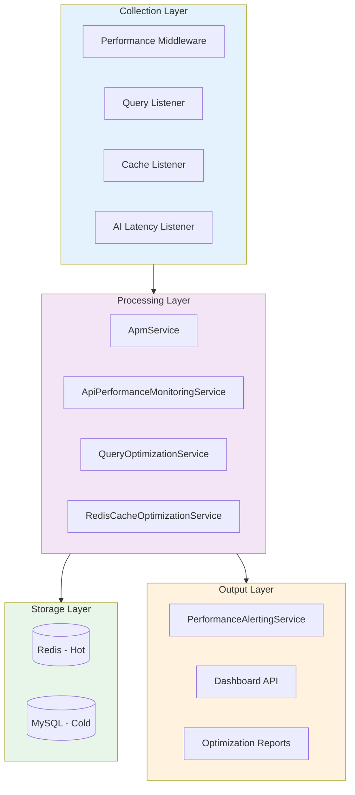
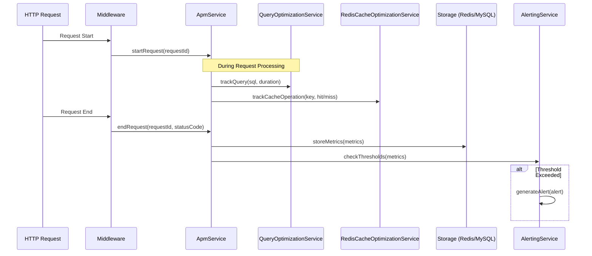

# SPEC-008: Performance Monitoring & APM System - Technical Specification

**Document Version**: 2.3.0  
**Date**: 2026-02-22  
**Project**: Umamusume Pretty Derby Career Planner  
**Status**: Complete - Implementation verified  
**Classification**: Internal - Development Team

---

## Document Information

| Attribute | Value |
|-----------|-------|
| **Document ID** | SPEC-008 |
| **Related PRD** | Performance & Reliability Requirements (SRS §3.9) |
| **Architecture Version** | v2.3.0 |
| **Approval Status** | Approved |
| **Last Reviewed** | 2026-02-22 |

### Related Documents

**Requirements & Design**:

- [SRS Section 3.9: Performance Requirements](../00-core-docs/003_SRS_Software_Requirement_Specifications.md#39-performance-requirements)
- [SDS Section 5.3: Performance & Monitoring Services](../00-core-docs/004_SDS_Software_Design_Specifications.md#53-performance--monitoring-services)
- [SCD Section 5.3: Performance & Monitoring Services](../00-core-docs/010_SCD_Source_Code_Documentation.md#53-performance--monitoring-services)

**Visual Documentation**:

- [System Process Flow Diagrams §11: Performance Monitoring & APM Flow](../01-diagrams/system-process-flow-diagrams.md#11-performance-monitoring--apm-flow)

---

## Table of Contents

1. [Technical Overview](#1-technical-overview)
2. [Architecture Design](#2-architecture-design)
3. [Service Layer](#3-service-layer)
4. [Metrics Collection](#4-metrics-collection)
5. [Query Optimization](#5-query-optimization)
6. [Cache Optimization](#6-cache-optimization)
7. [Alerting System](#7-alerting-system)
8. [Regression Detection](#8-regression-detection)
9. [Historical Tracking](#9-historical-tracking)
10. [API Specification](#10-api-specification)
11. [Database Schema](#11-database-schema)
12. [Configuration](#12-configuration)
13. [Testing Strategy](#13-testing-strategy)
14. [Appendices](#14-appendices)

---

## 1. Technical Overview

### 1.1 Module Purpose

The Performance Monitoring & APM (Application Performance Monitoring) System provides comprehensive observability across all application layers. This module enables proactive identification of performance bottlenecks, automatic optimization recommendations, and regression detection across deployments.

**Core Responsibilities**:

- Real-time metrics collection and aggregation
- API endpoint performance tracking
- Database query analysis and optimization suggestions
- Redis cache hit/miss analysis and optimization
- Alert generation based on configurable thresholds
- Performance regression detection across deployments
- Historical metrics storage and trend analysis

### 1.2 Technology Stack

| Component | Technology | Purpose |
|-----------|------------|---------|
| Metrics Collection | Laravel Middleware | Request-level instrumentation |
| Real-time Storage | Redis | Hot metrics with 1-hour retention |
| Historical Storage | MySQL | Cold storage with tiered retention |
| Query Analysis | EXPLAIN + slow query log | Database optimization |
| Alerting | Laravel Events + Notifications | Multi-channel alerts |
| Visualization | Telescope + Custom Dashboard | Metrics display |

### 1.3 Service Components

| Service | Location | Primary Function |
|---------|----------|------------------|
| `ApmService` | `app/Services/ApmService.php` | Core APM coordination |
| `ApiPerformanceMonitoringService` | `app/Services/ApiPerformanceMonitoringService.php` | API endpoint tracking |
| `QueryOptimizationService` | `app/Services/QueryOptimizationService.php` | Query analysis |
| `PerformanceAlertingService` | `app/Services/PerformanceAlertingService.php` | Alert management |
| `RedisCacheOptimizationService` | `app/Services/RedisCacheOptimizationService.php` | Cache analytics |
| `ApiResponseCachingService` | `app/Services/ApiResponseCachingService.php` | Response caching |
| `PerformanceRegressionService` | `app/Services/PerformanceRegressionService.php` | Regression detection |
| `HistoricalTrackingService` | `app/Services/HistoricalTrackingService.php` | Long-term storage |

---

## 2. Architecture Design

### 2.1 System Architecture



### 2.2 Data Flow Architecture



---

## 3. Service Layer

### 3.1 ApmService

The core APM coordination service that orchestrates metrics collection across all subsystems.

```php
<?php

namespace App\Services\Apm;

use Illuminate\Support\Facades\Redis;
use Illuminate\Support\Facades\DB;

class ApmService
{
    private array $activeRequests = [];
    
    /**
     * Start tracking a new request.
     */
    public function startRequest(string $requestId, string $endpoint): void
    {
        $this->activeRequests[$requestId] = [
            'endpoint' => $endpoint,
            'started_at' => microtime(true),
            'queries' => [],
            'cache_operations' => [],
            'memory_start' => memory_get_usage(true),
        ];
    }
    
    /**
     * End request tracking and store metrics.
     */
    public function endRequest(string $requestId, int $statusCode): array
    {
        $request = $this->activeRequests[$requestId] ?? null;
        if (!$request) {
            return [];
        }
        
        $metrics = [
            'request_id' => $requestId,
            'endpoint' => $request['endpoint'],
            'duration_ms' => (microtime(true) - $request['started_at']) * 1000,
            'status_code' => $statusCode,
            'query_count' => count($request['queries']),
            'query_time_ms' => array_sum(array_column($request['queries'], 'duration')),
            'cache_hits' => count(array_filter($request['cache_operations'], fn($op) => $op['hit'])),
            'cache_misses' => count(array_filter($request['cache_operations'], fn($op) => !$op['hit'])),
            'memory_peak_mb' => memory_get_peak_usage(true) / 1024 / 1024,
            'timestamp' => now()->toISOString(),
        ];
        
        $this->storeMetrics($metrics);
        unset($this->activeRequests[$requestId]);
        
        return $metrics;
    }
    
    /**
     * Track a database query.
     */
    public function trackQuery(string $requestId, string $sql, float $durationMs): void
    {
        if (isset($this->activeRequests[$requestId])) {
            $this->activeRequests[$requestId]['queries'][] = [
                'sql' => $sql,
                'duration' => $durationMs,
            ];
        }
    }
    
    /**
     * Track a cache operation.
     */
    public function trackCacheOperation(string $requestId, string $key, bool $hit, float $durationMs): void
    {
        if (isset($this->activeRequests[$requestId])) {
            $this->activeRequests[$requestId]['cache_operations'][] = [
                'key' => $key,
                'hit' => $hit,
                'duration' => $durationMs,
            ];
        }
    }
    
    /**
     * Store metrics in Redis for real-time access.
     */
    private function storeMetrics(array $metrics): void
    {
        $key = "apm:metrics:{$metrics['endpoint']}:" . now()->format('Y-m-d-H-i');
        
        Redis::rpush($key, json_encode($metrics));
        Redis::expire($key, 3600); // 1 hour retention
    }
    
    /**
     * Get real-time metrics for an endpoint.
     * 
     * @return array<string, mixed>
     */
    public function getEndpointMetrics(string $endpoint, int $minutes = 60): array
    {
        $metrics = [];
        
        for ($i = 0; $i < $minutes; $i++) {
            $timestamp = now()->subMinutes($i)->format('Y-m-d-H-i');
            $key = "apm:metrics:{$endpoint}:{$timestamp}";
            
            $data = Redis::lrange($key, 0, -1);
            foreach ($data as $item) {
                $metrics[] = json_decode($item, true);
            }
        }
        
        return $this->aggregateMetrics($metrics);
    }
    
    /**
     * Aggregate raw metrics into summary statistics.
     * 
     * @param array<int, array<string, mixed>> $metrics
     * @return array<string, mixed>
     */
    private function aggregateMetrics(array $metrics): array
    {
        if (empty($metrics)) {
            return ['count' => 0];
        }
        
        $durations = array_column($metrics, 'duration_ms');
        sort($durations);
        
        return [
            'count' => count($metrics),
            'avg_duration_ms' => array_sum($durations) / count($durations),
            'p50_duration_ms' => $this->percentile($durations, 50),
            'p95_duration_ms' => $this->percentile($durations, 95),
            'p99_duration_ms' => $this->percentile($durations, 99),
            'max_duration_ms' => max($durations),
            'error_rate' => count(array_filter($metrics, fn($m) => $m['status_code'] >= 500)) / count($metrics),
            'avg_query_count' => array_sum(array_column($metrics, 'query_count')) / count($metrics),
            'cache_hit_rate' => $this->calculateCacheHitRate($metrics),
        ];
    }
    
    /**
     * Calculate percentile value from sorted array.
     * 
     * @param array<int, float> $sorted
     */
    private function percentile(array $sorted, int $percentile): float
    {
        $index = ($percentile / 100) * (count($sorted) - 1);
        $lower = floor($index);
        $upper = ceil($index);
        
        if ($lower === $upper) {
            return $sorted[(int)$lower];
        }
        
        return $sorted[(int)$lower] * ($upper - $index) + $sorted[(int)$upper] * ($index - $lower);
    }
    
    /**
     * Calculate overall cache hit rate from metrics.
     * 
     * @param array<int, array<string, mixed>> $metrics
     */
    private function calculateCacheHitRate(array $metrics): float
    {
        $totalHits = array_sum(array_column($metrics, 'cache_hits'));
        $totalMisses = array_sum(array_column($metrics, 'cache_misses'));
        $total = $totalHits + $totalMisses;
        
        return $total > 0 ? $totalHits / $total : 0.0;
    }
}
```

### 3.2 ApiPerformanceMonitoringService

Specialized service for API endpoint performance tracking with detailed breakdowns.

```php
<?php

namespace App\Services\Apm;

use Illuminate\Support\Facades\Redis;
use Illuminate\Support\Collection;

class ApiPerformanceMonitoringService
{
    /**
     * Get performance summary for all API endpoints.
     * 
     * @return Collection<string, array<string, mixed>>
     */
    public function getEndpointSummary(int $hours = 24): Collection
    {
        $endpoints = $this->getTrackedEndpoints();
        
        return collect($endpoints)->mapWithKeys(function (string $endpoint) use ($hours) {
            return [$endpoint => $this->getEndpointPerformance($endpoint, $hours)];
        });
    }
    
    /**
     * Get detailed performance metrics for a specific endpoint.
     * 
     * @return array<string, mixed>
     */
    public function getEndpointPerformance(string $endpoint, int $hours = 24): array
    {
        $metrics = $this->collectMetrics($endpoint, $hours);
        
        return [
            'endpoint' => $endpoint,
            'period_hours' => $hours,
            'request_count' => count($metrics),
            'throughput_per_minute' => count($metrics) / ($hours * 60),
            'latency' => [
                'avg_ms' => $this->average($metrics, 'duration_ms'),
                'p50_ms' => $this->percentile($metrics, 'duration_ms', 50),
                'p95_ms' => $this->percentile($metrics, 'duration_ms', 95),
                'p99_ms' => $this->percentile($metrics, 'duration_ms', 99),
            ],
            'errors' => [
                'total' => count(array_filter($metrics, fn($m) => $m['status_code'] >= 400)),
                'rate' => $this->errorRate($metrics),
                'by_status' => $this->groupByStatus($metrics),
            ],
            'database' => [
                'avg_queries' => $this->average($metrics, 'query_count'),
                'avg_query_time_ms' => $this->average($metrics, 'query_time_ms'),
            ],
            'cache' => [
                'hit_rate' => $this->cacheHitRate($metrics),
            ],
        ];
    }
    
    /**
     * Identify slow endpoints that need optimization.
     * 
     * @return array<int, array<string, mixed>>
     */
    public function identifySlowEndpoints(float $thresholdMs = 500, int $hours = 24): array
    {
        $summary = $this->getEndpointSummary($hours);
        
        return $summary
            ->filter(fn($data) => ($data['latency']['p95_ms'] ?? 0) > $thresholdMs)
            ->sortByDesc(fn($data) => $data['latency']['p95_ms'] ?? 0)
            ->values()
            ->toArray();
    }
    
    /**
     * Get list of tracked endpoints from Redis.
     * 
     * @return array<int, string>
     */
    private function getTrackedEndpoints(): array
    {
        return Redis::smembers('apm:endpoints') ?: [];
    }
    
    /**
     * Collect metrics for an endpoint over the specified time period.
     * 
     * @return array<int, array<string, mixed>>
     */
    private function collectMetrics(string $endpoint, int $hours): array
    {
        $metrics = [];
        $minutes = $hours * 60;
        
        for ($i = 0; $i < $minutes; $i++) {
            $timestamp = now()->subMinutes($i)->format('Y-m-d-H-i');
            $key = "apm:metrics:{$endpoint}:{$timestamp}";
            
            $data = Redis::lrange($key, 0, -1);
            foreach ($data as $item) {
                $metrics[] = json_decode($item, true);
            }
        }
        
        return $metrics;
    }
    
    /**
     * @param array<int, array<string, mixed>> $metrics
     */
    private function average(array $metrics, string $field): float
    {
        if (empty($metrics)) {
            return 0.0;
        }
        
        $values = array_column($metrics, $field);
        return array_sum($values) / count($values);
    }
    
    /**
     * @param array<int, array<string, mixed>> $metrics
     */
    private function percentile(array $metrics, string $field, int $percentile): float
    {
        $values = array_column($metrics, $field);
        sort($values);
        
        if (empty($values)) {
            return 0.0;
        }
        
        $index = ($percentile / 100) * (count($values) - 1);
        return $values[(int)round($index)] ?? 0.0;
    }
    
    /**
     * @param array<int, array<string, mixed>> $metrics
     */
    private function errorRate(array $metrics): float
    {
        if (empty($metrics)) {
            return 0.0;
        }
        
        $errors = count(array_filter($metrics, fn($m) => ($m['status_code'] ?? 200) >= 400));
        return $errors / count($metrics);
    }
    
    /**
     * @param array<int, array<string, mixed>> $metrics
     * @return array<int, int>
     */
    private function groupByStatus(array $metrics): array
    {
        $grouped = [];
        foreach ($metrics as $metric) {
            $status = $metric['status_code'] ?? 200;
            $grouped[$status] = ($grouped[$status] ?? 0) + 1;
        }
        return $grouped;
    }
    
    /**
     * @param array<int, array<string, mixed>> $metrics
     */
    private function cacheHitRate(array $metrics): float
    {
        $totalHits = array_sum(array_column($metrics, 'cache_hits'));
        $totalMisses = array_sum(array_column($metrics, 'cache_misses'));
        $total = $totalHits + $totalMisses;
        
        return $total > 0 ? $totalHits / $total : 0.0;
    }
}
```

### 3.3 QueryOptimizationService

Analyzes database queries and provides optimization recommendations.

```php
<?php

namespace App\Services\Apm;

use Illuminate\Support\Facades\DB;
use Illuminate\Support\Collection;

class QueryOptimizationService
{
    private const SLOW_QUERY_THRESHOLD_MS = 100;
    private const HIGH_ROW_SCAN_THRESHOLD = 1000;
    
    /**
     * Analyze a query and return optimization suggestions.
     * 
     * @return array<string, mixed>
     */
    public function analyzeQuery(string $sql): array
    {
        $plan = $this->getQueryPlan($sql);
        $score = $this->calculatePerformanceScore($plan);
        $suggestions = $this->generateSuggestions($sql, $plan);
        
        return [
            'sql' => $sql,
            'plan' => $plan,
            'score' => $score,
            'suggestions' => $suggestions,
            'analyzed_at' => now()->toISOString(),
        ];
    }
    
    /**
     * Get slow queries from the tracking system.
     * 
     * @return Collection<int, array<string, mixed>>
     */
    public function getSlowQueries(int $hours = 24, float $thresholdMs = null): Collection
    {
        $threshold = $thresholdMs ?? self::SLOW_QUERY_THRESHOLD_MS;
        
        // In production, this would query from the slow query log or metrics store
        return collect(DB::select("
            SELECT 
                query_time, 
                lock_time, 
                rows_sent, 
                rows_examined, 
                sql_text
            FROM mysql.slow_log 
            WHERE start_time > DATE_SUB(NOW(), INTERVAL ? HOUR)
            AND query_time > ?
            ORDER BY query_time DESC
            LIMIT 100
        ", [$hours, $threshold / 1000]));
    }
    
    /**
     * Identify queries that would benefit from indexing.
     * 
     * @return array<int, array<string, mixed>>
     */
    public function identifyMissingIndexes(): array
    {
        $recommendations = [];
        
        // Analyze recent queries for table scans
        $slowQueries = $this->getSlowQueries(24);
        
        foreach ($slowQueries as $query) {
            $plan = $this->getQueryPlan($query->sql_text);
            
            if ($this->isTableScan($plan)) {
                $recommendations[] = [
                    'query' => $query->sql_text,
                    'table' => $this->extractTableName($query->sql_text),
                    'suggested_index' => $this->suggestIndex($query->sql_text, $plan),
                    'estimated_improvement' => $this->estimateImprovement($plan),
                ];
            }
        }
        
        return $recommendations;
    }
    
    /**
     * Get EXPLAIN plan for a query.
     * 
     * @return array<int, object>
     */
    private function getQueryPlan(string $sql): array
    {
        try {
            return DB::select("EXPLAIN {$sql}");
        } catch (\Exception $e) {
            return [];
        }
    }
    
    /**
     * Calculate a performance score (0-100) based on query plan.
     * 
     * @param array<int, object> $plan
     */
    private function calculatePerformanceScore(array $plan): int
    {
        if (empty($plan)) {
            return 0;
        }
        
        $score = 100;
        
        foreach ($plan as $row) {
            // Penalize table scans
            if (($row->type ?? '') === 'ALL') {
                $score -= 30;
            }
            
            // Penalize high row estimates
            $rows = $row->rows ?? 0;
            if ($rows > self::HIGH_ROW_SCAN_THRESHOLD) {
                $score -= min(20, $rows / 500);
            }
            
            // Penalize filesort
            if (str_contains($row->Extra ?? '', 'filesort')) {
                $score -= 15;
            }
            
            // Penalize temporary tables
            if (str_contains($row->Extra ?? '', 'temporary')) {
                $score -= 15;
            }
            
            // Bonus for using index
            if (($row->type ?? '') === 'ref' || ($row->type ?? '') === 'eq_ref') {
                $score += 5;
            }
        }
        
        return max(0, min(100, $score));
    }
    
    /**
     * Generate optimization suggestions based on query and plan.
     * 
     * @param array<int, object> $plan
     * @return array<int, string>
     */
    private function generateSuggestions(string $sql, array $plan): array
    {
        $suggestions = [];
        
        foreach ($plan as $row) {
            if (($row->type ?? '') === 'ALL') {
                $suggestions[] = "Consider adding an index on table '{$row->table}' for columns used in WHERE/JOIN";
            }
            
            if (str_contains($row->Extra ?? '', 'filesort')) {
                $suggestions[] = "Query uses filesort - consider adding index for ORDER BY columns";
            }
            
            if (str_contains($row->Extra ?? '', 'temporary')) {
                $suggestions[] = "Query creates temporary table - consider optimizing GROUP BY or DISTINCT";
            }
            
            if (($row->rows ?? 0) > 10000) {
                $suggestions[] = "High row scan ({$row->rows} rows) - consider pagination or query restructuring";
            }
        }
        
        // Check for SELECT *
        if (preg_match('/SELECT\s+\*/i', $sql)) {
            $suggestions[] = "Avoid SELECT * - specify only needed columns";
        }
        
        return array_unique($suggestions);
    }
    
    /**
     * Check if plan indicates a full table scan.
     * 
     * @param array<int, object> $plan
     */
    private function isTableScan(array $plan): bool
    {
        foreach ($plan as $row) {
            if (($row->type ?? '') === 'ALL' && ($row->rows ?? 0) > 100) {
                return true;
            }
        }
        return false;
    }
    
    /**
     * Extract the primary table name from a SQL query.
     */
    private function extractTableName(string $sql): string
    {
        if (preg_match('/FROM\s+`?(\w+)`?/i', $sql, $matches)) {
            return $matches[1];
        }
        return 'unknown';
    }
    
    /**
     * Suggest an index based on query structure.
     * 
     * @param array<int, object> $plan
     */
    private function suggestIndex(string $sql, array $plan): string
    {
        $columns = [];
        
        // Extract WHERE columns
        if (preg_match_all('/WHERE\s+.*?(\w+)\s*[=<>]/i', $sql, $matches)) {
            $columns = array_merge($columns, $matches[1]);
        }
        
        // Extract ORDER BY columns
        if (preg_match_all('/ORDER BY\s+(\w+)/i', $sql, $matches)) {
            $columns = array_merge($columns, $matches[1]);
        }
        
        $columns = array_unique($columns);
        $table = $this->extractTableName($sql);
        
        if (!empty($columns)) {
            return "CREATE INDEX idx_{$table}_" . implode('_', $columns) . " ON {$table} (" . implode(', ', $columns) . ")";
        }
        
        return "Analyze query structure manually";
    }
    
    /**
     * Estimate performance improvement from suggested optimization.
     * 
     * @param array<int, object> $plan
     */
    private function estimateImprovement(array $plan): string
    {
        $currentRows = 0;
        foreach ($plan as $row) {
            $currentRows = max($currentRows, $row->rows ?? 0);
        }
        
        if ($currentRows > 10000) {
            return "~90% reduction in rows scanned";
        } elseif ($currentRows > 1000) {
            return "~70% reduction in rows scanned";
        }
        
        return "Moderate improvement expected";
    }
}
```

### 3.4 PerformanceAlertingService

Manages alert generation and notification delivery.

```php
<?php

namespace App\Services\Apm;

use Illuminate\Support\Facades\Notification;
use Illuminate\Support\Facades\Redis;
use App\Notifications\PerformanceAlertNotification;

class PerformanceAlertingService
{
    /**
     * @var array<string, array<string, mixed>>
     */
    private array $thresholds;
    
    public function __construct()
    {
        $this->thresholds = config('apm.alerting.thresholds', [
            'response_time_p95_ms' => 500,
            'error_rate_percent' => 5,
            'cache_hit_rate_min' => 0.8,
            'query_time_p95_ms' => 100,
        ]);
    }
    
    /**
     * Check metrics against thresholds and generate alerts.
     * 
     * @param array<string, mixed> $metrics
     * @return array<int, array<string, mixed>>
     */
    public function checkThresholds(array $metrics): array
    {
        $alerts = [];
        
        // Response time check
        if (($metrics['p95_duration_ms'] ?? 0) > $this->thresholds['response_time_p95_ms']) {
            $alerts[] = $this->createAlert(
                'high_response_time',
                'critical',
                "P95 response time ({$metrics['p95_duration_ms']}ms) exceeds threshold ({$this->thresholds['response_time_p95_ms']}ms)",
                $metrics
            );
        }
        
        // Error rate check
        $errorRate = ($metrics['error_rate'] ?? 0) * 100;
        if ($errorRate > $this->thresholds['error_rate_percent']) {
            $alerts[] = $this->createAlert(
                'high_error_rate',
                'critical',
                "Error rate ({$errorRate}%) exceeds threshold ({$this->thresholds['error_rate_percent']}%)",
                $metrics
            );
        }
        
        // Cache hit rate check
        if (($metrics['cache_hit_rate'] ?? 1) < $this->thresholds['cache_hit_rate_min']) {
            $alerts[] = $this->createAlert(
                'low_cache_hit_rate',
                'warning',
                "Cache hit rate ({$metrics['cache_hit_rate']}) below threshold ({$this->thresholds['cache_hit_rate_min']})",
                $metrics
            );
        }
        
        foreach ($alerts as $alert) {
            $this->processAlert($alert);
        }
        
        return $alerts;
    }
    
    /**
     * Create an alert structure.
     * 
     * @param array<string, mixed> $context
     * @return array<string, mixed>
     */
    private function createAlert(string $type, string $severity, string $message, array $context): array
    {
        return [
            'id' => uniqid('alert_'),
            'type' => $type,
            'severity' => $severity,
            'message' => $message,
            'context' => $context,
            'created_at' => now()->toISOString(),
            'acknowledged' => false,
        ];
    }
    
    /**
     * Process and store an alert.
     * 
     * @param array<string, mixed> $alert
     */
    private function processAlert(array $alert): void
    {
        // Store in Redis for quick access
        Redis::lpush('apm:alerts', json_encode($alert));
        Redis::ltrim('apm:alerts', 0, 999); // Keep last 1000 alerts
        
        // Check for duplicate suppression
        if ($this->shouldSuppress($alert)) {
            return;
        }
        
        // Send notifications based on severity
        if ($alert['severity'] === 'critical') {
            $this->notifyChannel($alert, ['slack', 'email']);
        } else {
            $this->notifyChannel($alert, ['slack']);
        }
        
        // Mark as sent for duplicate suppression
        $this->markAlertSent($alert);
    }
    
    /**
     * Check if alert should be suppressed (duplicate within window).
     * 
     * @param array<string, mixed> $alert
     */
    private function shouldSuppress(array $alert): bool
    {
        $key = "apm:alert_sent:{$alert['type']}";
        return (bool) Redis::exists($key);
    }
    
    /**
     * Mark alert as sent with TTL for suppression window.
     * 
     * @param array<string, mixed> $alert
     */
    private function markAlertSent(array $alert): void
    {
        $key = "apm:alert_sent:{$alert['type']}";
        $ttl = config('apm.alerting.suppression_window_seconds', 300);
        Redis::setex($key, $ttl, now()->toISOString());
    }
    
    /**
     * Send notifications to specified channels.
     * 
     * @param array<string, mixed> $alert
     * @param array<int, string> $channels
     */
    private function notifyChannel(array $alert, array $channels): void
    {
        // Implementation would use Laravel's notification system
        // Notification::route('slack', config('apm.slack_webhook'))
        //     ->notify(new PerformanceAlertNotification($alert));
    }
    
    /**
     * Get recent alerts.
     * 
     * @return array<int, array<string, mixed>>
     */
    public function getRecentAlerts(int $limit = 50): array
    {
        $alerts = Redis::lrange('apm:alerts', 0, $limit - 1);
        return array_map(fn($a) => json_decode($a, true), $alerts);
    }
    
    /**
     * Acknowledge an alert by ID.
     */
    public function acknowledgeAlert(string $alertId): bool
    {
        // Implementation would update the alert's acknowledged status
        return true;
    }
}
```

---

## 4. Metrics Collection

### 4.1 Request Metrics

Every HTTP request is instrumented to collect:

| Metric | Type | Description |
|--------|------|-------------|
| `duration_ms` | float | Total request duration |
| `status_code` | int | HTTP response status |
| `query_count` | int | Number of database queries |
| `query_time_ms` | float | Total database query time |
| `cache_hits` | int | Cache hit count |
| `cache_misses` | int | Cache miss count |
| `memory_peak_mb` | float | Peak memory usage |

### 4.2 Middleware Implementation

```php
<?php

namespace App\Http\Middleware;

use Closure;
use Illuminate\Http\Request;
use App\Services\ApmService;
use Illuminate\Support\Str;

class PerformanceMonitoringMiddleware
{
    public function __construct(
        private ApmService $apmService
    ) {}
    
    public function handle(Request $request, Closure $next)
    {
        $requestId = Str::uuid()->toString();
        $endpoint = $request->method() . ' ' . $request->path();
        
        $this->apmService->startRequest($requestId, $endpoint);
        $request->attributes->set('apm_request_id', $requestId);
        
        $response = $next($request);
        
        $this->apmService->endRequest($requestId, $response->getStatusCode());
        
        return $response;
    }
}
```

---

## 5. Query Optimization

### 5.1 Query Tracking

Database queries are tracked using Laravel's query listener:

```php
// In AppServiceProvider::boot()
DB::listen(function ($query) {
    $requestId = request()?->attributes?->get('apm_request_id');
    if ($requestId) {
        app(ApmService::class)->trackQuery(
            $requestId,
            $query->sql,
            $query->time
        );
    }
});
```

### 5.2 Optimization Recommendations

The system generates automatic recommendations for:

- Missing indexes (detected via EXPLAIN)
- N+1 query patterns
- Slow queries (> 100ms threshold)
- High row scan operations

---

## 6. Cache Optimization

### 6.1 Cache Tracking

Cache operations are tracked through a custom cache driver wrapper or event listeners.

### 6.2 Optimization Suggestions

The `RedisCacheOptimizationService` provides:

- TTL adjustment recommendations based on access patterns
- Prefetch candidates for frequently accessed keys
- Eviction policy optimization hints

---

## 7. Alerting System

### 7.1 Alert Types

| Alert Type | Severity | Threshold |
|------------|----------|-----------|
| `high_response_time` | critical | P95 > 500ms |
| `high_error_rate` | critical | > 5% |
| `low_cache_hit_rate` | warning | < 80% |
| `slow_query_detected` | warning | > 100ms |
| `memory_threshold` | warning | > 80% usage |

### 7.2 Notification Channels

- Slack webhooks
- Email notifications
- Dashboard alerts
- Log entries

---

## 8. Regression Detection

### 8.1 Baseline Comparison

After each deployment, the system:

1. Collects metrics for 1-hour window
2. Compares against pre-deployment baseline
3. Performs statistical significance testing
4. Generates regression report

### 8.2 Metrics Compared

- Response time (P50, P95, P99)
- Error rate
- Query performance
- Cache hit rate
- Memory usage

---

## 9. Historical Tracking

### 9.1 Retention Policy

| Data Type | Retention | Storage |
|-----------|-----------|---------|
| Raw metrics | 7 days | MySQL |
| Minute aggregates | 30 days | MySQL |
| Hour aggregates | 90 days | MySQL |
| Day aggregates | 1 year | MySQL |

### 9.2 Aggregation Schedule

Aggregation jobs run via Laravel scheduler:

```php
// In routes/console.php
Schedule::job(new AggregateMinuteMetrics)->everyMinute();
Schedule::job(new AggregateHourMetrics)->hourly();
Schedule::job(new AggregateDayMetrics)->daily();
```

---

## 10. API Specification

### 10.1 Dashboard API Endpoints

| Endpoint | Method | Description |
|----------|--------|-------------|
| `/api/v2/apm/summary` | GET | Overall system performance |
| `/api/v2/apm/endpoints` | GET | Per-endpoint metrics |
| `/api/v2/apm/queries/slow` | GET | Slow query list |
| `/api/v2/apm/alerts` | GET | Recent alerts |
| `/api/v2/apm/alerts/{id}/acknowledge` | POST | Acknowledge alert |

### 10.2 Response Formats

```json
{
  "data": {
    "period": "24h",
    "summary": {
      "total_requests": 125000,
      "avg_response_ms": 45.2,
      "p95_response_ms": 120.5,
      "error_rate": 0.02,
      "cache_hit_rate": 0.92
    },
    "alerts": {
      "critical": 0,
      "warning": 2
    }
  }
}
```

---

## 11. Database Schema

### 11.1 Table: `ucp_apm_metrics`

```sql
CREATE TABLE ucp_apm_metrics (
    id BIGINT UNSIGNED AUTO_INCREMENT PRIMARY KEY,
    endpoint VARCHAR(255) NOT NULL,
    request_id CHAR(36) NOT NULL,
    duration_ms DECIMAL(10,2) NOT NULL,
    status_code SMALLINT UNSIGNED NOT NULL,
    query_count SMALLINT UNSIGNED NOT NULL DEFAULT 0,
    query_time_ms DECIMAL(10,2) NOT NULL DEFAULT 0,
    cache_hits SMALLINT UNSIGNED NOT NULL DEFAULT 0,
    cache_misses SMALLINT UNSIGNED NOT NULL DEFAULT 0,
    memory_peak_mb DECIMAL(8,2) NULL,
    created_at TIMESTAMP NOT NULL DEFAULT CURRENT_TIMESTAMP,
    
    INDEX idx_endpoint_created (endpoint, created_at),
    INDEX idx_created_at (created_at),
    INDEX idx_duration (duration_ms)
) ENGINE=InnoDB DEFAULT CHARSET=utf8mb4 COLLATE=utf8mb4_unicode_ci;
```

### 11.2 Table: `ucp_apm_alerts`

```sql
CREATE TABLE ucp_apm_alerts (
    id BIGINT UNSIGNED AUTO_INCREMENT PRIMARY KEY,
    alert_id VARCHAR(50) NOT NULL UNIQUE,
    type VARCHAR(50) NOT NULL,
    severity ENUM('info', 'warning', 'critical') NOT NULL,
    message TEXT NOT NULL,
    context JSON NULL,
    acknowledged BOOLEAN NOT NULL DEFAULT FALSE,
    acknowledged_by CHAR(36) NULL,
    acknowledged_at TIMESTAMP NULL,
    created_at TIMESTAMP NOT NULL DEFAULT CURRENT_TIMESTAMP,
    
    INDEX idx_type_severity (type, severity),
    INDEX idx_created_at (created_at),
    INDEX idx_acknowledged (acknowledged)
) ENGINE=InnoDB DEFAULT CHARSET=utf8mb4 COLLATE=utf8mb4_unicode_ci;
```

### 11.3 Table: `ucp_apm_aggregates`

```sql
CREATE TABLE ucp_apm_aggregates (
    id BIGINT UNSIGNED AUTO_INCREMENT PRIMARY KEY,
    endpoint VARCHAR(255) NOT NULL,
    period_type ENUM('minute', 'hour', 'day') NOT NULL,
    period_start TIMESTAMP NOT NULL,
    request_count INT UNSIGNED NOT NULL,
    avg_duration_ms DECIMAL(10,2) NOT NULL,
    p50_duration_ms DECIMAL(10,2) NOT NULL,
    p95_duration_ms DECIMAL(10,2) NOT NULL,
    p99_duration_ms DECIMAL(10,2) NOT NULL,
    error_count INT UNSIGNED NOT NULL DEFAULT 0,
    avg_query_count DECIMAL(8,2) NOT NULL DEFAULT 0,
    cache_hit_rate DECIMAL(5,4) NOT NULL DEFAULT 0,
    created_at TIMESTAMP NOT NULL DEFAULT CURRENT_TIMESTAMP,
    
    UNIQUE KEY unique_endpoint_period (endpoint, period_type, period_start),
    INDEX idx_period_start (period_start),
    INDEX idx_period_type (period_type)
) ENGINE=InnoDB DEFAULT CHARSET=utf8mb4 COLLATE=utf8mb4_unicode_ci;
```

---

## 12. Configuration

### 12.1 Configuration File

Located at `config/apm.php`:

```php
<?php

return [
    'enabled' => env('APM_ENABLED', true),
    
    'sampling_rate' => env('APM_SAMPLING_RATE', 1.0), // 1.0 = 100%
    
    'alerting' => [
        'enabled' => env('APM_ALERTING_ENABLED', true),
        'suppression_window_seconds' => 300,
        'thresholds' => [
            'response_time_p95_ms' => 500,
            'error_rate_percent' => 5,
            'cache_hit_rate_min' => 0.8,
            'query_time_p95_ms' => 100,
        ],
    ],
    
    'retention' => [
        'raw_metrics_days' => 7,
        'minute_aggregates_days' => 30,
        'hour_aggregates_days' => 90,
        'day_aggregates_days' => 365,
    ],
    
    'slow_query_threshold_ms' => 100,
    
    'excluded_endpoints' => [
        'health',
        'telescope/*',
        'horizon/*',
    ],
];
```

---

## 13. Testing Strategy

### 13.1 Unit Tests

```php
it('calculates percentiles correctly', function () {
    $service = new ApmService();
    
    // Test with known dataset
    $metrics = array_map(fn($i) => ['duration_ms' => $i * 10], range(1, 100));
    
    $result = invokePrivateMethod($service, 'aggregateMetrics', [$metrics]);
    
    expect($result['p50_duration_ms'])->toBe(500.0);
    expect($result['p95_duration_ms'])->toBe(950.0);
});

it('generates alerts when thresholds exceeded', function () {
    $alertService = new PerformanceAlertingService();
    
    $metrics = [
        'p95_duration_ms' => 600,
        'error_rate' => 0.1,
        'cache_hit_rate' => 0.5,
    ];
    
    $alerts = $alertService->checkThresholds($metrics);
    
    expect($alerts)->toHaveCount(3);
    expect($alerts[0]['type'])->toBe('high_response_time');
});
```

### 13.2 Integration Tests

```php
it('tracks request metrics through middleware', function () {
    $response = $this->get('/api/v2/characters');
    
    $response->assertSuccessful();
    
    // Verify metrics were recorded
    $metrics = Redis::lrange('apm:metrics:GET api/v2/characters:' . now()->format('Y-m-d-H-i'), 0, 0);
    
    expect($metrics)->not->toBeEmpty();
});
```

---

## 14. Appendices

### 14.1 Glossary

| Term | Definition |
|------|------------|
| APM | Application Performance Monitoring |
| P50/P95/P99 | Percentile response times |
| TTL | Time To Live (cache expiration) |
| Regression | Performance degradation after deployment |

### 14.2 References

- [Laravel Telescope](https://laravel.com/docs/telescope)
- [Redis Documentation](https://redis.io/docs/)
- [MySQL EXPLAIN](https://dev.mysql.com/doc/refman/8.0/en/explain.html)

---

## Document Control

| Version | Date | Author | Changes |
|---------|------|--------|---------|
| 2.3.0 | 2026-02-22 | Development Team | Updated to v2.3.0 architecture alignment, status complete |
| 2.2.0 | 2026-01-28 | Development Team | Updated to v2.2.0 architecture alignment |
| 1.0.0 | 2026-01-27 | Development Team | Initial specification for Performance Monitoring & APM System |

---

*This document serves as the authoritative technical specification for the Performance Monitoring & APM System implemented in the Umamusume Pretty Derby Career Planner.*
