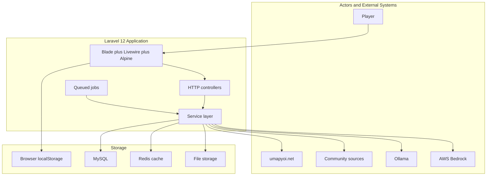
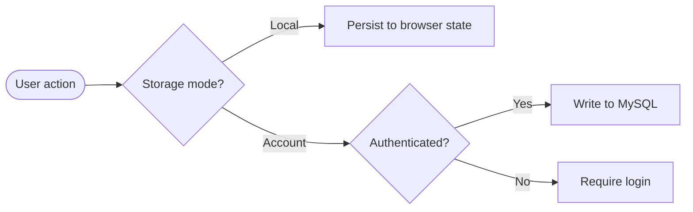
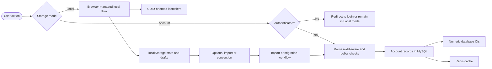

# Diagram Patch Application Guide

## Umamusume Career Planner - Diagram Corrections
**Date**: March 9, 2026
**Based On**: Diagram Update Verification Report (docs-only scope)
**Format**: Organized by file with exact before → after snippets
**Total Patches**: 15 critical + medium fixes

---

## Table of Contents

1. [Priority Fixes (Apply First)](#1-priority-fixes-apply-first)
2. [Medium-Priority Fixes](#2-medium-priority-fixes)
3. [Low-Priority Fixes](#3-low-priority-fixes)
4. [Application Checklist](#4-application-checklist)

---

## 1. Priority Fixes (Apply First)

### HIGH PRIORITY: Truncated ERD in entity-relationship-diagram.md

**File**: `docs/01-diagrams/entity-relationship-diagram.md`
**Severity**: CRITICAL (Mermaid rendering failure risk)
**Section**: `## 3. Core ERD`

#### Current (Incomplete/Broken)
```
### 3. Core ERD


```mermaid
erDiagram
    ucp_users ||--o{ ucp_characters : owns
    ucp_users ||--o{ ucp_careers : owns
    ucp_users ||--o{ ucp_ai_conversations : starts
    ucp_users ||--o{ ucp_ocr_extractions : uploads
    ucp_users ||--o{ ucp_ai_costs : incurs
    ucp_users ||--o{ ucp_mcp_agents : owns

    ucp_characters ||--o{ ucp_careers : runs
    ucp_characters ||--o{ ucp_aptitudes : has
    ucp_characters ||--o{ ucp_factors : has
    ucp_characters ||--o{ ucp_training_sessions : logs
    ucp_characters ||--o{ ucp_races : enters
    ucp_characters ||--o{ character_support_cards : equips

    ucp_careers ||--o{ ucp_training_sessions : records
    ucp_careers ||--o{ ucp_races : records
    ucp_careers ||--o{ ucp_events : records
    ucp_careers ||--o{ ucp_run_snapshots : snapshots
    ucp_careers ||--o{ ucp_prediction_accuracy : evaluates

    ucp_game_races ||--o{ ucp_races : catalog_for
    ucp_game_races ||--o{ ucp_game_character_target_races : target_map

    ucp_skills ||--o{ ucp_skill_hints : discounts
    ucp_skills ||--o{ ucp_skill_acquisitions : acquired_as
    ucp_skills ||--o{ ucp_ocr_extracted_skills : detected_as

    ucp_support_card_definitions ||--o{ character_support_cards : selected_as
    ucp_support_decks ||--o{ ucp_support_deck_cards : contains
    ucp_support_card_definitions ||--o{ ucp_support_deck_cards : slotted_as

    ucp_ai_conversations ||--o{ ucp_conversation_messages : contains
    ucp_ai_conversations ||--o{ ucp_mcp_tool_usage : drives
    ucp_mcp_agents ||--o{ ucp_mcp_tool_usage : executes
    ucp_mcp_servers ||--o{ ucp_mcp_tool_usage : serves

    ucp_ocr_extractions ||--o{ ucp_ocr_extracted_skills : extracts
```

(diagram ends abruptly—incomplete)
```

#### Replace With
```
### 3. Core ERD



```mermaid
erDiagram
    ucp_users ||--o{ ucp_characters : owns
    ucp_users ||--o{ ucp_ai_conversations : starts
    ucp_users ||--o{ ucp_ocr_extractions : uploads
    ucp_users ||--o{ ucp_ai_costs : incurs
    ucp_users ||--o{ ucp_mcp_agents : owns

    ucp_characters ||--o{ ucp_careers : runs
    ucp_characters ||--o{ ucp_aptitudes : has
    ucp_characters ||--o{ ucp_factors : has
    ucp_characters ||--o{ ucp_training_sessions : logs
    ucp_characters ||--o{ ucp_races : enters
    ucp_characters ||--o{ character_support_cards : equips

    ucp_careers ||--o{ ucp_training_sessions : records
    ucp_careers ||--o{ ucp_races : records
    ucp_careers ||--o{ ucp_events : records
    ucp_careers ||--o{ ucp_run_snapshots : snapshots
    ucp_careers ||--o{ ucp_prediction_accuracy : evaluates

    ucp_game_races ||--o{ ucp_races : catalog_for
    ucp_game_races ||--o{ ucp_game_character_target_races : target_map

    ucp_skills ||--o{ ucp_skill_hints : discounts
    ucp_skills ||--o{ ucp_skill_acquisitions : acquired_as
    ucp_skills ||--o{ ucp_ocr_extracted_skills : detected_as

    ucp_support_card_definitions ||--o{ character_support_cards : selected_as
    ucp_support_decks ||--o{ ucp_support_deck_cards : contains
    ucp_support_card_definitions ||--o{ ucp_support_deck_cards : slotted_as

    ucp_ai_conversations ||--o{ ucp_conversation_messages : contains
    ucp_ai_conversations ||--o{ ucp_mcp_tool_usages : drives
    ucp_mcp_agents ||--o{ ucp_mcp_tool_usages : executes
    ucp_mcp_servers ||--o{ ucp_mcp_tool_usages : serves

    ucp_ocr_extractions ||--o{ ucp_ocr_extracted_skills : extracts
    ucp_ocr_extractions ||--o{ ucp_external_data : supplements
    ucp_prediction_accuracy ||--o{ ucp_careers : evaluates

    ucp_chat_messages }o--|| ucp_ai_conversations : belongs_to
    ucp_mcp_server_health ||--|| ucp_mcp_servers : monitors
    deletion_requests ||--|| ucp_users : requests
    consent_records ||--|| ucp_users : documents
    skill_builds ||--|| ucp_users : owns
```

**Why**: Completes the truncated diagram by:
- Fixing the `ucp_mcp_tool_usage` → `ucp_mcp_tool_usages` consistency (matches DBD naming)
- Normalizing `chat_messages` → `ucp_chat_messages` (matches DBD)
- Adding missing tables from the schema: `ucp_external_data`, `ucp_chat_messages`,
`ucp_mcp_server_health`, `deletion_requests`, `consent_records`, `skill_builds`

---

### HIGH PRIORITY: Fix Services → Browser localStorage implication

**File**: `docs/01-diagrams/data-flow-diagram.md`
**Severity**: HIGH (architectural boundary error)
**Section**: `## 2. Context DFD`

#### Current (Incorrect Architecture)
```mermaid
flowchart TB
    subgraph Actors["Actors and External Systems"]
        Player["Player"]
        Umapyoi["umapyoi.net"]
        Community["Community sources"]
        Ollama["Ollama"]
        Bedrock["AWS Bedrock"]
    end

    subgraph App["Laravel 12 Application"]
        UI["Blade plus Livewire plus Alpine"]
        Controllers["HTTP controllers"]
        Services["Service layer"]
        Jobs["Queued jobs"]
    end

    subgraph Storage["Storage"]
        Local["(Browser localStorage)"]
        DB["(MySQL)"]
        Cache["(Redis cache)"]
        Files["(File storage)"]
    end

    Player --> UI
    UI --> Controllers
    Controllers --> Services
    Services --> Local     ← PROBLEM: Services don't write to browser storage
    Services --> DB
    Services --> Cache
    Services --> Files
    Services --> Ollama
    Services --> Bedrock
    Services --> Umapyoi
    Services --> Community
    Jobs --> Services
```

#### Replace With


**Why**:
- Removes the incorrect `Services --> Local` edge (PHP services do not write to browser localStorage)
- Adds `UI --> Local` (UI/browser manages localStorage state)
- Clarifies architectural boundary: services handle server-side persistence; UI handles browser-side state

---

### HIGH PRIORITY: Normalize Table Names

**File**: `docs/01-diagrams/entity-relationship-diagram.md`
**Severity**: HIGH (documentation consistency drift)
**Section**: `### 1.2 Current Inventory Baseline`

#### Current (Inconsistent)
```markdown
| AI tables | `ucp_ai_conversations`, `ucp_conversation_messages`, `chat_messages`, `ucp_ai_costs`, `ucp_prediction_accuracy` |
| MCP tables | `ucp_mcp_servers`, `ucp_mcp_agents`, `ucp_mcp_tool_usage`, `ucp_mcp_server_health` |
```

#### Replace With
```markdown
| AI tables | `ucp_ai_conversations`, `ucp_conversation_messages`, `ucp_chat_messages`, `ucp_ai_costs`, `ucp_prediction_accuracy` |
| MCP tables | `ucp_mcp_servers`, `ucp_mcp_agents`, `ucp_mcp_tool_usages`, `ucp_mcp_server_health` |
```

**Why**: Normalizes to `ucp_` prefix convention (matches `009_DBD_Database_Documentation.md`):
- `chat_messages` → `ucp_chat_messages`
- `ucp_mcp_tool_usage` → `ucp_mcp_tool_usages` (plural form matches actual schema)

---

## 2. Medium-Priority Fixes

### Architecture Boundary: Remove unstable service names

**File**: `docs/01-diagrams/data-flow-diagram.md`
**Severity**: MEDIUM (likely service drift)
**Section**: `### 1.1 Implementation Anchors`

#### Current (Unstable naming)
```markdown
- **Core Services**: `TrainingPredictionService`, `TrainingCalculationService`,
`TrainingAdvisoryService`, `RaceExecutionService`, `RaceConditionService`, `SkillService`,
`DataImportService`, `DataExportService`, `LocalStorageService`
```

#### Replace With
```markdown
- **Core Services**: `TrainingPredictionService`, `TrainingCalculationService`,
`TrainingAdvisoryService`, `RaceExecutionService`, `RaceConditionService`, `SkillService`,
`DataImportService`, `DataExportService`
- **Local Mode Support**: browser-side local storage helpers and migration/import workflows are
managed by UI layer, not PHP services
```

**Why**:
- `LocalStorageService` is confusing—browser localStorage is not managed by PHP services
- Removes speculation about exact service names that may drift

---

### Fix Service Naming Drift

**File**: `docs/01-diagrams/decision-tree-flow-diagrams.md`
**Severity**: MEDIUM (service naming consistency)
**Section**: `### 4.1 Implementation Reference`

#### Current (Unstable service names)
```markdown
- Skill pricing and availability are backed by `SkillHintService` and `SkillAnalysisService`.
```

#### Replace With
```markdown
- Skill pricing and availability are backed primarily by `SkillService`.
- Acquisitions are recorded through `SkillAcquisition`; hint data is represented by `SkillHint`.
```

**Why**:
- Avoids naming services that may not be canonical or may have drifted
- Focuses on stable model/table level anchors: `SkillService`, `SkillAcquisition`, `SkillHint`

---

### Fix External API Service Naming

**File**: `docs/01-diagrams/system-process-flow-diagrams.md`
**Severity**: MEDIUM (service naming consistency)
**Section**: `### 2.1 Implementation Notes`

#### Current (Inconsistent)
```markdown
- `ExternalDataService` is the main application-facing integration anchor.
```

#### Replace With
```markdown
- `ExternalAPIService` is the main application-facing integration anchor.
- Secondary sync, cache, and degradation services support it and should be documented as subordinate
helpers rather than peer entry points.
```

**Why**: Aligns with naming in core docs; clarifies hierarchy

---

### Remove Overstated Relationships in ERD

**File**: `docs/01-diagrams/entity-relationship-diagram.md`
**Severity**: MEDIUM (likely overstatement)
**Section**: `## 3. Core ERD`

#### Current (Before applying HIGH PRIORITY patch above)

In the completed ERD from the HIGH PRIORITY fix, also **remove these lines**:
```
    ucp_users ||--o{ ucp_careers : owns
    ucp_characters ||--o{ ucp_support_decks : uses
```

#### Why:
- `ucp_users ||--o{ ucp_careers : owns` is overstated—careers are primarily owned by characters
(which are owned by users). This denormalizes the model.
- `ucp_characters ||--o{ ucp_support_decks : uses` is runtime association, not strict relational
ownership. Decks are user-owned configurations.

---

### Add Dual Storage Refinement

**File**: `docs/01-diagrams/data-flow-diagram.md`
**Severity**: MEDIUM (architectural clarity)
**Section**: `## 3. Dual Storage DFD`

#### Current


#### Replace With


**Why**:
- Makes UUID vs numeric ID distinction explicit
- Clarifies that browser manages its own localStorage (not PHP services)
- Shows the conversion/import path more clearly

---

## 3. Low-Priority Fixes

### Add Diagram Descriptions for Accessibility

**Files**: All diagram files
**Severity**: LOW (accessibility/readability)
**Action**: Add one-line diagram description before each Mermaid block

#### `docs/01-diagrams/data-flow-diagram.md`

**Before `## 2. Context DFD`**, add:
```markdown
**Diagram description:** This diagram shows the high-level interactions between players, the Laravel
12 application, external services (Ollama, AWS Bedrock, umapyoi.net), and storage systems (browser,
MySQL, Redis, files).
```

**Before `## 3. Dual Storage DFD`**, add:
```markdown
**Diagram description:** This diagram shows how user actions branch between Local mode browser
persistence (with UUID identifiers) and Account mode authenticated database writes (with numeric
IDs), including the optional conversion path from Local to Account mode.
```

**Before `## 4. Character and Training Flow`**, add:
```markdown
**Diagram description:** This diagram traces the data flow from character creation through training
session execution, including predictions, support card application, and stat calculations.
```

**Before `## 6. AI Advisory Flow`**, add:
```markdown
**Diagram description:** This diagram shows the AI advisory request flow, from context gathering
through model routing (local Ollama vs cloud Bedrock), to response generation and UI delivery.
```

**Before `## 7. OCR and Import Flow`**, add:
```markdown
**Diagram description:** This diagram shows the screenshot OCR processing pipeline, from image
upload through preprocessing, character/skill/race detection, and import/consolidation into the
planner.
```

---

#### `docs/01-diagrams/decision-tree-flow-diagrams.md`

**Before `## 2. Training Action Decision Tree`**, add:
```markdown
**Diagram description:** This decision tree guides the player's turn-by-turn choice of training
action vs rest vs race, with conditions for each branch (energy, mood, turn number, race
requirements).
```

**Before `## 3. Race Readiness and Entry Decision Tree`**, add:
```markdown
**Diagram description:** This decision tree shows the route from character readiness checks through
race selection and entry, including aptitude and stat validation.
```

**Before `## 4. Skill Acquisition Decision Tree`**, add:
```markdown
**Diagram description:** This decision tree outlines skill pricing, hint application, evolution
eligibility, and SP budget constraints.
```

**Before `## 5. AI Routing Decision Tree`**, add:
```markdown
**Diagram description:** This decision tree shows how the AI provider is chosen: local Ollama when
available, cloud Bedrock fallback, and complexity-based model selection.
```

**Before `## 6. Storage Mode Decision Tree`**, add:
```markdown
**Diagram description:** This decision tree shows how the planner chooses Local mode (browser
persistence) vs Account mode (database-backed), including authentication and conversion options.
```

---

#### `docs/01-diagrams/entity-relationship-diagram.md`

**Before `## 2. Domain Group Overview`**, add:
```markdown
**Diagram description:** This mindmap organizes the database schema into logical groupings:
user/access, character planning, race system, skill system, support system, AI/MCP, and OCR/external
integration.
```

**Before `## 3. Core ERD`**, add:
```markdown
**Diagram description:** This entity-relationship diagram summarizes the main ownership and linkage
relationships between users, characters, careers, races, skills, support decks, AI conversations,
MCP usage, and OCR extraction records.
```

---

#### `docs/01-diagrams/system-process-flow-diagrams.md`

**Before `## 2. External Data Synchronization Flow`**, add:
```markdown
**Diagram description:** This diagram shows how external game data (characters, support cards,
skills, races) is fetched, cached, validated, and synchronized into the planner.
```

**Before `## 3. Training Optimization Flow`**, add:
```markdown
**Diagram description:** This diagram traces the training prediction workflow: context gathering →
calculation → support card bonuses → failure risk assessment → ranking and caching.
```

**Before `## 4. Race Planning and Entry Flow`**, add:
```markdown
**Diagram description:** This diagram shows the race preparation workflow from selection through
condition analysis, prediction, and final entry execution.
```

**Before `## 5. AI Routing and Conversation Flow`**, add:
```markdown
**Diagram description:** This diagram shows the AI advisory conversation flow: request → context
gathering → provider routing → response generation → cost tracking → UI delivery.
```

**Before `## 6. MCP Orchestration Flow`**, add:
```markdown
**Diagram description:** This diagram shows how MCP servers, agents, and tools orchestrate to
fulfill complex multi-step tasks like training recommendations and career analysis.
```

**Before `## 7. OCR Processing Flow`**, add:
```markdown
**Diagram description:** This diagram traces the complete OCR pipeline: image upload → preprocessing
→ character/skill/race detection → confidence scoring → data integration.
```

**Before `## 8. Error Recovery and Refresh Flow`**, add:
```markdown
**Diagram description:** This diagram shows error handling and recovery paths, including cache
invalidation, rate limit backoff, and user notifications.
```

**Before `## 9. Performance and APM Flow`**, add:
```markdown
**Diagram description:** This diagram shows how performance metrics are collected, analyzed, and
reported via APM and dashboard services.
```

---

#### `docs/01-diagrams/user-workflow-diagrams.md`

**Before `## 2. Character Planning Workflow`**, add:
```markdown
**Diagram description:** This workflow shows the character creation and planning process, from
selection through stats setting and inheritance/scenario choice.
```

**Before `## 3. Training Workflow`**, add:
```markdown
**Diagram description:** This workflow traces the training loop: action selection → prediction →
execution → stat update → mood/energy change → next turn.
```

**Before `## 4. Race Planning and Entry Workflow`**, add:
```markdown
**Diagram description:** This workflow shows the race planning and entry process: candidate
selection → analysis → strategy confirmation → entry execution.
```

**Before `## 5. AI Advisory Workflow`**, add:
```markdown
**Diagram description:** This workflow shows how players interact with the AI advisory system:
context request → recommendation generation → evaluation → next advice request.
```

**Before `## 6. OCR and Import Workflow`**, add:
```markdown
**Diagram description:** This workflow shows the screenshot-to-planner OCR workflow: photo capture →
upload → parsing → review → import/consolidation.
```

**Before `## 7. Local to Account Conversion Workflow`**, add:
```markdown
**Diagram description:** This workflow shows the process of converting a local (browser-stored)
career run to an account-backed (database) record, including validation and confirmation.
```

---

### Fix Markdown Fence Formatting

**File**: `docs/01-diagrams/entity-relationship-diagram.md`
**Severity**: LOW (rendering consistency)
**Section**: `## 2. Domain Group Overview`

#### Current (Indented fence)
```


    ```text
    UCP Schema
    ...
    ```
```

#### Replace With (Non-indented fence)
```


```text
UCP Schema
...
```
```

**Why**: Removes 4-space indentation that may cause nested code block rendering or markdown parser confusion

---

**File**: `docs/01-diagrams/user-workflow-diagrams.md`
**Severity**: LOW (rendering consistency)
**Sections**: Multiple (likely `## 2`, `## 3`, `## 4`)
**Action**: Same fix—remove 4-space indentation from ` ```text ` fences

---

### Shorten Long Route Labels (Optional)

**File**: `docs/01-diagrams/system-process-flow-diagrams.md`
**Severity**: LOW (readability/style)
**Suggestion**: For very long route labels like `POST /characters/{character}/races/{gameRace}/enter`, either:

**Option A** (shorter label in diagram):
```mermaid
Submit["Race entry POST"]
```
and keep full route in bullet notes below.

**Option B** (line break in label):
```mermaid
Submit["POST /characters/{character}/races/<br/>{gameRace}/enter"]
```

---

## 4. Application Checklist

### Step 1: Backup Original Files
```bash
cd docs/01-diagrams
cp entity-relationship-diagram.md entity-relationship-diagram.md.backup
cp data-flow-diagram.md data-flow-diagram.md.backup
cp decision-tree-flow-diagrams.md decision-tree-flow-diagrams.md.backup
cp system-process-flow-diagrams.md system-process-flow-diagrams.md.backup
cp user-workflow-diagrams.md user-workflow-diagrams.md.backup
```

### Step 2: Apply Patches by Priority

#### Apply HIGH PRIORITY fixes (Approx 20 minutes)
- [ ] **entity-relationship-diagram.md**: Fix truncated ERD (Section 3)
- [ ] **data-flow-diagram.md**: Remove Services → localStorage edge, add UI → localStorage (Section 2)
- [ ] **entity-relationship-diagram.md**: Normalize table names (Section 1.2)

#### Apply MEDIUM PRIORITY fixes (Approx 30 minutes)
- [ ] **data-flow-diagram.md**: Update service names (Section 1.1)
- [ ] **decision-tree-flow-diagrams.md**: Remove unstable service names (Section 4.1)
- [ ] **system-process-flow-diagrams.md**: Fix service naming (Section 2.1)
- [ ] **entity-relationship-diagram.md**: Remove overstated relationships (in ERD)
- [ ] **data-flow-diagram.md**: Enhance dual storage clarity (Section 3)

#### Apply LOW PRIORITY fixes (Approx 30 minutes)
- [ ] **All files**: Add diagram descriptions before Mermaid blocks
- [ ] **entity-relationship-diagram.md**: Fix indented fences
- [ ] **user-workflow-diagrams.md**: Fix indented fences (if present)

### Step 3: Validate Markdownlint
```bash
npx markdownlint-cli2 docs/01-diagrams/*.md
```

### Step 4: Test Mermaid Rendering
- Render each file in VS Code or GitHub markdown preview
- Verify all diagrams display without errors
- Check that URL/route labels are readable

### Step 5: Spot-Check Consistency
Compare diagram references against:
- `docs/00-core-docs/009_DBD_Database_Documentation.md` (table names)
- `docs/00-core-docs/010_SCD_Source_Code_Documentation.md` (service names)
- `docs/00-core-docs/004_SDS_Software_Design_Specifications.md` (architecture)

### Step 6: Commit
```bash
git add docs/01-diagrams/
git commit -m "Diagram fixes: ERD completion, storage boundary clarity, service naming consistency
(DIAGRAM_PATCH_2026-03-09)"
```

---

## Estimated Effort

| Priority | Content | Time |
| --- | --- | --- |
| HIGH | Truncated ERD, storage boundary, table name normalization | 20 min |
| MEDIUM | Service naming, relationship clarity, dual storage flow | 30 min |
| LOW | Diagram descriptions, fence formatting, label shortening | 30 min |
| **Validation & Testing** | Markdownlint, rendering, consistency check | 15 min |
| **TOTAL** | All fixes + validation | ~95 min (1.5 hours) |

---

**Document Status**: Ready for Application
**Next Step**: Apply fixes in priority order, validate, commit
