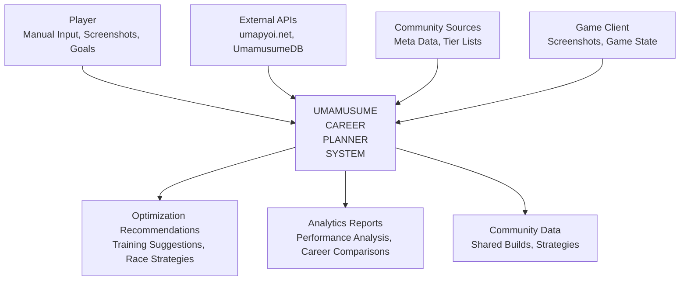
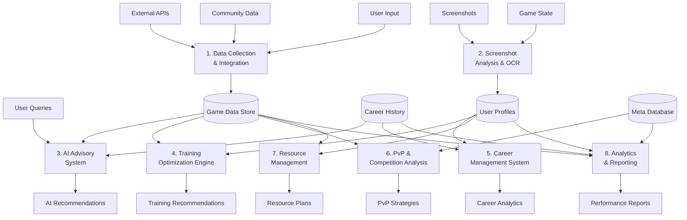
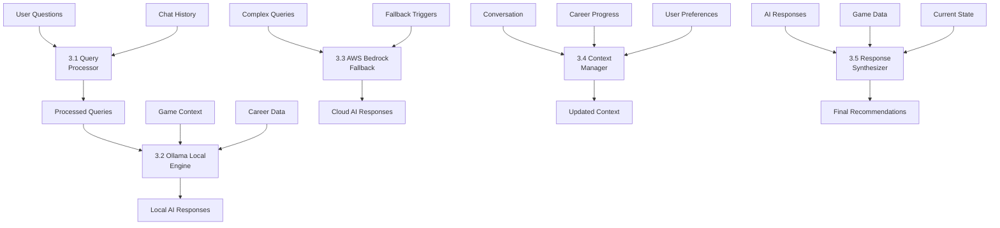

# Umamusume Career Planner - Data Flow Diagram (DFD)

## Overview

This document presents the Data Flow Diagrams for the Umamusume Pretty Derby Career Planner application, showing how data flows through the system from external sources, user inputs, and internal processes to provide optimization recommendations and analytics. The system is built with **Laravel 12** (released February 24, 2025) with **TypeScript support**, **Tailwind CSS v4** (released January 22, 2025), and integrates with **AWS Bedrock Claude 4.5** models and **AWS Bedrock Nova 2** for AI capabilities.

## Context Diagram (Level 0)

The highest level view showing the system boundary and external entities.

### Text Description

The Umamusume Career Planner system sits at the center, receiving inputs from:

- **Player**: Provides manual data entry, screenshots, career goals, and configuration
- **External APIs**: **umapyoi.net** (active public API), **UmamusumeDB.com**, and community sources provide game data
- **Community Sources**: Real-time meta data, tier lists, and strategy information
- **Game Client**: Screenshot data and current game state information

The system outputs:

- **Optimization Recommendations**: Training suggestions, race strategies, skill builds
- **Analytics Reports**: Performance analysis, career comparisons, statistical insights
- **Community Data**: Shared builds, strategies, and collaborative information

### ASCII Diagram

```
                    External APIs
                   (umapyoi.net,     Community Sources
                   UmamusumeDB)     (Meta data, Tier lists)
                        |                    |
                        v                    v
    Player ---------> [UMAMUSUME] ---------> Analytics Reports
    (Manual input,     CAREER            (Performance analysis,
     Screenshots,      PLANNER           Career comparisons)
     Goals)            SYSTEM               |
                         |
                         v
                   Game Client ---------> Optimization Recommendations
                   (Screenshots,          (Training suggestions,
                    Game state)           Race strategies)
                         |
                         v
                   Community Data
                   (Shared builds,
                    Strategies)
```

### Mermaid Diagram



## Level 1 DFD - Major System Processes

### Text Description

The system breaks down into 8 major processes supporting all **60 comprehensive requirements**:

1. **Data Collection & Integration**: Aggregates data from **umapyoi.net** API, community sources, and user inputs
2. **Screenshot Analysis & OCR**: Processes game screenshots to extract current state information using **AWS Bedrock Claude 4.5**
3. **AI Advisory System**: Provides intelligent recommendations using **Ollama** (local) and **AWS Bedrock** (cloud) models
4. **Training Optimization Engine**: Calculates optimal training strategies and predictions with **Laravel 12** backend
5. **Career Management System**: Tracks career progression and historical data across all 60 requirements
6. **PvP & Competition Analysis**: Manages Champions Meeting and competitive strategies
7. **Resource Management**: Handles items, gacha planning, and resource optimization
8. **Analytics & Reporting**: Generates performance reports and statistical analysis

### ASCII Diagram

```
External APIs -----> [1. Data Collection] -----> Game Data Store
Community Data ----> [   & Integration  ] 
User Input --------> [   (umapyoi.net)  ]

Screenshots -------> [2. Screenshot     ] -----> Extracted Game State
Game State --------> [   Analysis & OCR ]
                     [   (AWS Bedrock)  ]

User Queries ------> [3. AI Advisory    ] -----> AI Recommendations
Career Context ----> [   System         ]
                     [   (Ollama/AWS)   ]

Character Data ----> [4. Training       ] -----> Training Recommendations
Support Cards -----> [   Optimization   ] -----> Stat Predictions
Goals -------------> [   Engine         ]
                     [   (Laravel 12)   ]

Career History ----> [5. Career         ] -----> Career Analytics
Character Progress -> [   Management     ] -----> Progress Tracking
                     [   System         ]

Team Data ---------> [6. PvP &          ] -----> PvP Strategies
Meta Information --> [   Competition     ] -----> Team Recommendations
                     [   Analysis       ]

Inventory Data ----> [7. Resource       ] -----> Resource Plans
Gacha Status ------> [   Management     ] -----> Spending Strategies

All Data Sources --> [8. Analytics &    ] -----> Performance Reports
                     [   Reporting      ] -----> Statistical Analysis
```

### Mermaid Diagram



## Level 2 DFD - Training Optimization Engine Detail

### Text Description

The Training Optimization Engine is the core of the system, containing several sub-processes:

1. **Stat Prediction Calculator**: Calculates expected stat gains from training options
2. **Skill Hint Manager**: Manages skill hint collection and SP cost reduction
3. **Energy & Condition Manager**: Tracks energy, mood, and condition states
4. **Friendship Training Analyzer**: Optimizes support card friendship training
5. **Weather & Environment Processor**: Adapts strategies for weather conditions
6. **Turn Economy Manager**: Manages optimal turn usage throughout career

### ASCII Diagram

```
Character Stats -----> [4.1 Stat Prediction] -----> Predicted Gains
Support Cards ------> [    Calculator      ]
Growth Rates -------> [                    ]

Available Skills ----> [4.2 Skill Hint     ] -----> Skill Recommendations
Hint Status --------> [    Manager         ] -----> SP Optimization
SP Points ----------> [                    ]

Energy Level -------> [4.3 Energy &        ] -----> Energy Management
Mood Status --------> [    Condition       ] -----> Condition Recommendations
Conditions ---------> [    Manager         ]

Support Card Bonds -> [4.4 Friendship      ] -----> Friendship Strategies
Training History ---> [    Training        ] -----> Rainbow Training Plans
                      [    Analyzer        ]

Weather Data -------> [4.5 Weather &       ] -----> Weather Adaptations
Track Conditions ---> [    Environment     ] -----> Strategy Adjustments
                      [    Processor       ]

Career Phase -------> [4.6 Turn Economy    ] -----> Turn Optimization
Goals Timeline -----> [    Manager         ] -----> Priority Recommendations
Remaining Turns ----> [                    ]
```

### Mermaid Diagram



```mermaid
graph TB
    %% Inputs
    CharacterStats[Character Stats]
    SupportCards[Support Cards]
    GrowthRates[Growth Rates]
    AvailableSkills[Available Skills]
    HintStatus[Hint Status]
    SPPoints[SP Points]
    EnergyLevel[Energy Level]
    MoodStatus[Mood Status]
    Conditions[Conditions]
    SupportBonds[Support Card Bonds]
    TrainingHistory[Training History]
    WeatherData[Weather Data]
    TrackConditions[Track Conditions]
    CareerPhase[Career Phase]
    GoalsTimeline[Goals Timeline]
    RemainingTurns[Remaining Turns]
    
    %% Sub-processes
    StatPrediction[4.1 Stat Prediction<br/>Calculator]
    SkillHintOpt[4.2 Skill Hint<br/>Manager]
    EnergyManager[4.3 Energy &<br/>Condition Manager]
    FriendshipAnalyzer[4.4 Friendship<br/>Training Analyzer]
    WeatherProcessor[4.5 Weather &<br/>Environment Processor]
    TurnOptimizer[4.6 Turn Economy<br/>Manager]
    
    %% Outputs
    PredictedGains[Predicted Gains]
    SkillRecs[Skill Recommendations]
    EnergyMgmt[Energy Management]
    FriendshipStrats[Friendship Strategies]
    WeatherAdapt[Weather Adaptations]
    TurnOpt[Turn Optimization]
    
    %% Data Flow
    CharacterStats --> StatPrediction
    SupportCards --> StatPrediction
    GrowthRates --> StatPrediction
    StatPrediction --> PredictedGains
    
    AvailableSkills --> SkillHintOpt
    HintStatus --> SkillHintOpt
    SPPoints --> SkillHintOpt
    SkillHintOpt --> SkillRecs
    
    EnergyLevel --> EnergyManager
    MoodStatus --> EnergyManager
    Conditions --> EnergyManager
    EnergyManager --> EnergyMgmt
    
    SupportBonds --> FriendshipAnalyzer
    TrainingHistory --> FriendshipAnalyzer
    FriendshipAnalyzer --> FriendshipStrats
    
    WeatherData --> WeatherProcessor
    TrackConditions --> WeatherProcessor
    WeatherProcessor --> WeatherAdapt
    
    CareerPhase --> TurnOptimizer
    GoalsTimeline --> TurnOptimizer
    RemainingTurns --> TurnOptimizer
    TurnOptimizer --> TurnOpt
```

## Level 2 DFD - AI Advisory System Detail

### Text Description

The AI Advisory System manages intelligent recommendations through multiple components:

1. **Query Processor**: Analyzes user questions and determines appropriate response strategy
2. **Ollama Local Engine**: Processes queries using local AI models for privacy
3. **AWS Bedrock Fallback**: Handles complex queries when local processing is insufficient
4. **Context Manager**: Maintains conversation history and career context
5. **Response Synthesizer**: Combines AI responses with game data for comprehensive advice

### ASCII Diagram

```
User Questions -----> [3.1 Query          ] -----> Processed Queries
Chat History -------> [    Processor      ] -----> Response Strategy
                      [                   ]

Processed Queries --> [3.2 Ollama Local   ] -----> Local AI Responses
Game Context -------> [    Engine         ]
Career Data --------> [                   ]

Complex Queries ----> [3.3 AWS Bedrock    ] -----> Cloud AI Responses
Fallback Triggers --> [    Fallback       ]
                      [                   ]

Conversation -------> [3.4 Context        ] -----> Updated Context
Career Progress ----> [    Manager        ] -----> Session State
User Preferences ---> [                   ]

AI Responses -------> [3.5 Response       ] -----> Final Recommendations
Game Data ----------> [    Synthesizer    ] -----> Contextual Advice
Current State ------> [                   ]
```

### Mermaid Diagram



## Data Flow Summary

### Key Data Flows

1. **External Data Integration**: APIs → Data Collection → Game Data Store → All Processes
2. **User Input Processing**: Screenshots → OCR → Game State → Optimization Engines
3. **AI Advisory Flow**: User Queries → AI Processing → Contextual Recommendations
4. **Training Optimization**: Character Data → Prediction Engines → Training Recommendations
5. **Analytics Pipeline**: All Data Sources → Analytics Engine → Performance Reports

### Data Stores

- **Game Data Store**: Master game data from external APIs
- **Career History**: Historical career data and performance metrics
- **User Profiles**: Character states, preferences, and current game data
- **Meta Database**: Real-time competitive meta and community data

### Critical Data Flows

1. **Real-time Meta Updates**: Community Sources → Meta Database → PvP Analysis
2. **Screenshot Processing**: Game Screenshots → OCR → Character State Updates
3. **AI Context Management**: Career Progress → Context Manager → Enhanced AI Responses
4. **Performance Analytics**: All Activities → Analytics Engine → Optimization Insights

This comprehensive DFD structure ensures efficient data flow throughout the system while maintaining clear separation of concerns and enabling scalable optimization processing.
