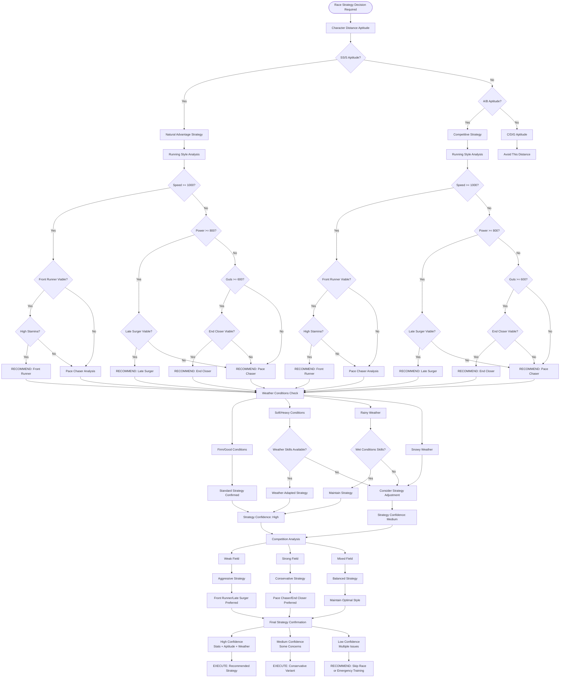
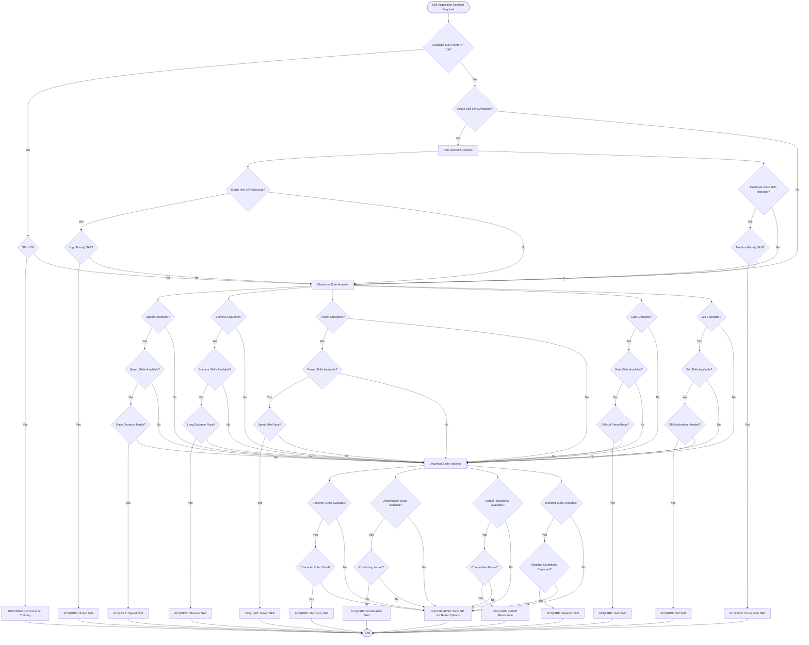
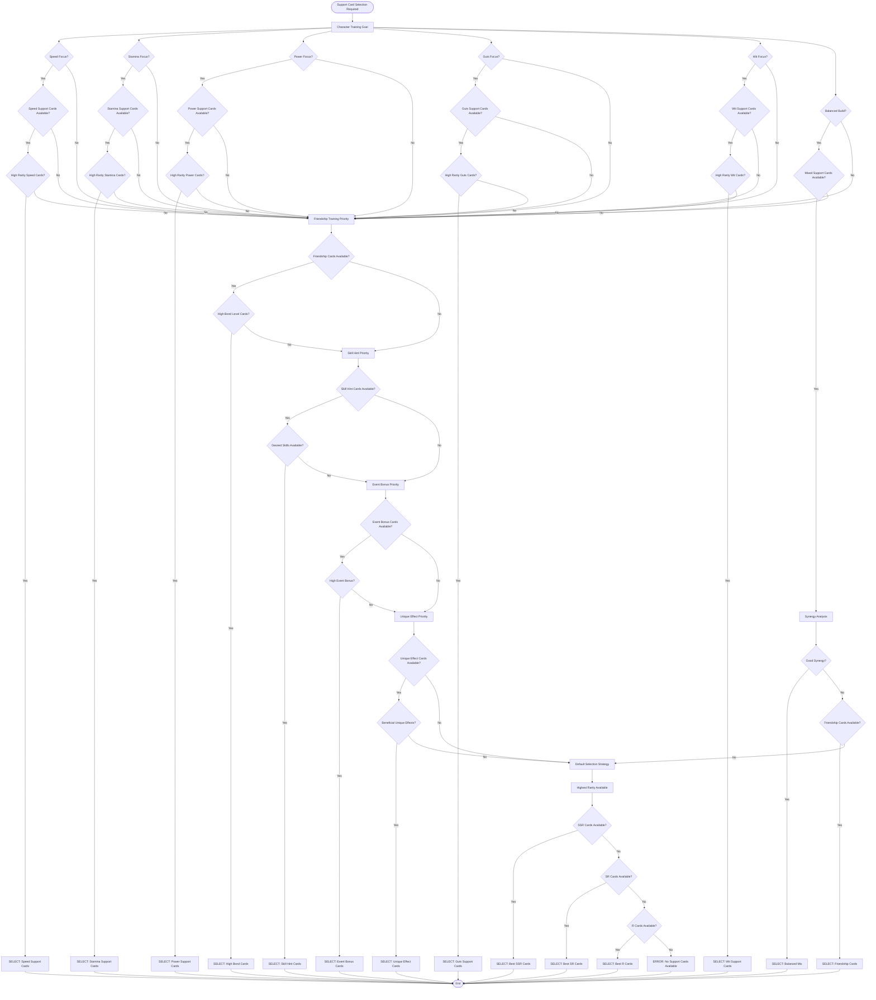
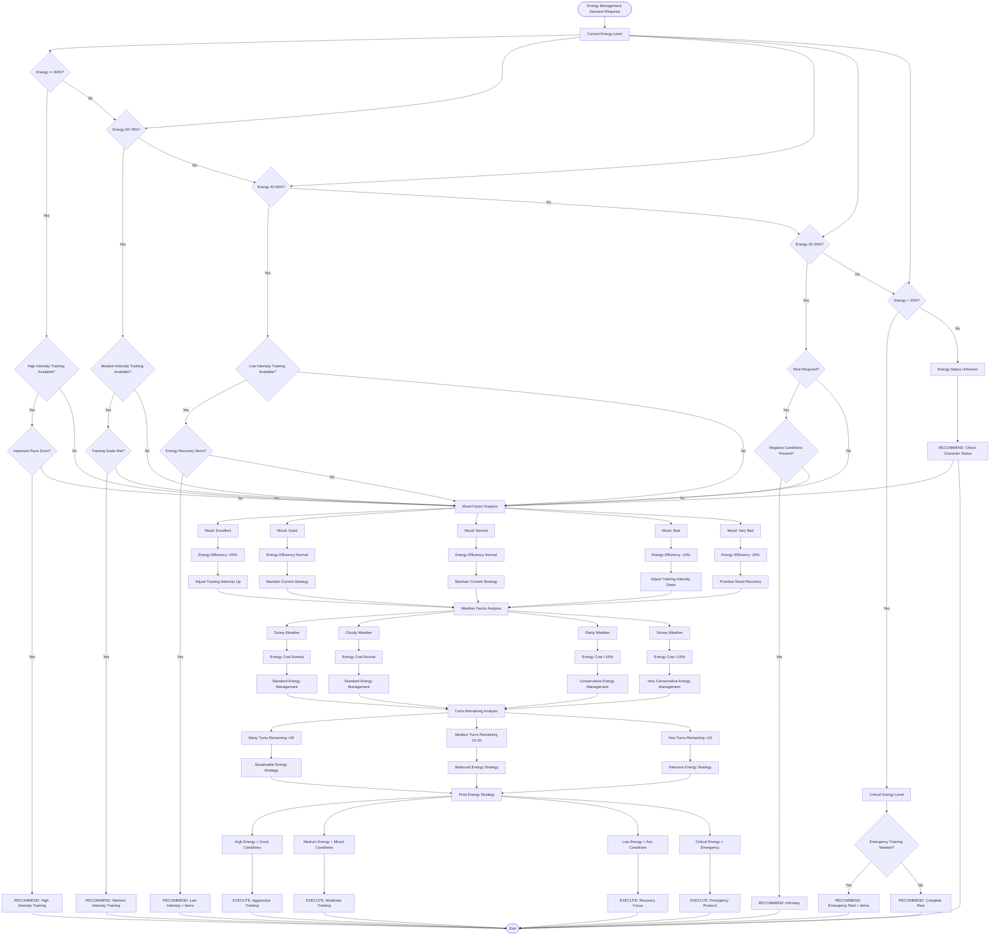

# Umamusume Career Planner - Decision Tree Flow Diagrams

## Overview

This document presents decision tree flow diagrams for the Umamusume Pretty Derby Career Planner application, showing the logical decision-making processes, conditional flows, and branching logic used throughout the system for optimal recommendations. The system leverages **Laravel 12** with **TypeScript support**, **AWS Bedrock Claude 4.5** models (Opus, Sonnet, Haiku), **AWS Bedrock Nova 2** (Lite, Pro), and **Ollama** for local AI processing to support all **60 comprehensive requirements**.

## 1. Training Option Selection Decision Tree

### Text Description

The core decision tree that evaluates all available training options and selects the optimal choice based on character state, goals, risks, and strategic considerations.

### ASCII Diagram

```
[Training Decision Required]
        |
        v
[Character Energy >= 50%?] -----> [No] -----> [Energy < 30%?] -----> [Yes] -----> [RECOMMEND: Rest]
        |                                            |
        [Yes]                                        [No]
        |                                            |
        v                                            v
[Negative Conditions Present?] -----> [Yes] -----> [Severe Conditions?] -----> [Yes] -----> [RECOMMEND: Infirmary]
        |                                                    |
        [No]                                                 [No]
        |                                                    |
        v                                                    v
[Mood <= Bad?] -----> [Yes] -----> [RECOMMEND: Recreation] [Continue to Training Analysis]
        |
        [No]
        |
        v
[Race Approaching (< 3 turns)?] -----> [Yes] -----> [Character Ready?] -----> [Yes] -----> [RECOMMEND: Rest/Light Training]
        |                                                    |
        [No]                                                 [No]
        |                                                    |
        v                                                    v
[Summer Camp Period?] -----> [Yes] -----> [Energy >= 70%?] -----> [Yes] -----> [Prioritize High-Value Training]
        |                                        |                                    |
        [No]                                     [No]                                 v
        |                                        |                            [Red "!" Available?] -----> [Yes] -----> [RECOMMEND: Red "!" Training]
        v                                        v                                    |
[Goal Priority Analysis]                 [RECOMMEND: Rest]                          [No]
        |                                                                           |
        +-----> [Speed Priority?] -----> [Yes] -----> [Speed Training Available?] -----> [Yes] -----> [Support Cards Present?] -----> [Yes] -----> [RECOMMEND: Speed Training]
        |                                                    |                                                |
        |                                                    [No]                                             [No]
        |                                                    |                                                |
        +-----> [Stamina Priority?] -----> [Yes] -----> [Stamina Training Available?] -----> [Yes] -----> [Friendship Training?] -----> [Yes] -----> [RECOMMEND: Stamina Training]
        |                                                    |                                                |
        |                                                    [No]                                             [No]
        |                                                    |                                                |
        +-----> [Power Priority?] -----> [Yes] -----> [Power Training Available?] -----> [Yes] -----> [Skill Hints Available?] -----> [Yes] -----> [RECOMMEND: Power Training]
        |                                                    |                                                |
        |                                                    [No]                                             [No]
        |                                                    |                                                |
        +-----> [Guts Priority?] -----> [Yes] -----> [Guts Training Available?] -----> [Yes] -----> [Low Risk Training?] -----> [Yes] -----> [RECOMMEND: Guts Training]
        |                                                    |                                                |
        |                                                    [No]                                             [No]
        |                                                    |                                                |
        +-----> [Wit Priority?] -----> [Yes] -----> [Wit Training Available?] -----> [Yes] -----> [Energy Recovery Needed?] -----> [Yes] -----> [RECOMMEND: Wit Training]
        |                                                    |                                                |
        [No to All]                                          [No]                                             [No]
        |                                                    |                                                |
        v                                                    v                                                v
[Balanced Training Approach] -----> [RECOMMEND: Highest Expected Value Training] <---------------------------+
```

### Mermaid Diagram

```mermaid
flowchart TD
    TrainingDecision([Training Decision Required]) --> EnergyCheck{Character Energy >= 50%?}
    
    EnergyCheck -->|No| LowEnergyCheck{Energy < 30%?}
    LowEnergyCheck -->|Yes| RecommendRest[RECOMMEND: Rest]
    LowEnergyCheck -->|No| ContinueToTraining[Continue to Training Analysis]
    
    EnergyCheck -->|Yes| ConditionsCheck{Negative Conditions Present?}
    ConditionsCheck -->|Yes| SevereConditions{Severe Conditions?}
    SevereConditions -->|Yes| RecommendInfirmary[RECOMMEND: Infirmary]
    SevereConditions -->|No| ContinueToTraining
    
    ConditionsCheck -->|No| MoodCheck{Mood <= Bad?}
    MoodCheck -->|Yes| RecommendRecreation[RECOMMEND: Recreation]
    MoodCheck -->|No| RaceApproaching{Race Approaching < 3 turns?}
    
    RaceApproaching -->|Yes| CharacterReady{Character Ready?}
    CharacterReady -->|Yes| RecommendRestLight[RECOMMEND: Rest/Light Training]
    CharacterReady -->|No| ContinueToTraining
    
    RaceApproaching -->|No| SummerCamp{Summer Camp Period?}
    SummerCamp -->|Yes| SummerEnergyCheck{Energy >= 70%?}
    SummerEnergyCheck -->|Yes| HighValueTraining[Prioritize High-Value Training]
    SummerEnergyCheck -->|No| RecommendRest2[RECOMMEND: Rest]
    
    HighValueTraining --> RedExclamationCheck{Red "!" Available?}
    RedExclamationCheck -->|Yes| RecommendRedTraining[RECOMMEND: Red "!" Training]
    RedExclamationCheck -->|No| GoalPriorityAnalysis[Goal Priority Analysis]
    
    SummerCamp -->|No| GoalPriorityAnalysis
    ContinueToTraining --> GoalPriorityAnalysis
    
    GoalPriorityAnalysis --> SpeedPriority{Speed Priority?}
    GoalPriorityAnalysis --> StaminaPriority{Stamina Priority?}
    GoalPriorityAnalysis --> PowerPriority{Power Priority?}
    GoalPriorityAnalysis --> GutsPriority{Guts Priority?}
    GoalPriorityAnalysis --> WitPriority{Wit Priority?}
    
    SpeedPriority -->|Yes| SpeedAvailable{Speed Training Available?}
    SpeedAvailable -->|Yes| SpeedSupportCards{Support Cards Present?}
    SpeedSupportCards -->|Yes| RecommendSpeed[RECOMMEND: Speed Training]
    SpeedSupportCards -->|No| BalancedApproach[Balanced Training Approach]
    SpeedAvailable -->|No| BalancedApproach
    
    StaminaPriority -->|Yes| StaminaAvailable{Stamina Training Available?}
    StaminaAvailable -->|Yes| FriendshipTraining{Friendship Training?}
    FriendshipTraining -->|Yes| RecommendStamina[RECOMMEND: Stamina Training]
    FriendshipTraining -->|No| BalancedApproach
    StaminaAvailable -->|No| BalancedApproach
    
    PowerPriority -->|Yes| PowerAvailable{Power Training Available?}
    PowerAvailable -->|Yes| SkillHintsAvailable{Skill Hints Available?}
    SkillHintsAvailable -->|Yes| RecommendPower[RECOMMEND: Power Training]
    SkillHintsAvailable -->|No| BalancedApproach
    PowerAvailable -->|No| BalancedApproach
    
    GutsPriority -->|Yes| GutsAvailable{Guts Training Available?}
    GutsAvailable -->|Yes| LowRiskTraining{Low Risk Training?}
    LowRiskTraining -->|Yes| RecommendGuts[RECOMMEND: Guts Training]
    LowRiskTraining -->|No| BalancedApproach
    GutsAvailable -->|No| BalancedApproach
    
    WitPriority -->|Yes| WitAvailable{Wit Training Available?}
    WitAvailable -->|Yes| EnergyRecoveryNeeded{Energy Recovery Needed?}
    EnergyRecoveryNeeded -->|Yes| RecommendWit[RECOMMEND: Wit Training]
    EnergyRecoveryNeeded -->|No| BalancedApproach
    WitAvailable -->|No| BalancedApproach
    
    BalancedApproach --> RecommendHighestValue[RECOMMEND: Highest Expected Value Training]
    
    %% All recommendations flow to end
    RecommendRest --> End([End])
    RecommendInfirmary --> End
    RecommendRecreation --> End
    RecommendRestLight --> End
    RecommendRest2 --> End
    RecommendRedTraining --> End
    RecommendSpeed --> End
    RecommendStamina --> End
    RecommendPower --> End
    RecommendGuts --> End
    RecommendWit --> End
    RecommendHighestValue --> End
```

## 2. Race Strategy Selection Decision Tree

### Text Description

The decision tree for selecting optimal race strategies based on character stats, aptitudes, race conditions, and competitive analysis.

### ASCII Diagram

```
[Race Strategy Decision Required]
        |
        v
[Character Distance Aptitude] -----> [SS/S Aptitude?] -----> [Yes] -----> [Natural Advantage Strategy]
        |                                    |                                    |
        v                                    [No]                                 v
[A/B Aptitude?] -----> [Yes] -----> [Competitive Strategy]          [Running Style Analysis]
        |                                    |                                    |
        [No]                                 v                                    v
        |                            [Running Style Analysis]          [Speed >= 1000?] -----> [Yes] -----> [Front Runner Viable?]
        v                                    |                                    |                                    |
[C/D/G Aptitude] -----> [Avoid This Distance] [Speed >= 1000?] -----> [Yes] -----> [Front Runner Viable?]    [No]                [Yes] -----> [High Stamina?] -----> [Yes] -----> [RECOMMEND: Front Runner]
                                            |                                    |                                    |                                    |
                                            [No]                                 [No]                                 [No]                                 [No]
                                            |                                    |                                    |                                    |
                                            v                                    v                                    v                                    v
                                    [Power >= 800?] -----> [Yes] -----> [Late Surger Viable?] -----> [Yes] -----> [RECOMMEND: Late Surger]    [Pace Chaser Analysis]
                                            |                                    |                                    |
                                            [No]                                 [No]                                 [No]
                                            |                                    |                                    |
                                            v                                    v                                    v
                                    [Guts >= 600?] -----> [Yes] -----> [End Closer Viable?] -----> [Yes] -----> [RECOMMEND: End Closer]
                                            |                                    |                                    |
                                            [No]                                 [No]                                 [No]
                                            |                                    |                                    |
                                            v                                    v                                    v
                                    [RECOMMEND: Pace Chaser] <-------------------+------------------------------------+
                                            |
                                            v
[Weather Conditions Check]
        |
        +-----> [Firm/Good Conditions] -----> [Standard Strategy Confirmed]
        |
        +-----> [Soft/Heavy Conditions] -----> [Weather Skills Available?] -----> [Yes] -----> [Weather-Adapted Strategy]
        |                                                |
        |                                                [No]
        |                                                |
        |                                                v
        +-----> [Rainy Weather] -----> [Wet Conditions Skills?] -----> [Yes] -----> [Maintain Strategy]
        |                                        |                                        |
        |                                        [No]                                     v
        |                                        |                                [Strategy Confidence: High]
        |                                        v
        +-----> [Snowy Weather] -----> [Consider Strategy Adjustment] -----> [Strategy Confidence: Medium]
        |
        v
[Competition Analysis]
        |
        +-----> [Weak Field] -----> [Aggressive Strategy] -----> [Front Runner/Late Surger Preferred]
        |
        +-----> [Strong Field] -----> [Conservative Strategy] -----> [Pace Chaser/End Closer Preferred]
        |
        +-----> [Mixed Field] -----> [Balanced Strategy] -----> [Maintain Optimal Style]
        |
        v
[Final Strategy Confirmation]
        |
        +-----> [High Confidence (Stats + Aptitude + Weather)] -----> [EXECUTE: Recommended Strategy]
        |
        +-----> [Medium Confidence (Some Concerns)] -----> [EXECUTE: Conservative Variant]
        |
        +-----> [Low Confidence (Multiple Issues)] -----> [RECOMMEND: Skip Race or Emergency Training]
```

### Mermaid Diagram



## 3. Skill Acquisition Decision Tree

### Text Description

The decision tree for determining optimal skill acquisition strategies based on character needs, available skill points, skill hints, and strategic priorities.

### ASCII Diagram

```text
[Skill Acquisition Decision Required]
        |
        v
[Available Skill Points >= 100?] -----> [No] -----> [SP < 50?] -----> [Yes] -----> [RECOMMEND: Focus on Training]
        |                                            |
        [Yes]                                        [No]
        |                                            |
        v                                            v
[Active Skill Hints Available?] -----> [Yes] -----> [Hint Discount Analysis]
        |                                            |
        [No]                                         +-----> [Single Hint (20% discount)?] -----> [Yes] -----> [High Priority Skill?] -----> [Yes] -----> [ACQUIRE: Hinted Skill]
        |                                            |                                                                |                                    |
        v                                            |                                                                [No]                                 [No]
[Character Role Analysis]                            +-----> [Duplicate Hints (40% discount)?] -----> [Yes] -----> [Medium Priority Skill?] -----> [Yes] -----> [ACQUIRE: Discounted Skill]
        |                                            |                                                                |                                    |
        +-----> [Speed Character?] -----> [Yes] -----> [Speed Skills Available?] -----> [Yes] -----> [Race Distance Match?] -----> [Yes] -----> [ACQUIRE: Speed Skill]
        |                                            |                                            |                                    |
        |                                            [No]                                         [No]                                 [No]
        |                                            |                                            |                                    |
        +-----> [Stamina Character?] -----> [Yes] -----> [Stamina Skills Available?] -----> [Yes] -----> [Long Distance Race?] -----> [Yes] -----> [ACQUIRE: Stamina Skill]
        |                                            |                                            |                                    |
        |                                            [No]                                         [No]                                 [No]
        |                                            |                                            |                                    |
        +-----> [Power Character?] -----> [Yes] -----> [Power Skills Available?] -----> [Yes] -----> [Sprint/Mile Race?] -----> [Yes] -----> [ACQUIRE: Power Skill]
        |                                            |                                            |                                    |
        |                                            [No]                                         [No]                                 [No]
        |                                            |                                            |                                    |
        +-----> [Guts Character?] -----> [Yes] -----> [Guts Skills Available?] -----> [Yes] -----> [Difficult Race Ahead?] -----> [Yes] -----> [ACQUIRE: Guts Skill]
        |                                            |                                            |                                    |
        |                                            [No]                                         [No]                                 [No]
        |                                            |                                            |                                    |
        +-----> [Wit Character?] -----> [Yes] -----> [Wit Skills Available?] -----> [Yes] -----> [Skill Activation Needed?] -----> [Yes] -----> [ACQUIRE: Wit Skill]
        |                                            |                                            |                                    |
        [No to All]                                  [No]                                         [No]                                 [No]
        |                                            |                                            |                                    |
        v                                            v                                            v                                    v
[Universal Skills Analysis]                          |                                            |                                    |
        |                                            |                                            |                                    |
        +-----> [Recovery Skills Available?] -----> [Yes] -----> [Character Often Tired?] -----> [Yes] -----> [ACQUIRE: Recovery Skill] <---------+
        |                                            |                                            |                                    |
        |                                            [No]                                         [No]                                 |
        |                                            |                                            |                                    |
        +-----> [Acceleration Skills Available?] -----> [Yes] -----> [Positioning Issues?] -----> [Yes] -----> [ACQUIRE: Acceleration Skill] <----+
        |                                            |                                            |                                    |
        |                                            [No]                                         [No]                                 |
        |                                            |                                            |                                    |
        +-----> [Debuff Resistance Available?] -----> [Yes] -----> [Competitive Races?] -----> [Yes] -----> [ACQUIRE: Debuff Resistance] <------+
        |                                            |                                            |                                    |
        |                                            [No]                                         [No]                                 |
        |                                            |                                            |                                    |
        +-----> [Weather Skills Available?] -----> [Yes] -----> [Weather Conditions Expected?] -----> [Yes] -----> [ACQUIRE: Weather Skill] <---+
        |                                            |                                            |
        [No to All]                                  [No]                                         [No]
        |                                            |                                            |
        v                                            v                                            v
[RECOMMEND: Save SP for Better Options] <------------+--------------------------------------------+
```

### Mermaid Diagram



## 4. Support Card Selection Decision Tree

### Text Description

The decision tree for selecting optimal support card combinations based on character goals, training priorities, available cards, and synergy effects.

### ASCII Diagram

```text
[Support Card Selection Required]
        |
        v
[Character Training Goal] -----> [Speed Focus?] -----> [Yes] -----> [Speed Support Cards Available?] -----> [Yes] -----> [High Rarity Speed Cards?] -----> [Yes] -----> [SELECT: Speed Support Cards]
        |                                |                                    |                                                |                                    |
        |                                [No]                                 [No]                                             [No]                                 [No]
        |                                |                                    |                                                |                                    |
        +-----> [Stamina Focus?] -----> [Yes] -----> [Stamina Support Cards Available?] -----> [Yes] -----> [High Rarity Stamina Cards?] -----> [Yes] -----> [SELECT: Stamina Support Cards]
        |                                |                                    |                                                |                                    |
        |                                [No]                                 [No]                                             [No]                                 [No]
        |                                |                                    |                                                |                                    |
        +-----> [Power Focus?] -----> [Yes] -----> [Power Support Cards Available?] -----> [Yes] -----> [High Rarity Power Cards?] -----> [Yes] -----> [SELECT: Power Support Cards]
        |                                |                                    |                                                |                                    |
        |                                [No]                                 [No]                                             [No]                                 [No]
        |                                |                                    |                                                |                                    |
        +-----> [Guts Focus?] -----> [Yes] -----> [Guts Support Cards Available?] -----> [Yes] -----> [High Rarity Guts Cards?] -----> [Yes] -----> [SELECT: Guts Support Cards]
        |                                |                                    |                                                |                                    |
        |                                [No]                                 [No]                                             [No]                                 [No]
        |                                |                                    |                                                |                                    |
        +-----> [Wit Focus?] -----> [Yes] -----> [Wit Support Cards Available?] -----> [Yes] -----> [High Rarity Wit Cards?] -----> [Yes] -----> [SELECT: Wit Support Cards]
        |                                |                                    |                                                |                                    |
        |                                [No]                                 [No]                                             [No]                                 [No]
        |                                |                                    |                                                |                                    |
        +-----> [Balanced Build?] -----> [Yes] -----> [Mixed Support Cards Available?] -----> [Yes] -----> [Synergy Analysis] -----> [Good Synergy?] -----> [Yes] -----> [SELECT: Balanced Mix]
        |                                |                                    |                                    |                                    |
        [No to All]                      [No]                                 [No]                                 |                                    [No]
        |                                |                                    |                                    |                                    |
        v                                v                                    v                                    v                                    v
[Friendship Training Priority]           |                                    |                            [Friendship Cards Available?] -----> [Yes] -----> [SELECT: Friendship Cards]
        |                                |                                    |                                    |                                    |
        +-----> [Friendship Cards Available?] -----> [Yes] -----> [High Bond Level Cards?] -----> [Yes] -----> [SELECT: High Bond Cards] <---------+    [No]
        |                                |                                    |                                    |                                    |
        |                                [No]                                 [No]                                 [No]                                 |
        |                                |                                    |                                    |                                    |
        +-----> [Skill Hint Priority] -----> [Skill Hint Cards Available?] -----> [Yes] -----> [Desired Skills Available?] -----> [Yes] -----> [SELECT: Skill Hint Cards] <--+
        |                                |                                    |                                    |
        |                                [No]                                 [No]                                 [No]
        |                                |                                    |                                    |
        +-----> [Event Bonus Priority] -----> [Event Bonus Cards Available?] -----> [Yes] -----> [High Event Bonus?] -----> [Yes] -----> [SELECT: Event Bonus Cards]
        |                                |                                    |                                    |
        |                                [No]                                 [No]                                 [No]
        |                                |                                    |                                    |
        +-----> [Unique Effect Priority] -----> [Unique Effect Cards Available?] -----> [Yes] -----> [Beneficial Unique Effects?] -----> [Yes] -----> [SELECT: Unique Effect Cards]
        |                                |                                    |                                    |
        [No to All]                      [No]                                 [No]                                 [No]
        |                                |                                    |                                    |
        v                                v                                    v                                    v
[Default Selection Strategy]             |                                    |                                    |
        |                                |                                    |                                    |
        +-----> [Highest Rarity Available] -----> [SSR Cards Available?] -----> [Yes] -----> [SELECT: Best SSR Cards] <-----------+
        |                                |                                    |
        |                                [No]                                 [No]
        |                                |                                    |
        +-----> [SR Cards Available?] -----> [Yes] -----> [SELECT: Best SR Cards] <---------+
        |                                |                                    |
        |                                [No]                                 [No]
        |                                |                                    |
        +-----> [R Cards Available?] -----> [Yes] -----> [SELECT: Best R Cards] <----------+
        |                                |
        [No Cards Available]             [No]
        |                                |
        v                                v
[ERROR: No Support Cards Available] <----+
```

### Mermaid Diagram



## 5. Energy Management Decision Tree

### Text Description

The decision tree for managing character energy levels throughout training, balancing training intensity with rest and recovery needs.

### ASCII Diagram

```text
[Energy Management Decision Required]
        |
        v
[Current Energy Level] -----> [Energy >= 80%?] -----> [Yes] -----> [High Intensity Training Available?] -----> [Yes] -----> [Important Race Soon?] -----> [Yes] -----> [RECOMMEND: High Intensity Training]
        |                                |                                    |                                                |                                    |
        |                                [No]                                 [No]                                             [No]                                 [No]
        |                                |                                    |                                                |                                    |
        +-----> [Energy 60-79%?] -----> [Yes] -----> [Medium Intensity Training Available?] -----> [Yes] -----> [Training Goals Met?] -----> [Yes] -----> [RECOMMEND: Medium Intensity Training]
        |                                |                                    |                                                |                                    |
        |                                [No]                                 [No]                                             [No]                                 [No]
        |                                |                                    |                                                |                                    |
        +-----> [Energy 40-59%?] -----> [Yes] -----> [Low Intensity Training Available?] -----> [Yes] -----> [Energy Recovery Items?] -----> [Yes] -----> [RECOMMEND: Low Intensity + Items]
        |                                |                                    |                                                |                                    |
        |                                [No]                                 [No]                                             [No]                                 [No]
        |                                |                                    |                                                |                                    |
        +-----> [Energy 20-39%?] -----> [Yes] -----> [Rest Required?] -----> [Yes] -----> [Negative Conditions Present?] -----> [Yes] -----> [RECOMMEND: Infirmary]
        |                                |                                    |                                                |                                    |
        |                                [No]                                 [No]                                             [No]                                 [No]
        |                                |                                    |                                                |                                    |
        +-----> [Energy < 20%?] -----> [Yes] -----> [Critical Energy Level] -----> [Emergency Training Needed?] -----> [Yes] -----> [RECOMMEND: Emergency Rest + Items]
        |                                |                                    |                                                |
        [No]                             [No]                                 |                                                [No]
        |                                |                                    |                                                |
        v                                v                                    v                                                v
[Energy Status Unknown] -----> [RECOMMEND: Check Character Status] <---------+                                [RECOMMEND: Complete Rest]
        |                                |
        v                                v
[Mood Factor Analysis]           [Turn Economy Analysis]
        |                                |
        +-----> [Mood: Excellent] -----> [Energy Efficiency +20%] -----> [Adjust Training Intensity Up]
        |                                |
        +-----> [Mood: Good] -----> [Energy Efficiency Normal] -----> [Maintain Current Strategy]
        |                                |
        +-----> [Mood: Normal] -----> [Energy Efficiency Normal] -----> [Maintain Current Strategy]
        |                                |
        +-----> [Mood: Bad] -----> [Energy Efficiency -10%] -----> [Adjust Training Intensity Down]
        |                                |
        +-----> [Mood: Very Bad] -----> [Energy Efficiency -20%] -----> [Prioritize Mood Recovery]
        |                                |
        v                                v
[Weather Factor Analysis]        [Turns Remaining Analysis]
        |                                |
        +-----> [Sunny Weather] -----> [Energy Cost Normal] -----> [Standard Energy Management]
        |                                |
        +-----> [Cloudy Weather] -----> [Energy Cost Normal] -----> [Standard Energy Management]
        |                                |
        +-----> [Rainy Weather] -----> [Energy Cost +10%] -----> [Conservative Energy Management]
        |                                |
        +-----> [Snowy Weather] -----> [Energy Cost +15%] -----> [Very Conservative Energy Management]
        |                                |
        v                                +-----> [Many Turns Remaining (>20)] -----> [Sustainable Energy Strategy]
[Final Energy Strategy]                  |
        |                                +-----> [Medium Turns Remaining (10-20)] -----> [Balanced Energy Strategy]
        +-----> [High Energy + Good Conditions] -----> [EXECUTE: Aggressive Training]
        |                                +-----> [Few Turns Remaining (<10)] -----> [Intensive Energy Strategy]
        +-----> [Medium Energy + Mixed Conditions] -----> [EXECUTE: Moderate Training]
        |                                |
        +-----> [Low Energy + Any Conditions] -----> [EXECUTE: Recovery Focus] <----+
        |
        +-----> [Critical Energy + Emergency] -----> [EXECUTE: Emergency Protocol]
```

### Mermaid Diagram



## Summary

This document provides comprehensive decision tree flow diagrams for the Umamusume Pretty Derby Career Planner application, covering the five critical decision-making processes:

1. **Training Option Selection** - The core optimization engine that evaluates all available training options based on character state, energy levels, conditions, goals, and strategic priorities.

2. **Race Strategy Selection** - Determines optimal racing strategies by analyzing character aptitudes, stats, weather conditions, and competitive field strength.

3. **Skill Acquisition** - Guides skill point spending decisions based on available hints, character role, strategic priorities, and cost-benefit analysis.

4. **Support Card Selection** - Optimizes support card combinations considering character goals, card synergies, friendship levels, and available bonuses.

5. **Energy Management** - Balances training intensity with energy conservation, factoring in mood, weather, turn economy, and strategic timing.

Each decision tree includes both ASCII diagrams for technical documentation and Mermaid diagrams for visual presentation, providing comprehensive logical flows that can be implemented in the application's recommendation engine.
