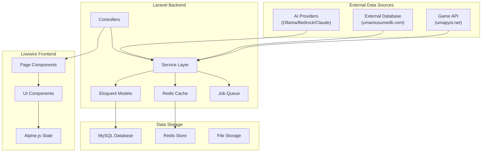
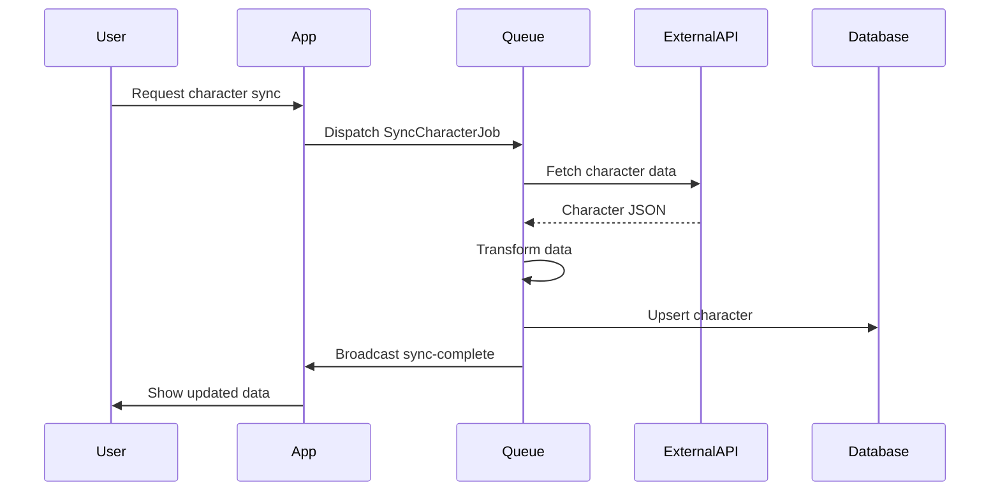
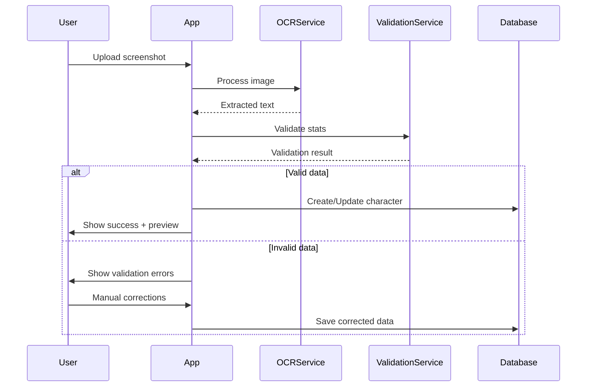

# Data Flow Mapping - Component Data Requirements

**Document Version**: 1.0.0  
**Date**: January 28, 2026  
**Status**: Active Design Document  
**Related Documents**: [component-inventory.md], [TECH-FLOW-001], [TECH-FLOW-007]

---

## Overview

This document maps data flow between UI components, backend services, and external APIs. It defines data requirements, state management patterns, and real-time update mechanisms for the Umamusume Career Planner.

---

## 1. High-Level Data Architecture



---

## 2. Component Data Requirements

### 2.1 Character Management Data

#### CharacterCard Component

```php
// Required Data
[
    'id' => int,
    'name' => string,
    'image_url' => string,
    'stars' => int,            // 1-5
    'potential_level' => int,  // 1-9
    'current_stats' => [
        'speed' => int,
        'stamina' => int,
        'power' => int,
        'guts' => int,
        'wit' => int,
    ],
    'career_stage' => string,  // 'Junior', 'Classic', 'Senior'
    'current_turn' => int,
    'total_turns' => int,
]
```

**Data Source**: `CharacterRepository::getForDashboard()`

**Cache Strategy**:

- Key: `user:{userId}:characters`
- TTL: 5 minutes
- Invalidation: On character update

#### CharacterProfile Component

```php
// Required Data
[
    'character' => Character,
    'bond_level' => int,
    'total_fans' => int,
    'careers_completed' => int,
    'about_text' => string,
    'outfits' => Collection,
    'memories' => [
        'profile_unlocked' => bool,
        'album_count' => int,
        'stories_count' => int,
        'videos_count' => int,
        'voices_count' => int,
        'epithets_count' => int,
    ],
]
```

**Data Source**: `CharacterService::getFullProfile()`

---

### 2.2 Stats Display Data

#### StatBar Component

```php
// Required Data
[
    'stat_type' => string,     // 'speed', 'stamina', 'power', 'guts', 'wit'
    'current_value' => int,
    'max_value' => int,        // Default: 1200
    'grade' => string,         // 'S', 'A', 'B', 'C', 'D', 'E', 'F', 'G'
    'factor_bonus' => int,     // Inherited bonus
    'color' => string,         // CSS color token
]
```

**Grade Calculation**:

```php
function calculateGrade(int $value): string {
    return match(true) {
        $value >= 1200 => 'SS',  // Not used in game, reserved
        $value >= 1000 => 'S',
        $value >= 850 => 'A',
        $value >= 700 => 'B',
        $value >= 550 => 'C',
        $value >= 400 => 'D',
        $value >= 250 => 'E',
        $value >= 100 => 'F',
        default => 'G',
    };
}
```

#### ConditionBadge Component

```php
// Required Data
[
    'condition' => string,  // 'GREAT', 'GOOD', 'NORMAL', 'BAD'
    'trend' => string,      // 'up', 'flat', 'down'
    'turns_active' => int,  // How long current condition
]
```

**Condition Mapping**:

| Condition | Color Token  | Icon | ARIA Label                                |
| --------- | ------------ | ---- | ----------------------------------------- |
| GREAT     | `pink-500`   | `↑↑` | "Great condition - maximum performance"   |
| GOOD      | `sky-400`    | `↑`  | "Good condition - improved performance"   |
| NORMAL    | `orange-500` | `→`  | "Normal condition - standard performance" |
| BAD       | `red-500`    | `↓`  | "Bad condition - reduced performance"     |

---

### 2.3 Career Status Data

#### TurnCounter Component

```php
// Required Data
[
    'current_turn' => int,
    'total_turns' => int,       // 78 for full career
    'career_stage' => string,   // 'Junior', 'Classic', 'Senior'
    'period' => string,         // 'Pre-Debut', 'Early Apr', etc.
    'is_race_day' => bool,
    'is_finished' => bool,
]
```

**Stage Calculation**:

```php
function getCareerStage(int $turn): array {
    return match(true) {
        $turn <= 24 => ['stage' => 'Junior', 'year' => 1],
        $turn <= 48 => ['stage' => 'Classic', 'year' => 2],
        $turn <= 72 => ['stage' => 'Senior', 'year' => 3],
        default => ['stage' => 'URA Finals', 'year' => 3],
    };
}
```

#### EnergyGauge Component

```php
// Required Data
[
    'current_energy' => int,    // 0-100
    'max_energy' => int,        // 100
    'trend' => string,          // 'increasing', 'stable', 'decreasing'
    'recovery_rate' => int,     // Per-turn recovery
]
```

---

### 2.4 Support Card Data

#### SupportCard Component

```php
// Required Data
[
    'id' => int,
    'name' => string,
    'character_name' => string,
    'image_url' => string,
    'rarity' => string,          // 'SSR', 'SR', 'R'
    'type' => string,            // 'Speed', 'Stamina', 'Power', 'Guts', 'Wit', 'Friend'
    'level' => int,              // 1-50
    'limit_break' => int,        // 0-4
    'bond_level' => int,         // 0-100
    'effects' => [
        'friendship_bonus' => float,
        'mood_effect' => float,
        'initial_friendship' => int,
        'race_bonus' => float,
        'support_bonus' => float,
    ],
    'unique_perk' => string,
]
```

**Data Source**: `SupportCardRepository::getWithEffects()`

#### DeckBuilder Component

```php
// Required Data
[
    'slots' => [
        ['position' => 1, 'card' => SupportCard|null, 'is_main' => true],
        ['position' => 2, 'card' => SupportCard|null, 'is_main' => true],
        ['position' => 3, 'card' => SupportCard|null, 'is_main' => true],
        ['position' => 4, 'card' => SupportCard|null, 'is_main' => false],
        ['position' => 5, 'card' => SupportCard|null, 'is_main' => false],
        ['position' => 6, 'card' => SupportCard|null, 'is_main' => false],
    ],
    'type_totals' => [
        'Speed' => int,
        'Stamina' => int,
        'Power' => int,
        'Guts' => int,
        'Wit' => int,
        'Friend' => int,
    ],
    'deck_score' => float,
    'synergy_bonuses' => Collection,
]
```

---

### 2.5 Skill Data

#### SkillCard Component

```php
// Required Data
[
    'id' => int,
    'name' => string,
    'description' => string,
    'icon_url' => string,
    'type' => string,           // 'Passive', 'Recovery', 'Speed', etc.
    'rarity' => string,         // 'Unique', 'Rare', 'Normal'
    'base_sp_cost' => int,
    'hint_level' => int,        // 0-5
    'discounted_cost' => int,   // After hint discount
    'is_acquired' => bool,
    'is_available' => bool,     // Has hints to unlock
    'activation_conditions' => array,
]
```

**Hint Discount Calculation**:

```php
function calculateHintDiscount(int $baseСost, int $hintLevel): int {
    $discountRate = match($hintLevel) {
        1 => 0.10,  // 10%
        2 => 0.20,  // 20%
        3 => 0.30,  // 30%
        4 => 0.35,  // 35%
        5 => 0.40,  // 40% max
        default => 0.00,
    };

    return (int) round($baseCost * (1 - $discountRate));
}
```

---

### 2.6 Race Data

#### RaceCard Component

```php
// Required Data
[
    'id' => int,
    'name' => string,
    'grade' => string,          // 'G1', 'G2', 'G3', 'OP'
    'distance' => int,          // meters
    'surface' => string,        // 'Turf', 'Dirt'
    'date' => Carbon,
    'track_condition' => string, // 'Firm', 'Good', 'Soft', 'Heavy'
    'readiness_score' => float, // 0-100
    'win_probability' => float, // 0-100
    'days_until' => int,
    'entry_criteria_met' => bool,
]
```

#### ClassPyramid Component

```php
// Required Data
[
    'current_class' => string,  // 'Legend', 'Top Star', etc.
    'current_fans' => int,
    'class_thresholds' => [
        'Legend' => 320000,
        'Top Star' => 240000,
        'Star' => 160000,
        'Platinum' => 100000,
        'Gold' => 50000,
        'Silver' => 20000,
        'Bronze' => 5000,
        'Beginner' => 1,
        'Debut' => 0,
    ],
    'next_class' => string,
    'fans_to_next' => int,
]
```

---

## 3. Real-Time Data Flows

### 3.1 WebSocket Events

```javascript
// Event: Character Stats Updated
Echo.private(`character.${characterId}`)
    .listen('StatsUpdated', (event) => {
        // Payload
        {
            character_id: int,
            stats: {
                speed: int,
                stamina: int,
                power: int,
                guts: int,
                wit: int,
            },
            turn: int,
            timestamp: string,
        }
    });

// Event: Training Completed
Echo.private(`character.${characterId}`)
    .listen('TrainingCompleted', (event) => {
        // Payload
        {
            character_id: int,
            facility: string,
            gains: object,
            support_cards: array,
            new_hints: array,
        }
    });

// Event: Race Result
Echo.private(`character.${characterId}`)
    .listen('RaceCompleted', (event) => {
        // Payload
        {
            character_id: int,
            race_id: int,
            placement: int,
            rewards: object,
            fans_gained: int,
        }
    });
```

### 3.2 Livewire Event Bus

```php
// Events dispatched within components
$this->dispatch('character-updated', characterId: $id);
$this->dispatch('goal-added', goalId: $goal->id);
$this->dispatch('deck-updated', deckId: $deck->id);
$this->dispatch('skill-acquired', skillId: $skill->id);
$this->dispatch('training-selected', facility: $facility);
$this->dispatch('race-entered', raceId: $race->id);

// Component listeners
protected $listeners = [
    'character-updated' => 'refreshCharacter',
    'training-completed' => 'handleTrainingCompleted',
    'stats-changed' => 'updateStats',
];
```

---

## 4. Service Layer Data Providers

### 4.1 Repository Pattern

```php
interface CharacterRepositoryInterface
{
    public function getForDashboard(int $userId): Collection;
    public function getWithStats(int $characterId): Character;
    public function getCareerRuns(int $characterId): Collection;
    public function updateStats(int $characterId, array $stats): void;
}

interface SupportCardRepositoryInterface
{
    public function getAll(): Collection;
    public function getByType(string $type): Collection;
    public function getWithEffects(int $cardId): SupportCard;
    public function getUserCollection(int $userId): Collection;
}

interface SkillRepositoryInterface
{
    public function getAvailable(int $characterId): Collection;
    public function getAcquired(int $characterId): Collection;
    public function getWithHints(int $characterId): Collection;
}

interface RaceRepositoryInterface
{
    public function getUpcoming(int $characterId, int $limit = 3): Collection;
    public function getCalendar(Carbon $startDate, Carbon $endDate): Collection;
    public function getHistory(int $characterId): Collection;
}
```

### 4.2 Service Methods

```php
class TrainingService
{
    public function getPredictions(Character $character): array;
    public function calculateGains(Character $character, string $facility): array;
    public function executeTraining(Character $character, string $facility): TrainingResult;
}

class RaceService
{
    public function calculateReadiness(Character $character, Race $race): float;
    public function calculateWinProbability(Character $character, Race $race): float;
    public function enterRace(Character $character, Race $race): RaceEntry;
    public function resolveRace(RaceEntry $entry): RaceResult;
}

class SkillService
{
    public function calculateCost(Skill $skill, int $hintLevel): int;
    public function acquireSkill(Character $character, Skill $skill): void;
    public function getRecommended(Character $character): Collection;
}

class AIAdvisorService
{
    public function getRecommendation(Character $character, string $context): AIRecommendation;
    public function analyzeTraining(Character $character): TrainingAdvice;
    public function analyzeRaceStrategry(Character $character, Race $race): RaceAdvice;
}
```

---

## 5. External API Integration

### 5.1 Game Data Sync



### 5.2 OCR Import Flow



---

## 6. State Management

### 6.1 Livewire Component State

```php
class CharacterDetailPage extends Component
{
    // Persistent Properties (survive re-renders)
    public Character $character;
    public CareerRun $careerRun;

    // Session Properties (survives page refresh)
    #[Session]
    public string $activeTab = 'overview';

    // URL Properties (bookmarkable)
    #[Url]
    public ?string $filter = null;

    // Computed Properties (cached per request)
    #[Computed]
    public function upcomingRaces(): Collection
    {
        return $this->character->upcomingRaces()->take(3)->get();
    }
}
```

### 6.2 Alpine.js Client State

```javascript
// Component-local state
Alpine.data("deckBuilder", () => ({
    // UI State
    selectedSlot: null,
    showCardPicker: false,
    isSaving: false,

    // Derived State
    get isComplete() {
        return this.slots.filter((s) => s.card).length === 6;
    },

    // Actions
    selectSlot(position) {
        this.selectedSlot = position;
        this.showCardPicker = true;
    },

    async assignCard(cardId) {
        this.isSaving = true;
        await $wire.assignCard(this.selectedSlot, cardId);
        this.showCardPicker = false;
        this.isSaving = false;
    },
}));
```

---

## 7. Caching Strategy

### 7.1 Redis Cache Layers

| Data Type         | Cache Key Pattern        | TTL    | Invalidation        |
| ----------------- | ------------------------ | ------ | ------------------- |
| Character list    | `user:{id}:characters`   | 5 min  | On character change |
| Character stats   | `character:{id}:stats`   | 1 min  | On stat update      |
| Support cards DB  | `support_cards:all`      | 1 hour | On data import      |
| User deck         | `user:{id}:deck:{id}`    | 30 min | On deck edit        |
| Race calendar     | `races:calendar:{month}` | 1 hour | On race data update |
| Skill catalog     | `skills:all`             | 1 hour | On data import      |
| AI recommendation | `ai:{id}:recommendation` | 10 min | On new request      |

### 7.2 Cache Warming

```php
// Scheduled cache warm-up
class WarmCacheCommand extends Command
{
    protected $signature = 'cache:warm';

    public function handle()
    {
        // Warm support cards
        Cache::put('support_cards:all', SupportCard::with('effects')->get(), now()->addHour());

        // Warm skills catalog
        Cache::put('skills:all', Skill::with('requirements')->get(), now()->addHour());

        // Warm race calendar (current + next month)
        $this->warmRaceCalendar(now());
        $this->warmRaceCalendar(now()->addMonth());
    }
}
```

---

## 8. Error Handling

### 8.1 Data Validation

```php
class CharacterStatsValidator
{
    public function validate(array $stats): ValidationResult
    {
        $rules = [
            'speed' => 'integer|min:0|max:2000',
            'stamina' => 'integer|min:0|max:2000',
            'power' => 'integer|min:0|max:2000',
            'guts' => 'integer|min:0|max:2000',
            'wit' => 'integer|min:0|max:2000',
        ];

        return Validator::make($stats, $rules);
    }
}
```

### 8.2 Fallback Data

```php
class ComponentDataProvider
{
    public function getCharacterWithFallback(int $id): array
    {
        try {
            return $this->repository->getWithStats($id);
        } catch (Exception $e) {
            Log::warning('Failed to load character', ['id' => $id, 'error' => $e->getMessage()]);

            return [
                'id' => $id,
                'name' => 'Loading...',
                'stats' => ['speed' => 0, 'stamina' => 0, 'power' => 0, 'guts' => 0, 'wit' => 0],
                '_error' => true,
            ];
        }
    }
}
```

---

## Document Control

**Version History**:

| Version | Date       | Changes                   |
| ------- | ---------- | ------------------------- |
| 1.0.0   | 2026-01-28 | Initial data flow mapping |

**Related Documents**:

- [component-inventory.md](component-inventory.md)
- [TECH-FLOW-001](../01-tech-flow/TECH-FLOW-001_Character_Management_Flow.md)
- [TECH-FLOW-007](../01-tech-flow/TECH-FLOW-007_External_Integration_Flow.md)
